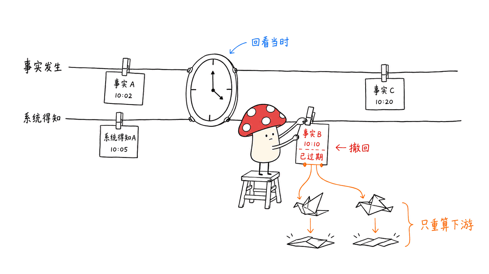
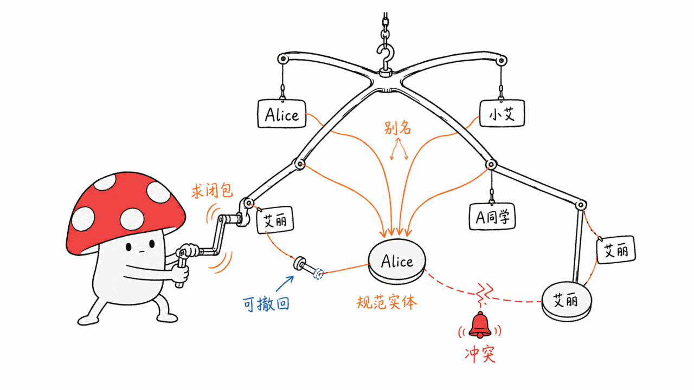
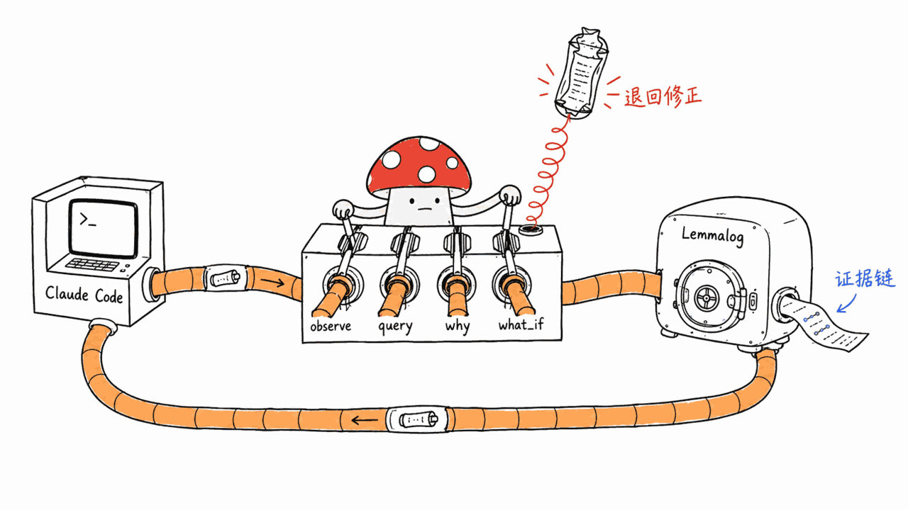

项目地址：https://github.com/JordyZomer/lemmalog
许可：MIT ｜ 语言：Rust ｜ 创建于 2026-08-27，本文写作时刚满一周，仍在每天更新

## BLUF

Lemmalog 的主张很直接：**agent 的记忆不该是"存得更多、检索得更准"的向量库，而应该是一个可演绎的数据库**。LLM 只负责在数据摄入的边界把对话断言成结构化事实（`Alice --works_at--> Acme`），剩下的全部交给 Datalog 引擎——闭包推导、时序投影（这件事现在还成立吗）、矛盾检测、相关性扩散，都是规则算出来的确定性结果，而不是每次查询都让 LLM 重新"回忆"一遍。每一条派生事实都带着 provenance，能一路追溯回它最初来自哪句话。

这不是纸上概念——README 里贴了三个标准基准（LongMemEval、ProsusAI MemEval、LoCoMo）的实测分数，还老实写了哪次配置改进有效、哪次改坏了、为什么。这种"诚实状态日志"式的写法在雷达抓到的项目里不多见。

## 现有 agent 记忆系统卡在哪

本站之前写过的几个记忆项目——Belief Context Graph（置信度感知的信念图）、Dense-Mem（证据链+权限治理）——已经在往"检索之外"走，加了置信度和证据溯源。但它们本质上仍然是**图存储 + 检索**：结构变复杂了，推理能力却没有变。

Lemmalog 的设计文档把这个问题说得更狠：当前主流记忆系统（Zep/Graphiti、Mem0、GraphRAG、Letta）存的是"抽取出来的事实"，但**什么都不演绎**——闭包、继承、矛盾检测、后果传播，要么每次查询都重新丢给 LLM 算一遍（贵、不稳定），要么干脆没有。LongMemEval 论文（arXiv:2410.10813）也指出，知识更新和时序推理是当前大模型记忆能力里表现最差的两项，掉分 21%-30%——根源是大多数记忆系统没有一个"原则性的替代模型"：一个事实过期了，到底该怎么处理，全靠运气。


## 架构：LLM 只在摄取边界，其余全是纯函数

```
Agent/LLM 对话循环
    │ 断言事实 (S --rel[conf]--> O)
    ▼
Lemmalog 引擎 (Rust)
  ├─ Store: 双时态关系 (valid_from/valid_to/asserted_at) + 半环标注 (置信度×来源)
  ├─ Evaluator: seminaive 增量不动点 + 分层 (stratified) + magic-sets 按需求值
  └─ Rule registry: 运行时热加载的规则批次，可版本化回滚
    │ 变更流 (change log)
    ▼
派生视图：当前事实、相关性、矛盾候选、支持证据、显著度
```

关键的架构决定是：**LLM 严格待在摄取边界之外，不动函数的不动点计算是纯的**。设计文档专门强调了这一点——目前没有哪个成熟系统把 LLM 调用塞进 Datalog 的不动点循环内部，因为 LLM 调用非单调、又贵。Lemmalog 通过严格分层和记忆化把 LLM 谓词挡在计算之外。

已经落地（不是路线图）的能力包括：
- **双时态事实**：`valid_from`/`valid_to`/`asserted_at` 三列，"as-of" 查询可以问"这件事在某个历史时点是不是真的"
- **半环标注**：置信度用乘积 t-norm 融合，来源用集合并运算，派生事实重新推导时自动合并（取最大置信度、并上所有来源）
- **`why()` 证明树**：任何一条派生事实都能反查推导路径，带环保护
- **scoped 负增量撤回**：撤销一条事实，只重算真正依赖它的下游派生，不需要全量重算
- **magic-sets 按需求值（`ask_deep`）**：点查询只计算需求相关的切片，不用跑全量不动点
- **混合检索（`context_for_query`）**：BM25 + 实体/图扩散加权 + 预算感知的位置化组装，替代"全部倒出来"



实体消解那块设计尤其值得单独说一下：LLM 提议 `alias(本地名, 规范名)` 这样的星形边，Datalog 求闭包决定哪些实体其实是同一个；拓扑冲突（一个本地名有两个规范名）会派生出 `alias_conflict` 事实而不是硬合并身份；撤回一条别名边，整个闭包和所有下游视图在同一个 epoch 内联动收缩。这套安全性质全部有差分测试覆盖——开发过程中还真的靠这套差分测试抓到了两个长期潜伏的引擎 bug（scoped 重算漏掉同层依赖、失效步骤跑在下层视图物化之前）。



## 数字站不站得住脚？三个标准基准的实测结果

这是这篇项目和大多数"发了个 repo 就完事"的雷达线索最大的不同——作者跑了三套标准化基准，数字有波动区间，输了的地方也认。

**LongMemEval（oracle split）**：用 Claude Opus 4.8，5 per type，总分 F1 0.48（记忆模式）对 0.51（全量上下文模式），11/30 对 10/30 精确匹配。作者自己标注："单次打分，运行间方差在每类型 n=5 时约 ±0.3 F1，不要拿来做比较证据。"

换成**混合检索**（`context_for_query`，1800-token 预算）之后数字明显改善：知识更新类 0.80 对 0.57（全量上下文），用户陈述类事实接近 1.00。时序推理波动仍然很大，作者归因于"抽取召回率"而不是引擎本身——事件根本没被抽成事实，检索再准也没用。

**ProsusAI MemEval（102 题，标准化 harness，gpt-4.1 reader + gpt-4o 裁判）**：

| 系统 | F1 | Token（answer-phase） |
|---|---|---|
| PropMem（已发表） | 0.550 | 23.1M |
| SimpleMem（已发表） | 0.480 | 20.8M |
| **lemmalog** | **0.487 ± 0.011（3 次运行）** | **500K** |
| OpenClaw（已发表） | 0.244 | 0.7M |

lemmalog 用 1/21 的 token 数超过了已发表的 SimpleMem，落后 PropMem 一截。改进曲线本身也值得一提：第一版配置只有 F1 0.226，作者用一个专门的损失分析工具（`benchmarks/loss_analysis.py`）把每个错误答案归类到拒答/抽取/检索/reader/格式五个桶，针对性修复后翻倍到 0.487。其中有一个反直觉的发现：把抽取做得更细（每条枚举单独抽一个三元组）反而把 F1 从 0.487 砸到 0.435——因为事实变多了，在同样的 token 预算里互相挤占检索位置。把预算从 1800 提到 3200 才把这个回归修回来。作者的结论是："选择，而不是抽取，才是这个基准上的瓶颈。"

**LoCoMo（10 段对话，1986 道题，gpt-4.1-mini reader）**——这是最能打的一组：

| 排名 | 系统 | F1 |
|---|---|---|
| 1 | PropMem（已发表） | 0.605 |
| **—** | **lemmalog** | **0.573 ± 0.002（3 次运行）** |
| 2 | OpenClaw（已发表） | 0.557 |
| 3 | FullContext（已发表） | 0.542 |
| 4 | Hindsight（已发表） | 0.489 |
| 5 | Graphiti（已发表） | 0.416 |
| 6 | Memory-R1（已发表） | 0.389 |
| 7 | SimpleMem（已发表） | 0.358 |

10 个系统里排第 2，跑赢 OpenClaw、全量上下文、Hindsight、Graphiti、Memory-R1、SimpleMem、Mem0、MemU，只输给 PropMem。三次跑满 1986 题的方差只有 0.002，稳定性不是吹的。其中"对抗类"问题（专门设计来诱导 agent 产生虚假记忆的误导性前提）lemmalog 拿到 0.738，比全量上下文的 0.509 高出 0.23——结构化记忆能诚实地说"不知道"，而不是硬编一个答案出来。

## Token 经济账

作者给了三种视角的成本对比。**单题上下文**：LongMemEval 上约 2,300 token/题，对比全量上下文约 104,000 token/题，省 45 倍；LoCoMo 上约 3,200 对 18,900，省 6 倍。**真实 agent 场景**（一段持续增长的对话，每轮都查询）更夸张：50 轮时省 40 倍，100 轮时全量上下文已经超出 128K 窗口而 lemmalog 仍然稳定在 2,500 token/题，500 轮时差距拉到 400 倍。核心原因是 lemmalog 的单题成本是常数（不随历史长度增长），而全量上下文是线性增长直至溢出。

## 怎么接进 Claude Code

```sh
cargo build --release --features mcp
claude mcp add lemmalog -- $(pwd)/target/release/lemmalog-mcp
```

注册后暴露 12 个 stdio JSON-RPC 工具，典型会话是这样的：宿主模型（Claude）读对话、用 `lemmalog_observe` 断言三元组（`Alice --works_at--> Acme`），Lemmalog 负责推导闭包、时序视图、规范化和聚合；查询用 `lemmalog_query`，要证据链用 `lemmalog_why`，要假设推演用 `lemmalog_what_if`。错误处理是专门为"自我纠正"设计的——不可解析的目标、被拒绝的规则批次都会带着分类前缀、出错输入原文和修正提示一起返回，而不是静默失败；`lemmalog_observe` 会报告每一行被丢弃的原因（代词/角色词做主语、混入了叙述性文字、缺 `--rel-->` 结构），确保抽取失败是"响亮的"，不是悄悄消失的。



需要持久化跨会话记忆，注册时带上 `--env LEMMALOG_MCP_PATH=/tmp/lemmalog.snapshot` 即可。仓库里还带了一份可以直接装进 `~/.claude/skills/` 的 agent skill，把"assert-as-you-verify、规则当实验、查询优于重新推理、信之前先 why"这套纪律写成了通用技能，不绑定某一个固定工作流。

## 作者是谁

GitHub 主页 bio 写的是"Popping the stack all day, everyday"，个人博客域名是 pwning.systems，仓库列表里 CTF、awesome-pentester、codeql-mcp 一大串——明显是安全/pwn 背景，不是传统的 ML infra 或知识图谱从业者。跨界做一个记忆引擎，还顺手做了差分测试（450 组随机程序对拍朴素不动点 oracle + 2000 例 parser fuzz）——这套"用漏洞挖掘思维去验证正确性"的做法，某种程度上解释了这个项目为什么一周内就能拿出扎实的差分测试覆盖，而不是只有 demo。

## 缺口，说清楚

- **早期项目**：创建仅一周，257 star，1 个 open issue，个人维护，稳定性和长期运行表现都还没有社区规模的验证。
- **基准数字有方差**：作者自己反复强调"单次打分方差 ±0.3 F1"，README 里给的都是多次运行的均值±标准差，这点值得称赞，但也说明结果还没有"钉死"。
- **偏好类问题（single-session-preference）表现差**：F1 只有 0.11-0.12，作者归因于"金标准答案本身就是无法匹配的自然语言表述"，这是评测本身的局限，不完全是引擎的问题，但也说明这套架构目前更适合事实性、结构化的记忆，不是所有记忆类型都适用。
- **没有找到本站一手实测**：本文所有数字均来自仓库 README 和设计文档，没有独立复现跑一遍基准；实际接入 Claude Code 长对话之后 `why()`/`context_for_query` 的体验如何，还需要真实使用后再补一篇。

## 常见问题

**这和向量数据库（RAG）是替代关系吗？**
不完全是。Lemmalog 内置了一个基于 `Embedder` trait 的语义侧索引（`HashEmbedder` 用于离线/测试），混合检索本身就用了 BM25 + 图扩散，向量相似度是它的一个信号来源，不是被取代的对手。真正的区别是：向量库检索"相似"，Datalog 推理"蕴含"——矛盾检测、时序推理、多跳推理这类需要演绎而不是相似度匹配的场景，向量库做不到。

**MIT 协议，商用有限制吗？**
没有实质限制，MIT 是最宽松的开源协议之一，可以自由商用、修改、闭源分发，只需保留版权声明。

**需要多大的部署成本？**
纯 Rust crate，本地编译即可跑，没有外部服务依赖（除非用 `LlmExtractor` 接云端模型做抽取）。性能数据显示单机（M 系列笔记本）上 500 节点链式闭包（124,750 条事实）不动点计算约 17 秒，增量更新一轮约 50 毫秒，个人开发机完全跑得动。

---

> © 2026 Author: Mycelium Protocol. 本文采用 [CC BY 4.0](https://creativecommons.org/licenses/by/4.0/deed.zh) 授权——欢迎转载和引用，须注明作者姓名及原文链接，不得去除署名后以原创发布。

<!--EN-->

Project: https://github.com/JordyZomer/lemmalog
License: MIT | Language: Rust | Created 2026-08-27, exactly one week old at time of writing, still committing daily

## BLUF

Lemmalog's thesis is blunt: **an agent's memory shouldn't be a vector store that "remembers better" — it should be a deductive database**. The LLM only asserts structured facts at the ingestion boundary (`Alice --works_at--> Acme`); everything else — closure derivation, temporal projection (is this still true?), contradiction detection, relevance diffusion — is a deterministic result computed by Datalog rules, not something the LLM has to "recall" fresh on every query. Every derived fact carries provenance back to the exact conversation turn it came from.

This isn't a paper concept — the README ships real numbers from three standardized benchmarks (LongMemEval, ProsusAI MemEval, LoCoMo), with an honest write-up of which configuration change helped, which one regressed, and why. That "honest status log" style is rare among the projects this radar surfaces.

## Where existing agent-memory systems get stuck

This site has previously covered a few memory projects — Belief Context Graph (confidence-aware belief graphs) and Dense-Mem (evidence chains plus governance) — that already push past pure retrieval by adding confidence and provenance. But at their core they're still **graph storage plus retrieval**: the structure got more sophisticated, but reasoning capability didn't fundamentally change.

Lemmalog's design document states the problem more sharply: current mainstream memory systems (Zep/Graphiti, Mem0, GraphRAG, Letta) store *extracted facts* but **derive nothing** — closure, inheritance, contradiction detection, and consequence propagation are either redone by the LLM on every query (expensive, unreliable) or simply absent. The LongMemEval paper (arXiv:2410.10813) found that knowledge updates and temporal reasoning are frontier models' worst-performing memory abilities, dropping 21-30% — because most memory systems have no principled model for what happens when a fact goes stale.


## Architecture: the LLM stays at the boundary, everything else is a pure function

```
Agent/LLM conversation loop
    │ assert facts (S --rel[conf]--> O)
    ▼
Lemmalog engine (Rust)
  ├─ Store: bi-temporal relations (valid_from/valid_to/asserted_at) + semiring annotations (confidence × provenance)
  ├─ Evaluator: seminaive incremental fixpoint + stratified + magic-sets demand evaluation
  └─ Rule registry: runtime-hot-loaded rule batches, versioned and revertible
    │ change stream (change log)
    ▼
Derived views: current facts, relevance, contradiction candidates, supports, salience
```

The key architectural decision: **the LLM stays strictly outside the fixpoint boundary — the incremental computation itself is pure**. The design doc calls this out explicitly: no established system currently puts an LLM call inside a Datalog fixpoint, and for good reason — LLM calls are non-monotone and expensive. Lemmalog keeps LLM predicates out of the computation via strict stratification and memoization.

Capabilities already shipped (not roadmap) include:
- **Bi-temporal facts**: `valid_from`/`valid_to`/`asserted_at` columns, supporting "as-of" queries about whether something was true at a past point in time
- **Semiring annotations**: confidence fuses via a product t-norm, provenance fuses via set union, and re-derivation automatically merges (max confidence, union of sources)
- **`why()` proof trees**: any derived fact can be traced back through its derivation path, with cycle protection
- **Scoped negative-delta retraction**: retracting a fact only recomputes the dependents that actually transitively read it — not a full recompute
- **Magic-sets demand evaluation (`ask_deep`)**: point queries only compute the demand-relevant slice instead of running the full fixpoint
- **Hybrid retrieval (`context_for_query`)**: BM25 + entity/graph-boosted weighting + budget-aware positional assembly, replacing dump-everything


Entity resolution deserves a closer look: the LLM proposes star-shaped `alias(local, canonical)` edges, and Datalog derives the closure to decide which entities are actually the same thing. Topology violations (a local name with two canonicals) derive `alias_conflict` facts instead of silently merging identities; retracting an alias edge collapses the entire closure and every downstream view within the same epoch. These safety properties are covered by differential testing end to end — and that harness actually caught two long-lived engine bugs during development (scoped recompute missing same-stratum dependents; invalidation running before lower strata were materialized).


## Do the numbers hold up? Three standardized benchmarks

This is where the project departs sharply from most "here's a repo, good luck" radar finds — the author ran three standardized benchmarks with reported variance, and is explicit about where it loses.

**LongMemEval (oracle split)**: Claude Opus 4.8, 5 per type, overall F1 0.48 (memory mode) vs 0.51 (full-context mode), 11/30 vs 10/30 exact match. The author's own caveat: "run-to-run variance without temperature control is ~±0.3 F1 per type at n=5 — don't quote these comparatively."

Switching to **hybrid retrieval** (`context_for_query`, 1800-token budget) improves things measurably: knowledge-update 0.80 vs 0.57 (full-context), user-stated facts near 1.00. Temporal reasoning still shows high variance, which the author attributes to extraction recall, not the engine itself — events that were never extracted as facts in the first place can't be retrieved no matter how good retrieval is.

**ProsusAI MemEval (102 questions, standardized harness, gpt-4.1 reader + gpt-4o judge)**:

| System | F1 | Tokens (answer-phase) |
|---|---|---|
| PropMem (published) | 0.550 | 23.1M |
| SimpleMem (published) | 0.480 | 20.8M |
| **lemmalog** | **0.487 ± 0.011 (3 runs)** | **500K** |
| OpenClaw (published) | 0.244 | 0.7M |

lemmalog beats published SimpleMem at 1/21st the tokens, trailing PropMem. The improvement arc is worth noting: the first configuration scored F1 0.226; a dedicated loss-analysis tool (`benchmarks/loss_analysis.py`) traced every wrong answer to one of five buckets (refusal/extraction/retrieval/reader/format), and targeted fixes doubled the score to 0.487. One counterintuitive finding: making extraction finer-grained (one triple per enumerated item) actually dropped F1 from 0.487 to 0.435 — more facts competed for the same context budget and starved selection. Scaling the budget from 1800 to 3200 tokens recovered it. The author's conclusion: "selection, not extraction, is the binding constraint on this benchmark."

**LoCoMo (10 conversations, 1,986 questions, gpt-4.1-mini reader)** — the strongest showing:

| Rank | System | F1 |
|---|---|---|
| 1 | PropMem (published) | 0.605 |
| **—** | **lemmalog** | **0.573 ± 0.002 (3 runs)** |
| 2 | OpenClaw (published) | 0.557 |
| 3 | FullContext (published) | 0.542 |
| 4 | Hindsight (published) | 0.489 |
| 5 | Graphiti (published) | 0.416 |
| 6 | Memory-R1 (published) | 0.389 |
| 7 | SimpleMem (published) | 0.358 |

2nd of 10 systems, ahead of OpenClaw, full-context, Hindsight, Graphiti, Memory-R1, SimpleMem, Mem0, and MemU — behind only PropMem. Variance across three full 1,986-question runs is just 0.002. On the "adversarial" category — questions deliberately designed to bait false memories via misattributed premises — lemmalog scores 0.738 versus full-context's 0.509, a 0.23 gap. Structured memory can honestly say "no evidence for that" instead of hallucinating an answer.

## Token economics

The author gives three cost perspectives. **Per-question context**: ~2,300 tokens/question on LongMemEval vs ~104,000 for full context (45x), ~3,200 vs ~18,900 on LoCoMo (6x). The **real-agent scenario** (one growing conversation, queried every turn) is more dramatic: 40x savings at 50 turns; at 100 turns full-context already overflows a 128K window while lemmalog stays flat at 2,500 tokens/question; by 500 turns the gap reaches 400x. The core reason: lemmalog's per-question cost is constant regardless of history length, while full-context grows linearly until it overflows.

## Plugging into Claude Code

```sh
cargo build --release --features mcp
claude mcp add lemmalog -- $(pwd)/target/release/lemmalog-mcp
```

This registers 12 stdio JSON-RPC tools. A typical session: the host model (Claude) reads the conversation and asserts triples via `lemmalog_observe` (`Alice --works_at--> Acme`); Lemmalog derives closures, temporal views, canonicalizations, and aggregations. Queries go through `lemmalog_query`, provenance through `lemmalog_why`, hypothetical lookahead through `lemmalog_what_if`. Error handling is designed for self-correction — unparseable goals or rejected rule batches come back with a category prefix, the offending input, the precise reason, and a correction hint, rather than failing silently; `lemmalog_observe` reports every dropped line and why (pronoun subjects, prose contamination, missing `--rel-->` structure), so malformed extraction is loud, never lost.


For persistence across sessions, register with `--env LEMMALOG_MCP_PATH=/tmp/lemmalog.snapshot`. The repo also ships an agent skill installable directly into `~/.claude/skills/` that encodes the discipline (assert-as-you-verify, rules as experiments, query before re-reasoning, `why` before trusting) as a general-purpose skill, not tied to one fixed workflow.

## Who built this

The GitHub bio reads "Popping the stack all day, everyday," the personal blog is at pwning.systems, and the repo list is full of CTF, awesome-pentester, codeql-mcp — a clear security/pwn background, not a traditional ML-infra or knowledge-graph practitioner. Crossing over to build a memory engine, complete with differential testing (450 randomly generated programs checked against a brute-force fixpoint oracle, plus 2,000-case parser fuzzing), tracks with that background — a vulnerability-research mindset toward correctness verification, which may explain why a one-week-old project already ships solid differential-test coverage instead of just a demo.

## The gaps, stated plainly

- **Early-stage**: created one week ago, 257 stars, 1 open issue, single maintainer — stability and long-running behavior haven't been validated at community scale yet.
- **Benchmark numbers carry variance**: the author repeatedly flags "±0.3 F1 run-to-run variance" and reports means with standard deviation across multiple runs — commendable transparency, but it also means the results aren't fully settled.
- **Weak on preference-type questions**: single-session-preference F1 sits at 0.11-0.12, which the author attributes to gold answers being unmatchable natural-language prose rather than an engine limitation — but it does mean this architecture currently fits factual, structured memory better than every memory type.
- **No independent verification from this site**: every number in this article comes from the repo's README and design document; we have not independently reproduced the benchmarks. A follow-up after real Claude Code usage of `why()`/`context_for_query` would be worth writing.

## FAQ

**Does this replace vector-database RAG?**
Not entirely. Lemmalog ships a semantic side index built on an `Embedder` trait (`HashEmbedder` for offline/test use), and hybrid retrieval already blends BM25 with graph diffusion — vector similarity is one signal source here, not a rival being replaced. The real difference: vector stores retrieve "similar," Datalog reasons "entailed" — contradiction detection, temporal reasoning, and multi-hop inference need deduction, not similarity matching, and vector stores can't do that on their own.

**Any commercial restrictions under MIT?**
None of substance. MIT is one of the most permissive open-source licenses — free to use, modify, and redistribute (including closed-source), only requiring the copyright notice be preserved.

**What's the deployment footprint?**
A pure Rust crate, compiles and runs locally with no external service dependency (unless you use `LlmExtractor` to call a cloud model for extraction). Performance data shows a 500-node chain closure (124,750 facts) fixpoints in ~17 seconds on an M-series laptop, with incremental updates costing ~50ms per turn — comfortably runnable on a personal dev machine.

---

> © 2026 Author: Mycelium Protocol. Licensed under [CC BY 4.0](https://creativecommons.org/licenses/by/4.0/) — free to share and adapt with attribution. You must credit the author and link to the original; removing attribution and republishing as original is not permitted.
