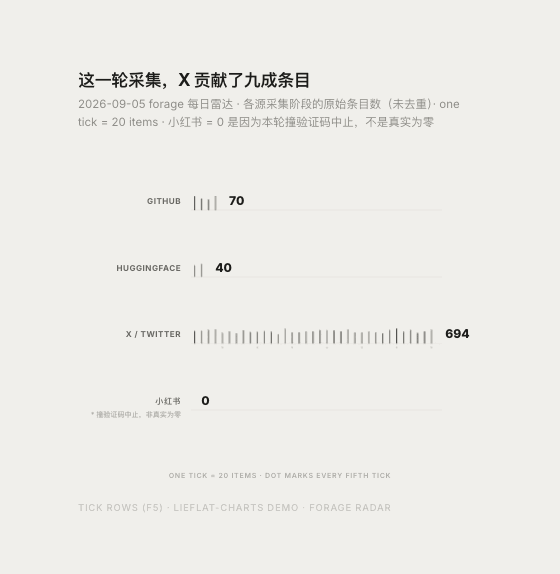

*by Mycelium Protocol*

---

项目地址：https://github.com/larashero3-dotcom/lieflat-charts
出品方：https://moxt.ai
授权：PolyForm Noncommercial License 1.0.0（不是常见开源协议，见下文）

---

## 一句话结论

**Lieflat Charts 是一套遵循 Agent Skills 格式（`SKILL.md`）的数据可视化与报告生成 skill**，moxt.ai 出品，Claude Code、Codex 等支持 Agent Skills 的工具都能装。给它数据，它会先在自己的图型目录里选一张最诚实的模板（63 种图型 + 12 套整页报告模板），再产出一个双击可打开的单文件 HTML。4633 star，2026-07-16 建仓，9 月 3 日还在更新。**但有一点要先说清楚**：作者在 X 上的原话是"我开源的 Lieflat Charts"，这个说法不准确——仓库用的是 PolyForm Noncommercial License 1.0.0，允许学习、修改、分享和**非商业**使用，商用要单独拿授权，不满足 OSI 对"开源"的定义。

## 装上跑一遍：用本站今天的真实数据

不空谈，直接用今天 forage 雷达（本站每日选题采集脚本）的真实采集数字测试：

```bash
npx skills add https://github.com/larashero3-dotcom/lieflat-charts --skill lieflat-charts
```

装完之后把数据丢给它——GitHub 70 条、HuggingFace 40 条、X 694 条、小红书 0 条（本轮撞验证码中止，不是真实为零）。它没有直接画柱状图，而是先按自己 `catalog.md` 里的规则做了一轮选型审计：这是"少类目排名比较"的数据形状，候选是 Glance 系的 Chunky Bars、Lupi Basics 的 Rung Bars / **Tick Rows**、Lupi 编辑型的 Dot Cascade 三选一——因为"HuggingFace""X / Twitter"这类标签偏长，Dot Cascade 的竖排类目名会挤在一起，最终选了横向的 **Tick Rows**（一行一个源，1 tick = 20 条，行尾标真实数字）。



产出的是一份能独立打开、纯 SVG、不需要联网的单文件 HTML——这一点值得单独说：63 种图型里大部分（Lupi 系、Basics 系）是手写 SVG，本地渲染不依赖 CDN；只有 Glance 系里挑颜色/交互大图（Force Graph、部分报告模板）会加载 Chart.js 或 ECharts，那部分需要联网。

## 它跟"随便画个图"的真实差别

跟直接让模型现场手写一个 `<canvas>` 图相比，Lieflat Charts 的价值不在"能不能画"，在于它把一套**图型选择的判断逻辑**固化成了规则文件：先审计能不能用"发丝线 + 逐记录"的 Lupi 语言诚实地呈现数据，不够用才退到"提前聚合、粗笔画"的 Glance 语言；柱状图不许断轴，断轴场景要么让柱子冲天、要么加放大镜小图；数据太少也不直接躺平选 Glance，而是靠"单位分解"（1 点 = 1 人）在稀疏数据里也做出 Lupi 密度。这些是审美偏好被系统化成了可执行的检查清单，比"每次现场即兴发挥"更稳定。

代价也在这——**报告模板依赖 Chart.js/ECharts 的部分脱离本地渲染就要看网络脸色**，而且选型审计本身要走好几步逻辑判断，不是一次 API 调用就能出图，比直接甩一段 matplotlib 代码要"重"。

## 跟本站自建的 hybrid-panel 方案对比

本站自己也有一套本地出图方案（`hybrid-panel` skill）：FLUX 生成无文字底图 + SVG 手写体精确叠字，解决的是"配图要好看又要文字精确"的问题，偏向插画和信息图。Lieflat Charts 解决的是另一个问题——**结构化数据怎么诚实地变成图表**，偏向报表、复盘、年报这类真正有数字要传达的场景。两者不是替代关系：一个管"画面感的配图"，一个管"数字类图表的可读性和诚实度"，本站以后遇到真需要出统计图的文章，可以考虑接入。

## 关于"开源"这个词

这是本站在调研阶段就标记出来要澄清的一点：作者在 X 推广时用的是"开源"，但 `LICENSE` 文件写的是 **PolyForm Noncommercial License 1.0.0**——GitHub 的许可证自动识别把它标成 `NOASSERTION`（识别不出来，不代表没协议），实际条款是"学习、修改、分享、非商业使用允许，商业使用需要另外拿许可"。这跟 MIT/Apache 这类真正的开源协议是两回事：开源协议不限制使用目的，Source-Available/Noncommercial 协议限制商业使用。如果你想把它接进一个收费产品或者对外提供的商业服务，先去联系作者拿授权，别直接当 MIT 用。

## 谁该看这个

**适合**：用 Claude Code / Codex 这类支持 Agent Skills 的工具写复盘、年报、白皮书、周报一类需要"数字讲故事"的内容，且是个人/团队内部非商业使用；想要一套系统化的图型选择规则，而不是每次让模型现场发挥。

**不适合 / 需要注意**：打算商用（哪怕是给客户交付带图表的商业报告）先联系作者拿授权，不能默认当开源项目用；用到 Glance 系彩色图/报告模板的部分需要联网加载 Chart.js/ECharts；作为一套"审计流程很重"的 skill，简单画一张图的场景不如直接写几行 matplotlib 划算。

---

> © 2026 Author: Mycelium Protocol. 本文采用 [CC BY 4.0](https://creativecommons.org/licenses/by/4.0/deed.zh) 授权——欢迎转载和引用，须注明作者姓名及原文链接，不得去除署名后以原创发布。

<!--EN-->

Project: https://github.com/larashero3-dotcom/lieflat-charts
Maker: https://moxt.ai
License: PolyForm Noncommercial License 1.0.0 (not a conventional open-source license — see below)

---

## TL;DR

**Lieflat Charts is an Agent Skills-format (`SKILL.md`) data visualization and report-generation skill** from moxt.ai, installable in Claude Code, Codex, and any other tool that supports Agent Skills. Give it data, and it first audits its own catalog of 63 chart types plus 12 full-page report templates to pick the most honest template, then produces a single-file HTML you can double-click open. 4,633 stars, created 2026-07-16, still shipping commits as of September 3rd. **One thing needs flagging up front**: the author's post on X calls it "my open-sourced Lieflat Charts," which isn't accurate — the repo uses the PolyForm Noncommercial License 1.0.0, which permits learning, modifying, sharing, and **noncommercial** use, with commercial use requiring separate permission. It doesn't meet the OSI definition of "open source."

## Installing it and running it against this blog's own data

No hand-waving — I tested it directly against today's real numbers from forage (this blog's daily topic-scouting radar):

```bash
npx skills add https://github.com/larashero3-dotcom/lieflat-charts --skill lieflat-charts
```

After installing, I handed it the day's collection counts — 70 from GitHub, 40 from HuggingFace, 694 from X, and 0 from XiaoHongShu (this run was stopped by a CAPTCHA, not genuinely zero). Instead of jumping straight to a bar chart, it ran a selection audit per its own `catalog.md` rules: this is a "few-category ranking comparison" data shape, and the candidates were Glance's Chunky Bars, Lupi Basics's Rung Bars and **Tick Rows**, and Lupi Editorial's Dot Cascade — since labels like "HuggingFace" and "X / Twitter" are on the longer side, Dot Cascade's vertical category labels would crowd together, so it landed on horizontal **Tick Rows** (one row per source, one tick = 20 items, the real number labeled at the end of each row).


The output is a self-contained, pure-SVG single-file HTML that needs no network connection — worth calling out on its own: most of the 63 chart types (the Lupi and Basics families) are hand-written SVG that render fully offline; only a subset of the Glance family's colorful/interactive templates (the Force Graph, some report templates) load Chart.js or ECharts, and those need a network connection.

## What actually separates this from "just draw a chart"

Compared to asking a model to freehand a `<canvas>` chart on the spot, Lieflat Charts' value isn't in "can it draw a chart" — it's that it codifies a set of **chart-selection judgment rules** into an enforceable checklist: audit whether the data can be honestly rendered in the "hairline, record-by-record" Lupi language before falling back to the "pre-aggregated, bold-stroke" Glance language; never truncate a bar chart's axis — either let the extreme value shoot off the top or add a zoomed inset; and even sparse data doesn't default to Glance — it decomposes into countable units (one dot = one person) to reclaim Lupi-style density. These are aesthetic judgment calls turned into a systematic, checkable process, which is more consistent than improvising from scratch every time.

There's a cost to this too — **the report templates that lean on Chart.js/ECharts lose their local-rendering guarantee and depend on network access**, and the selection audit itself walks through several logical steps rather than producing a chart from a single API call, making it noticeably "heavier" than just handing over a chunk of matplotlib code.

## How it compares to this blog's own hybrid-panel setup

This blog already runs its own local image-generation pipeline (the `hybrid-panel` skill): FLUX generates a text-free base image, and hand-written SVG overlays precise text on top — solving the problem of "illustrations that need to look good and also carry exact text," aimed at illustrations and infographics. Lieflat Charts solves a different problem — **how structured data honestly becomes a chart** — aimed at reports, retrospectives, and annual-review content that actually has numbers to communicate. They're not substitutes for each other: one handles "visually appealing illustrations," the other handles "readability and honesty for numeric charts." This blog could reasonably wire in Lieflat Charts the next time an article genuinely needs statistical charts.

## A word on "open source"

This is something worth flagging from the research stage itself: the author's promotional post on X used the word "open source," but the `LICENSE` file reads **PolyForm Noncommercial License 1.0.0** — GitHub's license auto-detection tags it as `NOASSERTION` (meaning it couldn't recognize the license, not that there isn't one), and the actual terms are "learning, modification, sharing, and noncommercial use are permitted; commercial use requires separate permission." That's a different thing from a genuine open-source license like MIT or Apache: an open-source license doesn't restrict purpose of use, while a source-available/noncommercial license does restrict commercial use. If you want to fold this into a paid product or a commercial service you offer externally, contact the author for a license first — don't treat it as MIT by default.

## Who should look at this

**Good fit**: anyone using Claude Code, Codex, or another Agent Skills-compatible tool to write retrospectives, annual reports, white papers, or weekly reports where numbers need to tell a story, for personal or internal non-commercial use; anyone who wants a systematic chart-selection ruleset instead of improvising each time.

**Not a fit / worth noting**: if you plan to use this commercially — even just delivering a chart-bearing report to a paying client — contact the author for a license first; don't assume it's open source by default. The Glance family's colored/interactive charts and some report templates need network access to load Chart.js/ECharts. As a skill with a fairly heavy audit process, it's overkill for the simple case of just wanting one quick chart — a few lines of matplotlib may be the better deal there.

---

> © 2026 Author: Mycelium Protocol. Licensed under [CC BY 4.0](https://creativecommons.org/licenses/by/4.0/) — free to share and adapt with attribution. You must credit the author and link to the original; removing attribution and republishing as original is not permitted.
