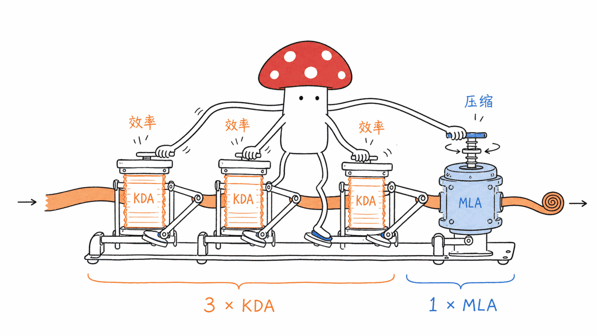
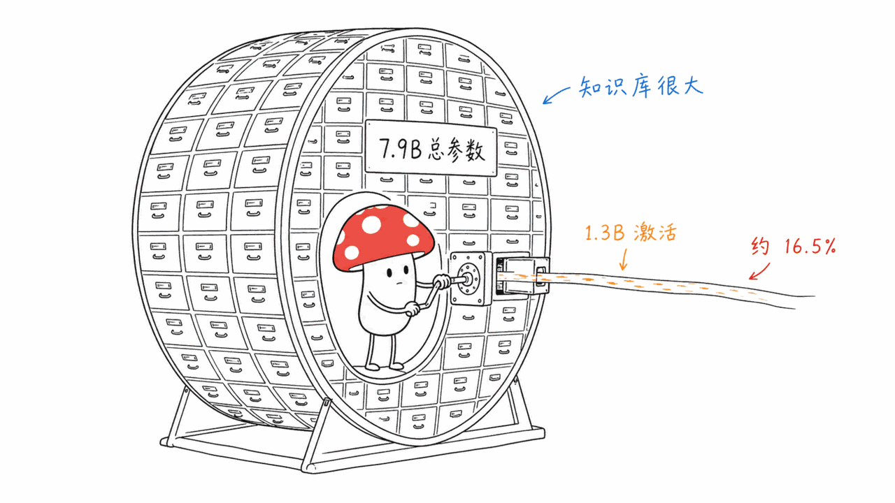
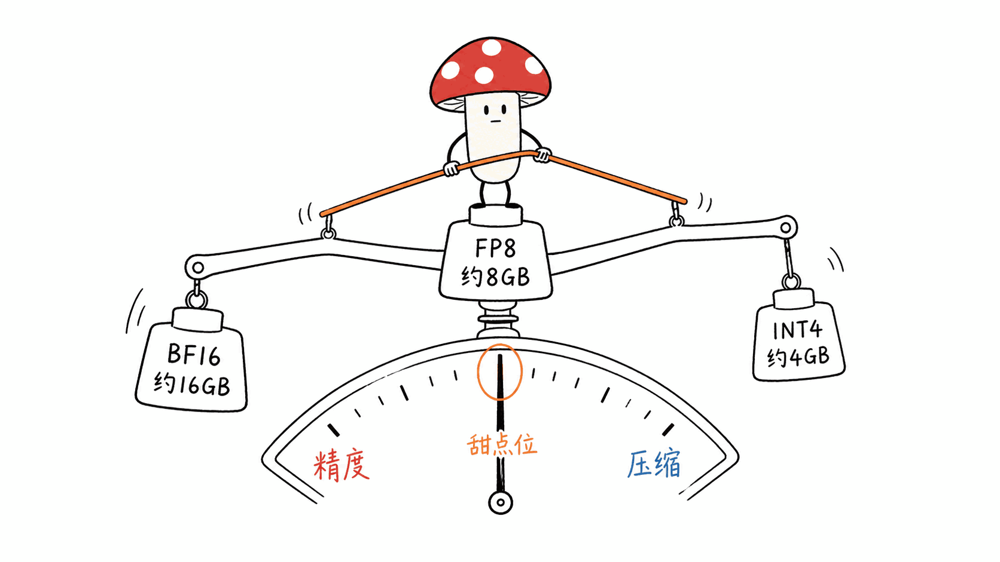
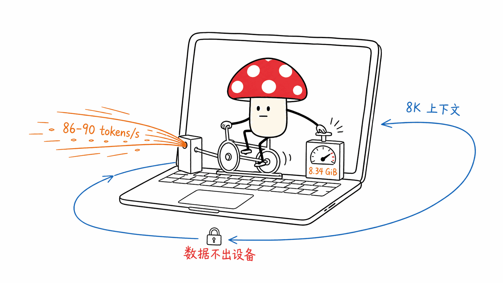

*by Mycelium Protocol*

---

开源方：蚂蚁百灵（Ling-Ant / Ant Group）  
模型页：Ling-Ant/Ling-3.0-Tiny（ModelScope / HuggingFace）  
精度版本：BF16 / FP8 / INT4  
运行平台：MacBook、Mac mini、DGX Spark

---

端侧大模型有两条路：一条是把大模型压小（蒸馏、量化、剪枝）；另一条是从设计之初就为端侧推理优化——架构本身就是稀疏的，激活参数远少于总参数。

Ling-3.0-Tiny 走的是第二条路，而且走得比较彻底：总参数 7.9B，推理时激活仅 1.3B——激活率不到 20%。在 MacBook 上 FP8 精度下输出速度 86-90 tokens/s，8K 上下文峰值内存仅 8.34GiB，同时在 Agent 评测上超越了 31B 级别的稠密模型。

---

## 一、架构：KDA + MLA 3:1 交替 + 128 专家 MoE

Ling-3.0-Tiny 的架构有三个核心设计决策，三个都针对推理效率：

### 1. KDA + MLA 3:1 交替注意力（混合推理）

这是 Ling-3.0-Tiny 名字里「混合推理」的来源。

模型的注意力层不是统一的一种类型，而是两种注意力机制交替使用：

- **KDA（Key-Decomposed Attention）**：对 KV Cache 进行键向量分解，大幅减少推理时的内存占用和带宽消耗
- **MLA（Multi-head Latent Attention）**：DeepSeek-V2/V3 提出的低秩 KV Cache 压缩方案，把 KV 压缩成低维 latent 向量

两种机制按 3:1 的比例交替排列（3 个 KDA 层 + 1 个 MLA 层），而不是全部用同一种。

为什么要交替？两种机制各有侧重：
- KDA 在处理普通上下文时计算效率更高
- MLA 在长上下文和复杂推理时 KV Cache 压缩率更好

3:1 的比例是在「大部分情况下用效率更高的 KDA，关键层用 MLA 获得更强的上下文压缩」之间找到的平衡点。这个设计也是 Ling 系列在「混合推理」上的核心贡献。

### 2. 128 专家稀疏 MoE

MoE（专家混合）的核心思路：一个大模型由很多「专家」网络组成，但对于每一个 token，只激活其中几个专家处理。

Ling-3.0-Tiny 的设计：
- **总专家数：128**
- **每次激活：少量专家（具体激活数量未公开）**
- **结果：总参数 7.9B，激活参数仅 1.3B**

128 个专家是一个相对大的专家池——比 Mixtral-8x7B（8 专家）、DeepSeek-V2（64 专家）都更多。更多的专家意味着更精细的任务专业化，但也需要更好的路由机制来避免专家负载不均衡。

激活率（1.3B / 7.9B ≈ 16.5%）意味着推理时的计算量约等于一个 1.3B 的稠密模型，但「见过的东西」和「学到的能力」来自于 7.9B 参数的知识库。这就是为什么它的评测表现能超过更大的稠密模型。

### 3. 三精度支持：BF16 / FP8 / INT4

| 精度 | 内存占用 | 适用场景 |
|------|---------|---------|
| BF16 | 约 16GB | 高精度推理，DGX Spark |
| FP8 | 约 8GB | 性能/精度平衡，MacBook Pro（24G+） |
| INT4 | 约 4GB | 极限压缩，Mac mini（16G） |

官方重点推荐 FP8——在 MacBook 上实测 86-90 tokens/s，峰值内存 8.34GiB，是端侧部署的甜点配置。

---

## 二、评测数据：智能指数 25 分，Agent 超越 31B

### 智能指数评测（Intelligence Index）

| 模型 | 参数量 | 得分 |
|------|--------|------|
| Gemma-4-26B | 26B | 26 |
| **Ling-3.0-Tiny** | **7.9B（激活 1.3B）** | **25** |
| Qwen3-8B（参考） | 8B | — |

Ling-3.0-Tiny 的智能指数得分（25）仅比 Gemma-4-26B（26）低 1 分，而激活参数量只有后者的约 1/20。这个对比清晰地说明了 MoE 稀疏激活的效率优势。

### Agent 得分超越 31B 模型

这是更值得关注的数字。Agent 评测不只测知识，还测指令遵循、工具调用、多步推理、格式控制——这些都是 Agent 场景的核心能力。

Ling-3.0-Tiny 的 Agent 得分超越了 31B 级别的模型（评测框架没有公开具体对比对象，但这个数字说明 Ling-3.0-Tiny 不只是「压缩知识的端侧模型」，而是一个「在端侧能真正执行 Agent 任务」的模型）。

考虑到 Ling 系列的背景来自蚂蚁集团的金融 AI 应用场景，这个 Agent 能力侧重是有意为之的——金融助理、端侧合规审查、本地文档处理等场景，都需要稳定的 Agent 能力而不是纯粹的知识覆盖。

---

## 三、端侧部署的实际含义

### 86-90 tokens/s 意味着什么

人类阅读速度约 4-6 tokens/s（汉字约 3-5 字/秒），100 tokens/s 已经是"读不过来"的速度。86-90 tokens/s 在 MacBook FP8 下意味着：

- 对话场景：用户几乎感知不到延迟（首 token 延迟取决于 prefill，后续输出速度足够流畅）
- 文档分析场景：处理长文本时不会有明显的等待
- Agent 循环场景：每一步的推理时间不构成瓶颈

这个速度对于一个真正在端侧运行的 Agent 来说是可用的——不是「勉强能用」，而是体验上接近云端 API 的水平。

### 8.34GiB 峰值内存（8K 上下文）

FP8 模型权重本身约 8GB（7.9B × 1 byte），但运行时的峰值内存包含 KV Cache、激活值等额外开销。8.34GiB 的峰值内存说明 KDA+MLA 的设计在 KV Cache 管理上非常有效——即使是 8K 上下文，总内存也只比权重本身多 0.34GiB。

这对 MacBook Pro（16GB 内存）是可用的：模型本身占 8.34GB，系统和其他应用还有约 7.5GB 可用。

### 数据本地留存

这是「端侧部署」在隐私敏感场景下的核心价值：数据不离开设备，不经过任何云端 API，不留存在供应商服务器上。

对于金融顾问、医疗助手、企业内部文档处理等场景，这不是技术优化，而是合规要求。Ling-3.0-Tiny 能满足这个要求的前提是它的能力真的够用——一个速度不够快或者 Agent 能力不足的端侧模型，在这些场景里没有实际价值。

---

## 四、与同类端侧模型的比较

| 模型 | 总参数 | 激活参数 | 架构 | FP8 速度（Mac） | Agent 能力 |
|------|--------|---------|------|----------------|-----------|
| **Ling-3.0-Tiny** | **7.9B** | **1.3B** | **KDA+MLA MoE** | **86-90 t/s** | **超 31B** |
| Gemma-3-4B | 4B | 4B（稠密）| 稠密 Transformer | 更快 | 较弱 |
| Qwen3-8B | 8B | 8B（稠密）| 稠密+MoE variant | 较慢 | 竞争 |
| Phi-4-mini | 3.8B | 3.8B（稠密）| 稠密 | 更快 | 较弱 |
| Mixtral-8x7B | 47B（激活 12B）| 12B | 8 专家 MoE | 不适合 Mac | 强 |

**Ling-3.0-Tiny 的差异化**：稀疏激活（1.3B 激活 / 7.9B 总）+ 超多专家（128）+ 混合注意力（KDA+MLA）+ Agent 能力侧重。在「端侧 Agent」这个细分场景里，这个组合是目前公开模型里较为稀有的。

---

## 五、从蚂蚁的角度理解这个发布

蚂蚁集团做端侧模型不是技术炫技——有几个具体的业务动机：

**1. 金融合规场景**：银行客服、理财顾问等场景要求用户数据不出境，云端 API 方案在某些监管框架下受限。端侧 Agent 是绕过这个约束的唯一可行路径。

**2. 支付宝 App 的 AI 能力**：支付宝在全球有超过 13 亿用户。把一个性能足够的 AI 模型推到端侧，意味着这些用户可以在弱网或离线状态下使用 AI 功能，而不是依赖云端 API。

**3. 蚂蚁的 AI 基础设施布局**：从 Ling 系列的整体来看（此前有 Ling-1.0、Ling-2.0 等），蚂蚁在构建自己的全栈 AI 能力——不依赖 OpenAI、不依赖 Qwen、有自己的基座模型。Tiny 是这个系列里针对端侧场景的专门优化版本。

---

## 六、值得关注的开放问题

**KDA 的具体实现**：KDA（Key-Decomposed Attention）的技术细节还没有正式论文发布。从命名推断是对注意力键向量进行低秩分解，但分解的方式、秩的选择、对精度的影响，都需要等技术报告。

**128 专家的路由机制**：专家数量越多，路由机制越重要（负载均衡、专家坍塌等问题）。128 个专家的路由策略没有公开，这是影响实际质量的关键变量。

**INT4 版本的精度损失**：INT4 压缩在 4-bit 量化中通常会有明显的精度下降，尤其对 Agent 任务（格式严格、逻辑准确性要求高）。官方没有公布 INT4 与 BF16/FP8 之间的评测分差，这需要社区实测。

**多语言能力**：蚂蚁的场景以中文为主，模型的多语言（特别是英文以外的语言）能力需要独立评测。

---

*Mycelium Protocol — 追踪 AI 系统的底层演化*

---

> **关于 Mycelium**
>
> 菌丝协议。持续追踪 AI 工具、系统和实验的内容节点。

---

<!--EN-->

## Ling-3.0-Tiny: 7.9B Total Parameters, Only 1.3B Active — Ant BaiLing Brings Hybrid-Inference MoE to the Edge

*by Mycelium Protocol*

---

Publisher: Ant BaiLing (Ling-Ant, Ant Group)  
Available on: ModelScope / HuggingFace (Ling-Ant/Ling-3.0-Tiny)  
Precision variants: BF16 / FP8 / INT4  
Target platforms: MacBook, Mac mini, DGX Spark

---

There are two approaches to on-device LLMs: compress a large model down (distillation, quantization, pruning), or design for sparse activation from the start — where architecture itself ensures far fewer parameters are active during inference than the total count.

Ling-3.0-Tiny takes the second path, and takes it far: 7.9B total parameters, but only 1.3B active during inference — an activation rate under 20%. On MacBook at FP8 precision: 86-90 tokens/s output speed, peak memory 8.34 GiB for 8K context. Agent benchmark score: outperforms 31B-class models.

---

### Architecture: KDA + MLA 3:1 Alternating + 128-Expert Sparse MoE

**KDA + MLA 3:1 alternating attention (the "hybrid inference"):**

The model uses two attention mechanisms in a 3:1 alternating pattern:
- **KDA (Key-Decomposed Attention)**: Low-rank decomposition of key vectors, reducing KV Cache memory footprint and bandwidth
- **MLA (Multi-head Latent Attention)**: DeepSeek-V2/V3's approach of compressing KV into low-dimensional latent vectors

3:1 ratio: most layers use KDA (higher efficiency for typical contexts), key layers use MLA (better long-context compression). Each mechanism handles what it does best.

**128-expert sparse MoE:**

128 total experts, sparse routing means only a small subset activates per token. Result: 7.9B total parameters → 1.3B active. The activation rate (~16.5%) means inference compute equivalent to a 1.3B dense model, but the model's breadth and capabilities reflect 7.9B parameters of learned knowledge.

**Three precision variants:**

| Precision | Memory | Best for |
|-----------|--------|----------|
| BF16 | ~16 GB | High accuracy, DGX Spark |
| FP8 | ~8 GB | Performance/accuracy balance, MacBook (24G+) |
| INT4 | ~4 GB | Maximum compression, Mac mini (16G) |

---

### Benchmarks: 25 Intelligence Index, Agent Score Above 31B

**Intelligence Index (25 points):** Only 1 point below Gemma-4-26B (26 points), while having approximately 1/20th the active parameters. This gap quantifies MoE sparse activation efficiency.

**Agent score exceeds 31B models:** Agent benchmarks test instruction following, tool calling, multi-step reasoning, and format control — actual agent task execution, not just knowledge recall. Ling-3.0-Tiny outperforming 31B models here signals that it's a genuine edge agent model, not just a compressed knowledge store.

---

### What 86-90 tokens/s Actually Means for Edge Deployment

Human reading speed: 4-6 tokens/s. At 86-90 tokens/s, output arrives faster than a user can read — no perceptible lag in conversation. For agent loops (where each step requires model inference), this speed means inference time doesn't dominate total latency.

**8.34 GiB peak memory for 8K context** (FP8): The FP8 weights are ~8 GB, so the KDA+MLA design adds only ~0.34 GB of KV Cache overhead at 8K context — extremely efficient KV Cache management. A 16 GB MacBook Pro can run this with ~7.5 GB left for the OS and other apps.

**Local data retention:** No cloud API, no vendor storage, no data egress. For financial advisors, medical assistants, enterprise document processing — this isn't a feature, it's a compliance requirement.

---

### Why Ant Is Doing This

**Financial compliance:** Banking and wealth management AI in certain regulatory frameworks cannot send user data to cloud APIs. Edge agent is the only viable path.

**Alipay scale:** 1.3 billion+ users. A capable edge model means AI features that work offline or in poor network conditions, without cloud API dependency.

**Full-stack AI independence:** Ling series (1.0 → 2.0 → 3.0) represents Ant building its own foundation model stack, not depending on third-party APIs for its AI products.

---

### Open Questions

- **KDA implementation**: No formal paper yet. Low-rank decomposition of key vectors is inferred from the name, but decomposition method, rank choices, and precision impact are not publicly documented.
- **128-expert routing**: Large expert pools require sophisticated routing to avoid load imbalance and expert collapse. Routing strategy not disclosed.
- **INT4 precision drop**: 4-bit quantization typically degrades accuracy, especially for agent tasks requiring precise formatting and logical correctness. No official comparison between INT4 and FP8/BF16 published.
- **Multilingual capability**: Ant's primary use cases are Chinese-language. Performance on other languages needs independent evaluation.

---

*Mycelium Protocol — tracking the deep evolution of AI systems*

© 2026 Mycelium Protocol. All rights reserved.
