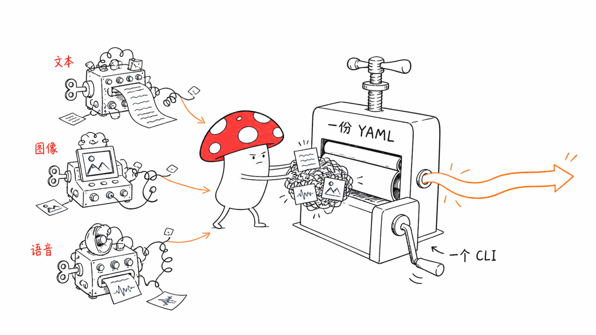
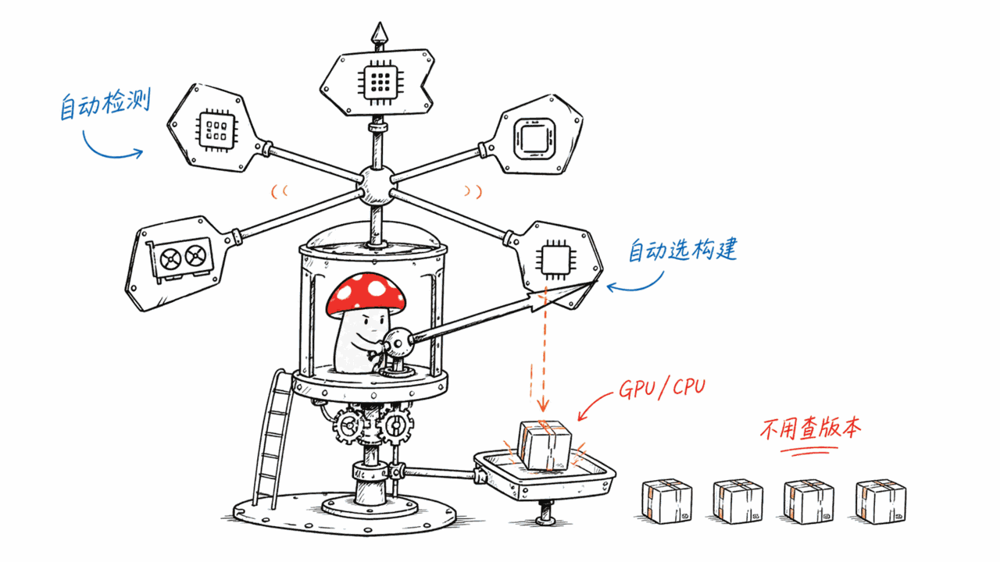
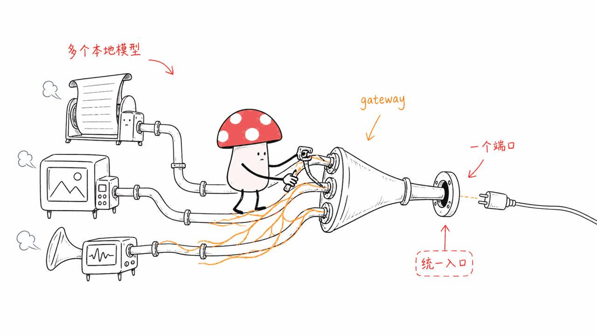

*by Mycelium Protocol*

---

项目地址：https://github.com/kiliczsh/llmconfig
授权：MIT

---

## 一句话结论

**llmconfig 是本地推理场景下的一个小工具，但解决的是一个真实的烦恼：文本模型用 llama.cpp、图像生成用 stable-diffusion.cpp、语音识别用 whisper.cpp，三套后端各自有各自的启动方式和参数，管理起来很碎。** llmconfig 用**一份 YAML + 一个 CLI**把这三套后端统一管起来——下载、启动、停止、重启、监控，一套命令搞定。Go 写的，MIT，23 star，是今天写的项目里体量最小的一个，但足够专注和实用。



## 用法：三行命令起一个本地模型

```bash
llmconfig install llama          # 自动识别 CUDA / Metal / CPU，装对应的 llama.cpp
llmconfig init --template=gemma  # 用内置模板生成配置
llmconfig up gemma                # 启动
```

启动后，`http://127.0.0.1:8080` 就是一个 OpenAI 兼容的 API 端点，用你原来调 OpenAI API 的代码原封不动指过来就能用。命令还有个短别名 `llmc`，长短两种都能敲。

## 硬件感知：不用自己挑对应的构建版本

NVIDIA、Apple Silicon、AMD、Intel GPU、纯 CPU——运行时自动检测硬件、自动选对应的构建配置。免去了自己去查"我这块显卡该下哪个编译版本"的功夫。

**免编译**：后端二进制文件直接下载好，`llmconfig install <llama|sd|whisper>` 一条命令搞定。想要更极致的性能，也支持 `llmconfig install ik_llama` 从源码构建 [ik_llama.cpp](https://github.com/ikawrakow/ik_llama.cpp) 这个分支，拿到 SOTA 量化和更快的 CPU/MoE 推理——这是可选项，给愿意折腾的人留了口子，但默认路径不需要碰编译链。


## Gateway：多个模型一个端口

如果你同时跑着好几个本地模型（比如一个对话模型 + 一个图像模型），`llmconfig gateway` 命令能把所有正在运行的模型统一暴露在一个端口上——不用给每个模型单独记一个端口号，调用方只认一个入口。



## 命令一览

```bash
llmconfig up <name>          # 启动一个模型
llmconfig down [name]        # 停止（多个在跑时给交互式选择）
llmconfig ps                 # 列出正在运行的模型
llmconfig logs <name> -f     # 跟踪日志
llmconfig models             # 列出已配置的模型
llmconfig hardware           # 显示检测到的 GPU / 内存 / 显存
```

19 个内置模板覆盖常见模型，文档里的 `docs/templates.md` 列了每个模板对应的模型细节和推荐配置。

## 谁该看这个

**适合**：本地跑多种类型模型（文本+图像+语音）、受够了每种后端各管一套的人；不想手动查硬件对应哪个构建版本、想要"装完就能用"体验的人。

**不适合 / 需要注意**：这是个配置管理工具，不是推理引擎本身——它的能力上限取决于 llama.cpp/stable-diffusion.cpp/whisper.cpp 这三个底层项目能做到什么；23 star 的早期小项目，用之前留意一下模板覆盖的模型是不是你需要的那个。

---

> © 2026 Author: Mycelium Protocol. 本文采用 [CC BY 4.0](https://creativecommons.org/licenses/by/4.0/deed.zh) 授权——欢迎转载和引用，须注明作者姓名及原文链接，不得去除署名后以原创发布。

<!--EN-->

## TL;DR

**llmconfig is a small tool for local inference, but it solves a real annoyance: text models run on llama.cpp, image generation on stable-diffusion.cpp, speech recognition on whisper.cpp — three backends, each with its own way of starting up and its own parameters, fragmenting the management story.** llmconfig unifies all three under **one YAML file and one CLI** — download, start, stop, restart, monitor, all through the same commands. Written in Go, MIT licensed, 23 stars — the smallest project covered today, but focused and genuinely useful.


## Usage: three commands to get a local model running

```bash
llmconfig install llama          # auto-detects CUDA / Metal / CPU, installs the matching llama.cpp build
llmconfig init --template=gemma  # generate a config from a built-in template
llmconfig up gemma                # start it
```

Once running, `http://127.0.0.1:8080` is an OpenAI-compatible API endpoint — point code that already calls the OpenAI API at it, unchanged. There's a short alias, `llmc`, so both the long and short forms work.

## Hardware-aware: no need to pick the right build yourself

NVIDIA, Apple Silicon, AMD, Intel GPU, plain CPU — the runtime auto-detects hardware and selects the matching build configuration. No more digging around to figure out which compiled variant matches your specific GPU.

 **No build chain**: backend binaries download directly, and `llmconfig install <llama|sd|whisper>` is a one-shot command. For more extreme performance, `llmconfig install ik_llama` optionally builds the [ik_llama.cpp](https://github.com/ikawrakow/ik_llama.cpp) fork from source, unlocking SOTA quantization and faster CPU/MoE inference — an opt-in path for those willing to tinker, while the default route never touches a build toolchain.


## Gateway: multiple models, one port

If you're running several local models at once (say, a chat model plus an image model), `llmconfig gateway` exposes every running model through a single port — no need to remember a separate port for each one; callers only need to know one entry point.


## Commands at a glance

```bash
llmconfig up <name>          # start a model
llmconfig down [name]        # stop (interactive picker if multiple)
llmconfig ps                 # list running models
llmconfig logs <name> -f     # tail logs
llmconfig models             # list configured models
llmconfig hardware           # show detected GPU / RAM / VRAM
```

19 built-in templates cover common models; `docs/templates.md` lists model details and recommended sizes for each.

## Who should look at this

**Good fit**: anyone running multiple types of local models (text, image, speech) who's tired of managing each backend separately; anyone who doesn't want to manually figure out which build matches their hardware and wants an "install and it just works" experience.

**Not a fit / worth noting**: this is a configuration manager, not the inference engine itself — its capability ceiling is whatever llama.cpp, stable-diffusion.cpp, and whisper.cpp can do underneath. A 23-star early-stage project — check that the template coverage includes the model you actually need before committing.

---

> © 2026 Author: Mycelium Protocol. Licensed under [CC BY 4.0](https://creativecommons.org/licenses/by/4.0/) — free to share and adapt with attribution. You must credit the author and link to the original; removing attribution and republishing as original is not permitted.
