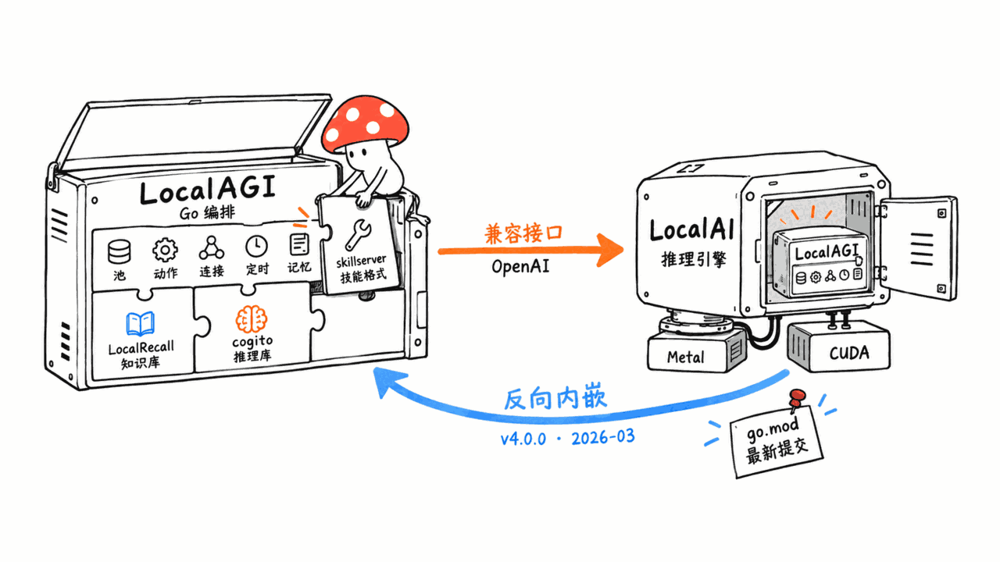
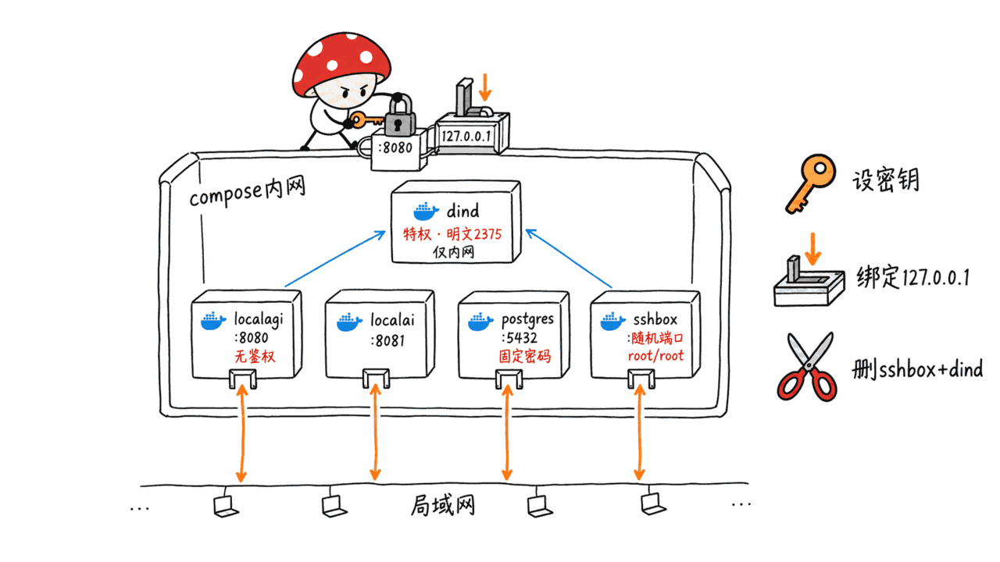
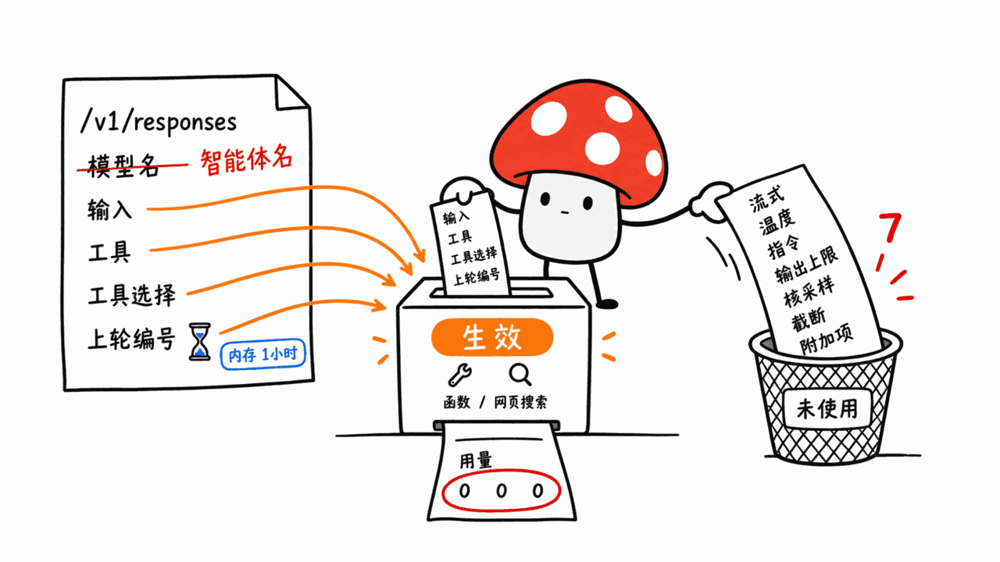
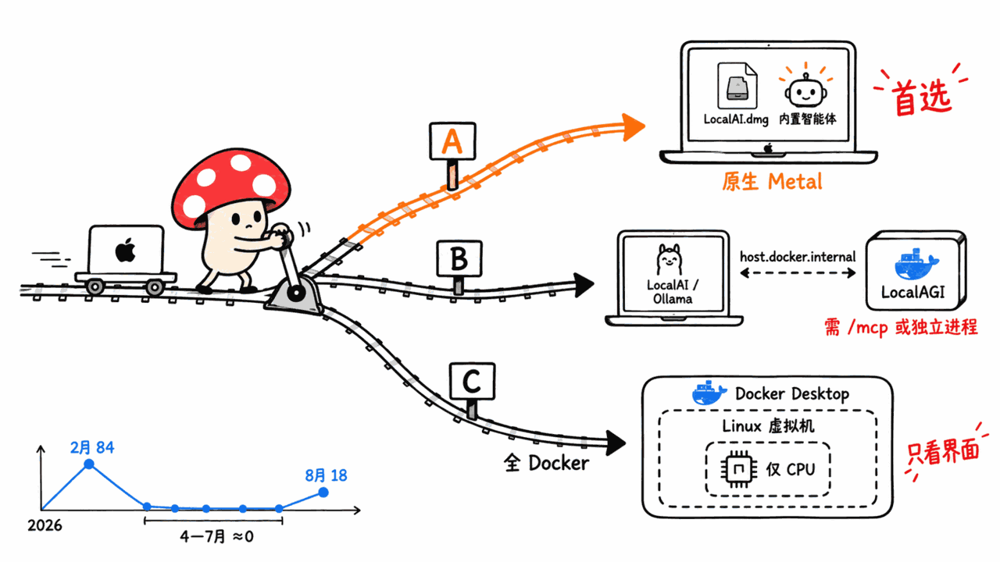

> 📌 开源仓库：mudler/LocalAGI
> GitHub：https://github.com/mudler/LocalAGI
> 协议：MIT ｜ 语言：Go ｜ Stars：1972 ｜ Forks：289 ｜ 创建：2023-07-27 ｜ 最新版本：v2.9.0（2026-05-08）｜ 最近提交：2026-09-11

---

**BLUF**：LocalAGI 是 LocalAI 作者 Ettore Di Giacinto（GitHub: mudler）写的自托管 Agent 平台：网页上点几下建 agent，接 Telegram、Slack、Discord、GitHub、邮件等 9 种连接器，带 42 个内置动作、cron 定时任务、知识库和 MCP，每个 agent 还能通过 `/v1/responses` 被调用。它最值得知道的一件事不在自己的 README 里：**2026 年 3 月的 LocalAI v4.0.0 已经把 LocalAGI 整个嵌进了核心**，LocalAI 官方文档写着「LocalAGI is embedded in LocalAI. There is nothing separate to install or run」，LocalAI 主干的 go.mod 钉的就是 LocalAGI 昨天（2026-09-11）的提交。所以它的 1972 颗星严重低估了它的实际用户面。我们读完 README、4 个 compose 文件和关键代码后的判断：**「完整替代 Responses API」言过其实**——`model` 字段填的是 agent 名，`stream`、`temperature`、`instructions` 等 7 个字段解析后没有任何地方用到，`usage` 永远是 0，多轮会话只在内存里存 1 小时；README 说的「预编译二进制」在 12 个 release 里一个都没有，打包流水线最近 5 次全部失败；默认 compose 会在局域网上开一个 root/root 密码登录的 SSH 容器。**Mac 用户的建议很直接：装 LocalAI.dmg，用它内置的 Agents 页面**，推理走原生 Metal；只有在你需要单独的 LocalAGI 进程（比如它 8 月新加的 MCP 管理端点）时，才原生跑 LocalAI、只把 LocalAGI 放进容器。

这篇讲五件事：它和 LocalAI、LocalRecall 等同门项目怎么拼在一起；Agent 能力到底有哪些；Responses API 兼容到什么程度；为什么一个 2023 年的项目现在值得看；以及在 Apple Silicon Mac 上该怎么跑。

## 先搞清楚：LocalAGI、LocalAI、LocalRecall 是什么关系？

mudler 这一家子项目名字很像，分工其实很清楚：

| 项目 | Stars | 做什么 | 和 LocalAGI 的关系 |
|---|---|---|---|
| LocalAI | 49071 | OpenAI 兼容的本地推理服务，背后挂 llama.cpp、MLX、whisper.cpp 等几十种后端 | LocalAGI 默认的「大脑」；从 v4.0.0 起反过来把 LocalAGI 内嵌成自己的 Agents 功能 |
| LocalAGI | 1972 | Agent 编排：agent 池、动作、连接器、定时任务、记忆、Web UI | 本文主角，Go 写成，也能当 Go 库 import |
| LocalRecall | 972 | 知识库 + 向量检索 REST 服务 | v2.9.0 起以 Go 库形式内嵌进 LocalAGI，不用再单独跑 |
| cogito | 64 | 面向小模型的 Go agent 推理库（Apache-2.0） | v2.7.0 起 LocalAGI 的推理/工具调用循环交给它 |
| skillserver | 62 | 技能（`SKILL.md` 目录）管理服务 | LocalAGI 的 Skills 功能沿用它的格式 |

一次请求的路径是这样的：你在 Web UI、Telegram 或 `/v1/responses` 发一条消息 → LocalAGI 找到对应 agent，用 cogito 跑「规划 → 选动作 → 执行 → 再问模型」的循环 → 每一步模型调用都走标准的 OpenAI Chat Completions 接口（`LOCALAGI_LLM_API_URL`），默认指向 LocalAI → 需要知识时查内嵌的 LocalRecall 集合（默认 compose 用 Postgres + pgvector，嵌入模型 `granite-embedding-107m-multilingual`）。

关键在于**LocalAGI 只认 OpenAI 兼容接口**，并不绑定 LocalAI。代码里 `pkg/llm` 就是 go-openai 客户端，`BaseURL` 直接等于你给的地址。换句话说，Ollama、LM Studio、llama-server、甚至云端 OpenAI 都能当它的后端——「No clouds」是一种默认配置，不是技术限制。

2026 年 3 月之后，关系又翻了一层。LocalAGI 在 2026-03-06 有两条提交叫「refactoring to make it importable」，一周后 LocalAI v4.0.0（2026-03-14）发布，release notes 写的是「We've embedded agentic and hybrid search capabilities directly into the core」，同时上线 Agent Hub（agenthub.localai.io）。我们查了 LocalAI 主干的 go.mod：`github.com/mudler/LocalAGI v0.0.0-20260911225740-d93d478e42f1`，正是 LocalAGI 仓库最新的那个提交。**LocalAGI 现在同时是一个独立应用和 LocalAI 的上游库。**

## 它到底能做什么？

把 README 的宣传和 `services/` 目录里的实际代码对一下：

| 能力 | README 怎么说 | 代码里实际有什么 |
|---|---|---|
| 连接器 | Discord、Slack、Telegram、GitHub Issues、IRC、Email | 9 个：Discord、Email、GitHub Issue、GitHub PR、IRC、Matrix、Slack、Telegram、Twitter |
| 内置动作 | 「Extensible Custom Actions」 | 42 个常量：搜索、网页抓取、维基百科、17 个 GitHub 读写动作、发邮件、发推、生成图片/歌曲/PDF、shell 命令、提醒与定时、记忆增删查、PiKVM 电源控制、webhook、调用其他 agent |
| 多 agent | 「一句话创建协作团队」 | `generateProfiles` 让模型输出一组 {名字, 描述, 系统提示词}，再用同一份配置批量建 agent；协作靠 `call_agents` 动作互相发消息（可设白名单/黑名单），没有中心调度器 |
| 定时任务 | cron 语法 | `periodic_runs` 字段 + `core/scheduler`，支持 cron、一次性和循环提醒；2026-08-24 修了「agent 重复创建自己的任务」 |
| 记忆 | 短期 + 长期 + 摘要记忆 | 短期记忆用 bleve 全文索引（v2.8.0），长期记忆和知识库走 LocalRecall；v2.8.0 加了知识库自动压缩，v2.9.0 加了对话自动压缩设置 |
| MCP | 支持本地/远程 MCP 服务器 | 客户端用官方 Go SDK（v2.6.0 起）；**2026-08-24 新增自身 MCP 服务端** `/mcp`，暴露 8 个管理工具 |
| 自定义动作 | Go 代码，「解释执行，无需编译」 | 用 traefik/yaegi 解释器跑，把整个进程环境变量传进去，可用 Go 标准库 |
| Skills | Web UI 管理、git 同步 | 存在 `STATE_DIR/skills`，按 agent 开关；开启后 agent 通过内置 skills MCP 读技能 |

有两点值得单独说。

第一，**「No clouds」指的是推理**。内置的 `search` 动作走 DuckDuckGo（langchaingo 的 duckduckgo 工具），连接器接的是 Telegram、Slack 这些云服务，README 顶部甚至放了一个公开的 Telegram 试用机器人。模型可以完全本地，agent 的手脚照样伸向互联网。issue #487（2026-08-11）报告 DDG 搜索已经不工作，目前没有回复。

第二，**自定义动作是一把没有护手的刀**。Web UI 里给 agent 加一个「custom」动作，贴进去的 Go 代码由 yaegi 在 LocalAGI 进程里解释执行，`Env: os.Environ()` 把 `DATABASE_URL` 等环境变量都交给了它，README 自己的两个示例就是读写文件和发 HTTP 请求。这是设计上的能力，不是漏洞，但它意味着：**谁能打开你的 LocalAGI 页面，谁就能在那个容器里跑代码**。8 月新加的 `/mcp` 端点有 `create_agent` 和 `update_agent_config`，接受和 REST API 一样的完整配置——MCP 客户端也能做同样的事。

## 默认 docker compose 在你的机器上开了什么？

README 的快速开始是 `docker compose up`。我们逐行读了 `docker-compose.yaml`，它会起 5 个容器：

| 服务 | 镜像 | 映射到宿主机的端口 | 需要留意的地方 |
|---|---|---|---|
| localai | `localai/localai:master` | 8081 | 用的是滚动的 master 标签，每次拉取可能不同；默认没设 API key |
| postgres | `quay.io/mudler/localrecall:v0.5.2-postgresql` | 5432 | 账号密码都是 `localrecall` |
| sshbox | 本地构建（Ubuntu 24.04 + openssh + docker.io） | 22 → 随机高位端口 | `SSH_USER=root`、`SSH_PASSWORD=root`，开启 `PermitRootLogin yes` 和密码登录；`DOCKER_HOST` 指向 dind |
| dind | `docker:dind` | 不映射（仅 compose 内网） | `privileged: true`，Docker API 以明文 TCP 监听 2375，关了 TLS |
| localagi | 本地构建 | 8080（容器内 3000） | 默认不设 `LOCALAGI_API_KEYS`，也就是不鉴权 |

Docker 的 `ports` 默认绑定所有网卡。所以按 README 原样启动后，同一局域网里的任何人都能：打开 8080 的 LocalAGI 控制台（进而用自定义动作执行代码），用固定密码连 5432 的数据库，以及用 `root/root` SSH 进 sshbox——而 sshbox 能指挥一个特权 dind。在 Mac 上这一切被圈在 Docker Desktop 的 Linux 虚拟机里；在 Linux 服务器上，特权容器离宿主 root 就不远了。dind 自己的启动日志也在警告这件事（issue #473：「gives root access on this machine to everyone who has access to your network」），不过 dind 端口没有映射到宿主，风险主要来自 sshbox 和 localagi 这两个入口。

sshbox 的用途是给 `shell-command` 动作一个隔离的执行环境，这个思路是对的；问题只在于默认值。**如果你要跑，最少做三件事**：给 localagi 设 `LOCALAGI_API_KEYS`；把端口写成 `127.0.0.1:8080:3000` 这种只绑本机的形式；不需要 shell 动作就删掉 sshbox 和 dind 两个服务。

另外几个 compose 层面的坑，都有一手证据：

- **GPU 版 compose 目前是坏的**。`docker-compose.nvidia.yaml`、`intel`、`amd` 三个文件都用 `extends` 继承基础文件，但没有声明顶层 `volumes`，直接 `docker compose -f docker-compose.nvidia.yaml up` 会报「service "postgres" refers to undefined volume postgres_data」。issue #465 从 2026-04-03 开到现在，评论区给出的绕法是在 `.env` 里写 `COMPOSE_FILE=docker-compose.yaml:docker-compose.nvidia.yaml`。
- **README 说「Docker Compose profiles」，实际是四个独立文件**，没有 profile；README 的硬件章节也漏了 AMD，只在快速开始里出现。
- **端口前后不一致**。快速开始让你访问 8080，REST API 和 MCP 的示例写的是 3000。用 compose 跑时应该用 8080，3000 是容器内端口。
- **多模态模型对不上**。CPU 版 compose 里 LocalAI 预装的是 `${MULTIMODAL_MODEL:-gemma-3-4b-it-qat}`，LocalAGI 这边的默认多模态模型却是 `moondream2-20250414`。
- **README 推荐的「协调 agent 最好」的 `qwen_qwq-32b`**，在今天 LocalAI 模型库的 index.yaml（1566 个条目）里查不到这个名字。

## 默认用什么模型？硬件要多少？

默认文本模型是 `gemma-3-4b-it-qat`。LocalAI 模型库里它指向 bartowski 的 GGUF：Q4_0 主权重 2.37GB，加上 0.85GB 的视觉投影文件，合计约 3.2GB。嵌入模型 `granite-embedding-107m-multilingual` 很小。所以 CPU 版默认配置在 8GB 内存的机器上就能起来，这也是 README「消费级硬件可跑」的底气。

但「能跑」和「能用」是两回事。Agent 循环要求模型稳定地做工具调用和结构化输出，4B 模型在多步规划里很容易跑偏，这也是 README 自己把 12B、27B、32B 列为「测试过的好模型」的原因。LocalAI 在 2026 年 8 月的新手教程里改用 `qwen3-4b` 作为入门的工具调用模型。我们的经验判断：**真要让 agent 常驻干活，至少 8B 级别起步**；统一内存 16GB 的 Mac 大概到 8B-12B 的 4-bit 量化为止，32GB 以上才有余量上 27B-32B。

CPU 版还有一个硬限制，README 写得很清楚：「Supports text models only」。图片生成和多模态要 GPU 版 compose。

## /v1/responses 兼容到什么程度？

README 的原话是「A complete drop-in replacement for OpenAI's Responses APIs」。我们读了处理函数 `webui/app.go` 里的 `Responses()` 和请求类型 `webui/types/openai.go`，结论是：**它是一个「形状像 Responses API」的 agent 调用入口，不是 OpenAI Responses API 的替代品。**

具体差别：

1. **`model` 填的是 agent 名，不是模型名**。处理函数第一步就是 `agentName := request.Model`，找不到 agent 返回 HTTP 500（不是 404）。你改的是 agent 配置，不是请求参数。
2. **7 个字段解析了但没有用上**。请求结构体里有 `instructions`、`stream`、`temperature`、`max_output_tokens`、`top_p`、`truncation`、`include`，我们在 `webui/` 下搜遍了引用，这 7 个字段在请求处理里一处都没被读取。issue #209（2025-06-13）报告 temperature 被忽略，维护者回复「需要在 responses API 和模型设置两处都实现」，至今未关。
3. **不支持流式**。`stream: true` 会被静默忽略，照样一次性返回 JSON。依赖 SSE 流的客户端（包括很多 SDK 的流式模式）大概率会出错。LocalAGI 的流式是另一个私有接口 `/api/sse/:name`。
4. **`usage` 永远是 0**。响应结构体里有 `usage` 字段，但处理函数从来不填，token 用量统计直接失效。issue #340 里贴出的返回体可以看到全是 0。
5. **只认两类工具**。`tools` 里只有 `function` 和 `web_search` 两种会被识别，其他内置工具类型被丢弃。好消息是用户自定义的 function 工具能正确返回 `function_call`，你再用 `function_call_output` 接着发，这条链路是通的。
6. **`previous_response_id` 只存在内存里**。会话追踪器是一个内存 map，默认 1 小时没新消息就清空（`LOCALAGI_CONVERSATION_DURATION` 可改），进程重启就全丢。OpenAI 的 `GET /v1/responses/{id}`、删除、后台模式都没有实现，路由表里只有一个 `POST /v1/responses`。
7. **图片输入容易翻车**。issue #340（2025-11-03，5 条评论）报告按 OpenAI 规范传 `input_image` 会返回 500「no messages in fragment」；代码里只认 `type: "image"`，不认规范里的 `input_image`。

所以正确的理解是：如果你有一个只会说 OpenAI Responses 协议的简单客户端，想把它指向一个本地 agent，非流式、纯文本、带 function 工具的场景可以工作；如果你想把 OpenAI Agents SDK 之类的框架无缝切到本地，流式和参数控制这两块会先卡住你。后一点是我们从代码推断的，没有实测。

## 它 2023 年就有了，为什么现在值得看？

看提交节奏，LocalAGI 在 2026 年经历了一个明显的「冲刺 → 并入 → 维护」曲线：

| 月份（2026） | 1 月 | 2 月 | 3 月 | 4 月 | 5 月 | 6 月 | 7 月 | 8 月 | 9 月 |
|---|---|---|---|---|---|---|---|---|---|
| 提交数 | 15 | 84 | 21 | 1 | 4 | 3 | 0 | 18 | 1 |

2 月的 84 个提交对应 v2.8.0 和 v2.9.0 的大功能：Postgres 成为默认向量库、短期记忆改用 bleve、知识库自动压缩、Skills 管理、LocalRecall 内嵌、`agent run` 命令行（可以 `--prompt` 前台跑一次就退出）。3 月做完「可被 import」的重构后被 LocalAI 收编，4-7 月几乎停摆。v2.9.0 的 release notes 里还能看到不少 PR 出自 `localai-bot` 和 Copilot 之手。

**真正让它「现在值得看」的是 8 月那 18 个提交**：

- **LocalAGI 自己成了 MCP 服务端**（2026-08-24）。`/mcp` 走 Streamable HTTP，8 个工具：`list_agents`、`get_agent_config`、`create_agent`、`update_agent_config`、`delete_agent`、`pause_agent`、`start_agent`、`get_agent_config_schema`。这意味着 Claude Code、Cursor 这类 MCP 客户端可以直接创建和管理本地 agent——一个在云端的编码 agent 指挥一群在本地常驻的小 agent，这个组合此前要自己写胶水。
- **对话留存有了上限**（2026-08-24）。默认每个 agent 最多留 200 份对话记录、最长 30 天、每小时清理一次（`LOCALAGI_CONVERSATIONS_MAX_*` 可调）。以前常驻 agent 的对话转储会无限增长。
- **定时任务去重**。修了 agent 反复给自己创建同一个任务的问题——做过常驻 agent 的人都知道这个坑有多烦。
- **Telegram 富文本流式**（2026-08-21/22）。私聊用原生草稿消息逐步显示，群聊逐步编辑一条占位消息，推理过程也能累积显示。

更重要的是，这些提交会**原样流进 LocalAI**：LocalAI 主干钉的就是 LocalAGI 最新的提交。所以评估 LocalAGI，本质上是在评估 LocalAI 那 4.9 万星用户手里的 Agents 功能。

但也要看到维护状态的另一面：**README 说「从 Releases 页面下载预编译二进制」，而 12 个 release（v2.0.0 到 v2.9.0）的附件数全是 0**。goreleaser 配置了 linux/windows/darwin/freebsd 多平台，但最近 5 次打 tag 触发的打包任务全部失败（v2.7.0、v2.7.1、v2.8.0、v2.8.1、v2.9.0）。我们没能看到失败日志（已过期），从代码看一个可能的原因是：`webui/routes.go` 用 `//go:embed react-ui/dist/*` 嵌入前端构建产物，而打包工作流里没有先构建前端。另外，v2.9.0 之后的 8 月新功能还没有打新版本，你拿到的只能是 main 分支或 `quay.io/mudler/localagi:master` 镜像（有 amd64 和 arm64 两个架构）。

## Apple Silicon Mac 上怎么跑？

README 的硬件章节只有 CPU、NVIDIA、Intel、AMD，没有 Mac。issue #379（2025-12-19）问的就是这个：用户在 MacBook Pro 上跑 compose，模型进不了 GPU。原因很简单：**Docker Desktop 在 Mac 上跑的是 Linux 虚拟机，容器里用不到 Metal**，所以全 Docker 方案在 Mac 上只有 CPU 推理。维护者 richiejp 的回复是：原生装 LocalAI，再写一个 compose 继承 localagi 服务、改掉 `LOCALAGI_LLM_API_URL`。

结合 LocalAI 这边的文档，Mac 用户有三条路，我们按推荐程度排：

**路线 A（推荐）：装 LocalAI.dmg，用内置的 Agents。** LocalAI v4.9.0（2026-08-20）提供 `LocalAI.dmg` 和 `local-ai-v4.9.0-darwin-arm64` 二进制，文档说 DMG 和二进制都做了 Apple Developer ID 签名和公证，装完是一个菜单栏启动器，WebUI 在 `http://localhost:8080`。LocalAI 的兼容表里 llama.cpp、MLX、MLX-VLM、whisper.cpp 等后端都标了 Metal。Agents 默认开启，不需要 Postgres（默认向量库是进程内的 chromem），也没有 sshbox、dind 这些容器。几个要注意的开关：

- `LOCALAI_AGENT_POOL_DEFAULT_MODEL`：新 agent 的默认模型，不设的话每个 agent 要手动选模型，否则不会回答；
- `LOCALAI_AGENT_POOL_ENABLE_SKILLS=true`：Skills **默认关闭**，从 Agent Hub 导入的 agent 如果依赖技能会找不到；
- `LOCALAI_DISABLE_AGENTS=true`：不想要 agent 功能时关掉。

注意内嵌版的 REST 路由和独立版不一样：LocalAI 里是 `/api/agents/:name/chat` 这种复数形式，独立 LocalAGI 是 `/api/chat/:name`、`/api/agent/:name/...`。给独立版写的脚本不能直接搬过去。`/v1/responses` 用 agent 名当 `model` 的用法两边一致。

**路线 B：原生 LocalAI + 容器里只跑 LocalAGI。** 如果你需要独立的 LocalAGI 进程（比如想用它的 `/mcp` 管理端点，或者想把 agent 平台和推理服务分开升级），就按维护者的建议：原生跑 LocalAI（或 Ollama、LM Studio），compose 里只留 localagi 和 postgres，把地址改成 `http://host.docker.internal:8080`（LocalAI）或 `http://host.docker.internal:11434/v1`（Ollama——LocalAGI 直接把这个地址当 go-openai 的 BaseURL，所以要自己带上 `/v1`）。别忘了上一节说的 API key 和端口绑定。

**路线 C：README 原样的全 Docker。** 能跑，但在 Mac 上推理只有 CPU，4B 模型勉强可用，再大就很慢；而且会带上 sshbox 和特权 dind。只适合体验一下 UI。

还有一条路是自己用 Go 编译 LocalAGI（需要 Go 和 Bun 先构建前端），README 有步骤；我们这次没有在本机编译运行，本文结论全部来自代码、配置和官方文档的阅读。

## 和同类项目比，差别在哪？

| 项目 | Stars | 形态 | 最擅长 | 和 LocalAGI 的区别 | 许可证 |
|---|---|---|---|---|---|
| **LocalAGI / LocalAI Agents** | 1972 / 49071 | Go 单体 + 本地推理 | 常驻 agent：连接器、定时任务、记忆、MCP 双向 | — | MIT |
| OpenAI Agents SDK | 29381 | Python/TS 库 | 用代码精确编排 agent、handoff、guardrail | 是库不是平台，没有 UI、连接器和常驻进程；你写代码，它不帮你托管 | MIT |
| Open WebUI | 151735 | 聊天前端 + 插件 | 人与模型对话的界面，接 Ollama/OpenAI | 以「人来问」为中心；LocalAGI 以「agent 自己在后台跑、从 Telegram 进来」为中心 | 自有 Open WebUI License（含品牌条款） |
| AnythingLLM | 65950 | 桌面应用 / Docker | 文档工作区 + RAG，桌面版 Mac 原生 | 知识库优先，agent 是附加能力；LocalAGI 连接器和动作更多，但没有原生 Mac 桌面版（除非走 LocalAI.dmg） | MIT |
| Dify | 155499 | 多容器平台 | 可视化工作流、应用发布、团队协作 | 重平台，偏业务流程编排；LocalAGI 轻得多，但没有可视化流程图 | 修改版 Apache 2.0（多租户和 logo 有附加条件） |

一句话区分：**Open WebUI 和 AnythingLLM 是你去找模型，LocalAGI 是 agent 来找你**——它的核心形态是后台常驻、按 cron 醒来、从聊天软件接活。Dify 是给团队搭业务流程的，OpenAI Agents SDK 是给开发者写代码的。在「完全本地的常驻 agent + 聊天软件接入」这个具体位置上，LocalAGI（以及内嵌它的 LocalAI）几乎没有同样轻的开源对手。

## 适合谁，不适合谁？

**适合**：已经在用 LocalAI 的人（它已经在你手里了，打开 Agents 页面就行）；想要一个本地常驻、能从 Telegram/Slack/Discord 接活的助手，又不想写 Python 的人；想让 Claude Code 通过 MCP 管理一批本地小 agent 的开发者；需要把 agent 能力嵌进自己 Go 程序的人。

**不适合**：想把 OpenAI Responses API 的现有代码原样切到本地的人（流式、采样参数、用量统计都不兑现）；需要多租户、权限、审计的团队（默认不鉴权，自定义动作可执行代码）；想要稳定版本号和预编译包的人（二进制发布一直是坏的，8 月新功能没有版本号）；只有 4B 模型可用却期待复杂多步任务的人。

Mycelium Protocol 对这类项目的一贯立场是：**本地优先是方向，但「本地」不自动等于「安全」**。LocalAGI 把推理留在本机这件事做得很好，默认部署却把控制台、数据库和一个 root SSH 盒子摊在局域网上。先改默认值，再谈隐私。

## 常见问题

**Q：LocalAGI 和 LocalAI 我该装哪个？**
A：大多数人装 LocalAI 就够了。LocalAI v4.0.0（2026-03-14）起已内嵌 LocalAGI，Agents 功能默认开启，主干跟的是 LocalAGI 最新提交。只有需要独立进程、它自己的 `/mcp` 管理端点或当 Go 库用时，才单独部署 LocalAGI。

**Q：LocalAGI 真的能完全替代 OpenAI Responses API 吗？**
A：不能。`model` 填的是 agent 名；`stream`、`temperature`、`instructions`、`max_output_tokens`、`top_p`、`truncation`、`include` 这 7 个字段被解析但没被使用；`usage` 恒为 0；多轮会话默认只在内存存 1 小时。非流式、纯文本、带 function 工具的调用可以工作。

**Q：在 Mac 上能用 Metal GPU 加速吗？**
A：Docker 容器里不能，Docker Desktop 在 Mac 上是 Linux 虚拟机。要用 Metal，就原生安装 LocalAI（DMG 或 darwin-arm64 二进制），它的 llama.cpp 和 MLX 后端支持 Metal，再用它内置的 Agents，或者让容器里的 LocalAGI 通过 `host.docker.internal` 连它。

**Q：默认部署安全吗？**
A：不安全，至少不适合在共享网络上原样运行。默认 compose 不设 API key，端口绑定所有网卡，Postgres 用固定密码，sshbox 开启 root/root 密码 SSH 并能控制一个特权 dind 容器。建议设 `LOCALAGI_API_KEYS`、端口只绑 127.0.0.1、不用 shell 动作时删掉 sshbox 和 dind。

**Q：需要多大的模型？**
A：默认 `gemma-3-4b-it-qat` 约 3.2GB（含视觉投影），CPU 就能起来。但 agent 要稳定地做工具调用，建议 8B 级别起步；README 自己推荐 gemma-3-12b/27b。16GB 统一内存的 Mac 大致到 8B-12B 的 4-bit 量化。

**Q：可以不用 LocalAI，接 Ollama 或云端模型吗？**
A：可以。LocalAGI 只要求 OpenAI 兼容的 Chat Completions 接口，设 `LOCALAGI_LLM_API_URL` 和 `LOCALAGI_LLM_API_KEY` 即可；接 Ollama 时地址要带 `/v1`。模型必须支持工具调用。

## 一手源

- GitHub 仓库：https://github.com/mudler/LocalAGI
- LocalAGI Releases（附件数为 0）：https://github.com/mudler/LocalAGI/releases
- 默认 compose 文件：https://github.com/mudler/LocalAGI/blob/main/docker-compose.yaml
- Responses 处理函数：https://github.com/mudler/LocalAGI/blob/main/webui/app.go
- issue #209（temperature 被忽略）：https://github.com/mudler/LocalAGI/issues/209
- issue #340（图片输入 500）：https://github.com/mudler/LocalAGI/issues/340
- issue #379（Mac 上运行）：https://github.com/mudler/LocalAGI/issues/379
- issue #465（GPU compose 缺 volumes）：https://github.com/mudler/LocalAGI/issues/465
- issue #473（dind 不安全警告）：https://github.com/mudler/LocalAGI/issues/473
- LocalAI 仓库：https://github.com/mudler/LocalAI
- LocalAI v4.0.0 发布说明（内嵌 Agents）：https://github.com/mudler/LocalAI/releases/tag/v4.0.0
- LocalAI Agents 文档：https://localai.io/features/agents/
- LocalAI macOS 安装文档：https://github.com/mudler/LocalAI/blob/master/docs/content/getting-started/macos.md
- LocalRecall：https://github.com/mudler/LocalRecall
- cogito：https://github.com/mudler/cogito
- 默认模型 GGUF（bartowski）：https://huggingface.co/bartowski/google_gemma-3-4b-it-qat-GGUF

---

> © 2026 Author: Mycelium Protocol. 本文采用 [CC BY 4.0](https://creativecommons.org/licenses/by/4.0/deed.zh) 授权——欢迎转载和引用，须注明作者姓名及原文链接，不得去除署名后以原创发布。

<!--EN-->

> 📌 Repository: mudler/LocalAGI
> GitHub: https://github.com/mudler/LocalAGI
> License: MIT | Language: Go | Stars: 1,972 | Forks: 289 | Created: 2023-07-27 | Latest release: v2.9.0 (2026-05-08) | Last commit: 2026-09-11

---

**BLUF**: LocalAGI is a self-hosted agent platform by Ettore Di Giacinto (GitHub: mudler), the author of LocalAI. You build agents in a web UI with a few clicks and connect them to nine connectors including Telegram, Slack, Discord, GitHub and email. They get 42 built-in actions, cron-style scheduled tasks, a knowledge base and MCP, and every agent can be called through `/v1/responses`. The most useful fact about it isn't in its own README: **LocalAI v4.0.0 (March 2026) embedded all of LocalAGI into its core**. LocalAI's docs say "LocalAGI is embedded in LocalAI. There is nothing separate to install or run", and LocalAI's main-branch go.mod pins LocalAGI's commit from yesterday (2026-09-11). Its 1,972 stars badly understate how many people actually run it. After reading the README, all four compose files and the key code, here is our verdict. **"Complete drop-in replacement for the Responses API" is an overstatement.** The `model` field takes an agent name, seven fields including `stream`, `temperature` and `instructions` are parsed and then never used, `usage` is always zero, and multi-turn state lives in memory for one hour. The README points to "pre-built binaries", but all 12 releases have zero attachments, and the last five packaging runs failed. The default compose opens an SSH container with root/root password login on your LAN. **For Mac users the advice is simple: install LocalAI.dmg and use its built-in Agents page**, with inference on native Metal. Run LocalAI natively and put only LocalAGI in a container when you need a separate LocalAGI process, for example for the MCP management endpoint it gained in August.

This post covers five things: how LocalAGI fits together with LocalAI, LocalRecall and its other sibling projects; which agent features it actually has; how far its Responses API compatibility goes; why a 2023 project is worth looking at now; and how to run it on an Apple Silicon Mac.

## First: how do LocalAGI, LocalAI and LocalRecall relate?

mudler's projects have similar names, but a clear division of labor:

| Project | Stars | What it does | Relationship to LocalAGI |
|---|---|---|---|
| LocalAI | 49,071 | OpenAI-compatible local inference server with dozens of backends (llama.cpp, MLX, whisper.cpp and more) | LocalAGI's default "brain"; since v4.0.0 it embeds LocalAGI as its own Agents feature |
| LocalAGI | 1,972 | Agent orchestration: agent pool, actions, connectors, scheduled tasks, memory, web UI | The subject of this post; written in Go, also importable as a Go library |
| LocalRecall | 972 | Knowledge base and vector search REST service | Embedded into LocalAGI as a Go library since v2.9.0, no separate service needed |
| cogito | 64 | Go agent reasoning library tuned for small models (Apache-2.0) | Runs LocalAGI's reasoning and tool-calling loop since v2.7.0 |
| skillserver | 62 | Service for managing skills (`SKILL.md` directories) | LocalAGI's Skills feature uses its format |

A request flows like this. You send a message from the web UI, Telegram or `/v1/responses`. LocalAGI finds the agent and runs cogito's plan, pick action, execute, ask-the-model-again loop. Every model call goes to a standard OpenAI Chat Completions endpoint (`LOCALAGI_LLM_API_URL`), which defaults to LocalAI. When the agent needs knowledge, it queries the embedded LocalRecall collections (the default compose uses Postgres + pgvector with the `granite-embedding-107m-multilingual` embedding model).

The key point: **LocalAGI only speaks the OpenAI-compatible API** and is not tied to LocalAI. `pkg/llm` is a go-openai client whose `BaseURL` is exactly the address you give it. Ollama, LM Studio, llama-server, even cloud OpenAI can all serve as its backend. "No clouds" is a default, not a technical constraint.

After March 2026 the relationship went the other way too. On 2026-03-06 LocalAGI got two commits titled "refactoring to make it importable". A week later LocalAI v4.0.0 (2026-03-14) shipped with release notes saying "We've embedded agentic and hybrid search capabilities directly into the core", along with Agent Hub (agenthub.localai.io). LocalAI's main-branch go.mod pins `github.com/mudler/LocalAGI v0.0.0-20260911225740-d93d478e42f1`, which is the latest commit in the LocalAGI repository. **LocalAGI is now both a standalone app and an upstream library of LocalAI.**

## What can it actually do?

Here is the README's pitch next to what's actually in the `services/` directory:

| Capability | What the README says | What the code has |
|---|---|---|
| Connectors | Discord, Slack, Telegram, GitHub Issues, IRC, Email | Nine: Discord, Email, GitHub Issue, GitHub PR, IRC, Matrix, Slack, Telegram, Twitter |
| Built-in actions | "Extensible Custom Actions" | 42 constants: search, scraping, Wikipedia, 17 GitHub read/write actions, send mail, post to Twitter, generate image/song/PDF, shell command, reminders and schedules, add/list/search/remove memory, PiKVM power control, webhook, call other agents |
| Multi-agent | "Create cooperative agent teams from a single prompt" | `generateProfiles` asks the model for a list of {name, description, system prompt}, then bulk-creates agents from one shared config; they cooperate via the `call_agents` action (with allow/deny lists), with no central orchestrator |
| Scheduled tasks | Cron syntax | `periodic_runs` plus `core/scheduler`, supporting cron, one-time and recurring reminders; a fix on 2026-08-24 stopped agents from creating duplicates of their own tasks |
| Memory | Short-term, long-term and summary memory | Short-term memory indexed with bleve (v2.8.0); long-term memory and the knowledge base use LocalRecall; knowledge-base auto-compaction arrived in v2.8.0, conversation compaction settings in v2.9.0 |
| MCP | Local and remote MCP servers | Client uses the official Go SDK (since v2.6.0); **added its own MCP server at `/mcp` on 2026-08-24**, exposing eight management tools |
| Custom actions | Go code, "interpreted, no compilation" | Runs in the traefik/yaegi interpreter, receives the whole process environment, can use the Go standard library |
| Skills | Managed in the web UI, synced from git | Stored in `STATE_DIR/skills`, toggled per agent; enabled agents read skills through a built-in skills MCP |

Two points deserve their own paragraphs.

First, **"No clouds" refers to inference**. The built-in `search` action uses DuckDuckGo (langchaingo's duckduckgo tool), the connectors talk to cloud services like Telegram and Slack, and the top of the README even advertises a public Telegram demo bot. The model can be fully local while the agent's hands still reach the internet. Issue #487 (2026-08-11) reports that DDG search has stopped working, with no reply so far.

Second, **custom actions are a knife with no guard**. Add a "custom" action to an agent in the web UI and the Go code you paste is interpreted by yaegi inside the LocalAGI process. `Env: os.Environ()` hands it environment variables such as `DATABASE_URL`, and the README's own two examples read and write files and make HTTP requests. This is a designed capability, not a vulnerability, but it means **anyone who can open your LocalAGI page can run code in that container**. The new `/mcp` endpoint has `create_agent` and `update_agent_config`, which accept the same full configuration as the REST API, so an MCP client can do the same.

## What does the default docker compose open on your machine?

The README's quickstart is `docker compose up`. We read `docker-compose.yaml` line by line. It starts five containers:

| Service | Image | Host port | What to watch |
|---|---|---|---|
| localai | `localai/localai:master` | 8081 | Rolling master tag, so each pull may differ; no API key by default |
| postgres | `quay.io/mudler/localrecall:v0.5.2-postgresql` | 5432 | Username and password are both `localrecall` |
| sshbox | Built locally (Ubuntu 24.04 + openssh + docker.io) | 22 → random high port | `SSH_USER=root`, `SSH_PASSWORD=root`, `PermitRootLogin yes` with password auth; `DOCKER_HOST` points at dind |
| dind | `docker:dind` | Not published (compose network only) | `privileged: true`, Docker API on plaintext TCP 2375 with TLS disabled |
| localagi | Built locally | 8080 (3000 inside) | `LOCALAGI_API_KEYS` unset by default, so no authentication |

Docker's `ports` bind to all interfaces by default. Start it exactly as the README says, and anyone on the same LAN can open the LocalAGI console on 8080 (and run code through custom actions), connect to the database on 5432 with a fixed password, and SSH into sshbox as `root/root`, and sshbox controls a privileged dind. On a Mac all of this is fenced inside Docker Desktop's Linux VM. On a Linux server, a privileged container isn't far from host root. dind's own startup log warns about this (issue #473: "gives root access on this machine to everyone who has access to your network"), though the dind port isn't published to the host, so the real exposure comes through sshbox and localagi.

sshbox exists to give the `shell-command` action an isolated place to run. The idea is sound; the defaults are the problem. **If you run it, do at least three things**: set `LOCALAGI_API_KEYS` on localagi; bind ports to localhost with forms like `127.0.0.1:8080:3000`; and delete the sshbox and dind services if you don't need shell actions.

A few more compose-level problems, each backed by primary evidence:

- **The GPU compose files are currently broken.** `docker-compose.nvidia.yaml`, `intel` and `amd` all `extends` the base file but declare no top-level `volumes`, so `docker compose -f docker-compose.nvidia.yaml up` fails with "service "postgres" refers to undefined volume postgres_data". Issue #465 has been open since 2026-04-03; the workaround in the comments is to put `COMPOSE_FILE=docker-compose.yaml:docker-compose.nvidia.yaml` in `.env`.
- **The README says "Docker Compose profiles", but these are four separate files** with no profiles. The hardware section also leaves out AMD, which only appears in the quickstart.
- **Ports don't match.** The quickstart sends you to 8080, while the REST API and MCP examples use 3000. Under compose, use 8080; 3000 is the port inside the container.
- **The multimodal model doesn't match.** In the CPU compose, LocalAI preloads `${MULTIMODAL_MODEL:-gemma-3-4b-it-qat}`, but LocalAGI's default multimodal model is `moondream2-20250414`.
- **`qwen_qwq-32b`, which the README calls the best model for coordinating agents,** doesn't appear under that name anywhere in today's LocalAI gallery index.yaml (1,566 entries).

## Which model is the default, and how much hardware do you need?

The default text model is `gemma-3-4b-it-qat`. In the LocalAI gallery it points to bartowski's GGUF: 2.37 GB of Q4_0 weights plus a 0.85 GB vision projector, about 3.2 GB in total. The embedding model `granite-embedding-107m-multilingual` is tiny. So the default CPU setup starts on an 8 GB machine, which is what the README's "consumer-grade hardware" claim rests on.

Starting isn't the same as being useful. The agent loop needs a model that makes tool calls and emits structured output reliably, and 4B models drift easily in multi-step planning. That's why the README itself lists 12B, 27B and 32B models as the tested good ones. LocalAI's August 2026 onboarding guide switched to `qwen3-4b` as its starter tool-calling model. Our rule of thumb: **for an agent that runs full-time and does real work, start at 8B**. A Mac with 16 GB of unified memory tops out around 4-bit 8B-12B models; you need 32 GB or more for 27B-32B.

The CPU compose has one more hard limit, which the README states plainly: "Supports text models only". Image generation and multimodal need a GPU compose.

## How compatible is /v1/responses?

The README says "A complete drop-in replacement for OpenAI's Responses APIs". We read the handler `Responses()` in `webui/app.go` and the request types in `webui/types/openai.go`. Our conclusion: **it is an agent entry point shaped like the Responses API, not a replacement for OpenAI's Responses API.**

The specifics:

1. **`model` takes an agent name, not a model name.** The handler's first step is `agentName := request.Model`, and an unknown agent returns HTTP 500 (not 404). You change agent configuration, not request parameters.
2. **Seven fields are parsed and then ignored.** The request struct has `instructions`, `stream`, `temperature`, `max_output_tokens`, `top_p`, `truncation` and `include`. We searched every reference under `webui/`, and request handling reads none of them. Issue #209 (2025-06-13) reported that temperature is ignored; a maintainer replied that it needs to be implemented "in both the responses API and as part of the model settings", and the issue is still open.
3. **No streaming.** `stream: true` is silently ignored and you get one JSON response. Clients that expect an SSE stream (including the streaming modes of many SDKs) will probably fail. LocalAGI's streaming lives on a separate private endpoint, `/api/sse/:name`.
4. **`usage` is always zero.** The response struct has a `usage` field, but the handler never fills it, so token accounting doesn't work. The response body pasted in issue #340 shows all zeros.
5. **Only two tool types.** Only `function` and `web_search` entries in `tools` are recognized; other built-in tool types are dropped. The good news is that user-defined function tools correctly come back as `function_call`, and sending `function_call_output` to continue works.
6. **`previous_response_id` lives only in memory.** The conversation tracker is an in-memory map that clears after one hour without new messages by default (`LOCALAGI_CONVERSATION_DURATION` changes this), and everything is lost on restart. OpenAI's `GET /v1/responses/{id}`, delete and background mode aren't implemented; the route table has a single `POST /v1/responses`.
7. **Image input breaks easily.** Issue #340 (2025-11-03, five comments) reports that sending `input_image` as the OpenAI spec describes returns 500 "no messages in fragment". The code only recognizes `type: "image"`, not the spec's `input_image`.

So here's how to read it. If you have a simple client that only speaks OpenAI Responses and you want to point it at a local agent, non-streaming, text-only calls with function tools work. If you want to switch a framework like the OpenAI Agents SDK to local without changes, streaming and parameter control will block you first. That last point is our inference from the code; we didn't test it.

## It dates from 2023. Why look at it now?

LocalAGI's 2026 commit history follows a clear sprint, merge, maintain curve:

| Month (2026) | Jan | Feb | Mar | Apr | May | Jun | Jul | Aug | Sep |
|---|---|---|---|---|---|---|---|---|---|
| Commits | 15 | 84 | 21 | 1 | 4 | 3 | 0 | 18 | 1 |

February's 84 commits carried the big features of v2.8.0 and v2.9.0: Postgres as the default vector store, bleve for short-term memory, automatic knowledge-base compaction, Skills management, LocalRecall embedded, and an `agent run` CLI (with `--prompt` to run once in the foreground and exit). In March, after the "make it importable" refactor, LocalAI absorbed it, and April through July were nearly silent. The v2.9.0 release notes also show a good number of PRs authored by `localai-bot` and Copilot.

**What makes it worth a look now is August's 18 commits:**

- **LocalAGI became an MCP server itself** (2026-08-24). `/mcp` speaks Streamable HTTP and offers eight tools: `list_agents`, `get_agent_config`, `create_agent`, `update_agent_config`, `delete_agent`, `pause_agent`, `start_agent` and `get_agent_config_schema`. MCP clients like Claude Code and Cursor can now create and manage local agents directly. A cloud coding agent directing a fleet of small, always-on local agents used to require your own glue code.
- **Conversation retention is capped** (2026-08-24). By default each agent keeps at most 200 conversation dumps for up to 30 days, pruned hourly (tunable via `LOCALAGI_CONVERSATIONS_MAX_*`). Before, an always-on agent's conversation dumps grew without bound.
- **Scheduled-task deduplication.** A fix stops agents from repeatedly creating the same task for themselves. Anyone who has run always-on agents knows how annoying that bug is.
- **Rich Telegram streaming** (2026-08-21/22). Private chats show replies progressively as native drafts, groups progressively edit a placeholder message, and reasoning can accumulate on screen too.

More importantly, these commits **flow straight into LocalAI**, whose main branch pins LocalAGI's latest commit. Evaluating LocalAGI is really evaluating the Agents feature in the hands of LocalAI's 49k-star user base.

The maintenance picture has another side, though. **The README says to "download ready-to-run binaries from the Releases page", yet all 12 releases (v2.0.0 through v2.9.0) have zero attachments.** goreleaser is configured for linux, windows, darwin and freebsd, but the packaging runs for the last five tags all failed (v2.7.0, v2.7.1, v2.8.0, v2.8.1, v2.9.0). The failure logs had expired, so we couldn't read them. One likely cause from the code: `webui/routes.go` embeds the frontend build output with `//go:embed react-ui/dist/*`, and the packaging workflow never builds the frontend first. The August features also haven't been tagged, so all you can get is the main branch or the `quay.io/mudler/localagi:master` image (built for amd64 and arm64).

## How do you run it on an Apple Silicon Mac?

The README's hardware section covers CPU, NVIDIA, Intel and AMD, but not the Mac. Issue #379 (2025-12-19) asks about exactly this: a user ran compose on a MacBook Pro and the models couldn't reach the GPU. The reason is simple: **Docker Desktop on a Mac runs a Linux VM, and containers can't use Metal**, so an all-Docker setup on a Mac means CPU-only inference. Maintainer richiejp's answer was to install LocalAI natively, then write a compose file that extends the localagi service with a different `LOCALAGI_LLM_API_URL`.

Combining that with LocalAI's own docs, Mac users have three routes. In order of recommendation:

**Route A (recommended): install LocalAI.dmg and use its built-in Agents.** LocalAI v4.9.0 (2026-08-20) ships `LocalAI.dmg` and a `local-ai-v4.9.0-darwin-arm64` binary. The docs say both are signed with an Apple Developer ID and notarized. You get a menu-bar launcher, and the WebUI is at `http://localhost:8080`. LocalAI's compatibility table marks llama.cpp, MLX, MLX-VLM, whisper.cpp and other backends as Metal-capable. Agents are on by default, with no Postgres needed (the default vector store is in-process chromem) and no sshbox or dind containers. Switches to know:

- `LOCALAI_AGENT_POOL_DEFAULT_MODEL`: default model for new agents. Without it you must pick a model for each agent, or the agent won't answer.
- `LOCALAI_AGENT_POOL_ENABLE_SKILLS=true`: Skills are **off by default**, so an agent imported from Agent Hub that relies on skills won't find them.
- `LOCALAI_DISABLE_AGENTS=true`: turns the agent feature off if you don't want it.

Note that the embedded version's REST routes differ from standalone ones. LocalAI uses plural forms like `/api/agents/:name/chat`, while standalone LocalAGI uses `/api/chat/:name` and `/api/agent/:name/...`, so scripts written for the standalone version won't carry over as-is. Calling `/v1/responses` with the agent name as `model` works the same in both.

**Route B: native LocalAI with only LocalAGI in a container.** If you need a separate LocalAGI process (say, for its `/mcp` management endpoint, or to upgrade the agent platform and the inference server independently), follow the maintainer's advice. Run LocalAI (or Ollama, or LM Studio) natively, keep only localagi and postgres in compose, and set the address to `http://host.docker.internal:8080` for LocalAI or `http://host.docker.internal:11434/v1` for Ollama. LocalAGI uses the address as go-openai's BaseURL as-is, so you have to include `/v1` yourself. Don't forget the API key and localhost binding from the previous section.

**Route C: the README's all-Docker setup.** It works, but inference on a Mac is CPU-only. A 4B model is barely usable, and anything bigger is slow. It also brings sshbox and the privileged dind. Use it only to try the UI.

You can also compile LocalAGI yourself with Go (Bun builds the frontend first); the README has the steps. We did not compile or run it on our machine this time. Every conclusion in this post comes from reading the code, configuration and official docs.

## How does it differ from similar projects?

| Project | Stars | Form | Best at | Difference from LocalAGI | License |
|---|---|---|---|---|---|
| **LocalAGI / LocalAI Agents** | 1,972 / 49,071 | Go monolith + local inference | Always-on agents: connectors, scheduled tasks, memory, MCP in both directions | — | MIT |
| OpenAI Agents SDK | 29,381 | Python/TS library | Precise agent orchestration in code, handoffs, guardrails | A library, not a platform: no UI, no connectors, no resident process; you write the code and host it | MIT |
| Open WebUI | 151,735 | Chat frontend + plugins | A UI for people talking to models, backed by Ollama or OpenAI | Built around a person asking; LocalAGI is built around agents running in the background and taking work from Telegram | Own Open WebUI License (with branding terms) |
| AnythingLLM | 65,950 | Desktop app / Docker | Document workspaces + RAG; native Mac desktop app | Knowledge base first, agents as an add-on; LocalAGI has more connectors and actions but no native Mac desktop app (except through LocalAI.dmg) | MIT |
| Dify | 155,499 | Multi-container platform | Visual workflows, app publishing, team collaboration | Heavy platform aimed at business process orchestration; LocalAGI is far lighter but has no visual flow editor | Modified Apache 2.0 (extra conditions on multi-tenancy and logos) |

In one line: **with Open WebUI and AnythingLLM you go to the model; with LocalAGI the agent comes to you.** Its core form is a background agent that wakes on cron and takes work from chat apps. Dify builds business workflows for teams; the OpenAI Agents SDK is for developers writing code. For fully local, always-on agents reachable from chat apps, LocalAGI (and LocalAI, which embeds it) has almost no open-source rival that is equally lightweight.

## Who is it for, and who should skip it?

**Good fit**: people already running LocalAI (it's already in your hands; just open the Agents page); anyone who wants a local, always-on assistant that takes work from Telegram, Slack or Discord without writing Python; developers who want Claude Code to manage a set of small local agents over MCP; teams embedding agent capabilities in their own Go programs.

**Poor fit**: anyone hoping to move existing OpenAI Responses API code to local unchanged (streaming, sampling parameters and usage accounting don't carry over); teams needing multi-tenancy, permissions or audit (no auth by default, and custom actions execute code); anyone who wants stable version numbers and prebuilt packages (binary releases have been broken throughout, and the August features have no version number); anyone expecting complex multi-step tasks with only a 4B model.

Mycelium Protocol's standing view on projects like this: **local-first is the right direction, but "local" doesn't automatically mean "safe".** LocalAGI does a good job of keeping inference on your machine, but its default deployment spreads the console, the database and a root SSH box across your LAN. Fix the defaults first, then talk about privacy.

## FAQ

**Q: Should I install LocalAGI or LocalAI?**
A: For most people LocalAI is enough. Since v4.0.0 (2026-03-14) LocalAI embeds LocalAGI, the Agents feature is on by default, and its main branch tracks LocalAGI's latest commit. Deploy LocalAGI separately only if you need a standalone process, its own `/mcp` management endpoint, or a Go library.

**Q: Can LocalAGI really replace the OpenAI Responses API?**
A: No. `model` takes an agent name. Seven fields (`stream`, `temperature`, `instructions`, `max_output_tokens`, `top_p`, `truncation`, `include`) are parsed but never used, `usage` is always zero, and multi-turn state lives in memory for one hour by default. Non-streaming, text-only calls with function tools do work.

**Q: Can I use Metal GPU acceleration on a Mac?**
A: Not inside Docker, because Docker Desktop on a Mac is a Linux VM. For Metal, install LocalAI natively (DMG or darwin-arm64 binary), whose llama.cpp and MLX backends support Metal. Then use its built-in Agents, or have a containerized LocalAGI reach it through `host.docker.internal`.

**Q: Is the default deployment safe?**
A: No, at least not on a shared network as shipped. The default compose sets no API key, binds ports to all interfaces, uses a fixed Postgres password, and enables root/root password SSH on sshbox, which controls a privileged dind container. Set `LOCALAGI_API_KEYS`, bind ports to 127.0.0.1, and remove sshbox and dind if you don't use shell actions.

**Q: How big a model do I need?**
A: The default `gemma-3-4b-it-qat` is about 3.2 GB including the vision projector and starts on a CPU. For reliable tool calling, start at 8B; the README itself recommends gemma-3-12b/27b. A Mac with 16 GB of unified memory tops out around 4-bit 8B-12B models.

**Q: Can I skip LocalAI and use Ollama or a cloud model?**
A: Yes. LocalAGI only needs an OpenAI-compatible Chat Completions endpoint; set `LOCALAGI_LLM_API_URL` and `LOCALAGI_LLM_API_KEY`. For Ollama, include `/v1` in the address. The model must support tool calling.

## Primary sources

- GitHub repository: https://github.com/mudler/LocalAGI
- LocalAGI Releases (zero attachments): https://github.com/mudler/LocalAGI/releases
- Default compose file: https://github.com/mudler/LocalAGI/blob/main/docker-compose.yaml
- Responses handler: https://github.com/mudler/LocalAGI/blob/main/webui/app.go
- Issue #209 (temperature ignored): https://github.com/mudler/LocalAGI/issues/209
- Issue #340 (image input returns 500): https://github.com/mudler/LocalAGI/issues/340
- Issue #379 (running on Mac): https://github.com/mudler/LocalAGI/issues/379
- Issue #465 (GPU compose missing volumes): https://github.com/mudler/LocalAGI/issues/465
- Issue #473 (dind insecurity warning): https://github.com/mudler/LocalAGI/issues/473
- LocalAI repository: https://github.com/mudler/LocalAI
- LocalAI v4.0.0 release notes (embedded Agents): https://github.com/mudler/LocalAI/releases/tag/v4.0.0
- LocalAI Agents docs: https://localai.io/features/agents/
- LocalAI macOS install docs: https://github.com/mudler/LocalAI/blob/master/docs/content/getting-started/macos.md
- LocalRecall: https://github.com/mudler/LocalRecall
- cogito: https://github.com/mudler/cogito
- Default model GGUF (bartowski): https://huggingface.co/bartowski/google_gemma-3-4b-it-qat-GGUF

---

> © 2026 Author: Mycelium Protocol. Licensed under [CC BY 4.0](https://creativecommons.org/licenses/by/4.0/) — free to share and adapt with attribution. You must credit the author and link to the original; removing attribution and republishing as original is not permitted.
