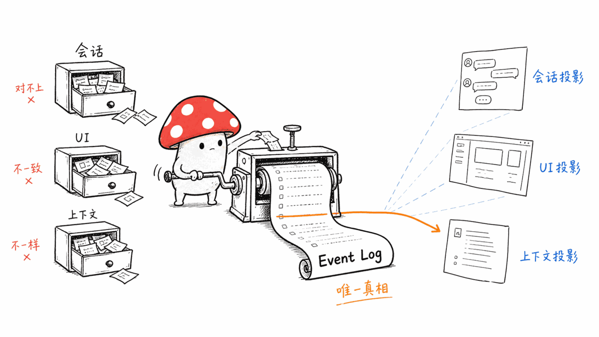
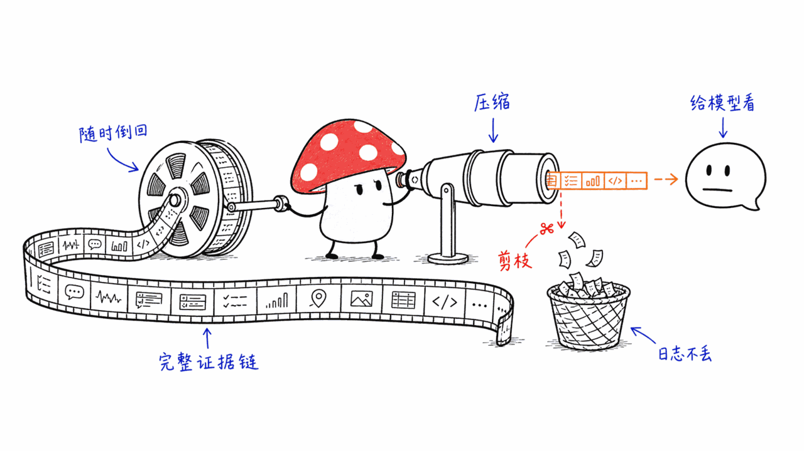
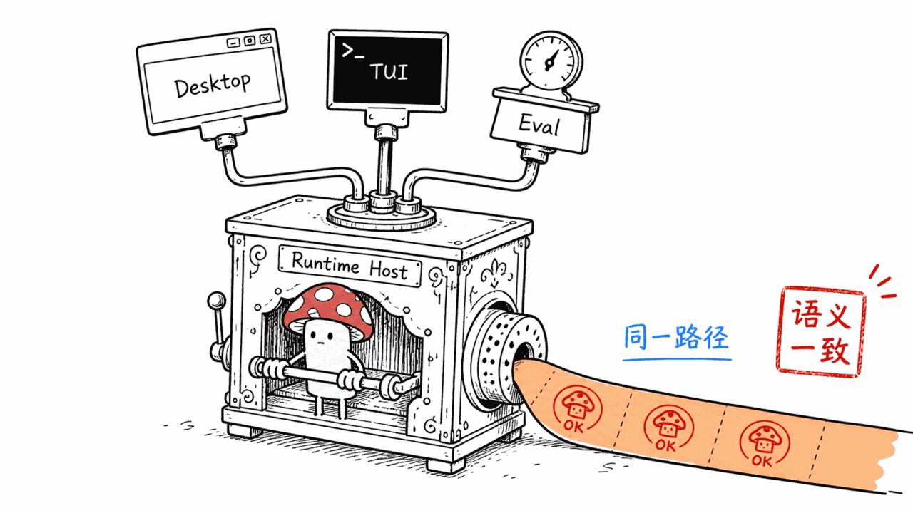
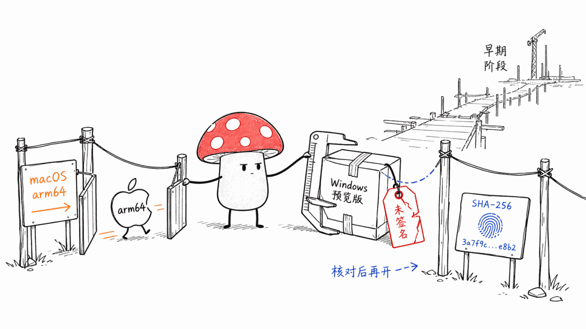

*by Mycelium Protocol*

---

项目地址：https://github.com/maka-agent/maka-agent
授权：Apache-2.0

---

## 一句话结论

**Maka 是一个本地优先的 Agent 工作台，但真正值得写的不是它的界面，是它的后端架构决策：「Log is the Runtime」——日志即运行时。** 模型消息、工具调用、工具结果、终止事实，全部作为不可变事实写入 Runtime Event Log；会话视图、UI 展示、发给模型的上下文、崩溃后的恢复——这些都不是各自维护的独立状态，而是对同一份日志做的"投影"（projection）。Apache-2.0，1374 star，目前只有 macOS Apple Silicon 的签名公开版，Windows 是未签名预览版。

## 为什么"日志即运行时"是个好设计

大多数 Agent 应用的架构是反过来的：先有一个"会话"对象保存对话历史，UI 读这个对象渲染，恢复的时候也从这个对象读。会话状态、UI 状态、发给模型的上下文，是三份可能互相不同步的东西。

Maka 把这个关系倒转了。**Runtime Event Log 是唯一的事实来源**，其他一切都是从它算出来的：

- 会话列表和 Turn 历史 = 对日志的一种读取方式
- 发给模型的上下文 = 对日志做主动剪枝（Tool Result pruning）和压缩（LLM Compaction）后的产物
- 崩溃恢复 = 从日志重放，不需要专门的"存档点"机制

这里有个细节值得单独拎出来："**上下文不等于历史**"（Context is not history）——工具结果剪枝和上下文压缩会改变下一次推理时模型看到的内容，但**不会把已经记录的证据当成可丢弃的上下文**。换句话说：给模型看的东西可以精简，但日志本身永远保留完整证据链，你随时能倒回去看"当时到底发生了什么"。

## 三个入口，一个执行权威

Desktop（Electron + React，日常交互用）、TUI/CLI（`maka` / `maka run`，终端里用）、Eval（跑可复现的基准测试）——三个完全不同的界面形态，**全部通过同一个 Runtime Host 执行**。Runtime Host 独占 Session、Turn、Agent 生命周期、续跑、工具、事件这些核心概念；Eval 只负责实验语义和结果统计，不重新实现一遍执行逻辑。

这意味着你在 Desktop 里手动跑的一个任务，和 Eval 里自动跑的同一个任务，走的是完全相同的执行路径——不存在"界面版本"和"评测版本"行为不一致的问题。这对写评测基准的人来说是个挺重要的保证：**你测的就是用户实际会用到的那套执行逻辑，不是一个为了测试单独抽出来的简化版本。**

## 现状：早期，但工程上诚实

项目自己在 README 顶部用醒目的提示框写着："Maka 处于活跃开发阶段，macOS Apple Silicon 桌面版是早期公开发行版，数据格式、CLI 命令、实验性能力可能仍会变化。" 目前只支持 Apple Silicon（`arm64`），Intel Mac、Windows、Linux 都还没有正式支持——Windows 有一个未签名的预览版，SmartScreen 会提示"未知发布者"，官方明确写了：除非下载文件的 SHA-256 和发布页公布的校验值一致，否则不要绕过这个警告。

这种"能力边界写清楚、不过度承诺"的姿态，在早期项目里不算常见，值得加分。

## 谁该看这个

**适合**：Apple Silicon Mac 用户，想要一个本地优先、执行过程可审计（完整事件日志）的 Agent 工作台；正在做 Agent 评测、想要"评测环境和生产环境执行语义一致"这个保证的人。

**不适合 / 需要注意**：早期版本，数据格式和 CLI 可能变化，生产依赖需要观望；Windows/Linux/Intel Mac 用户目前基本用不了。

---

> © 2026 Author: Mycelium Protocol. 本文采用 [CC BY 4.0](https://creativecommons.org/licenses/by/4.0/deed.zh) 授权——欢迎转载和引用，须注明作者姓名及原文链接，不得去除署名后以原创发布。

<!--EN-->

## TL;DR

**Maka is a local-first agent workspace, but what's actually worth writing about is a backend architecture decision: "Log is the Runtime."** Model messages, tool calls, tool results, and termination facts are all written as immutable facts into a Runtime Event Log; session views, UI rendering, the context sent to the model, and crash recovery aren't separately maintained state — they're all projections over that one log. Apache-2.0, 1,374 stars, currently a signed public release for macOS Apple Silicon only, with Windows as an unsigned preview.

## Why "log is the runtime" is a good design

Most agent apps invert this relationship: a "session" object holds conversation history first, the UI reads from it to render, and recovery reads from it too. Session state, UI state, and the context sent to the model end up as three things that can drift out of sync.

Maka flips it. **The Runtime Event Log is the single source of truth**, and everything else is computed from it:

- The session list and turn history = one way of reading the log
- The context sent to the model = the product of actively pruning (tool result pruning) and compacting (LLM compaction) the log
- Crash recovery = replaying the log, with no separate checkpoint mechanism needed

One detail worth pulling out on its own: **"context is not history."** Tool-result pruning and context compaction change what the model sees on the next inference call, but they never treat recorded evidence as disposable context. In other words: what the model sees can be trimmed down, but the log itself always retains the full chain of evidence — you can always go back and see exactly what happened.

## Three entry points, one execution authority

Desktop (Electron + React, for daily interaction), TUI/CLI (`maka` / `maka run`, for the terminal), and Eval (for reproducible benchmark runs) — three completely different interface shapes, **all executing through the same Runtime Host.** The Runtime Host exclusively owns Session, Turn, agent lifecycle, continuation, tools, and events; Eval owns only experiment semantics and result aggregation, not a reimplementation of the execution logic.

This means a task you run manually in Desktop and the same task run automatically in Eval take the exact same execution path — there's no "UI version" versus "benchmark version" behavioral drift. For anyone writing evaluation benchmarks, that's a meaningful guarantee: **you're testing the exact execution logic users actually experience, not a simplified stand-in built just for testing.**

## Status: early, but honestly labeled

The project puts a prominent callout right at the top of its README: "Maka is under active development. The macOS Apple Silicon desktop build is an early public release; data formats, CLI commands, and experimental capabilities may still change." Currently only Apple Silicon (`arm64`) is supported — Intel Mac, Windows, and Linux aren't officially supported yet. Windows has an unsigned preview build that SmartScreen flags as coming from an "unknown publisher," and the project states explicitly: don't bypass that warning unless the downloaded file's SHA-256 matches the checksum published with the release.

This posture — clearly stating the boundaries of what works and not over-promising — isn't common in early-stage projects, and it's worth crediting.

## Who should look at this

**Good fit**: Apple Silicon Mac users who want a local-first agent workspace with an auditable execution trail (a complete event log); anyone building agent evaluations who wants the guarantee that "the eval environment and the production environment share identical execution semantics."

**Not a fit / worth noting**: early-stage release — data formats and CLI may still shift, so think twice before depending on it in production. Windows, Linux, and Intel Mac users can't really use it yet.

---

> © 2026 Author: Mycelium Protocol. Licensed under [CC BY 4.0](https://creativecommons.org/licenses/by/4.0/) — free to share and adapt with attribution. You must credit the author and link to the original; removing attribution and republishing as original is not permitted.
