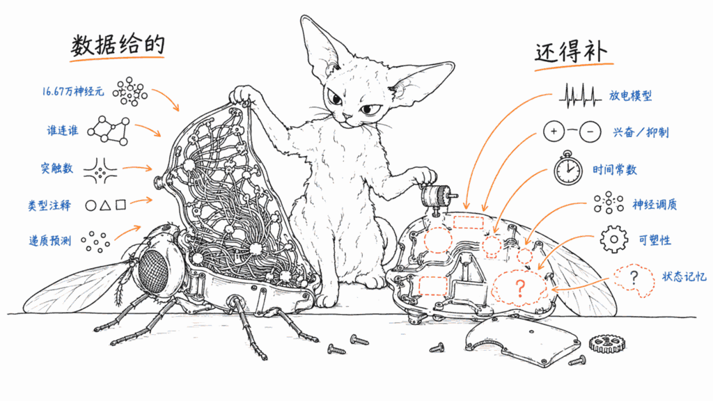
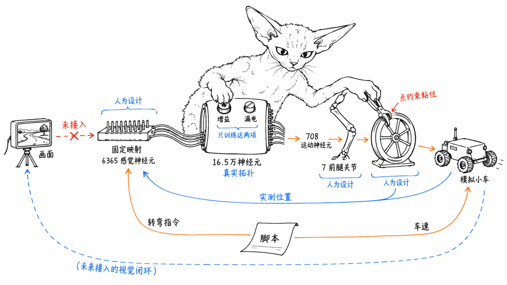
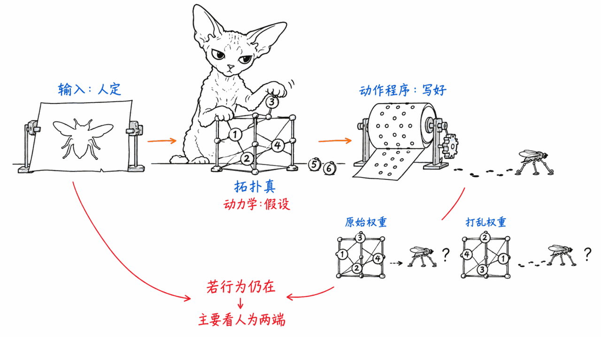
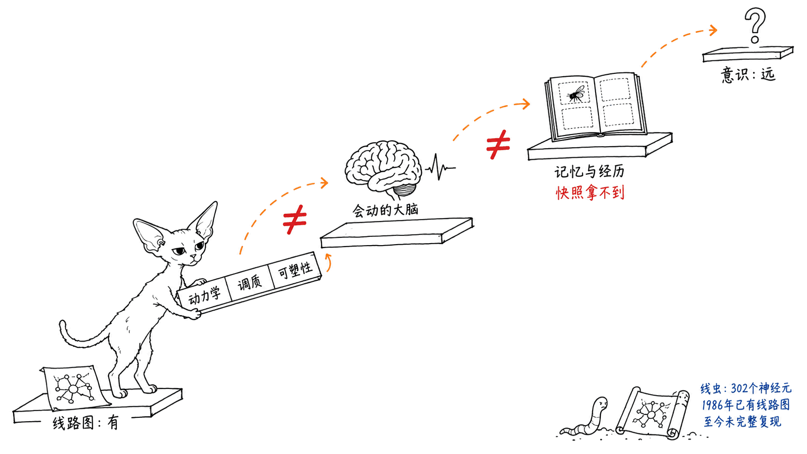

**BLUF**：机器之心这条 89 秒的小红书视频讲的是真事，但被剪得比实际更「神」。起点是 **2026 年 9 月 3 日**随 *Cell* 论文正式发布的雄性果蝇全中枢神经连接组 **MaleCNS v1.0**：约 **16.67 万个神经元、约 1.25 亿个突触连接**，脑和腹神经索（相当于果蝇的脊髓）都在里面，数据按 **CC BY 4.0** 开放下载。一周之内，网友把它接进了《我的世界》、节奏光剑和 CARLA 驾驶模拟器。我们逐个翻了一手源，结论是：**这些项目用的线路图是真的，但「果蝇在玩游戏」这件事，大部分是开发者设计出来的**。最扎实的 Flyhard 用 165,122 个神经元的模型学会了用前腿转方向盘（留出测试从 0/100 变成 100/100，整次实验花了 0.67 美元），可车速和转弯指令仍是脚本给的，也还没接视觉；Minecraft 版的动作是人写好的程序，神经活动只负责「选哪个程序」，而且打乱权重后部分反应仍然存在；节奏光剑那段，开发者自己承认是在复现一段录好的动作。**连接组是一张线路图，不是一个大脑，更谈不上「上传了果蝇的意识」。**

> 📌 一手资料
> MaleCNS 数据下载（CC BY）：https://male-cns.janelia.org/download/
> Google Research 发布博客：https://research.google/blog/a-connectomics-milestone-mapping-the-complete-male-fruit-fly-brain/
> NeuroCraft Fly（我的世界）：https://github.com/evnsnclr/neurocraft-fly-public
> Flyhard（学开车）：https://github.com/MarkUnthank/flyhard
> The Driving Fly（广告位网站）：https://thedrivingfly.com/

---

## 这条视频到底讲了什么？

读者问得好：这是个视频，内容能提取出来吗？能。小红书给这条笔记挂了官方字幕文件（中文原字幕和英文翻译字幕），我们直接取回了完整的中文字幕，一共 21 句、89 秒。归纳下来，视频讲了五个场景：

1. **进《我的世界》**：食物、光线和攻击被转成信号输入神经模型，模型的活动「参与控制」虚拟果蝇的移动和进食
2. **打节奏光剑**：画面看起来像果蝇学会了打，但视频里也说了，**开发者解释目前展示的是训练模型复现一段录好的动作，还没做到自己看方块打游戏**
3. **果蝇天堂**：有人看不下去，给数字果蝇造了一个有草地、有树、有吃不完的水果的世界
4. **学开车**：一个叫 Flyhard 的项目，用「十六万多个神经元的连接数据」搭模型，让它控制虚拟果蝇的腿去转模拟器里的方向盘
5. **拉广告赞助**：视频说开发者把网站上的小车分成了「五十九个广告位」，空位 1 美元起

视频本身交代得还算老实（第 2 条它自己就说了），但标题「快被网友玩坏了」和「数字生命实验」这种说法，很容易让人以为有一只果蝇真的活在了电脑里。下面按一手源逐个核实。

## 起点：9 月 3 日公开的那张果蝇线路图



所有这些项目都建立在同一份数据上：**MaleCNS v1.0**，由 HHMI Janelia 的 FlyEM 团队、剑桥大学动物学系、MRC 分子生物学实验室和 Google Research 共同完成。

- **规模**：Google Research 博客的说法是「超过 166,000 个神经元、1.25 亿个突触连接」；*Cell* 论文（Berg 等，《Sexual dimorphism in the complete Drosophila male central nervous system connectome》）给出的是约 16.67 万个神经元、**11,710 个神经元类型**
- **范围**：不只是脑，还包括**腹神经索（VNC）**，也就是控制腿和翅膀的那部分。这一点很关键：2024 年 FlyWire 发表的雌性果蝇连接组只有脑（约 13.9 万个神经元、约 5,000 万个连接），没有「脊髓」，想让模型驱动腿，就得额外搭一层接口
- **方法**：把一只果蝇的神经系统切成数百万张超薄切片，逐张电镜成像，AI 做三维重建，再由 Janelia 的团队人工校对。据新智元报道，这个项目前后做了十年，人工校对投入约 44 人年
- **发现**：论文对比了雌雄两套连接组，报告 8,069 个类型两性一致、138 个两性异形、289 个雄性特有、71 个雌性特有
- **许可**：官方下载页写明数据采用 CC BY 许可。最核心的连接权重表（connectome-weights）约 1.1GB，神经元注释表只有 13MB，普通电脑就能下

这张图有多大、数据量是怎么来的，本站之前写过一篇《脑子的数据量：从果蝇 20TB 到人脑 1.4PB》：https://blog.mushroom.cv/blog/brain-connectome-data-size-fly-human-mouse/

### 我们本机核实了什么？

我们在本机（Apple Silicon Mac mini）下载了官方的神经元注释表 `body-annotations-male-cns-v1.0-minconf-0.5.feather`（14.5MB），用 pandas 数了一遍：

- 表里一共 211,577 个「体」（body），其中状态为 **Traced 的神经元正好 165,122 个**，和 Flyhard 报告里的数字完全一致；其余是孤立碎片（15,925）、胶质细胞（11,864）等
- 超类为 `vnc_sensory` 的是 **6,365** 个，`vnc_motor` 是 **708** 个，也和 Flyhard 的输入、输出神经元数一致。也就是说，Flyhard 是把腹神经索里**所有**已标注的感觉神经元当输入、**所有**运动神经元当输出
- 视觉相关的超类（视叶内在神经元 89,390、视觉投射 9,201、视叶感觉 4,114、视觉离心 563）合计 **103,268 个，占 Traced 神经元的约 62.5%**。果蝇的神经系统有六成以上在处理视觉，而目前没有一个项目真正用上了这部分
- 从脑通往身体的**下行神经元只有 1,314 个**，这是「脑想做什么」传给腿和翅膀的瓶颈。这也解释了为什么 Eon、DesktopFly 这些项目都选择在少数几个下行神经元上「接线」
- Traced 神经元里有类型标注的共 11,751 种，和论文说的 11,710 种接近（口径略有不同）

需要先记住的是：**连接组记录的是「谁连着谁、连了多少个突触」**，外加每个神经元的类型注释和神经递质预测。它不记录这只果蝇死前神经元在做什么，也不直接告诉你一个突触是兴奋还是抑制（递质只是预测）、信号传多快、连接会不会随学习改变。后面所有项目的差别，基本都出在「怎么把这些空白补上」。

## 网友给果蝇安排的「离谱人生」，逐个核实

| 项目 | 开发者 | 用了多少神经元 | 真实的部分 | 人为设计的部分 | 状态（9 月 11 日） |
|---|---|---:|---|---|---|
| NeuroCraft Fly（我的世界） | Evan Sinclair Smith | 166,700 个，25,582,938 条有向边 | 连接拓扑、神经元注释 | 感觉输入映射、神经动力学、读出神经元选择、**动作全是写好的程序** | 只有演示视频，软件未发布 |
| 节奏光剑 | Lyra Bubbles（X：@_lyraaaa_） | 未公开 | 连接组数据 | 运动系统被训练去复现录好的动作序列 | 强化学习仍在做，未见公开代码 |
| 果蝇天堂 | Macroblock（X：@sainimatic） | 未公开 | — | 整个环境 | 一个「反向操作」的模拟场景 |
| Flyhard（学开车） | Mark Unthank | 165,122 个，25,563,197 条连接 | 连接拓扑；训练只改连接增益和漏电参数 | 输入/输出映射固定、脚爪「粘」在方向盘上、车速和转向指令是脚本 | 转方向盘单项技能已通过，视觉驾驶未开始 |
| DesktopFly（桌面宠物） | Denis Sergeevitch | FlyWire 668 个 + MaleCNS 1,045 个 | 两套连接组的局部电路 | LIF 参数、两套标本之间的接口、飞行和梳理动画 | 可安装，GitHub 835 星 |

### 《我的世界》：神经活动负责「选程序」，动作是写好的

NeuroCraft Fly 的 README 是我们这次读到最坦白的一份。它把整条链路写得很清楚：

```text
Minecraft 输入 → 模型化的神经活动 → 带标签的读出 → 写好的身体程序 → Minecraft 里的动作
```

原话是：连接数据来自重建，「感觉映射和动力学是建模的，手工挑选的读出神经元负责选择和调节写好的身体程序」，这「并不能证明恢复了果蝇的生理机制或自然行为」。演示里有六种交互：玩家靠近、附近的怪物、用刷子刷、攻击、食物和光。

最值得看的是它自己做的对照实验，也写在录像说明里：

- 演示视频包含「原始权重」「打乱权重（seed 7）」「无感觉输入」三组对比
- 说明原文承认：**部分对照在权重被打乱后仍然保留了反应，而且在关掉感觉输入时，基础巡航也能让身体动起来**
- README 还提到一个历史发现：一个训练出来的读出层，在它的导航任务上，原始误差是直接控制器的 **95.66 倍**，投影误差是 **403.70 倍**

换句话说，在这个实现里，「这是果蝇的线路」对最终动作的贡献有多大，作者自己也还没说清楚，他在路线图里写的就是下一步要做多种子打乱、显式基线和对建模假设的敏感性分析。另外，**这个仓库目前只是项目主页**，mod 和代码都还没发布，你现在下载不到能跑的东西。

据 IBTimes 援引作者的说法，项目是借助 GPT-6 Astra 写出来的；据新智元报道，作者是佐治亚理工的硕士生，在数据集发布后约两天就做出了原型。

### 节奏光剑：画面很唬人，但是在「背谱」

这是传播最广的一段。据 Dexerto 和 IBTimes 报道，开发者 Lyra Bubbles 发帖说「果蝇大脑能打节奏光剑」，随后自己澄清：视频**还没有展示模型独立打节奏光剑**，运动系统是被训练（她的原话是「过拟合」）去复现一段录好的动作序列，看到方块再做反应的部分还在用强化学习训练。机器之心的视频也转述了这个说明。我们没有找到这个项目的公开代码。

### 果蝇天堂：一个善意的玩笑

X 用户 Macroblock 的出发点，据 Dexerto 引用他的原话：「大家都在对这只可怜的果蝇做可怕的事，把它困在黑镜式的噩梦环境里、施加最大痛苦、逼它无限循环同一首节奏光剑歌，所以我要做一个模拟，让它在果蝇天堂里永远飞下去。」这是个玩笑，但它碰到了一个真问题，我们放在后面讨论。

### Flyhard：目前方法论最扎实的一个



Mark Unthank 的 Flyhard 目标是让连接组模型「用身体」开车：摄像头画面 → 连接组模型 → 腿部动作 → 物理接触方向盘和踏板 → 方向盘和踏板的实测位置 → CARLA 里的车动起来 → 新的画面。README 明确规定，车必须由身体物理操作，**用动画驾驶员直接发车辆指令不算**。

9 月 9 日完成的第一次 A6000 试验，pilot 报告给出的事实：

- **模型**：保留 MaleCNS 里状态为「Traced」的 **165,122 个神经元**，以及它们之间全部 **25,563,197 条连接**，合计 **124,025,046 个突触**，不设额外权重阈值
- **神经元模型**：带符号的标量**发放率**状态（不是脉冲神经元），权重按入度归一化，**神经递质预测已下载但还没用来区分兴奋和抑制**。每个控制决策做 4 步循环更新，决策之间状态清零
- **输入输出**：请求的方向盘角度加上方向盘和 7 个关节的实测位置，通过**固定、没有训练的映射**注入 6,365 个标注为 `vnc_sensory` 的神经元；从 708 个 `vnc_motor` 神经元读出 7 个前腿关节指令
- **训练什么**：只训练图内的连接增益和神经元漏电参数，共 **25,728,319 个可训练参数**，拓扑不变
- **身体**：NeuroMechFly（MuJoCo），胸部被固定住，**左前脚用一个点约束「粘」在方向盘边缘**。报告明说这是工程辅助，不是学出来的自然抓握
- **结果**：100 个没见过的目标角度，训练前 **0/100** 通过，训练 600 步后 **100/100**；平均最差保持误差 1.48°，最差一次 4.85°（预设门槛 7.45°）。训练 186 秒，峰值显存 3.00GB。**整次 Runpod 会话花了 0.67 美元**
- **接上 CARLA**：模型已经能在 CARLA 里边开边转真实的方向盘，跑完一段 24 秒的指令序列；断开脚爪约束后，转向响应消失 99% 以上

同样重要的是它自己列出的「还没做到」：**视觉驾驶、方向盘和踏板联合控制、三个随机种子的复现、和普通策略网络的对比**都还没做；目前 CARLA 视频里的**车速和转弯请求是脚本给的**；这个技能主要走的是腹神经索通路，**大脑的视觉通路还没被用上**。README 原话：这「不是在声称重建了原来那只果蝇的心智或生物学习」。

还有一个没做的对照值得单独点出来：报告写明，前后对比只能证明「是核心参数的变化带来了进步」，**不能证明果蝇的拓扑比打乱的图或一个普通策略网络更好**。这也是整个「果蝇大脑玩游戏」热潮里最关键、目前还没人回答的问题。

**关于那 59 个广告位**：我们 9 月 11 日打开 thedrivingfly.com 时，页面写的是 **7 个大广告位**（车门、车窗、引擎盖、车顶、前格栅、后窗），空位 1 美元起，每次加价至少 1 美元，出价更高的人付款并发布后就会替换掉你，没有保底时长、不退款；另有一个 1 万美元的整车定制涂装，每卖出一次涨 1 美元。视频里「五十九个」这个数字，要么是网站改过版，要么是字幕识别有误，我们没法核实。网站底部也写了一句：「一只模拟的果蝇、一份实测的连接组、一个真实的研究问题。没有活果蝇坐在方向盘后面。」

### 顺带一提：DesktopFly

同一波热潮里还有个更早的项目 DesktopFly（8 月 18 日建仓，835 星），让一只 3D 果蝇住在你的 macOS 桌面上。它用 FlyWire 里 668 个神经元的逃跑、转向、梳理电路跑 1kHz 的 **LIF（漏电积分发放）脉冲模拟**，9 月 5 日又加了 MaleCNS 里 1,045 个神经元的运动电路来驱动腿。它的 README 同样写得很清楚：LIF 参数、突触符号和延迟、两套不同标本之间的接口、肌肉力学都是「配置出来的模型」，飞行、梳理和睡眠仍然是动画加状态规则。注意它从 FlyWire 派生的数据是 **CC BY-NC 4.0**（不能商用），从 MaleCNS 派生的是 CC BY 4.0。

## 哪些是果蝇「自己」做的，哪些是开发者写的？



把这些项目拆开，每一个都是三段式：

1. **输入端（人定的）**：游戏里的「食物」「光」「攻击」「方向盘角度」怎么变成神经信号、注入哪些神经元、强度多大，全是开发者选的。真实果蝇的感觉器官和《我的世界》的方块之间没有天然的对应关系
2. **中间（一半真一半假设）**：**连接拓扑是真的**，但神经元用什么模型（Flyhard 用发放率，DesktopFly 和 Eon 用 LIF）、突触是兴奋还是抑制、时间常数多大、有没有神经调质，都是假设。同一张线路图配上不同的假设，行为会完全不同
3. **输出端（大多是人定的）**：NeuroCraft 的动作是写好的程序；Flyhard 的腿接的是固定映射和一个「胶水」约束；Eon Systems 今年 3 月那只「具身果蝇」也一样，它的技术文章写明走路控制器是模仿学习训练的，高层映射「是手工选的，不是从连接组推导出来的」

所以判断这类演示，最该问的问题是：**把连接权重打乱之后，行为还在不在？** 如果还在，说明行为主要来自输入输出那两层人为设计，而不是果蝇的线路。NeuroCraft 的录像说明已经承认部分反应在打乱后依然存在；Flyhard 明确说还没做这个对比。到目前为止，**没有一个项目证明了「因为是果蝇的线路，所以它才会这样动」**。

## 这算不算「上传了果蝇的意识」？

不算，而且差得很远。理由有四层：

**第一，线路图不等于大脑。** 连接组给的是结构。一个神经元在什么条件下放电、突触强度多大、多巴胺和血清素这类神经调质怎么全局调节状态、胶质细胞做了什么、学习时连接怎么变，这些都不在图里。Eon Systems 自己的说法是：他们的结果「还不应被解读为结构本身就足够的证明」。

**第二，这是一只死去的果蝇在某一刻的快照。** 它记录不了这只果蝇的记忆、状态和经历，就像拍下一台电脑主板的照片，拿不到硬盘里的文件。

**第三，最小的案例早就给过答案。** 秀丽隐杆线虫只有 302 个神经元，线路图 1986 年就发表了，OpenWorm 等项目模拟了十几年，至今仍然没有一只「数字线虫」能完整复现真线虫的行为。果蝇的神经元数量是它的 500 多倍。

**第四，开发者们自己都不这么说。** Flyhard 写了「不是在声称重建原来那只果蝇的心智」；NeuroCraft 写了「并不能证明恢复了果蝇的生理机制或自然行为」；据 IBTimes 报道，Evan Smith 也提醒外界别把项目理解成「数字化复活了一只有意识的果蝇」，因为虚拟感觉怎么进入网络、神经活动怎么变成动作，都是开发者决定的。



「果蝇天堂」的玩笑背后是个真问题：如果将来某个模型真的复现了恐惧、痛觉的计算结构，我们该怎么对待它？但就今天这些项目而言，被「虐待」的是一张带权重的稀疏矩阵和一堆写好的动作程序，担心它受苦还为时过早。

## 那这波热闹有什么价值？

我们的判断是：**价值是真的，但不在「数字生命」，而在门槛**。

- **开放数据加 AI 编程，把门槛打到了地板上**。一份 CC BY 许可、十年、44 人年校对的数据集，一个硕士生借助 AI 两天做出能玩的原型，一个独立开发者花 0.67 美元跑完一次严肃的试验。这在五年前是不可想象的
- **Flyhard 示范了业余项目该怎么做研究**：先写好通过门槛再做实验，留出测试集，做干预对照（断开脚爪约束，响应消失 99% 以上），承认失败的探针，公开花费。这比很多论文的写法都诚实
- **真正的科学问题被摆上了台面**：生物拓扑作为神经网络的「先天结构」，到底能不能带来普通网络没有的学习优势？Flyhard 路线图里的「和普通策略、打乱图对比」一旦做出来，无论正反结果都有意义
- **风险在传播层**：「把果蝇放进游戏」「数字生命」这类标题，会让大众误以为意识上传已经起步。一手源其实写得很克制，失真几乎都发生在二次传播里

## 常见问题

**Q：这些果蝇模型用的是真实果蝇的数据吗？**
A：用的是真实的连接数据。MaleCNS v1.0 来自一只雄性果蝇的电镜重建，约 16.67 万个神经元、约 1.25 亿个突触。但神经元怎么放电、突触是兴奋还是抑制、感觉怎么输入、动作怎么输出，都是开发者建模或设计的。

**Q：果蝇真的学会打节奏光剑了吗？**
A：没有。开发者自己澄清了，视频展示的是被训练来复现一段录好动作的模型，它还不能看到方块再做反应，强化学习部分还在做。

**Q：果蝇真的会开车了吗？**
A：只会一项：在指令给定目标角度时，用前腿把方向盘转到位（100 个没见过的角度全部通过）。车速和转弯指令是脚本给的，也还不能看路。README 自己的定位是「带工程接口的指定角度转向技能」。

**Q：我能自己玩吗？**
A：NeuroCraft Fly 目前只有演示视频，软件还没发布。Flyhard 代码是 MIT 许可，需要在 Runpod 等云 GPU 上跑（已测 A6000 和 A40）。DesktopFly 可以直接在 macOS 13+ 上编译运行，Windows 有 Electron 移植版。

**Q：MaleCNS 数据能商用吗？**
A：官方下载页写的是 CC BY，署名即可使用，包括商用。但 FlyWire 的雌性果蝇数据和从它派生的文件（比如 DesktopFly 里的部分数据）是 CC BY-NC，不能商用，混用时要分清。

**Q：这离人类意识上传有多远？**
A：非常远。人脑约有 860 亿个神经元，是果蝇的约 50 万倍；而且就算是果蝇，目前也没有人证明「光靠线路图」就能复现它的行为。

## 一手资料

- 小红书原视频（机器之心）：https://www.xiaohongshu.com/explore/6aa3b9db000000002901083a
- MaleCNS 数据下载与许可：https://male-cns.janelia.org/download/
- Google Research 发布博客：https://research.google/blog/a-connectomics-milestone-mapping-the-complete-male-fruit-fly-brain/
- *Cell* 论文：https://www.cell.com/cell/fulltext/S0092-8674(26)00942-6
- 论文预印本（bioRxiv）：https://www.biorxiv.org/content/10.1101/2025.10.09.680999v1
- Janelia 新闻稿：https://www.janelia.org/news/researchers-reveal-connectome-of-the-male-fruit-fly-central-nervous-system
- NeuroCraft Fly：https://github.com/evnsnclr/neurocraft-fly-public
- Flyhard：https://github.com/MarkUnthank/flyhard
- Flyhard 首次试验报告：https://github.com/MarkUnthank/flyhard/blob/main/docs/pilot-2026-09-09.md
- The Driving Fly：https://thedrivingfly.com/
- DesktopFly：https://github.com/DenisSergeevitch/desktop-fly
- Eon Systems 具身果蝇技术文章：https://eon.systems/updates/embodied-brain-emulation
- 二手报道：IBTimes UK https://www.ibtimes.co.uk/fruit-fly-neural-network-gaming-experiments-1819013 ；Dexerto https://www.dexerto.com/gaming/googles-digital-fly-brain-gets-its-own-heaven-after-going-through-beat-saber-hell-3407304/ ；新智元（36氪转载）https://eu.36kr.com/en/p/3971642393686535

---

> © 2026 Author: Mycelium Protocol. 本文采用 [CC BY 4.0](https://creativecommons.org/licenses/by/4.0/deed.zh) 授权——欢迎转载和引用，须注明作者姓名及原文链接，不得去除署名后以原创发布。

<!--EN-->

**BLUF**: This 89-second XiaoHongShu video from Synced (机器之心) describes real events, but the edit makes them look more magical than they are. It all starts with **MaleCNS v1.0**, the complete connectome of a male fruit fly's central nervous system, formally published alongside a *Cell* paper on **September 3, 2026**: about **166,700 neurons and 125 million synaptic connections**, covering both the brain and the ventral nerve cord (roughly the fly's spinal cord), openly downloadable under **CC BY 4.0**. Within a week, people had wired it into Minecraft, Beat Saber and the CARLA driving simulator. We went through each primary source, and here's the short version: **the wiring these projects use is real, but most of "the fly is playing a game" was designed by the developers**. The most rigorous of them, Flyhard, taught a 165,122-neuron model to turn a steering wheel with its foreleg (0/100 to 100/100 on held-out targets, for $0.67 in total compute), but the car's speed and turn requests are still scripted and vision isn't connected yet. In the Minecraft version, the movements are hand-written programs and neural activity only chooses which one runs, and some responses survive shuffled weights. The Beat Saber developer admits the clip replays a recorded motion. **A connectome is a wiring diagram. It isn't a brain, and nobody has "uploaded a fly's mind."**

> 📌 Primary sources
> MaleCNS downloads (CC BY): https://male-cns.janelia.org/download/
> Google Research announcement: https://research.google/blog/a-connectomics-milestone-mapping-the-complete-male-fruit-fly-brain/
> NeuroCraft Fly (Minecraft): https://github.com/evnsnclr/neurocraft-fly-public
> Flyhard (driving): https://github.com/MarkUnthank/flyhard
> The Driving Fly (ad-slot site): https://thedrivingfly.com/

---

## What Does the Video Actually Say?

A reader asked a fair question: it's a video, so can you even extract what's in it? Yes. XiaoHongShu attaches official subtitle files to this note (the original Chinese track plus an English translation), and we pulled the full Chinese transcript: 21 lines over 89 seconds. It covers five scenes:

1. **Into Minecraft**: food, light and attacks are converted into signals fed into the neural model, and the model's activity "helps control" the virtual fly's movement and feeding.
2. **Beat Saber**: it looks like the fly has learned to play, but the video itself says **the developer explained this is a trained model replaying a recorded motion, and it can't yet play by watching the blocks**.
3. **Fruit fly heaven**: someone felt sorry for the fly and built it a world with grass, trees and endless fruit.
4. **Driving school**: a project called Flyhard built a model from "more than 160,000 neurons' worth of connection data" and has it move the virtual fly's legs to turn a steering wheel in a simulator.
5. **Selling ads**: the video says the developer split the car on the website into "59 ad slots," starting at $1 each.

The video is reasonably honest (point 2 comes from the video itself). But the title, "Put a fruit fly in a game and netizens nearly broke it," and phrases like "digital life experiments" make it easy to believe a fly is now living inside a computer. Here's what the primary sources say.

## The Starting Point: The Fly Wiring Diagram Released September 3


Every one of these projects is built on the same dataset: **MaleCNS v1.0**, produced by HHMI Janelia's FlyEM team, the University of Cambridge Department of Zoology, the MRC Laboratory of Molecular Biology and Google Research.

- **Scale**: Google Research's blog says "over 166,000 neurons and 125 million synaptic connections." The *Cell* paper (Berg et al., "Sexual dimorphism in the complete Drosophila male central nervous system connectome") reports about 166,700 neurons and **11,710 neuron types**.
- **Coverage**: not just the brain, but also the **ventral nerve cord (VNC)**, the part that runs the legs and wings. That matters. The female fly connectome FlyWire published in 2024 covers the brain only (about 139,000 neurons and about 50 million connections), with no "spinal cord," so driving legs from it needs an extra interface layer.
- **Method**: one fly's nervous system was cut into millions of ultra-thin sections, each imaged by electron microscope, reconstructed in 3D with AI, then proofread by hand at Janelia. According to XinZhiyuan (新智元), the project took ten years, with about 44 person-years of manual proofreading.
- **Findings**: comparing male and female connectomes, the paper reports 8,069 types shared by both sexes, 138 sexually dimorphic, 289 male-specific and 71 female-specific.
- **License**: the official download page says the data is CC BY. The core connection-weights table is about 1.1GB and the neuron annotation table is just 13MB, so an ordinary computer can handle it.

For how big these maps are and where the data volume comes from, see our earlier post "How Much Data Is a Brain? From a Fly's 20TB to a Human Cortex's 1.4PB": https://blog.mushroom.cv/blog/brain-connectome-data-size-fly-human-mouse/

### What Did We Verify Locally?

On our Apple Silicon Mac mini we downloaded the official neuron annotation table, `body-annotations-male-cns-v1.0-minconf-0.5.feather` (14.5MB), and counted it with pandas:

- The table holds 211,577 "bodies." Of those, **exactly 165,122 are neurons with status Traced**, matching Flyhard's report to the digit. The rest are orphan fragments (15,925), glia (11,864) and so on.
- The `vnc_sensory` superclass has **6,365** neurons and `vnc_motor` has **708**, which also match Flyhard's input and output counts. So Flyhard uses **every** annotated sensory neuron in the ventral nerve cord as input and **every** motor neuron as output.
- Vision-related superclasses (optic lobe intrinsic 89,390, visual projection 9,201, optic lobe sensory 4,114, visual centrifugal 563) add up to **103,268, about 62.5% of Traced neurons**. More than 60% of the fly's nervous system is processing vision, and none of these projects really uses it yet.
- Only **1,314 descending neurons** carry signals from the brain to the body. That's the bottleneck through which "what the brain wants" reaches the legs and wings, and it explains why Eon, DesktopFly and others all wire their interfaces into a handful of descending neurons.
- Traced neurons carry 11,751 distinct type labels, close to the paper's 11,710 (the counting rules differ slightly).

The thing to hold onto: **a connectome records who connects to whom, and through how many synapses**, plus type annotations and predicted neurotransmitters for each neuron. It doesn't record what this fly's neurons were doing before it died. It doesn't directly tell you whether a synapse excites or inhibits (the transmitter is only predicted), how fast signals travel, or whether connections change with learning. Nearly every difference between the projects below comes down to how they fill in those blanks.

## The Fly's "Absurd Lives," Checked One by One

| Project | Developer | Neurons used | Real part | Designed part | Status (Sept 11) |
|---|---|---:|---|---|---|
| NeuroCraft Fly (Minecraft) | Evan Sinclair Smith | 166,700, with 25,582,938 directed edges | Connection topology, neuron annotations | Sensory mapping, neural dynamics, choice of readout neurons, **all movements are pre-written programs** | Demo video only; software not released |
| Beat Saber | Lyra Bubbles (X: @_lyraaaa_) | Not disclosed | Connectome data | Motor system trained to replay a recorded motion sequence | RL still in progress; no public code found |
| Fruit fly heaven | Macroblock (X: @sainimatic) | Not disclosed | — | The whole environment | A deliberately gentle counter-project |
| Flyhard (driving) | Mark Unthank | 165,122, with 25,563,197 connections | Connection topology; training only changes connection gains and leak parameters | Fixed input/output mappings, foot "glued" to the wheel, scripted speed and turn requests | Single steering skill passed; visual driving not started |
| DesktopFly (desktop pet) | Denis Sergeevitch | 668 from FlyWire + 1,045 from MaleCNS | Local circuits from two connectomes | LIF parameters, interface between two specimens, flight and grooming animation | Installable; 835 GitHub stars |

### Minecraft: Neural Activity Picks the Program, the Program Moves the Fly

NeuroCraft Fly's README is the most candid document we read for this post. It spells out the whole chain:

```text
Minecraft inputs → modeled neural activity → labeled readouts
                 → scripted body programs → Minecraft movement
```

In its own words, the reconstruction supplies connectivity, while "sensory mappings and dynamics are modeled, and hand-chosen readouts select and modulate scripted body programs," which "does not establish recovered fly physiology or natural behavior." The demo covers six interactions: player approach, nearby mobs, brushing, attack attempts, food and light.

The most useful part is the control experiments, described in the recording notes:

- The demo video includes "original weights," "shuffled weights (seed 7)" and "no sensory input" conditions.
- The notes admit that **selected comparisons retain responses under shuffling, and baseline cruise can move the body with sensory input disabled**.
- The README also reports a historical finding: a trained readout had **95.66× higher raw error** and **403.70× higher projected error** than a matched direct controller on its navigation task.

In other words, even the author hasn't yet pinned down how much "this is a fly's wiring" contributes to what the body does. His roadmap lists multiple shuffle seeds, explicit baselines and sensitivity to modeling assumptions as the next step. Also, **the repository is currently just a landing page**: the mod and code haven't been released, so there's nothing runnable to download yet.

According to IBTimes, citing the author, the project was built with help from GPT-6 Astra. According to XinZhiyuan, the author is a master's student at Georgia Tech who had a prototype about two days after the dataset came out.

### Beat Saber: Impressive Footage, but It's Memorized

This is the clip that spread furthest. According to Dexerto and IBTimes, developer Lyra Bubbles posted that "the fly brain can play Beat Saber," then clarified that the video **does not yet show the model independently playing Beat Saber**. The motor system had been trained (her word was "overfit") to reproduce a recorded movement sequence, and reacting to incoming blocks was still being trained with reinforcement learning. The Synced video repeats this caveat. We didn't find public code for this project.

### Fruit Fly Heaven: A Kind-Hearted Joke

X user Macroblock explained his motivation, as quoted by Dexerto: "Everyone is doing terrible things to this poor fruit fly, trapping it in black mirror nightmare environments, inflicting max pain, forcing it to play the same beat saber song indefinitely etc, so I'm building a sim where it just gets to fly around forever in fruit fly heaven." It's a joke, but it touches a real question, which we come back to below.

### Flyhard: The Most Methodologically Solid of the Bunch


Mark Unthank's Flyhard aims to have a connectome model drive a car *with its body*: camera image → connectome model → leg movement → physical contact with wheel and pedals → measured wheel and pedal positions → the car moves in CARLA → a new image. The README is explicit that the body must physically operate the controls, and that **an animated driver sending vehicle commands directly doesn't count**.

Facts from the pilot report on the first A6000 run, completed September 9:

- **Model**: the **165,122 neurons** in MaleCNS with status "Traced," plus all **25,563,197 connections** between them, totaling **124,025,046 synapses**, with no extra weight threshold.
- **Neuron model**: signed scalar **rate** states (not spiking neurons), with incoming-normalized weights. **Neurotransmitter predictions were downloaded but aren't yet used to assign excitation or inhibition.** Four recurrent graph updates run per control decision, and the state resets between decisions.
- **Inputs and outputs**: the requested wheel angle plus measured wheel and seven joint positions go through **fixed, untrained mappings** into 6,365 neurons annotated `vnc_sensory`. Seven foreleg joint commands are read out from 708 `vnc_motor` neurons.
- **What's trained**: only connection gains and neuronal leak parameters inside the graph, **25,728,319 trainable parameters** in all, with the topology unchanged.
- **Body**: NeuroMechFly (MuJoCo). The thorax is held in place, and **the left forefoot is attached to the wheel rim by a point constraint**. The report says plainly that this is engineered assistance, not learned natural grasping.
- **Results**: on 100 held-out target angles, **0/100** passed before training and **100/100** after 600 optimizer updates. Mean worst hold error was 1.48°, and the worst trial was 4.85° against a predeclared 7.45° limit. Training took 186 seconds with 3.00GB peak GPU memory. **The whole Runpod session cost $0.67.**
- **In CARLA**: the saved model now turns the physical wheel while driving in CARLA through a 24-second instructed sequence. Disconnecting the foot grip removes over 99% of the steering response.

Just as important is its own list of what isn't done: **visual driving, combined wheel and pedal control, replication across three training seeds, and comparison with a conventional policy** are all still untested. In the current CARLA video, **speed and turn requests are scripted**. The skill mostly exercises ventral nerve cord pathways, and **the brain's visual pathways haven't been used yet**. The README says this "is not a claim to recreate the original fly's mind or biological learning."

One missing control deserves its own mention. The report states that the before/after comparison shows changes within the core caused the improvement, but **it doesn't establish that fly topology is better than a shuffled graph or an ordinary policy**. That's the most important unanswered question in this whole "fly brain plays games" wave.

**About those 59 ad slots**: when we opened thedrivingfly.com on September 11, the page listed **7 large spots** (doors, windows, bonnet, roof, front grille, rear window), starting at $1. Each new bid must beat the current owner by at least $1, a higher paid bid replaces your artwork once it's published, and there's no guaranteed duration and no refund. There's also a $10,000 full custom wrap whose price rises by $1 with every sale. The video's figure of "59" is either from an earlier version of the site or a subtitle recognition error; we couldn't verify it. The footer also says: "A simulated fly, a measured connectome, and a real research question. No living flies are behind the wheel."

### Also Worth Knowing: DesktopFly

An earlier project from the same wave, DesktopFly (repo created August 18, 835 stars), puts a 3D fruit fly on your macOS desktop. It runs a 1kHz **LIF (leaky integrate-and-fire) spiking simulation** of a 668-neuron FlyWire circuit for escape, steering and grooming, and on September 5 it added a 1,045-neuron locomotor circuit from MaleCNS to drive the legs. Its README is just as clear: LIF parameters, synaptic signs and delays, the interface between two different specimens, and muscle mechanics are all "configured models," while flight, grooming and sleep are still animation plus state rules. Note that its FlyWire-derived data is **CC BY-NC 4.0** (no commercial use), while its MaleCNS-derived data is CC BY 4.0.

## Which Parts Does the Fly Do "Itself," and Which Did the Developers Write?


Take any of these projects apart and you get three stages:

1. **Input (chosen by people)**: how Minecraft "food," "light," "attacks" or a "steering angle" become neural signals, which neurons receive them, and how strongly, are all developer choices. There's no natural mapping between a real fly's sense organs and Minecraft blocks.
2. **Middle (half real, half assumption)**: **the connection topology is real**. But the neuron model (Flyhard uses rates; DesktopFly and Eon use LIF), whether each synapse excites or inhibits, the time constants, and whether there are neuromodulators are all assumptions. The same wiring diagram under different assumptions produces completely different behavior.
3. **Output (mostly chosen by people)**: NeuroCraft's movements are pre-written programs. Flyhard's leg uses fixed mappings and a "glue" constraint. Eon Systems' "embodied fly" from this March works the same way: its technical write-up says the walking controllers were trained by imitation learning and higher-level mappings were "chosen by hand rather than derived from the connectome."

So the question to ask of any demo like this is: **if you shuffle the connection weights, does the behavior survive?** If it does, the behavior comes mostly from the designed input and output layers, not from the fly's wiring. NeuroCraft's recording notes already admit that some responses survive shuffling, and Flyhard says it hasn't run that comparison yet. So far, **no project has shown that the fly moves the way it does *because* the wiring is a fly's**.

## Does This Count as "Uploading a Fly's Mind"?

No, and it isn't close. Four reasons:

**First, a wiring diagram isn't a brain.** A connectome gives you structure. It leaves out when a neuron fires, how strong each synapse is, how neuromodulators like dopamine and serotonin shift the whole system's state, what glial cells do, and how connections change during learning. In Eon Systems' own words, their results "should not yet be interpreted as proof that structure alone is sufficient."

**Second, it's a snapshot of one dead fly at one moment.** It can't capture that fly's memories, state or experiences. It's like photographing a computer's motherboard: you still don't get the files on the disk.

**Third, the smallest case already answered this.** *C. elegans* has just 302 neurons, and its wiring diagram was published in 1986. OpenWorm and other projects have spent more than a decade simulating it, and there's still no "digital worm" that fully reproduces a real worm's behavior. A fruit fly has more than 500 times as many neurons.

**Fourth, the developers themselves don't claim it.** Flyhard says it is "not a claim to recreate the original fly's mind." NeuroCraft says it "does not establish recovered fly physiology or natural behavior." According to IBTimes, Evan Smith also cautioned against reading his project as a conscious fly recreated digitally, because the developer decides how virtual sensory information enters the network and how neural activity becomes movement.


The "fruit fly heaven" joke points at a real question: if some future model genuinely reproduces the computational structure of fear or pain, how should we treat it? For today's projects, though, what's being "tormented" is a weighted sparse matrix and a set of scripted motion programs. Worrying about its suffering is premature.

## So What Is All the Excitement Worth?

Our take: **the value is real, but it's about access, not digital life**.

- **Open data plus AI coding has dropped the barrier to the floor.** A CC BY dataset built over ten years with 44 person-years of proofreading, a master's student with an AI assistant shipping a playable prototype in two days, an independent developer running a serious experiment for $0.67. None of this was imaginable five years ago.
- **Flyhard shows how a hobby project should do research**: predeclare the pass criteria, hold out a test set, run intervention controls (disconnecting the foot grip removes over 99% of the response), keep the failed probes, publish the costs. That's more honest than a lot of papers.
- **A real scientific question is now on the table**: does biological topology, used as a network's built-in structure, give learning advantages an ordinary network lacks? Once Flyhard's planned comparisons against a conventional policy and a shuffled graph are done, either answer will be informative.
- **The risk is in how it spreads.** Headlines like "put a fruit fly in a game" and "digital life" make the public think mind uploading has begun. The primary sources are actually restrained. Nearly all the distortion happens in the retelling.

## FAQ

**Q: Do these fly models use real fly data?**
A: They use real connection data. MaleCNS v1.0 is an electron-microscope reconstruction of one male fruit fly, with about 166,700 neurons and about 125 million synapses. But how neurons fire, whether synapses excite or inhibit, how senses feed in and how actions come out are all modeled or designed by the developers.

**Q: Did the fly really learn Beat Saber?**
A: No. The developer clarified that the video shows a model trained to replay a recorded motion. It can't yet react to blocks it sees, and the reinforcement learning part is still in progress.

**Q: Can the fly really drive?**
A: It can do one thing: given a target angle, turn the wheel there with its foreleg (all 100 held-out angles passed). Speed and turn requests are scripted, and it can't see the road yet. The README itself calls it "a requested-angle steering skill with engineered interfaces."

**Q: Can I try it myself?**
A: NeuroCraft Fly has only a demo video so far; the software isn't out. Flyhard's code is MIT-licensed and runs on cloud GPUs such as Runpod (tested on A6000 and A40). DesktopFly builds and runs directly on macOS 13+, and there's an Electron port for Windows.

**Q: Can MaleCNS data be used commercially?**
A: The official download page says CC BY, so it can be used, commercially included, with attribution. FlyWire's female fly data and files derived from it (such as some of DesktopFly's data) are CC BY-NC and can't be used commercially, so keep them apart if you mix them.

**Q: How far is this from uploading a human mind?**
A: Very far. The human brain has about 86 billion neurons, roughly 500,000 times a fruit fly's. And even for the fly, nobody has shown that the wiring diagram alone can reproduce its behavior.

## Primary Sources

- Original XiaoHongShu video (Synced / 机器之心): https://www.xiaohongshu.com/explore/6aa3b9db000000002901083a
- MaleCNS downloads and license: https://male-cns.janelia.org/download/
- Google Research announcement: https://research.google/blog/a-connectomics-milestone-mapping-the-complete-male-fruit-fly-brain/
- *Cell* paper: https://www.cell.com/cell/fulltext/S0092-8674(26)00942-6
- Preprint (bioRxiv): https://www.biorxiv.org/content/10.1101/2025.10.09.680999v1
- Janelia news release: https://www.janelia.org/news/researchers-reveal-connectome-of-the-male-fruit-fly-central-nervous-system
- NeuroCraft Fly: https://github.com/evnsnclr/neurocraft-fly-public
- Flyhard: https://github.com/MarkUnthank/flyhard
- Flyhard first pilot report: https://github.com/MarkUnthank/flyhard/blob/main/docs/pilot-2026-09-09.md
- The Driving Fly: https://thedrivingfly.com/
- DesktopFly: https://github.com/DenisSergeevitch/desktop-fly
- Eon Systems embodied fly write-up: https://eon.systems/updates/embodied-brain-emulation
- Secondary coverage: IBTimes UK https://www.ibtimes.co.uk/fruit-fly-neural-network-gaming-experiments-1819013 ; Dexerto https://www.dexerto.com/gaming/googles-digital-fly-brain-gets-its-own-heaven-after-going-through-beat-saber-hell-3407304/ ; XinZhiyuan via 36Kr https://eu.36kr.com/en/p/3971642393686535

---

> © 2026 Author: Mycelium Protocol. Licensed under [CC BY 4.0](https://creativecommons.org/licenses/by/4.0/) — free to share and adapt with attribution. You must credit the author and link to the original; removing attribution and republishing as original is not permitted.
