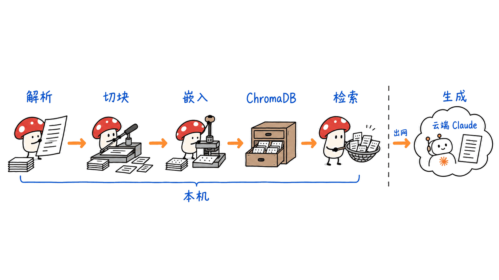
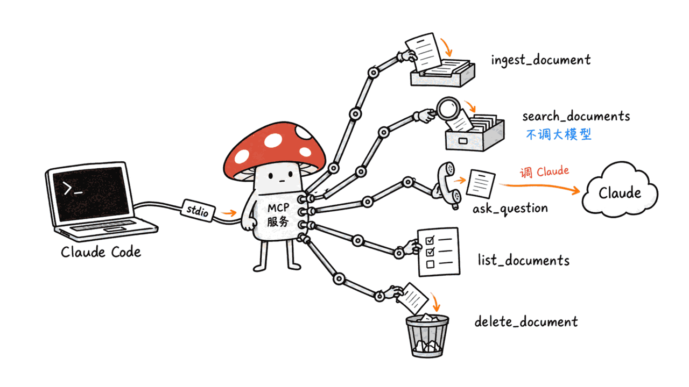
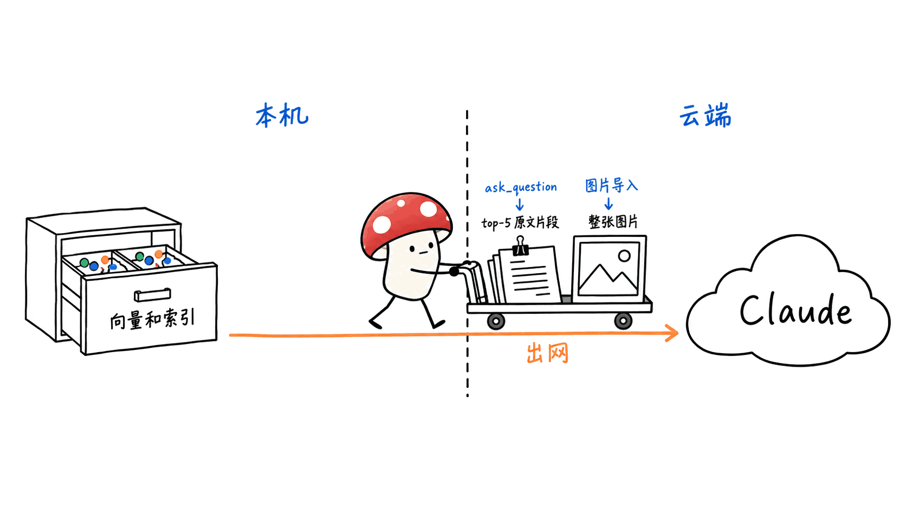
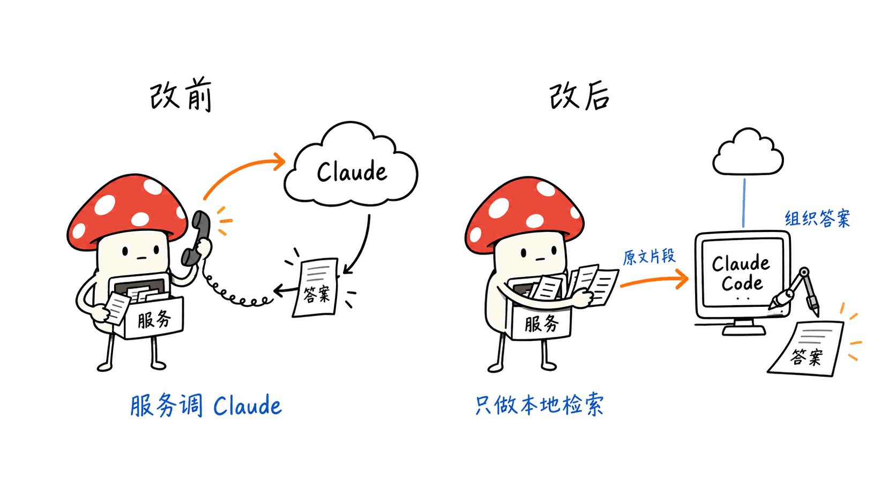

> 📌 开源仓库：MMC1410001/mcp-rag-server
> GitHub：https://github.com/MMC1410001/mcp-rag-server
> 协议：MIT ｜ 语言：Python ｜ Stars：0 ｜ 创建：2026-09-03 ｜ 最近提交：2026-09-10（共 3 次提交）

---

**BLUF**：mcp-rag-server 用大约 830 行 Python 把「解析 → 切块 → 本地嵌入 → ChromaDB → 检索 → Claude 生成」这一整条 RAG 链路包成一个 stdio MCP 服务，Claude Code 可以直接调用它的 5 个工具。它适合当**读得懂、改得动的范本**，不适合直接当你的知识库用：我们在 Mac mini 上实测，39 个单元测试全过、单次检索 7-105 毫秒，但默认嵌入模型是纯英文的，**我们测的中文 chunk 里 34% 的 token 是 [UNK]，而且每个 chunk 只有前 256 个 token 被编码**；单文件 Google Drive 导入在今天全新安装时会直接报错；README 说能导入本地文件，MCP 工具实际只收 Drive 链接。我们改了两处代码（30 行 diff）之后，它能在完全不设 API key 的情况下作为纯本地检索工具运行，答案交给 Claude Code 自己生成；中文要能用，还得再换嵌入模型和切块器。

这篇文章讲三件事：怎么把自己的文档库做成 Claude Code 可调用的 MCP 检索工具、这个仓库的架构拆解和我们实测到的坑、以及怎样把它改成数据不出本机。

## 先说定位：它是范本，不是产品

本站写过不少本地知识库方案，它们和这个仓库不是一类东西：

| 项目 | 形态 | 你得到什么 | 代价 |
|---|---|---|---|
| Adapta | 自托管平台（Docker + Postgres + Redis + Chroma） | RAG + LoRA 微调，OpenAI 兼容接口 | 一整套服务要运维 |
| GBrain | 个人 AI 大脑（PGLite / Postgres + pgvector） | 知识图谱 + 合成层 + 43 个 Skill，走 MCP | 体系大，要按它的方式组织知识 |
| DeepTutor | 学习工作台（Python + Next.js） | 多 RAG 引擎 + 长期记忆 + 七种学习模式 | 面向教学场景，重 |
| **mcp-rag-server** | **一个 Python 进程，stdio MCP** | **5 个工具，830 行，每一步都能读懂** | **0 star、单人、有明显 bug** |

前两个的详细评测见《用 Adapta 搭一个完全属于自己的本地知识库：一个诚实的上手指南》（https://blog.mushroom.cv/blog/adapta-self-hosted-local-knowledge-base-guide/）和《GBrain：Y Combinator CEO 开源的个人 AI 大脑——25000 星知识图谱系统完整介绍》（https://blog.mushroom.cv/blog/gbrain-personal-ai-knowledge-brain-guide/）。

那些是完整产品，你用它们。mcp-rag-server 是**最小实现**，你读它、改它，然后知道「MCP + RAG」这件事到底由哪几块组成。它的价值恰恰在于小：9 个模块，最大的文件 220 行，一个下午能从头读到尾。

## 一次请求在里面走了哪几步？




仓库在 2026-09-10 被重构成教科书式的 RAG 分层结构，每一层一个目录：

| 模块 | 行数 | 做什么 |
|---|---|---|
| `src/ingestion/loader.py` | 220 | 从 Google Drive 下载，按扩展名分发解析：PDF 用 pypdf，DOCX 用 python-docx，TXT/MD 直接读，PNG/JPG 交给 Claude 视觉 API |
| `src/chunking/chunker.py` | 28 | 按空格切词，每 500 词一块，相邻块重叠 50 词 |
| `src/embeddings/embedder.py` | 26 | sentence-transformers 加载 all-MiniLM-L6-v2（384 维），懒加载 |
| `src/vectordb/vector_store.py` | 120 | ChromaDB `PersistentClient`，余弦距离，uuid4 做 chunk id |
| `src/retrieval/retriever.py` | 22 | top-k 检索，默认 k=5 |
| `src/prompts/prompt_templates.py` | 23 | 系统提示词、上下文拼接模板 |
| `src/llm/llm_client.py` | 51 | 调 Anthropic Messages API，默认 `claude-sonnet-4-6`，max_tokens 1024 |
| `src/api/routes.py` | 193 | 注册 5 个 MCP 工具，stdio 传输 |
| `src/utils/helpers.py` | 81 | 读 `config.yaml`，与内置默认值深度合并 |

所有参数都集中在 `config.yaml`：切块大小、重叠、嵌入模型、Chroma 路径和集合名、top-k、Claude 模型和日志。向量库默认落在项目根目录的 `chroma_db/`，路径按项目根解析，所以从哪个目录启动都写到同一个位置。

### 五个 MCP 工具分别做什么？




| 工具 | 参数 | 行为 |
|---|---|---|
| `ingest_document` | `url`（必填） | 下载 Drive 文件或文件夹，解析、切块、嵌入、入库；文件夹里不支持或损坏的文件记进 `skipped_files`，不中断整批 |
| `search_documents` | `query`（必填），`n_results`（默认 5） | 纯向量检索，返回文本前 400 字、相似度分数和文件名，**不调用任何大模型** |
| `ask_question` | `question`（必填），`n_context_chunks`（默认 5） | 检索 top-5 后把原文拼进提示词，发给 Claude 生成答案 |
| `list_documents` | 无 | 按 `source_url` 去重列出已入库文档 |
| `delete_document` | `source_url`（必填） | 删除该 URL 对应的全部 chunk |

另外它还注册了 MCP resources 列表（`rag://documents/{i}`），但没有实现读取 resource 的处理函数，列得出来、读不了。

### 引用是怎么实现的？

引用是**文件名级别**的，靠两处配合：

1. 每个 chunk 送进提示词时加前缀 `[Source: 文件名]`，系统提示词要求模型「引用来源文件名」；
2. `llm_client.answer()` 另外把这批 chunk 的文件名去重，作为 `sources` 列表跟答案一起返回。

所以你能知道答案来自哪个文件，但不知道来自哪一页、哪一段。chunk 没有页码、没有段落偏移，`sources` 还是用 `set` 去重的，顺序也不代表相关度。对个人笔记够用，对需要逐条核对的合同、论文不够。

## Google Drive 接入需要什么授权？

**不需要任何授权，因为它只能读公开分享的链接。** 下载走的是 gdown（`use_cookies=False`），没有 OAuth、没有服务账号、没有 Drive API。文件或文件夹必须设成「知道链接的任何人可查看」才能导入。

这里有个隐私上的悖论：你想把私人文档库做成本地知识库，第一步却要把它们公开分享。对真正私密的资料，Drive 这条路本身就不该走。

## 实测：不填 API key，能跑到哪一步？

**环境**：Mac mini（Apple M4，16GB），macOS 26.6.2；Python 3.12 venv；torch 2.14.0、chromadb 1.5.9、sentence-transformers 6.0.1、mcp 1.30.0、gdown 6.2.0、anthropic 1.5.0；仓库 commit `e40e894`。嵌入跑在 MPS 上。全程没有使用任何真实 API key。

**测试套件**：`pytest` 收集 39 个用例，**39 个全部通过，用时 1.45 秒**。测试把嵌入换成了 SHA-256 哈希向量、把 Anthropic 客户端换成了桩对象，所以不下载模型、不联网。GitHub Actions 在 Python 3.10/3.11/3.12 上跑，最近两次提交 CI 均为成功。

**索引与检索**：我们直接调用仓库自己的模块，把自带样例和本站 3 篇双语文章（LEANN、Zvec、CodeGraph）的中英文部分分别入库，共 10 个 chunk，Chroma 目录 788KB，嵌入模型缓存 87MB。检索单次耗时 7-105 毫秒。

结果分成两种：

| 查询 | Top-1 | 分数 | 对不对 |
|---|---|---|---|
| How much storage does LEANN save compared to a traditional vector index? | LEANN 英文部分 | 0.6058 | 对 |
| When does a bi-elliptic transfer beat a Hohmann transfer on propellant? | 轨道力学样例 | 0.4476 | 对 |
| CodeGraph 能省多少 API 成本？ | CodeGraph 中文部分 | 0.5998 | 对 |
| zvec 需要单独启动一个服务吗？ | Zvec 中文部分 | 0.3475 | 对 |
| LEANN 比传统向量索引省多少存储？ | CodeGraph 中文部分 | 0.2248 | **错**，LEANN 中文只排第 3（0.1218） |

中文查询答对的两条，靠的都是查询里夹着的英文词（CodeGraph、zvec）。换成纯中文表述，检索就开始乱。

**为什么中文不行？** 我们又单独测了三件事：

- **只看前 256 个 token**。all-MiniLM-L6-v2 的 `max_seq_length` 是 256，而 500 词的 chunk 远超这个长度。我们测的 10 个 chunk 全部超长，中文 chunk 为 483-2579 个 token。把一个 2554 token 的中文 chunk 和它自己的前 254 个 token 分别编码，余弦相似度是 **1.0**；在这 254 个 token 后面拼上一段完全无关的文字，余弦相似度还是 **1.0**。也就是说，**每个 chunk 256 token 之后的内容对检索完全不可见**。
- **中文 34% 是未知词**。这个模型的词表基本是英文，同一个中文 chunk 里 **34.3% 的 token 被编成 [UNK]**。
- **中文不按空格断词**。切块器用 `text.split()` 数「词」，一整段中文只算一个词，所以 4300 字的 CodeGraph 中文部分只切出 1 个 chunk，5200 字的 Zvec 中文部分只切出 2 个，单个 chunk 最长 4377 个字符。

三个问题叠在一起：中文文章被切成一两个超大 chunk，每个 chunk 只有开头约 10% 进入向量，而这 10% 里还有三分之一是 [UNK]。

**通过 MCP 协议实测**：我们用 MCP Python SDK 当客户端，经 stdio 启动 `main.py`，握手、列工具、调用 `search_documents` 和 `list_documents` 都正常。另外发现四个问题：

1. **没有 key 服务起不来**。`routes.py` 在导入时就执行 `os.environ["ANTHROPIC_API_KEY"]`，不设这个变量直接 `KeyError`，连不需要大模型的检索也用不了。`python main.py --demo` 同样第一行就要 key。
2. **本地文件导不进去**。`samples/README.md` 说 `load_document()` 接受本地路径，但代码里所有路径都先走 Drive 解析。传本地路径返回 `Could not extract file ID from URL`。
3. **单文件 Drive 导入已损坏**。`requirements.txt` 写的是 `gdown>=5.0.0`，全新安装拿到的是 gdown 6.2.0，而 gdown 6.0.0（2026-04-12）删掉了 `fuzzy` 参数，代码里的 `gdown.download(..., fuzzy=True)` 会报 `unexpected keyword argument 'fuzzy'`。CI 全绿是因为测试把下载函数 mock 掉了。文件夹导入用的 `download_folder` 签名没变，不受影响。
4. **中文被转义**。工具返回用 `json.dumps` 默认参数，中文全部变成 `\uXXXX`，模型能解码，但更费 token，日志里也没法读。


![超长文本块只有前 256 token 进入向量，后面是不可见区，其中 34% 的中文 token 是 [UNK]](../../assets/images/mcp-rag-server-local-rag-claude-code-blueprint-fig-03.png)

### 读代码还发现的三处设计问题

- **重复导入会重复入库**。chunk id 是随机 uuid4，没有内容哈希。同一份文件导两次，库里就有两份，实测 10 → 11 个 chunk，检索结果里出现两条分数完全相同（0.4476）的重复项。
- **文件夹在列表里只显示一个文件**。文件夹里的所有 chunk 共用文件夹 URL 作为 `source_url`，`list_documents` 按它去重，于是 4 个文件的文件夹只列出第一个文件名（我们在本地文件夹导入的改版上实测如此，Drive 文件夹走的是同一段代码）。`delete_document` 也只能整个文件夹一起删。
- **图片的全部内容会被发给 Claude**。PNG/JPG 走 `parse_image_with_claude`，整张图 base64 上传；`.doc`（老 Word 格式）会被交给 python-docx，大概率解析失败。

## 隐私边界：哪些数据会离开你的机器？




按默认配置，一次完整流程里数据的去向是：

| 步骤 | 数据去哪 |
|---|---|
| 嵌入、建索引、检索 | 本机（模型首次需从 Hugging Face 下载约 87MB） |
| Drive 导入 | 文档必须先公开分享 |
| 图片导入 | 整张图发给 Anthropic |
| `ask_question` | 检索出的 top-5 chunk 原文 + 问题发给 Anthropic |
| `search_documents` / `list_documents` / `delete_document` | 不出本机 |

README 里「Embeddings run locally」说的是实话，但只说了一半：**向量是本地的，被检索出来的原文不是。**

## 改成全本地：三处改动




如果你用的是 Claude Code，其实根本不需要 `ask_question`：Claude Code 本身就是大模型，`search_documents` 把原文片段交给它，它自己就能组织答案、标注出处。让服务器再调一次 Claude，等于付两次钱、多一次数据出境。

我们在仓库副本上改了两个文件（routes.py 和 loader.py，diff 共 30 行），实测结果：**完全不设 `ANTHROPIC_API_KEY` 时服务正常启动；导入一个本地文件夹得到 4 个文件、10 个 chunk，`.drawio` 被正确跳过；`search_documents` 正常返回，中文不再转义；`ask_question` 返回认证错误而不是让服务崩溃。**

**第一处：Anthropic 客户端改成懒加载。**

```python
# src/api/routes.py
_claude_client = None

def _client():
    global _claude_client
    if _claude_client is None:
        _claude_client = anthropic.Anthropic()
    return _claude_client
```

原来用到 `_claude_client` 的两处换成 `_client()`，最后一行加 `ensure_ascii=False`。

**第二处：`load_document()` 接受本地路径。** 在 Drive 判断之前加一个分支：路径存在就直接解析，是目录就递归列出文件，后面复用原有的文件夹处理逻辑（逐文件解析、跳过记录、每个 chunk 带真实文件名）。

**第三处：换一个多语言嵌入模型，并按字符切中文。** 在 `config.yaml` 把 `embeddings.model` 换成支持中文、上下文更长的模型（比如 BAAI/bge-m3，最长 8192 token、1024 维），然后删掉 `chroma_db/` 重建索引，因为 Chroma 集合的维度在第一次写入时就定死了。切块器也要改成按字符或按句子切，否则中文文章还是一两个超大块。**这一步我们没有实测**，多语言模型体积大很多，下载和编码速度都要自己评估。

如果还是想让服务器自己生成答案，可以把 `llm_client.answer()` 里的 Anthropic 调用换成本地 OpenAI 兼容服务（Ollama、LM Studio 等），接口形状差不多。这一步也没有实测。

## 接到 Claude Code 的完整路径

```bash
git clone https://github.com/MMC1410001/mcp-rag-server
cd mcp-rag-server
python3.12 -m venv .venv
.venv/bin/pip install -r requirements.txt "gdown<6"   # 先把 gdown 钉在 5.x
.venv/bin/pip install -r requirements-dev.txt && .venv/bin/pytest   # 可选：39 个测试，不需要 key

# 注册到 Claude Code（stdio）
claude mcp add rag -e ANTHROPIC_API_KEY=你的key -- \
  "$PWD/.venv/bin/python" "$PWD/main.py"
```

几点提醒：

- **用 venv 里的 python 绝对路径**，不要写系统 `python`，否则 Claude Code 启动子进程时找不到依赖。
- 按原版代码，**key 必须填**，哪怕你只打算用检索。做了上面第一处改动后可以去掉 `-e`。
- 首次调用会下载嵌入模型，这时工具调用会等比较久；网络慢的话先手动跑一次 `python -c "from src.embeddings.embedder import get_model; get_model()"` 预热。
- 原版只能导入公开 Drive 链接；想导本地目录，需要第二处改动。
- 依赖要装 torch、chromadb 等，我们实测装完的 venv 占 1.2GB。

## 适合谁，不适合谁？

**适合**：想弄懂 MCP 服务怎么把一条 RAG 链路暴露给 Agent 的开发者；想要一个起点、准备自己改成适合自己文档库的人；文档以英文为主的个人用户。

**不适合**：文档以中文为主（不改嵌入模型和切块器基本搜不准）；要托付敏感资料（默认会把检索原文和图片发给云端）；要逐页溯源的场景；要一个有人维护的成熟工具（0 star、1 位作者、3 次提交，第一次提交的 CI 还是失败的）。

Mycelium Protocol 对这类项目的一贯看法是：**0 star 不是减分项，看不懂才是。** 这个仓库的 bug 都很具体、都能定位到行，修起来也不难，这正是一个好范本该有的样子。

## 常见问题

**Q：mcp-rag-server 用什么嵌入模型？能换吗？**
A：默认 sentence-transformers 的 all-MiniLM-L6-v2，384 维，本地运行。改 `config.yaml` 的 `embeddings.model` 就能换，但换完要删掉 `chroma_db/` 重建索引，因为向量维度变了。

**Q：它能不能完全不用 Anthropic API？**
A：原版不行，服务启动时就要求设置 `ANTHROPIC_API_KEY`。把客户端改成懒加载后，`search_documents` 等检索工具可以零 key 运行，答案交给 Claude Code 等宿主 Agent 自己生成。

**Q：导入 Google Drive 需要授权吗？**
A：不需要，也做不到。它通过 gdown 读公开分享的链接，没有 OAuth。私密文件无法导入，除非你先把它公开。另外全新安装时单文件导入会因 gdown 6 移除 `fuzzy` 参数而报错，需要把 gdown 钉在 5.x。

**Q：中文文档能用吗？**
A：默认配置下效果很差。我们实测一个中文 chunk 有 34.3% 的 token 是 [UNK]，且只有前 256 个 token 被编码。需要换多语言模型并改成按字符切块。

**Q：数据存在哪里？**
A：向量和原文 chunk 存在项目根目录的 `chroma_db/`（ChromaDB 持久化，SQLite + 索引文件），日志在 `logs/app.log`。备份就是复制这个目录。

## 一手源

- GitHub 仓库：https://github.com/MMC1410001/mcp-rag-server
- gdown v6.0.0 发布说明（移除 `fuzzy` 参数）：https://github.com/wkentaro/gdown/releases/tag/v6.0.0
- all-MiniLM-L6-v2 模型卡：https://huggingface.co/sentence-transformers/all-MiniLM-L6-v2
- Model Context Protocol 规范：https://modelcontextprotocol.io

---

> © 2026 Author: Mycelium Protocol. 本文采用 [CC BY 4.0](https://creativecommons.org/licenses/by/4.0/deed.zh) 授权——欢迎转载和引用，须注明作者姓名及原文链接，不得去除署名后以原创发布。

<!--EN-->

> 📌 Repository: MMC1410001/mcp-rag-server
> GitHub: https://github.com/MMC1410001/mcp-rag-server
> License: MIT | Language: Python | Stars: 0 | Created: 2026-09-03 | Last commit: 2026-09-10 (3 commits total)

---

**BLUF**: mcp-rag-server wraps a complete RAG pipeline (parse, chunk, embed locally, store in ChromaDB, retrieve, generate with Claude) into a stdio MCP server of about 830 lines of Python, and Claude Code can call its five tools directly. Treat it as a **blueprint you can read and modify**, not as a knowledge base to deploy. On a Mac mini, all 39 unit tests passed and retrieval took 7-105 ms per query. But the default embedding model is English-only: **34% of the tokens in the Chinese chunk we tested come out as [UNK], and only the first 256 tokens of any chunk get embedded**. Single-file Google Drive ingest fails on a fresh install today. The README says local files work, but the MCP tool only accepts Drive links. After two small code changes (a 30-line diff) it runs as a fully local retrieval tool with no API key at all, and Claude Code writes the answers itself. Chinese still needs a different embedding model and chunker.

This post covers three things: how to turn your own documents into an MCP retrieval tool that Claude Code can call, a teardown of this repository with the problems we hit when we ran it, and how to change it so the data never leaves your machine.

## Positioning: a blueprint, not a product

This blog has covered several local knowledge-base projects. They are a different kind of thing:

| Project | Shape | What you get | Cost |
|---|---|---|---|
| Adapta | Self-hosted platform (Docker + Postgres + Redis + Chroma) | RAG + LoRA fine-tuning behind an OpenAI-compatible API | A full service stack to operate |
| GBrain | Personal AI brain (PGLite / Postgres + pgvector) | Knowledge graph + synthesis layer + 43 skills, over MCP | Large system; you organize knowledge its way |
| DeepTutor | Learning workbench (Python + Next.js) | Multiple RAG engines + long-term memory + seven study modes | Built for tutoring; heavy |
| **mcp-rag-server** | **One Python process, stdio MCP** | **Five tools, 830 lines, every step readable** | **0 stars, one author, obvious bugs** |

For the first two, see "Building a Truly Private Local Knowledge Base with Adapta: An Honest Guide" (https://blog.mushroom.cv/blog/adapta-self-hosted-local-knowledge-base-guide/) and "GBrain: YC CEO's Open-Source Personal AI Brain — A Complete Guide to the 25K-Star Knowledge Graph System" (https://blog.mushroom.cv/blog/gbrain-personal-ai-knowledge-brain-guide/).

Those are finished products you use. mcp-rag-server is a **minimal implementation** you read and modify, so you learn what "MCP + RAG" is actually made of. Its value is that it is small: nine modules, the largest file 220 lines, readable end to end in an afternoon.

## What happens inside one request?


On 2026-09-10 the repository was restructured into a textbook RAG layout, one directory per stage:

| Module | Lines | What it does |
|---|---|---|
| `src/ingestion/loader.py` | 220 | Downloads from Google Drive and dispatches by extension: pypdf for PDF, python-docx for DOCX, plain read for TXT/MD, Claude's vision API for PNG/JPG |
| `src/chunking/chunker.py` | 28 | Splits on whitespace into 500-word chunks with a 50-word overlap |
| `src/embeddings/embedder.py` | 26 | Lazily loads all-MiniLM-L6-v2 (384 dims) via sentence-transformers |
| `src/vectordb/vector_store.py` | 120 | ChromaDB `PersistentClient`, cosine distance, uuid4 chunk IDs |
| `src/retrieval/retriever.py` | 22 | Top-k search, k=5 by default |
| `src/prompts/prompt_templates.py` | 23 | System prompt and context templates |
| `src/llm/llm_client.py` | 51 | Calls the Anthropic Messages API; default `claude-sonnet-4-6`, max_tokens 1024 |
| `src/api/routes.py` | 193 | Registers the five MCP tools over stdio |
| `src/utils/helpers.py` | 81 | Loads `config.yaml` and deep-merges it over built-in defaults |

Every parameter lives in `config.yaml`: chunk size and overlap, embedding model, Chroma path and collection, top-k, Claude model, and logging. The vector store defaults to `chroma_db/` at the project root. The path resolves against the project root, so the server writes to the same place whatever directory you launch it from.

### What do the five MCP tools do?


| Tool | Parameters | Behavior |
|---|---|---|
| `ingest_document` | `url` (required) | Downloads a Drive file or folder, then parses, chunks, embeds and stores it. Unsupported or corrupt files in a folder go into `skipped_files`; the rest of the batch continues |
| `search_documents` | `query` (required), `n_results` (default 5) | Pure vector search. Returns the first 400 characters, a similarity score, and the filename. **No LLM call** |
| `ask_question` | `question` (required), `n_context_chunks` (default 5) | Retrieves the top 5 chunks and sends their text to Claude to generate an answer |
| `list_documents` | none | Lists indexed documents, deduplicated by `source_url` |
| `delete_document` | `source_url` (required) | Deletes every chunk for that URL |

It also registers an MCP resource list (`rag://documents/{i}`), but there is no handler for reading a resource. You can list them, not open them.

### How do citations work?

Citations are **per file**, and two pieces make them work:

1. Each chunk goes into the prompt prefixed with `[Source: filename]`, and the system prompt tells the model to cite source filenames.
2. `llm_client.answer()` also collects the chunks' filenames into a set and returns it alongside the answer as `sources`.

You learn which file an answer came from, but not which page or paragraph. Chunks carry no page numbers or offsets, and because `sources` comes from a set, its order says nothing about relevance. That is fine for personal notes. It is not enough for contracts or papers where you have to check every claim.

## What authorization does Google Drive need?

**None, because it can only read publicly shared links.** Downloads go through gdown with `use_cookies=False`. There is no OAuth, no service account, and no Drive API. A file or folder has to be shared as "anyone with the link can view" before you can ingest it.

That is a privacy paradox. You want a local knowledge base for private documents, and step one is to make them public. For anything actually private, don't use the Drive path.

## Hands-on: how far does it get without an API key?

**Environment**: Mac mini (Apple M4, 16 GB), macOS 26.6.2; Python 3.12 venv; torch 2.14.0, chromadb 1.5.9, sentence-transformers 6.0.1, mcp 1.30.0, gdown 6.2.0, anthropic 1.5.0; repository at commit `e40e894`. Embeddings ran on MPS. We used no real API key at any point.

**Test suite**: `pytest` collects 39 cases, and **all 39 pass in 1.45 seconds**. The tests replace the embedder with SHA-256 hash vectors and the Anthropic client with a stub, so nothing is downloaded and no network is used. GitHub Actions runs them on Python 3.10, 3.11 and 3.12, and CI passed on the two most recent commits.

**Indexing and retrieval**: we called the repository's own modules directly and indexed the bundled sample plus the Chinese and English halves of three bilingual posts from this blog (LEANN, Zvec, CodeGraph). That produced 10 chunks, a 788 KB Chroma directory, and an 87 MB embedding-model cache. Each search took 7-105 ms.

The results fall into two groups:

| Query | Top-1 | Score | Correct? |
|---|---|---|---|
| How much storage does LEANN save compared to a traditional vector index? | LEANN, English half | 0.6058 | Yes |
| When does a bi-elliptic transfer beat a Hohmann transfer on propellant? | Orbital mechanics sample | 0.4476 | Yes |
| CodeGraph 能省多少 API 成本？ (Chinese) | CodeGraph, Chinese half | 0.5998 | Yes |
| zvec 需要单独启动一个服务吗？ (Chinese) | Zvec, Chinese half | 0.3475 | Yes |
| LEANN 比传统向量索引省多少存储？ (Chinese) | CodeGraph, Chinese half | 0.2248 | **No**. The LEANN Chinese half ranked 3rd (0.1218) |

Both Chinese queries that worked contain an English word (CodeGraph, zvec). Once the question is phrased entirely in Chinese, retrieval falls apart.

**Why does Chinese fail?** We tested three things separately:

- **Only the first 256 tokens count.** all-MiniLM-L6-v2 has a `max_seq_length` of 256, and a 500-word chunk is far longer. All 10 chunks we indexed exceeded it, and the Chinese ones ran 483-2,579 tokens. We encoded a 2,554-token Chinese chunk and its own first 254 tokens separately: cosine similarity **1.0**. We then appended unrelated text after those 254 tokens: still **1.0**. **Everything after token 256 in a chunk is invisible to search.**
- **34% of Chinese tokens are unknown.** The model's vocabulary is essentially English, and in that same Chinese chunk **34.3% of the tokens encode as [UNK]**.
- **Chinese has no spaces between words.** The chunker counts "words" with `text.split()`, so a whole Chinese paragraph counts as one word. The 4,300-character Chinese half of the CodeGraph post became a single chunk, the 5,200-character Zvec half became two, and the longest chunk was 4,377 characters.

Together: a Chinese article becomes one or two oversized chunks, only the first ~10% of each chunk reaches the vector, and a third of that 10% is [UNK].

**Over the MCP protocol**: we used the MCP Python SDK as a client and launched `main.py` over stdio. The handshake, tool listing, `search_documents` and `list_documents` all worked. We also found four problems:

1. **No key, no server.** `routes.py` reads `os.environ["ANTHROPIC_API_KEY"]` at import time. Without it the server dies with `KeyError`, so even the LLM-free search tools are unavailable. `python main.py --demo` also needs the key on its first line.
2. **Local files don't go in.** `samples/README.md` says `load_document()` accepts a local path, but every path goes through Drive URL parsing first. A local path returns `Could not extract file ID from URL`.
3. **Single-file Drive ingest is broken.** `requirements.txt` specifies `gdown>=5.0.0`, so a fresh install gets gdown 6.2.0. gdown 6.0.0 (2026-04-12) removed the `fuzzy` parameter, and the code's `gdown.download(..., fuzzy=True)` fails with `unexpected keyword argument 'fuzzy'`. CI stays green because the tests mock the download function. Folder ingest uses `download_folder`, whose signature did not change, so it still works.
4. **Chinese gets escaped.** Tool results are serialized with default `json.dumps`, which turns every Chinese character into `\uXXXX`. The model can decode it, but it costs more tokens and the logs are unreadable.


![Only the first 256 tokens of an oversized chunk reach the vector; the rest is invisible, and 34% of Chinese tokens are [UNK]](../../assets/images/mcp-rag-server-local-rag-claude-code-blueprint-fig-03.png)

### Three more design issues from reading the code

- **Re-ingesting duplicates data.** Chunk IDs are random uuid4s with no content hash. Ingest the same file twice and it is stored twice. In our run the count went from 10 to 11 chunks, and search returned two identical hits with the same score (0.4476).
- **A folder lists as one file.** Every chunk from a folder shares the folder URL as its `source_url`, and `list_documents` deduplicates on it. A four-file folder listed only its first filename (confirmed in our run on the patched local-folder path, which uses the same folder code as Drive). `delete_document` can only delete the whole folder at once.
- **Whole images go to Claude.** PNG/JPG go through `parse_image_with_claude`, which uploads the full image as base64. `.doc` (legacy Word) files are handed to python-docx and will most likely fail to parse.

## Privacy boundary: which data leaves your machine?


With the default configuration, here is where data goes during a full run:

| Step | Where the data goes |
|---|---|
| Embedding, indexing, retrieval | Stays local (the model is downloaded once from Hugging Face, ~87 MB) |
| Drive ingest | Documents must be publicly shared first |
| Image ingest | The whole image goes to Anthropic |
| `ask_question` | The question and the full text of the top 5 chunks go to Anthropic |
| `search_documents` / `list_documents` / `delete_document` | Stays local |

The README's "Embeddings run locally" is true, but only half the picture: **the vectors stay local; the retrieved text does not.**

## Going fully local: three changes


If your client is Claude Code, you don't need `ask_question` at all. Claude Code is already a language model: `search_documents` hands it the source passages, and it can write the answer and cite the files itself. Having the server call Claude again means paying twice and sending the data out one more time.

We changed two files in a copy of the repository (routes.py and loader.py, a 30-line diff) and tested the result: **with `ANTHROPIC_API_KEY` unset, the server starts normally. Ingesting a local folder produced 4 files and 10 chunks, and the `.drawio` file was correctly skipped. `search_documents` works and Chinese is no longer escaped. `ask_question` returns an authentication error instead of crashing the server.**

**Change 1: create the Anthropic client lazily.**

```python
# src/api/routes.py
_claude_client = None

def _client():
    global _claude_client
    if _claude_client is None:
        _claude_client = anthropic.Anthropic()
    return _claude_client
```

Replace the two uses of `_claude_client` with `_client()`, and add `ensure_ascii=False` to the final `json.dumps`.

**Change 2: accept local paths in `load_document()`.** Add a branch before the Drive check. If the path exists, parse it directly; if it is a directory, list its files recursively and reuse the existing folder logic (parse per file, record skips, give every chunk its real filename).

**Change 3: switch to a multilingual embedding model and chunk Chinese by characters.** In `config.yaml`, set `embeddings.model` to a model with Chinese support and a longer context (for example BAAI/bge-m3: up to 8,192 tokens, 1,024 dims). Then delete `chroma_db/` and rebuild, because a Chroma collection's dimension is fixed on first write. The chunker also has to split by characters or sentences, or Chinese articles will still become one or two giant chunks. **We did not test this change.** Multilingual models are much larger, so check download size and encoding speed on your own machine.

If you still want the server to generate answers, replace the Anthropic call in `llm_client.answer()` with a local OpenAI-compatible server (Ollama, LM Studio and similar); the request shape is close. We did not test this either.

## The full path to Claude Code

```bash
git clone https://github.com/MMC1410001/mcp-rag-server
cd mcp-rag-server
python3.12 -m venv .venv
.venv/bin/pip install -r requirements.txt "gdown<6"   # pin gdown to 5.x first
.venv/bin/pip install -r requirements-dev.txt && .venv/bin/pytest   # optional: 39 tests, no key needed

# Register with Claude Code (stdio)
claude mcp add rag -e ANTHROPIC_API_KEY=your-key -- \
  "$PWD/.venv/bin/python" "$PWD/main.py"
```

A few notes:

- **Use the absolute path to the venv's python**, not the system `python`. Otherwise Claude Code launches a subprocess that can't find the dependencies.
- With the original code, **the key is required** even if you only plan to search. After Change 1 you can drop the `-e`.
- The first call downloads the embedding model, so that tool call will be slow. On a slow network, warm it up first with `python -c "from src.embeddings.embedder import get_model; get_model()"`.
- The original only ingests public Drive links. For local directories you need Change 2.
- The dependencies include torch and chromadb; our installed venv takes 1.2 GB.

## Who is it for, and who should skip it?

**Good fit**: developers who want to see how an MCP server exposes a RAG pipeline to an agent; people who want a starting point to adapt to their own documents; individuals whose documents are mostly in English.

**Poor fit**: mostly-Chinese document collections (without a new embedding model and chunker, search is unreliable); sensitive material (by default, retrieved text and images go to the cloud); anything that needs page-level provenance; anyone who wants a maintained, mature tool (0 stars, one author, 3 commits, and CI failed on the first one).

Mycelium Protocol's view of projects like this is consistent: **zero stars is not a strike against a project; code you can't follow is.** Every bug in this repository is specific, traceable to a line, and not hard to fix. That is what a good blueprint looks like.

## FAQ

**Q: Which embedding model does mcp-rag-server use, and can I change it?**
A: By default, sentence-transformers' all-MiniLM-L6-v2 (384 dims), running locally. Change `embeddings.model` in `config.yaml` to switch. Afterwards, delete `chroma_db/` and rebuild the index, because the vector dimension changes.

**Q: Can it run without the Anthropic API?**
A: Not as shipped: the server requires `ANTHROPIC_API_KEY` at startup. With the client made lazy, `search_documents` and the other retrieval tools run with no key, and the host agent (such as Claude Code) generates the answers.

**Q: Does Google Drive ingest need authorization?**
A: No, and it can't use any. It reads publicly shared links through gdown, with no OAuth, so private files can't be ingested unless you make them public. On a fresh install, single-file ingest also fails because gdown 6 removed the `fuzzy` parameter; pin gdown to 5.x.

**Q: Does it work for Chinese documents?**
A: Poorly with the defaults. In our test, 34.3% of the tokens in a Chinese chunk encoded as [UNK], and only the first 256 tokens were embedded. You need a multilingual model and character-based chunking.

**Q: Where is the data stored?**
A: Vectors and chunk text live in `chroma_db/` at the project root (ChromaDB persistence: SQLite plus index files), and logs in `logs/app.log`. To back up, copy that directory.

## Primary sources

- GitHub repository: https://github.com/MMC1410001/mcp-rag-server
- gdown v6.0.0 release notes (removal of `fuzzy`): https://github.com/wkentaro/gdown/releases/tag/v6.0.0
- all-MiniLM-L6-v2 model card: https://huggingface.co/sentence-transformers/all-MiniLM-L6-v2
- Model Context Protocol specification: https://modelcontextprotocol.io

---

> © 2026 Author: Mycelium Protocol. Licensed under [CC BY 4.0](https://creativecommons.org/licenses/by/4.0/) — free to share and adapt with attribution. You must credit the author and link to the original; removing attribution and republishing as original is not permitted.
