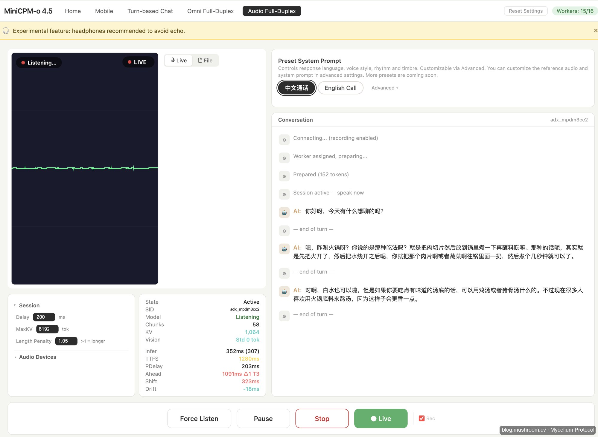
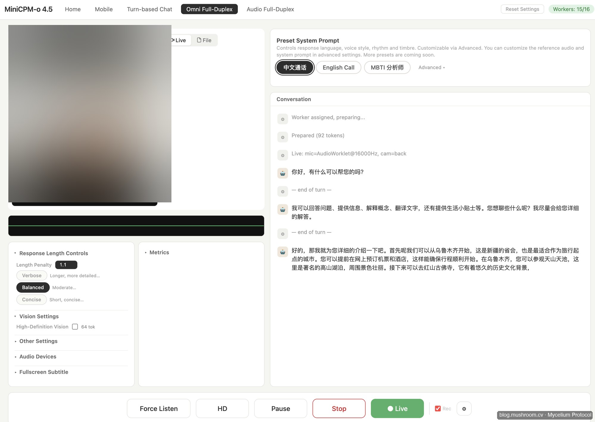
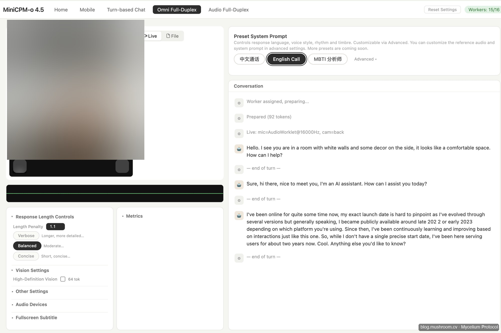

> **BLUF**：MiniCPM-o 4.5 是目前开源 Omni 模型里**中文友好、端侧可部署、全双工实测最接近产品级**的选手。对于提供端侧 AI 和 AI Agent 服务的小团队，它是值得优先验证的"小钢炮"。

---

## 为什么值得关注这个模型？

我今天在官方 Demo（`minicpmo45.modelbest.cn`）上实测了 MiniCPM-o 4.5，重点测试了两项能力：

- **全双工视频通话**：摄像头画面实时传入，模型边看边说，延迟体感流畅，**接近产品级**
- **全双工音频通话**：打断、接续、情绪感知均有体现，turn-based 对话节奏自然

这是我测试过的开源 Omni 模型里体验最完整的一个。

**Audio Full-Duplex 实测**（中文对话，延迟 TTFS 1280ms，推理 352ms）：



**Omni Full-Duplex 实测 — 中文通话**（模型实时看到摄像头画面并用中文回复，背景已隐私模糊）：



**Omni Full-Duplex 实测 — 英文通话**（切换 English Call preset，模型主动描述画面内容并用英文对话）：



---

## 核心能力：9B 参数，四模态端到端

**模型架构**（MiniCPM-o 4.5）：

| 组件 | 来源模型 |
|---|---|
| 视觉编码器 | SigLip2 |
| 音频编码器 | Whisper-medium |
| 音频解码器 | CosyVoice2 |
| LLM 主干 | Qwen3-8B |
| 总参数 | **9B** 端到端 |

**关键指标**：
- OpenCompass 综合分 **77.6**，超过 GPT-4o，接近 Gemini 2.5 Flash
- 视觉输入：最高 **1.8M 像素**，**10fps** 实时视频流
- 语言：支持 **30+ 语言**，中文原生支持
- 模态切换延迟：**< 0.1ms**
- 推理延迟：A100 下 ~0.9s，开启 `torch.compile` 优化后 **~0.5s**

---

## 开发者集成指南

### 1. 快速启动（Docker 推荐）

```bash
# 官方 Docker 镜像，28GB+ NVIDIA VRAM
docker pull openbmb/minicpmo:latest
docker run --gpus all -p 8000:8000 openbmb/minicpmo:latest
```

### 2. PyTorch 直接调用

```python
from transformers import AutoModel, AutoTokenizer
import torch

model = AutoModel.from_pretrained(
    "openbmb/MiniCPM-o-2_6",
    trust_remote_code=True,
    torch_dtype=torch.bfloat16
)
model = model.to(device='cuda')

# 全双工语音流：传入音频帧，实时获取回复
response = model.chat(
    msgs=[{"role": "user", "content": "你好，我想咨询一下..."}],
    audio_input=audio_frames,   # 实时音频帧
    stream=True
)
```

### 3. 高吞吐部署（vLLM / SGLang）

```bash
# vLLM 部署，支持多并发
python -m vllm.entrypoints.openai.api_server \
    --model openbmb/MiniCPM-o-2_6 \
    --dtype bfloat16 \
    --max-model-len 8192
```

### 4. 低资源部署（llama.cpp / Ollama）

CPU 或消费级 GPU 可用量化版本：

```bash
# GGUF 格式，支持 Mac M 系列 / Windows
ollama pull minicpm-o:4bit
ollama run minicpm-o:4bit
```

Int4 量化约需 **8–12GB 内存**，M3 Max 64GB 可流畅运行。

### 5. 桌面客户端

官方提供 **Windows & macOS 桌面 App**（基于 llama.cpp-omni），开箱即用，无需编程。

---

## Omni 模型横向选型对比

面向小团队的选型矩阵（端侧 AI + AI Agent 场景）：

| 模型 | 开源 | 实时全双工 | 中文 | 端侧部署 | 延迟 | 成本 |
|---|---|---|---|---|---|---|
| **MiniCPM-o 4.5** | ✅ | ✅ 视频+音频 | ✅ 原生 | ✅ GGUF/Ollama | ~0.5s | 自托管 |
| GPT-4o Realtime | ❌ | ✅ 音频 | ✅ | ❌ 仅 API | 竞争性 | ~$0.10/min |
| Gemini Live 2.5 | ❌ | ✅ 音频 | ✅ | ❌ 仅 API | 0.63s TTFA | $0.011/min |
| Qwen2.5-Omni | ✅ | ✅ 全模态 | ✅ 原生 | ✅ Int4/AWQ | 实时 | 自托管 |
| Moshi | ✅ | ✅ 纯语音 | ⚠️ 待测 | ✅ | 160ms | 自托管 |
| InternVL3.5 | ✅ | ❌ 仅视觉 | ✅ | 部分 | — | 自托管 |

**选型建议**：

- **端侧/私有化 + 中文全双工**：首选 **MiniCPM-o 4.5**，其次 **Qwen2.5-Omni**
- **最低成本云端 API**：**Gemini Live**（$0.011/min，24 语言）
- **最强工具调用集成**：**GPT-4o Realtime**（Function Calling in Realtime API）
- **极低延迟纯语音**：**Moshi**（160ms，CC-BY 4.0）
- **视觉理解超大模型**：**InternVL3.5 241B**（接近 GPT-5 水平，无实时语音）

---

## 对小团队的实践建议

作为提供**端侧 AI 和 AI Agent 服务**的小团队，MiniCPM-o 的核心价值在于：

1. **低门槛验证产品原型**：Mac M3 Max 本地跑 4-bit 量化版，无需 GPU 服务器
2. **全双工视频能力商用**：视频客服、远程辅导、AI 陪伴类场景直接可用
3. **完整 SDK 覆盖**：PyTorch → vLLM → Ollama → 桌面 App，不同阶段按需切换
4. **中文优先**：与 Moshi 等欧美模型相比，中文语音质量和语义理解更稳定

**建议路径**：
1. 先在 `minicpmo45.modelbest.cn` 试用官方 Demo 验证场景可行性
2. 用 Ollama 4-bit 版在本地 Mac 搭建原型
3. 产品化阶段迁移至 vLLM 多并发部署

---

> © 2026 Author: Mycelium Protocol. 本文采用 [CC BY 4.0](https://creativecommons.org/licenses/by/4.0/deed.zh) 授权——欢迎转载和引用，须注明作者姓名及原文链接，不得去除署名后以原创发布。

<!--EN-->

> **BLUF**: MiniCPM-o 4.5 is the most production-ready open-source omni model for Chinese-language, edge-deployable, full-duplex use cases. For small teams building edge AI or AI Agent products, it's the compact powerhouse worth validating first.

---

## Why Pay Attention to This Model?

I tested MiniCPM-o 4.5 on the official demo (`minicpmo45.modelbest.cn`) and focused on two key capabilities:

- **Full-duplex video call**: Live camera feed streamed in, model responds while watching — latency felt smooth and **near production quality**
- **Full-duplex audio call**: Interruption handling, continuation, and emotional awareness all present; turn-based rhythm felt natural

This is the most complete open-source Omni model experience I've tested.

**Audio Full-Duplex test** (Chinese conversation, TTFS 1280ms, inference 352ms):


**Omni Full-Duplex — Chinese call** (model sees live camera feed and responds in Chinese; background privacy-blurred):


**Omni Full-Duplex — English call** (switched to English Call preset; model proactively describes the scene and converses in English):


---

## Core Capabilities: 9B Parameters, Four-Modality End-to-End

**Model architecture** (MiniCPM-o 4.5):

| Component | Source Model |
|---|---|
| Vision Encoder | SigLip2 |
| Audio Encoder | Whisper-medium |
| Audio Decoder | CosyVoice2 |
| LLM Backbone | Qwen3-8B |
| Total Parameters | **9B** end-to-end |

**Key metrics**:
- OpenCompass aggregate score **77.6** — outperforms GPT-4o, approaches Gemini 2.5 Flash
- Vision input: up to **1.8M pixels**, **10fps** real-time video stream
- Languages: **30+**, native Chinese support
- Mode-switching latency: **< 0.1ms**
- Inference latency: ~0.9s on A100, **~0.5s with `torch.compile`**

---

## Developer Integration Guide

### 1. Quick Start (Docker Recommended)

```bash
docker pull openbmb/minicpmo:latest
docker run --gpus all -p 8000:8000 openbmb/minicpmo:latest
```

Requires 28GB+ NVIDIA VRAM.

### 2. Direct PyTorch

```python
from transformers import AutoModel, AutoTokenizer
import torch

model = AutoModel.from_pretrained(
    "openbmb/MiniCPM-o-2_6",
    trust_remote_code=True,
    torch_dtype=torch.bfloat16
).to(device='cuda')

response = model.chat(
    msgs=[{"role": "user", "content": "Hello, I'd like to ask..."}],
    audio_input=audio_frames,
    stream=True
)
```

### 3. High-Throughput (vLLM / SGLang)

```bash
python -m vllm.entrypoints.openai.api_server \
    --model openbmb/MiniCPM-o-2_6 \
    --dtype bfloat16
```

### 4. Low-Resource (llama.cpp / Ollama)

```bash
ollama pull minicpm-o:4bit
ollama run minicpm-o:4bit
```

Int4 quantization requires ~8–12GB RAM — runs smoothly on M3 Max 64GB.

### 5. Desktop App

Official **Windows & macOS desktop app** (llama.cpp-omni based) — no coding required, out of the box.

---

## Omni Model Selection Matrix

For small teams building edge AI + AI Agent products:

| Model | Open Source | Real-time Duplex | Chinese | Edge Deploy | Latency | Cost |
|---|---|---|---|---|---|---|
| **MiniCPM-o 4.5** | ✅ | ✅ Video+Audio | ✅ Native | ✅ GGUF/Ollama | ~0.5s | Self-hosted |
| GPT-4o Realtime | ❌ | ✅ Audio | ✅ | ❌ API only | Competitive | ~$0.10/min |
| Gemini Live 2.5 | ❌ | ✅ Audio | ✅ | ❌ API only | 0.63s TTFA | $0.011/min |
| Qwen2.5-Omni | ✅ | ✅ Full modal | ✅ Native | ✅ Int4/AWQ | Real-time | Self-hosted |
| Moshi | ✅ | ✅ Voice only | ⚠️ Unknown | ✅ | 160ms | Self-hosted |
| InternVL3.5 | ✅ | ❌ Vision only | ✅ | Partial | — | Self-hosted |

**Selection guidance**:

- **Edge/private + Chinese full-duplex**: **MiniCPM-o 4.5** first, then **Qwen2.5-Omni**
- **Lowest cost cloud API**: **Gemini Live** ($0.011/min, 24 languages)
- **Strongest tool-calling integration**: **GPT-4o Realtime** (Function Calling in Realtime API)
- **Minimum latency pure voice**: **Moshi** (160ms, CC-BY 4.0)
- **Largest vision model**: **InternVL3.5 241B** (near GPT-5 on vision benchmarks, no real-time speech)

---

## Practical Advice for Small Teams

As a small team delivering edge AI and AI Agent services, MiniCPM-o's core value is:

1. **Low-barrier prototype validation**: Run 4-bit quantized locally on Mac M3 Max — no GPU server needed
2. **Full-duplex video for commercial use**: AI customer service, remote tutoring, companion AI — ready now
3. **Full SDK coverage**: PyTorch → vLLM → Ollama → Desktop App, switch as you scale
4. **Chinese-first**: Significantly more stable Chinese voice quality and semantics than Western alternatives like Moshi

**Recommended path**:
1. Try the official demo at `minicpmo45.modelbest.cn` to validate your target scenario
2. Set up a local prototype with Ollama 4-bit on Mac
3. Migrate to vLLM multi-concurrent deployment when productizing

**Source**: [GitHub — OpenBMB/MiniCPM-o-Demo](https://github.com/OpenBMB/MiniCPM-o-Demo)

---

> © 2026 Author: Mycelium Protocol. Licensed under [CC BY 4.0](https://creativecommons.org/licenses/by/4.0/) — free to share and adapt with attribution. You must credit the author and link to the original; removing attribution and republishing as original is not permitted.
