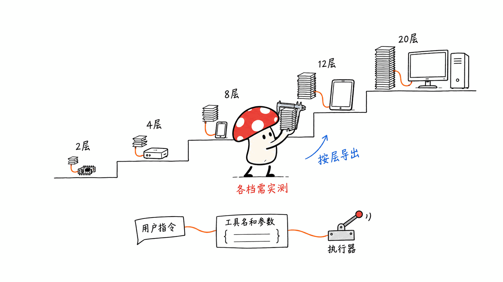
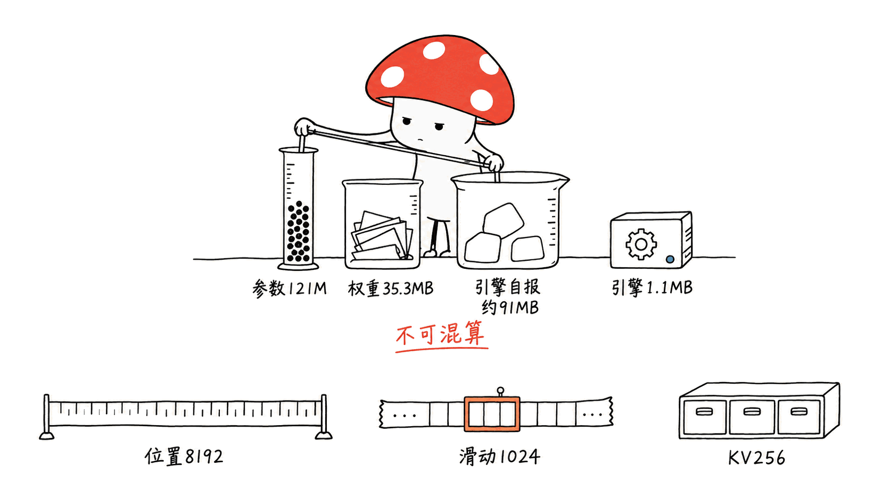
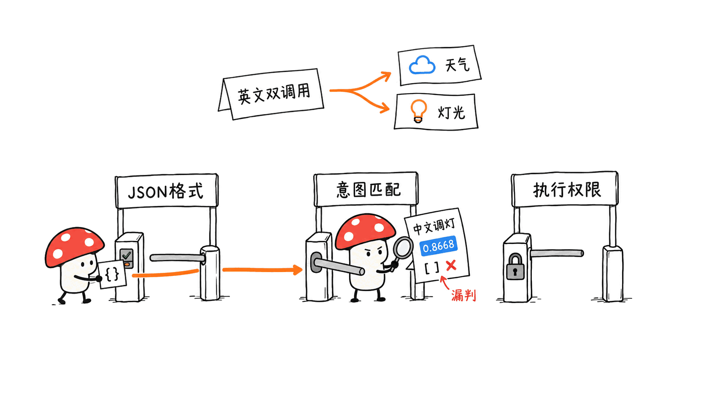

**BLUF**：Needle 3 把端侧工具调用做成了一条可裁剪的模型阶梯：完整模型 121,021,910 个参数、20 层，官方允许导出 2—20 层的子网络。

Mycelium Protocol 在 Apple M4、16GB Mac mini 上跑了五条文本请求：三个英文操作请求分别正确生成了工具调用，进程耗时 62—79 毫秒；一个写诗请求正确返回空列表；一个中文调灯请求却被漏判，仍给出 0.8668 的置信度。它值得拿来做英文设备指令的原型，但中文接入、自动执行和微调后的分数，都需要单独验证。

还有一个下载前就能核实的问题：README 写着 8—29MB，我们本次拿到的完整 `needle3.cact` 是 35,335,380 字节，约 35.3MB。引擎另有一个约 1.1MB 的可执行文件。小模型的参数量、下载体积、运行内存，应该分别算。

> 一手来源：Hugging Face 模型卡 https://huggingface.co/Cactus-Compute/needle3
>
> 官方代码：https://github.com/cactus-compute/needle
>
> 2026-10-11 API 快照：GitHub 13,816 stars；HF 133,900 次近期下载、325 likes；模型卡和仓库标注 Apache-2.0，HF 无下载审批门槛。本文数字以此次抓取和实测为准。

## 从 Needle 2 到 Needle 3，变的是什么？

本站以前拆过 45M 参数的 Needle 2：
https://blog.mushroom.cv/blog/needle2-cactus-compute-45m-tool-calling-tiny-device-foundation-model/

第三代的变化足够大，值得重新看。它把完整参数量提高到约 121M，同时引入 Laddered Simple Attention Network：同一套训练出的网络，可以按不同深度导出。对要做手机、家居控制器或嵌入式产品的人，这意味着有机会用同一个工具接口寻找不同硬件的容量档位。

这不是把一个通用聊天模型放到手机上，然后希望它学会一切。官方把能力集中在三件事：根据工具定义选择函数并填参数、按声明的字段做结构化提取、生成文本嵌入。Whistle 语音模型也能由同一引擎加载，但语音权重是另一份文件，本文的文本实测没有依赖它。

这条路线有一个很实际的产品前提：用户说的话必须落在你的工具能表达的业务里。「把客厅灯调到 30%」可以对应房间与亮度两个字段；「给我一个更舒服的家」还需要偏好、设备状态和产品规则。参数少，接口就更要清楚。



### 121M 参数为什么还能这么小？

模型卡列出四个架构组件：Monarch Hadamard MLP、带 causal convolution taps 的 GQA 注意力、通过 gather 读取的 engram n-gram 记忆、multi-lane hyper-connections。

配置文件还能核实：20 层、hidden size 768、12 个注意力头、2 个 KV 头，以及 4 条 hyper-connection lane。

官方称，大量参数放在 engram 中，使 121M 模型承担约 50M 模型的算术工作量。这里要把参数存储和每一步计算分开理解：查表仍然要存权重、读内存，只是不等于让每个参数都参与一次稠密矩阵乘法。「121M 的存储、约 50M 的算术」是厂商的架构解释，我们没有测 FLOPs 或硬件能耗。

量化也并非所有张量统一 2-bit。当前配置写着 `embedding=4,mhc=4,default=2`，KV cache 和 activation 为 8-bit。CQ2 是这套压缩方案的名称，不能直接用「121M × 2 bit」算出完整交付包。

配置来源：
https://huggingface.co/Cactus-Compute/needle3/blob/main/config.json

## 35.3MB 权重，运行时用了多少内存？

我们下载了 HF 当前完整权重和 macOS arm64 引擎。HF 快照 revision 是 `93e88ede867e4311c39151285e74df513e4b835b`，配置中引擎版本为 `3.1.0`。

| 项目 | 本次核实结果 | 这是什么数字 |
|---|---:|---|
| 完整参数量 | 121,021,910 | HF 配置值 |
| `needle3.cact` | 35,335,380 字节，约 35.3MB | 下载文件大小，十进制 MB |
| macOS arm64 `needle` | 1,106,424 字节，约 1.1MB | 独立引擎可执行文件 |
| 三个英文操作请求的峰值 RAM | 91.1—91.6MB | 引擎返回的 `peak_ram_mb` |

README 的 8—29MB 可能描述了某些档位或较早版本，但当前文件为什么超出这个区间，一手文档没有在我们读到的位置解释清楚。因此本文用实际字节数做部署预算，不把区间上限写成完整模型的当前体积。

`.cact` 权重与可执行引擎是分开的。同一引擎可以加载不同权重，这是部署方式，不是「所有东西都装进一个模型文件」。而运行内存还包括缓存、激活和运行时状态，当然也不等于下载大小。上面的 RAM 是引擎自报，我们没有用外部内存分析器复核，也没有在手机或微控制器上测。



### 8192、1024、256，哪个才是上下文？

当前配置同时出现三个容易混淆的值：

- `max_position_embeddings: 8192`：模型的位置长度配置。
- `sliding_window: 1024`：滑动注意力窗口配置。
- `kv_window: 256`：另一个 KV 窗口配置。

它们处在不同层次，不能互相替换。看到 8192 就承诺「8192 token 的完整长对话记忆」，或者看到 256 就断言「任何输入超过 256 token 都不能用」，都缺少依据。

HF 模型卡给出了更有操作性的限制：工具 schema、system prompt 和对话共用上下文；`needle_init` 会检查静态前缀的 token 数，太长就失败；生成上限 `max_new_tokens` 也要预留空间。大量工具应缩短描述、拆分目录，或利用官方描述的工具检索机制减少每轮前缀。

我们的两个工具很短，没有触及这些边界。长历史、多工具目录和长输入的实际容量，还需要另外测。迁移旧版项目时，要重新测，而不是照搬 Needle 2 文章里的窗口数字。

## 本机实测：它真的选对工具了吗？

环境是 Apple M4 Mac mini、16GB、macOS 26.6.2。我们直接运行官方 macOS arm64 CLI，使用两个英文工具定义：`get_weather(city: string)` 和 `set_light(room: string, brightness: integer)`。没有真正查询天气，也没有控制灯；测试范围是生成调用计划及参数。

每条请求启动一个新进程，文件已在本机；表中时间是进程墙钟时间，包含启动和推理，不是服务常驻后的纯模型延迟，也没有做重复采样或统计显著性分析。运行时显式设置了官方文档提供的遥测关闭变量，保留引擎默认门控。

| 输入 | 返回的工具调用 | 进程耗时 | confidence |
|---|---|---:|---:|
| What's the weather in Lagos? | `get_weather(city="Lagos")` | 69ms | 0.8842 |
| Dim the living room light to 30 percent. | `set_light(room="living room", brightness=30)` | 62ms | 0.8483 |
| Tell me the weather in Paris and set the kitchen light to 70 percent. | 按顺序生成天气与调灯两个调用 | 79ms | 0.8088 |
| Write a poem about the moon. | 空调用列表，理由是没有写诗工具 | 51ms | 0.9026 |
| 把客厅灯调到百分之三十。 | 空调用列表，理由错称没有导航或地图工具 | 57ms | 0.8668 |

双调用样例的主要字段如下：

```json
{
  "function_calls": [
    {"name": "get_weather", "arguments": {"city": "Paris"}},
    {"name": "set_light", "arguments": {"room": "kitchen", "brightness": 70}}
  ],
  "suppressed_calls": [],
  "confidence": 0.8088,
  "peak_ram_mb": 91.6
}
```

这些结果说明默认模型在这几个简单英文指令上跑通了单调用、双调用和越界拒绝。五条样例不构成准确率基准。尤其不能从一个中文失败样例推断所有中文都不可用，但它足以阻止我们把英文演示直接包装成中文产品。

同样一套英文工具，中文请求可能涉及语言泛化、房间名映射、数字表达等因素。本次没有把这些变量拆开，所以我们不武断归因。下一步应该加入中文工具描述、房间枚举与多种数字写法，再单独测试拒绝、否定和多动作输入。

## JSON 合法，为什么还不能直接执行？

Needle 将工具 schema 编译成字节级 grammar 来约束解码。官方称这能保证输出可解析。我们看到的五份输出也都是可解析 JSON。

这解决了接口格式的问题，但还有两层工作：参数是否忠于用户意图，以及业务是否允许执行。我们的测试 schema 只把亮度声明为 integer，0—100 写在工具描述里，没有写 `minimum`、`maximum`。因此仅凭 JSON 语法正确，不能得出亮度范围被强制限制的结论。产品里能写进 schema 的枚举和边界，应写进去；执行侧仍需检查设备是否存在、调用顺序和权限。



置信度也应当这样看。官方置信度指南说，返回分数结合校准头和调用 token 的解码概率，引擎还有 0.1 的默认抑制门槛与若干 grounding 检查，被抑制的调用可出现在 `suppressed_calls` 中。以上是厂商对机制的解释，我们本次没有系统检验这些门控。

指南还明确提醒非英语部署要谨慎。中文例子中，0.8668 是一次错误拒绝的分数；它不是「中文意图被理解的概率」，也不能跨语言当成已验证的执行凭证。若产品简单地规定分数高于 0.85 就视为成功，这个请求会被错误地当成有把握的无操作。

我们的建议是把三个结果分别记录：生成了什么调用、有没有被抑制、这次请求是否完成用户意图。先在自己的工具和语言上收集这些数据，再决定自动执行、请求确认或转交其他处理的阈值。阅读可以自动化，开锁、付款等动作还需要执行侧的权限与确认逻辑。

官方置信度指南：
https://cactuscompute.com/blog/needle-confidence

## 官方分数能说明第三代进步多少？

官方 benchmark 图提供了比演示更完整的对照，工具调用按精确匹配计算：

| 厂商评测 | 测试集规模 | Needle 2 | Needle 3 完整 20 层 |
|---|---:|---:|---:|
| Mobile Actions | 961 条 | 63.5% | 86.0% |
| DroidCall，调用及顺序精确匹配 | 200 条 | 17.0% | 47.0% |

同一张图中，Needle 3 在 BFCL v4 的 3,641 条 AST 匹配任务上为 50.2%，LFM2.5 1.2B 为 62.0%。所以「手机动作更强」并不等于「通用工具调用全面领先」。提取任务的 field micro-F1 又是另一种指标，不能和调用准确率混在一起排总榜。

这些均是 Cactus 发布的结果，我们没有独立重跑。它们足以说明厂商报告的代际改进方向，不能替代你的验收集。模型卡还声称微调后的 4 层、29M 子网络在 DroidCall 上超过 DeepSeek V4 Flash；这是特定任务的微调对比，不能解读成 29M 模型具备云端大模型的通用能力。

对小团队而言，更有用的问题是：你那二十种实际操作，在口误、缺参、否定和多个动作混在一起时能做到什么水平？这会直接决定省下的延迟，是否值得承担额外的产品处理逻辑。

## 微调后，还能保留 2-bit 和 confidence 吗？

第三代的容量阶梯很诱人，但官方当前 README 把两条微调路径分得很清楚：

| 项目 | 本地 LoRA | Cactus Platform |
|---|---|---|
| 训练方式 | 冻结 base，训练注意力投影 adapter | 官方称全模型、多深度训练 |
| 输出精度 | 4-bit `.cact` | 2-bit `.cact` |
| 置信度 | 原头未更新，包返回 `None` | 官方称按你的工具重新校准 |
| 数据去向 | 本机训练 | 上传平台 |
| 保留原能力 | 不应默认承诺 | 官方称混合原始训练数据 |


官方给出的本地流程是：

```bash
pip install "cactus-needle[train]"
needle finetune data.jsonl --epochs 10 --out adapter.safetensors
needle build --lora adapter.safetensors --layers 8 --out tuned.cact
```

这里是文档中的用法，不是我们已经跑过的训练。官方说明本地 LoRA 在完整 20 层上训练，再合并并裁出所需深度；它不等于直接训练一个 8 层小网络。更不能把默认 2-bit 模型的体积和分数照搬到你的 4-bit 微调产物上。

如果现有业务判断写成 `confidence > threshold`，加载本地微调权重后就得处理 `None`，并为新模型重新建立验收逻辑。Platform 的更紧量化和校准是另一条服务路径，也带来数据上传与账户依赖。这是采购和数据流的选择，不只是换一个训练命令。

## 本地推理的遥测边界在哪里？

截至本次核实，GitHub README 写明 binary 默认开启 telemetry，关闭方式是：

```bash
NEEDLE_TELEMETRY=0 DO_NOT_TRACK=1 \
  ./needle --model needle3.cact --tools tools.json \
  --prompt "Dim the living room light to 30 percent."
```

我们按这个方式运行了文本测试。Python 包的 `_telemetry.py` 也确实检查这两个变量；源码注释称只发匿名使用事件、版本和系统信息，不发 prompt 或输出。那是公开源码对 Python 路径的描述。

但共享引擎的 Whistle HF 模型卡又写着引擎不读取环境变量，与 GitHub 对 binary 的说明存在冲突。我们没有二进制源代码审计或抓包结果，不能宣称设置变量就已证明整个二进制绝无出网。需要离线交付的人，应在隔离网络条件下验证缓存后的实际运行，再按自己的分发版本确认遥测行为。

这不影响模型在本机生成调用的事实，却影响「本地运行」能否被产品直接描述成「完全离线、没有遥测」。首次自动下载、运行时遥测、平台微调上传，也是三种不同的数据流。

Python 遥测源码：
https://github.com/cactus-compute/needle/blob/main/needle/_telemetry.py

## 哪种产品值得先试？

Mycelium Protocol 的判断是，Needle 3 很适合放在动作清楚、工具数量有限、语言经过验证的产品入口，例如英文智能家居控制、现场操作表单或固定业务字段的提取。这个判断基于它的专门接口和我们测到的短指令表现，提取能力本次没有实测。

起步时可以先返回调用计划，让用户看到「房间：kitchen，亮度：70」，再接执行层。这样既能收集意图匹配数据，也能看出错误究竟来自模型、工具定义还是业务映射。别一上来就把自然语言直接连到物理设备。

如果主要需求是中文客服、知识问答、复杂计划或长文写作，本文没有给出它能胜任的证据。对中文操作入口，先把语言验收集补齐；对低内存设备，先测目标深度；对本地 LoRA，先处理分数缺失；对离线产品，先核实交付包的数据流。把这几件事分开，才知道小模型到底省了什么，又把什么工作留给了产品。

## 常见问题

### Needle 3 现在到底是 29MB 还是 35.3MB？

README 写 8—29MB，但本次 HF 完整 `needle3.cact` 下载为 35,335,380 字节，约 35.3MB；macOS arm64 引擎另约 1.1MB。不同层数可以有不同体积，本文没有实测各档。部署完整当前模型应以文件字节数为准。

### 79 毫秒意味着灯已经被调好了吗？

没有。79ms 是本机 CLI 生成两个函数名及参数、进程退出的墙钟时间。测试没有执行天气请求，也没有控制任何灯，不含设备网络、鉴权或工具执行延迟。

### 中文能用吗，微调后分数可靠吗？

一个中文调灯样例被高置信度漏判，说明需要另外验收，不能据此宣称所有中文都失败。当前 README 说明本地 LoRA 不更新置信度头，包返回 `confidence: None`；平台微调则声称会重新校准。本次没有跑任何微调。

## 一手源

- 本次原始输出、计时范围与文件校验值：https://blog.mushroom.cv/research/hf-small-models-20261011-smoke.json

- Needle 3 模型卡：https://huggingface.co/Cactus-Compute/needle3
- HF 模型元数据：https://huggingface.co/api/models/Cactus-Compute/needle3
- 参数、窗口与量化配置：https://huggingface.co/Cactus-Compute/needle3/blob/main/config.json
- 本次权重快照：https://huggingface.co/Cactus-Compute/needle3/tree/93e88ede867e4311c39151285e74df513e4b835b
- 官方 README、基准图与微调路径：https://github.com/cactus-compute/needle
- 置信度与抑制机制：https://cactuscompute.com/blog/needle-confidence
- `.cact` 格式：https://cactuscompute.com/blog/cact-format
- Python 遥测实现：https://github.com/cactus-compute/needle/blob/main/needle/_telemetry.py
- 共享引擎另一份说明：https://huggingface.co/Cactus-Compute/whistle

---

> © 2026 Author: Mycelium Protocol. 本文采用 [CC BY 4.0](https://creativecommons.org/licenses/by/4.0/deed.zh) 授权——欢迎转载和引用，须注明作者姓名及原文链接，不得去除署名后以原创发布。

<!--EN-->

**BLUF**: Needle 3 turns on-device tool calling into a ladder of deployable models: the full network has 121,021,910 parameters and 20 layers, with officially supported exports from 2 to 20 layers. Mycelium Protocol ran five text requests on an Apple M4 Mac mini with 16GB memory. Three English action requests produced correct calls in 62–79 ms of process time, and an out-of-scope poetry request returned an empty list. One Chinese lighting request was incorrectly rejected with 0.8668 confidence. It is a promising starting point for an English device-control prototype; Chinese input, automatic execution and post-tuning confidence need their own validation.

There is also a discrepancy you can check before deployment. The README says 8–29MB, but the full `needle3.cact` we downloaded contains 35,335,380 bytes, about 35.3MB. The engine is a separate executable of roughly 1.1MB. Parameter count, download size and runtime memory are different budgets.

> Primary model source: https://huggingface.co/Cactus-Compute/needle3
>
> Official code: https://github.com/cactus-compute/needle
>
> API snapshot on October 11, 2026: 13,816 GitHub stars; 133,900 recent HF downloads and 325 likes. The repository and model card specify Apache-2.0, and the HF repository is ungated. Numbers in this article refer to this snapshot and our local checks.

## What changed from Needle 2 to Needle 3?

We previously covered the 45M-parameter Needle 2:
https://blog.mushroom.cv/blog/needle2-cactus-compute-45m-tool-calling-tiny-device-foundation-model/

The third generation warrants a fresh examination. It increases the full model to roughly 121M parameters and adds a Laddered Simple Attention Network: the trained network can be exported at different depths. For a phone app, smart-home controller or embedded product, that offers a way to explore hardware capacity tiers while keeping the tool interface consistent.

The official capability surface centers on three tasks: choosing functions and filling their arguments, extracting declared structured fields, and producing text embeddings. The same engine can load the Whistle speech model, but those are separate weights. Our text tests did not use Whistle.

This approach has a practical product requirement: the user's request must fit the operations your tools can express. “Set the living-room light to 30%” maps neatly to a room and a brightness field. “Make my home more comfortable” requires preferences, device state and product rules. A smaller model puts more responsibility on a clear interface.


### How does a 121M model stay this compact?

The model card lists a Monarch Hadamard MLP, GQA attention with causal convolution taps, engram n-gram memory accessed by gather, and multi-lane hyper-connections. The configuration confirms 20 layers, a hidden size of 768, 12 attention heads, 2 KV heads and 4 hyper-connection lanes.

Cactus says that most parameters live in the engram, giving a 121M model the arithmetic workload of a roughly 50M model. The distinction is stored parameters versus computation per step. Lookup tables still contain weights and consume memory bandwidth; their parameters need not all participate in a dense matrix multiplication. The “121M storage, roughly 50M arithmetic” characterization is the vendor's explanation. We did not measure FLOPs or power consumption.

Quantization is also mixed. The current configuration specifies `embedding=4,mhc=4,default=2`, with 8-bit KV cache and activations. CQ2 names a compression scheme; multiplying all 121M parameters by two bits does not calculate the full deliverable.

Configuration source:
https://huggingface.co/Cactus-Compute/needle3/blob/main/config.json

## How much memory accompanies the 35.3MB weights?

We downloaded the current HF full weights and macOS arm64 engine. The HF revision was `93e88ede867e4311c39151285e74df513e4b835b`; the configuration lists engine version `3.1.0`.

| Item | Verified result | Meaning |
|---|---:|---|
| Full parameter count | 121,021,910 | HF configuration value |
| `needle3.cact` | 35,335,380 bytes, about 35.3MB | Downloaded file, decimal MB |
| macOS arm64 `needle` | 1,106,424 bytes, about 1.1MB | Separate engine executable |
| Peak RAM for three English action requests | 91.1–91.6MB | Engine-reported `peak_ram_mb` |

The README's 8–29MB range may refer to particular depths or an earlier version. We found no explanation in the material we reviewed for the current full file exceeding that range. We therefore budget using actual bytes rather than treating 29MB as the current full model's size.

The `.cact` weights and executable engine are separate files. Loading different weights into the same engine is the deployment arrangement; it does not put everything inside the weights file. Runtime memory also includes caches, activations and runtime state. The figures above are engine self-reports, without verification by an external memory profiler. We did not test phones or microcontrollers.


### Which context value matters: 8192, 1024 or 256?

The configuration contains three distinct settings:

- `max_position_embeddings: 8192`: the positional-length configuration.
- `sliding_window: 1024`: the sliding-attention window configuration.
- `kv_window: 256`: a separate KV-window setting.

They belong to different layers of the design. Neither “8192 tokens of full conversation memory” nor “any input longer than 256 tokens is unusable” follows from those settings alone.

The HF card provides operational guidance: tool schemas, system prompt and conversation share context space. `needle_init` checks the static prefix token count and fails if it is too large. `max_new_tokens` also reserves context capacity. For large catalogs, shorten descriptions, partition tools or use the documented retrieval mechanism to reduce the per-turn prefix.

Our two short tools did not approach these limits. Long histories, large catalogs and long requests require separate tests. Existing Needle 2 deployments should remeasure these boundaries instead of carrying forward old window numbers.

## Local tests: did it choose the right tools?

The machine was an Apple M4 Mac mini, 16GB, macOS 26.6.2. We ran the official macOS arm64 CLI directly with two English tool definitions: `get_weather(city: string)` and `set_light(room: string, brightness: integer)`. No weather service was queried and no lamp was controlled. We tested call planning and arguments.

Each request launched a new process with files already present locally. Times are wall-clock process durations, including startup and inference. They are not steady-state model latency, and we did not run repeated trials or a statistical performance study. We set the documented telemetry opt-outs and kept the engine's default gating.

| Input | Produced calls | Process time | confidence |
|---|---|---:|---:|
| What's the weather in Lagos? | `get_weather(city="Lagos")` | 69ms | 0.8842 |
| Dim the living room light to 30 percent. | `set_light(room="living room", brightness=30)` | 62ms | 0.8483 |
| Tell me the weather in Paris and set the kitchen light to 70 percent. | Weather call, then lighting call | 79ms | 0.8088 |
| Write a poem about the moon. | Empty list; no poetry tool | 51ms | 0.9026 |
| 把客厅灯调到百分之三十。 (“Set the living-room light to thirty percent.”) | Empty list; incorrectly cited missing navigation/maps tools | 57ms | 0.8668 |

The main fields of the two-call result were:

```json
{
  "function_calls": [
    {"name": "get_weather", "arguments": {"city": "Paris"}},
    {"name": "set_light", "arguments": {"room": "kitchen", "brightness": 70}}
  ],
  "suppressed_calls": [],
  "confidence": 0.8088,
  "peak_ram_mb": 91.6
}
```

The default model handled these simple English single-action and multi-action requests, plus an out-of-scope rejection. Five examples are not an accuracy benchmark. One failed Chinese request does not establish universal Chinese failure, but it prevents us from presenting the English demonstration as evidence of readiness for Chinese users.

With the same English tool definitions, Chinese input can introduce language generalization, room-name mapping and number-expression issues. We did not isolate those variables. A follow-up evaluation should vary Chinese tool descriptions, room enums and numerical forms, then test rejections, negations and combined actions separately.

## Why isn't valid JSON enough to execute an action?

Needle compiles tool schemas into a byte-level decoding grammar. The vendor says this guarantees parseable output, and all five outputs we observed were parseable JSON.

Two further questions remain: do the parameters match the user's intent, and does the business permit the action? Our test schema declared brightness as an integer. Its 0–100 range appeared in the description, without `minimum` or `maximum` fields. Consequently, valid JSON does not establish that the numerical range was enforced. Put available enums and bounds in the schema, and still check device existence, call order and permissions in the executor.


Confidence needs the same treatment. The official confidence guide describes a score combining a calibrated head with call-token decoding probability, a default engine floor of 0.1, and grounding checks. Withheld calls can appear in `suppressed_calls`. This is the vendor's mechanism description; we did not systematically evaluate those gates.

The guide explicitly urges caution with non-English deployments. Our 0.8668 score belonged to an incorrect refusal. It is not a demonstrated probability of correct Chinese intent recognition. A product treating anything above 0.85 as a successful interpretation could classify that failed request as a confident no-op.

Our recommendation is to record three things separately: produced calls, suppressed calls, and whether the request achieved the user's intent. Gather those outcomes for your own tools and languages before choosing thresholds for execution, confirmation or escalation. Reading operations can be automated; actions such as unlocking a door or making a payment still need execution-side permission and confirmation logic.

Official confidence guide:
https://cactuscompute.com/blog/needle-confidence

## What do the official scores say about the generation change?

The official benchmark graphic offers a larger comparison, with tool calls scored by exact match:

| Vendor evaluation | Test size | Needle 2 | Full 20-layer Needle 3 |
|---|---:|---:|---:|
| Mobile Actions | 961 rows | 63.5% | 86.0% |
| DroidCall, exact calls in order | 200 rows | 17.0% | 47.0% |

On the same graphic, Needle 3 scores 50.2% on BFCL v4's 3,641-row AST-match evaluation, compared with 62.0% for LFM2.5 1.2B. Strength on mobile actions does not establish leadership across general tool calling. Extraction's field micro-F1 is another metric and should not be blended into a single accuracy ranking.

Cactus published all these results; we did not independently rerun them. They show the direction of the vendor-reported generational improvement, but they do not replace a product acceptance set. The model card also says a fine-tuned four-layer, 29M subnetwork surpasses DeepSeek V4 Flash on DroidCall. That is a specific fine-tuned task comparison, not evidence that a 29M model has the general capabilities of a cloud model.

For a small team, the useful question is how its actual operations behave when users omit arguments, misspeak, negate an action or combine requests. Those outcomes determine whether lower latency is worth the additional product logic.

## Can fine-tuning preserve 2-bit weights and confidence?

The ladder is appealing, but the current official README distinguishes two tuning paths:

| Property | Local LoRA | Cactus Platform |
|---|---|---|
| Training | Frozen base; attention-projection adapters | Vendor describes full-model, multi-depth training |
| Export | 4-bit `.cact` | 2-bit `.cact` |
| Confidence | Head unchanged; package returns `None` | Vendor says recalibrated for your tools |
| Data location | Local training | Uploaded to the platform |
| Retaining original capabilities | Do not assume retention | Vendor says original training data is mixed in |


The documented local commands are:

```bash
pip install "cactus-needle[train]"
needle finetune data.jsonl --epochs 10 --out adapter.safetensors
needle build --lora adapter.safetensors --layers 8 --out tuned.cact
```

These are documented commands, not training we performed. Local LoRA trains at the full 20 layers, then the adapter is merged and the desired depth exported. That does not mean training an eight-layer model directly. The default 2-bit model's size and confidence should not be carried over to a custom 4-bit artifact.

A business rule written as `confidence > threshold` must handle `None` when loading local tuned weights and establish a new acceptance process. Platform tuning offers a different quantization and calibration path, together with data uploads and account dependencies. This is a service and data-flow choice, beyond a CLI substitution.

## What is the telemetry boundary of local inference?

At the time of our check, the GitHub README states that telemetry is enabled by default in the binary, with these opt-outs:

```bash
NEEDLE_TELEMETRY=0 DO_NOT_TRACK=1 \
  ./needle --model needle3.cact --tools tools.json \
  --prompt "Dim the living room light to 30 percent."
```

We used that form for our text tests. The Python package's `_telemetry.py` checks both variables. Its source comments describe anonymous usage events, versions and system details, without prompts or outputs. That describes the publicly readable Python implementation.

However, Whistle's HF card describes the shared engine as reading no environment variables. That conflicts with GitHub's binary instructions. We did not audit binary source or capture network traffic, so setting those variables does not establish that the whole binary made no network requests. Offline deployments should test cached execution with network isolation and verify telemetry behavior in their actual distribution version.

This does not alter the fact that calls were generated locally. It affects whether a product can describe local execution as fully offline and telemetry-free. Initial downloads, runtime telemetry and platform training uploads are also three distinct data flows.

Python telemetry source:
https://github.com/cactus-compute/needle/blob/main/needle/_telemetry.py

## What products should try it first?

Mycelium Protocol sees Needle 3 as a useful candidate for a product entrance with clear actions, a limited tool surface and validated language behavior: English smart-home control, field-operation forms or extraction of fixed business fields. That assessment follows from its specialized interface and the short-instruction results. We did not test extraction in this session.

Start by displaying a call plan such as “room: kitchen; brightness: 70” before connecting execution. That collects intent-matching evidence and helps distinguish model errors from tool-description or business-mapping errors. Natural language should not be connected directly to a physical actuator at the prototype's first step.

This article provides no evidence of fitness for Chinese customer support, knowledge Q&A, complex planning or long-form writing. For a Chinese command interface, build a language acceptance set. For memory-limited devices, test the target depth. For local LoRA, handle missing confidence. For offline products, verify the deliverable's data flows. Evaluating those separately tells you what the small model saves and what the product must still supply.

## FAQ

### Is Needle 3 currently 29MB or 35.3MB?

The README says 8–29MB, but our full HF `needle3.cact` download was 35,335,380 bytes, about 35.3MB. The macOS arm64 engine adds roughly 1.1MB. Different depths can have different sizes; we did not measure the individual exports. Budget the current full model using its actual bytes.

### Does 79 milliseconds mean the light was already adjusted?

No. It is wall-clock time for the local CLI to produce two function names and argument sets and exit. No weather lookup or lighting operation was executed. Device networking, authorization and tool execution time are excluded.

### Does Chinese work, and can confidence be trusted after tuning?

One Chinese lighting request failed with high confidence, establishing a need for separate evaluation rather than a claim that every Chinese input fails. The current README says local LoRA leaves the confidence head unchanged and the package returns `confidence: None`; platform tuning claims recalibration. We ran no fine-tuning.

## Primary sources

- Raw outputs, timing scope and file hashes: https://blog.mushroom.cv/research/hf-small-models-20261011-smoke.json

- Needle 3 model card: https://huggingface.co/Cactus-Compute/needle3
- HF metadata: https://huggingface.co/api/models/Cactus-Compute/needle3
- Parameters, windows and quantization: https://huggingface.co/Cactus-Compute/needle3/blob/main/config.json
- Downloaded weight snapshot: https://huggingface.co/Cactus-Compute/needle3/tree/93e88ede867e4311c39151285e74df513e4b835b
- Official README, benchmarks and tuning paths: https://github.com/cactus-compute/needle
- Confidence and withholding: https://cactuscompute.com/blog/needle-confidence
- `.cact` format: https://cactuscompute.com/blog/cact-format
- Python telemetry implementation: https://github.com/cactus-compute/needle/blob/main/needle/_telemetry.py
- Alternate shared-engine description: https://huggingface.co/Cactus-Compute/whistle

---

> © 2026 Author: Mycelium Protocol. Licensed under [CC BY 4.0](https://creativecommons.org/licenses/by/4.0/) — free to share and adapt with attribution. You must credit the author and link to the original; removing attribution and republishing as original is not permitted.
