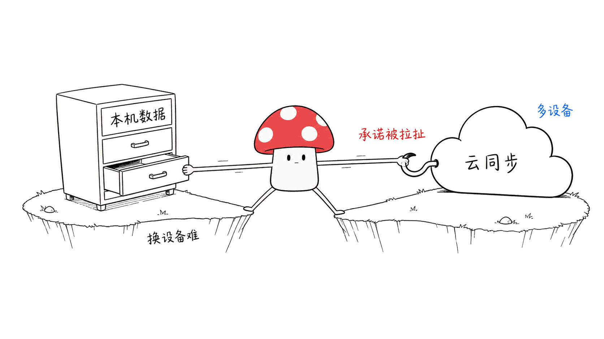
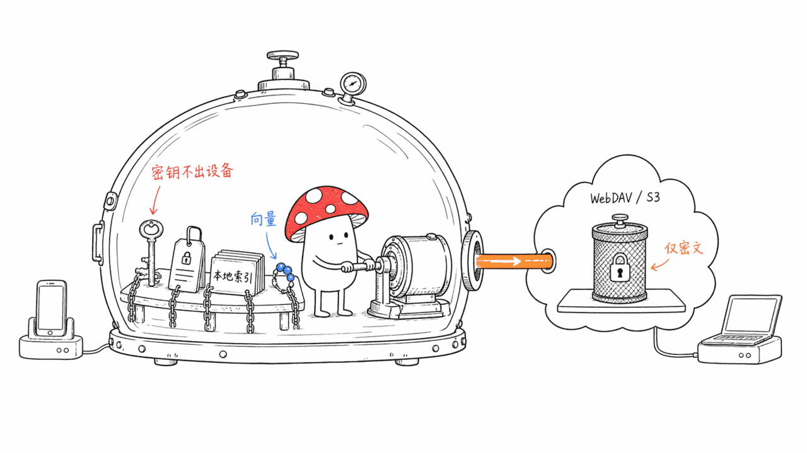
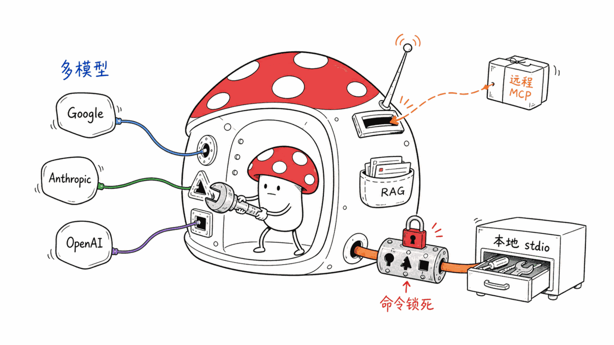
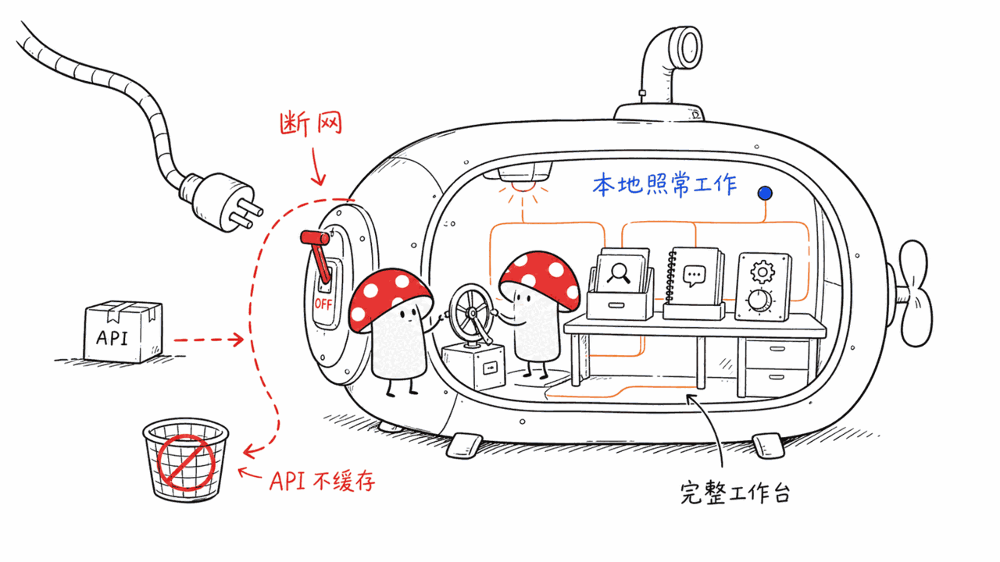

*by Mycelium Protocol*

---

项目地址：https://github.com/u14app/neo-chat
授权：MIT

---

## 一句话结论

**Neo Chat 是一个把"本地优先"做到细节里的 AI 聊天工作台**：聊天记录、工作区元数据、技能、插件配置、记忆、搜索索引、文件——默认全部留在浏览器里，服务端路由只是受控代理（转发模型请求、网页搜索、RAG 解析、语音、插件和 MCP 执行、部署健康检查）。Next.js 16 + React 19 + TypeScript 6 + Zustand，MIT 协议，1774 star。

它最值得写的不是"又一个开源聊天界面"，而是 v2.4.0 解决了本地优先应用里最难的那道题：**多设备之间怎么同步，同时不破坏"数据不出本机"这个承诺。**

## 加密跨设备同步：本地优先应用的死穴，它啃下来了

"本地优先"和"多设备可用"天然打架——数据留在本机，换个设备就没了；上云同步，"本地优先"就成了一句空话。

Neo Chat 的解法是一个**可选的、端到端加密的个人保险库**，通过 WebDAV 或 S3/MinIO 做跨设备同步。官方原话说得很直白：**恢复密钥、凭据、本地基线数据、搜索缓存、向量嵌入——这些东西永远不会进入远程对象或 ZIP 文件。** 也就是说，就算你用的 WebDAV/S3 服务商本身不可信，它能拿到的也只是加密后的密文容器，解密材料从来不会离开你的设备。

这是"local-first"和"跨设备"这对矛盾里，工程上最难受的一段——不是加个密就完事，而是要精确划清"哪些东西可以离开设备（加密后的数据块）"和"哪些东西绝对不能离开设备（密钥、凭据、明文索引）"这条线。

## 一套壳，接遍所有模型和工具

**多供应商聊天**：Google、Anthropic（原生 Messages API SDK 接入）、OpenAI、以及 OpenAI 兼容端点，供应商级别的作用域隔离。

**远程 MCP + 本地 stdio 桥接**：从官方 MCP Registry 直接发现和安装远程 streamable HTTP MCP 服务器，带插件市场管理、鉴权、服务端工具执行。本地 stdio 桥接跑在一个经过身份验证的 Docker 容器里，命令集合由部署配置固定死，不能运行时任意扩展——这是个明显有意为之的安全边界设计。

**参数化 Skill**：纯文本 Skill，支持带参数、支持把最多 4 个 Skill 打包成有序执行链，调用元数据可复现。

**RAG**：collection 级别的分块控制、Markdown 标题感知的预览、显式重建索引、混合词法/向量检索，向量检索不可用时优雅降级回词法检索而不是直接报错。

## 离线可用是真的离线

内置一个严格"零 API 缓存边界"的离线 PWA——不是那种"离线时显示缓存的旧结果"的伪离线，是明确划定哪些操作在没有网络时依然可用。配合本地全局搜索、多语言（英/中/日）设置搜索、首次运行模型引导，整个产品在断网状态下依然是一个可用的工作台，而不是一个报错页面。

## 谁该看这个

**适合**：想要一个功能完整的聊天工作台（多模型/RAG/MCP/记忆/语音全都要），但又不想把数据交给某个云服务商的人；需要多设备同步、但同步渠道本身信不过（公共 WebDAV、第三方 S3 兼容存储）的场景。

**不适合 / 需要注意**：本地 stdio MCP 桥接的命令集合是部署时锁死的，如果你需要运行时动态注册本地工具，这条路走不通，需要用远程 MCP 服务器代替。

---

> © 2026 Author: Mycelium Protocol. 本文采用 [CC BY 4.0](https://creativecommons.org/licenses/by/4.0/deed.zh) 授权——欢迎转载和引用，须注明作者姓名及原文链接，不得去除署名后以原创发布。

<!--EN-->

## TL;DR

**Neo Chat is an AI chat workspace that takes "local-first" seriously down to the details**: chat history, workspace metadata, skills, plugin configuration, memory, search indexes, and files all stay in the browser by default; server routes are controlled proxies only (forwarding model requests, web search, RAG parsing, voice, plugin/MCP execution, deployment health checks). Next.js 16, React 19, TypeScript 6, Zustand. MIT licensed, 1,774 stars.

What makes it worth writing about isn't "another open-source chat UI" — it's that v2.4.0 solved the hardest problem in local-first apps: **how to sync across devices without breaking the "data never leaves your machine" promise.**

## Encrypted cross-device sync: the local-first Achilles' heel, actually solved

"Local-first" and "multi-device" are naturally in tension — keep data on one machine and it's gone when you switch devices; sync it to the cloud and "local-first" becomes an empty phrase.

Neo Chat's solution is an **opt-in, end-to-end encrypted personal vault** synced across devices via WebDAV or S3/MinIO. The project states it plainly: **recovery keys, credentials, local baseline data, search caches, and vector embeddings never enter remote objects or ZIP files.** Even if the WebDAV/S3 provider you use isn't trustworthy, all it ever gets is an encrypted container — the decryption material never leaves your device.

This is the genuinely hard engineering part of reconciling "local-first" with "multi-device" — not just bolting on encryption, but precisely drawing the line between "what may leave the device (encrypted blobs)" and "what must never leave the device (keys, credentials, plaintext indexes)."

## One shell, every model and tool

**Multi-provider chat**: Google, Anthropic (native Messages API via the official SDK), OpenAI, and OpenAI-compatible endpoints, with provider-scoped isolation.

**Remote MCP plus a local stdio bridge**: discover and install remote streamable-HTTP MCP servers directly from the official MCP Registry, with plugin-market management, authentication, and server-side tool execution. The local stdio bridge runs in an authenticated Docker container whose command set is fixed by deployment configuration — not dynamically extensible at runtime. A deliberate security boundary.

**Parameterized Skills**: plain-text skills that accept parameters, chainable into ordered bundles of up to four, with reproducible invocation metadata.

**RAG**: collection-level chunking controls, Markdown heading-aware previews, explicit reindexing, hybrid lexical/vector retrieval that gracefully falls back to lexical search instead of erroring out when vector retrieval is unavailable.

## Offline that's actually offline

A built-in offline PWA with strict no-API-cache boundaries — not the fake kind of offline that just shows stale cached results, but one that clearly defines which operations actually work without a network. Paired with local global search, localized (English/Chinese/Japanese) settings search, and first-run model guidance, the whole workspace stays usable while disconnected, rather than degrading into an error page.

## Who should look at this

**Good fit**: anyone who wants a full-featured chat workspace — multi-model, RAG, MCP, memory, voice, all of it — without handing their data to a cloud vendor; scenarios needing multi-device sync where the sync channel itself isn't trusted (public WebDAV, third-party S3-compatible storage).

**Not a fit / worth noting**: the local stdio MCP bridge's command set is fixed at deploy time — if you need to register local tools dynamically at runtime, this path doesn't support it; use a remote MCP server instead.

---

> © 2026 Author: Mycelium Protocol. Licensed under [CC BY 4.0](https://creativecommons.org/licenses/by/4.0/) — free to share and adapt with attribution. You must credit the author and link to the original; removing attribution and republishing as original is not permitted.
