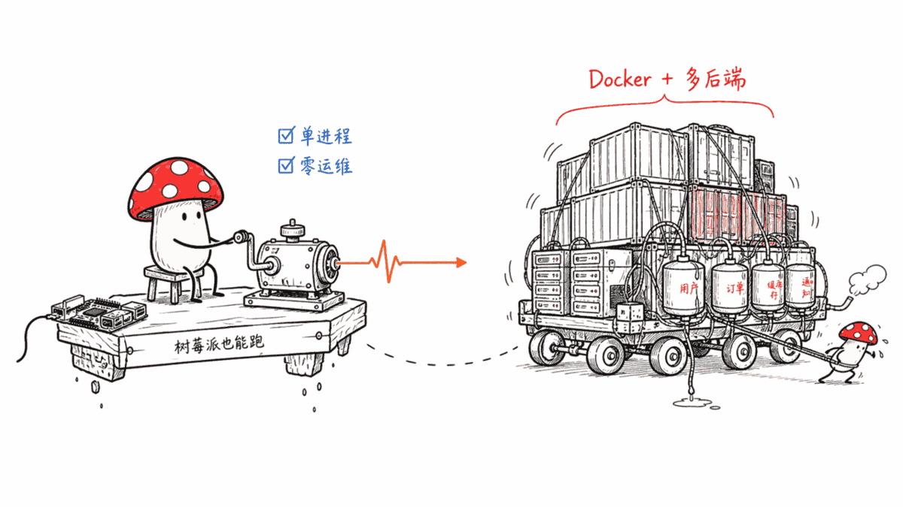
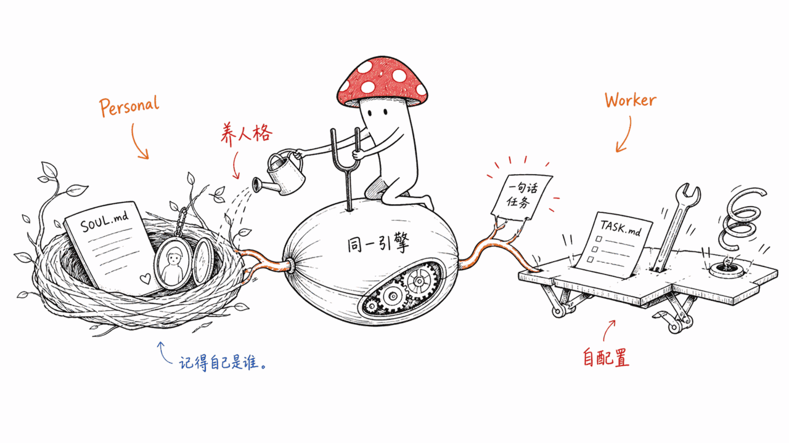
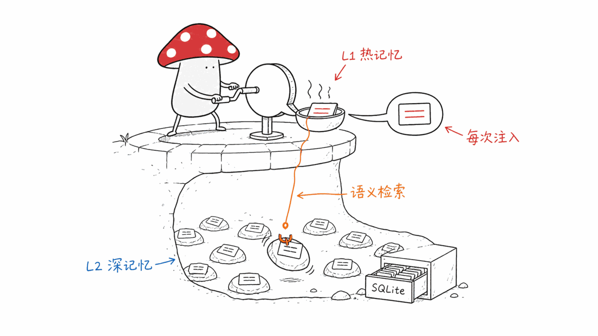
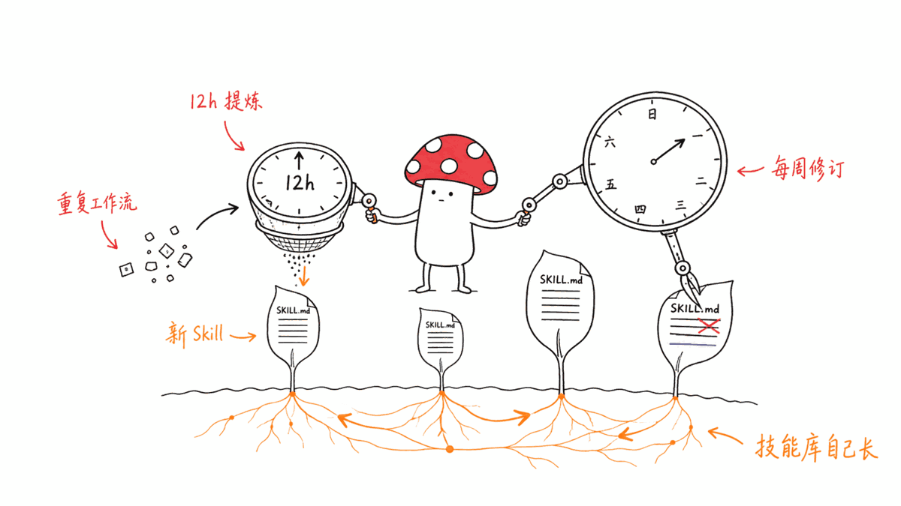

*by Mycelium Protocol*

---

项目地址：https://github.com/ClickHouse/nerve
授权：Apache-2.0

---

## 一句话结论

**Nerve 是 ClickHouse 官方做的一个自托管 Agent 运行时**，构建在 Anthropic 的 Claude Agent SDK 之上，主打"单进程、零运维"——不需要 Docker、不需要消息队列，FastAPI + uvicorn + asyncio 就能跑，官方原话是"能跑在树莓派上"。目前 72 star、Apache-2.0，8 月 17 日还在推送提交，是个早期但工程细节写得很扎实的项目。

它跟本站前几天写过的 Hermes Agent 是同类竞品——都是"完整的自托管 Agent 运行时"而不是挂在别人身上的管理层。区别在哪：**Hermes 模型不锁定（Nous Portal/OpenRouter/OpenAI 随便选），Nerve 绑定 Claude Agent SDK，换来的是可以直接用你的 Claude Max/Pro 订阅跑，不用另开 API Key。** 一个走"全平台通吃"，一个走"深度绑定单一生态换零成本"，是两种不同的取舍。

## 两种模式：养一个人格，还是雇一个专员

这是 Nerve 最有意思的设计。同一套引擎，通过 `nerve init --mode` 分岔成两种完全不同的产品形态：

**Personal 模式**——面向一个人的生活助手。同步邮件、记住你的偏好、随时间"养成"性格。工作区里的 `SOUL.md` 定义人格、`IDENTITY.md` 定义身份、`USER.md` 定义用户画像。官方文档里那句话挺直白："You're not a chatbot. You're becoming someone."（你不是聊天机器人，你正在成为一个人。）内置 crontab：收件箱处理器（15分钟一次）、任务规划器（4小时一次）、记忆维护。

**Worker 模式**——面向团队或程序化部署的任务型 Agent。**给它一句大白话的任务描述，它自己去调研、自己写 `TASK.md`、自己创建技能、自己配置 cron，然后开始干活。** 示例场景是"起一个盯着 CI、修 flaky test 的 worker"。计划驱动，执行前要人审批，全程留痕。

一套引擎两种"灵魂模板"，这个设计比单纯"一个 Agent 干到底"要聪明——记忆分类都是跟着模式走的：Personal 模式记的是人际关系、财务、健康这类生活维度；Worker 模式记的是操作模式、流程、审批这类工作维度。

## 双层记忆：热记忆 + 语义深记忆

**L1 热记忆（MEMORY.md）**：精选事实，每次对话都注入系统提示词。带日期标签，过期自动淘汰。

**L2 深记忆（memU）**：对全部历史（对话、事实、偏好、事件）做语义检索，SQLite 持久化。配了 OpenAI Key 就用向量嵌入，没配就退化成纯 Anthropic 模型的 LLM 排序检索。四种记忆类型（画像/事件/知识/行为），会话结束自动索引，新会话开始时做"预召回"，三级质量过滤防止记忆库被无意义碎片污染，语义去重阈值 0.85（余弦相似度）。

## Skill 会自己长出来

工作区里的 skill 是纯 Markdown 文件，Agent 自己读、自己写、自己改。两个专门的定时任务在管这件事：`skill-extractor`（12小时一次，从重复出现的工作流里提炼新技能）、`skill-reviser`（每周一次，回头审查已有技能的准确性）。系统提示词里默认只塞技能的名字和一句话描述，完整内容按需加载——这是标准的"渐进式披露"设计，避免每次对话都把所有技能全文塞进上下文。

## 统一收件箱：Gmail / GitHub / Telegram

游标（cursor）式的数据接入管线，每个数据源是一个独立的 APScheduler 任务，多个"消费者"可以按各自节奏读同一份收件箱——收件箱分诊、摘要生成、任务提取，互不干扰。所有外部内容进来前都会打上"不可信数据"的警告前缀，防止 prompt injection。

## 谁该看这个

**适合**：已经在用 Claude Max/Pro 订阅、不想为 Agent 再单开 API 账单的人；想要"生活助手"和"工作专员"两种形态而不是单一 chatbot 的场景；喜欢 ClickHouse 一贯的工程审美（单进程、零依赖）的人。

**不适合 / 需要注意**：72 star 早期项目，稳定性和长期维护需要观察；深度绑定 Claude Agent SDK，如果你想换模型供应商这条路走不通，这点跟 Hermes Agent 正好相反，选之前想清楚哪个取舍适合自己。

---

> © 2026 Author: Mycelium Protocol. 本文采用 [CC BY 4.0](https://creativecommons.org/licenses/by/4.0/deed.zh) 授权——欢迎转载和引用，须注明作者姓名及原文链接，不得去除署名后以原创发布。

<!--EN-->

## TL;DR

**Nerve is a self-hosted agent runtime built by ClickHouse**, constructed on top of Anthropic's Claude Agent SDK, with a core pitch of "single process, zero ops" — no Docker, no message queue, just FastAPI + uvicorn + asyncio. The project's own line: it can run on a Raspberry Pi. Currently 72 stars, Apache-2.0, still pushing commits on August 17 — early but the engineering detail is unusually solid for its stage.

It's a direct peer of Hermes Agent, which this blog covered a few days ago — both are complete self-hosted agent runtimes, not management layers bolted onto something else. The difference: **Hermes is model-agnostic (pick Nous Portal, OpenRouter, or OpenAI freely); Nerve is bound to the Claude Agent SDK, in exchange for running directly on your existing Claude Max/Pro subscription with no separate API key.** One goes for universal compatibility, the other trades ecosystem lock-in for zero marginal cost — two different bets.

## Two modes: growing a personality, or hiring a specialist

This is Nerve's most interesting design choice. The same engine forks into two completely different product shapes via `nerve init --mode`:

**Personal mode** — a life assistant for one human. Syncs email, remembers your preferences, develops a personality over time. `SOUL.md` in the workspace defines personality, `IDENTITY.md` defines identity, `USER.md` defines the user profile. The docs put it plainly: "You're not a chatbot. You're becoming someone." Built-in crons: inbox processor (every 15 min), task planner (every 4 hours), memory maintenance.

**Worker mode** — a task-focused agent for teams or programmatic deployment. **Give it a plain-English task description, and it researches on its own, writes its own `TASK.md`, creates its own skills, sets up its own cron jobs, and starts working.** The example: spin up a worker that watches CI and fixes flaky tests. Plan-driven, human approval required before execution, full audit trail.

One engine, two "soul templates" — smarter than a single do-everything agent. Memory categories follow the mode: personal agents track relationships, health, and finances; workers track operational patterns, procedures, and approvals.

## Dual-layer memory: hot memory plus semantic deep memory

**L1 Hot Memory (MEMORY.md)**: curated facts injected into every system prompt. Date-tagged, automatically evicted when stale.

**L2 Deep Memory (memU)**: semantic search over everything — conversations, facts, preferences, events — SQLite-persisted. Uses vector embeddings if an OpenAI key is configured, otherwise falls back to LLM-based ranking with Anthropic models only. Four memory types (profile, event, knowledge, behavior), automatic indexing on session close, "pre-recall" injection when a new session starts, three-level quality filtering to keep generic facts from polluting the store, semantic deduplication at a 0.85 cosine-similarity threshold.

## Skills that grow themselves

Skills in the workspace are plain Markdown files that the agent reads, writes, and edits on its own. Two dedicated crons manage this: `skill-extractor` (every 12 hours, proposes new skills from repeated workflows) and `skill-reviser` (weekly, reviews existing skills for accuracy). Only the skill's name and one-line description sit in the system prompt by default; full content loads on demand — standard progressive disclosure, so a growing skill library doesn't bloat every conversation's context.

## A unified inbox: Gmail, GitHub, Telegram

A cursor-based ingestion pipeline where each data source runs as an independent APScheduler job, and multiple "consumers" read the same inbox at their own pace — triage, digest generation, and task extraction don't interfere with each other. Everything incoming gets prefixed with an untrusted-data warning to guard against prompt injection.

## Who should look at this

**Good fit**: anyone already on a Claude Max/Pro subscription who doesn't want a separate API bill for their agent; scenarios wanting both a "life assistant" and a "work specialist" shape rather than one generic chatbot; anyone who likes ClickHouse's usual engineering taste — single process, minimal dependencies.

**Not a fit / worth noting**: it's a 72-star early-stage project — watch for stability and long-term maintenance. It's deeply bound to the Claude Agent SDK, so switching model providers isn't an option — the exact opposite tradeoff from Hermes Agent. Worth deciding which tradeoff fits you before picking one.

---

> © 2026 Author: Mycelium Protocol. Licensed under [CC BY 4.0](https://creativecommons.org/licenses/by/4.0/) — free to share and adapt with attribution. You must credit the author and link to the original; removing attribution and republishing as original is not permitted.
