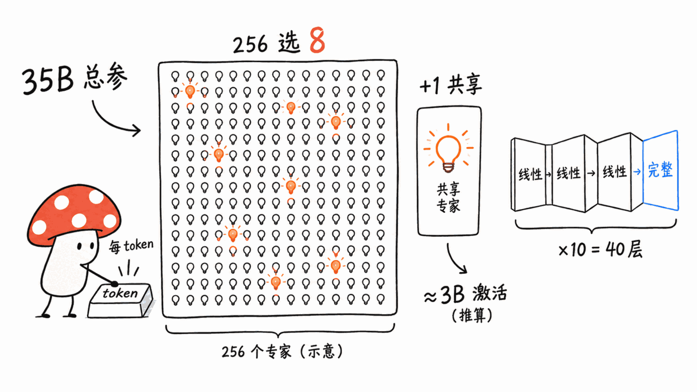
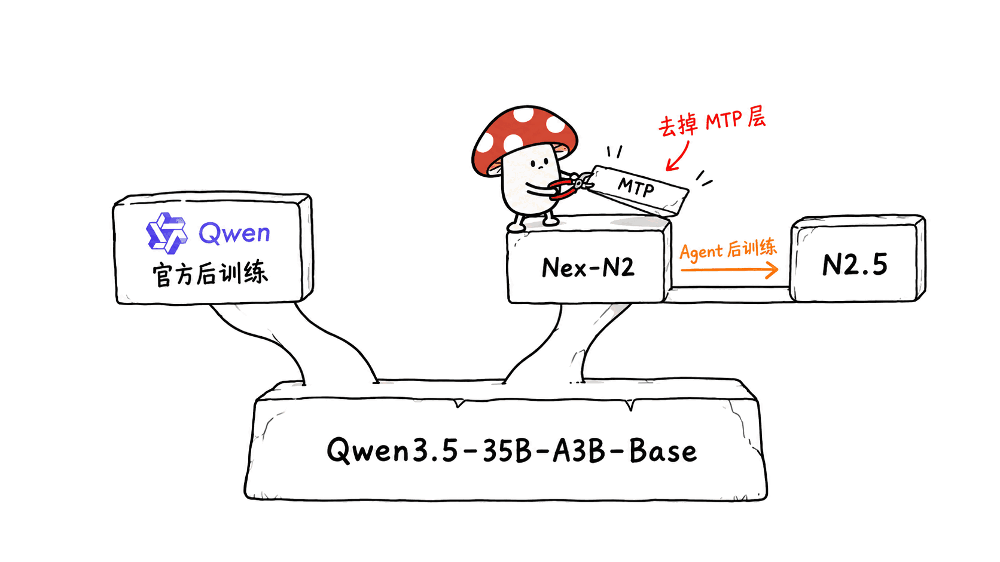
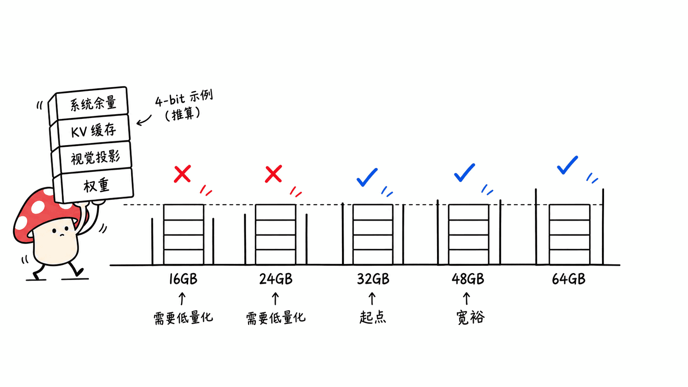
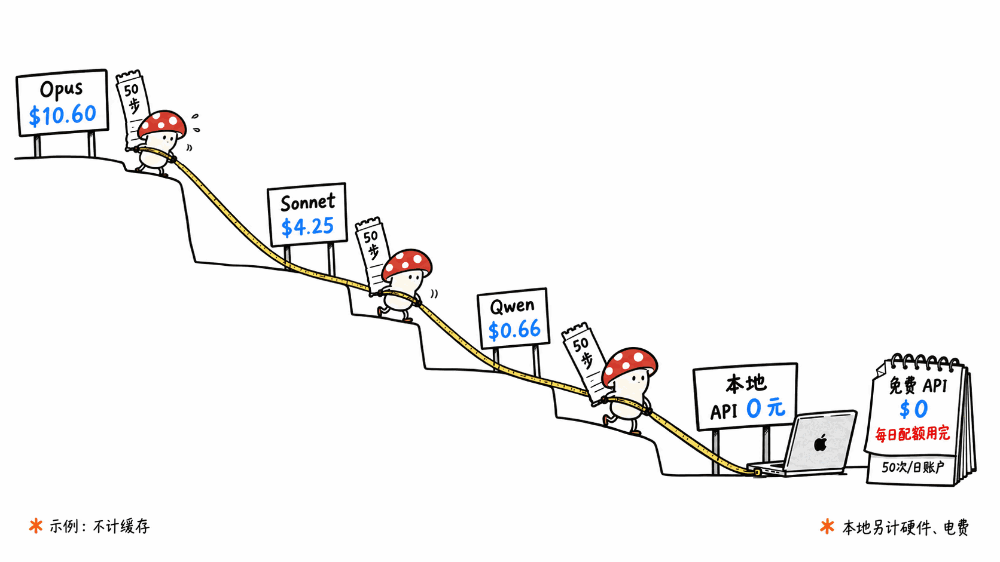
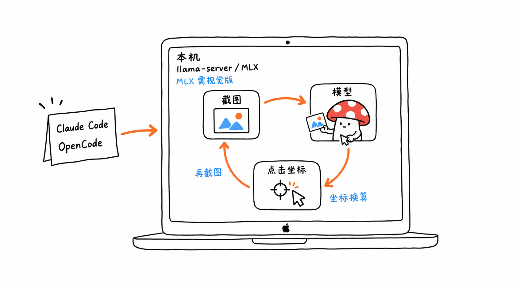

> 📌 模型：nex-agi/Nex-N2.5-mini（Apache-2.0，2026-09-08 发布）
> HuggingFace：https://huggingface.co/nex-agi/Nex-N2.5-mini
> GitHub：https://github.com/nex-agi/Nex-N2.5
> 截至 9 月 11 日：HF 点赞 656，同名衍生仓库 31 个（MLX / GGUF / NVFP4 / FP8 / EXL3 等）

---

**BLUF**：Nex-N2.5-mini 是一个专门为 computer use、浏览器操作和长程 Agent 任务做后训练的 35.1B 总参 MoE 模型，我们按权重文件头逐张量统计，每个 token 实际参与计算的参数约 2.95B。它和 Qwen3.5-35B-A3B 是同一个底座、同一套架构，差别全在后训练：官方模型卡上 OSWorld-Verified 71.2（Qwen 自家版本是 54.5）、Terminal-Bench 2.1 为 73.4（Claude Opus 5 是 89.1）。在 Mac 上，按社区量化体积推算，**32GB 是能跑 4-bit 的起点，48GB 才算宽裕，16GB 基本别想**。如果只是想试，OpenRouter 目前把它挂成免费模型，但免费档每天最多 50 或 1000 次请求，一个几十步的 Agent 任务很快就用完了。

> 声明：本文作者手上是 16GB M4 Mac mini，跑不动这个模型。下文**没有任何实测速度或实测内存**，所有数字要么来自模型卡、量化仓库、HF / OpenRouter API，要么是按 config 公开推算，推算的地方都会写明。

---

## Nex-N2.5-mini 到底是什么？

Nex-AGI 这次发布的 Nex-N2.5 家族有三个尺寸：

- **mini**：35.1B，本文主角，已开源
- **Pro**：官方部署示例是单机 8×H100；HF 页面目前返回 401，还没公开权重，OpenRouter 上有免费版
- **Max**：HF API 显示约 1.6 万亿参数，架构标记为 deepseek_v4，纯文本，官方称这是他们第一次在万亿规模上做完整后训练

模型卡对 mini 和 Pro 的定位是「延续 Nex-N2 的多模态底子，重点加强 computer use、网页浏览和视觉定位类 Agent 能力」。它的核心说法是：视觉不再只是输入模态，而是 Agent 感知环境、检查结果、推进任务的接口——模型操作电脑和浏览器，看截图判断自己做对没有，再决定下一步。

几个开发者关心的细节（都来自模型卡）：

- `reasoning_effort` 三档：`none` 不思考、`medium`（默认）自适应、`high` 总是思考
- 工具调用走 Qwen3-Coder 风格的 XML 格式，sglang 启动参数 `--tool-call-parser qwen3_coder`
- 推荐采样 temperature 0.7 / top_p 0.95 / top_k 40
- 官方部署用自家定制的 sglang 分支，Docker 镜像 `nexagi/sglang:v0.5.18-nex-patch`，mini 的示例是 2×H100 张量并行

一个小瑕疵：GitHub 仓库 nex-agi/Nex-N2.5 目前只有 README 和图片，**没有 LICENSE 文件**（GitHub API 的 license 字段为空）。Apache-2.0 这个协议声明在 HF 模型卡的元数据里。商用前建议以 HF 和 ModelScope 上的声明为准，并留意官方后续是否补上。

## 35B 总参，为什么说只有约 3B 在干活？




`config.json` 给出的结构：40 层，hidden 2048，256 个路由专家、每 token 选 8 个，外加 1 个共享专家，专家中间维度 512，原生上下文 262,144。

官方模型卡没有写激活参数量，所以我们做了一件笨事：用 HTTP Range 请求把 16 个 safetensors 分片的文件头读下来（只读头，不下载权重），逐张量统计参数量。结果：

| 组成 | 参数量 | 每 token 是否全部参与 |
|---|---|---|
| 路由专家（40 层 × 256 个） | 32.21B | 否，只用 8/256 ≈ 1.01B |
| 共享专家 | 0.13B | 是 |
| 注意力 / 线性注意力 / 路由器 / norm | 1.31B | 是 |
| 输出层 lm_head | 0.51B | 是 |
| 词嵌入 embed_tokens | 0.51B | 查表，不算矩阵乘 |
| 视觉编码器 | 0.45B | 只在处理图片时用 |
| **合计** | **35.107B**（与 HF API 显示的 35,107,181,936 一致） | |

所以每生成一个文本 token，真正做矩阵乘的参数约 1.01 + 0.13 + 1.31 + 0.51 ≈ **2.95B**（推算）。这和 Qwen 官方对同架构 Qwen3.5-35B-A3B 的「35B 总参、3B 激活」说法吻合。

这个数字对本地部署意味着两件事：

1. **内存门槛看总参**。MoE 的 256 个专家不管用不用都得装进内存，4-bit 量化后仍然要 19-21GB。
2. **速度看激活参数**。解码阶段每个 token 大约只读 3B 参数对应的权重（4-bit 下约 1.6GB，推算），所以一旦装得下，它在 Mac 统一内存上的速度会比同体积的稠密模型好得多。

还有一点对长上下文很友好：40 层里只有 10 层是标准注意力，另外 30 层是线性注意力（Gated DeltaNet）。按 config 算，fp16 KV 缓存每个 token 只占约 20KB（10 层 × K/V × 2 个 KV 头 × 256 维 × 2 字节），128K 上下文约 2.7GB，拉满 262K 也只要约 5.4GB；30 层线性注意力的状态是固定大小，每个会话约 63MB。这是推算值，实际还要加上推理框架的计算缓冲。

## 同一个底座，Nex 的后训练多换来了什么？




先把底座这件事说清楚。上一代 Nex-N2 的模型卡原文写的是：Nex-N2-mini「built on Qwen3.5-35B-A3B-Base」。N2.5 的模型卡说 mini 和 Pro「continue to build on the multimodal foundations of Nex-N2」。我们对比了两个仓库的 config，Nex-N2.5-mini 和 Qwen3.5-35B-A3B 的层数、专家数、维度、词表、上下文长度、视觉塔深度完全一致。

所以严格地说，**它和 Qwen 官方的 Qwen3.5-35B-A3B 是同一个 Base 出发、走了两条不同后训练路线的兄弟**，而不是在 Qwen 聊天版上再微调。至于 N2.5-mini 是从 N2-mini 的检查点继续训，还是从 Base 重新训，模型卡没写。

参数量差了 0.84B（Qwen 35.95B vs Nex 35.11B），原因我们查到了：Qwen 的权重里有 785 个 `mtp.*` 张量（多 token 预测层），Nex 发布的权重里一个都没有，尽管 config 里仍声明了 `mtp_num_hidden_layers: 1`。社区量化者 Vontra 在自己的 MLX 仓库里也注意到这点并提醒「保持 MTP 关闭」。实际影响是：**没法用 MTP 做投机解码加速**。本站两天前写过同类技术的收益——《同一个 27B，换条路跑：HauhauCS 的 GGUF 版用 FastMTP 投机解码把生成速度拉到 3 倍》https://blog.mushroom.cv/blog/hauhaucs-qwen3-8-27b-gguf-fastmtp-speculative-decoding-kp-quant/ ——Nex 这版暂时拿不到这类加速。

再看分数。下面三列都来自各自的官方模型卡，**测评框架和基准版本不完全相同，不能当作严格的同条件对比**：

| 基准 | Qwen3.5-35B-A3B | Nex-N2-mini | Nex-N2.5-mini |
|---|---|---|---|
| OSWorld-Verified | 54.5 | — | 71.2 |
| BrowseComp | 61.0 | 74.1 | 83.4 |
| Terminal-Bench | 40.5（2.0 版） | 60.7（2.1 版） | 73.4（2.1 版） |
| Toolathlon | — | 33.3 | 54.6（Verified 版） |
| SWE-Bench Pro | — | 50.2 | 43.8 |

几点独立判断：

- **computer use 是这次提升最大的方向**。OSWorld-Verified 从同底座 Qwen 的 54.5 到 71.2，差距明显。但 Nex 用的是自家 NexCUA 测评框架（模型卡说「即将开源」），坐标归一化到 0-1000，框架差异本身就可能贡献一部分分数。
- **BrowseComp 的 83.4 有前提**：模型卡注明 token 用量超过上下文 60% 时启用摘要压缩策略。你自己搭 Agent 不做上下文压缩，未必能复现。
- **SWE-Bench Pro 反而比上一代低**（50.2 → 43.8）。两张卡用的是同一个基准名，可能是评测框架或题集版本变了，也可能是真的有取舍。模型卡没解释，这里如实列出。
- **和闭源旗舰差距仍大**：同一张表里 Claude Opus 5 的 Terminal-Bench 2.1 是 89.1、SWE-Bench Pro 79.2、OSWorld-2 为 68.3，而 mini 分别是 73.4、43.8、30.5。

同底座做 Agent 后训练，本站之前还写过另一家：《Apodex 1.1 Mini 调研：训「持续干活的能力」，不是训「聊得更像」，35B 本地可跑》https://blog.mushroom.cv/blog/apodex-1-1-mini-working-capability-local-agent-guide/ 。两家都选了 Qwen3.5-35B-A3B 这个底座，说明「35B 总参、3B 激活」正在成为本地 Agent 模型的一个标准尺寸：大到能学会长程任务，小到一台高配 Mac 装得下。区别在方向，Apodex 押文件、搜索、代码环境里的持续执行，Nex 押视觉闭环的电脑和浏览器操作。

## Mac 要多大内存才跑得动？




先说计算方法（全部是推算）：

**所需统一内存 ≈ 权重文件 + 视觉投影（0.6-0.9GB，computer use 必须带）+ KV 缓存（每 1K token 约 20MB）+ 系统和其他应用的余量**

另外，macOS 默认不让 GPU 用满全部统一内存，社区常用的经验值是物理内存的约 65%-75%，可以用 `sudo sysctl iogpu.wired_limit_mb=<MB>` 上调（重启后失效）。

量化体积来自 HF API 和各量化仓库的文件列表（单位 GB，十进制）：

| 格式 | 代表文件 | 体积 | 含视觉？ |
|---|---|---|---|
| BF16 原版 | nex-agi/Nex-N2.5-mini | 70.21 | 是 |
| MLX 8-bit | abenzerps / Vontra | 36.83 / 37.72 | 否 / 是 |
| GGUF Q8_0 | abenzerps、mradermacher | 36.90 | 另配 mmproj |
| MLX 6-bit | abenzerps / Vontra | 28.17 / 29.06 | 否 / 是 |
| GGUF Q6_K | 同上 | 28.51 | 另配 mmproj |
| GGUF Q5_K_M | 同上 | 24.73 | 另配 mmproj |
| GGUF Q4_K_M | 同上 | 21.17 | 另配 mmproj |
| MLX 4-bit | abenzerps / Vontra | 19.51 / 20.40 | 否 / 是 |
| GGUF IQ3_XXS | 同上 | 13.62 | 另配 mmproj |
| GGUF IQ2_XXS | 同上 | 9.50 | 另配 mmproj |
| GGUF IQ1_S | 同上 | 7.48 | 另配 mmproj |

**一个容易踩的坑**：abenzerps 和 Kagandi 的 MLX 版本是纯文本的，仓库说明写明「不含视觉投影」，我们查了权重索引确认里面没有视觉张量。你要做 computer use（让模型看截图），得选 Vontra 的 MLX 版（索引里有视觉张量，走 mlx-vlm / oMLX），或者 GGUF + 单独的 mmproj 文件。

按上面的公式推出来的档位（推算，不是实测）：

| Mac 内存 | 能装下的量化 | 判断 |
|---|---|---|
| 16GB | 只有 IQ1 / IQ2 档（7.5-9.5GB） | 1-2 bit 下 Agent 能力大概率明显打折，不建议，直接用云端 |
| 24GB | IQ3_XXS（13.6GB）、Q3_K_S（15.2GB） | 能加载，上下文要压短，余量很紧 |
| 32GB | MLX 4-bit（19.5-20.4GB）、Q4_K_M（21.2GB） | **起点档**，需要上调 GPU 内存上限、少开其他应用 |
| 48GB | Q5_K_M（24.7GB）、6-bit（28-29GB） | **宽裕档**，128K 上下文（KV 约 2.7GB）也放得下 |
| 64GB | 8-bit（36.8-37.7GB） | 接近无损，262K 上下文（KV 约 5.4GB）也可以 |
| 96GB 以上 | BF16（70.2GB） | 原版精度 |

上下文预算也要算进去。模型的图片处理配置（patch 16、合并 2×2）意味着每个 token 覆盖 32×32 像素，一张 1920×1080 截图约 2,025 个视觉 token（推算）。一个 50 步、每步一张截图的任务，如果历史截图全留在上下文里，光图片就是 10 万 token。在本地这不只是 KV 缓存的问题，更大的代价是 prefill：每张新截图约 2K token 都要现算，而一旦 Agent 框架改写了历史（比如删掉旧截图），推理服务的前缀缓存就会失效，整段上下文要重算。所以在 Mac 上跑 computer use，截图降分辨率、控制历史截图数量，比换更大内存更有用。

有个参考点：量化者 karmx 在一张 16GB 显存的 RTX 5060 Ti 上用 13.3GB 的 Q2/Q3 混合量化 + 视觉投影跑起了 131K 上下文，并通过了基础的文本、工具调用和单图 OCR 检查。但那是独立显存，Mac 的 16GB 统一内存还要分给系统，不能直接类比。另外，我们看过的几个量化仓库（abenzerps、Vontra、karmx、MrFuzzihead）要么只做了基础冒烟测试，要么直接引用官方分数，**没有一家发布完整的 Agent 基准复测**。量化后 Agent 能力掉多少，目前我们没找到公开数据。

## 本地跑比云端省多少钱？




云端价格来自 OpenRouter 模型 API（9 月 11 日查询，美元 / 百万 token）：

| 模型 | 输入 | 输出 |
|---|---|---|
| Nex-N2.5-mini（:free，Nex AGI 自己托管，BF16） | 0 | 0 |
| Qwen3.5-35B-A3B | 0.3125 | 1.25 |
| Claude Sonnet 5 | 2 | 10 |
| GPT-5.6 Sol | 2 | 10 |
| Claude Opus 5 | 5 | 25 |

注意：OpenRouter 上 Nex-N2.5-mini 的付费版页面目前**没有任何服务商**，只有免费版可用。免费模型的限流按 OpenRouter 文档：每分钟 20 次；累计充值不足 10 美元的账户每天 50 次，充过 10 美元的每天 1000 次。

拿一个假设的 computer use 任务算账（假设条件：50 步，每步平均输入 4 万 token，含历史截图，上下文越滚越长；每步输出 500 token；不计缓存）：

- 总量：输入 200 万 token，输出 2.5 万 token
- Claude Opus 5：约 10.6 美元
- Claude Sonnet 5：约 4.25 美元
- Qwen3.5-35B-A3B（同底座，非 Agent 专训）：约 0.66 美元
- Nex-N2.5-mini 免费版：0 美元，但 50 步就是 50 次请求，**正好是低额度账户一整天的配额**

两点说明：一是闭源模型开启 prompt 缓存后输入成本会大幅下降（Opus 5 缓存读取是 0.5 美元 / 百万），上面是没缓存的上限；二是本地部署的边际成本基本就是电费，但你要先有一台 32-64GB 内存的 Mac，还得接受比云端 H100 慢得多的 prefill。

我们的判断：**本地 Nex-N2.5-mini 替代的不是 Opus 5，而是「不值得花 Opus 的钱、但数据不能出本机」的那类任务**。比如在内网系统里点表单、批量整理本地文件、反复跑的浏览器测试。真正难的长程任务，分数差距（OSWorld-2 上 30.5 对 68.3）摆在那里，省下的钱可能不够付返工的时间。

## 怎么接进 Claude Code / OpenCode？




目前本地最现实的两条路是 llama.cpp 和 MLX，官方的 sglang 分支面向 NVIDIA GPU。

**llama.cpp（GGUF）**：`llama-server` 同时提供 OpenAI 兼容的 `/v1/chat/completions` 和 Anthropic 兼容的 `/v1/messages`。llama.cpp 服务端文档写明工具调用需要加 `--jinja`，GGUF 里已经内嵌了官方聊天模板。示意：

```bash
llama-server -m Nex-N2.5-mini-Q4_K_M.gguf \
  --mmproj mmproj-Nex-N2.5-mini-F16.gguf \
  --jinja -c 65536 -ngl 99 \
  --temp 0.7 --top-p 0.95 --top-k 40 \
  --host 127.0.0.1 --port 8080
```

**接 Claude Code**：Claude Code 走 Anthropic Messages 协议，把 `ANTHROPIC_BASE_URL` 指向 `http://127.0.0.1:8080`，再用 `ANTHROPIC_MODEL` 指定模型名即可。注意 Claude Code 的系统提示加工具定义本身就要占掉几万 token，上下文别开太小，而且每轮对话在本地的 prefill 等待会很明显。

**接 OpenCode**：在 `opencode.json` 里加一个 OpenAI 兼容的自定义 provider，baseURL 填 `http://127.0.0.1:8080/v1` 即可。

**MLX 路线**：纯文本编码可以用 `mlx_lm.server`（abenzerps 仓库给的是 mlx-lm 用法）；要看截图就得用带视觉张量的 Vontra 版本，配合 mlx-vlm 或 oMLX（Vontra 在 256GB 内存的 Mac Studio 上用 oMLX 0.6.4 做过基础检查）。

三个实操提醒：

1. `reasoning_effort` 是写在聊天模板里的参数，你的推理服务得能把它传进模板，否则只能用默认的自适应思考。
2. 官方的 computer use 分数来自 NexCUA 框架，模型输出的坐标归一化到 0-1000。自己接 Agent 框架时要把这个坐标换算到真实屏幕分辨率，否则会点歪。
3. Vontra 实测发现 2-bit 档用贪心解码会陷入重复循环，务必按官方推荐的采样参数跑。

如果你还没有现成的 computer use 测试环境，本站写过一套不需要 KVM、用 Docker 跑 OSWorld 的方案：《CUA-Lite：UC Berkeley + Microsoft 开源计算机操控 Agent 基础设施，无需 KVM，Docker 直跑 OSWorld，4.6× 并行》https://blog.mushroom.cv/blog/cua-lite-kvm-free-osworld-docker-computer-use-agent-berkeley-microsoft/ ，可以拿来给量化版做自己的复测。

## 常见问题 / FAQ

**Q：Nex-N2.5-mini 的激活参数是多少？**
A：官方模型卡没写。我们逐张量统计权重文件头：路由专家 32.21B 里每 token 只用 8/256，加上共享专家、注意力层和输出层，约 2.95B 参与计算，与同架构 Qwen3.5-35B-A3B 官方的「3B 激活」一致。

**Q：它是基于 Qwen 的吗？**
A：是。上一代 Nex-N2-mini 模型卡写明基于 Qwen3.5-35B-A3B-Base，N2.5 模型卡说延续 N2 的多模态底子，config 与 Qwen3.5-35B-A3B 完全一致。不同的是 Nex 发布的权重去掉了 MTP 层。

**Q：16GB 的 Mac 能跑吗？**
A：只能装下 1-2 bit 的极限量化（7.5-9.5GB），Agent 能力大概率严重打折。建议 32GB 起步跑 4-bit，48GB 更宽裕。16GB 用户直接用 OpenRouter 免费版更实际。

**Q：做 computer use 该下哪个量化？**
A：必须带视觉。GGUF 要同时下载 mmproj 文件；MLX 要选 Vontra 的版本，abenzerps 和 Kagandi 的 MLX 版是纯文本，没有视觉投影。

**Q：能商用吗？**
A：HF 和 ModelScope 标注 Apache-2.0，但 GitHub 仓库目前没有 LICENSE 文件。商用前以模型页声明为准，并留意官方后续更新。

---

**一手来源**

- 模型卡：https://huggingface.co/nex-agi/Nex-N2.5-mini
- config：https://huggingface.co/nex-agi/Nex-N2.5-mini/blob/main/config.json
- GitHub：https://github.com/nex-agi/Nex-N2.5
- 上一代 Nex-N2-mini（底座声明）：https://huggingface.co/nex-agi/Nex-N2-mini
- 同底座 Qwen3.5-35B-A3B：https://huggingface.co/Qwen/Qwen3.5-35B-A3B
- 量化：https://huggingface.co/abenzerps/Nex-N2.5-mini-GGUF 、https://huggingface.co/mradermacher/Nex-N2.5-mini-i1-GGUF 、https://huggingface.co/Vontra/Nex-N2.5-mini-MLX-oQ4 、https://huggingface.co/karmx/Nex-N2.5-mini-Mixed-Q2Q3-128K-GGUF
- OpenRouter 模型 API（价格与服务商）：https://openrouter.ai/api/v1/models/nex-agi/nex-n2.5-mini:free/endpoints ；免费模型限流：https://openrouter.ai/docs/api-reference/limits
- llama.cpp 服务端（Anthropic 兼容接口）：https://github.com/ggml-org/llama.cpp/blob/master/tools/server/README.md

---

> © 2026 Author: Mycelium Protocol. 本文采用 [CC BY 4.0](https://creativecommons.org/licenses/by/4.0/deed.zh) 授权——欢迎转载和引用，须注明作者姓名及原文链接，不得去除署名后以原创发布。

<!--EN-->

> 📌 Model: nex-agi/Nex-N2.5-mini (Apache-2.0, released 2026-09-08)
> HuggingFace: https://huggingface.co/nex-agi/Nex-N2.5-mini
> GitHub: https://github.com/nex-agi/Nex-N2.5
> As of Sept 11: 656 likes on HF, 31 derivative repos (MLX / GGUF / NVFP4 / FP8 / EXL3 and more)

---

**BLUF**: Nex-N2.5-mini is a 35.1B-total MoE model post-trained specifically for computer use, browser control, and long-horizon agent tasks. Counting the weight tensors one by one, we find about 2.95B parameters do the compute for each token. It shares its base and architecture with Qwen3.5-35B-A3B, so the difference comes entirely from post-training. The official card reports 71.2 on OSWorld-Verified (Qwen's own release scores 54.5) and 73.4 on Terminal-Bench 2.1 (Claude Opus 5 scores 89.1). On a Mac, working from community quant sizes, **32GB is the entry point for 4-bit, 48GB is comfortable, and 16GB is effectively out**. To just try it, OpenRouter lists it as a free model, but the free tier caps you at 50 or 1,000 requests a day, and a multi-step agent task eats through that fast.

> Disclosure: the author's machine is a 16GB M4 Mac mini, which cannot run this model. This article contains **no measured speeds or measured memory usage**. Every number comes from the model card, the quant repos, or the HF / OpenRouter APIs, or is derived from the public config. Derived numbers are labeled as such.

---

## What exactly is Nex-N2.5-mini?

The Nex-N2.5 family comes in three sizes:

- **mini**: 35.1B, the subject here, open weights
- **Pro**: the official deployment example is a single 8×H100 node. The HF page currently returns 401, so weights are not public yet, but there is a free version on OpenRouter
- **Max**: about 1.6T parameters per the HF API, tagged deepseek_v4, text-only. Nex-AGI calls it their first complete post-training run at trillion-parameter scale

The card says mini and Pro "continue to build on the multimodal foundations of Nex-N2," with focused gains in computer use, web browsing, and visually grounded agent work. Its central claim is that vision is no longer only an input modality. It is the interface through which an agent perceives its environment, checks its results, and moves the task forward. The model operates a computer or browser, looks at screenshots to see whether it got things right, and then decides the next step.

Developer-relevant details from the card:

- `reasoning_effort` has three settings: `none` (no thinking), `medium` (default, adaptive), and `high` (always thinks)
- Tool calls use Qwen3-Coder-style XML, parsed in sglang with `--tool-call-parser qwen3_coder`
- Recommended sampling: temperature 0.7 / top_p 0.95 / top_k 40
- Official serving uses a custom sglang fork, Docker image `nexagi/sglang:v0.5.18-nex-patch`. The mini example uses 2×H100 tensor parallelism

One wrinkle: the GitHub repo nex-agi/Nex-N2.5 currently contains only a README and figures, **with no LICENSE file** (the GitHub API license field is null). The Apache-2.0 declaration lives in the HF model card metadata. For commercial use, rely on the HF and ModelScope declarations and watch for an official update.

## 35B total, so why only ~3B doing the work?


`config.json` specifies 40 layers, hidden size 2048, and 256 routed experts with 8 selected per token, plus 1 shared expert. Expert intermediate size is 512, and native context is 262,144 tokens.

The official card does not state an active-parameter count, so we did it the tedious way. Using HTTP Range requests, we read the headers of all 16 safetensors shards (headers only, no weights downloaded) and counted parameters per tensor:

| Component | Parameters | All used per token? |
|---|---|---|
| Routed experts (40 layers × 256) | 32.21B | No, only 8/256 ≈ 1.01B |
| Shared expert | 0.13B | Yes |
| Attention / linear attention / router / norms | 1.31B | Yes |
| Output head (lm_head) | 0.51B | Yes |
| Token embedding | 0.51B | Lookup only, no matmul |
| Vision encoder | 0.45B | Only when processing images |
| **Total** | **35.107B** (matches HF API's 35,107,181,936) | |

So for each generated text token, about 1.01 + 0.13 + 1.31 + 0.51 ≈ **2.95B** parameters do the matrix multiplies (derived). That matches Qwen's official "35B total, 3B activated" for the same architecture in Qwen3.5-35B-A3B.

Two consequences for local deployment:

1. **Total parameters set the memory floor.** All 256 experts must sit in memory whether they fire or not, so even 4-bit needs 19-21GB.
2. **Active parameters set the speed.** Each decoded token reads only ~3B parameters' worth of weights, about 1.6GB at 4-bit (derived). Once the model fits, it runs much faster on Mac unified memory than a dense model of the same file size.

It is also friendly to long context. Only 10 of the 40 layers use standard attention. The other 30 use linear attention (Gated DeltaNet). From the config, the fp16 KV cache costs about 20KB per token (10 layers × K/V × 2 KV heads × 256 dims × 2 bytes). That comes to about 2.7GB at 128K context and about 5.4GB at the full 262K. The linear-attention state is fixed-size, about 63MB per session. These are derived figures, and inference frameworks add compute buffers on top.

## Same base, so what did Nex's post-training buy?


First, the base. The previous Nex-N2 card states verbatim that Nex-N2-mini is "built on Qwen3.5-35B-A3B-Base". The N2.5 card says mini and Pro "continue to build on the multimodal foundations of Nex-N2". Diffing the configs, Nex-N2.5-mini and Qwen3.5-35B-A3B are identical in layer count, experts, dimensions, vocabulary, context length, and vision-tower depth.

Strictly speaking, **it is a sibling of Qwen's own Qwen3.5-35B-A3B: same Base, different post-training**, not a finetune on top of Qwen's chat release. The card does not say whether N2.5-mini continued from the N2-mini checkpoint or restarted from Base.

The 0.84B parameter gap (Qwen 35.95B vs Nex 35.11B) has a clear cause. Qwen's weights include 785 `mtp.*` tensors (the multi-token-prediction layer). Nex's release contains none, even though its config still declares `mtp_num_hidden_layers: 1`. Community quantizer Vontra noticed the same thing in their MLX repo and advises keeping MTP disabled. In practice, **you cannot use MTP for speculative decoding**. We covered what that kind of acceleration buys two days ago in "The Same 27B, a Different Road: HauhauCS's GGUF Release Uses FastMTP Speculative Decoding for Up to 3x Generation Speed" https://blog.mushroom.cv/blog/hauhaucs-qwen3-8-27b-gguf-fastmtp-speculative-decoding-kp-quant/. For now, Nex's release does not get that speedup.

Now the scores. Each column comes from its own official model card. **Harnesses and benchmark versions differ, so this is not a strict apples-to-apples comparison**:

| Benchmark | Qwen3.5-35B-A3B | Nex-N2-mini | Nex-N2.5-mini |
|---|---|---|---|
| OSWorld-Verified | 54.5 | — | 71.2 |
| BrowseComp | 61.0 | 74.1 | 83.4 |
| Terminal-Bench | 40.5 (v2.0) | 60.7 (v2.1) | 73.4 (v2.1) |
| Toolathlon | — | 33.3 | 54.6 (Verified) |
| SWE-Bench Pro | — | 50.2 | 43.8 |

Our read:

- **Computer use is where post-training moved the most.** OSWorld-Verified goes from 54.5 for same-base Qwen to 71.2. But Nex uses its own NexCUA harness (the card says it will be open-sourced soon) with coordinates normalized to 0-1000, and the harness difference alone could account for part of the gap.
- **The 83.4 BrowseComp comes with a condition.** The card notes a summary context-compaction strategy kicks in once token usage passes 60% of the context window. If your own agent does not compact context, you may not reproduce it.
- **SWE-Bench Pro went down from the previous generation** (50.2 → 43.8). Both cards use the same benchmark name, so either the harness or task set changed, or this is a real trade-off. The card does not explain it, and we report it as-is.
- **The gap to closed flagships is still large.** In the same table, Claude Opus 5 scores 89.1 on Terminal-Bench 2.1, 79.2 on SWE-Bench Pro, and 68.3 on OSWorld-2. mini scores 73.4, 43.8, and 30.5.

We have covered another agentic post-train on the same base: "Apodex 1.1 Mini: Training 'Working Capability,' Not Chattiness — a 35B Model You Can Run Locally" https://blog.mushroom.cv/blog/apodex-1-1-mini-working-capability-local-agent-guide/. Both teams picked Qwen3.5-35B-A3B, which suggests "35B total, 3B active" is becoming a standard size for local agent models: big enough to learn long-horizon tasks, small enough to fit on a well-specced Mac. The difference is focus. Apodex bets on sustained execution in file, search, and code environments. Nex bets on vision-in-the-loop computer and browser control.

## How much Mac memory do you actually need?


The formula first (all derived):

**Required unified memory ≈ weight file + vision projector (0.6-0.9GB, required for computer use) + KV cache (~20MB per 1K tokens) + headroom for macOS and other apps**

macOS also does not let the GPU use all unified memory by default. The common community rule of thumb is about 65-75% of physical RAM. You can raise it with `sudo sysctl iogpu.wired_limit_mb=<MB>` (resets on reboot).

Quant sizes come from the HF API and each repo's file list (GB, decimal):

| Format | Repo | Size | Vision included? |
|---|---|---|---|
| BF16 original | nex-agi/Nex-N2.5-mini | 70.21 | Yes |
| MLX 8-bit | abenzerps / Vontra | 36.83 / 37.72 | No / Yes |
| GGUF Q8_0 | abenzerps, mradermacher | 36.90 | Separate mmproj |
| MLX 6-bit | abenzerps / Vontra | 28.17 / 29.06 | No / Yes |
| GGUF Q6_K | same | 28.51 | Separate mmproj |
| GGUF Q5_K_M | same | 24.73 | Separate mmproj |
| GGUF Q4_K_M | same | 21.17 | Separate mmproj |
| MLX 4-bit | abenzerps / Vontra | 19.51 / 20.40 | No / Yes |
| GGUF IQ3_XXS | same | 13.62 | Separate mmproj |
| GGUF IQ2_XXS | same | 9.50 | Separate mmproj |
| GGUF IQ1_S | same | 7.48 | Separate mmproj |

**An easy trap**: the abenzerps and Kagandi MLX builds are text-only. The repo README says the vision projector is not included, and we confirmed the weight index has no vision tensors. For computer use (letting the model see screenshots), pick Vontra's MLX build (its index includes vision tensors; use it via mlx-vlm / oMLX), or GGUF plus the separate mmproj file.

Tiers derived from the formula above (derived, not measured):

| Mac memory | What fits | Verdict |
|---|---|---|
| 16GB | Only IQ1 / IQ2 (7.5-9.5GB) | At 1-2 bits, agent ability very likely degrades badly. Not recommended; use the cloud |
| 24GB | IQ3_XXS (13.6GB), Q3_K_S (15.2GB) | Loads, but context must stay short and headroom is tight |
| 32GB | MLX 4-bit (19.5-20.4GB), Q4_K_M (21.2GB) | **Entry tier**. Raise the GPU memory limit and close other apps |
| 48GB | Q5_K_M (24.7GB), 6-bit (28-29GB) | **Comfortable tier**. Even 128K context (KV ~2.7GB) fits |
| 64GB | 8-bit (36.8-37.7GB) | Near-lossless, and full 262K context (KV ~5.4GB) works |
| 96GB+ | BF16 (70.2GB) | Original precision |

Budget for context too. The image-processor config (patch 16, 2×2 merge) means each token covers 32×32 pixels, so a 1920×1080 screenshot costs about 2,025 vision tokens (derived). If a 50-step task keeps every screenshot in context, that is 100K tokens of images alone. Locally the bigger cost is not KV memory but prefill: each new screenshot (~2K tokens) must be computed fresh, and as soon as the agent framework rewrites history (say, dropping old screenshots), the server's prefix cache is invalidated and the whole context gets recomputed. On a Mac, downscaling screenshots and capping how many stay in history will help computer use more than buying more RAM.

One reference point: quantizer karmx loaded a 13.3GB Q2/Q3 mixed quant plus the vision projector at 131K context on a 16GB RTX 5060 Ti, and it passed basic text, tool-calling, and single-image OCR checks. But that is dedicated VRAM. A 16GB Mac shares its memory with the OS, so the comparison does not carry over. Also, the quant repos we read (abenzerps, Vontra, karmx, MrFuzzihead) either ran only basic smoke tests or simply quote the official scores. **None has published a full agent-benchmark rerun**, and we found no public data yet on how much agent ability quantization costs.

## How much cheaper is local than cloud?


Cloud prices come from the OpenRouter models API (queried Sept 11, USD per million tokens):

| Model | Input | Output |
|---|---|---|
| Nex-N2.5-mini (:free, hosted by Nex AGI, BF16) | 0 | 0 |
| Qwen3.5-35B-A3B | 0.3125 | 1.25 |
| Claude Sonnet 5 | 2 | 10 |
| GPT-5.6 Sol | 2 | 10 |
| Claude Opus 5 | 5 | 25 |

Note: the paid Nex-N2.5-mini listing on OpenRouter currently has **no providers at all**; only the free variant works. Per OpenRouter's docs, free models are limited to 20 requests per minute. Accounts that have bought less than $10 in credits get 50 requests a day; accounts that have bought at least $10 get 1,000.

A hypothetical computer-use task (assumptions: 50 steps, 40K input tokens per step on average including screenshot history as context grows, 500 output tokens per step, no caching):

- Totals: 2M input tokens, 25K output tokens
- Claude Opus 5: about $10.60
- Claude Sonnet 5: about $4.25
- Qwen3.5-35B-A3B (same base, no agentic post-training): about $0.66
- Nex-N2.5-mini free: $0, but 50 steps means 50 requests, **exactly one full day's quota on a low-credit account**

Two caveats. With prompt caching, closed-model input costs drop sharply (Opus 5 cache reads are $0.50 per million), so the figures above are the uncached ceiling. And local marginal cost is basically electricity, but you first need a 32-64GB Mac and have to accept prefill far slower than a cloud H100.

Our read: **a local Nex-N2.5-mini doesn't replace Opus 5. It replaces the tasks that aren't worth Opus pricing but whose data can't leave the machine**, like clicking through forms in an intranet system, bulk-organizing local files, or repeated browser tests. For genuinely hard long-horizon tasks, the score gap (30.5 vs 68.3 on OSWorld-2) is real, and the money saved may not cover the time spent redoing work.

## How do you wire it into Claude Code or OpenCode?


The two realistic local paths today are llama.cpp and MLX. The official sglang fork targets NVIDIA GPUs.

**llama.cpp (GGUF)**: `llama-server` exposes both an OpenAI-compatible `/v1/chat/completions` and an Anthropic-compatible `/v1/messages`. Its server docs say tool use requires `--jinja`, and the GGUF already embeds the official chat template. Sketch:

```bash
llama-server -m Nex-N2.5-mini-Q4_K_M.gguf \
  --mmproj mmproj-Nex-N2.5-mini-F16.gguf \
  --jinja -c 65536 -ngl 99 \
  --temp 0.7 --top-p 0.95 --top-k 40 \
  --host 127.0.0.1 --port 8080
```

**Claude Code**: it speaks the Anthropic Messages protocol, so set `ANTHROPIC_BASE_URL` to `http://127.0.0.1:8080` and set the model name with `ANTHROPIC_MODEL`. Claude Code's system prompt plus tool definitions take tens of thousands of tokens on their own, so don't set the context too small, and expect a noticeable local prefill wait on every turn.

**OpenCode**: add a custom OpenAI-compatible provider in `opencode.json` with baseURL `http://127.0.0.1:8080/v1`.

**MLX**: for text-only coding, use `mlx_lm.server` (the abenzerps repo documents mlx-lm usage). To see screenshots you need Vontra's build with vision tensors, run via mlx-vlm or oMLX. Vontra ran basic checks with oMLX 0.6.4 on a 256GB Mac Studio.

Three practical notes:

1. `reasoning_effort` lives in the chat template. Your server has to pass it through to the template, or you are stuck with the default adaptive thinking.
2. The official computer-use scores come from the NexCUA harness, and the model emits coordinates normalized to 0-1000. Your own agent framework must convert them to real screen resolution, or clicks will land in the wrong place.
3. Vontra found that the 2-bit build falls into repetition loops under greedy decoding. Use the officially recommended sampling settings.

If you don't have a computer-use test environment yet, we covered a KVM-free way to run OSWorld in Docker: "CUA-Lite: UC Berkeley + Microsoft open-source computer-use agent infrastructure" https://blog.mushroom.cv/blog/cua-lite-kvm-free-osworld-docker-computer-use-agent-berkeley-microsoft/. You can use it to rerun the quantized builds yourself.

## FAQ

**Q: How many active parameters does Nex-N2.5-mini have?**
A: The official card doesn't say. Counting tensors from the weight-file headers: of the 32.21B in routed experts, each token uses only 8/256. Add the shared expert, attention layers, and output head, and about 2.95B take part in compute. That matches Qwen's official "3B activated" for the same architecture in Qwen3.5-35B-A3B.

**Q: Is it based on Qwen?**
A: Yes. The previous Nex-N2-mini card states it is built on Qwen3.5-35B-A3B-Base. The N2.5 card says it continues from N2's multimodal foundation, and its config is identical to Qwen3.5-35B-A3B. One difference: Nex's released weights drop the MTP layer.

**Q: Can a 16GB Mac run it?**
A: Only 1-2 bit extreme quants fit (7.5-9.5GB), and agent ability will very likely suffer badly. Start at 32GB for 4-bit; 48GB is comfortable. For 16GB users, the OpenRouter free tier is the practical option.

**Q: Which quant should I download for computer use?**
A: One with vision. For GGUF, also download the mmproj file. For MLX, use Vontra's builds. The abenzerps and Kagandi MLX builds are text-only, with no vision projector.

**Q: Can I use it commercially?**
A: HF and ModelScope list Apache-2.0, but the GitHub repo has no LICENSE file yet. Rely on the model-page declaration for commercial use and watch for official updates.

---

**Primary sources**

- Model card: https://huggingface.co/nex-agi/Nex-N2.5-mini
- config: https://huggingface.co/nex-agi/Nex-N2.5-mini/blob/main/config.json
- GitHub: https://github.com/nex-agi/Nex-N2.5
- Previous-gen Nex-N2-mini (base-model statement): https://huggingface.co/nex-agi/Nex-N2-mini
- Same-base Qwen3.5-35B-A3B: https://huggingface.co/Qwen/Qwen3.5-35B-A3B
- Quants: https://huggingface.co/abenzerps/Nex-N2.5-mini-GGUF , https://huggingface.co/mradermacher/Nex-N2.5-mini-i1-GGUF , https://huggingface.co/Vontra/Nex-N2.5-mini-MLX-oQ4 , https://huggingface.co/karmx/Nex-N2.5-mini-Mixed-Q2Q3-128K-GGUF
- OpenRouter models API (pricing and providers): https://openrouter.ai/api/v1/models/nex-agi/nex-n2.5-mini:free/endpoints ; free-model limits: https://openrouter.ai/docs/api-reference/limits
- llama.cpp server (Anthropic-compatible endpoint): https://github.com/ggml-org/llama.cpp/blob/master/tools/server/README.md

---

> © 2026 Author: Mycelium Protocol. Licensed under [CC BY 4.0](https://creativecommons.org/licenses/by/4.0/) — free to share and adapt with attribution. You must credit the author and link to the original; removing attribution and republishing as original is not permitted.
