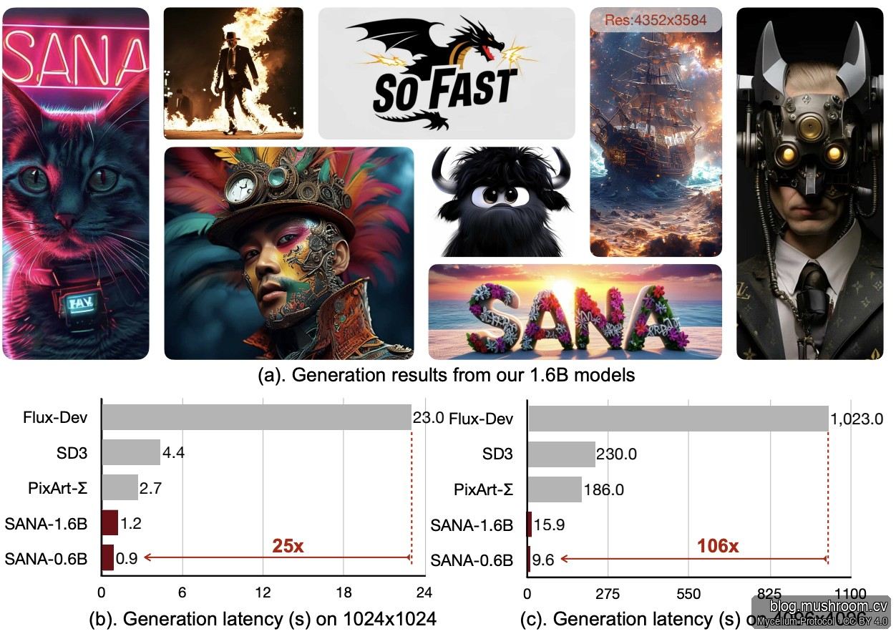

> **BLUF**：NVIDIA Sana 是目前开源图像生成领域性价比最高的模型之一——0.6B 参数、推理不到 1 秒、商业友好授权。但 Mac 用户注意：**官方尚无 MLX/Metal 支持，MPS 路径目前输出异常**，本文给出当前可行的替代方案。

---

## 🌐 核心开源资源

| 资源 | 链接 |
|---|---|
| GitHub 官方仓库 | [NVlabs/Sana](https://github.com/NVlabs/Sana) |
| HuggingFace 模型页 | [Efficient-Large-Model/Sana](https://huggingface.co/Efficient-Large-Model) |
| diffusers 集成文档 | [SanaPipeline API](https://huggingface.co/docs/diffusers/api/pipelines/sana) |
| 论文 | [arXiv 2410.10629](https://huggingface.co/papers/2410.10629) |

**模型家族一览**：SANA（图像）→ SANA-1.5 → SANA-Sprint（单步推理）→ SANA-Video → SANA-WM（720p 视频世界模型）→ Sol-RL



---

## 🛠️ 开发者集成指南：四大策略

### 1. 极致轻量化部署：突破硬件壁垒

预算有限或需要私有化部署时，直接选用 **Sana-0.6B + 4-bit 量化**：

- 显存占用可控制在 **4GB–8GB**
- 适合独立 App、高端 PC 客户端、私有化 SaaS
- 大幅削减云端 GPU 算力成本，真正"隐私无忧、自给自足"

### 2. 标准 Diffusers 管道：开箱即用

HuggingFace 官方已原生支持 `SanaPipeline`，几行代码完成集成：

```python
from diffusers import SanaPipeline
import torch

pipeline = SanaPipeline.from_pretrained(
    "Efficient-Large-Model/Sana-1.0B-dcae1024",
    torch_dtype=torch.bfloat16
)
pipeline.to("cuda")

image = pipeline(prompt="你的商业定制化提示词").images[0]
image.save("result.png")
```

适合电商海报生成、内容配图、快速原型验证。

### 3. 应对复杂场景：组合式工作流

Sana 在极复杂手部细节或极端艺术风格上稍逊于 SDXL，可通过工作流互补弥补：

- **基础生成 + Inpainting**：Sana 快速输出主图，ControlNet 定向修正问题区域
- **生成 + Upscale**：Sana 极速生成 1024×1024，再用 Latent Upsampler 放大至 4K

### 4. 商业化合规

Sana 采用 **NVIDIA Open Model License**，支持修改、定制分发、全管道商业嵌入，无版权纠纷顾虑。结合其低功耗、高并发表现，是中小型 SaaS 产品的诚意之选。

---

## 🍎 Mac M3 Max 64GB 本地部署：现状与可行路径

这是当前最多开发者询问的问题，实话实说：

### 当前官方支持状态

| 加速方式 | 状态 |
|---|---|
| CUDA（NVIDIA GPU） | ✅ 官方支持，完整优化 |
| MLX（Apple Silicon 原生） | ❌ 尚无官方或社区移植 |
| MPS（Metal Performance Shaders） | ⚠️ 可加载，但输出灰色/损坏图像 |
| CPU 推理 | ✅ 可运行，极慢（分钟级） |

**调研发现**：GitHub Issue #297 中有 M3 MacBook Pro 用户成功加载并执行 `pipe.to('mps')`，代码无报错，但输出全灰——这是 diffusers MPS 路径普遍存在的数值不稳定问题（NaN 溢出），并非 Sana 特有。

### 为什么 MLX 移植不简单？

Sana 的核心创新依赖 **DC-AE（32× 深层压缩自编码器）** 和 **Linear DiT（线性注意力机制）**，均为 PyTorch CUDA 内核深度优化，直接移植到 MLX 需要：

1. 替换所有 CUDA 算子为 MLX 等价实现
2. 重写 DC-AE 的自定义编解码层
3. 验证 bfloat16 精度一致性

这是有意义但需要一定工程量的工作，目前社区尚未启动。

### M3 Max 64GB：当前实际可行路径

**路径 A（推荐）：云端推理 + 本地调用**

在 Replicate / Modal / RunPod 上跑 Sana，本地 Mac 通过 API 调用：

```python
import replicate
output = replicate.run(
    "nvidia/sana",
    input={"prompt": "your prompt", "width": 1024, "height": 1024}
)
```

延迟约 2–5 秒，成本极低（约 $0.003/张），Mac 只做 UI 和逻辑。

**路径 B：ComfyUI + Sana（MPS 更稳定）**

ComfyUI 对 MPS 的适配优于原生 diffusers，部分用户在 M 系列芯片上有可用结果：

```bash
# 安装 ComfyUI，下载 Sana 模型权重
# 使用 ComfyUI-Manager 安装 Sana 节点
# 启动时指定 --force-fp32 降低 MPS 数值问题概率
python main.py --force-fp32
```

**路径 C（过渡期最优）：FLUX.1 on MLX**

如果核心需求是「Mac 本地高质量图像生成」，**FLUX.1** 是当前最成熟的 MLX 方案：

```bash
pip install mlx-flux
python -m mlx_flux.generate --prompt "your prompt" --model flux-schnell
```

M3 Max 64GB 上生成 1024×1024 约 **15–30 秒**，输出质量与 Sana 相当，无数值问题。

### 等待 MLX 移植的时间线

Sana 凭借其极小参数量（0.6B），理论上是最适合 MLX 移植的扩散模型之一——64GB 统一内存完全够用，瓶颈只在算子实现。预计社区在 6–12 个月内会有可用的 MLX 版本出现。**可关注 [ml-explore/mlx-examples](https://github.com/ml-explore/mlx-examples) 仓库的新增模型**。

### 小结：M3 Max 用户建议

| 需求 | 推荐方案 |
|---|---|
| 快速出图、不在意延迟 | Replicate API（路径 A）|
| 本地隐私、可接受等待 | ComfyUI + Sana MPS（路径 B，实验性）|
| 本地稳定生产可用 | FLUX.1 on MLX（路径 C）|
| 等待最佳方案 | 关注 Sana MLX 移植进展 |

---

> © 2026 Author: Mycelium Protocol. 本文采用 [CC BY 4.0](https://creativecommons.org/licenses/by/4.0/deed.zh) 授权——欢迎转载和引用，须注明作者姓名及原文链接，不得去除署名后以原创发布。

<!--EN-->

> **BLUF**: NVIDIA Sana is among the best open-source image generation models by performance-per-dollar — 0.6B parameters, sub-1-second inference, and commercial-friendly licensing. Mac users take note: **there is no official MLX/Metal support yet, and the MPS path currently produces corrupted output**. This article covers the current viable alternatives.

---

## 🌐 Core Resources

| Resource | Link |
|---|---|
| GitHub | [NVlabs/Sana](https://github.com/NVlabs/Sana) |
| HuggingFace | [Efficient-Large-Model/Sana](https://huggingface.co/Efficient-Large-Model) |
| Diffusers API | [SanaPipeline](https://huggingface.co/docs/diffusers/api/pipelines/sana) |
| Paper | [arXiv 2410.10629](https://huggingface.co/papers/2410.10629) |

**Model family**: SANA (image) → SANA-1.5 → SANA-Sprint (single-step) → SANA-Video → SANA-WM (720p video world model) → Sol-RL


---

## 🛠️ Developer Integration: Four Strategies

### 1. Ultra-lightweight Deployment: Breaking the Hardware Barrier

For budget-constrained or privacy-sensitive deployments, go with **Sana-0.6B + 4-bit quantization**:

- VRAM footprint: **4GB–8GB**
- Works for standalone apps, high-end PC clients, self-hosted SaaS
- Eliminates cloud GPU costs — true "privacy-first, self-sufficient" deployment

### 2. Standard Diffusers Pipeline: Zero-to-Running in Minutes

HuggingFace natively supports `SanaPipeline` — a few lines of Python is all it takes:

```python
from diffusers import SanaPipeline
import torch

pipeline = SanaPipeline.from_pretrained(
    "Efficient-Large-Model/Sana-1.0B-dcae1024",
    torch_dtype=torch.bfloat16
)
pipeline.to("cuda")

image = pipeline(prompt="your commercial prompt").images[0]
image.save("result.png")
```

Ideal for e-commerce banner generation, content illustration, and rapid prototyping.

### 3. Complex Scenarios: Composite Workflows

Sana trails SDXL on intricate hand details and extreme artistic styles. Compensate with workflow composition:

- **Generate + Inpaint**: Sana for the main composition, ControlNet for targeted corrections
- **Generate + Upscale**: Sana at 1024×1024, Latent Upsampler to 4K — speed without sacrificing detail

### 4. Commercial Compliance

Sana uses the **NVIDIA Open Model License** — modification, custom distribution, and full-pipeline commercial embedding are permitted. Combined with its low-power, high-throughput profile, it is a serious choice for SMB SaaS products building independent AI image features.

---

## 🍎 Mac M3 Max 64GB: Current Status and Viable Paths

The most-asked question. Straight talk:

### Official Support Matrix

| Acceleration | Status |
|---|---|
| CUDA (NVIDIA GPU) | ✅ Official, fully optimized |
| MLX (Apple Silicon native) | ❌ No official or community port yet |
| MPS (Metal Performance Shaders) | ⚠️ Loads, but outputs grey/corrupted images |
| CPU inference | ✅ Functional, extremely slow (minutes) |

**Research finding**: GitHub Issue #297 documents an M3 MacBook Pro user successfully loading `SanaPipeline` and calling `pipe.to('mps')` — no errors, but the output is entirely grey. This is a known numerical instability in diffusers' MPS path (NaN overflow), not unique to Sana.

### Why MLX Porting Isn't Trivial

Sana's core innovations — the **DC-AE (32× deep compression autoencoder)** and **Linear DiT (linear attention)** — are deeply optimized CUDA kernels. Porting to MLX requires:

1. Replacing all CUDA ops with MLX-equivalent implementations
2. Rewriting DC-AE's custom encoder/decoder layers
3. Validating bfloat16 numerical consistency end-to-end

Meaningful but non-trivial engineering work — no community effort has started yet.

### Three Practical Paths for M3 Max 64GB

**Path A (Recommended): Cloud Inference + Local API Call**

Run Sana on Replicate / Modal / RunPod, call from Mac:

```python
import replicate
output = replicate.run(
    "nvidia/sana",
    input={"prompt": "your prompt", "width": 1024, "height": 1024}
)
```

Latency: ~2–5 seconds. Cost: ~$0.003/image. Mac handles UI and business logic only.

**Path B: ComfyUI + Sana (better MPS stability)**

ComfyUI's MPS handling is more mature than raw diffusers. Some Apple Silicon users report usable results:

```bash
# Install ComfyUI, download Sana weights via ComfyUI-Manager
python main.py --force-fp32   # reduces MPS NaN probability
```

**Path C (Best local option today): FLUX.1 on MLX**

If the core requirement is "high-quality local image generation on Mac," **FLUX.1** is the most production-ready MLX option right now:

```bash
pip install mlx-flux
python -m mlx_flux.generate --prompt "your prompt" --model flux-schnell
```

On M3 Max 64GB: ~15–30 seconds per 1024×1024 image, quality comparable to Sana, no numerical issues.

### When to Expect Sana MLX

At only 0.6B parameters, Sana is theoretically one of the easiest diffusion models to port to MLX — 64GB unified memory is more than sufficient, the bottleneck is operator implementation. Community availability is plausible within **6–12 months**. Watch [ml-explore/mlx-examples](https://github.com/ml-explore/mlx-examples) for new additions.

### Summary: Mac User Decision Matrix

| Need | Recommended Path |
|---|---|
| Fast iteration, latency acceptable | Replicate API (Path A) |
| Local privacy, willing to wait | ComfyUI + Sana MPS (Path B, experimental) |
| Stable local production use | FLUX.1 on MLX (Path C) |
| Best-of-both | Wait for Sana MLX community port |

---

> © 2026 Author: Mycelium Protocol. Licensed under [CC BY 4.0](https://creativecommons.org/licenses/by/4.0/) — free to share and adapt with attribution. You must credit the author and link to the original; removing attribution and republishing as original is not permitted.
