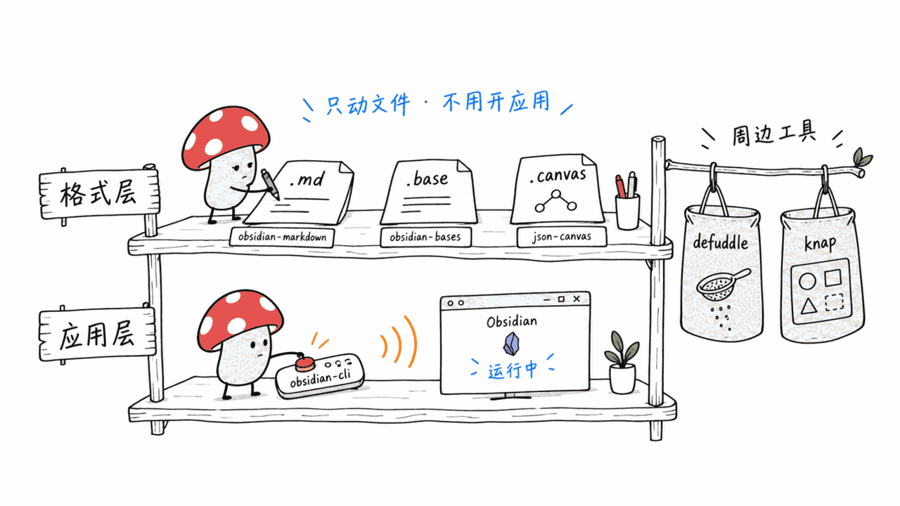
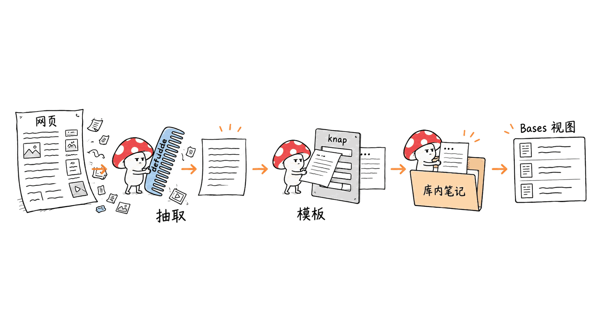
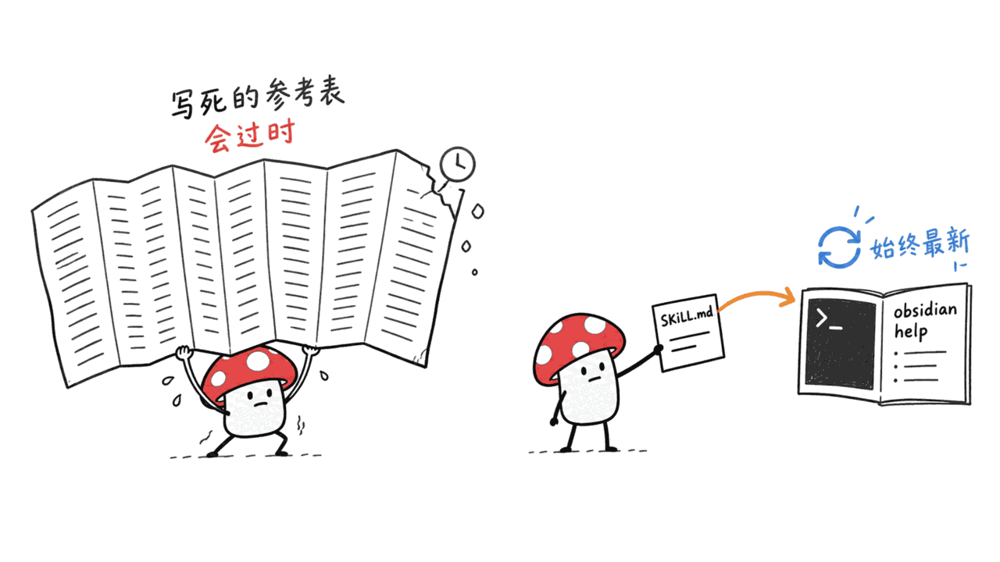
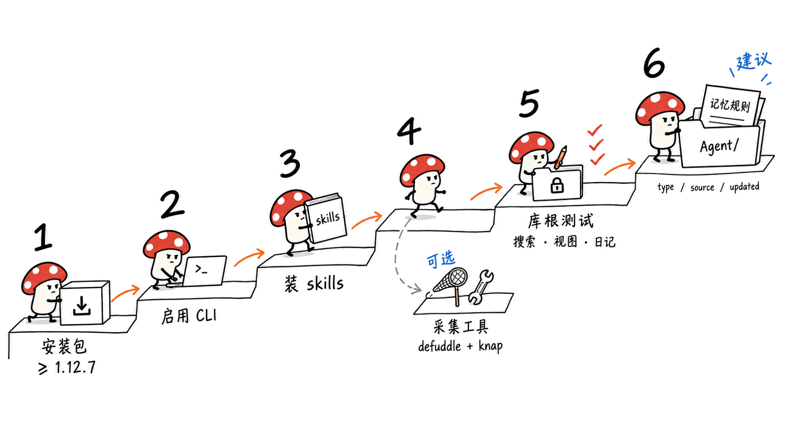
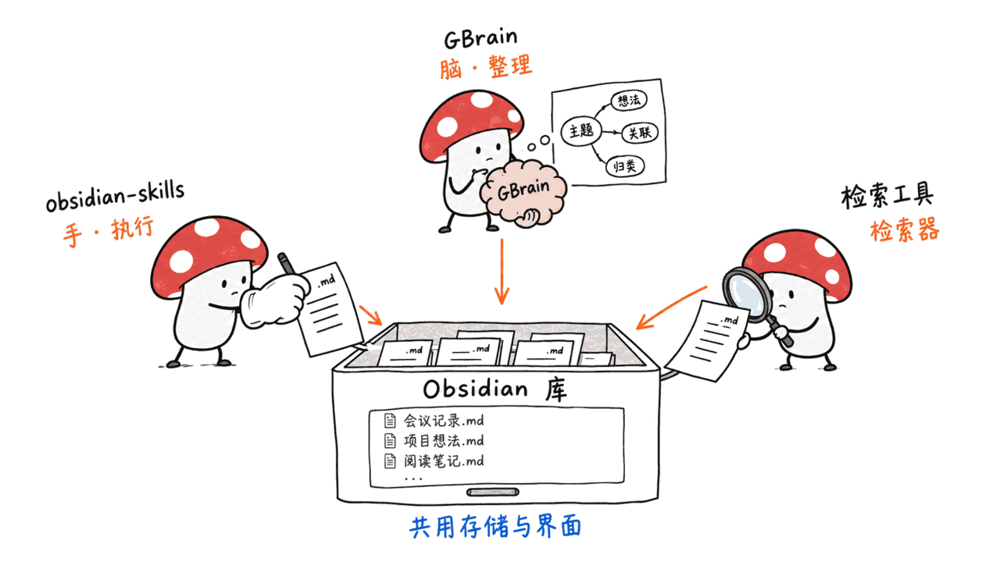

> 📌 开源仓库：kepano/obsidian-skills（MIT）
> GitHub：https://github.com/kepano/obsidian-skills
> Agent Skills 规范：https://agentskills.io/specification
> Obsidian CLI 文档：https://obsidian.md/help/cli

---

**先给结论**：kepano/obsidian-skills 不是又一个「Obsidian + AI」插件，而是 Obsidian CEO Steph Ango（kepano）亲手写给 Claude Code、Codex、OpenCode 的 6 个 Agent Skills。它的真正价值是把「本地 Markdown 知识库 + agent」这条路补成闭环：3 个 skill 教 agent 写对 Obsidian 的开放格式（Markdown 扩展、`.base`、`.canvas`），这部分**不需要 Obsidian 在运行**；1 个 skill 教 agent 通过官方 CLI 遥控正在运行的 Obsidian（搜索、反链、任务、日记、属性），这部分**需要 1.12.7 以上的安装包、且桌面端必须能启动**。截至 2026-09-11，仓库 48,137 星、3,435 fork、15 位贡献者；9 月 10 日刚新增了第 6 个 skill「Knap」，这是它重新回到榜单的直接原因。

适合谁：已经有 Obsidian 库、想让 agent 的记忆「人能直接打开看、能手改、不锁在数据库里」的人。不适合谁：纯服务器无桌面环境、或需要对几千篇中文笔记做语义检索的场景——这两件事它都不管。

---

## 这个仓库到底是什么？

仓库 2026-01-02 创建，最早只有 Bases 和 Obsidian Markdown 两个 skill，1 月 6 日加上 JSON Canvas。之后的时间线值得看：

| 日期 | 事件 |
|---|---|
| 2026-01-02 | 首批：`obsidian-bases`、`obsidian-markdown` |
| 2026-01-06 | 加 `json-canvas`，补 MIT 协议和 Claude Code 插件元数据 |
| 2026-01-11 | 社区 PR 对齐 Agent Skills 规范，兼容 Codex |
| 2026-02-10 | 加 `obsidian-cli` 和 `defuddle`——**与 Obsidian CLI 进入早期访问是同一天** |
| 2026-02-25 | 社区贡献者用 Tessl 评测工具重构 4 个 skill，把长参考表拆到 `references/` |
| 2026-02-27 | Obsidian 1.12 公开版发布，CLI 对所有用户开放 |
| 2026-09-10 | 加 `knap`：用官方新模板语言把 JSON/CSV 批量渲染成笔记 |

2 月 10 日那一条是整件事的关键：**厂商在发布 CLI 的当天，同步发布了教 agent 用这个 CLI 的 skill**。这是「官方厂商亲自写 skill」最有代表性的一次示范——工具和它的 agent 说明书一起出厂。

整个仓库只有 47 次提交、约 2,000 行文本，没有一行可执行代码。它全部的「能力」都是写给模型读的说明。

## 6 个 skill 分别教 agent 做什么？




按「需不需要 Obsidian 在运行」可以清楚地分成两层：

**格式层（离线可用，只动文件）**

1. **obsidian-markdown**（196 行）：教 agent 写 Obsidian 风味 Markdown——`[[wikilink]]`、`![[嵌入]]`、`> [!callout]`、frontmatter 属性、`^block-id`、`%%注释%%`、`==高亮==`。明确规定：库内链接用 wikilink（Obsidian 会自动追踪改名），外链才用标准 Markdown 链接。
2. **obsidian-bases**（499 行）：教 agent 写 `.base` 文件——Obsidian 的「数据库视图」，本质是一段 YAML：全局/视图级 filters、formulas 计算列、summaries 汇总、多种视图。所有数据仍然存在笔记的 frontmatter 里。
3. **json-canvas**（244 行）：教 agent 按 JSON Canvas 1.0 开放规范（2024-03-11 发布）写 `.canvas` 白板文件：4 种节点（text/file/link/group）、边、颜色、16 位十六进制 ID、布局间距建议。

**应用层（需要 Obsidian 桌面端）**

4. **obsidian-cli**（106 行）：教 agent 用 `obsidian` 命令遥控正在运行的 Obsidian：`read`、`create`、`append`、`search`、`backlinks`、`tasks`、`daily:append`、`property:set`，以及插件/主题开发的「reload → dev:errors → dev:screenshot → dev:console」调试循环。

**周边工具（不依赖 Obsidian，是 kepano/Obsidian 团队的其他开源项目）**

5. **defuddle**（41 行）：用 Defuddle CLI 把网页抽成干净 Markdown，替代 WebFetch 以省 token。
6. **knap**（102 行，9 月 10 日新增）：用 Knap 模板语言把结构化数据渲染成笔记，支持 `defuddle parse --md --json | knap render` 管道和 CSV 批量生成。Knap 是 Obsidian Web Clipper 和 Importer 共用的模板引擎，仓库 2026-08-21 才创建。

最后两个 skill 放在一起看就明白了：**defuddle 负责「采」，knap 负责「按模板落成笔记」，obsidian-markdown/bases 负责「落进库里的格式对不对」**。这是一条完整的「网页 → 结构化笔记 → 库内视图」的采集流水线，新增 Knap 就是把中间那一环补上了。




## 这些 skill 写得好在哪？（值得抄的 6 条写法）




我们自己维护着十几个 skill，读完这个仓库，以下几条是真正可以照搬的：

**1. 描述里写「何时用」，还写「何时别用」。** defuddle 的 description 末尾有一句：「URL 以 .md 结尾时不要用，直接 WebFetch」——这是 3 月一个社区 PR 加的。负向触发条件能直接减少误调用，这比多写十行正文都有用。

**2. 用文件扩展名当触发词。** 每个 description 都点名 `.md`、`.base`、`.canvas`。agent 看到文件后缀就能匹配到对应 skill，比抽象描述可靠得多。

**3. 会自带帮助的工具，skill 只当「指针」。** obsidian-cli 只列了十几个常用命令，然后说「运行 `obsidian help` 看全部命令，这永远是最新的」。knap 同理：`knap help filters`、`knap help tag for`。官方文档里 CLI 的命令分了 28 个类别，skill 却只有 106 行——**把会过时的东西交给工具自己的帮助系统**。

**4. 只教增量，不教模型已知的东西。** obsidian-markdown 开头就声明：标准 Markdown（标题、列表、表格）默认你会，这里只讲 Obsidian 扩展。2 月那次重构直接删掉了大量标准 Markdown 内容，这个 skill 的评测分从 71% 升到 94%。

**5. 把「厂商才知道的坑」写成 WRONG/CORRECT 对照。** Bases 里两个日期相减得到的是 Duration 类型，不能直接 `.round()`，要先取 `.days`；Canvas 的 JSON 字符串里要写 `\n`，写成 `\\n` 会在 Obsidian 里显示成字面的反斜杠和 n。这类坑模型靠通用知识猜不出来，只有格式作者清楚。

**6. 每个工作流以「验证」收尾。** Canvas 的 4 个工作流最后一步都是：解析 JSON、检查 ID 唯一、检查每条边的 fromNode/toNode 都指向真实节点。Bases 最后一步是在 Obsidian 里打开确认渲染。agent 写完就自检，而不是写完就交差。

还有一个细节：obsidian-bases 的 SKILL.md 正好 499 行，卡在 Agent Skills 规范「主文件建议 500 行以内」的线下，函数大全拆进了 `references/FUNCTIONS_REFERENCE.md` 按需加载——渐进式披露的教科书写法。

## 从安装到跑通：把 Obsidian 库接成 agent 的本地记忆层




下面是一条完整路径，前 5 步来自官方文档，第 6 步是我们的建议。

**第 1 步：确认 Obsidian 安装包版本 ≥ 1.12.7。** 注意是「安装包（installer）」版本，不是应用内更新后的版本号。老安装包即使应用内升级了也可能用不了 CLI，官方排障建议就是重新下载最新安装包。

**第 2 步：打开 CLI。** 设置 → 通用 → 打开「Command line interface」→ 按提示点 Register CLI。macOS 会在 `/usr/local/bin/obsidian` 建软链接（需要管理员权限），Linux 会复制到 `~/.local/bin/obsidian`，Windows 装的是 `Obsidian.com` 转发器，要重开终端。用 `obsidian help` 验证。

**第 3 步：装 skill（三选一）。**

```bash
# Claude Code 插件市场
/plugin marketplace add kepano/obsidian-skills
/plugin install obsidian@obsidian-skills

# 或 npx skills（跨 agent）
npx skills add https://github.com/kepano/obsidian-skills

# 或 Codex 手动：把 skills/ 目录复制到 ~/.codex/skills
```

手动装到 Claude Code 的话，README 的做法是把仓库内容放进**库根目录**的 `.claude` 文件夹——skill 跟着库走，而不是装成全局的。

**第 4 步（可选）：装采集工具。** `npm install -g defuddle knap`，Knap 需要 Node.js 20+。

**第 5 步：在库根目录启动 agent，跑三个冒烟测试。**

- 「在库里搜 Agent Skills，列出反链最多的 3 篇」→ 走 obsidian-cli 的 `search` + `backlinks`
- 「建一个 .base，列出所有 tag 为 paper、status 不是 done 的笔记，按修改时间倒序」→ 走 obsidian-bases
- 「把今天这次会话的结论追加到日记」→ 走 `daily:append`

**第 6 步（建议）：给记忆层立规矩。** skill 只教「怎么写对格式」，不规定「记忆放哪、长什么样」。建议在库根目录的 CLAUDE.md / AGENTS.md 里约定：agent 只写 `Agent/` 目录；每条记忆必须带 `type`、`source`、`updated` 三个属性；再建一个 `.base` 当看板，按 `updated` 倒序列出 agent 最近写的东西。这样人每天打开 Obsidian 就能审一遍 agent 的记忆——这正是 Markdown 记忆层相对数据库记忆层的最大优势：**可读、可改、可 diff、可 git**。

## 它和本站写过的本地知识库方案有什么边界？




这个问题最容易混。一句话：**obsidian-skills 是「手」，不是「脑」，也不是「检索器」**。

- **对比 GBrain**：GBrain 自带合成层、知识图谱和 PGLite/Postgres 存储，是一整套「脑」。obsidian-skills 没有自己的索引和存储，数据就是库里的 .md 文件，索引借用 Obsidian 本身。详见《GBrain：Y Combinator CEO 开源的个人 AI 大脑——25000 星知识图谱系统完整介绍》https://blog.mushroom.cv/blog/gbrain-personal-ai-knowledge-brain-guide/
- **对比 mdya、basic-memory 这类检索层**：Obsidian CLI 的 `search` 是 Obsidian 内置的全文搜索，不做向量语义检索。我们实测过本地 Markdown 检索在中文上的坑，结论是字面查询 BM25 就够、语义泛化才需要向量——所以笔记量上千、要「换个说法也能搜到」时，仍要叠一层检索器。详见《mdya 实测：871 篇中文笔记索引 8 分钟，但语义检索在中文上是失效的》https://blog.mushroom.cv/blog/mdya-rust-local-markdown-search-chinese-test-871-docs/
- **对比 Karpathy 的 LLM Wiki 构想**：LLM Wiki 讲的是「让 LLM 维护一个会进化的 wiki」的范式，obsidian-skills 恰好是这个范式最现成的执行层——agent 用 wikilink 编织笔记、用 Bases 建索引页、用 Canvas 画关系图。详见《LLM Wiki：Karpathy 提出的知识管理新范式》https://blog.mushroom.cv/blog/llm-wiki-karpathy-knowledge-management/

所以合理的组合是：Obsidian 库做存储和人机共用的界面，obsidian-skills 让 agent 写对格式、调得动应用，检索量上来之后再外挂一个语义检索层。

## 有哪些坑？（已从官方文档核实）

1. **CLI 不是无头工具。** 官方原话：CLI 需要 Obsidian 应用在运行，没运行时第一条命令会把它启动起来。也就是说它需要一个图形桌面会话——纯 Linux 服务器、没登录图形界面的机器用不了。官方另有一个 Obsidian Headless（`npm install -g obsidian-headless`，需 Node.js 22+，公开测试中），但它是**独立的同步客户端**，命令体系和 CLI 不同，不能替代 CLI。
2. **多库时默认打「最近聚焦的那个库」。** 无人值守跑 agent 时这很危险。在 CLAUDE.md 里要求每条命令都以 `vault="库名"` 开头。
3. **`obsidian eval` 能在应用上下文执行任意 JavaScript。** 这是插件开发用的，但对 agent 等于打开了整个库和全部插件 API。建议在 agent 的权限配置里单独拦住 `obsidian eval` 和 `dev:` 系列命令，只放行读写笔记的命令。
4. **Bases skill 已落后于 Obsidian。** 官方文档里 Bases 现在有 table、list、cards、Kanban、map 五种视图（map 需要 Maps 插件），而 skill 里只写了 table、cards、list、map，没有 Kanban。静态写死的知识会过时——这正好反证了上面第 3 条写法的价值。
5. **skill 没有声明环境要求。** 6 个 skill 的 frontmatter 都只有 name 和 description，没用规范里的 `compatibility` 字段写明「需 Obsidian 1.12.7+」「需 Node 20+」。环境不满足时 agent 只能在运行时报错才发现。
6. **转义字符是高频错误源。** CLI 多行内容用 `\n`/`\t`；Canvas JSON 里写 `\\n` 会显示成字面字符。早期还有一个 Claude Code 特有的坑：skill 文档里反引号包住的 `!` 会触发 bash 权限报错，1 月已被社区修掉。

## 为什么「厂商亲自写 skill」值得记住？

过去给 Obsidian 接 agent，常见路线是社区的 Local REST API 插件加一个 MCP server——能用，但每一层都是第三方在猜官方的格式和行为。obsidian-skills 把这层猜测去掉了：格式的作者直接告诉模型「Duration 不能 round」「wikilink 会随改名自动更新」。

更重要的是它的形态：**不是 MCP server，不是插件，只是 Markdown 说明书 + 官方 CLI**。没有常驻进程、没有端口、没有额外的鉴权面，换 agent 也不用重写。对任何有 CLI 或开放格式的软件厂商，这都是一个低成本的模板：发 CLI 的同一天，发一份教 agent 用它的 skill。

我们（Mycelium Protocol）自己的判断是：本地 Markdown 知识库这条线，接下来拼的不是谁的检索更花哨，而是**格式的主人愿不愿意亲自给 agent 写说明书**。Obsidian 是第一个把这件事做完整的笔记软件厂商。

## 常见问题 / FAQ

**Q: 用 obsidian-skills 必须开着 Obsidian 吗？**
A: 分情况。写 Markdown、.base、.canvas 的 3 个格式 skill 只操作文件，不需要 Obsidian 运行。obsidian-cli 需要 Obsidian 桌面端，没运行时第一条命令会自动启动它，所以需要图形桌面环境。

**Q: 对 Obsidian 版本有什么要求？**
A: CLI 需要 1.12.7 或以上的安装包（installer）。CLI 在 2026-02-27 的 1.12 公开版中对所有用户开放。若升级后仍用不了，官方建议重新下载最新安装包、重开设置里的 CLI 开关。

**Q: 它能替代 GBrain、basic-memory 这类记忆系统吗？**
A: 不能完全替代。它没有自己的索引和语义检索，搜索依赖 Obsidian 内置全文搜索。它适合做「存储 + 人可审阅的界面 + agent 写对格式」，大规模语义召回仍需外挂检索层。

**Q: Codex 和 OpenCode 能用吗？**
A: 能。skill 遵循 Agent Skills 开放规范。Codex 把 skills/ 复制到 ~/.codex/skills；OpenCode 要把整个仓库 clone 到 ~/.opencode/skills/obsidian-skills，不能只拷内层 skills/ 目录。

**Q: 9 月新增的 Knap skill 有什么用？**
A: Knap 是 Obsidian 的模板语言（Web Clipper 和 Importer 共用），skill 教 agent 用 Knap CLI 把 JSON/CSV 渲染成带 frontmatter 的笔记，还能和 defuddle 串成「网页 → 笔记」管道，批量导入资料很方便。

---

**一手源**

- obsidian-skills 仓库：https://github.com/kepano/obsidian-skills
- Agent Skills 规范：https://agentskills.io/specification
- Obsidian CLI 文档：https://obsidian.md/help/cli
- Obsidian Headless 文档：https://obsidian.md/help/headless
- Obsidian 1.12 更新日志：https://obsidian.md/changelog/2026-02-27-desktop-v1.12.4/
- Obsidian Bases 视图文档：https://obsidian.md/help/bases/views
- JSON Canvas 1.0 规范：https://jsoncanvas.org/spec/1.0/
- Knap 仓库：https://github.com/obsidianmd/knap
- Defuddle 仓库：https://github.com/kepano/defuddle

---

> © 2026 Author: Mycelium Protocol. 本文采用 [CC BY 4.0](https://creativecommons.org/licenses/by/4.0/deed.zh) 授权——欢迎转载和引用，须注明作者姓名及原文链接，不得去除署名后以原创发布。

<!--EN-->

> 📌 Repository: kepano/obsidian-skills (MIT)
> GitHub: https://github.com/kepano/obsidian-skills
> Agent Skills spec: https://agentskills.io/specification
> Obsidian CLI docs: https://obsidian.md/help/cli

---

**Bottom line**: kepano/obsidian-skills is not another "Obsidian + AI" plugin. It is a set of 6 Agent Skills written by Obsidian CEO Steph Ango (kepano) himself for Claude Code, Codex, and OpenCode. Its real value is closing the loop on "local Markdown knowledge base + agent": 3 skills teach the agent to write Obsidian's open formats correctly (Markdown extensions, `.base`, `.canvas`) — **no running Obsidian required**; 1 skill teaches the agent to remote-control a running Obsidian through the official CLI (search, backlinks, tasks, daily notes, properties) — **this needs the 1.12.7+ installer and a desktop app that can launch**. As of 2026-09-11 the repo has 48,137 stars, 3,435 forks, and 15 contributors; on September 10 it gained a sixth skill, "Knap", which is the direct reason it is back on the trending lists.

Who it is for: people who already keep an Obsidian vault and want agent memory that humans can open, read, and edit by hand, not locked inside a database. Who it is not for: headless servers with no desktop session, or anyone needing semantic retrieval over thousands of notes — it handles neither.

---

## What exactly is this repository?

Created on 2026-01-02 with just two skills (Bases and Obsidian Markdown), plus JSON Canvas on January 6. The timeline after that is the interesting part:

| Date | Event |
|---|---|
| 2026-01-02 | First batch: `obsidian-bases`, `obsidian-markdown` |
| 2026-01-06 | Added `json-canvas`, MIT license, Claude Code plugin metadata |
| 2026-01-11 | Community PR aligns with the Agent Skills spec and Codex |
| 2026-02-10 | Added `obsidian-cli` and `defuddle` — **the same day Obsidian CLI entered early access** |
| 2026-02-25 | A contributor restructures 4 skills using Tessl's evaluator, moving long tables into `references/` |
| 2026-02-27 | Obsidian 1.12 public release; CLI available to everyone |
| 2026-09-10 | Added `knap`: render JSON/CSV into notes with Obsidian's new template language |

February 10 is the key line: **the vendor shipped the skill that teaches agents to use the CLI on the same day it shipped the CLI**. That is the clearest example yet of a vendor writing its own skills — the tool and its agent manual leave the factory together.

The whole repo is 47 commits and roughly 2,000 lines of text, with zero executable code. Every "capability" in it is instructions written for a model to read.

## What does each of the 6 skills teach an agent?


They split cleanly by whether Obsidian needs to be running.

**Format layer (offline, files only)**

1. **obsidian-markdown** (196 lines): Obsidian Flavored Markdown — `[[wikilinks]]`, `![[embeds]]`, `> [!callouts]`, frontmatter properties, `^block-id`, `%%comments%%`, `==highlights==`. It sets a clear rule: wikilinks inside the vault (Obsidian tracks renames), standard Markdown links only for external URLs.
2. **obsidian-bases** (499 lines): `.base` files — Obsidian's database views, which are just YAML: global and per-view filters, formula columns, summaries, multiple views. All data still lives in note frontmatter.
3. **json-canvas** (244 lines): `.canvas` files per the open JSON Canvas 1.0 spec (released 2024-03-11) — 4 node types (text/file/link/group), edges, colors, 16-char hex IDs, layout spacing guidance.

**App layer (needs Obsidian desktop)**

4. **obsidian-cli** (106 lines): the `obsidian` command against a running app — `read`, `create`, `append`, `search`, `backlinks`, `tasks`, `daily:append`, `property:set`, plus a plugin/theme dev loop of reload → `dev:errors` → `dev:screenshot` → `dev:console`.

**Adjacent tools (independent of Obsidian, other open-source projects from kepano and the Obsidian team)**

5. **defuddle** (41 lines): extract clean Markdown from web pages with the Defuddle CLI instead of WebFetch, to save tokens.
6. **knap** (102 lines, added Sept 10): render structured data into notes with the Knap template language, including a `defuddle parse --md --json | knap render` pipe and CSV batch generation. Knap is the template engine shared by Obsidian Web Clipper and Importer; its repo was created only on 2026-08-21.

Read the last two together: **defuddle captures, knap shapes the capture into a note via a template, and obsidian-markdown/bases make sure what lands in the vault is well-formed**. It is a complete "web page → structured note → vault view" ingestion pipeline, and Knap fills in the middle step.


## What makes these skills well written? (6 patterns worth copying)


We maintain a dozen-plus skills ourselves. After reading this repo, these are the patterns genuinely worth stealing:

**1. Say when to use it — and when not to.** The defuddle description ends with "Do NOT use for URLs ending in .md — use WebFetch directly," added by a community PR in March. A negative trigger cuts mis-invocations more than ten extra lines of body text.

**2. Use file extensions as triggers.** Every description names `.md`, `.base`, or `.canvas`. An agent that sees a file suffix can match the right skill far more reliably than from abstract prose.

**3. For self-documenting tools, the skill is just a pointer.** obsidian-cli lists a dozen common commands, then says "run `obsidian help` — this is always up to date." Knap does the same with `knap help filters` and `knap help tag for`. The official docs group CLI commands into 28 categories; the skill is 106 lines. **Hand the parts that go stale to the tool's own help system.**

**4. Teach only the delta.** obsidian-markdown opens by declaring that standard Markdown is assumed knowledge; it covers only Obsidian's extensions. The February restructure removed large chunks of standard Markdown, and this skill's evaluation score rose from 71% to 94%.

**5. Write vendor-only pitfalls as WRONG/CORRECT pairs.** In Bases, subtracting two dates yields a Duration, which does not support `.round()` — take `.days` first. In Canvas JSON, write `\n`; a literal `\\n` renders as a backslash and an "n". A model cannot guess these from general knowledge; only the format's author knows them.

**6. End every workflow with validation.** All 4 Canvas workflows end with: parse the JSON, confirm IDs are unique, confirm every edge's fromNode/toNode points to a real node. The Bases workflow ends with opening the file in Obsidian. The agent checks its own work instead of just handing it over.

One more detail: obsidian-bases' SKILL.md is exactly 499 lines — just under the Agent Skills spec's recommended 500-line cap for the main file — with the full function list split into `references/FUNCTIONS_REFERENCE.md` for on-demand loading. Textbook progressive disclosure.

## From install to working: an Obsidian vault as the agent's local memory layer


Steps 1–5 come from the official docs; step 6 is our recommendation.

**Step 1: Confirm your Obsidian installer is 1.12.7 or later.** This is the *installer* version, not the in-app updated version. An old installer can block the CLI even after in-app updates; the official fix is to download the latest installer.

**Step 2: Enable the CLI.** Settings → General → turn on "Command line interface" → click Register CLI. On macOS this symlinks `/usr/local/bin/obsidian` (admin rights needed); on Linux it copies to `~/.local/bin/obsidian`; on Windows it installs an `Obsidian.com` redirector, so restart your terminal. Verify with `obsidian help`.

**Step 3: Install the skills (pick one).**

```bash
# Claude Code plugin marketplace
/plugin marketplace add kepano/obsidian-skills
/plugin install obsidian@obsidian-skills

# Or npx skills (cross-agent)
npx skills add https://github.com/kepano/obsidian-skills

# Or Codex manually: copy skills/ into ~/.codex/skills
```

For a manual Claude Code install, the README puts the repo contents in a `.claude` folder at the **vault root** — the skills travel with the vault rather than being installed globally.

**Step 4 (optional): Install the capture tools.** `npm install -g defuddle knap`; Knap needs Node.js 20+.

**Step 5: Start the agent in the vault root and run three smoke tests.**

- "Search the vault for Agent Skills and list the 3 notes with the most backlinks" → obsidian-cli `search` + `backlinks`
- "Create a .base listing notes tagged paper whose status is not done, newest first" → obsidian-bases
- "Append this session's conclusions to today's daily note" → `daily:append`

**Step 6 (recommended): Set rules for the memory layer.** The skills teach correct formats, not where memory lives or what it looks like. In the vault-root CLAUDE.md / AGENTS.md, specify that the agent writes only under `Agent/`, every memory note carries `type`, `source`, and `updated` properties, and a `.base` dashboard lists the agent's latest writes by `updated`. Then a human can review the agent's memory in Obsidian every day — the biggest advantage of a Markdown memory layer over a database one: **readable, editable, diffable, git-able**.

## Where does it end and other local knowledge-base tools begin?


This is the easiest part to confuse. In one line: **obsidian-skills is the hands, not the brain, and not the retriever.**

- **vs. GBrain**: GBrain ships a synthesis layer, a knowledge graph, and PGLite/Postgres storage — a whole brain. obsidian-skills has no index or storage of its own; the data is the vault's .md files and indexing is borrowed from Obsidian. See "GBrain: YC CEO's Open-Source Personal AI Brain" https://blog.mushroom.cv/blog/gbrain-personal-ai-knowledge-brain-guide/
- **vs. retrieval layers like mdya or basic-memory**: Obsidian CLI's `search` is Obsidian's built-in full-text search, not vector semantic search. Our own test of local Markdown search on Chinese notes found that literal queries are fine with BM25, while paraphrase recall needs vectors — so once you have thousands of notes and need "find it even if I phrase it differently," you still add a retriever. See "mdya Tested: 871 Chinese Notes Indexed in 8 Minutes — but Semantic Search Fails on Chinese" https://blog.mushroom.cv/blog/mdya-rust-local-markdown-search-chinese-test-871-docs/
- **vs. Karpathy's LLM Wiki idea**: LLM Wiki describes the paradigm of letting an LLM maintain an evolving wiki; obsidian-skills is the most ready-made execution layer for it — the agent weaves notes with wikilinks, builds index pages with Bases, and maps relationships with Canvas. See "LLM Wiki: Karpathy's New Paradigm for Knowledge Management" https://blog.mushroom.cv/blog/llm-wiki-karpathy-knowledge-management/

A sensible stack: the Obsidian vault as storage and a shared human/agent interface, obsidian-skills so the agent writes correct formats and drives the app, and a semantic retrieval layer bolted on once volume grows.

## What are the pitfalls? (verified against official docs)

1. **The CLI is not headless.** Officially: the CLI requires the Obsidian app to be running, and if it isn't, the first command launches it. That means a graphical desktop session — a pure Linux server or a machine with no logged-in GUI won't work. Obsidian does offer Obsidian Headless (`npm install -g obsidian-headless`, Node.js 22+, open beta), but it is a **standalone sync client** with a different command set; it does not replace the CLI.
2. **With multiple vaults, commands hit the most recently focused one.** Dangerous for unattended agents. Require every command in CLAUDE.md to start with `vault="Name"`.
3. **`obsidian eval` runs arbitrary JavaScript in the app context.** It exists for plugin development, but for an agent it opens the whole vault and every plugin API. Block `obsidian eval` and the `dev:` commands in the agent's permission settings and allow only note read/write commands.
4. **The Bases skill already lags Obsidian.** The official docs now list five Bases layouts — table, list, cards, Kanban, and map (map needs the Maps plugin) — while the skill covers table, cards, list, and map, with no Kanban. Hard-coded knowledge goes stale, which is exactly why pattern 3 above matters.
5. **The skills don't declare environment requirements.** All 6 frontmatters carry only name and description; none uses the spec's `compatibility` field to state "requires Obsidian 1.12.7+" or "requires Node 20+." An agent only discovers a missing dependency when a command fails.
6. **Escaping is a frequent error source.** CLI multiline content uses `\n`/`\t`; `\\n` in Canvas JSON renders literally. An early Claude Code-specific bug — a backticked `!` in skill docs triggering a bash permission error — was fixed by the community in January.

## Why does a vendor writing its own skills matter?

The usual way to wire an agent into Obsidian used to be the community Local REST API plugin plus an MCP server. It works, but every layer is a third party guessing at the official formats and behavior. obsidian-skills removes the guessing: the format's own author tells the model "Duration can't be rounded" and "wikilinks follow renames automatically."

Its form matters even more: **no MCP server, no plugin — just Markdown instructions plus the official CLI**. No resident process, no port, no extra auth surface, and nothing to rewrite when you switch agents. For any vendor with a CLI or an open format, it is a low-cost template: ship the skill that teaches agents your CLI on the same day you ship the CLI.

Our take at Mycelium Protocol: the next round of local Markdown knowledge bases won't be won by fancier retrieval, but by **whether the owner of the format is willing to write the agent manual themselves**. Obsidian is the first note-taking vendor to do it end to end.

## FAQ

**Q: Does Obsidian have to be open to use obsidian-skills?**
A: It depends. The 3 format skills (Markdown, .base, .canvas) only touch files and don't need Obsidian running. obsidian-cli needs the desktop app; if it isn't running, the first command launches it, so you need a graphical desktop session.

**Q: What Obsidian version is required?**
A: The CLI needs installer version 1.12.7 or later. The CLI became available to all users in the 1.12 public release on 2026-02-27. If it still fails after updating, the docs suggest downloading the latest installer and re-toggling the CLI setting.

**Q: Can it replace memory systems like GBrain or basic-memory?**
A: Not entirely. It has no index or semantic search of its own; search relies on Obsidian's built-in full-text search. It is best as storage, a human-reviewable interface, and a way for agents to write correct formats; large-scale semantic recall still needs a separate retrieval layer.

**Q: Does it work with Codex and OpenCode?**
A: Yes — the skills follow the open Agent Skills spec. For Codex, copy skills/ into ~/.codex/skills. For OpenCode, clone the whole repo into ~/.opencode/skills/obsidian-skills; copying only the inner skills/ folder won't work.

**Q: What is the new Knap skill for?**
A: Knap is Obsidian's template language (shared by Web Clipper and Importer). The skill teaches agents to use the Knap CLI to render JSON or CSV into notes with proper frontmatter, and to chain it with defuddle into a "web page → note" pipeline — handy for bulk imports.

---

**Primary sources**

- obsidian-skills repository: https://github.com/kepano/obsidian-skills
- Agent Skills specification: https://agentskills.io/specification
- Obsidian CLI docs: https://obsidian.md/help/cli
- Obsidian Headless docs: https://obsidian.md/help/headless
- Obsidian 1.12 changelog: https://obsidian.md/changelog/2026-02-27-desktop-v1.12.4/
- Obsidian Bases views: https://obsidian.md/help/bases/views
- JSON Canvas 1.0 spec: https://jsoncanvas.org/spec/1.0/
- Knap repository: https://github.com/obsidianmd/knap
- Defuddle repository: https://github.com/kepano/defuddle

---

> © 2026 Author: Mycelium Protocol. Licensed under [CC BY 4.0](https://creativecommons.org/licenses/by/4.0/) — free to share and adapt with attribution. You must credit the author and link to the original; removing attribution and republishing as original is not permitted.
