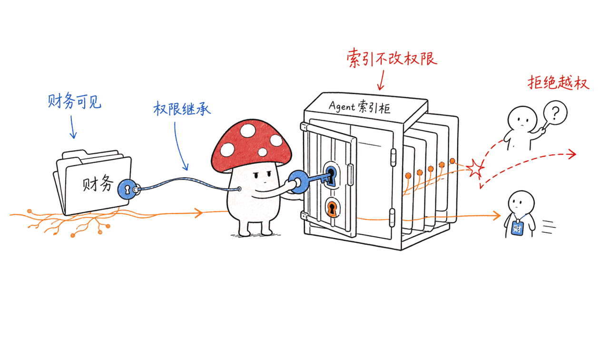
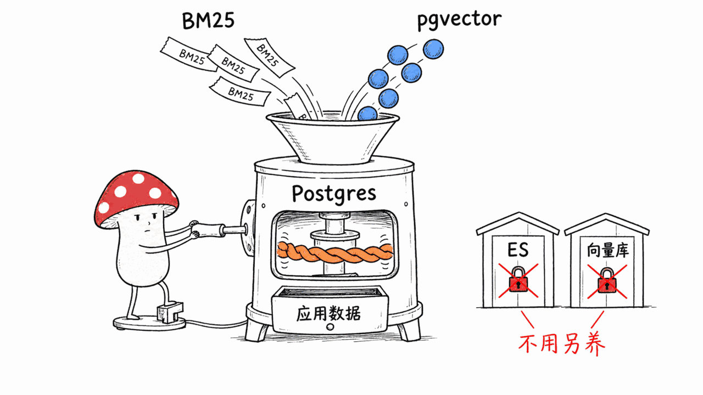
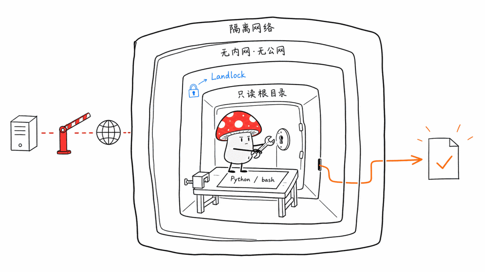
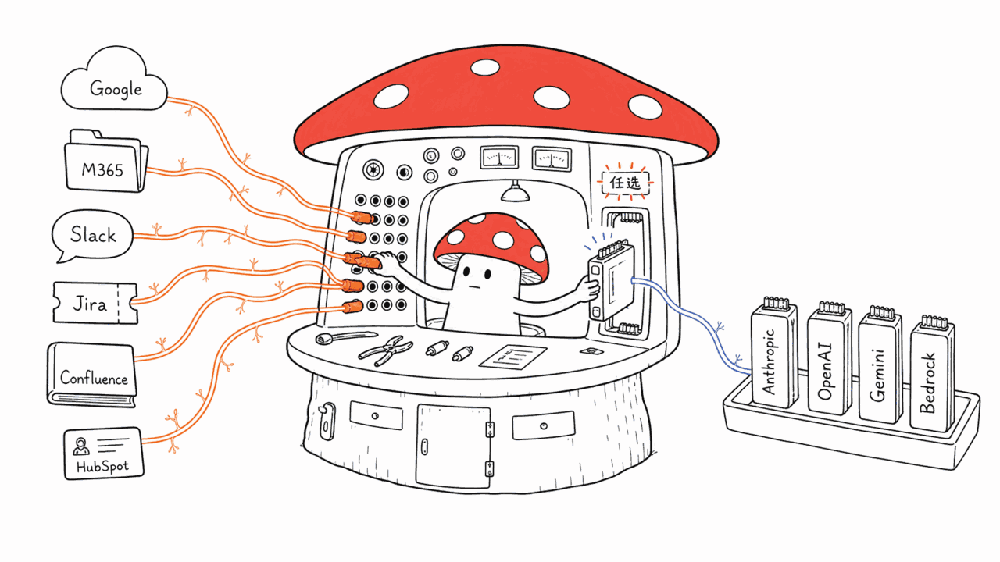

*by Mycelium Protocol*

---

项目地址：https://github.com/getomnico/omni
文档：https://docs.getomni.co
授权：Apache-2.0

---

## 一句话结论

**Omni 是一个开源、自托管的公司级 AI Agent**，接入 Google Drive、Gmail、Slack、Confluence、Jira、HubSpot 这些企业常用工具，员工在一个对话里就能让它调研问题、准备汇报、分析公司数据、找信息、执行受支持的操作。Rust + Python + SvelteKit 多语言架构，Apache-2.0，758 star，8 月 17 日仍在更新。

它跟今天写的另外几个 Agent 项目不是竞品关系，是不同层——Hermes/Nerve 是给个人用的运行时，Dense-Mem 是记忆治理层，**Omni 解决的是"一整个公司的信息接入 Agent 之后，权限怎么办"这个企业场景独有的问题。**

## 权限感知：搜得到不等于给你看

企业场景里最容易出事的地方，是把各系统的信息一股脑索引进一个统一的检索层之后，**索引本身悄悄绕过了原本的访问控制**——某个只有财务部能看的 Google Drive 文档，被索引进 Agent 的知识库后，任何员工问一句相关问题就能问出来。

Omni 的设计是"**权限感知的公司上下文**"（Permission-Aware Company Context）：索引信息的可见范围严格继承自每个源系统本身的权限。换句话说，索引这个动作不改变谁能看到什么，Agent 检索时依然要过一遍和你在原系统里一样的权限检查。这是企业级部署的底线要求，很多"接入你的公司数据"的 Agent 产品在这条线上是模糊处理的。

答案还带引用——**基于公司上下文回答问题，并且展示每个回答背后的信息来源**，方便核实。

## 混合检索全塞进一个 Postgres

架构上一个挺讨巧的决定：**用 Postgres（配合 ParadeDB 扩展）同时做 BM25 全文检索、pgvector 语义检索，外加应用数据存储**。官方原话很直白："不需要 Elasticsearch，不需要专用向量数据库。只有一个数据库需要调优、备份、监控、运维。"

这跟今天写的 Nerve 的"单进程零运维"是同一种工程哲学的不同应用——**能减少一种要运维的基础设施组件，就减少一种**。对没有专职数据平台团队的公司来说，这个决定省下来的运维成本可能比多数功能加分项都实在。

## 代码执行沙箱：真的隔离，不是摆设

Agent 运行时能在沙箱容器里跑 Python 和 bash，用来检查文件、分析数据、生成产出。这个沙箱容器跑在**隔离的 Docker 网络里，不能访问内部服务，也不能访问互联网**，再叠加 Landlock 文件系统限制、资源限额、只读根文件系统。四层防护叠加，而不是随便起个容器就算"沙箱"了。

## 接入面很广，模型不锁定

**工作场景连接器**：Google Workspace（Drive/Gmail/Chat）、Microsoft 365（SharePoint/OneDrive/Outlook/Teams）、Slack、Jira、Confluence、HubSpot，还能通过 MCP 工具或者自己用 Python/TypeScript 写 Connector SDK 扩展。

**模型**：Anthropic、OpenAI、Gemini、AWS Bedrock、Vertex AI、Azure AI Foundry，或者任何 OpenAI 兼容端点（vLLM、Ollama、LM Studio、LiteLLM 等）——供应商完全不锁定。

**部署**：单机场景用 Docker Compose，生产环境用 Terraform（AWS/GCP），全部跑在你自己的基础设施上，不经过任何第三方托管。

## 谁该看这个

**适合**：想给全公司接一个 AI Agent、但对"数据接入 Agent 之后权限还管不管用"这件事特别在意的团队；不想额外维护 Elasticsearch/向量数据库、希望技术栈简单一点的中小团队。

**不适合 / 需要注意**：这是给"公司"用的工具，不是个人助理，如果你要的是本站前面写的那种单人使用的记忆型 Agent，Hermes Agent 或 Nerve 更合适。

---

> © 2026 Author: Mycelium Protocol. 本文采用 [CC BY 4.0](https://creativecommons.org/licenses/by/4.0/deed.zh) 授权——欢迎转载和引用，须注明作者姓名及原文链接，不得去除署名后以原创发布。

<!--EN-->

## TL;DR

**Omni is an open-source, self-hosted company-wide AI agent** that connects to Google Drive, Gmail, Slack, Confluence, Jira, and HubSpot — workplace tools employees already use — so they can investigate an issue, prepare an update, analyze company data, find information, or carry out supported actions from one conversation. A polyglot Rust/Python/SvelteKit architecture, Apache-2.0, 758 stars, still updating as of August 17.

It's not a competitor to the other agent projects covered today — it's a different layer. Hermes and Nerve are runtimes for individuals; Dense-Mem is a memory governance layer. **Omni solves a problem unique to the enterprise scenario: once an entire company's information feeds into an agent, what happens to permissions?**

## Permission-aware: being searchable isn't the same as being visible to you

The most common way enterprise deployments go wrong is indexing information from every system into one unified retrieval layer — and the indexing itself quietly bypasses the original access control. A Google Drive document only Finance can see, once indexed into an agent's knowledge base, becomes answerable to any employee who asks a related question.

Omni's design is "**Permission-Aware Company Context**": the visibility scope of indexed information strictly inherits the permissions of each source system. In other words, indexing doesn't change who can see what — the agent's retrieval still runs through the same permission checks you'd hit in the original system. This is a baseline requirement for enterprise deployment, and plenty of "connect your company data" agent products are fuzzy about exactly this line.

Answers also come with citations — **grounded in company context, with the sources behind each response shown**, so they're easy to verify.

## Hybrid retrieval, all inside one Postgres

A clever architectural call: **use Postgres, with the ParadeDB extension, for BM25 full-text search, pgvector semantic search, and application data all at once.** The project states it plainly: "No Elasticsearch. No dedicated vector database. One database to tune, backup, monitor, and operate."

This is the same engineering philosophy as Nerve's "single process, zero ops," applied to the data layer instead — **every infrastructure component you can eliminate is one less thing to operate.** For a company without a dedicated data platform team, the operational savings from this one decision probably outweigh most feature checkboxes.

## A code execution sandbox that's actually isolated, not just for show

The agent runtime can run Python and bash in a sandboxed container to inspect files, analyze data, and generate outputs. That container runs on an **isolated Docker network with no access to internal services or the internet**, layered with Landlock filesystem restrictions, resource limits, and a read-only root filesystem. Four layers stacked together — not just "spin up a container and call it a sandbox."

## Broad connectivity, no model lock-in

**Workplace connectors**: Google Workspace (Drive/Gmail/Chat), Microsoft 365 (SharePoint/OneDrive/Outlook/Teams), Slack, Jira, Confluence, HubSpot — extensible further via MCP tools or a Python/TypeScript Connector SDK.

**Models**: Anthropic, OpenAI, Gemini, AWS Bedrock, Vertex AI, Azure AI Foundry, or any OpenAI-compatible endpoint (vLLM, Ollama, LM Studio, LiteLLM, and others) — no provider lock-in at all.

**Deployment**: Docker Compose for single-server setups, Terraform (AWS/GCP) for production — everything runs on your own infrastructure, with no third-party hosting in the loop.

## Who should look at this

**Good fit**: teams that want to roll out an AI agent company-wide but care deeply about whether permissions still hold once data feeds into the agent; small-to-mid teams that don't want to run a separate Elasticsearch or vector database and prefer a simpler stack.

**Not a fit / worth noting**: this is built for companies, not individuals — if what you want is the single-user, memory-focused agent covered earlier on this blog, Hermes Agent or Nerve is the better fit.

---

> © 2026 Author: Mycelium Protocol. Licensed under [CC BY 4.0](https://creativecommons.org/licenses/by/4.0/) — free to share and adapt with attribution. You must credit the author and link to the original; removing attribution and republishing as original is not permitted.
