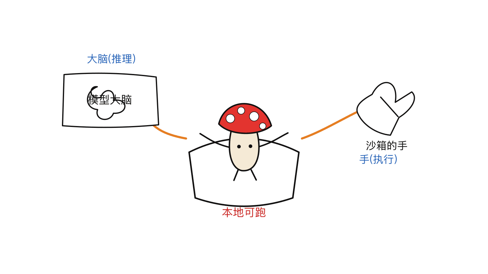
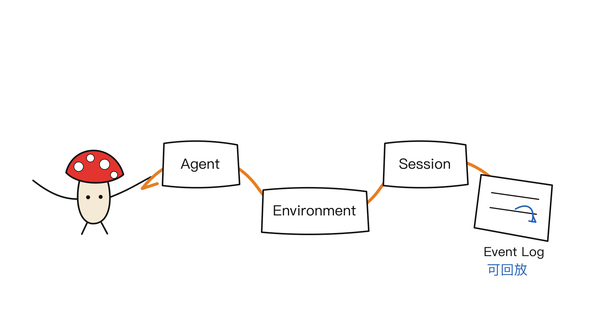
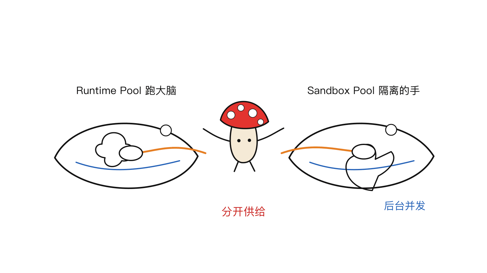
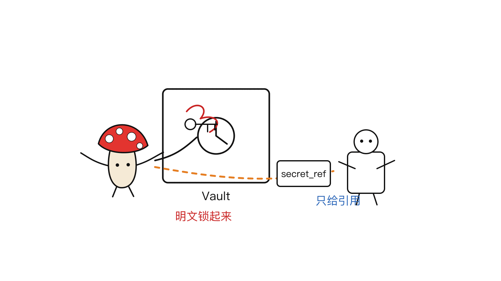

> 2026-06-23 · 工具观察 · 入门指南

**BLUF**：[OpenMaple](https://github.com/dragonforce2010/openmaple)（Apache-2.0 开源）是一个**能在本地一键跑起来的 managed-agent 控制面**。它不是又一个单 agent demo，而是把内部 Agent 平台常见的几块能力，拆成一套**清晰的资源模型**：`Agent`、`Environment`、`Session`、`Vault`、`Runtime Pool`、`Sandbox Pool`、`Event Log`，再配上 `SDK / CLI / REST API`。核心主线是 **Agent → Environment → Session → Event Log**。最快试用：一条 `./scripts/setup-local-docker.sh` 起 Web 控制台（`:8080`）、API（`:27951`）、MySQL、本地 Docker 运行池与沙箱池，**默认不需要 E2B / veFaaS / OAuth 凭证**，只有跑真实模型 loop 时才需要模型 key。它想验证的是：**这套资源模型适不适合工程团队做内部 Agent 平台。**

---

## 一、它解决什么问题？

很多团队做 Agent，做着做着会发现：**单个 agent demo 好写，平台难做**。一旦要支撑多个 agent、长期运行、可审计、凭据隔离、运行环境可控，就需要一层「控制面」来管这些。市面上的托管方案能力强，但往往**把你的栈绑死在某一朵云上**。

OpenMaple 的思路是把「managed agent」这套运营模型做成**开源、可自托管、provider 可替换**的：把**模型推理（大脑）**和**工具执行（手）**解耦，把会话状态**持久化到上下文窗口之外**，把运行和沙箱**隔离开**——而且这一切**能在你自己的机器上跑起来**。



---

## 二、核心：一套资源模型

OpenMaple 最值得看的是它把平台能力拆成的**资源模型**。理解这几个名词，就理解了整个平台：

| 资源 | 是什么 |
|------|--------|
| **Agent** | 版本化的配置：模型、system prompt、工具、MCP server、skills、loop 类型 |
| **Environment** | 把「在哪推理」和「在哪执行工具」分开选择（runtime 与 sandbox provider） |
| **Session** | 一条**持久的事件日志**：用户消息、工具调用、状态变化、产物，可回放 |
| **Vault** | 工作区级的**加密凭据保管**；agent 只拿到 `secret_ref` 引用，不碰明文 |
| **Runtime Pool** | 跑 agent loop 的运行池 |
| **Sandbox Pool** | 隔离工具执行的沙箱池（与运行池分开，后台并发供给） |
| **Event Log** | 会话的事件流账本，可复盘、可审计 |

它们串起来的主线非常清晰：

**Agent → Environment → Session → Event Log**

你先建一个 Agent，给它挂一个 Environment（指定 runtime/sandbox provider），（需要时）加 Vault 凭据，然后启动 Session，跑出来一条可回放的事件流。



---

## 三、两个池子：Runtime Pool vs Sandbox Pool

这是 managed-agent 平台的关键设计——**把「大脑」和「手」放到两个独立的池子里**：

- **Runtime Pool**：跑 agent loop 的地方（推理/编排）。
- **Sandbox Pool**：隔离执行工具的地方（真正动手干活、跑代码）。

两者**分开供给、后台并发**，互不污染。runtime loop 支持 Claude Code、Codex、直连模型适配器；sandbox provider 支持 E2B、veFaaS（源码或镜像模式）、以及**本地 Docker**——每个 provider 都藏在稳定契约后面，可替换，不锁死。



---

## 四、凭据安全：Vault 只给「引用」，不给明文

平台一定会碰到凭据（模型 key、第三方 token）。OpenMaple 的做法是 **Vault**：把凭据加密存在工作区级保险箱里，**agent 拿到的是 `secret_ref` 引用，不是明文 key**。这样 agent 配置、日志里都不会泄露真实凭据。



---

## 五、最快试用路径（本地，不需要云凭据）

一条命令起本地全套：

```bash
./scripts/setup-local-docker.sh
npm run smoke:local -- --base http://127.0.0.1:27951
```

然后打开：

```text
Web 控制台:  http://127.0.0.1:8080/
API:         http://127.0.0.1:27951/
```

默认本地路径会启动 **Web、API、MySQL、本地开发登录、本地 Docker 运行池、本地 Docker 沙箱池**。**默认不需要 E2B、veFaaS 或 OAuth 凭证**；只有当你要跑**真实模型 loop** 时，才需要配模型 key（把 `config/local-model.example.json` 复制成 `config/local-model.json`，填 `base_url` / `model_name` / `api_key_env`）。

三种用法层次，循序渐进：

- **Web 控制台**：可视化建 agent、配工作区、看 session 事件流。
- **REST API**：`/v1/*` 路由覆盖 agents、environments、sessions、vaults 等，方便自动化。
- **SDK / CLI**：`maple-agent-sdk`（Node）做类型化的会话创建与流式输出；`maple-agent-cli` 做 init / build / deploy / 配置 / 会话查看 / vault 管理。

---

## 六、适合谁 / 现在处于什么阶段

**适合**：在做 **AI infra / agent platform / 自托管 devtools** 的工程团队——尤其是想要 managed-agent 的运营模型、又不想被某朵云绑死的人。想长期运行 agent、需要**持久会话状态 + 可审计事件流**的场景也很契合。

**阶段提醒**：这是一个**刚开源的早期项目**（作者公开征集技术反馈）。它的价值主张是「资源模型是否适合做内部 Agent 平台」，所以更适合**评估、给反馈、做内部 PoC**，上生产前请看它的 provider readiness 文档。

---

## 结语

OpenMaple 把「做一个内部 Agent 平台」这件事，拆成了一组可以单独理解、单独替换的资源：**Agent 定义能力、Environment 选运行/沙箱、Session 留下可回放的事件流、Vault 管凭据、两个池子分开跑大脑和手。** 对在做 agent 基础设施的团队，它给了一个**能本地跑、不锁云**的参照实现——`setup-local-docker.sh` 一条命令就能上手评估。

> 📌 项目地址（请直接复制访问）：
> GitHub —— https://github.com/dragonforce2010/openmaple
> 官网 —— https://dragonforce2010.github.io/openmaple/
> 产品 Tour（YouTube）—— https://www.youtube.com/watch?v=zYhgkFomZ7M

---

> © 2026 Author: Mycelium Protocol. 本文采用 [CC BY 4.0](https://creativecommons.org/licenses/by/4.0/deed.zh) 授权——欢迎转载和引用，须注明作者姓名及原文链接，不得去除署名后以原创发布。

<!--EN-->

> 2026-06-23 · Tool Notes · Beginner Guide

**BLUF**: [OpenMaple](https://github.com/dragonforce2010/openmaple) (Apache-2.0) is a **managed-agent control plane you can run locally in one command**. It's not another single-agent demo — it breaks the usual internal agent-platform capabilities into a clean **resource model**: `Agent`, `Environment`, `Session`, `Vault`, `Runtime Pool`, `Sandbox Pool`, `Event Log`, plus `SDK / CLI / REST API`. The backbone is **Agent → Environment → Session → Event Log**. Fastest try: one `./scripts/setup-local-docker.sh` boots the Web console (`:8080`), API (`:27951`), MySQL, and local Docker runtime/sandbox pools, with **no E2B / veFaaS / OAuth needed by default** — model keys only for real model loops. What it wants to validate: **whether this resource model is right for engineering teams building an internal agent platform.**

---

## 1. The problem it solves

Many teams find that a single-agent demo is easy, but a **platform is hard**. Supporting many agents, long-running execution, auditability, credential isolation, and controlled runtimes needs a "control plane." Hosted options are capable but often **lock your stack to one cloud**.

OpenMaple makes the managed-agent operating model **open, self-hostable, and provider-portable**: it decouples **model reasoning (the brain)** from **tool execution (the hands)**, persists session state **outside the context window**, and isolates **runtime from sandbox** — and all of it **runs on your own machine**.


---

## 2. The core: a resource model

The most interesting part is how OpenMaple decomposes a platform into a **resource model**. Learn these and you understand it:

| Resource | What it is |
|------|--------|
| **Agent** | Versioned config: model, system prompt, tools, MCP servers, skills, loop type |
| **Environment** | Selects "where to reason" and "where to run tools" independently (runtime & sandbox provider) |
| **Session** | A **durable event log**: user messages, tool calls, status changes, artifacts; replayable |
| **Vault** | Workspace-scoped **encrypted credentials**; agents get a `secret_ref`, never plaintext |
| **Runtime Pool** | Pool that runs agent loops |
| **Sandbox Pool** | Pool that isolates tool execution (separate, provisioned concurrently in the background) |
| **Event Log** | The session's event stream — replay and audit |

The backbone is clear: **Agent → Environment → Session → Event Log**. Create an Agent, attach an Environment (runtime/sandbox provider), add Vault credentials if needed, then launch a Session that produces a replayable event stream.


---

## 3. Two pools: Runtime vs Sandbox

The key managed-agent design — **the brain and the hands live in two separate pools**:

- **Runtime Pool**: where the agent loop runs (reasoning/orchestration).
- **Sandbox Pool**: where tools execute in isolation (the actual hands, running code).

They are **provisioned separately and concurrently**. Runtime loops support Claude Code, Codex, and direct model adapters; sandbox providers include E2B, veFaaS (source or image mode), and **local Docker** — each behind a stable contract, swappable, no lock-in.


---

## 4. Credential safety: Vault hands out references, not secrets

A platform inevitably handles credentials. OpenMaple uses a **Vault**: credentials are encrypted in a workspace-scoped safe, and **agents receive a `secret_ref`, not the plaintext key** — so neither agent config nor logs leak real secrets.


---

## 5. Fastest local path (no cloud credentials)

One command boots the whole local stack:

```bash
./scripts/setup-local-docker.sh
npm run smoke:local -- --base http://127.0.0.1:27951
```

Then open:

```text
Web Console:  http://127.0.0.1:8080/
API:          http://127.0.0.1:27951/
```

The default local path starts **Web, API, MySQL, local dev login, a local Docker runtime pool, and a local Docker sandbox pool**. **No E2B, veFaaS, or OAuth needed by default** — model keys are only required for **real model-backed loops** (copy `config/local-model.example.json` to `config/local-model.json`, set `base_url` / `model_name` / `api_key_env`).

Three layers of usage: the **Web console** (visual agent builder, session transcripts), the **REST API** (`/v1/*` for agents/environments/sessions/vaults), and the **SDK/CLI** (`maple-agent-sdk` for typed streaming sessions, `maple-agent-cli` for init/build/deploy/config/sessions/vault).

---

## 6. Who it's for / what stage it's at

**For**: teams building **AI infra / agent platforms / self-hosted devtools** — especially those who want the managed-agent operating model without binding to one cloud, and who need long-running agents with **durable session state and auditable event logs**.

**Stage note**: this is a **freshly open-sourced, early project** (the author is actively seeking technical feedback). Its thesis is "is this resource model right for an internal agent platform," so it fits **evaluation, feedback, and internal PoC**; check its provider-readiness docs before production.

---

## Closing

OpenMaple decomposes "build an internal agent platform" into resources you can understand and swap independently: **Agent defines capability, Environment picks runtime/sandbox, Session leaves a replayable event stream, Vault manages credentials, and two pools separate the brain from the hands.** For teams building agent infrastructure, it's a **run-locally, no-cloud-lock** reference implementation — one `setup-local-docker.sh` and you're evaluating.

> 📌 Project (copy to visit):
> GitHub — https://github.com/dragonforce2010/openmaple
> Site — https://dragonforce2010.github.io/openmaple/
> Product tour (YouTube) — https://www.youtube.com/watch?v=zYhgkFomZ7M

---

> © 2026 Author: Mycelium Protocol. Licensed under [CC BY 4.0](https://creativecommons.org/licenses/by/4.0/) — free to share and adapt with attribution. You must credit the author and link to the original; removing attribution and republishing as original is not permitted.
