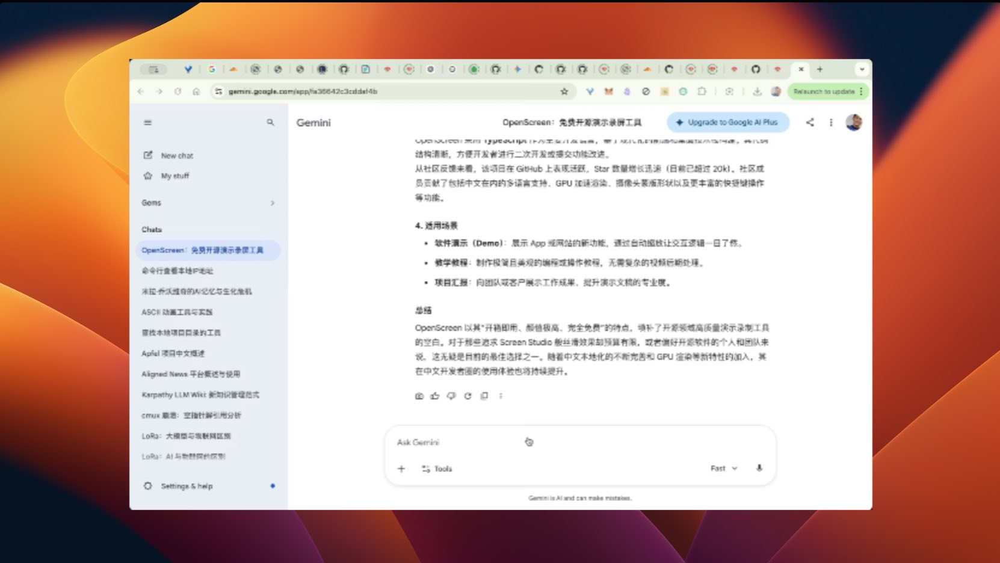

OpenScreen 是一个由开发者 Siddharth Vaddem 发起的开源项目（GitHub 仓库：`siddharthvaddem/openscreen`），旨在为用户提供一个免费、跨平台且功能强大的屏幕演示视频制作工具。它被广泛视为商业软件 Screen Studio 的开源替代方案，特别适合开发者、产品经理和内容创作者用于制作产品演示、教程视频或功能更新介绍。

## 1. 项目定位与核心价值

在数字化办公和知识分享的趋势下，高质量的屏幕录制不再仅仅是录制一段视频，更需要流畅的动态交互效果。OpenScreen 的核心价值在于：

- **完全免费与开源**：无需订阅费用，无水印限制，支持商业用途。
- **极致的交互体验**：自动捕捉鼠标轨迹，并提供类似专业剪辑软件的平滑缩放和平移效果。
- **多平台支持**：提供 Windows、macOS 和 Linux 的安装版本，适配性极强。

## 2. 核心功能特性

OpenScreen 并非简单的录屏工具，而是一个集成了录制与后期自动渲染的"演示视频工厂"。其主要功能包括：

### 智能缩放与跟随
系统可以根据鼠标点击或移动自动应用缩放效果（Auto Zoom），确保观众能清晰看到操作细节，同时也支持手动自定义缩放级别。

### 丰富的视觉定制
用户可以为录制的窗口添加精美的背景，包括纯色、渐变色、艺术壁纸，甚至是自定义图片。此外，还可以调整视频的内边距（Padding）和圆角，使其极具现代感。

### 运动模糊（Motion Blur）
在平移和缩放时加入动态模糊效果，让视频画面看起来更加丝滑顺畅。

### 后期标注与编辑
内置时间轴编辑功能，支持在视频中添加文字说明、箭头、图像标注，并支持对视频片段进行剪辑（Trim）和调速。

### 灵活导出
支持多种分辨率（如 1080p, 4K）和主流社交媒体比例（1:1, 16:9, 9:16 等），满足不同平台的发布需求。

## 3. 技术栈与社区活跃度

OpenScreen 采用 **TypeScript** 作为主要开发语言，基于现代化的前端和桌面技术栈构建。其代码结构清晰，方便开发者进行二次开发或提交功能改进。

从社区反馈来看，该项目在 GitHub 上表现活跃，Star 数量增长迅速（目前已超过 20k）。社区成员贡献了包括中文在内的多语言支持、GPU 加速渲染、摄像头蒙版形状以及更丰富的快捷键操作等功能。

## 4. 适用场景

- **软件演示（Demo）**：展示 App 或网站的新功能，通过自动缩放让交互逻辑一目了然。
- **教学教程**：制作极简且美观的编程或操作教程，无需复杂的视频后期处理。
- **项目汇报**：向团队或客户展示工作成果，提升演示文稿的专业度。

## 总结

OpenScreen 以其"开箱即用、颜值极高、完全免费"的特点，填补了开源领域高质量演示录制工具的空白。对于那些追求 Screen Studio 般丝滑效果却预算有限，或者偏好开源软件的个人和团队来说，这无疑是目前的最佳选择之一。随着中文本地化的不断完善和 GPU 渲染等新特性的加入，其在中文开发者圈的使用体验也将持续提升。

---

**项目链接**: https://github.com/siddharthvaddem/openscreen
