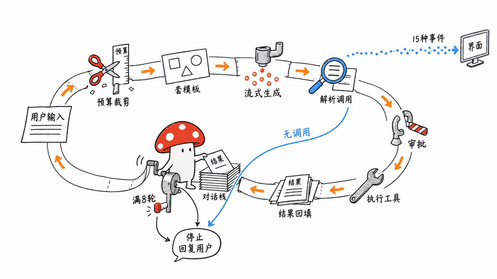
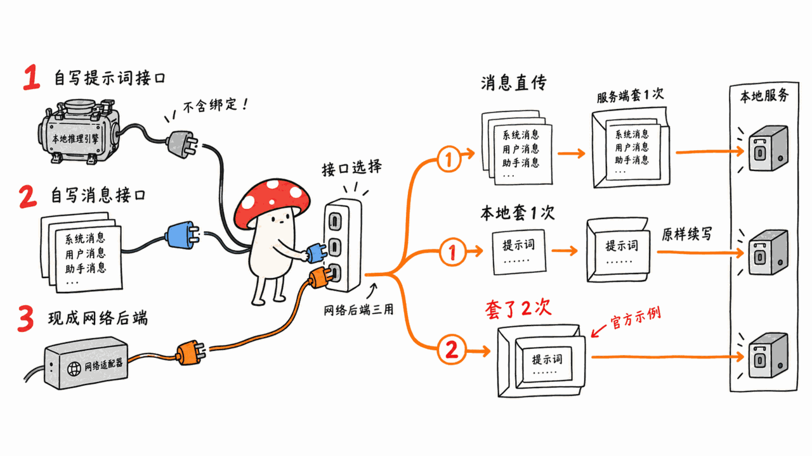
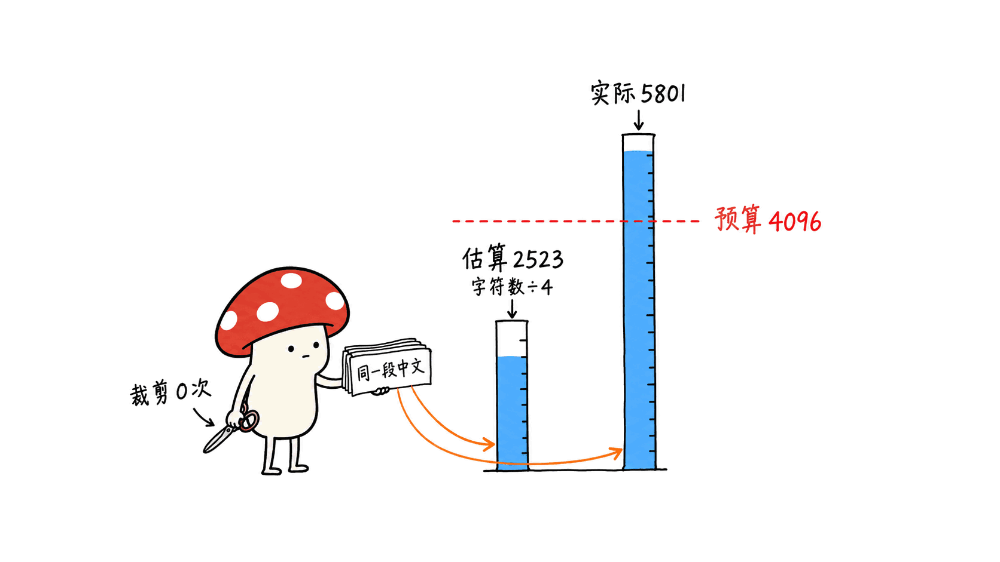

> 📌 开源仓库：anistark/orion-core（Orion Agent Harness）
> GitHub：https://github.com/anistark/orion-core
> crates.io：https://crates.io/crates/orion-core
> 协议：MIT ｜ 语言：Rust（MSRV 1.85）｜ Stars：3 ｜ 创建：2026-06-11 ｜ 最新版本：0.7.1（2026-09-07）｜ 共 10 次提交

---

**BLUF**：orion-core 是一个 Rust 库，不是一个 Agent。它从作者的本地模型桌面应用 OrionPod 里拆出来，负责「对话循环」这一层：工具调用的解析、执行和回填（默认最多 8 轮）、按整轮裁剪的 token 预算（可钉住消息、可自动摘要）、10 种聊天模板、15 种流式事件，以及 0.6.0 加入的工具执行前审批钩子。它**不带任何工具、沙箱、长期记忆或 MCP**；README 说支持「llama.cpp、MLX、云 API」，但 crate 里现成的后端只有一个 OpenAI 兼容 HTTP 客户端，MLX 要靠 `mlx_lm.server` 这类服务中转，或者自己写后端。我们在 M4 Mac mini 上用 `mlx_lm.server` + Qwen2.5-1.5B-4bit 实测：93 个测试全过；英文单步工具调用 8/8 触发，中文 6/7；多步任务里 1.5B 模型会猜参数、跳步。三个要当心的地方：**宽松的工具解析会把任何带 `name` 字段的 JSON 块当成调用**；**HTTP 后端按「字符数 ÷ 4」估 token，中文实测少估 2.0–2.4 倍**，6 轮对话后真实 5801 token、估算 2523，预算形同虚设；**官方示例用的还是作者自己在 0.7.0 修掉的旧写法**。3 star、74 次下载、单人维护，是早期个人项目，但测试和文档的认真程度明显好于同体量项目。适合要在 Rust / Tauri 应用里嵌一个本地模型对话循环的开发者；只想用 Agent 的人应该去看 Goose。

这篇文章讲四件事：「harness」到底提供了什么、它能接哪些推理后端、我们在 Mac 上实测到的问题、以及它和 Goose、OpenHands、Aider、smolagents 这些项目的区别。

## 先说定位：它是库，不是 Agent

orion-core 是 Rust 开发者 Kumar Anirudha（GitHub：anistark，班加罗尔，另一个项目 feluda 有 471 star）从自己的桌面应用 OrionPod 里拆出来的「Agent 引擎」。OrionPod 是一个用 Rust + Tauri 写的本地模型桌面应用，官网自称安装包约 30MB、跑 GGUF 模型，作者博客说它的推理引擎是 llama.cpp。2026-06-15 作者把引擎单独发成 crate，同月在个人博客写了一篇 18 分钟长文《Lessons from building an agent harness for local models》讲设计取舍。

所以先把三件事说清楚：

- **它是一个 Rust 库**，你 `cargo add orion-core` 然后在自己的程序里调用。没有命令行、没有界面、没有配置文件。
- **它不是编程 Agent。**作者在博客里明说：pi、opencode、Claude Code 是编程 Agent，会读写文件、跑命令、理解整个仓库，Orion 不跟它们比这个；它的目标是「给普通人用的、跑在自己机器上的通用助手」背后那一层循环。
- **它不带模型、不带推理引擎。**模型从哪来、怎么跑，是你的事。

作者说设计上借鉴了 pi（Earendil 的极简编程 Agent）把事件流和上下文当成流水线来处理的思路。本站写过 Earendil 那篇《What is a Harness?》的解读：https://blog.mushroom.cv/blog/earendil-what-is-a-harness-pi-minimal-agent-four-primitives/ 。拿那篇的框架来说，orion-core 实现的是 harness 里「循环 + 上下文 + 工具分发」这一段，没有实现「环境」那一段（文件系统、shell、沙箱）。

## 一次请求在里面走了哪几步？



README 给的流程和我们读代码看到的一致：

1. `Agent::prompt()` 收到用户输入，追加到对话历史（一个 `Vec<Message>`）；
2. 上下文流水线按 token 预算裁剪旧消息，保留系统提示词和最近的轮次；
3. 用聊天模板把消息格式化成模型要的样子，工具说明也拼进系统提示词；
4. 调后端生成，token 一个个流回来，变成 `MessageDelta` 事件；
5. 从回复里解析工具调用，有就执行、把结果追加回历史、回到第 2 步；
6. 模型给出一条不含工具调用的回复，或者循环满 8 次（`max_tool_iterations` 默认值），结束。

全程通过一个 `tokio` 无界通道往外发事件，你的界面订阅这个通道就行。事件一共 15 种（含 0.6.0 加的 `ToolDenied` 和每轮一次的 `GenerationStats`），带着每个 token 的生成速度、首 token 延迟、上下文用了多少、剪掉了几条。

## 「harness」具体给了你什么，没给什么？

读完 `src/` 下 9 个文件（共 3712 行）后，我们把它的能力列成一张表：

| 能力 | 有没有 | 具体是什么 |
|---|---|---|
| 工具调用循环 | 有 | 解析 → 执行 → 回填结果 → 再问模型，默认最多 8 轮；一条回复里写 JSON 数组可以一次调多个工具 |
| 工具执行前审批 | 有（0.6.0 起） | `ApprovalHook`：每个工具调用执行前问一次宿主，可以异步等人工确认；拒绝的理由会作为错误结果回给模型 |
| 上下文预算 | 有 | 按整轮裁剪（不会把工具调用和它的结果拆开），可钉住消息，可选「摘要」策略：溢出时多调一次模型把旧对话压成一条摘要 |
| 聊天模板 | 有 | ChatML、Llama 3、Llama 2、Mistral/Mixtral、Gemma、Phi-3、DeepSeek、Command-R、Alpaca、Vicuna，可按 GGUF 元数据自动识别 |
| 流式事件 | 有 | 15 种事件，带速度、延迟、预算数据 |
| 中断 | 有 | `abort()` 设一个原子标志，后端每个 token 检查一次 |
| 内置工具 | **没有** | 读文件、跑命令、搜索都要你自己实现 `Tool` trait |
| 沙箱 | **没有** | 只有审批钩子这个「插口」，隔离要宿主自己做 |
| 长期记忆 / 持久化 | **没有** | 对话就是 `Vec<Message>`，可序列化，存哪、怎么检索由你决定 |
| MCP / RAG | **没有** | 代码里没有任何 MCP 客户端或检索组件 |
| 原生函数调用 | **没有** | 不用 OpenAI 的 `tools` 参数，工具调用靠提示词里约定的文本格式（下面细说） |

一句话：它给的是**循环和记账**，不给**手和脚**。这正好是本站在《模型可以小，脚手架要聪明》那篇 CMU 论文拆解里说的「脚手架」里最通用的那一截：https://blog.mushroom.cv/blog/cmu-better-harnesses-smaller-models-slm-agent-cost-reduction-engineering/

## 它到底支持哪些推理后端？



README 的原话是「llama.cpp、MLX、云 API，什么都行」。这句话要拆开看，因为 crate 里真正**现成**的后端只有一个：

| 路径 | 你要做什么 | 能接什么 |
|---|---|---|
| 实现 `LlmBackend` trait | 自己写三个方法：`generate`（喂提示词、逐 token 回调）、`tokenize_count`、`is_ready` | 任何进程内引擎：llama.cpp 绑定、MLX、candle、ONNX……crate 里**没有**这些绑定，要你自己写或找别的 crate |
| 实现 `ChatBackend` trait（0.7.0 起） | 自己写 `chat`，拿到结构化消息列表 | 适合托管聊天 API |
| 开 `http-backend` 特性，用现成的 `OpenAiHttpBackend` | 填 base URL 和模型名 | 任何 OpenAI 兼容端点：OpenAI、llama.cpp 的 `llama-server`、vLLM、LM Studio、Ollama 的 `/v1`，以及 `mlx_lm.server` |

所以「支持 MLX」的准确意思是：**你可以给 MLX 写一个后端**，或者先用 `mlx_lm.server` 把模型挂成 OpenAI 兼容服务再用 HTTP 后端接。crate 本身不包含任何 MLX 或 llama.cpp 代码。OrionPod 里那个复用 KV 缓存前缀、只重算变化尾部的优化（作者博客里讲的第二个大 bug），也在 OrionPod 的引擎层，不在 orion-core 里。

`OpenAiHttpBackend` 有三种用法，区别很关键：

- **当 `ChatBackend` 用**（0.7.1 起才可以）：把消息列表原样发给 `/v1/chat/completions`，服务端套模型自己的模板。**接 Ollama、LM Studio、mlx_lm.server 这类聊天端点，用这个。**
- **当 `LlmBackend` 用 + `Completions` 端点**：orion-core 自己套模板，把完整提示词原样发给 `/v1/completions`。适合你确定模板对得上的本地模型。
- **当 `LlmBackend` 用 + 默认 `Chat` 端点**：orion-core 先套一遍模板，再把整段带标记的文本塞进**一条** user 消息发出去，服务端再套一遍。CHANGELOG 自己承认这是 0.7.0 要修的「坍缩」问题。**但仓库里的官方示例 `examples/openai_backend.rs` 至今还是这么写的**（把后端声明成 `Arc<dyn LlmBackend>`，默认 Chat 端点）。照着示例抄，就会掉进作者自己修过的坑。

## 工具调用为什么不用原生 function calling？

orion-core 不往请求里放 OpenAI 的 `tools` 字段，而是在系统提示词末尾写一段说明，要模型用下面这种格式回复：

````text
```tool_call
{"name": "get_weather", "arguments": {"city": "Hanoi"}}
```
````

作者在博客里解释了原因：3B、7B 的本地小模型不守格式，会写成 ```` ```json ````、会写裸 JSON、会在 JSON 外面加解释。严格解析的话工具就「悄悄不触发」，模型以为调用了，几轮之后对话就乱了。所以他选择**宽松解析**：```` ```tool_call ```` 块、```` ```json ```` 块、整条消息就是一个带 `name` 和 `arguments` 的 JSON 对象，都算。

这个取舍的好处是不依赖服务端是否支持 function calling（很多本地服务对 `tools` 的支持参差不齐）。代价我们用 `parse_tool_calls` 直接测了出来：


| 模型输出 | 解析结果 | 问题 |
|---|---|---|
| ```` ```tool_call ```` 块 | 1 个调用 | 正常 |
| Qwen 原生的 `<tool_call>…</tool_call>` 标签 | **0 个** | Qwen 系模型训练时学的就是这个格式，一旦它按习惯输出，工具不会触发 |
| ```` ```json ```` 块，参数键写成 `parameters` | 1 个调用，**参数为空 `{}`** | 解析器只认 `arguments`，其余情况静默当成无参数调用 |
| 模型在解释格式：「你可以这样写 ```` ```json {"name":"delete_file",…} ```` ，但我现在不这么做」 | **1 个调用：delete_file** | 示例被当成真调用执行 |
| 普通回答里一段 ```` ```json {"name":"Alice","age":30} ```` | **1 个调用：Alice** | 任何带 `name` 字段的 JSON 块都会被当成工具调用 |
| 正文里顺口一句「我会调用 get_weather」 | 0 个 | 正常 |

后两条是真正的风险：在 ```` ```json ```` 块里，解析器只检查有没有 `name` 字段。模型只要在回答里给你展示一段带 `name` 的 JSON，就会被当成工具调用。未注册的名字会得到一个「unknown tool」错误回填给模型，浪费一轮；**如果恰好是已注册工具的名字，它会真的执行**。这就是为什么 0.6.0 加的 `ApprovalHook` 不是锦上添花：**任何有副作用的工具都应该挂审批钩子。**

## 实测：接本机 MLX 模型跑一遍

**环境**：Mac mini（Apple M4，16GB），macOS 26.6.2；Rust 1.98.1；orion-core 0.7.1（crates.io 发布版，开 `http-backend`）；推理用 mlx-lm 0.31.3 的 `mlx_lm.server` 挂 Qwen2.5-1.5B-Instruct-4bit（868MB），温度 0。我们写了一个约 180 行的探针程序，注册 3 个工具：`multiply`（精确乘法）、`get_weather`（返回固定的假数据）、`delete_file`（挂了一个一律拒绝的审批钩子）。

**测试套件**：仓库 commit `fa24c2c` 上 `cargo test --all-features`，80 个单元/集成测试加 13 个文档测试，**全部通过**，首次编译约 23 秒。

**单步工具调用**（`ChatBackend` 路径）：

| 语言 | 触发正确的工具 | 备注 |
|---|---|---|
| 英文 | 8 / 8 | 乘法结果 163198657、97406784、245385269 均正确；`delete_file` 被审批钩子拦下，模型收到拒绝理由后改口解释 |
| 中文 | 6 / 7 | 「2718 乘以 3141」模型写的是 ```` ```json ```` 而不是 ```` ```tool_call ````，**靠宽松解析才触发**；「河内今天天气怎么样？」模型回答「请稍等，我将调用一个天气工具」然后就结束了，**没有输出任何调用** |

中文那条失败正是作者博客里描述的「工具悄悄不触发」：模型说要调用，但没按格式写，解析器什么都没抓到，循环把这句话当成最终答案返回。orion-core 对这种情况**没有任何提示事件**，宿主只能自己检查「回答里提到了工具名却没有调用」。

**多步工具调用**：

- 英文「查河内天气，再把摄氏温度乘以 17」：先调 `get_weather` 拿到 31，再调 `multiply(31, 17)` 得到 527，3 次生成共 1.6 秒。这是理想路径。
- 英文「查曼谷天气，再把气温乘以 3」：模型**在同一轮里同时发了两个调用**，`multiply` 的参数是它猜的 `a=10`（天气结果还没回来），工具返回 30；最终回答却说 93，是它自己心算的。
- 中文同一题：只调了天气，乘法自己算，还写成了「93°C」。

**速度**：模型预热后首 token 约 70 毫秒，生成 70–84 token/秒，一次带工具的问答端到端 0.7–1.9 秒。orion-core 自己的开销在这个量级里看不出来。

**三种后端用法对比**（同一道英文乘法题）：`ChatBackend` 路径 prompt 260 token；`LlmBackend` + `/v1/completions` 260 token（Qwen 用 ChatML，模板刚好对上）；`LlmBackend` + 默认 Chat 端点（官方示例的写法）289 token，多出来的是被塞进 user 消息里的 ChatML 标记。在 Qwen2.5 这种宽容的模型上，三种写法都答对了，旧写法只是多花 11% 的 prompt token；模板差异更大的模型、更长的多轮对话会不会出错，我们没测。

结论：**循环本身是可靠的，薄弱环节在 1.5B 模型守不守格式**。这和作者的判断一致，也说明宽松解析确实在救场。实际用建议上 3B 以上的模型。

## 中文用户要注意：token 是估出来的



上下文预算管理的前提是「数得清 token」。`LlmBackend` 的 `tokenize_count` 需要你自己实现，本地引擎可以给真数；但 HTTP 后端和所有没覆盖这个方法的 `ChatBackend`，用的都是 `estimate_tokens`：**字符数除以 4**。

这个估算对英文基本准，对中文差很多。我们用 Qwen2.5 的分词器对照：

| 文本 | 字符数 | orion-core 估算 | 真实 token（Qwen2.5 分词器） | 真实 / 估算 |
|---|---|---|---|---|
| 本站一篇文章的英文部分 | 19,372 | 4,843 | 5,046 | 1.04 |
| 同一篇的中文部分（夹代码和英文术语） | 10,707 | 2,676 | 5,464 | 2.04 |
| 本站 5 篇文章的中文段落合集 | 13,407 | 3,351 | 7,946 | 2.37 |

我们在实测里跑了一个 6 轮的中文对话：每轮让模型用一句话概括 1500 字的中文段落，预算用默认的 4096 token。

| 轮次 | orion-core 估算 | 服务端报告的真实 prompt token | 裁剪条数 |
|---|---|---|---|
| 1 | 405 | 979 | 0 |
| 3 | 1,257 | 3,014 | 0 |
| 4 | 1,673 | 3,962 | 0 |
| 5 | 2,090 | **4,887** | 0 |
| 6 | 2,523 | **5,801** | 0 |

第 5 轮真实 token 已经超过 4096 的预算，orion-core 的估算才用了一半，一条都没裁。这次没出事，是因为 Qwen2.5 本身有 32K 上下文、mlx_lm.server 没有设上限。如果服务端就是按 4096 开的（比如 `llama-server -c 4096`），这时的请求就会超出上下文，具体表现是报错还是截断取决于服务端，我们没有测。

对策很简单：接 HTTP 后端时**自己包一层**，把 `tokenize_count` 换成真分词器（Rust 里可以用 Hugging Face 的 `tokenizers` crate 加载模型的 `tokenizer.json`），或者至少把 `max_context_tokens` 按 2.5 倍的系数往下调。

## 成熟度：老实说有多早期？

| 指标 | 数值（2026-09-12 核实） |
|---|---|
| GitHub | 3 star、1 fork、0 个 open issue |
| 提交 | 共 10 次，全部来自作者一人；2026-06-15 首次提交，最近一次 2026-09-07 |
| crates.io | 4 个版本（0.5.0 → 0.6.0 → 0.7.0 → 0.7.1），总下载 74 次，0 个依赖它的公开 crate |
| 代码 | `src/` 3712 行，`tests/` 2658 行 |
| 工程规范 | CI 跑 fmt、clippy（警告即失败）、stable 和 MSRV 1.85 两套测试；`#![deny(missing_docs)]`；README 里的代码片段都有对应 doctest；有属性测试和基准 |
| 版本策略 | SemVer，0.x 期间小版本可能破坏兼容（0.7.0 就改了 `PreparedContext` 结构）；`CoreError` 和 `AgentEvent` 标了 `#[non_exhaustive]` |

这是一个**典型的早期个人项目，但工程习惯明显好于同体量项目**：测试覆盖、文档、CHANGELOG 写得都很认真，CHANGELOG 里甚至会承认「0.7.0 发出去的时候自家 HTTP 后端还在走旧路径」。另外两个小瑕疵：从 0.6.0 起发布包里带上了约 2MB 的文档配图（0.5.0 时整个包只有 65KB）；OrionPod 官网说应用「免费开源」，但我们只找到了 orion-core 和官网仓库，没找到应用本体的公开源码，安装包挂在官网仓库的 release 里。

## 和 Goose、OpenHands、Aider、smolagents 比，区别在哪？

这几个项目经常被放在一起说，其实层级不同：

| 项目 | Star（2026-09-12） | 语言 / 许可证 | 形态 | 和 orion-core 的关系 |
|---|---|---|---|---|
| **orion-core** | 3 | Rust / MIT | 嵌入式库 | 只有循环、上下文、模板、事件；不带工具、不带模型 |
| Goose（aaif-goose/goose） | 54,152 | Rust / Apache-2.0 | 完整 Agent 应用（CLI + 桌面） | 同是 Rust，但自带扩展体系和 MCP，开箱即用 |
| OpenHands | 87,603 | Python/TS / MIT | 编程 Agent 平台，带沙箱运行时 | 解决的是「让 Agent 安全地改代码」，orion-core 完全不涉及 |
| Aider | 48,912 | Python / Apache-2.0 | 终端结对编程工具 | 围绕 git 和代码编辑，专用而非通用 |
| smolagents | 29,292 | Python / Apache-2.0 | Agent 框架库 | 最接近的同类：也是库、也支持本地模型；但主推「写 Python 代码当动作」，还带多种执行沙箱 |
| pi（earendil-works/pi） | 104,312 | TypeScript / MIT | 极简编程 Agent | orion-core 的设计灵感来源 |
| rig（0xPlaygrounds/rig） | 8,600 | Rust / MIT | Rust LLM 应用框架 | Rust 生态里更成熟的选择，走各家原生 function calling，自带 RAG 抽象 |

选型逻辑其实很简单：

- 想**直接用**一个 Agent：Goose、Aider、OpenHands，跟 orion-core 不是一类东西。
- 想在 **Python** 里自己搭：smolagents。
- 想在 **Rust** 里自己搭，要接各家云 API、要 RAG：rig 更成熟。
- 想在 **Rust** 里给**本地小模型**做一个流式、预算可控、不依赖服务端 function calling 的对话循环，并且嵌进 Tauri 桌面应用：这才是 orion-core 的位置。它的差异化在于「为本地小模型设计」：宽松解析、GGUF 模板识别、按整轮裁剪、首 token 延迟等性能事件，都是冲着本地推理去的。

## Apple Silicon Mac 用户怎么用？

1. **别找 MLX 绑定，先用 `mlx_lm.server` 或 Ollama。**orion-core 没有进程内 MLX 后端。最省事的路径是 `mlx_lm.server --model <模型>` 或 Ollama 起一个 OpenAI 兼容服务，然后用 `OpenAiHttpBackend`，**并且一定按 `Arc<dyn ChatBackend>` 来用**，不要照抄官方示例的 `LlmBackend` 写法。
2. **模型选 3B 以上。**我们实测 1.5B 能跑通单步工具调用，但多步、中文场景会出现格式漂移（见上面实测）。16GB 内存的 Mac 可以放心试 Qwen 系 3B–8B 的 4bit 量化版。
3. **中文对话把预算打折。**用 HTTP 后端时 token 是按「字符数 ÷ 4」估的，中文要乘 2 到 2.5 倍才接近真值。要么接真分词器，要么把 `max_context_tokens` 设成模型上下文的四成左右。
4. **有副作用的工具一律挂 `ApprovalHook`。**宽松解析会把模型「展示」的 JSON 当成调用。
5. **想做桌面应用再选它。**如果你只是想在 Mac 上用一个本地 Agent，Goose 或者本站评测过的 Osaurus（https://blog.mushroom.cv/blog/osaurus-native-macos-ai-harness-swift-cryptographic-identity/ ）更直接。orion-core 适合正在写 Tauri / Rust 应用、需要一个可控对话循环的开发者。
6. **钉死版本。**0.x 阶段小版本会破坏兼容，`Cargo.toml` 里写 `orion-core = "=0.7.1"` 这类精确版本，升级前看 CHANGELOG。

## 适合谁，不适合谁？

**适合**：在写 Rust / Tauri 桌面应用、需要一个可嵌入的本地模型对话循环的开发者；想读一份「本地小模型 harness 该处理哪些坑」的干净实现的人（作者的博客长文和 CHANGELOG 本身就是很好的教材）；需要流式事件驱动界面（速度条、预算条、工具卡片）的场景。

**不适合**：只想在 Mac 上用一个本地 Agent 的普通用户（它没有界面，也不带任何工具）；需要沙箱、MCP、RAG、长期记忆的项目（全部要自己补）；需要稳定 API 的生产项目（0.x 阶段小版本会破坏兼容，单人维护）；以中文为主、又用 HTTP 后端却不打算自己接分词器的场景。

## 常见问题

**Q：orion-core 支持 Ollama 和 MLX 吗？**
A：通过 OpenAI 兼容接口支持。开启 `http-backend` 特性后，`OpenAiHttpBackend` 可以接 Ollama、LM Studio、llama.cpp 的 `llama-server`、vLLM 和 `mlx_lm.server`。crate 里没有进程内的 MLX 或 llama.cpp 绑定，想在进程内跑要自己实现 `LlmBackend` trait。接聊天端点时请把它当 `ChatBackend` 用（0.7.1 起支持）。

**Q：它的工具调用需要模型支持 function calling 吗？**
A：不需要。它在系统提示词里约定一个 ```` ```tool_call ```` JSON 格式，再从回复文本里宽松解析，所以不依赖服务端的 `tools` 参数。代价是 Qwen 原生的 `<tool_call>` 标签不被识别，而普通 ```` ```json ```` 块里只要有 `name` 字段就会被当成调用，有副作用的工具必须挂 `ApprovalHook`。

**Q：它和 Goose、smolagents、rig 有什么区别？**
A：Goose 是开箱即用的完整 Agent 应用；smolagents 是 Python 的 Agent 框架，主推代码动作并自带沙箱；rig 是更成熟的 Rust LLM 框架，走各家原生 function calling。orion-core 只做对话循环这一层，专门为本地小模型设计：宽松解析、GGUF 模板识别、按整轮裁剪、性能事件。

**Q：能拿它做编程 Agent 吗？**
A：可以作为底座，但读文件、改文件、跑命令、沙箱隔离都要自己实现。作者明确说 Orion 不是编程 harness，目标是通用的本地助手。

**Q：它有长期记忆吗？**
A：没有。对话就是一个可序列化的 `Vec<Message>`，你可以存下来再用 `replace_messages` 恢复；「摘要」裁剪策略能在单次会话里保住旧对话的要点，但跨会话的记忆和检索要自己做。

**Q：能用在生产环境吗？**
A：要谨慎。3 star、74 次下载、单人维护，0.x 阶段小版本会破坏兼容。好在 MIT 许可、代码只有 3712 行、测试完整，出问题能自己读懂和修。建议精确钉版本，并按本文的建议补上真分词器和审批钩子。

## 一手源

- GitHub 仓库：https://github.com/anistark/orion-core
- crates.io：https://crates.io/crates/orion-core
- API 文档：https://docs.rs/orion-core
- 官方指南站：https://anistark.github.io/orion-core/
- 作者博客《Lessons from building an agent harness for local models》：https://blog.anirudha.dev/orion-core/
- OrionPod 官网：https://orionpod.com/
- mlx-lm（`mlx_lm.server`）：https://github.com/ml-explore/mlx-lm

---

> © 2026 Author: Mycelium Protocol. 本文采用 [CC BY 4.0](https://creativecommons.org/licenses/by/4.0/deed.zh) 授权——欢迎转载和引用，须注明作者姓名及原文链接，不得去除署名后以原创发布。

<!--EN-->

> 📌 Repository: anistark/orion-core (Orion Agent Harness)
> GitHub: https://github.com/anistark/orion-core
> crates.io: https://crates.io/crates/orion-core
> License: MIT | Language: Rust (MSRV 1.85) | Stars: 3 | Created: 2026-06-11 | Latest version: 0.7.1 (2026-09-07) | 10 commits in total

---

**BLUF**: orion-core is a Rust library, not an agent. Extracted from the author's local-model desktop app OrionPod, it handles the conversation-loop layer: parsing, executing and feeding back tool calls (up to 8 rounds by default), whole-turn token budgeting (with pinned messages and optional summarization), 10 chat templates, 15 streaming events, and a pre-execution approval hook added in 0.6.0. It ships **no tools, no sandbox, no long-term memory and no MCP**. The README says it supports "llama.cpp, MLX, cloud APIs", but the only ready-made backend in the crate is an OpenAI-compatible HTTP client; MLX goes through a server such as `mlx_lm.server`, or a backend you write yourself. We tested it on an M4 Mac mini with `mlx_lm.server` + Qwen2.5-1.5B-4bit: all 93 tests pass; single-step tool calls fired 8/8 in English and 6/7 in Chinese; in multi-step tasks the 1.5B model guessed arguments and skipped steps. Three things to watch: **lenient tool parsing treats any JSON block with a `name` field as a call**; **the HTTP backend estimates tokens as characters / 4, which undercounts Chinese by 2.0-2.4x** (after 6 rounds, 5,801 real tokens against an estimate of 2,523, so the budget does nothing); and **the official example still uses the pattern the author fixed in 0.7.0**. With 3 stars, 74 downloads and one maintainer, it is an early solo project, but its tests and docs are clearly more careful than most projects its size. It suits developers embedding a local-model conversation loop in a Rust or Tauri app; people who just want to use an agent should look at Goose.

This post covers four things: what the "harness" actually provides, which inference backends it can use, what we found running it on a Mac, and how it differs from Goose, OpenHands, Aider and smolagents.

## Positioning: a library, not an agent

orion-core is the "agent engine" that Rust developer Kumar Anirudha (GitHub: anistark, Bangalore; his license-checking tool feluda has 471 stars) extracted from his own desktop app, OrionPod. OrionPod is a local-model desktop app built in Rust with Tauri; its website says the installer is about 30 MB and that it runs GGUF models, and the author's blog says its inference engine is llama.cpp. On 2026-06-15 the author published the engine as a standalone crate, and later that month wrote an 18-minute post on his blog, "Lessons from building an agent harness for local models", explaining the design trade-offs.

Three things to get straight first:

- **It is a Rust library.** You `cargo add orion-core` and call it from your own program. No CLI, no UI, no config file.
- **It is not a coding agent.** The author says so directly: pi, opencode and Claude Code are coding agents that read and edit files, run commands and reason about whole repositories, and Orion is not competing with them. Its target is the loop behind "a general-purpose assistant for ordinary people, running on their own machine".
- **It ships no model and no inference engine.** Where the model comes from and how it runs is your problem.

The author credits pi (Earendil's minimal coding agent) for the idea of treating the event stream and the context as a pipeline. We covered Earendil's "What is a Harness?" here: https://blog.mushroom.cv/blog/earendil-what-is-a-harness-pi-minimal-agent-four-primitives/ . In that framework, orion-core implements the "loop + context + tool dispatch" part of a harness, and not the "environment" part (file system, shell, sandbox).

## What happens inside one request?


The flow in the README matches what we saw in the code:

1. `Agent::prompt()` takes the user input and appends it to the history (a `Vec<Message>`).
2. The context pipeline prunes old messages to fit the token budget, keeping the system prompt and the most recent turns.
3. A chat template formats the messages the way the model expects, with tool descriptions folded into the system prompt.
4. The backend generates; tokens stream back as `MessageDelta` events.
5. Tool calls are parsed out of the reply. If there are any, they run, their results are appended to the history, and the loop goes back to step 2.
6. It ends when the model replies with no tool call, or after 8 iterations (the `max_tool_iterations` default).

Everything is reported through an unbounded `tokio` channel that your UI subscribes to. There are 15 event types (including `ToolDenied`, added in 0.6.0, and a per-iteration `GenerationStats`), carrying per-token speed, time to first token, context usage and how many messages were pruned.

## What does the "harness" actually give you, and what doesn't it?

After reading all 9 files under `src/` (3,712 lines), here is the capability list:

| Capability | Present? | What it is |
|---|---|---|
| Tool-call loop | Yes | Parse, execute, feed the result back, ask the model again; up to 8 rounds by default; a JSON array in one reply calls several tools at once |
| Pre-execution approval | Yes (since 0.6.0) | `ApprovalHook`: the host is asked once per tool call before it runs, and can asynchronously wait for a human; a denial goes back to the model as an error result |
| Context budget | Yes | Prunes whole turns (never splits a tool call from its result), supports pinned messages, and has an optional "summarize" strategy that spends one extra model call folding old turns into a single summary |
| Chat templates | Yes | ChatML, Llama 3, Llama 2, Mistral/Mixtral, Gemma, Phi-3, DeepSeek, Command-R, Alpaca, Vicuna, auto-detected from GGUF metadata |
| Streaming events | Yes | 15 event types with speed, latency and budget data |
| Cancellation | Yes | `abort()` sets an atomic flag that the backend checks per token |
| Built-in tools | **No** | Reading files, running commands and search are all yours to implement via the `Tool` trait |
| Sandbox | **No** | Only the approval hook as an extension point; isolation is the host's job |
| Long-term memory / persistence | **No** | The conversation is a serializable `Vec<Message>`; where you store it and how you retrieve it is up to you |
| MCP / RAG | **No** | No MCP client or retrieval component anywhere in the code |
| Native function calling | **No** | It does not use OpenAI's `tools` parameter; tool calls rely on a text convention in the prompt (details below) |

In short, it gives you **the loop and the bookkeeping**, not **the hands and feet**. That is the most generic slice of the "scaffolding" we discussed in our teardown of the CMU paper on harnesses for small models: https://blog.mushroom.cv/blog/cmu-better-harnesses-smaller-models-slm-agent-cost-reduction-engineering/

## Which inference backends does it actually support?


The README says "llama.cpp, MLX, cloud APIs, anything". That needs unpacking, because the crate contains exactly one **ready-made** backend:

| Path | What you do | What it can reach |
|---|---|---|
| Implement the `LlmBackend` trait | Write three methods: `generate` (feed the prompt, call back per token), `tokenize_count`, `is_ready` | Any in-process engine: llama.cpp bindings, MLX, candle, ONNX... The crate contains **none** of these bindings; you write them or find another crate |
| Implement the `ChatBackend` trait (since 0.7.0) | Write `chat`, which receives a structured message list | Suited to hosted chat APIs |
| Enable the `http-backend` feature and use `OpenAiHttpBackend` | Supply a base URL and a model name | Any OpenAI-compatible endpoint: OpenAI, llama.cpp's `llama-server`, vLLM, LM Studio, Ollama's `/v1`, and `mlx_lm.server` |

So "supports MLX" really means **you can write an MLX backend**, or serve the model with `mlx_lm.server` as an OpenAI-compatible endpoint and use the HTTP backend. The crate itself contains no MLX or llama.cpp code. The KV-cache prefix reuse in OrionPod (the second big bug in the author's post) also lives in OrionPod's engine layer, not in orion-core.

`OpenAiHttpBackend` can be used three ways, and the difference matters:

- **As a `ChatBackend`** (only possible since 0.7.1): sends the message list as-is to `/v1/chat/completions`, and the server applies the model's own template. **For chat endpoints such as Ollama, LM Studio and mlx_lm.server, use this.**
- **As an `LlmBackend` with the `Completions` endpoint**: orion-core applies the template and sends the full prompt verbatim to `/v1/completions`. Fine for a local model when you know the template matches.
- **As an `LlmBackend` with the default `Chat` endpoint**: orion-core templates the conversation, stuffs the whole marked-up string into **one** user message, and the server templates it again. The CHANGELOG itself calls this the "collapse" that 0.7.0 was released to fix. **Yet the official example in the repository, `examples/openai_backend.rs`, still does exactly this** (it declares the backend as `Arc<dyn LlmBackend>` with the default Chat endpoint). Copy the example and you walk into the hole the author already patched.

## Why doesn't tool calling use native function calling?

orion-core does not put OpenAI's `tools` field in the request. It appends instructions to the system prompt asking the model to reply in this format:

````text
```tool_call
{"name": "get_weather", "arguments": {"city": "Hanoi"}}
```
````

The author explains why in his post: 3B and 7B local models don't follow formats. They write ```` ```json ```` instead, emit bare JSON, or wrap the JSON in explanation. With a strict parser the tool "silently never fires", the model assumes it ran, and the conversation falls apart a few turns later. So he chose **lenient parsing**: a ```` ```tool_call ```` block, a ```` ```json ```` block, or a whole message that is a JSON object with both `name` and `arguments` all count.

The upside is independence from whether the server supports function calling (support for `tools` across local servers is uneven). We measured the cost by calling `parse_tool_calls` directly:


| Model output | Parsed as | Problem |
|---|---|---|
| A ```` ```tool_call ```` block | 1 call | Fine |
| Qwen's native `<tool_call>…</tool_call>` tags | **0 calls** | Qwen models are trained on this format; if one falls back on habit, the tool never fires |
| A ```` ```json ```` block using a `parameters` key | 1 call, **with empty arguments `{}`** | Only `arguments` is recognized; anything else silently becomes a no-argument call |
| The model explaining the format: "you could write ```` ```json {"name":"delete_file",…} ```` but I won't do that now" | **1 call: delete_file** | The example is executed as a real call |
| An ordinary answer containing ```` ```json {"name":"Alice","age":30} ```` | **1 call: Alice** | Any JSON block with a `name` field is treated as a tool call |
| A passing mention: "I would call get_weather" | 0 calls | Fine |

The last two are the real risk. Inside a ```` ```json ```` block the parser only checks for a `name` field, so any JSON with a `name` that the model shows you becomes a tool call. An unregistered name gets an "unknown tool" error fed back to the model, wasting a round; **if it happens to match a registered tool, that tool actually runs**. That is why the `ApprovalHook` added in 0.6.0 is not a nice-to-have: **put an approval hook on every tool with side effects.**

## Hands-on: running it against a local MLX model

**Environment**: Mac mini (Apple M4, 16 GB), macOS 26.6.2; Rust 1.98.1; orion-core 0.7.1 (the crates.io release, with `http-backend`); inference via `mlx_lm.server` from mlx-lm 0.31.3 serving Qwen2.5-1.5B-Instruct-4bit (868 MB), temperature 0. We wrote a probe program of about 180 lines that registers three tools: `multiply` (exact multiplication), `get_weather` (returns fixed fake data), and `delete_file` (behind an approval hook that always denies).

**Test suite**: `cargo test --all-features` at commit `fa24c2c` runs 80 unit/integration tests plus 13 doctests, and **all pass**. The first build took about 23 seconds.

**Single-step tool calls** (`ChatBackend` path):

| Language | Correct tool fired | Notes |
|---|---|---|
| English | 8 / 8 | Products 163198657, 97406784 and 245385269 all correct; `delete_file` was blocked by the approval hook, and the model explained the refusal after receiving the reason |
| Chinese | 6 / 7 | For "2718 乘以 3141" the model wrote ```` ```json ```` instead of ```` ```tool_call ````, and **only lenient parsing made it fire**. For "河内今天天气怎么样？" (what's the weather in Hanoi today?) the model replied "please wait, I will call a weather tool" and stopped, **without emitting any call** |

That Chinese failure is exactly the "tool silently never fires" case from the author's post: the model says it will call a tool but doesn't use the format, the parser finds nothing, and the loop returns the sentence as the final answer. orion-core **emits no event for this**; the host would have to detect "the reply mentions a tool name but contains no call" itself.

**Multi-step tool calls**:

- English, "get the weather in Hanoi, then multiply its Celsius temperature by 17": `get_weather` returned 31, then `multiply(31, 17)` returned 527, three generations in 1.6 seconds. The ideal path.
- English, "tell me Bangkok's weather, then multiply the temperature by 3": the model **issued both calls in the same turn**, with a guessed `a=10` for `multiply` (the weather result hadn't come back yet); the tool returned 30. The final answer still said 93, which the model computed itself.
- The same task in Chinese: it called only the weather tool, did the multiplication itself, and wrote "93°C".

**Speed**: after warm-up, time to first token was about 70 ms and generation ran at 70-84 tokens/s; a tool-using exchange took 0.7-1.9 seconds end to end. orion-core's own overhead is invisible at this scale.

**The three backend usages compared** (same English multiplication question): the `ChatBackend` path used 260 prompt tokens; `LlmBackend` + `/v1/completions` used 260 (Qwen uses ChatML, so the template matches); `LlmBackend` + the default Chat endpoint (the official example's pattern) used 289, the extra being ChatML markup stuffed into the user message. On a forgiving model like Qwen2.5 all three answered correctly, and the old pattern just costs 11% more prompt tokens. Whether it breaks on models with more different templates, or in longer multi-turn conversations, we did not test.

Conclusion: **the loop itself is reliable; the weak link is whether a 1.5B model sticks to the format**. That matches the author's own assessment, and shows lenient parsing really does rescue calls. For real use, go with 3B or larger.

## A warning for Chinese (and other CJK) users: token counts are estimated


Context budgeting only works if you can count tokens. For `LlmBackend` you implement `tokenize_count` yourself, and a local engine can return real counts. But the HTTP backend, and any `ChatBackend` that doesn't override the method, use `estimate_tokens`: **character count divided by 4**.

That is close for English and far off for Chinese. We compared it with the Qwen2.5 tokenizer:

| Text | Characters | orion-core estimate | Real tokens (Qwen2.5 tokenizer) | Real / estimate |
|---|---|---|---|---|
| English half of one of our posts | 19,372 | 4,843 | 5,046 | 1.04 |
| Chinese half of the same post (with code and English terms) | 10,707 | 2,676 | 5,464 | 2.04 |
| Chinese paragraphs from 5 of our posts | 13,407 | 3,351 | 7,946 | 2.37 |

In our hands-on run we held a 6-round Chinese conversation: each round asked the model to summarize a 1,500-character Chinese passage in one sentence, under the default 4,096-token budget.

| Round | orion-core estimate | Real prompt tokens reported by the server | Messages pruned |
|---|---|---|---|
| 1 | 405 | 979 | 0 |
| 3 | 1,257 | 3,014 | 0 |
| 4 | 1,673 | 3,962 | 0 |
| 5 | 2,090 | **4,887** | 0 |
| 6 | 2,523 | **5,801** | 0 |

By round 5 the real count had passed the 4,096 budget while orion-core's estimate was at half of it, and nothing was pruned. Nothing broke this time only because Qwen2.5 has a 32K context and mlx_lm.server set no limit. If the server were started with a 4,096 context (for example `llama-server -c 4096`), these requests would exceed it; whether that produces an error or truncation depends on the server, and we did not test it.

The fix is easy: when you use the HTTP backend, **wrap it** and replace `tokenize_count` with a real tokenizer (in Rust, Hugging Face's `tokenizers` crate can load the model's `tokenizer.json`), or at least scale `max_context_tokens` down by a factor of about 2.5.

## Maturity: how early is it, honestly?

| Metric | Value (checked 2026-09-12) |
|---|---|
| GitHub | 3 stars, 1 fork, 0 open issues |
| Commits | 10 in total, all by the author; first on 2026-06-15, latest on 2026-09-07 |
| crates.io | 4 versions (0.5.0 → 0.6.0 → 0.7.0 → 0.7.1), 74 downloads in total, 0 public crates depend on it |
| Code | 3,712 lines in `src/`, 2,658 in `tests/` |
| Engineering | CI runs fmt, clippy (warnings are errors), and tests on both stable and MSRV 1.85; `#![deny(missing_docs)]`; every README snippet is mirrored by a doctest; property tests and benchmarks |
| Versioning | SemVer; while 0.x, a minor release may break compatibility (0.7.0 changed the `PreparedContext` struct); `CoreError` and `AgentEvent` are `#[non_exhaustive]` |

This is **a typical early solo project, but with clearly better engineering habits than most projects its size**. Tests, docs and the CHANGELOG are all done carefully, and the CHANGELOG even admits that "when 0.7.0 shipped, our own HTTP backend was still on the old path". Two small blemishes: since 0.6.0 the published package includes about 2 MB of documentation images (the whole 0.5.0 package was 65 KB); and the OrionPod site calls the app "free and open source", but we found only orion-core and the website repository, not the app's own source code; the installer is attached to a release of the website repository.

## How does it differ from Goose, OpenHands, Aider and smolagents?

These projects often get mentioned together, but they sit at different layers:

| Project | Stars (2026-09-12) | Language / license | Shape | Relation to orion-core |
|---|---|---|---|---|
| **orion-core** | 3 | Rust / MIT | Embeddable library | Loop, context, templates and events only; no tools, no model |
| Goose (aaif-goose/goose) | 54,152 | Rust / Apache-2.0 | Complete agent app (CLI + desktop) | Also Rust, but ships an extension system and MCP, ready to use |
| OpenHands | 87,603 | Python/TS / MIT | Coding-agent platform with a sandboxed runtime | Solves "let an agent change code safely", which orion-core doesn't touch |
| Aider | 48,912 | Python / Apache-2.0 | Terminal pair-programming tool | Built around git and code editing; specialized, not general |
| smolagents | 29,292 | Python / Apache-2.0 | Agent framework library | The closest peer: also a library, also supports local models; but it favors "write Python code as the action" and ships several execution sandboxes |
| pi (earendil-works/pi) | 104,312 | TypeScript / MIT | Minimal coding agent | orion-core's design inspiration |
| rig (0xPlaygrounds/rig) | 8,600 | Rust / MIT | Rust LLM application framework | The more mature Rust option; uses each provider's native function calling and has RAG abstractions |

The selection logic is simple:

- You want to **use** an agent: Goose, Aider, OpenHands. Not the same kind of thing as orion-core.
- You want to build one in **Python**: smolagents.
- You want to build in **Rust** against cloud APIs, with RAG: rig is more mature.
- You want, in **Rust**, a streaming, budget-aware conversation loop for **small local models** that doesn't depend on server-side function calling, embedded in a Tauri desktop app: that is orion-core's niche. What sets it apart is that it is designed for small local models: lenient parsing, GGUF template detection, whole-turn pruning, and performance events like time to first token all point at local inference.

## What should Apple Silicon Mac users do?

1. **Don't look for MLX bindings; start with `mlx_lm.server` or Ollama.** orion-core has no in-process MLX backend. The easiest path is to serve a model as an OpenAI-compatible endpoint with `mlx_lm.server --model <model>` or Ollama, then use `OpenAiHttpBackend`, **and always use it as an `Arc<dyn ChatBackend>`**, not the `LlmBackend` pattern from the official example.
2. **Pick 3B or larger.** In our test a 1.5B model handled single-step tool calls, but drifted out of format in multi-step and Chinese scenarios (see the hands-on section). On a 16 GB Mac, 4-bit Qwen-family models in the 3B-8B range are a safe place to start.
3. **Discount the budget for Chinese.** With the HTTP backend, tokens are estimated as characters / 4; Chinese needs a 2-2.5x multiplier to approach the real count. Plug in a real tokenizer, or set `max_context_tokens` to about 40% of the model's context.
4. **Put an `ApprovalHook` on every tool with side effects.** Lenient parsing will treat JSON the model merely "shows" as a call.
5. **Choose it when you are building a desktop app.** If you just want a local agent on your Mac, Goose or Osaurus (which we reviewed: https://blog.mushroom.cv/blog/osaurus-native-macos-ai-harness-swift-cryptographic-identity/ ) is more direct. orion-core suits developers writing a Tauri or Rust app who need a controllable conversation loop.
6. **Pin the version.** In 0.x, minor releases break compatibility; use an exact requirement such as `orion-core = "=0.7.1"` in `Cargo.toml`, and read the CHANGELOG before upgrading.

## Who is it for, and who should skip it?

**Good fit**: developers building a Rust or Tauri desktop app who need an embeddable conversation loop for local models; anyone who wants a clean implementation of "the pitfalls a harness for small local models has to handle" (the author's long post and the CHANGELOG are good teaching material in themselves); UIs driven by streaming events (speed meters, budget bars, tool cards).

**Poor fit**: ordinary users who just want a local agent on their Mac (there is no UI and no tools); projects that need a sandbox, MCP, RAG or long-term memory (all of it is yours to add); production projects that need a stable API (minor 0.x releases break compatibility, and there is one maintainer); mostly-Chinese workloads on the HTTP backend where you don't plan to plug in a real tokenizer.

## FAQ

**Q: Does orion-core support Ollama and MLX?**
A: Through OpenAI-compatible APIs, yes. With the `http-backend` feature, `OpenAiHttpBackend` connects to Ollama, LM Studio, llama.cpp's `llama-server`, vLLM and `mlx_lm.server`. There are no in-process MLX or llama.cpp bindings in the crate; to run in-process you implement the `LlmBackend` trait yourself. Against chat endpoints, use it as a `ChatBackend` (supported since 0.7.1).

**Q: Does its tool calling require a model with function-calling support?**
A: No. It defines a ```` ```tool_call ```` JSON convention in the system prompt and parses the reply text leniently, so it doesn't depend on the server's `tools` parameter. The cost: Qwen's native `<tool_call>` tags are not recognized, and any ordinary ```` ```json ```` block with a `name` field is treated as a call, so tools with side effects need an `ApprovalHook`.

**Q: How is it different from Goose, smolagents and rig?**
A: Goose is a complete, ready-to-use agent app; smolagents is a Python agent framework that favors code actions and ships sandboxes; rig is a more mature Rust LLM framework that uses each provider's native function calling. orion-core only does the conversation-loop layer and is designed for small local models: lenient parsing, GGUF template detection, whole-turn pruning and performance events.

**Q: Can I build a coding agent with it?**
A: As a foundation, yes, but reading and editing files, running commands and sandboxing are all yours to implement. The author says plainly that Orion is not a coding harness; the goal is a general-purpose local assistant.

**Q: Does it have long-term memory?**
A: No. The conversation is a serializable `Vec<Message>` that you can save and restore with `replace_messages`. The "summarize" pruning strategy keeps the gist of older turns within a session, but memory and retrieval across sessions are up to you.

**Q: Is it production-ready?**
A: Be careful. It has 3 stars, 74 downloads and one maintainer, and minor 0.x releases break compatibility. On the plus side it is MIT-licensed, only 3,712 lines, and well tested, so you can read and fix it yourself. Pin the exact version, and add a real tokenizer and approval hooks as recommended above.

## Primary sources

- GitHub repository: https://github.com/anistark/orion-core
- crates.io: https://crates.io/crates/orion-core
- API docs: https://docs.rs/orion-core
- Official guide site: https://anistark.github.io/orion-core/
- Author's post, "Lessons from building an agent harness for local models": https://blog.anirudha.dev/orion-core/
- OrionPod website: https://orionpod.com/
- mlx-lm (`mlx_lm.server`): https://github.com/ml-explore/mlx-lm

---

> © 2026 Author: Mycelium Protocol. Licensed under [CC BY 4.0](https://creativecommons.org/licenses/by/4.0/) — free to share and adapt with attribution. You must credit the author and link to the original; removing attribution and republishing as original is not permitted.
