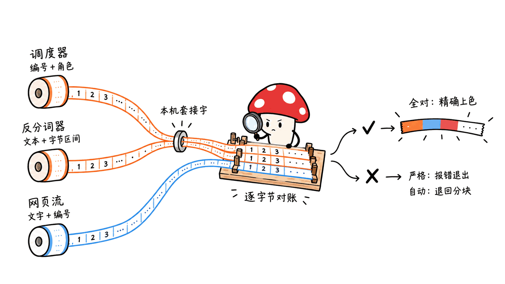
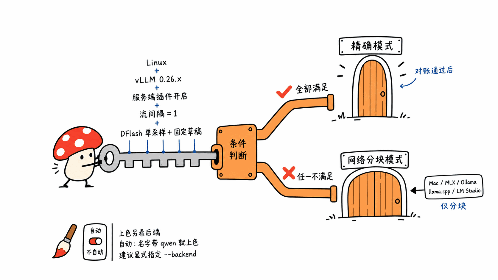

> 📌 开源仓库：hikarioyama/ParallelHue
> GitHub：https://github.com/hikarioyama/ParallelHue
> 协议：MIT ｜ 语言：Python（纯标准库） ｜ Stars：35 ｜ Forks：7 ｜ 创建：2026-08-04 ｜ 最近提交：2026-09-07（共 10 次提交）

---

**BLUF**：ParallelHue 是一个终端客户端，给本地大模型的多路并发流式输出上色，让你看到投机解码（speculative decoding）到底在怎么干活：哪几个 token 是一次验证步一口气吐出来的、哪一路卡住了、16 路请求怎么交错。它不是加速器，也不跑任何 GPU 代码。它真正值得看的地方是一条纪律：**颜色只画证据撑得住的东西。** 只有当 vLLM 调度器报的 token 身份、反分词器报的文本字节、和 HTTP 流里收到的文字三方逐字节对上，它才按「已验证的生成步」上色，并标 `EXACT TOKEN PROVENANCE`；对不上就老实标 `SSE CHUNK MODE`，颜色只代表网络分块。代价是这种精确模式只支持 vLLM 0.26.x，需要往 vLLM 的 7 个内部方法上挂钩，官方目前有效的精确证据只有一次 16 路 GLM-5.3-Flash 运行。我们在 Mac mini 上跑通了 72 个测试，用自写的模拟服务器验证了降级和失败逻辑，也发现了一个跟它自己的理念相冲突的漏洞：后端类型靠模型名猜，名字里带 `qwen` 就会亮起颜色。

这篇讲四件事：投机解码的「一步吐几个 token」为什么很难看清、ParallelHue 怎么证明每个 token 的来历、我们在本机实测到了什么、以及它对 Mac 用户意味着什么。

## 它想解决什么问题？

投机解码的基本流程是：一个便宜的草稿模型（或模型自带的 MTP 头、DFlash 这类块扩散草稿器）先猜出 K 个 token，大模型一次前向把它们全部验证。猜对的前缀直接收下，第一个猜错的位置由大模型给出正确 token；如果 K 个全对，大模型还能白送一个 token。所以**一个验证步可能吐出 1 到 K+1 个 token**。

问题在于，你平时能看到的只有两样东西：

- **一个总吞吐数字**，比如「1,425 tok/s」。它把 16 路并发、卡顿、突发和交错全部压扁成一个数。
- **一条流式输出**。很多人在社交媒体上发的「投机解码彩色演示」，其实是按 SSE 数据块轮换颜色，然后暗示「一种颜色 = 一次猜中」。但一个 SSE 块里装了什么，取决于服务端的发送节奏，跟草稿是否被接受没有必然关系。

ParallelHue 的 README 把这件事说得很直：并发、批处理和多 Agent 让「多路总吞吐」变成了本地推理的一等指标，但单个 tok/s 数字藏住了机制；而把传输分块画成「草稿命中」，就是在夸大证据。

## 它怎么证明每个 token 的来历？

这是这个仓库最有意思、也最重的部分。精确模式（`exact`）需要在 vLLM 服务端装一个插件，这个插件以 vLLM 通用插件入口 `parallelhue` 注册，但只有设置 `PARALLELHUE_VLLM_EXACT=1` 才会启用。

**两条独立的证据流。** vLLM V1 的调度器和输出处理器跑在不同进程里，而进程间传的 `EngineCoreOutput` 没有给插件留扩展字段。所以插件分两头发数据：

| 帧类型 | 来自哪个进程 | 装了什么 |
|---|---|---|
| `ProvenanceFrame` | 调度器（`Scheduler.update_from_output`） | 这一步生成的 token ID，以及每个 token 的角色：`accepted_draft` / `target` / `bonus` |
| `TextFrame` | 输出处理器 + 原生反分词器 | 增量文本、每段 UTF-8 字节对应哪些 token 的追踪区间、步编号 |

两种帧都走一个按运行 ID 命名的 AF_UNIX 数据报套接字，路径是 `$PARALLELHUE_SOCKET_DIR/<run_id>.sock`，目录权限必须是 0700、套接字 0600、属主是当前用户，插件发送前会逐项校验，拒绝符号链接。

**角色怎么判定？** 读 `vllm_plugin.py` 的 `_classify_roles`：一个验证步生成了 n 个 token，前 n−1 个必须逐个等于调度器排进去的草稿 token，标 `accepted_draft`；最后一个如果是在所有草稿都被接受之后多出来的，标 `bonus`，否则标 `target`（大模型的纠正）。被拒绝的草稿不是输出，不显示。只要调度器每步采样数不是 1、启用了自适应草稿长度、或者投机方法不是 `dflash`，这个函数直接返回「无法判定」。

**客户端怎么对账？** 客户端给每个请求一个形如 `ph1_<32位十六进制>_<流编号>` 的 ID，同时请求 `return_token_ids: true`。收到 SSE 数据后，按请求 ID、绝对 token 偏移、token ID 和各自的序列号把两种帧拼起来，再跟 SSE 文本逐字节比对。README 举了个真实的坑：GLM 会把 `<` 这个字符压到下一个增量才发，但 token ID 已经先到了，客户端要缓冲这种不完整的前缀，等文本凑齐再验。推理解析器或工具调用解析器改写、删掉了文本，就算不匹配。

**颜色画的是什么？** 这点容易误解：精确模式下，颜色代表**已验证的生成步**，不是 token 角色。每个请求里第一次看到的新步用调色板第一种颜色，之后每个新步轮换到下一种，四色循环（xterm-256 的 46/196/27/226，即绿、红、蓝、黄）。同一步吐出的所有字符同色，哪怕它们角色不同。角色信息另外计数，运行结束时打印成 `[accepted draft=… tokens; target=… tokens; bonus=… tokens; mixed spans=…]`。一个 Unicode 字符如果横跨两步、无法如实归属，就保持无色。

**三种模式的分工：**

| 模式 | 行为 | 标签 |
|---|---|---|
| `exact` | 遥测缺失、序列有缺口、token 或文本对不上，**直接报错退出** | `EXACT TOKEN PROVENANCE` |
| `auto`（默认） | 先尝试对账，对不上就**可见地**降级 | 能对上时 exact，否则 `SSE CHUNK MODE` |
| `chunk` | 不读遥测，每个 SSE 块换一种颜色 | 永远是 `SSE CHUNK MODE` |

另外，只有后端配置被识别为投机解码（`mtp`、`dspark`、`dflash`）时才上色，`generic` 保持单色；设置 `NO_COLOR` 则一律单色。

## 它挂进了 vLLM 的哪些地方？

精确模式的代价全在这里。插件用 monkeypatch 包住了 vLLM 的这些内部方法：

- `OutputProcessor.process_outputs`：取引擎时间戳，映射成步编号，并检查 `stream_interval` 必须是 1
- `RequestOutputCollector.put`：拿到每个请求的增量输出
- `RequestState.__init__` 和 `RequestState._new_completion_output`：登记反分词器、截获每次增量文本
- `FastIncrementalDetokenizer.decode_next` 和 `SlowIncrementalDetokenizer.decode_next`：记录每个 token 解码出的字节片段
- `Scheduler.update_from_output`：在 vLLM 修改请求状态之前先记下偏移，之后生成角色帧

一共 7 个挂钩点。版本检查写死了：只认 `0.26.x`，外加一个 GLM 镜像里的特定 fork 版本 `0.1.dev20051+g487ecf187`，还会逐个检查这些方法的参数签名。不满足就大声报错，不会悄悄装上。

这个设计的取舍很清楚：**失败时响亮，是对的；但每次 vLLM 升级都可能要重写。** 这些都不是公开 API。一个人维护、10 次提交的项目，要长期追 vLLM 的内部重构，负担不小。README 自己的路线图写的是要接更多推理引擎、成为「行业标准」，从现在的代码结构看，这是很远的目标。

还有一个值得注意的工程细节：插件的发送队列是有界的（默认 256），满了就**丢帧**，保证不阻塞 vLLM 的热路径。丢帧会让客户端看到序列缺口，于是精确模式按设计报错、auto 模式降级。也就是说，负载越重，越可能看不到精确颜色。这是正确的取舍，但你得知道。

## 官方到底验证过什么？

仓库有一个 `measurements/` 目录，写了一份「诚实数字守则」：每个数字都要带上硬件、软件、请求形状和样本数 n，n=1 就是一次运行，不是对比。我们读了全部记录，结论是它确实做到了，而且对自己很克制：

| 场景 | 结果 | 能说明什么 |
|---|---|---|
| GLM-5.3-Flash EXL3 4bpw + DFlash，2× RTX PRO 6000，TP2，16 路并发 | 精确溯源 PASS，16 个请求各 1,024 个已验证 token，共 16,384 个，全程没降级 | 当前协议唯一的精确证据，**不是吞吐对比** |
| 官方 vLLM 0.26.0 + Qwen2.5-0.5B-Instruct，RTX PRO 6000 Blackwell Max-Q | 调度步遥测 PASS，n=1 | 旧版协议，不验证当前的角色协议 |
| DeepSeek-V4-Flash-0731，2× RTX PRO 6000，16 路 | 总吞吐约 1,425.7 tok/s，n=1 | **明确标注不是 ParallelHue 精确证据**，是前身渲染器加自定义插件跑的 |
| Gemma 3 12B AWQ，RTX 5070 Ti | 四种注意力后端都在服务健康检查前失败，n=0 | 负面兼容记录，**不说明需要特定 GPU** |

DeepSeek 那条记录的原始计数很有信息量，我们顺手算了一下（以下是我们的推算，不是仓库的结论）：已接受草稿 24,987 个、非草稿 token 7,013 个，加起来正好 32,000 = 16 路 × 2,000 token；草稿总数 35,060，接近 7,013 × 5，和记录里的草稿深度 K=5 对得上。由此可得草稿接受率约 71.3%，平均每个验证步吐出约 4.56 个 token。这组数据用的是 temperature 0，而 ParallelHue 客户端默认 temperature 是 0.8，接受率会随温度变化，两者不能直接比。

说实话，最打眼的 1,425 tok/s 恰恰是被作者自己排除在证据之外的数字。这种自我约束在 GitHub Trending 项目里很少见。

## 实测：在 Mac mini 上能验证什么？

**环境**：Mac mini（Apple M4，16GB），macOS 26.6.2；Python 3.12 venv；仓库 commit `c557331`。本机没有 NVIDIA GPU，也没有 vLLM，所以**精确模式的真实链路我们无法复现**。我们能验证的是客户端这一半。

**测试套件**：`pip install -e . pytest` 后跑 `python -m pytest`，**72 个用例全部通过，用时 1.30 秒**。pyproject 的分类标签只写了 Linux，但纯标准库的客户端在 macOS 上一样能跑。测试里的 vLLM 全是桩对象，仓库也没有配置 CI。

**模拟服务器**：我们用 Python 标准库写了一个 OpenAI 兼容的 SSE 服务器，每个数据块带 1 到 3 个 token ID，模拟投机解码「一次吐多个」的节奏，还故意在输出里塞了一段 ANSI 转义 `\x1b[31m`，看它会不会被原样打到终端。结果：

| 测试 | 结果 |
|---|---|
| `--mode auto`，模型名 `m`（推断为 generic） | 标 `[SSE CHUNK MODE]`，输出单色 |
| `--mode chunk --backend mtp` | 每个 SSE 块依次换绿、红、蓝、黄，标签仍是 `SSE CHUNK MODE` |
| 输出里的 `\x1b[31m` 转义 | 被清洗掉，只剩文字，终端没变红 |
| `NO_COLOR=1` | 全部单色 |
| `--mode exact`，服务器没有遥测 | 约 2.1 秒后报 `token provenance or text does not match the server output`，退出码 2 |
| `--mode auto`，接收套接字正常 | 同样先等约 2 秒，然后降级为 `SSE CHUNK MODE` |
| 并发 2 但只给一个提示词 | 拒绝：`prompt has fewer than 2 prompt strings` |
| 提示词文件里两条相同 | 拒绝：`must contain distinct prompt strings` |

服务端日志里看到客户端实际发出的请求：`request_id` 为 `ph1_<32位十六进制>_0`，`temperature` 0.8，`seed` 等于流编号，`return_token_ids` 为 true。

**三个在 Mac 上会遇到的坑：**

1. **不给套接字目录，精确/自动模式默认去找 `/run/user/<uid>`**，macOS 上没有这个目录，精确模式直接报 `Read-only file system: '/run'`。
2. **套接字路径不能太长。** macOS 的 Unix 套接字路径上限是 104 字节，我们把目录放在一个较深的临时路径下时，精确模式报 `AF_UNIX path too long`，自动模式则悄悄退回 chunk。
3. **普通服务器上 auto 模式会让首个输出晚约 2 秒**，因为它先等遥测。如果你连的是 Ollama、llama.cpp 或 LM Studio，直接用 `--mode chunk` 更干脆。

tmux 多窗格模式在我们的沙箱环境里无法分配终端（`fork failed: Device not configured`），这是测试环境的限制，不代表项目有问题，但我们也就没法验证它的 4×2 网格布局。

## 我们发现的漏洞：颜色开关是按名字猜的

ParallelHue 的原则是「非投机解码的后端保持单色」。但当 `--backend` 是默认的 `auto` 时，它判断后端类型的方法是：先看几个环境变量里有没有 `dspark`、`dflash`、`mtp`，没有的话就看**模型名**。名字里有 `deepseek` 就当 dspark，有 `qwen`、`mtp`、`a3b`、`a6b` 就当 mtp。我们直接调它的函数：

| 模型名 | 推断结果 | 是否上色 |
|---|---|---|
| `Qwen/Qwen2.5-7B-Instruct` | mtp | 是 |
| `qwen3:8b`（Ollama 风格） | mtp | 是 |
| `DeepSeek-R1-Distill-Qwen-7B` | dspark | 是 |
| `Nemotron-3-Nano-30B-A3B` | mtp | 是 |
| `Llama-3.1-8B` | generic | 否 |
| `gpt-oss-20b` | generic | 否 |
| `glm-5.3-flash-local`（它自己的 DFlash 示例） | generic | 否 |

也就是说，你用 Ollama 跑一个完全没开投机解码的 `qwen3:8b`，ParallelHue 会给它按 SSE 块轮换四色。反过来，它自己主推的 GLM + DFlash 组合，如果不显式传 `--backend dflash`，会被当成普通后端、不上色（它的示例脚本确实显式传了）。

这不算大错：chunk 模式的文字标签始终写着 `SSE CHUNK MODE`，没有撒谎。但一个把「颜色不能暗示没有证据的东西」写进设计哲学的项目，把上色开关交给字符串匹配，是自相矛盾的。**实用建议：永远显式传 `--backend`。**

## 顺带一提：summary 面板的数字怎么算的？

用 `--tmux` 并发跑时，会多开一个汇总窗格。它的数字来自服务端的 Prometheus `/metrics`：开跑前抓一次计数器，所有窗格结束后再抓一次，差值除以墙钟时间就是「总生成 tok/s」。要注意两点：

- 这个差值包括**同一时间段里服务器上的所有流量**，不只是 ParallelHue 发的请求；时间里也包含了预填充。
- 「平均生成 tok/s」是总吞吐除以并发数，不是逐路测量后再取平均。

投机解码的接受率（`spec accept rate`）同样来自 vLLM 的 `spec_decode_num_accepted_tokens_total` 和 `spec_decode_num_draft_tokens_total` 计数器差值。

## 跟同类工具比，它的位置在哪？

| 工具 | 看到什么 | 证据来源 | 并发多路 |
|---|---|---|---|
| LM Studio 0.3.10 起的「已接受草稿 token 可视化」 | 按 token 来源着色，草稿接受的显示为绿色 | 它自己的推理引擎内部 | 聊天界面，单路 |
| vLLM Prometheus 指标 | 接受数、草稿数、生成数等累计计数 | 服务端计数器 | 只有总数，看不到单个 token |
| 按 SSE 块轮换颜色的演示 | 传输分块 | 无 | 取决于实现 |
| **ParallelHue** | 按验证步着色，另计 token 角色 | 调度器 + 反分词器遥测，与 SSE 逐字节对账 | 最多按 tmux 网格多路并排 |

LM Studio 在 2025-02-18 发布的 0.3.10 就提供了草稿 token 着色，它的博客原话是「越绿越好」。区别在于：LM Studio 是自带推理引擎的桌面应用，着色在它自己内部完成；ParallelHue 是一个外挂在 vLLM 这类服务端引擎上的独立客户端，重点在多路并发和「证据不足就不画」。它读的 vLLM 计数器本身，也是现成的公开指标。

本站之前写过的 HauhauCS 的 FastMTP 投机解码评测（https://blog.mushroom.cv/blog/hauhaucs-qwen3-8-27b-gguf-fastmtp-speculative-decoding-kp-quant/）和 DeepSeek-V4-Flash-Vision-Exp 的 DSpark 介绍（https://blog.mushroom.cv/blog/deepseek-v4-flash-vision-exp-multimodal-agent-dspark/），讲的都是「投机解码能快多少」。ParallelHue 回答的是另一个问题：「快出来的这些 token，到底是怎么来的」。

## 适合谁，不适合谁？

**适合**：在 Linux 工作站上用 vLLM 0.26.x 跑 DFlash 的人，想在调参（草稿长度、并发数、KV 精度）时直观看到每一路的突发和卡顿；写推理引擎、做投机解码研究的人，想要一个「怎么把遥测做到可验证」的参考实现；做技术演示、又不想被同行指出「你这颜色其实是网络分块」的人。

**不适合**：Mac 和 MLX 用户（精确模式完全不可用，维护者自己说没有 MLX 环境）；用 Ollama、llama.cpp、LM Studio 的人（只能用 chunk 模式，它能提供的信息跟一个会上色的 curl 差不多）；想要吞吐基准工具的人（它明确声明不对吞吐、延迟、质量做任何结论）；需要远程或多用户部署的场景（套接字是单机、单用户的信任边界）。

对我们自己的 Mac 本地推理栈来说，ParallelHue 目前用不上。但它的思路值得借：**如果 mlx_lm.server 这类 Mac 推理服务要做投机解码的可视化，最好从一开始就把「token 身份」和「文本字节」作为两条可对账的证据流吐出来，而不是事后按分块猜。** 这恰好是 README 里维护者公开征求的适配方向。

## 常见问题

**Q：ParallelHue 能让本地大模型变快吗？**
A：不能。它是可视化客户端，不含 CUDA 代码，也不改模型或调度参数。README 明确声明不对吞吐、延迟或质量做任何结论。

**Q：精确模式需要什么条件？**
A：Linux；vLLM 0.26.x 或它支持的那个 GLM fork 版本；服务端安装 ParallelHue 并设置 `PARALLELHUE_VLLM_EXACT=1`；`stream_interval` 保持默认的 1；客户端和服务端共享同一个私有套接字目录和用户 ID。DFlash 的角色判定还要求每步单次采样、草稿长度不自适应。

**Q：chunk 模式的颜色有什么意义？**
A：只代表 SSE 传输分块，每来一个块换一种颜色。它不代表草稿是否被接受，也不代表调度步。ParallelHue 在这个模式下会一直标注 `SSE CHUNK MODE`。

**Q：Mac 上能用吗？**
A：客户端能跑，72 个测试在 macOS 上全过，chunk 模式对任何 OpenAI 兼容服务都能用。但精确模式依赖 vLLM 服务端插件，Mac 上用不了；另外要自己指定一个路径较短的套接字目录，否则会报错。

**Q：为什么我的普通 Qwen 模型也显示彩色？**
A：因为默认 `--backend auto` 按模型名猜后端类型，名字里有 `qwen` 就当成 MTP 投机解码。显式传 `--backend generic` 就会恢复单色。

## 一手源

- GitHub 仓库：https://github.com/hikarioyama/ParallelHue
- 测量记录索引：https://github.com/hikarioyama/ParallelHue/tree/main/measurements
- vLLM 插件实现：https://github.com/hikarioyama/ParallelHue/blob/main/src/parallelhue/vllm_plugin.py
- DFlash 论文：https://arxiv.org/abs/2602.06036
- vLLM Speculators 的 DFlash 文档：https://docs.vllm.ai/projects/speculators/en/latest/user_guide/algorithms/dflash/
- LM Studio 0.3.10 发布说明：https://lmstudio.ai/blog/lmstudio-v0.3.10

---

> © 2026 Author: Mycelium Protocol. 本文采用 [CC BY 4.0](https://creativecommons.org/licenses/by/4.0/deed.zh) 授权——欢迎转载和引用，须注明作者姓名及原文链接，不得去除署名后以原创发布。

<!--EN-->

> 📌 Repository: hikarioyama/ParallelHue
> GitHub: https://github.com/hikarioyama/ParallelHue
> License: MIT | Language: Python (standard library only) | Stars: 35 | Forks: 7 | Created: 2026-08-04 | Last commit: 2026-09-07 (10 commits total)

---

**BLUF**: ParallelHue is a terminal client that colors the concurrent streaming output of a local LLM so you can see what speculative decoding is actually doing: which tokens came out together in one verification step, which stream stalled, and how 16 requests interleave. It is not an accelerator and runs no GPU code. What makes it worth a look is one rule: **color only what the evidence supports.** It colors by "verified generation step" and labels the output `EXACT TOKEN PROVENANCE` only when three sources agree byte for byte: the token identities reported by the vLLM scheduler, the text bytes reported by the detokenizer, and the text that arrived over HTTP. When they don't agree, it says `SSE CHUNK MODE`, and the colors mean network chunks and nothing more. The cost is that exact mode supports only vLLM 0.26.x and hooks seven internal vLLM methods, and the only current exact evidence is a single 16-stream GLM-5.3-Flash run. On a Mac mini, all 72 tests passed, and a mock server we wrote confirmed its downgrade and fail-closed logic. We also found a gap that contradicts its own philosophy: the backend type is guessed from the model name, and any name containing `qwen` turns colors on.

This post covers four things: why "several tokens per step" is hard to see, how ParallelHue proves where each token came from, what we verified locally, and what it means for Mac users.

## What problem is it trying to solve?

Speculative decoding works like this: a cheap drafter (a small draft model, a built-in MTP head, or a block-diffusion drafter such as DFlash) guesses K tokens, and the large model verifies all of them in one forward pass. The correct prefix is kept. At the first wrong position, the large model supplies the right token; if all K were right, it gets one extra token for free. So **a single verification step can emit anywhere from 1 to K+1 tokens**.

The trouble is that you normally see only two things:

- **One aggregate throughput number**, say "1,425 tok/s". It flattens 16 concurrent streams, stalls, bursts and interleaving into a single figure.
- **A streaming output.** Many "colorful speculative decoding demos" on social media actually rotate colors per SSE data chunk and imply that one color equals one successful guess. But what goes into an SSE chunk depends on the server's send cadence, not on whether drafts were accepted.

ParallelHue's README puts it plainly: concurrency, batching and multi-agent workloads make aggregate multi-stream throughput a first-class metric for local inference, but a single tok/s number hides the mechanism, and painting transport chunks as "draft hits" overstates the evidence.

## How does it prove where each token came from?

This is the most interesting part of the repository, and the heaviest. Exact mode needs a plugin on the vLLM server. It registers under vLLM's general plugin entry point as `parallelhue`, but only activates when `PARALLELHUE_VLLM_EXACT=1` is set.

**Two independent evidence streams.** In vLLM V1, the scheduler and the output processor run in different processes, and the `EngineCoreOutput` passed between them has no extension field for plugins. So the plugin sends data from both sides:

| Frame type | Process | Contents |
|---|---|---|
| `ProvenanceFrame` | Scheduler (`Scheduler.update_from_output`) | Token IDs generated in this step, and each token's role: `accepted_draft` / `target` / `bonus` |
| `TextFrame` | Output processor + native detokenizer | Incremental text, trace spans mapping UTF-8 bytes to tokens, step ID |

Both frame types go over a per-run AF_UNIX datagram socket at `$PARALLELHUE_SOCKET_DIR/<run_id>.sock`. The directory must be mode 0700, the socket 0600, both owned by the current user. The plugin checks all of this before each send and rejects symlinks.

**How are roles decided?** From `_classify_roles` in `vllm_plugin.py`: if a verification step generated n tokens, the first n−1 must each equal the draft tokens the scheduler queued, and they are labeled `accepted_draft`. The last one is `bonus` if it came after every draft was accepted, and `target` (the large model's correction) otherwise. Rejected drafts are not output and are not shown. If the scheduler samples more than one token per step, uses adaptive draft length, or the speculative method is not `dflash`, the function returns "cannot classify".

**How does the client reconcile?** Each request gets an ID of the form `ph1_<32 hex chars>_<stream index>`, and the client asks for `return_token_ids: true`. As SSE data arrives, it joins the two frame types by request ID, absolute token offset, token ID and each source's sequence number, then compares the result byte for byte against the SSE text. The README gives a real edge case: GLM holds the `<` character until the next delta while its token ID has already arrived, so the client buffers incomplete prefixes and verifies once the text is complete. If a reasoning or tool-call parser rewrites or removes text, that counts as a mismatch.

**What do the colors mean?** This is easy to misread. In exact mode, color marks **verified generation steps**, not token roles. The first new step seen in each request gets the first palette color, and each later new step advances to the next, cycling through four colors (xterm-256 codes 46/196/27/226: green, red, blue, yellow). Every character from the same step shares a color even if the tokens have different roles. Roles are counted separately and printed at the end as `[accepted draft=… tokens; target=… tokens; bonus=… tokens; mixed spans=…]`. A Unicode character that spans two steps and can't be attributed honestly stays uncolored.

**The three modes:**

| Mode | Behavior | Label |
|---|---|---|
| `exact` | Missing telemetry, sequence gaps, or token/text mismatches **exit with an error** | `EXACT TOKEN PROVENANCE` |
| `auto` (default) | Tries to reconcile, **visibly** downgrades if it can't | exact when reconciled, otherwise `SSE CHUNK MODE` |
| `chunk` | Ignores telemetry; changes color on every SSE chunk | Always `SSE CHUNK MODE` |

Color is also gated on the backend profile: only speculative profiles (`mtp`, `dspark`, `dflash`) get color, `generic` stays monochrome, and `NO_COLOR` forces monochrome everywhere.

## Where does it hook into vLLM?

This is where exact mode pays its price. The plugin monkeypatches these internal vLLM methods:

- `OutputProcessor.process_outputs`: takes the engine timestamp, maps it to a step ID, and requires `stream_interval` to be 1
- `RequestOutputCollector.put`: gets each request's incremental output
- `RequestState.__init__` and `RequestState._new_completion_output`: registers the detokenizer and captures each text delta
- `FastIncrementalDetokenizer.decode_next` and `SlowIncrementalDetokenizer.decode_next`: records the byte fragment each token decodes to
- `Scheduler.update_from_output`: records offsets before vLLM mutates request state, then emits role frames

That is seven hook points. The version check is hard-coded: it accepts only `0.26.x` plus one specific fork version from a GLM image, `0.1.dev20051+g487ecf187`, and it checks each method's parameter signature. If anything is off, it fails loudly instead of installing silently.

The trade-off is clear. **Failing loudly is the right call, but any vLLM upgrade may require a rewrite.** None of these are public APIs. For a one-person project with 10 commits, keeping up with vLLM's internal refactors is a real burden. The README's roadmap talks about more inference engines and becoming an "industry standard"; judging from the current code, that is a long way off.

One more engineering detail matters. The plugin's send queue is bounded (256 by default) and **drops frames** when full, so it never blocks vLLM's hot path. Dropped frames show up on the client as sequence gaps, so exact mode errors out and auto mode downgrades, by design. In other words, the heavier the load, the more likely you lose exact colors. That is the right trade-off, but you should know about it.

## What has actually been validated?

The repository has a `measurements/` directory with an "honest-number policy": every number carries its hardware, software, request shape and sample count n, and n=1 means one run, not a comparison. We read every record. It does follow the policy, and it is restrained about itself:

| Case | Result | What it shows |
|---|---|---|
| GLM-5.3-Flash EXL3 4bpw + DFlash, 2× RTX PRO 6000, TP2, 16 concurrent | Exact provenance PASS: 16 requests × 1,024 verified tokens = 16,384, no downgrade | The only exact evidence for the current protocol; **not a throughput comparison** |
| Official vLLM 0.26.0 + Qwen2.5-0.5B-Instruct, RTX PRO 6000 Blackwell Max-Q | Scheduler-step telemetry PASS, n=1 | Historical protocol; does not validate the current role protocol |
| DeepSeek-V4-Flash-0731, 2× RTX PRO 6000, 16 concurrent | ~1,425.7 tok/s aggregate, n=1 | **Explicitly not ParallelHue exact evidence**; produced by a precursor renderer with a custom plugin |
| Gemma 3 12B AWQ, RTX 5070 Ti | All four attention backends failed before server health, n=0 | Negative compatibility record; **does not imply a GPU requirement** |

The raw counts in the DeepSeek record say a lot. Our own arithmetic (not the repository's claim): 24,987 accepted draft tokens plus 7,013 non-draft tokens is exactly 32,000 = 16 streams × 2,000 tokens. Total drafts were 35,060, close to 7,013 × 5, which matches the recorded draft depth K=5. That implies a draft acceptance rate of about 71.3% and about 4.56 tokens emitted per verification step on average. That run used temperature 0, while the ParallelHue client defaults to 0.8, and acceptance rates change with temperature, so the two are not directly comparable.

Frankly, the most eye-catching number, 1,425 tok/s, is exactly the one the author excluded from the evidence. That kind of self-restraint is rare among GitHub Trending projects.

## Hands-on: what can we verify on a Mac mini?

**Environment**: Mac mini (Apple M4, 16 GB), macOS 26.6.2; Python 3.12 venv; repository at commit `c557331`. No NVIDIA GPU and no vLLM here, so **we could not reproduce the real exact-mode path**. What we could verify is the client half.

**Test suite**: after `pip install -e . pytest`, `python -m pytest` ran **72 tests, all passing, in 1.30 seconds**. The pyproject classifiers list only Linux, but the standard-library client runs fine on macOS. vLLM is stubbed throughout the tests, and the repository has no CI configuration.

**Mock server**: we wrote an OpenAI-compatible SSE server with the Python standard library. Each chunk carries 1 to 3 token IDs to mimic speculative decoding's multi-token bursts, and we deliberately injected an ANSI escape, `\x1b[31m`, into the output to see whether it would reach the terminal. Results:

| Test | Result |
|---|---|
| `--mode auto`, model name `m` (inferred as generic) | Labeled `[SSE CHUNK MODE]`, monochrome output |
| `--mode chunk --backend mtp` | Each SSE chunk cycles green, red, blue, yellow; label stays `SSE CHUNK MODE` |
| The `\x1b[31m` escape in the output | Stripped; only the text remains and the terminal does not turn red |
| `NO_COLOR=1` | Monochrome throughout |
| `--mode exact`, server with no telemetry | After ~2.1 s: `token provenance or text does not match the server output`, exit code 2 |
| `--mode auto`, receiver socket working | Also waits ~2 s first, then downgrades to `SSE CHUNK MODE` |
| Concurrency 2 with a single prompt | Rejected: `prompt has fewer than 2 prompt strings` |
| Prompt file with two identical entries | Rejected: `must contain distinct prompt strings` |

The mock server's log shows what the client actually sends: `request_id` of `ph1_<32 hex chars>_0`, `temperature` 0.8, `seed` equal to the stream index, and `return_token_ids` true.

**Three gotchas on a Mac:**

1. **Without a socket directory, exact and auto modes default to `/run/user/<uid>`**, which doesn't exist on macOS. Exact mode fails with `Read-only file system: '/run'`.
2. **The socket path can't be long.** macOS limits Unix socket paths to 104 bytes. With the directory under a deep temp path, exact mode failed with `AF_UNIX path too long`, and auto mode quietly fell back to chunk.
3. **On an ordinary server, auto mode delays the first output by about 2 seconds** while it waits for telemetry. If you're connecting to Ollama, llama.cpp or LM Studio, just use `--mode chunk`.

The tmux multi-pane mode couldn't allocate a terminal in our sandbox (`fork failed: Device not configured`). That's a limitation of our test environment, not the project, but it means we couldn't verify its 4×2 grid layout.

## The gap we found: the color switch is guessed from the name

ParallelHue's rule is that non-speculative backends stay monochrome. But when `--backend` is left at the default `auto`, it decides the backend type by first checking a few environment variables for `dspark`, `dflash` or `mtp`, and then falling back to **the model name**. A name containing `deepseek` means dspark; `qwen`, `mtp`, `a3b` or `a6b` means mtp. We called the function directly:

| Model name | Inferred | Colored? |
|---|---|---|
| `Qwen/Qwen2.5-7B-Instruct` | mtp | Yes |
| `qwen3:8b` (Ollama style) | mtp | Yes |
| `DeepSeek-R1-Distill-Qwen-7B` | dspark | Yes |
| `Nemotron-3-Nano-30B-A3B` | mtp | Yes |
| `Llama-3.1-8B` | generic | No |
| `gpt-oss-20b` | generic | No |
| `glm-5.3-flash-local` (its own DFlash example) | generic | No |

So if you run a plain `qwen3:8b` in Ollama with no speculative decoding at all, ParallelHue cycles four colors across its SSE chunks. Conversely, its own flagship GLM + DFlash setup is treated as generic and left uncolored unless you pass `--backend dflash` explicitly (its example scripts do).

This isn't a serious bug: in chunk mode the text label always says `SSE CHUNK MODE`, so nothing is misreported. But for a project whose design philosophy is that color must never imply what the evidence doesn't support, leaving the color switch to substring matching is inconsistent. **Practical advice: always pass `--backend` explicitly.**

## An aside: how are the summary pane's numbers computed?

When you run concurrent streams with `--tmux`, an extra summary pane appears. Its numbers come from the server's Prometheus `/metrics`: it snapshots the counters before the run, again after all panes finish, and divides the difference by wall-clock time to get "aggregate generation tok/s". Two caveats:

- The difference includes **all traffic on the server during that window**, not just ParallelHue's requests, and the time includes prefill.
- "Mean generation tok/s" is the aggregate divided by concurrency, not a per-stream measurement averaged afterwards.

The speculative acceptance rate (`spec accept rate`) likewise comes from differences in vLLM's `spec_decode_num_accepted_tokens_total` and `spec_decode_num_draft_tokens_total` counters.

## How does it compare with similar tools?

| Tool | What you see | Evidence source | Concurrent streams |
|---|---|---|---|
| LM Studio's "accepted draft token visualization" (since 0.3.10) | Tokens colored by origin; accepted draft tokens in green | Its own inference engine, internally | Chat UI, single stream |
| vLLM Prometheus metrics | Cumulative counts: accepted, drafted, generated | Server-side counters | Totals only; no per-token view |
| Demos that rotate colors per SSE chunk | Transport chunks | None | Depends on the demo |
| **ParallelHue** | Colored by verified step, with roles counted separately | Scheduler + detokenizer telemetry, reconciled byte for byte with SSE | Multiple streams side by side in a tmux grid |

LM Studio shipped draft-token coloring in 0.3.10 on 2025-02-18; its blog says "the more green, the better". The difference is that LM Studio is a desktop app with its own inference engine and does the coloring internally, while ParallelHue is a separate client bolted onto a server engine like vLLM, focused on concurrent streams and on refusing to draw without evidence. The vLLM counters it reads are themselves standard public metrics.

This blog's earlier pieces on HauhauCS's FastMTP speculative decoding (https://blog.mushroom.cv/blog/hauhaucs-qwen3-8-27b-gguf-fastmtp-speculative-decoding-kp-quant/) and on DSpark in DeepSeek-V4-Flash-Vision-Exp (https://blog.mushroom.cv/blog/deepseek-v4-flash-vision-exp-multimodal-agent-dspark/) were about how much faster speculative decoding makes things. ParallelHue answers a different question: where did those extra tokens actually come from?

## Who is it for, and who should skip it?

**Good fit**: people running DFlash on vLLM 0.26.x on a Linux workstation who want to see each stream's bursts and stalls while tuning draft length, concurrency or KV precision; inference-engine developers and speculative-decoding researchers who want a reference for making telemetry verifiable; anyone giving a technical demo who doesn't want a peer pointing out that the colors are just network chunks.

**Poor fit**: Mac and MLX users (exact mode is unavailable, and the maintainers say they have no MLX environment); Ollama, llama.cpp and LM Studio users (chunk mode only, which tells you about as much as a curl that prints in color); anyone wanting a throughput benchmark (it explicitly makes no throughput, latency or quality claims); remote or multi-user deployments (the socket is a single-host, single-user trust boundary).

For our own Mac-based local inference stack, ParallelHue isn't usable today. But the idea is worth borrowing: **if a Mac inference server such as mlx_lm.server ever adds speculative-decoding visualization, it should emit "token identity" and "text bytes" as two reconcilable evidence streams from the start, rather than guessing from chunks afterwards.** That is exactly the kind of adapter the maintainers are asking for in the README.

## FAQ

**Q: Does ParallelHue make local LLMs faster?**
A: No. It is a visualization client with no CUDA code, and it doesn't change model or scheduler settings. The README explicitly makes no throughput, latency or quality claims.

**Q: What does exact mode require?**
A: Linux; vLLM 0.26.x or the supported GLM fork version; ParallelHue installed on the server with `PARALLELHUE_VLLM_EXACT=1`; `stream_interval` left at its default of 1; and a client and server sharing the same private socket directory and user ID. DFlash role classification also requires single-sample verification and non-adaptive draft length.

**Q: What do chunk-mode colors mean?**
A: Only SSE transport chunks: the color changes with each chunk. They say nothing about draft acceptance or scheduler steps, and ParallelHue labels this mode `SSE CHUNK MODE` throughout.

**Q: Does it work on a Mac?**
A: The client does: all 72 tests pass on macOS, and chunk mode works against any OpenAI-compatible server. Exact mode depends on a vLLM server plugin, so it's unavailable on a Mac, and you'll need to specify a socket directory with a short path to avoid errors.

**Q: Why is my ordinary Qwen model showing colors?**
A: Because the default `--backend auto` guesses the backend from the model name and treats anything containing `qwen` as MTP speculative decoding. Pass `--backend generic` explicitly to get monochrome output.

## Primary sources

- GitHub repository: https://github.com/hikarioyama/ParallelHue
- Measurement index: https://github.com/hikarioyama/ParallelHue/tree/main/measurements
- vLLM plugin implementation: https://github.com/hikarioyama/ParallelHue/blob/main/src/parallelhue/vllm_plugin.py
- DFlash paper: https://arxiv.org/abs/2602.06036
- vLLM Speculators DFlash documentation: https://docs.vllm.ai/projects/speculators/en/latest/user_guide/algorithms/dflash/
- LM Studio 0.3.10 release notes: https://lmstudio.ai/blog/lmstudio-v0.3.10

---

> © 2026 Author: Mycelium Protocol. Licensed under [CC BY 4.0](https://creativecommons.org/licenses/by/4.0/) — free to share and adapt with attribution. You must credit the author and link to the original; removing attribution and republishing as original is not permitted.
