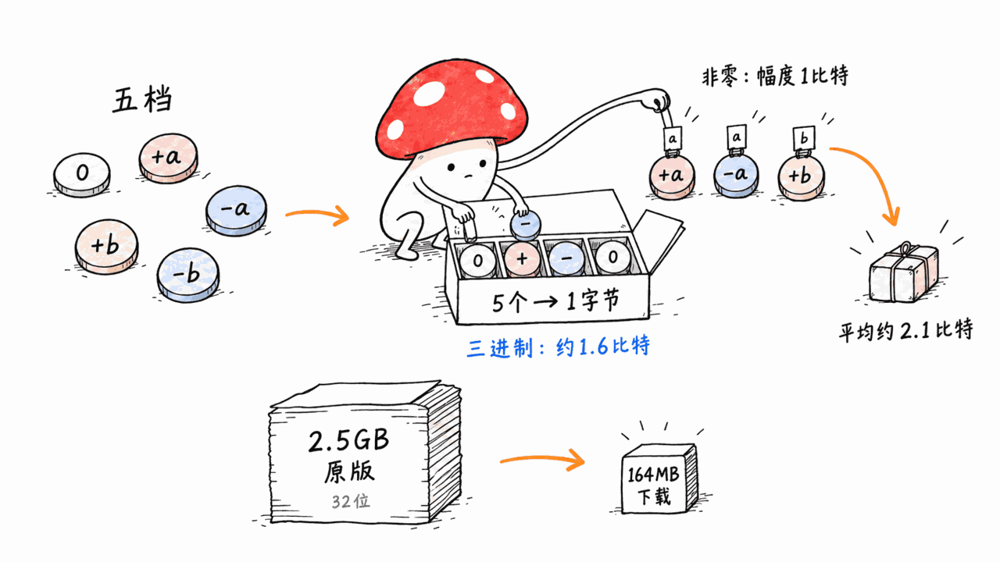
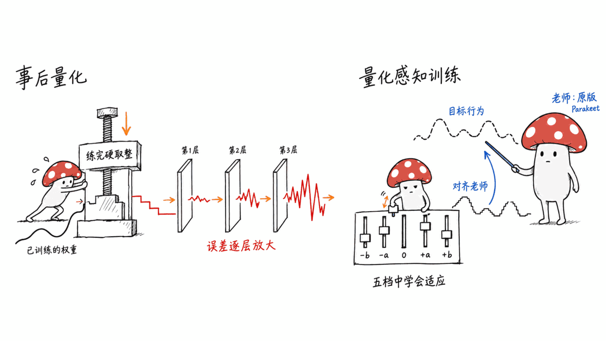
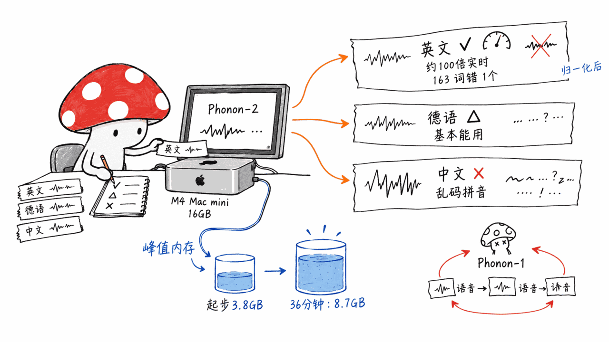
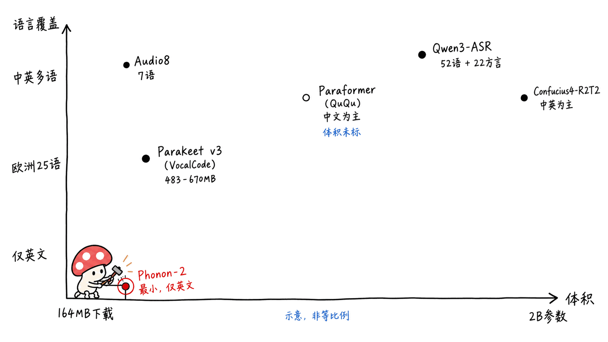

> 📌 开源模型：FermionResearch/Phonon-2
> HuggingFace：https://huggingface.co/FermionResearch/Phonon-2
> 权重许可：CC-BY-4.0 ｜ CLI 与代码：Apache-2.0 ｜ 基座：nvidia/parakeet-tdt-0.6b-v3 ｜ 上传：2026-09-28 ｜ 138 likes / 1,325 次下载（2026-10-02）

---

**BLUF**：Phonon-2 是一家叫 Fermion Research 的小实验室把 NVIDIA 的 Parakeet TDT 0.6B v3 「重新训练到只剩五种取值」之后的英文语音识别模型：编码器每个权重只能是 0、±a、±b 之一，折合约 2.1 比特，下载 164MB，比官方原版 2.5GB 的 .nemo 文件小 15 倍。官方自己用 Open ASR Leaderboard 的评分代码跑出七集平均词错率 5.21%，原版是 4.96%，掉了 0.25 个百分点；榜单维护者已经在 HuggingFace 官方 Space 上复跑，但截至今天结果还没上榜。我们在一台 **16GB 的 M4 Mac mini** 上装了它的 pip 包实测：**解码稳定在约 100 倍实时**（官方在 M5 MacBook Air 上报 174 倍），53 秒的英文合成朗读归一化后 163 个词只错 1 个，德语也基本能认；但**峰值内存 3.8GB 起步，36 分钟音频涨到 8.7GB**，因为 164MB 的压缩文件在加载时会展开成 16 位稠密副本。**中文完全不可用**：一段 20 秒普通话被转成「Yen Ziu Ren Yuan Tong...」这样的伪拼音，换同家基于 Qwen3-ASR 的 Phonon-1 也只会循环输出「语音」两个字。另外，它是 Fermion 自家免费 Mac 听写 App「Detta」里的模型，而 Detta 要求 Google 登录、**默认把你的录音和文字上传用于改进产品**，需要手动关。

## Phonon-2 到底是什么？

一句话：**Parakeet TDT 0.6B v3 的极低比特学生版**。

拆开看，一手源（模型卡、NOTICE、config.json、packed_manifest.json）说清楚了这几件事：

| 项目 | 内容 |
|---|---|
| 基座 | nvidia/parakeet-tdt-0.6b-v3（FastConformer 编码器 + TDT 解码器，CC-BY-4.0） |
| 改了什么 | 编码器的线性层权重被**重新训练**并量化到五值字母表；其余参数量化成 6 位整数表（NOTICE 原文） |
| 量化模块数 | 264 个五值线性层（packed_manifest.json） |
| 下载 | 163,515,201 字节，`.bps.tar.zst` 自定义容器，解包 177MB |
| 语言 | 模型卡只标英文 |
| 输出 | 带标点、大小写的文本，`--json` 给逐词时间戳 |
| 权重许可 | CC-BY-4.0（跟随 NVIDIA 原版，衍生作品必须沿用） |
| 代码许可 | CLI（PyPI 包 fermion-research 0.2.7）和仓库代码 Apache-2.0 |
| 训练数据 | NOTICE 列出 CHiME-6（CC-BY-SA-4.0）和 SPGISpeech（Kensho 公开条款）|

「五值」具体怎么存？官方研究文章写得很细：每个编码器权重是 0，或者正负两种幅度之一，两种幅度按输出行各存一份。符号和零用三进制，5 个三进制数字塞进 1 个字节（3⁵=243<256，约 1.6 比特），每个非零权重再加 1 比特选大幅度还是小幅度，平均下来约 2.1 比特。

这家公司此前发过 Phonon-1（415MB，基于 Qwen3-ASR-0.6B，Apache-2.0）和一个叫 Neutrino-1 的三值语言模型系列，路线很一致：**都是「训练进低比特格式」，而不是事后压缩**。

## 为什么「训练时就量化」比「训练完再量化」好？

这是 Phonon-2 能在 2.1 比特保住精度的关键，值得用大白话讲一下。

**事后量化（PTQ）** 像是把一张高清照片直接压成 16 色 GIF：模型训练的时候每个权重可以是任意小数，它学到的「知识」就分散在这些小数的细微差别里。训练完以后你硬把每个数四舍五入到最近的几个档位，那些细微差别就丢了，而且误差会一层一层往后传、越滚越大。比特数还够多（8 位、4 位）的时候，档位够密，丢的不多；降到 2 位左右，每个权重只剩三五个档，四舍五入的误差就大到模型直接「失忆」。Fermion 在自家 Neutrino 的研究文章里给过一个说法：同样的语言模型，一次性转成 2 比特，MMLU 掉到接近瞎猜的水平（这是他们自己的实验，我们没有复现）。

**量化感知训练（QAT）** 则是让模型「戴着镣铐学跳舞」：训练过程中前向计算就已经只用那五个档位，模型看到的输出、算出来的损失都是量化后的真实效果，反向传播再告诉它「哪些权重该换档、两种幅度该设多大」。于是模型会主动把重要信息挪到能被五个档位表达的位置上，而不是事后被动挨刀。Phonon-2 还有一位「老师」——原版 Parakeet，模型卡反复用「teacher」这个词，说明学生是在对齐老师的行为（具体蒸馏配方、训练时长，一手源没有公开）。

代价是：QAT 要重新训练，需要训练数据和算力，不是下载个工具一键转换。这也是为什么市面上 4 比特事后量化遍地都是，2 比特档能用的模型屈指可数。同尺寸的另一个低比特 Parakeet——Moondream 的 Parakeet Redux（178MB，三值）——平均 WER 5.69%（Fermion 自跑），Phonon-2 比它好约 0.5 个点。

## 官方 benchmark 谁跑的？可信吗？

模型卡里的 8 行对比表要分开看：

- **带 † 的行**（原版 Parakeet、Canary 180M Flash、Voxtral、Whisper large-v3-turbo、Nemotron 3.5 ASR Streaming）是 Open ASR Leaderboard **已公布**的成绩。
- **Phonon-2、Phonon-1、Parakeet Redux 三行**是 Fermion 自己用榜单代码在完整测试集上跑的。`.eval_results/open_asr_leaderboard.yaml` 里写得很直白：「own run of the leaderboard's scoring code」。

第三方复核在进行中。Fermion 在 2026-09-29 给 huggingface/open_asr_leaderboard 提了 PR #232，PR 里自报 A100 上的预期分数是 5.15%（模型卡写 5.21%，两者跑法不同）；榜单维护者 ebezzam 已在 hf-audio 组织下建了专用 Space（A100）复跑，Fermion 回复「results look correct」，维护者说「打算明天上线」——但**截至 2026-10-02，这个 PR 还是 open 状态，维护者跑出的具体数字没有公开**。所以本文所有 5.21% 都应理解为「厂商自报，维护者已复跑待公布」。

几个值得注意的细节：

| 测试集 | Phonon-2 | 原版 Parakeet v3 | 差值 |
|---|--:|--:|--:|
| LibriSpeech clean | 1.72 | 1.52 | +0.20 |
| LibriSpeech other | 3.92 | 3.13 | +0.79 |
| AMI（会议） | 9.37 | 9.42 | -0.05 |
| Earnings-22（财报电话） | 6.96 | 5.85 | +1.11 |
| GigaSpeech | 8.35 | 7.99 | +0.36 |
| SPGISpeech | 3.70 | 3.63 | +0.07 |
| VoxPopuli（议会） | 2.46 | 3.19 | -0.73 |
| **平均** | **5.21** | **4.96** | **+0.25** |

「在会议和议会语音上超过老师」是真的，但会议那项只领先 0.05，在噪声范围内；VoxPopuli 领先 0.73 比较明显。反过来，**带噪声的 LibriSpeech other 和财报电话 Earnings-22 退步最多**（+0.79、+1.11）。NOTICE 显示重训练用到了 CHiME-6（多人聚餐会话录音），对会议类场景有帮助是说得通的；但训练数据完整清单一手源没给。

「比原版小 15 倍」也要打个折：2,508MB 是 NVIDIA 原版 .nemo 的 FP32 文件。Mac 上实际用 Parakeet，大家多半走 FluidAudio 的 Core ML 版（Fermion 自己的表里写 483MB）或 sherpa-onnx int8 版（670MB）。**对 Mac 用户的真实体积优势大约是 3-4 倍，不是 15 倍。**

## 本机实测：16GB M4 Mac mini 上跑出了什么？

测试机：Mac mini（Mac16,10），Apple M4（4 性能核 + 6 能效核），16GB 统一内存，macOS 26.6.2。在独立 venv（Python 3.12）里按官方说明 `pip install fermion-research mlx mlx-audio mlx-lm soundfile scipy zstandard`，装完 venv 占 1.0GB——**因为 fermion-research 0.2.7 硬依赖 torch 和 transformers 5.x**，哪怕你在 Mac 上只用 MLX 引擎。

首次运行会从 HuggingFace 拉 156MB 压缩包，逐个校验 SHA-256 后解到 `~/.cache/fermion/speech/`，然后编译 MLX shader，首轮总共 34 秒。之后每次调用模型加载约 7.4 秒。

测试音频用 macOS 自带的 `say` 合成（英文 Samantha、中文婷婷、德语 Anna），16kHz 单声道。**合成语音比真人录音干净得多，下面的准确度数字只说明「能不能用」，不能和榜单 WER 直接比。**

### 速度

| 音频 | 时长 | 解码耗时 | 解码倍速 | 含加载总耗时 |
|---|--:|--:|--:|--:|
| 英文朗读 | 53 秒 | 0.50 秒 | 105× | 7.95 秒 |
| 英文 ×20 拼接 | 17.8 分钟 | 10.67 秒 | 100× | 18.2 秒 |
| 英文 ×40 拼接 | 35.7 分钟 | 21.50 秒 | 99.6× | 28.6 秒 |
| 中文朗读 | 20 秒 | 0.21 秒 | 97× | 8.0 秒 |

M4 Mac mini 上解码稳定在 **约 100 倍实时**，一小时音频大约 36 秒解码完，加上加载 7 秒左右。官方 M5 MacBook Air 的 174 倍我们没法验证（机器不同，M5 GPU 更强），但量级对得上。对听写来说，真正的体感瓶颈是那 7 秒加载——所以官方 README 建议常驻 `phonon serve`，而不是每次起 CLI。

### 内存：164MB 不等于只占 164MB

| 音频 | 最大常驻内存（RSS） | 峰值内存占用（peak footprint） |
|---|--:|--:|
| 53 秒 | 3.1GB | 3.8GB |
| 17.8 分钟 | 3.1GB | 7.2GB |
| 35.7 分钟 | 3.1GB | 8.7GB |

（`/usr/bin/time -l` 的数字，peak footprint 包含 GPU 侧分配。）

这和官方研究文章的说明一致：**在 Apple Silicon 上，编码器是从加载时展开的 16 位稠密副本跑的**，压缩格式只在下载和磁盘上省空间，推理时并不省内存，也不省算力。再加上 torch、transformers 被一并导入，起步就是 3-4GB。长音频时峰值还会继续涨，16GB 的机器转一小时录音时要注意别同时开太多东西。

### 英文准确度

53 秒、163 个词的英文朗读，原样比对错 4 个词（2.45%），其中 3 个是把「two hundred」写成了「than200」（数字归一化加上一个丢空格的 bug）；把数字归一化以后只剩 1 个真错：「weights」听成「weight」，**0.61%**。17.8 分钟拼接版 3,260 个词错 20 个，同样 0.61%，长音频没有漂移。

但词错率不反映标点。原文「it adapts to it, instead of being rounded after the fact. The result is...」被断成了「it adapts to it. Instead of being rounded after the fact, the result is...」——每个词都对，句子意思却变了。另一处「cannot understand Mandarin. Numbers, names...」被连成了一个长句。听写场景下，这种断句错误需要人工扫一遍。

### 德语和中文

- **德语**：9 秒一句，输出「Die Spracherkennung brauchte früher ein Rechencentrum. Heute passed ein model auf jeden Laptop...」，错了「Rechenzentrum」「passt」两处和几处大小写。模型卡只标英文，但原版 Parakeet v3 支持 25 种欧洲语言，学生版看来保留了一部分。**不作保证**，官方没测。
- **中文**：20 秒普通话，输出是「Yen Ziu Ren Yuan Tong Yiga Dai Sing Jiao Shin Mosing Chu Fa Chong Si and Tata Chiang Jung...」——一串像拼音又不是拼音的英文字母，前半段内容还直接丢了。这符合预期：原版 Parakeet v3 的 25 种语言里就没有中文。
- **顺手测了 Phonon-1**（基于支持中文的 Qwen3-ASR-0.6B）：同一段中文输出「语音, "Speech: Speech:语音:语音."语音:语音.语音.语音...」，在第一个词之后陷入循环。Phonon-1 模型卡同样只标英文，这次实测证实 Fermion 的两代模型**都不能拿来转中文**。

另外 `--hotwords` 热词参数在 Phonon-2 上不可用，verbose 日志直接写着「hotword_bias: not available on this decoder」。

## Detta 是什么？开源权重和 App 是什么关系？

模型卡第一段「Run it」就写着：Phonon-2 是 Detta 里的模型。Detta 是 Fermion 自家的 Mac 听写 App，一手源（官网产品页和 Detta 发布文章）能确认的事实是：

- 免费，Apple Silicon、macOS 26.2 以上，beta，安装包 709MB；
- 按住快捷键说话，文字直接写进当前光标所在的任意应用，识别在本机完成；
- 本机还有一个叫 Gluon 的清理步骤，去掉「嗯」、重复词和说错重来；
- 能把「快速笔记」连同录音和**一张主屏截图**存下来，并可一键开放给同一台 Mac 上的 AI Agent 读取；
- **需要用 Google 账号登录一次**；
- 发布文章原文：Detta 会分享你的听写内容——录音、文字和你所在的国家——用于改进 Detta，**除非你在设置里关掉**；删除已分享的数据要发邮件给 contact@fermionresearch.com。

所以「识别在本机」和「数据不出本机」是两回事：识别确实在本机，但默认设置下录音和文字会被上传。如果你在意隐私，要么第一时间去设置里关掉分享，要么干脆不用 App，直接用开源权重 + CLI/本地服务器，那条路没有登录、没有上报（我们没装 Detta，App 侧行为以官方文字为准）。

至于商业模式——是不是「开源权重给 App 引流、App 收集真实听写数据再训练下一代模型」——一手源没有这样表述，我们只能说：开源模型卡把 Detta 放在了最显眼的位置，而 Detta 默认收集的恰好是 ASR 模型最缺的真实听写录音。这是事实层面的两个点，连起来怎么理解由你判断。

## 在本站的端侧 ASR 版图里，它站在哪？

本站这一个多月写过不少本地语音识别方案，放在一起看 Phonon-2 的位置很清楚：**英文最小、最快的那一档，中文直接缺席**。

| 方案 | 体积 | 语言 | 精度参考 | 运行环境 | 许可 |
|---|--:|---|---|---|---|
| **Phonon-2** | 164MB 下载 | 英文（德语等能凑合，无保证） | 七集平均 WER 5.21%（自报） | Mac MLX / Linux & Windows CPU / CUDA | 权重 CC-BY-4.0 |
| Parakeet TDT v3 原版（VocalCode 用的就是它） | 483MB Core ML / 670MB int8 | 25 种欧洲语言 | 七集平均 4.96%（榜单） | sherpa-onnx CPU 等 | CC-BY-4.0 |
| Audio8-ASR-0.1B | iPhone 峰值约 200MB | 中英法德日韩粤 7 种 | 七集平均 7.03% | Transformers / ONNX / iOS ANE | 见原文 |
| Qwen3-ASR 0.6B / 1.7B | 约 2GB / 4GB | 52 种语言 + 22 种中国方言 | — | 推荐 NVIDIA GPU | Apache-2.0 |
| Confucius4-R2T2 | 2B 参数 | 中英为主 | LibriSpeech clean 2.13%，中文 Wenet-net CER 5.87% | 需 CUDA GPU | 代码 Apache-2.0，权重单独许可 |
| 蛐蛐 QuQu（FunASR Paraformer） | — | 中文为主 | — | 本地 | 无许可证声明 |

相关文章：
- VocalCode Community（Parakeet TDT v3 + Paraformer 双模型，中英都照顾到了）：https://blog.mushroom.cv/blog/vocalcode-community-cpu-local-dictation-meeting-notes/
- Confucius4-R2T2（真流式中文 ASR）：https://blog.mushroom.cv/blog/confucius4-r2t2-true-streaming-asr-lsp-netease-youdao/
- Audio8-ASR-0.1B（7 语言端侧 ASR）：https://blog.mushroom.cv/blog/audio8-asr-01b-on-device-speech-recognition/
- Qwen3-ASR 小企业本地部署：https://blog.mushroom.cv/blog/qwen3-asr-small-business-bilingual-voice-ai-local-deploy/
- 蛐蛐 QuQu 中文语音输入法：https://blog.mushroom.cv/blog/ququ-wispr-flow-alternative-chinese-voice-input-local-asr/
- Nemotron 3 Diarization（说话人分离，和 ASR 是互补关系，同一台 M4 Mac mini 实测）：https://blog.mushroom.cv/blog/nemotron-3-diarization-8-speaker-streaming-mac-test/

值得一提的是 VocalCode 的做法：英文走 Parakeet TDT v3，中文走 Paraformer，按语言分派模型。Phonon-2 的价值在于把这条链路里的「英文那一半」再压小 3-4 倍、提速，但中文那一半它替代不了。

## Mac 用户该怎么用？

**适合你，如果**：

- 你主要用**英文**口述——给 Claude Code、Cursor 口述提示词、写英文邮件、转英文会议录音或播客；
- 你想要一个**常驻本地的 OpenAI 兼容转写服务**：`phonon serve --port 8010`，或者用 owner-only 的 Unix socket，接到已有的听写工具里；
- 你有 Apple Silicon、内存 16GB 以上（实测起步就吃 3-4GB）。

**不适合你，如果**：

- 你要转**中文**或中英混说——实测完全不可用，换 Paraformer、Qwen3-ASR 或 Audio8；
- 你需要热词（人名、产品名纠错）——Phonon-2 不支持；
- 你在 8GB 的 Mac 上转长录音——峰值内存会上到 7-9GB。

**如果你用 Detta App**：装完先去设置里关掉数据分享，并意识到它需要 Google 登录。

## 常见问题

**Q：Phonon-2 能商用吗？**
权重 CC-BY-4.0，允许商用，但必须署名，并说明是基于 NVIDIA Parakeet TDT 0.6B v3 修改。CLI 和代码 Apache-2.0。注意 NOTICE 里提到训练音频包含 CC-BY-SA-4.0 的 CHiME-6，Fermion 的处理是权重沿用 CC-BY-4.0；如果你的法务对训练数据许可敏感，自己再评估一下。

**Q：164MB 是不是意味着推理也很省内存？**
不是。在 Mac 上加载时会展开成 16 位稠密副本，实测峰值 3.8GB 起步。省的是下载和磁盘。

**Q：5.21% 是独立第三方测的吗？**
目前还不是。这是 Fermion 用榜单官方代码自己跑的；榜单维护者已复跑，作者确认结果「看起来正确」，但截至 2026-10-02 PR #232 未合并、数字未公开。

**Q：为什么不用 4 比特事后量化的 Parakeet？**
可以用，Core ML 版 483MB、sherpa-onnx int8 版 670MB，精度按榜单就是原版的 4.96%。Phonon-2 的意义在于再小 3-4 倍、在 Mac 上更快（官方同机对比 174× vs FluidAudio 104.9×），代价是平均 WER 多 0.25 个点、噪声和财报电话场景退步约 1 个点。

**Q：能不能转中文？**
不能。实测输出乱码拼音。Fermion 的 Phonon-1 也不能。

**Q：需要装哪些东西？会不会污染系统 Python？**
pip 包会拉 torch 和 transformers，venv 约 1GB；模型缓存在 `~/.cache/fermion/`。务必放独立 venv。

## 一手源

- 模型卡：https://huggingface.co/FermionResearch/Phonon-2
- NOTICE（改动说明与训练数据）：https://huggingface.co/FermionResearch/Phonon-2/blob/main/NOTICE
- 自报评测元数据：https://huggingface.co/FermionResearch/Phonon-2/blob/main/.eval_results/open_asr_leaderboard.yaml
- 引擎与 CLI 仓库：https://github.com/fermionresearch/phonon
- PyPI 包：https://pypi.org/project/fermion-research/
- Phonon-2 发布文章：https://www.fermionresearch.com/research/phonon-2/
- Phonon-2 模型页：https://www.fermionresearch.com/models/phonon-2/
- Detta 发布文章：https://www.fermionresearch.com/research/detta/
- Detta 产品页：https://www.fermionresearch.com/products/detta
- Open ASR Leaderboard PR #232：https://github.com/huggingface/open_asr_leaderboard/pull/232
- 基座模型：https://huggingface.co/nvidia/parakeet-tdt-0.6b-v3
- 同类低比特模型 Parakeet Redux：https://huggingface.co/moondream/parakeet-redux

> 开源仅供学习：本文基于公开资料和本机实测，测试音频为 macOS 合成语音，不代表真人录音表现；所有厂商自报数字均已标明来源。

---

> © 2026 Author: Mycelium Protocol. 本文采用 [CC BY 4.0](https://creativecommons.org/licenses/by/4.0/deed.zh) 授权——欢迎转载和引用，须注明作者姓名及原文链接，不得去除署名后以原创发布。

<!--EN-->

> 📌 Open model: FermionResearch/Phonon-2
> HuggingFace: https://huggingface.co/FermionResearch/Phonon-2
> Weights: CC-BY-4.0 | CLI and code: Apache-2.0 | Base: nvidia/parakeet-tdt-0.6b-v3 | Uploaded: 2026-09-28 | 138 likes / 1,325 downloads (2026-10-02)

---

**BLUF**: Phonon-2 is an English speech recognition model from a small lab called Fermion Research: NVIDIA's Parakeet TDT 0.6B v3, retrained so that every encoder weight can only take one of five values (0, ±a, ±b), about 2.1 bits each. It is a 164 MB download, 15 times smaller than NVIDIA's original 2.5 GB .nemo file. Fermion ran the Open ASR Leaderboard's own scoring code and reports a 5.21% seven-set average word error rate, against 4.96% for the original, a 0.25-point loss; the leaderboard maintainers have re-run it on an official HuggingFace Space, but as of today the result is not on the board. We installed its pip package on a **16 GB M4 Mac mini**: **decode held at about 100x realtime** (Fermion reports 174x on an M5 MacBook Air), a 53-second synthetic English reading came out with 1 error in 163 words after number normalization, and German mostly worked. But **peak memory starts at 3.8 GB and reached 8.7 GB on 36 minutes of audio**, because the 164 MB compressed file is expanded into a 16-bit dense copy at load. **Chinese does not work at all**: 20 seconds of Mandarin came back as pseudo-pinyin like "Yen Ziu Ren Yuan Tong...", and Fermion's Qwen3-ASR-based Phonon-1 just looped the word "语音". Phonon-2 is also the model inside Fermion's free Mac dictation app Detta, which requires a Google sign-in and **by default uploads your recordings and text to improve the product** unless you switch it off.

## What Exactly Is Phonon-2?

In one line: **a very-low-bit student of Parakeet TDT 0.6B v3**.

The primary sources (model card, NOTICE, config.json, packed_manifest.json) establish the following:

| Item | Detail |
|---|---|
| Base | nvidia/parakeet-tdt-0.6b-v3 (FastConformer encoder + TDT decoder, CC-BY-4.0) |
| What changed | The encoder's linear weights were **re-trained** and quantized to a five-value alphabet; the remaining parameters were quantized to 6-bit integer tables (NOTICE) |
| Quantized modules | 264 five-value linear layers (packed_manifest.json) |
| Download | 163,515,201 bytes in a custom `.bps.tar.zst` container, 177 MB unpacked |
| Language | The model card lists English only |
| Output | Punctuated, capitalized text; `--json` adds per-word timestamps |
| Weight license | CC-BY-4.0 (inherited from NVIDIA's original; derivatives must keep it) |
| Code license | The CLI (PyPI package fermion-research 0.2.7) and repo code are Apache-2.0 |
| Training data | NOTICE lists CHiME-6 (CC-BY-SA-4.0) and SPGISpeech (Kensho public terms) |

How are five values stored? Fermion's research post is specific: each encoder weight is zero or plus/minus one of two magnitudes, with the two magnitudes stored per output row. Sign and zero are base-3 digits packed five to a byte (3⁵ = 243 < 256, about 1.6 bits), plus one bit per non-zero weight to pick the magnitude, for about 2.1 bits per weight overall.

The company previously shipped Phonon-1 (415 MB, built on Qwen3-ASR-0.6B, Apache-2.0) and a ternary language model family called Neutrino-1. The approach is consistent: **train into the low-bit format rather than compress after the fact**.

## Why Is Training With Quantization Better Than Quantizing After Training?

This is how Phonon-2 keeps its accuracy at 2.1 bits, so it is worth a plain-language explanation.

**Post-training quantization (PTQ)** is like squashing a high-resolution photo into a 16-color GIF. During training each weight can be any real number, and the model's "knowledge" lives in the fine differences between those numbers. Afterwards you force every number to the nearest of a few levels; those fine differences are lost, and the errors compound layer by layer. At 8 or 4 bits the levels are dense enough that little is lost. At about 2 bits each weight has only three to five levels, and the rounding error is large enough that the model effectively forgets. In its Neutrino research post Fermion says a one-shot two-bit conversion of a language model lands near chance on MMLU (their experiment; we did not reproduce it).

**Quantization-aware training (QAT)** has the model learn to dance in shackles. During training the forward pass already uses only the five levels, so the outputs and loss reflect the real quantized behavior, and backpropagation tells the model which weights should switch levels and how large the two magnitudes should be. The model actively moves important information into places the five levels can express, instead of passively taking the cut afterwards. Phonon-2 also has a "teacher", the original Parakeet; the model card uses that word throughout, which indicates the student was trained to match the teacher (the exact distillation recipe and training budget are not published).

The cost: QAT means retraining, which requires data and compute, not a one-click conversion tool. That is why 4-bit PTQ models are everywhere while usable 2-bit models are rare. The other low-bit Parakeet of similar size, Moondream's Parakeet Redux (178 MB, ternary), averages 5.69% WER (Fermion's run); Phonon-2 is about half a point better.

## Who Ran the Benchmarks, and Can You Trust Them?

The eight-row comparison table in the model card has to be read in two parts:

- **Rows marked †** (original Parakeet, Canary 180M Flash, Voxtral, Whisper large-v3-turbo, Nemotron 3.5 ASR Streaming) are the Open ASR Leaderboard's **published** results.
- **The Phonon-2, Phonon-1 and Parakeet Redux rows** were run by Fermion with the leaderboard's code on the full test sets. `.eval_results/open_asr_leaderboard.yaml` says so plainly: "own run of the leaderboard's scoring code".

Third-party verification is in progress. On 2026-09-29 Fermion opened PR #232 against huggingface/open_asr_leaderboard, self-reporting an expected 5.15% on an A100 (the model card says 5.21%; the two runs differ in setup). Leaderboard maintainer ebezzam created a dedicated Space under the hf-audio organization (A100) to re-run it, Fermion replied that the "results look correct", and the maintainer said they aimed to go live "tomorrow". **As of 2026-10-02 the PR is still open and the maintainers' numbers are not public.** Every 5.21% in this article should be read as "vendor-reported, maintainer re-run pending publication".

Some details worth noticing:

| Test set | Phonon-2 | Original Parakeet v3 | Delta |
|---|--:|--:|--:|
| LibriSpeech clean | 1.72 | 1.52 | +0.20 |
| LibriSpeech other | 3.92 | 3.13 | +0.79 |
| AMI (meetings) | 9.37 | 9.42 | -0.05 |
| Earnings-22 (earnings calls) | 6.96 | 5.85 | +1.11 |
| GigaSpeech | 8.35 | 7.99 | +0.36 |
| SPGISpeech | 3.70 | 3.63 | +0.07 |
| VoxPopuli (parliament) | 2.46 | 3.19 | -0.73 |
| **Average** | **5.21** | **4.96** | **+0.25** |

"Beats its teacher on meetings and parliamentary speech" is true, but the meeting lead is 0.05 points, within noise; the VoxPopuli lead of 0.73 is clearer. Conversely, **the noisy LibriSpeech other set and Earnings-22 regress the most** (+0.79, +1.11). NOTICE shows the retraining used CHiME-6 (multi-speaker dinner-party conversations), which plausibly helps meeting-style audio; the full training data list is not published.

"15 times smaller" also needs a discount. The 2,508 MB figure is NVIDIA's original FP32 .nemo file. Mac users running Parakeet in practice mostly use FluidAudio's Core ML build (483 MB in Fermion's own table) or the sherpa-onnx int8 build (670 MB). **For Mac users the real size advantage is roughly 3-4x, not 15x.**

## Local Test: What Did It Do on a 16 GB M4 Mac mini?

Test machine: Mac mini (Mac16,10), Apple M4 (4 performance + 6 efficiency cores), 16 GB unified memory, macOS 26.6.2. In an isolated venv (Python 3.12) we followed the official instructions, `pip install fermion-research mlx mlx-audio mlx-lm soundfile scipy zstandard`. The venv came to 1.0 GB, **because fermion-research 0.2.7 hard-depends on torch and transformers 5.x** even if you only use the MLX engine on a Mac.

The first run pulls a 156 MB archive from HuggingFace, verifies every member's SHA-256, unpacks to `~/.cache/fermion/speech/`, then compiles MLX shaders: 34 seconds total. After that each invocation spends about 7.4 seconds loading the model.

Test audio was synthesized with macOS `say` (English Samantha, Mandarin Tingting, German Anna) at 16 kHz mono. **Synthetic speech is far cleaner than real recordings; the accuracy figures below show whether it works at all and cannot be compared with leaderboard WER.**

### Speed

| Audio | Duration | Decode time | Decode speed | Total incl. load |
|---|--:|--:|--:|--:|
| English reading | 53 s | 0.50 s | 105x | 7.95 s |
| English x20 concatenated | 17.8 min | 10.67 s | 100x | 18.2 s |
| English x40 concatenated | 35.7 min | 21.50 s | 99.6x | 28.6 s |
| Mandarin reading | 20 s | 0.21 s | 97x | 8.0 s |

On the M4 Mac mini decode holds at **about 100x realtime**: an hour of audio decodes in about 36 seconds, plus roughly 7 seconds of load. We cannot verify Fermion's 174x on an M5 MacBook Air (different machine, stronger M5 GPU), but the order of magnitude matches. For dictation the real bottleneck is the 7-second load, which is why the README recommends a resident `phonon serve` rather than launching the CLI each time.

### Memory: 164 MB Does Not Mean 164 MB in Use

| Audio | Max resident set (RSS) | Peak memory footprint |
|---|--:|--:|
| 53 s | 3.1 GB | 3.8 GB |
| 17.8 min | 3.1 GB | 7.2 GB |
| 35.7 min | 3.1 GB | 8.7 GB |

(Figures from `/usr/bin/time -l`; peak footprint includes GPU-side allocations.)

This matches Fermion's research post: **on Apple silicon the encoder runs from a 16-bit dense copy built at load**. The compressed format saves download and disk space, not inference memory or compute. Add the torch and transformers imports and you start at 3-4 GB. Peak memory keeps growing on long audio, so on a 16 GB machine be careful about what else is open when transcribing an hour-long recording.

### English Accuracy

On the 53-second, 163-word English reading, a raw comparison shows 4 word errors (2.45%), three of which are "two hundred" rendered as "than200" (number formatting plus a dropped space). After normalizing numbers, one real error remains: "weights" heard as "weight", **0.61%**. The 17.8-minute concatenated version had 20 errors in 3,260 words, the same 0.61%; no drift on long audio.

But word error rate ignores punctuation. The original "it adapts to it, instead of being rounded after the fact. The result is..." came back as "it adapts to it. Instead of being rounded after the fact, the result is...". Every word is right, yet the meaning changed. Elsewhere "cannot understand Mandarin. Numbers, names..." was merged into one long sentence. In dictation, sentence-boundary errors like these still need a human pass.

### German and Chinese

- **German**: a 9-second sentence came back as "Die Spracherkennung brauchte früher ein Rechencentrum. Heute passed ein model auf jeden Laptop...", with "Rechenzentrum" and "passt" wrong plus a few casing slips. The model card lists English only, but the original Parakeet v3 covers 25 European languages and the student seems to keep part of that. **No guarantee**; Fermion did not test it.
- **Chinese**: 20 seconds of Mandarin came back as "Yen Ziu Ren Yuan Tong Yiga Dai Sing Jiao Shin Mosing Chu Fa Chong Si and Tata Chiang Jung...", a string of Latin letters that looks like pinyin but is not, and the first half of the content was simply dropped. That is expected: Parakeet v3's 25 languages do not include Chinese.
- **We also tried Phonon-1** (built on Qwen3-ASR-0.6B, which does support Chinese): the same clip produced "语音, "Speech: Speech:语音:语音."语音:语音.语音.语音..." and looped after the first word. The Phonon-1 model card also lists English only; our test confirms that **neither generation of Fermion's models can transcribe Chinese**.

Also, the `--hotwords` option is unavailable on Phonon-2; the verbose log states "hotword_bias: not available on this decoder".

## What Is Detta, and How Does It Relate to the Open Weights?

The first line of the model card's "Run it" section says Phonon-2 is the model inside Detta, Fermion's own Mac dictation app. What the primary sources (the product page and the Detta announcement) confirm:

- Free, Apple silicon, macOS 26.2 or later, beta, 709 MB download;
- Hold a key, speak, and text appears at the caret in any app; recognition runs on the Mac;
- An on-device cleanup step called Gluon removes "um"s, repeated words and false starts;
- "Quick notes" can be saved with their recording and **a screenshot of the main screen**, and a single switch exposes them to AI agents running on the same Mac;
- **A one-time Google sign-in is required**;
- From the announcement: Detta shares your dictations, the recordings, their text and your home country, to improve Detta, **unless you turn sharing off in Settings**; deleting shared data requires emailing contact@fermionresearch.com.

So "recognition on device" and "data stays on device" are different things: recognition does happen locally, but under default settings recordings and text are uploaded. If privacy matters to you, either turn sharing off immediately, or skip the app and use the open weights with the CLI or local server, which has no sign-in and no reporting (we did not install Detta; app behavior is as Fermion describes it).

As for the business model, whether it is "open weights to drive app installs, with the app collecting real dictation data to train the next model": the primary sources do not say that. All we can state is that the open model card puts Detta front and center, and that what Detta collects by default is exactly what ASR models most lack, real dictation recordings. Those are two facts; how you connect them is up to you.

## Where Does It Sit in the On-Device ASR Landscape We Have Covered?

We have written about many local speech recognition options over the past month or so. Side by side, Phonon-2's position is clear: **the smallest, fastest option for English, and absent for Chinese**.

| Option | Size | Languages | Accuracy reference | Runtime | License |
|---|--:|---|---|---|---|
| **Phonon-2** | 164 MB download | English (German etc. passable, no guarantee) | 7-set avg WER 5.21% (self-reported) | Mac MLX / Linux & Windows CPU / CUDA | Weights CC-BY-4.0 |
| Parakeet TDT v3 original (what VocalCode uses) | 483 MB Core ML / 670 MB int8 | 25 European languages | 7-set avg 4.96% (leaderboard) | sherpa-onnx CPU etc. | CC-BY-4.0 |
| Audio8-ASR-0.1B | ~200 MB peak on iPhone | 7: zh, en, fr, de, ja, ko, yue | 7-set avg 7.03% | Transformers / ONNX / iOS ANE | See article |
| Qwen3-ASR 0.6B / 1.7B | ~2 GB / ~4 GB | 52 languages + 22 Chinese dialects | — | NVIDIA GPU recommended | Apache-2.0 |
| Confucius4-R2T2 | 2B params | Mainly Chinese and English | LibriSpeech clean 2.13%, Chinese Wenet-net CER 5.87% | CUDA GPU required | Code Apache-2.0, weights separate license |
| QuQu (FunASR Paraformer) | — | Mainly Chinese | — | Local | No license declared |

Related articles:
- VocalCode Community (Parakeet TDT v3 + Paraformer, covering both English and Chinese): https://blog.mushroom.cv/blog/vocalcode-community-cpu-local-dictation-meeting-notes/
- Confucius4-R2T2 (true-streaming Chinese ASR): https://blog.mushroom.cv/blog/confucius4-r2t2-true-streaming-asr-lsp-netease-youdao/
- Audio8-ASR-0.1B (7-language on-device ASR): https://blog.mushroom.cv/blog/audio8-asr-01b-on-device-speech-recognition/
- Qwen3-ASR local deployment for small businesses: https://blog.mushroom.cv/blog/qwen3-asr-small-business-bilingual-voice-ai-local-deploy/
- QuQu Chinese voice input: https://blog.mushroom.cv/blog/ququ-wispr-flow-alternative-chinese-voice-input-local-asr/
- Nemotron 3 Diarization (speaker diarization, complementary to ASR, tested on the same M4 Mac mini): https://blog.mushroom.cv/blog/nemotron-3-diarization-8-speaker-streaming-mac-test/

VocalCode's approach is instructive: English goes to Parakeet TDT v3 and Chinese to Paraformer, routing by language. Phonon-2's value is making the English half of that pipeline another 3-4x smaller and faster; it cannot replace the Chinese half.

## How Should Mac Users Use It?

**It fits if**:

- You mostly dictate in **English**: prompts to Claude Code or Cursor, English email, English meeting recordings or podcasts;
- You want a **resident local OpenAI-compatible transcription server**: `phonon serve --port 8010`, or an owner-only Unix socket, plugged into an existing dictation tool;
- You have Apple silicon with 16 GB or more (it uses 3-4 GB from the start in our test).

**It does not fit if**:

- You need **Chinese** or mixed Chinese-English: it failed completely in our test; use Paraformer, Qwen3-ASR or Audio8 instead;
- You need hotwords (names, product terms): Phonon-2 does not support them;
- You transcribe long recordings on an 8 GB Mac: peak memory reaches 7-9 GB.

**If you use the Detta app**: turn off data sharing in Settings right after installing, and be aware it requires a Google sign-in.

## FAQ

**Q: Can I use Phonon-2 commercially?**
The weights are CC-BY-4.0, which allows commercial use with attribution and a note that it is modified from NVIDIA Parakeet TDT 0.6B v3. The CLI and code are Apache-2.0. NOTICE says the training audio includes CHiME-6 under CC-BY-SA-4.0; Fermion keeps the weights under CC-BY-4.0. If your legal team is sensitive to training-data licensing, evaluate that yourself.

**Q: Does 164 MB mean inference is memory-light?**
No. On a Mac it expands to a 16-bit dense copy at load; we measured a 3.8 GB peak at minimum. The savings are in download and disk.

**Q: Is the 5.21% independently measured?**
Not yet. Fermion ran the leaderboard's official code itself; the maintainers have re-run it and the author confirmed the results "look correct", but as of 2026-10-02 PR #232 is unmerged and the numbers are not public.

**Q: Why not just use a 4-bit post-training-quantized Parakeet?**
You can: the Core ML build is 483 MB and the sherpa-onnx int8 build 670 MB, both listed at the original's 4.96%. Phonon-2 is another 3-4x smaller and faster on a Mac (Fermion's same-machine comparison: 174x vs FluidAudio's 104.9x), at the cost of +0.25 points average WER and about 1 point worse on noisy and earnings-call audio.

**Q: Can it transcribe Chinese?**
No. Our test produced garbled pinyin. Fermion's Phonon-1 cannot either.

**Q: What does it install? Will it pollute my system Python?**
The pip package pulls torch and transformers; the venv is about 1 GB, and the model cache lives in `~/.cache/fermion/`. Always use an isolated venv.

## Primary Sources

- Model card: https://huggingface.co/FermionResearch/Phonon-2
- NOTICE (changes and training data): https://huggingface.co/FermionResearch/Phonon-2/blob/main/NOTICE
- Self-reported eval metadata: https://huggingface.co/FermionResearch/Phonon-2/blob/main/.eval_results/open_asr_leaderboard.yaml
- Engine and CLI repo: https://github.com/fermionresearch/phonon
- PyPI package: https://pypi.org/project/fermion-research/
- Phonon-2 announcement: https://www.fermionresearch.com/research/phonon-2/
- Phonon-2 model page: https://www.fermionresearch.com/models/phonon-2/
- Detta announcement: https://www.fermionresearch.com/research/detta/
- Detta product page: https://www.fermionresearch.com/products/detta
- Open ASR Leaderboard PR #232: https://github.com/huggingface/open_asr_leaderboard/pull/232
- Base model: https://huggingface.co/nvidia/parakeet-tdt-0.6b-v3
- Comparable low-bit model, Parakeet Redux: https://huggingface.co/moondream/parakeet-redux

> Open source, for learning only: this article is based on public materials and local tests. Test audio was macOS synthetic speech and does not represent performance on real recordings; every vendor-reported number is attributed.

---

> © 2026 Author: Mycelium Protocol. Licensed under [CC BY 4.0](https://creativecommons.org/licenses/by/4.0/) — free to share and adapt with attribution. You must credit the author and link to the original; removing attribution and republishing as original is not permitted.
