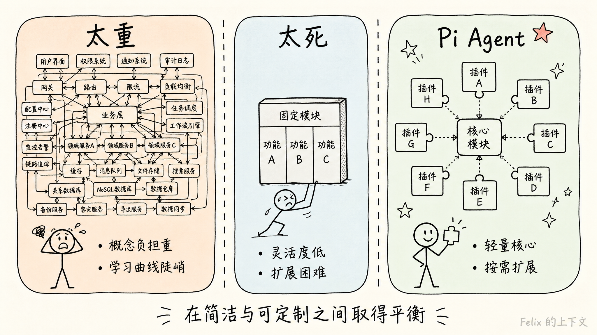
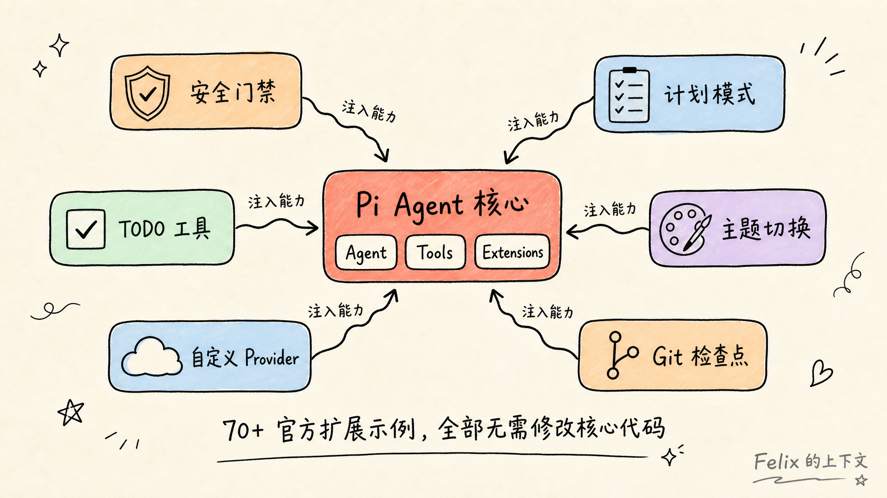
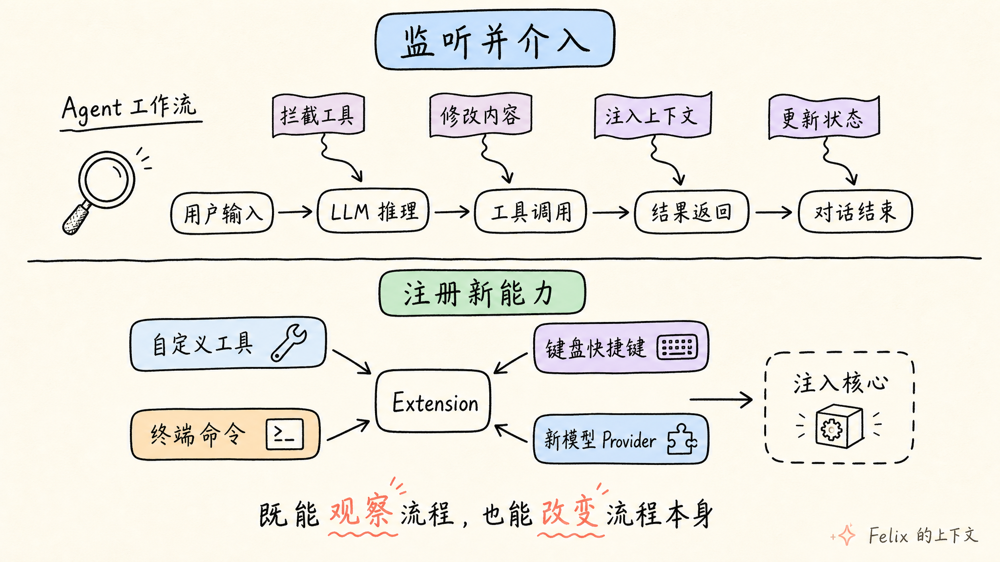
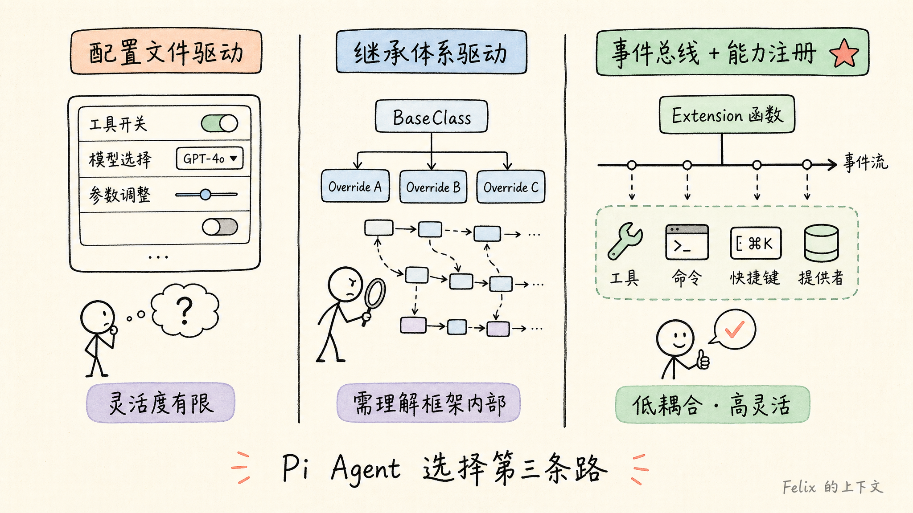

> **转载声明**：本文转载自潘智祥的博客，原文地址：https://panzhixiang.cn/2026/pi-agent-extension-design/  
> 原作者：潘智祥，原文采用 BY-NC-SA 4.0 协议。感谢作者的精彩整理，本站纯粹出于知识分享目的转载。如原作者认为侵权，请留言，将立即删除。

---

AI Agent 的概念火了两年，开源社区里相关的框架也长出了一大片。翻一圈下来会发现一个问题：**大多数框架要么「太重」，要么「太死」。**

太重的那一类——架构宏大、概念层叠，还没开始写第一行定制代码，光理解框架本身的命名和约定就耗尽了热情。太死的那一类——倒是不复杂，但稍微想加点自定义行为，就发现处处碰壁，框架在设计上根本没有给你留入口。

Pi Agent（GitHub 仓库 `badlogic/pi-mono`）在设计上走了一条不太一样的路。如果用一句话概括它的策略：

> **核心代码保持极简，把所有「可定制性」的维度全部交给扩展系统。**

这不是一个简单的「我们支持插件」的声明。它的扩展系统不是事后打补丁式的钩子集合，而是从架构第一天起就作为一等公民存在的**能力注入层**。

---

## 一、一个极度克制的核心

先看 Pi Agent 内部是怎么划分模块的。它的核心只有三个抽象：

- **Agent** — 负责与大模型对话推理的引擎
- **Tools** — Agent 可以调用的工具（读文件、执行命令、搜索代码等）
- **Extensions** — 扩展系统，对外部完全开放

没有「工作流编排器」，没有「状态机图引擎」，没有「记忆检索层」。核心只做一件事：让 Agent 跑起来。

支撑整个扩展机制的源码只有五个文件，总代码量约两千行。相比之下，仓库里官方提供的扩展示例超过 70 个，从安全门禁到代码审查，从计划模式到终端主题切换，覆盖了远比核心本身丰富的功能场景。

这种结构传递了一个明确的信息：**框架的作者不替开发者决定 Agent 应该怎么工作。他把决定权留给了扩展。**

---

## 二、扩展的两种「能力形态」

Pi Agent 的扩展系统不是一个只能「在既定流程上做点什么事」的钩子系统。它提供了两种完全不同的能力：

**第一类：监听并介入。** 扩展可以在 Agent 运行的任意关键节点插入自己的逻辑——在 LLM 收到消息之前修改它，在工具即将执行时拦截它，在工具返回结果之后改写它，在每一轮对话结束时更新状态。

这些节点不是少数几个，而是覆盖了 Agent 从启动到结束的完整流程。相当于框架在 Agent 的「必经之路」上预留了一串检查点，扩展可以选择在任意一个点上参与。

**第二类：向核心注册新能力。** 这是 Pi Agent 扩展系统与大多数「插件机制」最根本的区别。扩展不只是被动地「看」和「拦」，它还可以向核心注入全新的功能：

- 注册一个自定义工具，LLM 可以在推理过程中调用它
- 注册一个终端命令，用户可以直接键入执行
- 注册一组键盘快捷键
- 注册一个新的模型 Provider
- 甚至——替换整个输入编辑器、终端 Footer 或 Header

这相当于，框架的核心提供了一套「基础设施」，而扩展可以把这套设施改造成任何需要的样子。核心代码在这个过程中不需要被修改。

---

## 三、用具体场景感受一下

抽象的机制讲起来容易空洞。看几个实际的例子，理解会更直观。

**场景一：给 Agent 加一个「安全门禁」。**

假设 Agent 在操作文件时需要执行 `rm -rf` 这样的危险命令。一个扩展可以在工具调用前拦截，弹出确认框询问用户：「这条命令可能造成不可逆的操作，确认执行吗？」在没有人值守的后台模式下，直接阻止。

这个扩展需要多少代码？

极简到只需要做两件事：告诉系统「我想监听工具调用事件」，然后在事件发生时判断命令是否危险并返回阻止或放行。没有配置文件，没有项目结构的约定，没有对核心代码的任何修改。

**场景二：让 Agent 先做计划，确认后再执行。**

在修改代码之前，先让 Agent 进入一个「只读模式」——它只能查看文件、搜索代码、回答问题，但不能做任何修改。在只读模式下完成分析后，生成一个步骤清单。用户审阅清单、确认无误后，Agent 才切换到可修改模式，按步骤逐一执行。

这个扩展涉及的状态切换和阶段管理相当复杂，但核心逻辑完全包裹在扩展文件中。它不需要改动框架底层一行代码——它只是恰到好处地利用了扩展系统预留的几个检查点：在 Agent 启动时注入行为约束，在工具调用时过滤可执行范围，在每轮对话结束时追踪执行进度。

**场景三：给 Agent 注册一个待办事项工具。**

Agent 在完成任务过程中往往需要维护自己的 TODO 列表。一个扩展可以注册一个名为 `todo` 的自定义工具，让 LLM 通过工具调用来添加、勾选或清除任务。

关键在于，这个工具的状态是存在对话历史里的。这意味着——如果用户在对话的某个节点「分叉」出一个新的会话分支，待办事项的状态会自动跟过去，不需要额外处理。这种设计的后果是，扩展作者不需要考虑状态迁移、分支合并这些复杂问题，框架的底层机制已经替他们解决了。

---

## 四、和别的框架比，区别在哪

市面上的 Agent 框架，扩展机制大概可以分为两种风格：

一种是 **「配置文件驱动」**。框架在预设的几个位置留了参数入口，开发者通过修改配置来调整行为。这种方案上手简单，但灵活性的天花板很低——能改的东西就那么多，超出配置项的定制需求无处安放。

另一种是 **「继承体系驱动」**。框架提供一个基类，开发者通过继承并重写方法来扩展。这种方案类型安全、IDE 友好，但要求开发者深入理解框架的内部结构和继承链。做一些大幅度的定制时，成本往往不低。

Pi Agent 走的是第三条路：**「事件总线 + 能力注册」**。不要求继承任何类，不要求理解框架内部的继承关系。扩展只是一个普通的 TypeScript 函数，接收一个 API 对象作为参数，然后自由地订阅事件或注册新能力。

关键差异在于，Pi Agent 的扩展既是**观察者**也是**提供者**。大多数框架的「插件」只能在既有流程上增加行为；Pi Agent 的扩展可以改变流程本身。

---

## 五、适合谁，可能不适合谁

任何框架都有自己最适合的土壤。

Pi Agent 的设计哲学决定了它**特别适合**以下场景：

- 需要做大量原型验证、频繁调整 Agent 行为的开发团队
- 希望从一个干净、不臃肿的代码库开始学习 Agent 原理的技术爱好者
- 需要在标准 Agent 行为之上构建高度定制化工作流的场景
- 评估一个「既能快速上手、又能深度改造」的 Agent 技术底座

**可能不太适合**的场景：

- 完全不具备 TypeScript 或 JavaScript 基础（扩展需要用 TS/JS 编写）
- 追求开箱即用、零配置的即用型产品体验
- 需要企业级多租户、权限管理和审计日志的场景——这些不在框架范围内

---

## 六、一句话总结

开源 Agent 框架的数量还在快速增长，但在「简洁」和「可定制性」之间找到平衡点的项目并不多。Pi Agent 的做法值得关注，不是因为它实现了最多的功能，而是因为它把**「不做什么」**这个问题想得很清楚。

核心只做最必要的事。剩下的，全部交给扩展。

> *本文基于对 `badlogic/pi-mono` 仓库源码、官方文档及 70+ 个扩展示例的实地分析撰写。*

---

> **原文作者**：潘智祥  
> **原文链接**：https://panzhixiang.cn/2026/pi-agent-extension-design/  
> **原文协议**：BY-NC-SA 4.0 — 转载请注明出处
