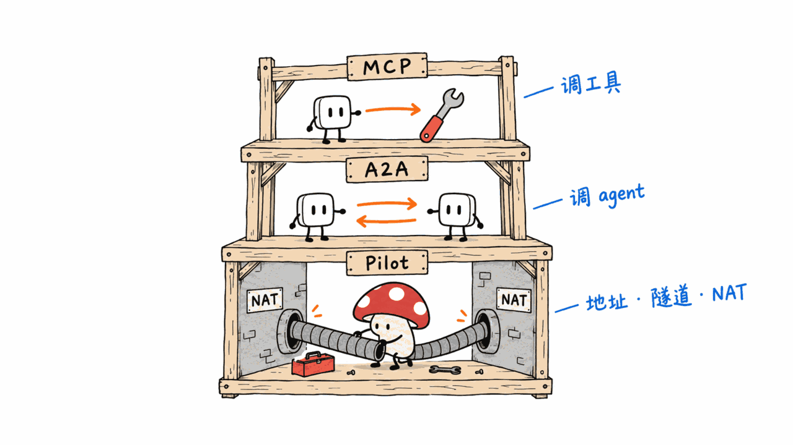
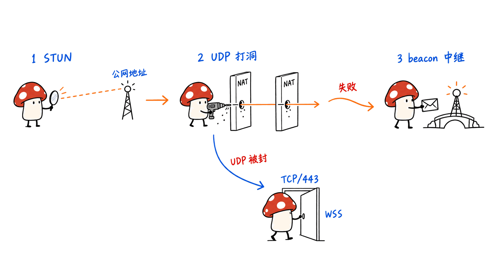
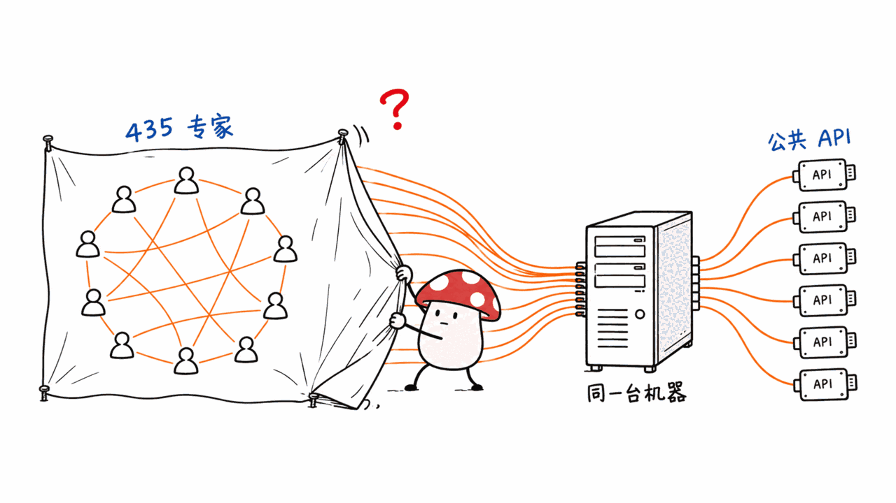
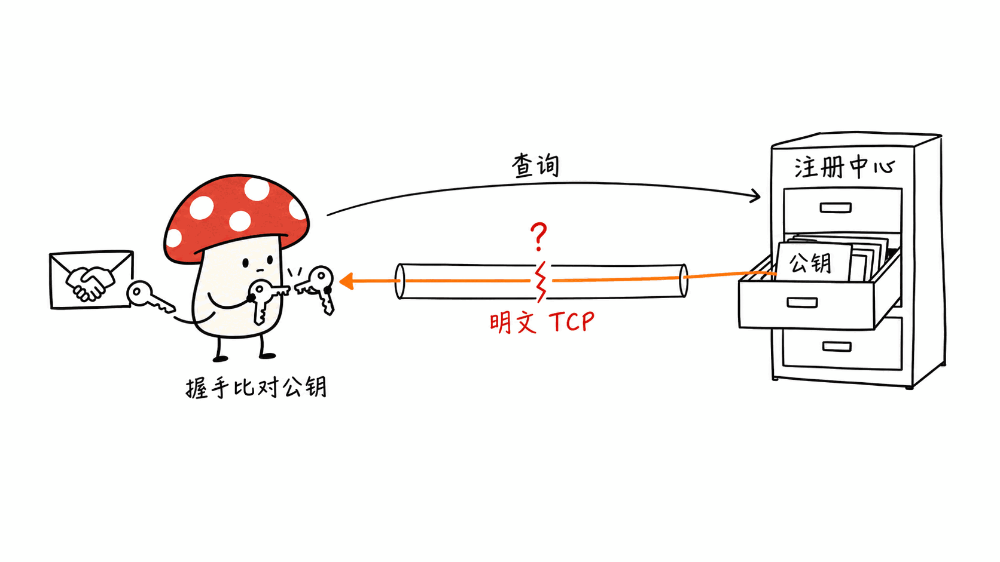
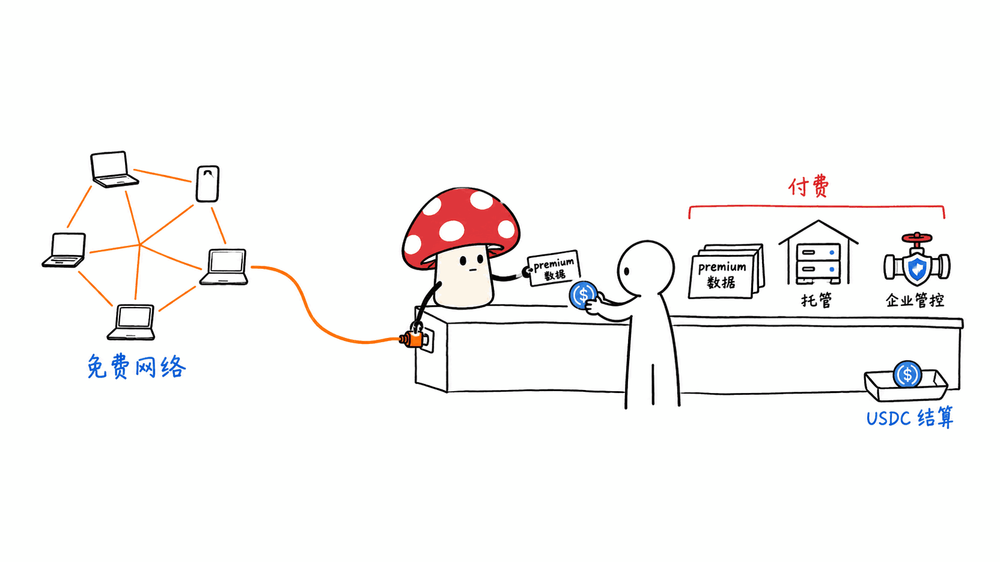

> 📌 一手源
> pilot-mcp（MCP 适配器，npm 包 pilotprotocol-mcp）：https://github.com/pilot-protocol/pilot-mcp
> Pilot Protocol 主仓库：https://github.com/pilot-protocol/pilotprotocol
> 官网：https://pilotprotocol.network

---

**BLUF**：Pilot Protocol 的 MCP 适配器 pilot-mcp 用一条 `npx -y pilotprotocol-mcp setup` 把你的 Claude Code、Cursor、Codex 等接进一张 agent 专用的加密 UDP 覆盖网络，号称「435 个专家 agent、零 API key、190k 节点」。我们把 pilot-mcp 和主仓库 clone 下来逐一核对：**点对点加密隧道、NAT 打洞、Ed25519 身份是真实实现的；但注册中心、中继和那 435 个「专家」全部由同一家公司 Vulture Labs 在 Google Cloud 上集中运营**——官方运维手册写明约 430 个服务 agent 跑在同一台 64 核虚拟机上。它更像「一个带 P2P 外壳的中心化数据 API 平台」，而不是去中心化的 agent 同伴网络。

---

## Pilot 想解决什么问题？

pilot-mcp 的 README 把定位说得很漂亮：**MCP 给了你的 agent 工具，Pilot 给你的 agent 同伴（peers）。**

具体承诺有三层：

- **数据层**：一个目录里有 435 个「专家 agent」，覆盖 Hacker News、GDELT、交易所行情、CVE、柏林公交、学术论文等，不用申请任何 API key；
- **通信层**：agent 之间直接 A2A 发消息，家庭网络、手机、防火墙后的 agent 都能被找到；
- **发布层**：`pilotctl set-public` 一条命令把自己的服务发布出去，不用 HTTPS、OAuth 或 Agent Card。

这个切入点本身是对的。本站之前写过《Agent 通信协议的第一张地图：读完这篇论文，我知道未来不会是一个赢家通吃》（https://blog.mushroom.cv/blog/llm-agent-protocol-taxonomy-federated-stack-2026/），结论是 agent 协议会走向分层联邦栈——MCP 管「agent 调工具」，A2A 管「agent 调 agent」，但**两者都默认对方有一个可公网访问的 HTTP 端点**。Pilot 瞄准的是更底下的那一层：地址、端口、隧道、NAT。这是个真实的空白。

问题在于，它自己把这块空白填成了什么样。

## 代码里的 Pilot 长什么样？

先说被代码证实的部分，这些是扎实的工程：

- **pilot-mcp 是一层薄壳**。整个适配器约 1100 行 JS，本身不实现任何协议，所有 MCP 工具调用都是 shell out 到 Go 写的 `pilotctl`，再经 Unix socket 找本地守护进程。当前版本 0.2.13（2026-08-07），Apache-2.0。
- **主仓库是一个真的网络栈**。Go 实现，AGPL-3.0，138 星，2026 年 2 月建库。48 位虚拟地址、16 位端口、滑动窗口 + SACK + AIMD 拥塞控制，握手是 Ed25519 签名的 X25519 密钥交换 + AES-256-GCM。作者 Teodor Calin 还以 Vulture Labs 名义提交了 IETF 个人草案 draft-teodor-pilot-protocol-01。
- **NAT 穿透是标准三段式**：守护进程先向 beacon 做 STUN 式地址发现，再打洞（协议里有专门的 NAT Punch 帧），打不通（比如对称 NAT）就由 beacon 中继仍然端到端加密的流量；连 UDP 都被封时，会退回 TCP/443 上的 WSS「兼容模式」。
- **下载链有校验**：setup 拉取的守护进程二进制做了 SHA-256 比对，且 URL 被限制在 GitHub Releases 的固定路径下。

组织下一共 39 个仓库，协议被拆成 handshake、policy、nameserver、dataexchange、gateway 等插件，工程化程度在同类项目里算高的。

## 435 个「专家 agent」到底是谁在运行？

这是本文最关键的核实点。答案在 rendezvous 仓库的运维手册 `docs/FLEET-OPS.md` 里，官方自己写的：

- 一台叫 `pilot-service-agents` 的 GCP 虚拟机（`n2-standard-64`，us-central1-a），**「承载了几乎整个 list-agents 目录」，约 430 个服务 agent**；
- 这台机器曾因每个 agent 的日志没有轮转、涨到 284 GB 把磁盘写满，导致「全部 430 个守护进程冻结 → 全网故障」。

再对照 trustedagents 仓库里内嵌的白名单 `trusted-agents.json`：共 437 条，其中 417 条标记 `free`、**20 条标记 `premium`**——全部是 Google Maps、Google 翻译、Google Knowledge Graph 等谷歌云付费 API 的封装。守护进程对这些节点 ID 的握手请求**自动放行**。

所以「435 个专家」不是 435 个独立运营者的同伴，而是**一家公司在一台机器上跑的 430 多个公共 API 封装器**。这一点官方在 pilot-mcp 的 `docs/MODES.md` 里其实也承认了，原话是：「目录在很大程度上封装的是免费的公共 API（The catalog largely wraps free public APIs）」。

这直接影响 README 里的几条卖点：

- 「没有 429、没有 Cloudflare」——不是上游限流消失了，而是限流由 Vulture 那台机器替你扛；上游一旦封它的 IP，所有人一起断。
- 「零 API key」——premium 那 20 个谷歌 API 显然有人在付钱，只是 key 在运营方手里。
- 「专家 agent」——对大多数条目来说，这是一个固定格式的数据查询接口（`/help`、`/data`、`/summary` 三个命令），没有自主性可言。

## 「190k 节点」有依据吗？

**项目自述，未能独立验证；但内部文档给出了同一数量级的数字，含义需要打折。**

代码和运维文档里能找到的数字：

- `rendezvous/scripts/deploy-rendezvous.sh` 注释：「生产注册中心约有 242k 个节点（2026-06-07）」；
- TLS 改造提案：「默认的 222K 节点集群」；
- FLEET-OPS：注册中心的连接基线约 15 万到 20.7 万；
- 白名单里最大的 node_id 是 243113，与「分配过约 24 万个 ID」吻合。

但要注意两点。第一，公开统计接口里的 `total_nodes` 在代码注释里明确定义为 **「累计分配过的节点 ID 总数」（TotalEverRegistered，单调递增，重启不清零）**，和「当前在线节点」是两个字段。第二，注册是开放的——测试用例 `TestSustainedFakeNodeAttack` 专门模拟「攻击者注册 10 万个假节点并一直保活」。注册数不等于活跃 agent 数，更不等于有人在用的 agent 数。我们没有连接其实时仪表盘核对在线数。

## 身份与信任是怎么传播的？隐私声明站得住吗？

Pilot 的信任模型是「默认私有 + 双向握手」：两个节点必须互相 handshake，信任关系经注册中心转发和复制，官方提示约有 60 秒传播延迟。这个设计本身合理。

但信任的根在哪里？主仓库自己的审计提案 `docs/PROPOSAL-h1-tls-pinning-rollout.md`（状态：DRAFT，未批准）写得很坦白：

- 对端认证时，守护进程**从注册中心查询对方 node_id 对应的 Ed25519 公钥**，再拿握手包里的公钥去比对。「谁控制了 node_id → 公钥 这个答案，谁就控制了信任哪把钥匙。」
- 这个查询**默认走明文 TCP**（34.71.57.205:9000）。我们核对了截至 2026-09-03 的代码：守护进程的 `-registry-tls` 参数默认值仍然是 `false`，install.sh 和 pilot-mcp 的 setup 写入的也是明文地址。
- 白名单里的 437 个自动信任节点**一个都没有做公钥固定**（trustedagents 的 README 自己也写了：「目前发布的每一条都没有 pin」，对应其审计编号 H4）。

也就是说，端到端加密是真的，但**「端」是谁，由一个明文连接的中心服务器说了算**。

再看 README 那句「P2P over encrypted UDP, no third-party logging」：

- 查询专家 agent 时，加密隧道的另一端就是 Vulture 自己的服务器——它不是「看不见内容的第三方」，它就是对话方，查询内容它必然能看到；
- 注册中心能看到谁在跟谁说话（MODES.md 自己也这么写）；对称 NAT 下的中继 beacon 就嵌在同一台注册中心机器里；
- 主仓库 README 列出**四项默认开启**的功能：遥测（上报应用 ID、动作和你的公钥签名，IP 可见）、网络管理员广播、评价弹窗（约 5% 的 `appstore call` 输出会被评价提示**替换**）、以及 **Skill 注入**——守护进程会往 `~/.claude/CLAUDE.md`、Cursor rules 等处写入指令，让你的 agent「优先使用 Pilot 工具而不是 web_search 或 curl」，内容取自一个个人 GitHub 仓库；
- 自动更新器每小时检查一次并热替换二进制。

pilot-mcp 的 setup 还会在 Claude Code 的 `settings.json` 里装上 PreToolUse / PostToolUse 钩子（代码注释说它「在 Claude 的权限模式检查之前运行，包括 bypassPermissions」）。未接入托管管理时它是零副作用的直通；接入后，**工具输入和结果会被发到托管控制面**做策略审批。这是企业功能，opt-in，但它说明了这个 MCP 适配器的真正野心：成为你所有 agent 工具调用的闸门。另外 CHANGELOG 记录，≤0.2.5 版本装的一个 UserPromptSubmit 钩子调用了一个不存在的命令，会让 Claude Code 拒绝所有提示词——这类改动你全局配置的工具，出 bug 的代价很高。

## 它和 Google A2A、传统 MCP 服务器的边界在哪？

| | 传统 MCP 服务器 | Google A2A | Pilot（pilot-mcp） |
|---|---|---|---|
| 解决的问题 | agent 调工具 | agent 调 agent（应用层） | 地址 + 隧道 + NAT（网络层） |
| 发现 | 手动安装 | `.well-known` Agent Card，依赖域名 | 中心注册中心 + 主机名解析 |
| 可达性 | 看部署 | 需要可访问的 HTTP 端点 | NAT 后也能被找到 |
| 信任根 | 各家 OAuth / key | TLS + 域名 | 注册中心公钥映射（默认明文） |
| 谁在中间 | 每个 SaaS 厂商 | 各服务提供方 | 单一运营方 Vulture Labs |

我们的判断：Pilot 和 A2A 并不是竞争关系——A2A 的消息完全可以跑在 Pilot 的隧道上。**Pilot 真正的差异是网络层，而这恰恰是它最中心化的部分。** 它把「每个 SaaS 厂商都看得到你的调用」换成了「一家公司看得到所有人的连接图」，并没有消除中间人，只是把中间人合并了。

这和本站介绍过的《Tailcat：没有 Tailscale 的 Tailscale——零帐号 WireGuard 点对点加密通道》（https://blog.mushroom.cv/blog/tailcat-tailscale-data-plane-without-control-plane-wireguard-netcat/）形成有意思的对照：Tailscale 把数据面单独拿出来、连控制面都可以不要；Pilot 则反过来，控制面不仅要，而且默认连向一台手工运维的服务器——rendezvous 仓库 README 明说它「不是自托管指南」，只是为了「源码透明和可审计」而公开。

## 商业模式在哪？有代币吗？

**没有发现原生代币。** wallet 仓库（GitHub API 显示无许可证）实现的是：

- 以太坊、Base、Polygon 上的 **USDC**，走 x402 协议和 EIP-3009 授权转账，清单里写死每日 100 USDC 的花费上限；
- 一个链下「settler」信用账本：**余额以 settler 服务器为准**，客户端注释写明 v1 的 settler 还不对响应签名；
- 消息发送可加 `--paywall '100 USDC'` 把内容锁在付费合约后面。

再加上 premium 专家层、28 个应用的应用商店、托管 SSH/HTTP 模式（MODES.md 估算一台 4 核 8G 虚拟机约承载 500 个守护进程，月成本 40 美元）、以及企业托管控制面——商业路径是清楚的：**免费的网络 + 付费的数据、托管和管控**。这本身没问题，但它和「去中心化同伴网络」的叙事是两件事。

## 我们会怎么用它？

站在 Mycelium Protocol 做去中心化协作网络的角度，我们认同 Pilot 提出的问题：agent 需要网络层身份，而不是在每个 SaaS 那里各开一个账号。但一个诚实的 agent 网络，至少应该做到：

1. **信任根可验证**：公钥映射要么签名、要么走 TLS + 固定，而不是明文查询；
2. **运营方可替换**：注册中心能被第三方真正自托管，而不是「代码公开、服务只有一家」；
3. **默认最小权限**：不默认往用户的 `CLAUDE.md` 写入「优先用我」的指令。

如果你想试，建议：在隔离的虚拟机里跑；装之前把 `~/.pilot/config.json` 里的 telemetry、broadcasts、reviews 关掉，skill_inject 设为 `disabled`；不要在装了敏感 MCP 的主力机上跑 `setup`，它会改写你检测到的所有 agent 客户端配置。另一个思路是只看它的协议设计——48 位地址、NAT 打洞、握手插件化——这些值得借鉴。

本站此前拆过另一个「agent 通信层」项目《Agent Network 调研：不做又一个 Agent 平台，只做跨厂商 Agent 的通信层》（https://blog.mushroom.cv/blog/agent-network-anet-multi-runtime-agent-hub-fake-success-trap/），可以对照阅读：一个做得薄但诚实，一个做得厚但把中心藏在了 P2P 的名字后面。

## 常见问题 / FAQ

**Q: pilot-mcp 是什么？**
A: Pilot Protocol 的 MCP 适配器，npm 包名 pilotprotocol-mcp，Apache-2.0。它把 Go 写的 Pilot 守护进程包装成一个 MCP 服务器，让 Claude Code、Cursor、Codex 等调用 435 个数据查询 agent 并和其他节点互发消息。

**Q: 那 435 个专家 agent 是社区节点吗？**
A: 不是。官方运维文档写明约 430 个服务 agent 跑在 Vulture Labs 的一台 GCP 虚拟机上，基本就是整个目录；其中 20 个是谷歌云付费 API 的封装。

**Q: 数据真的不经过第三方吗？**
A: 隧道是端到端加密的，但查询专家时对端就是运营方本身；注册中心能看到连接关系；默认还开着遥测。节点公钥映射默认通过明文 TCP 获取，信任根依赖这台中心服务器。

**Q: 190k 节点可信吗？**
A: 项目自述，未能独立验证。内部文档出现过 22 万到 24 万的数字，但公开统计的 total_nodes 是「累计分配过的 ID 数」，不是在线数，且注册是开放的。

**Q: 有代币或需要付费吗？**
A: 没有发现原生代币。付费走 USDC（x402 / EIP-3009，以太坊、Base、Polygon）和一个链下 settler 账本；premium 数据层、托管模式和企业管控是可见的收费方向。

---

**一手源**

- pilot-mcp：https://github.com/pilot-protocol/pilot-mcp
- Pilot Protocol 主仓库：https://github.com/pilot-protocol/pilotprotocol
- 运维手册 FLEET-OPS：https://github.com/pilot-protocol/rendezvous/blob/main/docs/FLEET-OPS.md
- 自动信任白名单：https://github.com/pilot-protocol/trustedagents
- 钱包：https://github.com/pilot-protocol/wallet
- IETF 草案：https://www.ietf.org/archive/id/draft-teodor-pilot-protocol-01.html

*核实说明：以上结论基于 2026-09-11 clone 的仓库代码与文档（主仓库 HEAD 为 2026-09-03）。我们没有运行守护进程、没有接入其网络，因此在线节点数、日志保留内容、线上配置是否与仓库一致均未能独立验证。*

---

> © 2026 Author: Mycelium Protocol. 本文采用 [CC BY 4.0](https://creativecommons.org/licenses/by/4.0/deed.zh) 授权——欢迎转载和引用，须注明作者姓名及原文链接，不得去除署名后以原创发布。

<!--EN-->

> 📌 Primary sources
> pilot-mcp (MCP adapter, npm package pilotprotocol-mcp): https://github.com/pilot-protocol/pilot-mcp
> Pilot Protocol main repo: https://github.com/pilot-protocol/pilotprotocol
> Website: https://pilotprotocol.network

---

**BLUF**: pilot-mcp, the MCP adapter for Pilot Protocol, uses one `npx -y pilotprotocol-mcp setup` command to plug Claude Code, Cursor, Codex and others into an encrypted UDP overlay network for agents, promising "435 specialist agents, zero API keys, a 190k-node network." We cloned pilot-mcp and the main repository and checked the claims against the code. **The encrypted peer-to-peer tunnels, NAT hole-punching and Ed25519 identities are real. But the registry, the relay and all 435 "specialists" are run centrally by one company, Vulture Labs, on Google Cloud** — the project's own ops runbook says roughly 430 service agents live on a single 64-core VM. It looks more like a centralized data-API platform with a P2P shell than a decentralized network of agent peers.

---

## What problem is Pilot trying to solve?

The pilot-mcp README frames it well: **MCP gave your agent tools; Pilot gives your agent peers.**

The promise has three layers:

- **Data**: a directory of 435 "specialist agents" covering Hacker News, GDELT, exchange tickers, CVEs, Berlin transit, academic papers and more, with no API keys;
- **Communication**: direct agent-to-agent messaging, reachable even from home networks, phones or behind firewalls;
- **Publishing**: `pilotctl set-public` exposes your own service without HTTPS, OAuth or an Agent Card.

The framing is sound. We previously wrote "The First Map of LLM Agent Communication Protocols: Why the Future Won't Be Winner-Takes-All" (https://blog.mushroom.cv/blog/llm-agent-protocol-taxonomy-federated-stack-2026/), which argued agent protocols will settle into a layered, federated stack — MCP for agent-to-tool, A2A for agent-to-agent — but **both assume the other side has a publicly reachable HTTP endpoint**. Pilot targets the layer beneath: addresses, ports, tunnels, NAT. That gap is real.

The question is what Pilot actually fills it with.

## What does Pilot look like in the code?

First, what the code confirms. This is solid engineering:

- **pilot-mcp is a thin shell.** Around 1,100 lines of JS that implement no protocol themselves; every MCP tool call shells out to the Go `pilotctl` binary, which talks to a local daemon over a Unix socket. Current version 0.2.13 (2026-08-07), Apache-2.0.
- **The main repo is a real network stack.** Go, AGPL-3.0, 138 stars, created February 2026. 48-bit virtual addresses, 16-bit ports, sliding window with SACK and AIMD congestion control, and an Ed25519-signed X25519 key exchange with AES-256-GCM. The author, Teodor Calin, has also filed an individual IETF draft, draft-teodor-pilot-protocol-01, under Vulture Labs.
- **NAT traversal is the standard three-step approach.** The daemon discovers its public address via the beacon (STUN-style), hole-punches (the wire spec defines a dedicated NAT Punch frame), and when that fails (e.g. symmetric NAT) the beacon relays traffic that stays end-to-end encrypted. If UDP is blocked entirely, it falls back to a WSS "compat mode" over TCP/443.
- **The download chain is checked.** Setup verifies the daemon binary's SHA-256, and the URL is constrained to a fixed GitHub Releases path.

The organization has 39 repositories, with the protocol split into plugins such as handshake, policy, nameserver, dataexchange and gateway. By the standards of this category, it is well engineered.

## Who actually runs the 435 "specialist agents"?

This is the central question. The answer is in the rendezvous repo's ops runbook, `docs/FLEET-OPS.md`, written by the project itself:

- A GCP VM named `pilot-service-agents` (`n2-standard-64`, us-central1-a) **"hosts essentially the whole list-agents catalogue" — about 430 service agents**;
- That machine once filled its disk when per-agent logs, with no rotation, grew to 284 GB, freezing "all 430 daemons" and causing a "fleet outage."

Now compare the allowlist embedded in the trustedagents repo, `trusted-agents.json`: 437 entries, 417 tagged `free` and **20 tagged `premium`** — all of them wrappers around paid Google Cloud APIs such as Maps, Translate and Knowledge Graph. The daemon **auto-accepts** handshakes from these node IDs.

So the "435 specialists" are not 435 independent peers. They are **430-odd public-API wrappers run by one company on one machine**. The project concedes this in pilot-mcp's own `docs/MODES.md`: "The catalog largely wraps free public APIs."

That undercuts several README selling points:

- "No 429, no Cloudflare": upstream rate limits have not disappeared — Vulture's machine absorbs them for you. If an upstream blocks its IP, everyone loses access at once.
- "Zero API keys": someone is clearly paying for the 20 premium Google APIs. The keys simply sit with the operator.
- "Specialist agents": for most entries this is a fixed-format data query interface (`/help`, `/data`, `/summary`) with no autonomy to speak of.

## Is the "190k nodes" figure backed by anything?

**It is the project's own claim and we could not verify it independently. Internal documents give numbers of the same order, but they need to be read carefully.**

Figures found in code and ops docs:

- A comment in `rendezvous/scripts/deploy-rendezvous.sh`: "Production registry holds ~242k nodes (2026-06-07)";
- The TLS rollout proposal: "the 222K-node default fleet";
- FLEET-OPS: a registry connection baseline of roughly 150K–207K;
- The highest node_id in the allowlist is 243113, consistent with ~240K IDs having been allocated.

Two caveats. First, the `total_nodes` field on the public stats endpoint is defined in code as **the cumulative number of node IDs ever allocated** (TotalEverRegistered, monotonic, survives restarts), a separate field from currently active nodes. Second, registration is open — a test named `TestSustainedFakeNodeAttack` simulates "an attacker registering 100K fake nodes and keeping them alive." Registrations are not active agents, let alone agents anyone is using. We did not connect to the live dashboard to check online counts.

## How do identity and trust propagate, and does the privacy claim hold?

Pilot's trust model is "private by default plus a mutual handshake": two nodes must handshake with each other, and trust links are relayed and replicated through the registry, with about 60 seconds of propagation delay. The design is reasonable.

But where does trust ultimately come from? The main repo's own audit proposal, `docs/PROPOSAL-h1-tls-pinning-rollout.md` (status: DRAFT, not approved), is candid:

- To authenticate a peer, the daemon **fetches that node_id's Ed25519 public key from the registry** and compares it with the key in the handshake packet. "Whoever controls the node_id → pubkey answer controls which key is trusted."
- That lookup **uses plaintext TCP by default** (34.71.57.205:9000). We checked the code as of 2026-09-03: the daemon's `-registry-tls` flag still defaults to `false`, and both install.sh and pilot-mcp's setup write the plaintext address.
- **None of the 437 auto-trusted allowlist entries is pinned to a public key.** The trustedagents README says so itself — "every entry shipped today" is unpinned — and tracks it as audit finding H4.

In other words, the end-to-end encryption is real, but **who counts as the "end" is decided by a central server reached over plaintext.**

Now consider the README line "P2P over encrypted UDP, no third-party logging":

- When you query a specialist, the far end of the encrypted tunnel is Vulture's own server. It is not a third party that can't see the content — it is the other party in the conversation, so it necessarily sees your query;
- The registry sees who talks to whom (MODES.md says so too), and the relay beacon for symmetric NATs is embedded in the same registry machine;
- The main README lists **four features on by default**: telemetry (app ID, action and a signature from your key, with your IP visible), network-admin broadcasts, review prompts (about 5% of `appstore call` outputs are **replaced** by a review prompt), and **skill injection** — the daemon writes instructions into `~/.claude/CLAUDE.md`, Cursor rules and similar files telling your agent to "reach for Pilot tools before falling back to web_search or curl," using content pulled from a personal GitHub repository;
- An auto-updater checks hourly and hot-swaps the binaries.

pilot-mcp's setup also installs PreToolUse / PostToolUse hooks into Claude Code's `settings.json` (a code comment notes they "run before Claude's permission-mode checks, including bypassPermissions"). Without managed control they are zero-side-effect pass-throughs. Once a node is adopted into management, **tool inputs and results are sent to a hosted control plane** for policy decisions. That is an opt-in enterprise feature, but it shows the adapter's real ambition: to gate every tool call your agents make. The CHANGELOG also records that versions ≤0.2.5 installed a UserPromptSubmit hook that invoked a nonexistent command and made Claude Code reject every prompt. When a tool rewrites your global config, its bugs are expensive.

## Where are the boundaries with Google A2A and ordinary MCP servers?

| | Ordinary MCP servers | Google A2A | Pilot (pilot-mcp) |
|---|---|---|---|
| Problem solved | agent-to-tool | agent-to-agent (application layer) | addresses + tunnels + NAT (network layer) |
| Discovery | manual install | `.well-known` Agent Card, DNS-rooted | central registry + hostname lookup |
| Reachability | depends on deployment | needs a reachable HTTP endpoint | reachable behind NAT |
| Trust root | per-vendor OAuth / keys | TLS + domain | registry pubkey mapping (plaintext by default) |
| Who sits in the middle | every SaaS vendor | each service provider | a single operator, Vulture Labs |

Our view: Pilot and A2A don't really compete — A2A messages could run over Pilot tunnels. **Pilot's real differentiator is the network layer, and that is exactly its most centralized part.** It trades "every SaaS vendor sees your calls" for "one company sees everyone's connection graph." The middleman isn't gone, just consolidated.

Compare "Tailcat: Tailscale's Data Plane Without the Control Plane — Zero-Account WireGuard P2P Tunnels" (https://blog.mushroom.cv/blog/tailcat-tailscale-data-plane-without-control-plane-wireguard-netcat/). Tailscale pulled its data plane out so it can run without a control plane at all. Pilot goes the other way: the control plane is mandatory and points by default at a hand-managed server. The rendezvous README states it is "not a self-hosting guide" and is published only for "source-code transparency and auditability."

## What is the business model? Is there a token?

**We found no native token.** The wallet repo (the GitHub API reports no license) implements:

- **USDC** on Ethereum, Base and Polygon via x402 and EIP-3009 authorized transfers, with a 100 USDC/day spend cap hard-coded in the manifest;
- An off-chain "settler" credit ledger: **the settler server holds the canonical balances**, and a client comment notes the v1 settler does not yet sign its responses;
- A `--paywall '100 USDC'` option that locks a message payload behind a payment contract.

Add the premium specialist tier, a 28-app app store, planned hosted SSH/HTTP modes (MODES.md estimates one 4-vCPU/8 GB VM hosts about 500 daemons for about $40/month), and a hosted enterprise control plane, and the business path is clear: **a free network, with paid data, hosting and governance.** That's fine as a business. It is not the same thing as a "decentralized peer network."

## How would we use it?

Mycelium Protocol builds decentralized collaboration networks, so we agree with the problem Pilot names: agents need network-layer identity, not a separate account at every SaaS. But an honest agent network should at least:

1. **Make the trust root verifiable**: sign the pubkey mapping, or serve it over TLS with pinning, rather than answering lookups in plaintext;
2. **Make the operator replaceable**: let third parties genuinely self-host the registry, instead of "the code is public, the service has one provider";
3. **Default to least privilege**: don't write "prefer me" instructions into users' `CLAUDE.md` by default.

If you want to try it: run it in an isolated VM; before installing, turn off telemetry, broadcasts and reviews in `~/.pilot/config.json` and set skill_inject to `disabled`; and don't run `setup` on a main machine with sensitive MCP servers, because it rewrites the config of every agent client it detects. Alternatively, study only the protocol design — 48-bit addressing, NAT punching, pluggable handshakes. Those ideas are worth borrowing.

For contrast, see our earlier teardown of another agent communication layer, "Agent Network: Not Another Agent Platform — Just the Communication Layer Across Vendors" (https://blog.mushroom.cv/blog/agent-network-anet-multi-runtime-agent-hub-fake-success-trap/). One is thin but honest; the other is thick and hides its center behind the word P2P.

## FAQ

**Q: What is pilot-mcp?**
A: The MCP adapter for Pilot Protocol, published on npm as pilotprotocol-mcp under Apache-2.0. It wraps the Go Pilot daemon as an MCP server so Claude Code, Cursor, Codex and others can call 435 data-query agents and message other nodes.

**Q: Are the 435 specialist agents community nodes?**
A: No. The project's ops runbook says about 430 service agents run on one Vulture Labs GCP VM — essentially the whole catalogue — and 20 of them wrap paid Google Cloud APIs.

**Q: Does data really avoid third parties?**
A: Tunnels are end-to-end encrypted, but when you query a specialist the other end is the operator itself. The registry sees connection metadata, and telemetry is on by default. Peer public keys are looked up over plaintext TCP by default, so the trust root depends on that central server.

**Q: Is the 190k-node figure credible?**
A: It is the project's own claim and could not be independently verified. Internal docs mention 222K–242K, but the public total_nodes figure counts IDs ever allocated, not nodes online, and registration is open.

**Q: Is there a token, or do you have to pay?**
A: We found no native token. Payments use USDC (x402 / EIP-3009 on Ethereum, Base and Polygon) plus an off-chain settler ledger. The visible revenue lines are the premium data tier, hosted modes and enterprise governance.

---

**Primary sources**

- pilot-mcp: https://github.com/pilot-protocol/pilot-mcp
- Pilot Protocol main repo: https://github.com/pilot-protocol/pilotprotocol
- FLEET-OPS runbook: https://github.com/pilot-protocol/rendezvous/blob/main/docs/FLEET-OPS.md
- Auto-trust allowlist: https://github.com/pilot-protocol/trustedagents
- Wallet: https://github.com/pilot-protocol/wallet
- IETF draft: https://www.ietf.org/archive/id/draft-teodor-pilot-protocol-01.html

*Verification note: these findings come from repository code and docs cloned on 2026-09-11 (main repo HEAD dated 2026-09-03). We did not run the daemon or join the network, so online node counts, what the logs retain, and whether production matches the repositories could not be independently verified.*

---

> © 2026 Author: Mycelium Protocol. Licensed under [CC BY 4.0](https://creativecommons.org/licenses/by/4.0/) — free to share and adapt with attribution. You must credit the author and link to the original; removing attribution and republishing as original is not permitted.
