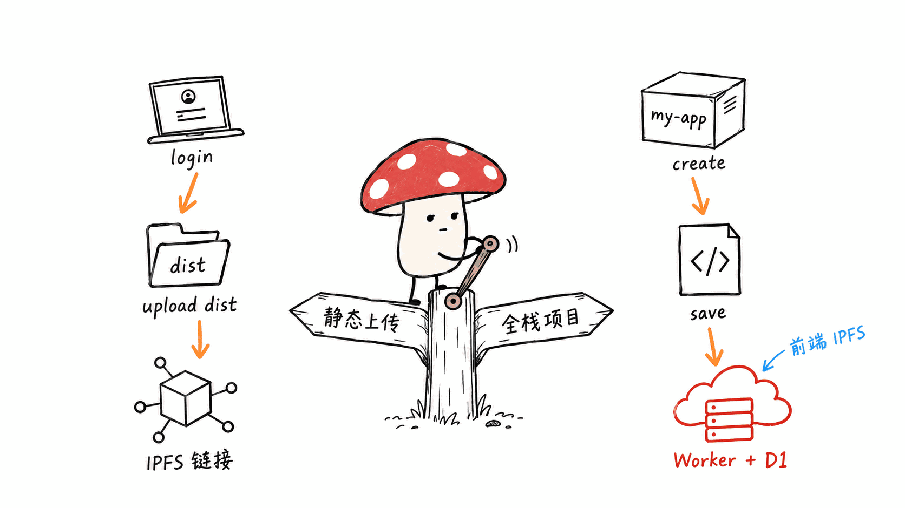
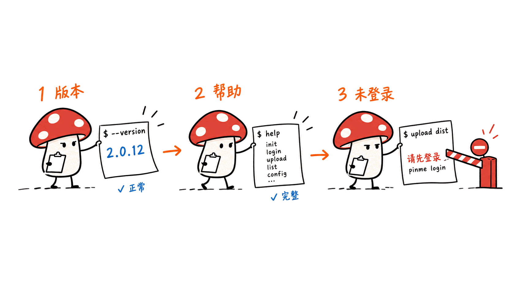
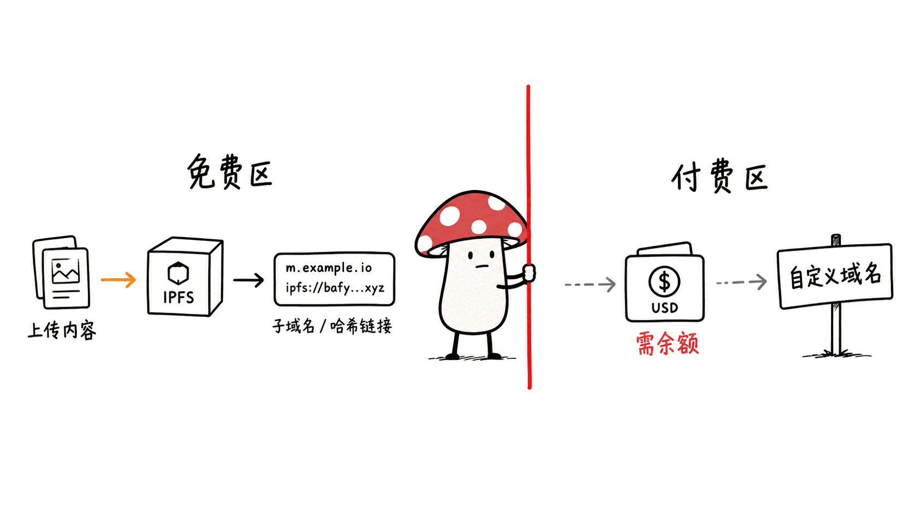

**BLUF**：PinMe 是 glitternetwork 开源的零配置部署 CLI，npm 包名 `pinme`，当前版本 **2.0.12**，GitHub **3742 星、276 fork、MIT 协议**，仓库创建于 2025-04-13，最近一次提交在 **2026-09-12**——不是弃坑项目。它最初的定位是「一条命令把静态站点传上 IPFS」，我们在本机（Apple Silicon Mac mini）用 `npx pinme@2.0.12` 实测过：`--version`、`help`、未登录状态下的 `upload` 都按预期工作。但读完 README 和源码后发现两件事需要提醒：一是它后来长出了一整套「全栈项目」模式（`pinme create` / `save`），实际部署目标是 **Cloudflare Worker + D1 数据库**，跟「去中心化托管」已经是两条不同的路；二是自定义域名绑定需要**美元计价的钱包余额**，不是免费的。

> 📌 一手资料
> 仓库：https://github.com/glitternetwork/pinme
> README：https://github.com/glitternetwork/pinme/blob/main/README.md
> npm 包：https://www.npmjs.com/package/pinme
> CLAUDE.md（仓库自带）：https://github.com/glitternetwork/pinme/blob/main/CLAUDE.md

---

## PinMe 到底是做什么的？

不要被名字骗了去猜「Pin 到 IPFS」就是全部。README 开头第一句话是：

> "PinMe is a zero-config deployment CLI focused on one-command creation and deployment for full-stack projects."

翻译过来：它现在把自己定义为**全栈项目**的一键部署工具，不只是静态文件上传器。仓库里同时存在两条工作流：

1. **静态上传**：`pinme login` → `pinme upload dist`。把 `dist`/`build`/`out`/`public` 这类构建产物目录直接传到 IPFS 网络，拿到一个可访问的链接。这是最初的核心功能，也是我们本机能验证到的部分。
2. **全栈项目**：`pinme create my-app` → `cd my-app` → `pinme save`。这条路径会用官方模板生成一个「前端 + Worker 后端 + 数据库」的项目骨架，写入 `pinme.toml`，然后 `save` 一次性构建并上传 Worker 代码、SQL 迁移文件（`db/` 目录）、前端产物。仓库自带的 `CLAUDE.md` 原话写得很直接：

> "The `save` command reads `pinme.toml` from project root for full-stack deploy (frontend + Cloudflare Worker + D1)."



也就是说，「全栈」的后端和数据库这两块，落地在 **Cloudflare Worker 和 Cloudflare D1** 上，是中心化云服务，而不是 IPFS。只有前端静态资源部分走 IPFS。这和很多人看到「IPFS」「zero-config」两个词后脑补的「纯去中心化全栈部署」有明显差距——它更准确的定位是：**IPFS 做前端 CDN，Cloudflare 做后端**。

## 一手数字：星标、许可证、维护状态

用 `gh api repos/glitternetwork/pinme` 拉到的仓库元数据（2026-09-15 抓取）：

| 指标 | 数值 |
|---|---:|
| Stars | 3,742 |
| Forks | 276 |
| Open issues | 7 |
| License | MIT |
| 创建时间 | 2025-04-13 |
| 最近 push | 2026-09-12 |
| 主语言 | TypeScript |
| Subscribers（真实关注人数） | 14 |

npm 侧（`npm view pinme`）：当前版本 **2.0.12**，106 个历史版本，作者 Glitter Protocol，两位维护者（rongnpm、junchi.zhang）。用 npm 官方下载统计 API 查最近 30 天（2026-08-13 至 2026-09-11）下载量是 **662 次**——星标数不小，但实际 npm 安装量并不算高，说明相当一部分星标可能来自 GitHub 浏览而非日常使用者，这点使用前要有心理预期，不代表它是空气项目（提交记录、测试套件、issue 互动都是真实的）。

值得一提的是仓库的 `CHANGELOG.md` 停留在 **v1.1.2（2025-08-07）**，而 npm 和 git log 都显示项目早已迭代到 2.0.x 系列，中间的大版本变化（尤其是「全栈项目」这条新增能力）完全没有写进 CHANGELOG。**如果你想了解这个项目现在到底能干什么，别看 CHANGELOG.md，去看 README 和最近的 commit log。**

## 本机实测：CLI 能跑吗？

这台是 Apple Silicon Mac mini，Node 环境已就绪。为了不污染全局环境，用 `npx` 临时拉取而非 `npm install -g`：

```
npx --yes pinme@2.0.12 --version
# 输出：2.0.12（附带三条 npm 依赖过期警告，见下）

npx --yes pinme@2.0.12 help
# 正常打印 ASCII banner 和完整命令列表

npx --yes pinme@2.0.12 upload dist   # 未登录状态
# 输出：Please login first. Run: pinme login
```

三个结果都符合预期：CLI 能正常启动、帮助信息完整、未认证时不会崩溃或误传数据，而是给出清晰的下一步提示。**没有账号，我们没有走完实际登录、上传、绑定域名这几步**，这部分只能到「命令行行为符合文档」为止，具体上传体验和排队/限速表现无法验证。



安装过程中 npm 打出三条依赖过期警告，值得记一笔：`glob@10.5.0`（旧版有已知安全漏洞）、`uuid@9.0.1`（不再维护）、`crypto-js@4.2.0`（官方已停止开发）。这些都是传递依赖或直接依赖里的老版本锁定，不代表 PinMe 本身有已知漏洞，但说明依赖更新不算积极。

## 一个从未被用到的依赖：bip39

`package.json` 的 dependencies 里有 `bip39: 3.1.0`——这是生成助记词、通常用在加密钱包场景的库。我们用 GitHub 代码搜索确认过：**`bip39` 只出现在 `package.json`、`package-lock.json`、`pnpm-lock.yaml` 这三个依赖清单文件里，`bin/` 下没有任何一处 `import`/`require` 引用它**。也就是说这是一个纯粹增加安装体积和潜在供应链面的死依赖，大概率是早期设计过基于助记词的加密钱包认证方案、后来改成了别的认证方式但没清理干净。不影响功能，但如果你在做依赖审计，这是一个可以直接标记的项。

## 钱包和域名：免费的边界在哪

PinMe 有一个内置的「钱包」概念，命令是 `pinme wallet` / `wallet-balance`。读源码（`bin/wallet-balance.ts`）会发现它查的字段叫 `wallet_balance_usd`——**是美元计价的余额，不是加密货币**，跟前面提到的 bip39 死依赖对应不上，进一步印证钱包系统被重做过。

- 基础的 `pinme upload` 传到 IPFS、拿到默认链接，**不需要钱包余额**，登录（或 `set-appkey`）即可用。
- 但 `pinme bind`（绑定自定义域名）和涉及 DNS 域名的场景，**README 原话是 "requires wallet balance"**——余额不足会提示你去充值页面。
- 换句话说：「白嫖式」使用是把内容传到 IPFS 拿一个 PinMe 自己的子域名/哈希链接；想挂到自己的域名上，得先付费。



另外 CLI 默认带遥测上报（`bin/utils/tracker.ts`），每次命令执行会异步 POST 一个事件到默认网关 `https://pinme.dev`，超时 1.5 秒放弃，不阻塞主流程。代码里明确支持两个环境变量关闭：`PINME_TRACKING_DISABLED=1` 或通用的 `DO_NOT_TRACK=1`。这个实现方式（子进程发起、失败静默、支持标准 DO_NOT_TRACK 约定）属于比较规矩的做法，但默认是开启的，注重隐私的用户需要自己手动关掉。

## 为什么 Claude Code 用户应该多看一眼

PinMe 仓库根目录直接放了 `CLAUDE.md`、`AGENTS.md`，还有一个 `skills/` 目录，里面是 7 个 Claude Code Agent Skill 定义：`pinme`（主技能）、`pinme-auth`、`pinme-email`、`pinme-llm`、`pinme-r2`、`pinme-share`、`pinme-uniwebpay`。README 直接给了安装方式：

```
npx skills add glitternetwork/pinme
```

这不是「顺手加个 CLAUDE.md」的程度，而是把「让 AI Agent 自主完成部署」当成一等公民设计目标——README 里专门有一节 "For AI Agents"，写明了 Agent 应该按什么顺序判断走「全栈项目流程」还是「静态上传兜底流程」，甚至列了 Guardrails（不要上传 `src/`、`node_modules`、`.env`，不要在没有 `pinme.toml` 的目录跑 `update-*` 命令）。从 commit 历史看，`pinme-uniwebpay` 这个技能是 2026-07-06 添加的，集成了微信/支付宝/PayNow 扫码支付（提交信息里注明这几种二维码支付方式仅限新加坡元 SGD），说明团队正在往「Agent 一键起一个能收款的全栈站点」这个方向扩展，而不只是做静态托管。


## 限制和坑

- **上传体积**：单文件默认上限 100MB，目录默认上限 500MB（README 说可以用环境变量覆盖）；`update-db` 单次 SQL 总量上限 10MB。做纯静态博客、小型 SPA 完全够用，大体积媒体站点要注意。
- **全栈模板强绑定 Cloudflare**：`save`、`update-worker`、`update-db`、`update-web` 都要求项目根目录有 `pinme.toml`，且后端/数据库能力来自 Cloudflare Worker + D1，这意味着你事实上在用两套账号体系（PinMe 平台账号 + Cloudflare 侧资源），退出成本要提前想清楚。
- **域名不是白送的**：自定义域名绑定需要钱包余额，免费额度只覆盖平台自带的子域名/哈希链接。
- **CHANGELOG 不可信**：想知道新特性，看 commit log 和 README，不要看 CHANGELOG.md。
- **一个品牌冒用的公开举报**：GitHub issue #65（2026-09-07）有用户反馈收到三封冒充该域名的钓鱼邮件，维护者当天回复请求提供发件详情以调查。这不是代码漏洞，而是域名/品牌被仿冒的迹象，提醒大家对「pinme」相关邮件保持警惕，不代表 CLI 本身不安全。

## 适合谁、不适合谁

- **适合**：想要一个免费、去中心化、抗审查的静态站点/文档站托管方式的个人开发者；想让 Claude Code 之类的 Agent 自动执行「build → 上传」这类重复性发布动作的团队。
- **不完全适合**：需要长期依赖、担心厂商锁定的基础设施场景——全栈模式其实是把你锁在 PinMe 账号体系 + Cloudflare 资源上，并不比直接用 Cloudflare Pages 更「去中心化」；对隐私敏感、不想有任何默认遥测的用户记得先设 `DO_NOT_TRACK=1`。

## 常见问题

**Q：PinMe 是纯 IPFS 托管工具吗？**
A：静态上传路径是，但它现在主打的「全栈项目」工作流（`create`/`save`）后端和数据库跑在 Cloudflare Worker + D1 上，这一段不是去中心化基础设施，仓库自己的 CLAUDE.md 里写得很明确。

**Q：本机能验证到什么程度？**
A：我们用 `npx` 在 Apple Silicon Mac mini 上验证了 `--version`（输出 2.0.12）、`help`（完整命令列表）、未登录 `upload`（正确拒绝并提示登录）。没有注册账号，所以真实上传、绑定域名、全栈项目创建这几步没有实测。

**Q：自定义域名要花钱吗？**
A：README 明确写 `bind` 命令「requires wallet balance」，钱包余额字段是美元计价（`wallet_balance_usd`），不是加密货币。基础上传拿默认链接不需要余额。

**Q：3742 星可信吗？**
A：仓库创建、提交历史、测试套件（Vitest 单测 + 真实 CLI 黑盒测试 + Stryker 变异测试）、issue 互动都是真实且活跃的，最近一次提交在 2026-09-12。但 npm 最近 30 天下载量只有 662 次，说明 star 数不能直接等价于日常使用规模。

## 一手源

- 仓库：https://github.com/glitternetwork/pinme
- README：https://github.com/glitternetwork/pinme/blob/main/README.md
- CLAUDE.md：https://github.com/glitternetwork/pinme/blob/main/CLAUDE.md
- 仓库元数据（GitHub API）：https://api.github.com/repos/glitternetwork/pinme
- npm 包页面：https://www.npmjs.com/package/pinme
- npm 下载统计 API：https://api.npmjs.org/downloads/point/last-month/pinme
- issue #65（品牌冒用举报）：https://github.com/glitternetwork/pinme/issues/65

---

> © 2026 Author: Mycelium Protocol. 本文采用 [CC BY 4.0](https://creativecommons.org/licenses/by/4.0/deed.zh) 授权——欢迎转载和引用，须注明作者姓名及原文链接，不得去除署名后以原创发布。

<!--EN-->

**BLUF**: PinMe is glitternetwork's open-source, zero-config deployment CLI, published on npm as `pinme`, currently at version **2.0.12**. On GitHub it has **3,742 stars, 276 forks, MIT license**, was created 2025-04-13, and last received a commit on **2026-09-12** — it is not abandoned. It started out as "deploy your static site to IPFS in one command," and we verified that core claim locally on an Apple Silicon Mac mini via `npx pinme@2.0.12`: `--version`, `help`, and an unauthenticated `upload` all behaved as documented. But reading the README and source turned up two things worth flagging. First, it has grown a full "project" mode (`pinme create` / `save`) whose backend and database actually deploy to **Cloudflare Workers + D1**, which is a different story from "decentralized hosting." Second, binding a custom domain requires a **USD-denominated wallet balance** — it isn't free.

> 📌 Primary sources
> Repository: https://github.com/glitternetwork/pinme
> README: https://github.com/glitternetwork/pinme/blob/main/README.md
> npm package: https://www.npmjs.com/package/pinme
> CLAUDE.md (shipped in the repo): https://github.com/glitternetwork/pinme/blob/main/CLAUDE.md

---

## What Does PinMe Actually Do?

Don't let the name lead you to assume "pin to IPFS" is the whole story. The README's opening line is:

> "PinMe is a zero-config deployment CLI focused on one-command creation and deployment for full-stack projects."

In other words, it now bills itself as a one-command deployer for **full-stack projects**, not just a static-file uploader. Two workflows coexist in the repo:

1. **Static upload**: `pinme login` → `pinme upload dist`. It pushes a build output directory (`dist`/`build`/`out`/`public`) straight to the IPFS network and hands you back an accessible link. This was the original core feature, and the part we could verify locally.
2. **Full-stack project**: `pinme create my-app` → `cd my-app` → `pinme save`. This scaffolds a "frontend + Worker backend + database" project from an official template, writes `pinme.toml`, and `save` then builds and uploads the Worker code, SQL migrations (from `db/`), and the frontend build in one pass. The repo's own `CLAUDE.md` says it plainly:

> "The `save` command reads `pinme.toml` from project root for full-stack deploy (frontend + Cloudflare Worker + D1)."


That means the "full-stack" backend and database pieces land on **Cloudflare Workers and Cloudflare D1** — centralized cloud services — not IPFS. Only the frontend static assets go through IPFS. That's a meaningful gap from what many people mentally fill in when they see "IPFS" and "zero-config" together ("a fully decentralized full-stack deploy"). A more accurate description is: **IPFS as a frontend CDN, Cloudflare as the backend.**

## Primary Numbers: Stars, License, Maintenance State

Repo metadata pulled via `gh api repos/glitternetwork/pinme` (captured 2026-09-15):

| Metric | Value |
|---|---:|
| Stars | 3,742 |
| Forks | 276 |
| Open issues | 7 |
| License | MIT |
| Created | 2025-04-13 |
| Last push | 2026-09-12 |
| Primary language | TypeScript |
| Subscribers (real watchers) | 14 |

On the npm side (`npm view pinme`): current version **2.0.12**, 106 historical versions, author Glitter Protocol, two maintainers (rongnpm, junchi.zhang). The npm downloads API for the trailing 30 days (2026-08-13 to 2026-09-11) shows **662 downloads** — a decent star count, but a modest install volume, suggesting a meaningful share of the stars likely comes from GitHub browsing rather than daily active use. That's a reasonable expectation to set going in; it does not mean the project is hollow — the commit history, test suite, and issue activity are all real.

Worth noting: the repo's `CHANGELOG.md` stops at **v1.1.2 (2025-08-07)**, while both npm and the git log show the project has since moved on to the 2.0.x series. The major version jump in between — including the new "full-stack project" capability — never made it into the CHANGELOG. **If you want to know what this project can actually do today, don't read CHANGELOG.md; read the README and the recent commit log.**

## Local Hands-On: Does the CLI Actually Work?

This machine is an Apple Silicon Mac mini with a working Node environment. To avoid polluting the global environment, we pulled it temporarily via `npx` instead of `npm install -g`:

```
npx --yes pinme@2.0.12 --version
# Output: 2.0.12 (plus three npm dependency-deprecation warnings, see below)

npx --yes pinme@2.0.12 help
# Prints the ASCII banner and the full command list correctly

npx --yes pinme@2.0.12 upload dist   # not logged in
# Output: Please login first. Run: pinme login
```

All three results matched expectations: the CLI starts cleanly, help output is complete, and an unauthenticated call doesn't crash or silently misbehave — it gives a clear next step instead. **We did not create an account, so we did not walk through actual login, upload, or domain binding.** That part of the experience — and things like upload speed or rate limiting — remains unverified by us.


During install, npm printed three dependency-deprecation warnings worth recording: `glob@10.5.0` (older versions have publicized security vulnerabilities), `uuid@9.0.1` (no longer supported), and `crypto-js@4.2.0` (development discontinued upstream). These are pinned old versions in direct or transitive dependencies — not a known vulnerability in PinMe's own code — but they do indicate dependency upkeep isn't a top priority right now.

## A Dependency That's Never Actually Used: bip39

`package.json`'s dependencies list includes `bip39: 3.1.0` — a library typically used to generate mnemonic seed phrases for crypto wallets. We confirmed via GitHub code search that **`bip39` appears only in `package.json`, `package-lock.json`, and `pnpm-lock.yaml` — nowhere under `bin/` is it actually `import`ed or `require`d**. That makes it a dead dependency that only adds install size and supply-chain surface, most likely a leftover from an earlier mnemonic-based crypto-wallet auth design that was later replaced. It doesn't affect functionality, but if you're doing a dependency audit, it's an easy one to flag.

## Wallet and Domains: Where Free Actually Ends

PinMe has a built-in "wallet" concept, exposed via `pinme wallet` / `wallet-balance`. Reading the source (`bin/wallet-balance.ts`) shows the field it queries is `wallet_balance_usd` — **a USD-denominated balance, not cryptocurrency**, which doesn't line up with the unused bip39 dependency above and further supports the idea that the wallet system was reworked at some point.

- Basic `pinme upload` to IPFS with the default link **does not require a wallet balance** — login (or `set-appkey`) is enough.
- But `pinme bind` (binding a custom domain) and DNS-domain scenarios — **the README says outright, "requires wallet balance"** — will prompt you to top up if your balance is insufficient.
- In short: the free path gets your content onto IPFS with a PinMe subdomain or hash link. Putting it on your own domain requires payment.


The CLI also ships telemetry by default (`bin/utils/tracker.ts`): every command asynchronously POSTs an event to the default gateway `https://pinme.dev`, giving up after a 1.5-second timeout without blocking the main flow. The code explicitly supports two environment variables to disable it: `PINME_TRACKING_DISABLED=1` or the industry-standard `DO_NOT_TRACK=1`. The implementation (fired from a detached child process, fails silently, honors the standard DO_NOT_TRACK convention) is reasonably well-behaved — but it's on by default, so privacy-conscious users need to remember to turn it off themselves.

## Why Claude Code Users Should Take a Second Look

The PinMe repo ships `CLAUDE.md` and `AGENTS.md` right at the root, plus a `skills/` directory containing seven Claude Code Agent Skill definitions: `pinme` (the main skill), `pinme-auth`, `pinme-email`, `pinme-llm`, `pinme-r2`, `pinme-share`, and `pinme-uniwebpay`. The README gives the install command directly:

```
npx skills add glitternetwork/pinme
```

This goes well beyond "we also dropped in a CLAUDE.md." Designing for autonomous-agent deployment is treated as a first-class goal — the README has a dedicated "For AI Agents" section spelling out exactly how an agent should decide between the full-stack project workflow and the static-upload fallback, down to explicit guardrails (don't upload `src/`, `node_modules`, or `.env`; don't run `update-*` commands outside a project root that has `pinme.toml`). Commit history shows the `pinme-uniwebpay` skill was added 2026-07-06, integrating WeChat/Alipay/PayNow QR payments (the commit message notes these QR payment methods are SGD-only). That points toward the team pushing in the direction of "let an agent one-shot a full-stack site that can accept payments," not just static hosting.


## Limits and Gotchas

- **Upload size**: default single-file limit is 100MB, default directory limit is 500MB (the README says these can be overridden via environment variables); `update-db` caps total SQL payload at 10MB per run. Plenty for a static blog or small SPA; something to watch for media-heavy sites.
- **The full-stack template is tightly bound to Cloudflare**: `save`, `update-worker`, `update-db`, and `update-web` all require a `pinme.toml` in the project root, and the backend/database capability comes from Cloudflare Workers + D1. That means you're effectively running two account systems (the PinMe platform account plus Cloudflare-side resources) — worth thinking through the exit cost up front.
- **Custom domains aren't free**: binding one requires a wallet balance; the free tier only covers the platform's own subdomains/hash links.
- **Don't trust the CHANGELOG**: to learn about new features, check the commit log and README, not CHANGELOG.md.
- **A public brand-impersonation report**: GitHub issue #65 (2026-09-07) has a user reporting three phishing emails impersonating the project's domain; the maintainer replied the same day asking for sender details to investigate. This isn't a code vulnerability — it's a sign the brand/domain is being spoofed by third parties — a reason to be cautious with "pinme"-branded email, not a claim that the CLI itself is unsafe.

## Who Is This For, and Who Isn't It For?

- **Good fit**: solo developers who want a free, decentralized, censorship-resistant way to host a static site or docs site; teams who want an agent like Claude Code to automate the repetitive "build → upload" step of publishing.
- **Not a great fit**: infrastructure you plan to depend on long-term if vendor lock-in worries you — the full-stack mode actually ties you to the PinMe account system plus Cloudflare resources, which isn't meaningfully more "decentralized" than using Cloudflare Pages directly. And if you're privacy-sensitive and want zero default telemetry, remember to set `DO_NOT_TRACK=1` up front.

## FAQ

**Q: Is PinMe a pure IPFS hosting tool?**
A: The static-upload path is, but its headline "full-stack project" workflow (`create`/`save`) runs the backend and database on Cloudflare Workers + D1 — not decentralized infrastructure. The repo's own CLAUDE.md says so explicitly.

**Q: How much could you actually verify locally?**
A: Using `npx` on an Apple Silicon Mac mini, we verified `--version` (returns 2.0.12), `help` (full command list), and an unauthenticated `upload` (correctly refuses and prompts to log in). We didn't create an account, so real uploads, domain binding, and full-stack project creation remain untested by us.

**Q: Do custom domains cost money?**
A: The README states plainly that `bind` "requires wallet balance," and the balance field is USD-denominated (`wallet_balance_usd`), not cryptocurrency. Basic upload to a default link doesn't require a balance.

**Q: Are the 3,742 stars believable?**
A: The repo's creation date, commit history, test suite (Vitest unit tests, real CLI black-box tests, and Stryker mutation testing), and issue activity are all real and active, with a commit as recent as 2026-09-12. But npm downloads over the trailing 30 days are only 662, so star count shouldn't be read as a proxy for day-to-day usage scale.

## Primary Sources

- Repository: https://github.com/glitternetwork/pinme
- README: https://github.com/glitternetwork/pinme/blob/main/README.md
- CLAUDE.md: https://github.com/glitternetwork/pinme/blob/main/CLAUDE.md
- Repository metadata (GitHub API): https://api.github.com/repos/glitternetwork/pinme
- npm package page: https://www.npmjs.com/package/pinme
- npm downloads API: https://api.npmjs.org/downloads/point/last-month/pinme
- Issue #65 (brand-impersonation report): https://github.com/glitternetwork/pinme/issues/65

---

> © 2026 Author: Mycelium Protocol. Licensed under [CC BY 4.0](https://creativecommons.org/licenses/by/4.0/) — free to share and adapt with attribution. You must credit the author and link to the original; removing attribution and republishing as original is not permitted.
