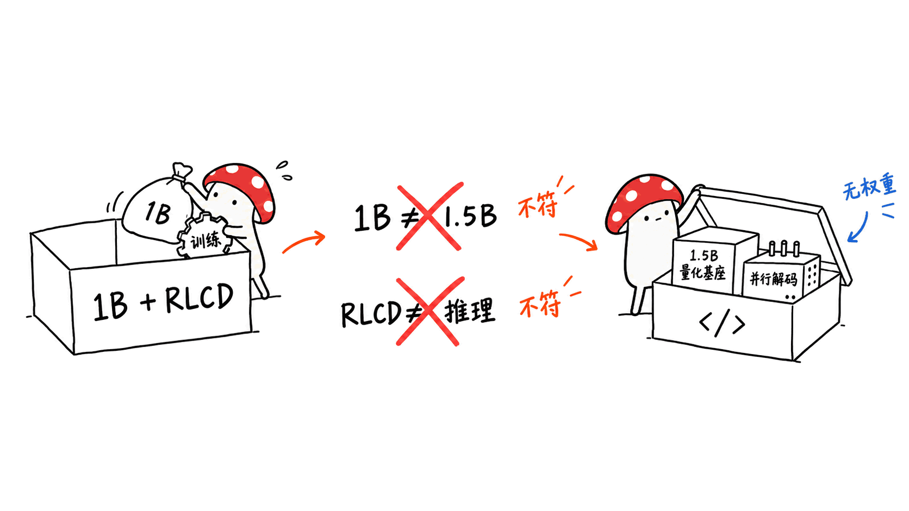
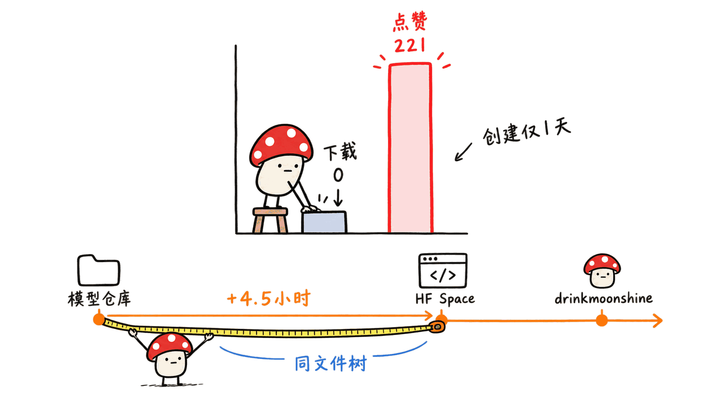
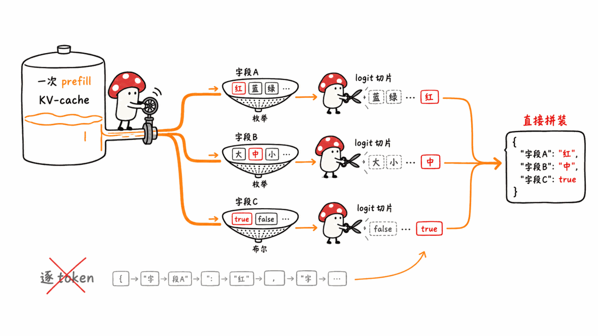

**BLUF**：harshatheg/Qwen-2.5-1B-RLCD 是我们在 HuggingFace 雷达上命中的一个模型仓库，2026-09-16 创建，我们抓取时 **0 下载、221 赞**。名字暗示两件事——参数量 1B、用了 RLCD（Reinforcement Learning from Contrastive Distillation，强化学习对比蒸馏）训练——我们通读了它的 README.md 和 MODEL_CARD.md 全文，**两件事都不成立**：仓库真正调用的基座是 `mlx-community/Qwen2.5-1.5B-Instruct-4bit`（1.5B，不是 1B），全文没有一处提到 RLCD 或任何强化学习、对比蒸馏相关的训练过程，文件列表里也**没有任何模型权重文件**（没有 .safetensors、.gguf，一个都没有）。它实际是一套用 MLX 在 Apple Silicon 上做「并行约束解码」（Parallel Constrained Decoding）的推理代码，用来加速结构化 JSON 抽取和分类任务，跟微调、强化学习没有关系。

这篇文章讲三件事：这个仓库实际是什么、名字和内容为什么对不上、以及它背后那套推理技巧本身有没有价值。

## 仓库里到底有什么？

HuggingFace 模型 API 给出的基本信息（2026-09-17 抓取）：

- **创建时间**：2026-09-16 01:35 UTC；**最后更新**：2026-09-16 06:23 UTC，一天之内
- **下载量**：0；**点赞**：221
- **license**：apache-2.0
- **base_model 标签**：`Qwen/Qwen2.5-1.5B-Instruct`（HF 官方标签字段，作者自己填的）
- **library_name**：mlx
- **文件清单**（`siblings`）：`.gitattributes`、`.gitignore`、`Dockerfile`、`MODEL_CARD.md`、`README.md`、`app.py`、`core/`（5 个 Python 文件）、`presets/`（4 个 JSON 预设）、`requirements*.txt`、`run.sh`、`server/`（2 个文件）、`web/`（HTML/JS/CSS）

**没有任何权重文件。** 一个自称是「模型」的 HuggingFace 仓库，实际内容是一个约 15 个文件的推理引擎 + Web 演示应用。README 和 MODEL_CARD 里都写得很清楚：这套代码在运行时加载社区已经量化好的 `mlx-community/Qwen2.5-1.5B-Instruct-4bit`，自己不提供、不修改任何模型权重。

## 名字里的两处名不副实

### RLCD 是什么？仓库里真的用了吗？

RLCD（Reinforcement Learning from Contrastive Distillation）是 NLP 文献里确实存在的一个方法名（Yang 等 2023 年论文，arXiv 2307.12950），大意是用正负对比样本对生成偏好数据、再做强化学习对齐。**但我们通读的 README.md 和 MODEL_CARD.md 全文，没有一处出现「RLCD」「reinforcement learning」「contrastive」「distillation」这几个词**，也没有任何训练脚本、训练数据、奖励模型或强化学习循环的描述。两份文档从头到尾讲的都是同一件事：怎么用 KV-cache 广播把多字段 JSON 抽取从逐 token 生成变成并行 logit 切片。仓库名里的 RLCD 找不到对应内容，属于凭空挂名。

### 1B 是什么？实际基座是多大？

仓库名叫 Qwen-2.5-**1B**-RLCD，但 HF 的 `base_model` 标签、README 和 MODEL_CARD 里写的基座都是 `Qwen/Qwen2.5-1.5B-Instruct`（推理时用的是它的 4bit 量化版 `mlx-community/Qwen2.5-1.5B-Instruct-4bit`）。Qwen2.5 系列确实有官方 0.5B、1.5B、3B、7B 等档位，但**没有一个叫 1B 的官方版本**——1B 这个数字既不是仓库自己声明的基座参数量，也不对应 Qwen2.5 系列任何一个真实档位，来源不明。

### 权重呢？

**没有。** 这不是「权重另外托管」的情况——README 里也没有指向任何外部权重仓库的说明；它明确说使用的是 `mlx-community/Qwen2.5-1.5B-Instruct-4bit` 这个**别人已经发布好的**量化模型，本仓库的代码在运行时直接从 HuggingFace 拉取它。换句话说，"Qwen-2.5-1B-RLCD" 这个仓库不产出、不分发任何独立的模型制品，它是一个应用层项目，被放进了 HuggingFace 的 Models 命名空间。

## 0 下载、221 赞，正常吗？

一个昨天（2026-09-16）才创建的仓库，24 小时内积累 221 个赞、却是 0 下载，这个比例在我们见过的正常项目里很少见——点赞通常伴随一定下载或浏览行为，两者完全脱钩值得记一笔，但我们**没有证据判断这是不是刷赞**，只如实报告这个数字组合本身反常。

另外一个值得记录的事实：这套完全相同的文件清单（同样的 `core/`、`presets/`、`web/`、`Dockerfile` 等）同时以 **Gradio Space** 的形式存在，仓库 ID 是 `drinkmoonshine/parallel-constrained-decoding`，作者账号名和模型仓库的作者 `harshatheg` **不是同一个**。这个 Space 创建于 2026-09-16 06:00 UTC，比模型仓库晚了约 4.5 小时；模型仓库的 README 最后一次更新（06:23 UTC）里加上了指向这个 Space 的「Live Demo」链接，时间点在 Space 创建之后。两个仓库文件树逐字节一致（我们比对了 `siblings` 字段），说明这是同一套代码在两个账号下的镜像发布，但我们无法从公开信息判断这两个账号是否为同一人操作。

## 剥离掉名字之后，「并行约束解码」这个技术点本身站得住吗？

剥离掉误导性的命名，这个仓库要解决的问题是真实存在的：结构化 JSON 抽取／分类任务如果逐 token 自回归生成，字段越多越慢，且有语法出错、字段遗漏的风险。仓库的方案是：

1. 把上下文和 schema 描述一次性 prefill 进 KV-cache
2. 这份 KV-cache 广播给所有待判断字段
3. 每个字段只在它自己的候选 token 子集（枚举选项或布尔值）上算 logit，其余词表整体掩掉
4. 对候选子集做 softmax，取概率最高的选项，同时拿到校准后的置信度
5. 直接拼装成 JSON，不走语法解析器，所以「100% 语法合法」

这套思路在结构化生成/约束解码这个方向上并不新——`outlines`、`guidance`、`lm-format-enforcer`、以及 vLLM/SGLang 自带的 guided decoding，都用「把候选压缩到 token 子集再选」的方式做枚举/布尔字段的快速判定。这个仓库的增量是**把它实现在 MLX 上、面向 Apple Silicon 统一内存**，并给出一个可以本机跑的 Web 对比界面。仓库自己报的数字（M4 Max，128GB 统一内存，MLX 0.22+）：

| 场景 | 字段数 | 自回归基线 | 并行约束解码 | 加速比 |
|---|---:|---:|---:|---:|
| 金融欺诈路由 | 4 | 420 ms | 75 ms | 5.6x |
| 代码安全审计 | 4 | 380 ms | 68 ms | 5.6x |
| 高基数分类（255 选项） | 1 | 500 ms | 89 ms | 5.6x |
| 企业工单分诊 | 28 | 1,900 ms | 270 ms | 7.0x |

这些数字**是作者自报的，我们没有在本机复现**（本机没有安装 mlx / mlx-lm，复现需要先下载 mlx-community/Qwen2.5-1.5B-Instruct-4bit，体积不大，在本文允许的 5GB 限额内，但我们判断这次调研的核心争议点是命名而不是性能，没有把这一步作为必需项），也没有跟 outlines/guidance 等现成方案做过横向对比。数量级是合理的——把「生成几十个 token」压缩成「一次并行 logit 切片」，理论上确实能省掉大部分自回归步数——但具体倍数、以及跟同类工具比是否仍有优势，没有第三方验证。

## 为什么这类「关键词嫁接」值得单独写一篇？

HuggingFace 的模型仓库 ID 是作者自己随便起的字符串，平台不校验它是否对应仓库真实内容。把一个跟微调、强化学习毫无关系的推理引擎демо，起名叫「Qwen-2.5-1B-RLCD」，客观效果是蹭上了「RLCD」这个 2023 年就有学术定义、当下也还有人搜索的关键词，以及一个听起来更小巧、更容易被认为「个人可训得动」的「1B」标签。对搜索和推荐系统（包括我们自己在跑的雷达）来说，这种命名会把一个应用层项目误判成一个新发布的微调模型，浪费核实成本；对普通用户来说，点进去期待看到训练细节和权重下载，得到的是一套调用别人量化模型的应用代码。

我们判断这不属于「空壳骗星」——代码是真实的、能说明白在做什么，MODEL_CARD 写得也算清楚（如果你只看 MODEL_CARD 不看仓库名，反而不会被误导）。但仓库 ID 本身的关键词选择，和它承诺交付的内容完全对不上，这个反差本身就是值得记录的一手事实。

## 常见问题

**Q：Qwen-2.5-1B-RLCD 是一个微调过的模型吗？**
A：不是。仓库不含任何模型权重文件，运行时直接调用别人发布的 `mlx-community/Qwen2.5-1.5B-Instruct-4bit`。它是一套推理时的解码策略代码，不涉及训练或微调。

**Q：RLCD 在这个项目里指什么？**
A：README 和 MODEL_CARD 全文都没有解释或使用「RLCD」这个词。RLCD 作为一个 NLP 术语（Reinforcement Learning from Contrastive Distillation）另有出处（arXiv 2307.12950），跟这个仓库没有可见的关联。

**Q：这个「并行约束解码」技术本身有用吗？**
A：思路成立，在枚举/布尔字段的结构化抽取场景里，用候选 token 子集做并行 logit 判定确实能省掉大部分自回归步数，同类做法在 outlines、guidance、vLLM/SGLang 的 guided decoding 里也有。仓库给出的 5.6x-7.0x 加速比是作者自报，我们没有独立复现，也没有做横向对比。

**Q：为什么下载量是 0 但有 221 个赞？**
A：我们如实记录了这个反常比例，但没有证据判断成因，不做定性结论。

## 一手源

- HuggingFace 模型 API：https://huggingface.co/api/models/harshatheg/Qwen-2.5-1B-RLCD
- README：https://huggingface.co/harshatheg/Qwen-2.5-1B-RLCD/raw/main/README.md
- MODEL_CARD：https://huggingface.co/harshatheg/Qwen-2.5-1B-RLCD/raw/main/MODEL_CARD.md
- 同代码的 Gradio Space（不同作者账号）：https://huggingface.co/spaces/drinkmoonshine/parallel-constrained-decoding
- Space API：https://huggingface.co/api/spaces/drinkmoonshine/parallel-constrained-decoding
- RLCD 论文（术语出处，与本仓库无关联）：https://arxiv.org/abs/2307.12950
- 基座模型：https://huggingface.co/Qwen/Qwen2.5-1.5B-Instruct

---

> © 2026 Author: Mycelium Protocol. 本文采用 [CC BY 4.0](https://creativecommons.org/licenses/by/4.0/deed.zh) 授权——欢迎转载和引用，须注明作者姓名及原文链接，不得去除署名后以原创发布。

<!--EN-->

**BLUF**: harshatheg/Qwen-2.5-1B-RLCD is a model repository we caught on our HuggingFace radar, created 2026-09-16, showing **0 downloads and 221 likes** when we pulled it. The name implies two things — a 1B-parameter model and RLCD (Reinforcement Learning from Contrastive Distillation) training. We read the full README.md and MODEL_CARD.md, and **neither claim holds up**: the actual base model it calls is `mlx-community/Qwen2.5-1.5B-Instruct-4bit` (1.5B, not 1B), the documents never mention RLCD or anything resembling reinforcement learning or contrastive distillation, and the file list contains **no model weight files at all** (no .safetensors, no .gguf — none). What's actually here is MLX inference code for Apple Silicon implementing "Parallel Constrained Decoding" to speed up structured JSON extraction and classification, with nothing to do with fine-tuning or RL.

This post covers three things: what's actually in the repository, why the name doesn't match the content, and whether the underlying inference technique has any real value.

## What's actually in the repository?

Basic facts from the HuggingFace model API (fetched 2026-09-17):

- **Created**: 2026-09-16 01:35 UTC; **last modified**: 2026-09-16 06:23 UTC — same day
- **Downloads**: 0; **Likes**: 221
- **License**: apache-2.0
- **base_model tag**: `Qwen/Qwen2.5-1.5B-Instruct` (an HF metadata field, self-reported by the author)
- **library_name**: mlx
- **File list** (`siblings`): `.gitattributes`, `.gitignore`, `Dockerfile`, `MODEL_CARD.md`, `README.md`, `app.py`, `core/` (5 Python files), `presets/` (4 JSON presets), `requirements*.txt`, `run.sh`, `server/` (2 files), `web/` (HTML/JS/CSS)

**No weight files of any kind.** A HuggingFace repository that calls itself a "model" is, in reality, a roughly 15-file inference engine plus a web demo app. Both the README and the MODEL_CARD say clearly that this code loads a community-quantized `mlx-community/Qwen2.5-1.5B-Instruct-4bit` model at runtime — it ships or modifies no weights of its own.

## Two mismatches baked into the name

### What is RLCD, and does the repo actually use it?

RLCD (Reinforcement Learning from Contrastive Distillation) is a real method name from the NLP literature (Yang et al. 2023, arXiv 2307.12950), roughly: generate preference data from contrastive positive/negative samples, then run RL alignment on top. **We read the entire README.md and MODEL_CARD.md, and the words "RLCD," "reinforcement learning," "contrastive," and "distillation" appear nowhere in either document**, nor is there any training script, training data, reward model, or RL loop described. Both documents, start to finish, describe one thing: turning multi-field JSON extraction from token-by-token generation into parallel logit slicing via KV-cache broadcasting. The RLCD in the repo name has no corresponding content anywhere — it's an unsupported label.

### What about the "1B"? How big is the actual base model?

The repo is named Qwen-2.5-**1B**-RLCD, but the HF `base_model` tag, the README, and the MODEL_CARD all state the base as `Qwen/Qwen2.5-1.5B-Instruct` (running its 4-bit quantization, `mlx-community/Qwen2.5-1.5B-Instruct-4bit`, at inference time). Qwen2.5 does ship official 0.5B, 1.5B, 3B, 7B, and other tiers — but **there is no official "1B" tier**. The number 1B is neither the parameter count the repo itself declares, nor does it correspond to any real Qwen2.5 checkpoint; its origin is unclear.

### And the weights?

**None.** This isn't a case of "weights hosted elsewhere" — the README gives no pointer to an external weights repository either. It states plainly that it uses `mlx-community/Qwen2.5-1.5B-Instruct-4bit`, an **already-published** quantization by someone else, pulled from HuggingFace at runtime. In other words, the "Qwen-2.5-1B-RLCD" repository produces and distributes no independent model artifact of its own — it's an application-layer project sitting in HuggingFace's Models namespace.

## Is 0 downloads and 221 likes normal?

A repository created just yesterday (2026-09-16) accumulating 221 likes in 24 hours with 0 downloads is a ratio we rarely see among normal projects — likes usually track at least some download or browsing activity, and the two being fully decoupled here is worth noting. But we have **no evidence to judge whether this reflects inflated engagement**; we're simply reporting the anomalous combination as observed.

One more fact worth recording: the identical file tree (same `core/`, `presets/`, `web/`, `Dockerfile`, etc.) also exists as a **Gradio Space**, under the repo ID `drinkmoonshine/parallel-constrained-decoding`. The account name is different from the model repo's author, `harshatheg`. This Space was created 2026-09-16 06:00 UTC, about 4.5 hours after the model repo. The model repo's last README update (06:23 UTC) added a "Live Demo" link pointing to that Space, timestamped after the Space's creation. The two file trees are byte-for-byte identical (we compared the `siblings` fields), indicating the same codebase mirrored across two accounts — but we cannot determine from public information whether the two accounts are operated by the same person.

## Strip away the name — does "Parallel Constrained Decoding" hold up on its own?

Set the misleading naming aside, and the problem this repository addresses is real: structured JSON extraction and classification tasks, generated autoregressively token by token, get slower as the number of fields grows, and carry risks of syntax errors or omitted fields. The approach here:

1. Prefill the context and schema description once into a KV-cache
2. Broadcast that KV-cache across every field to be decided
3. For each field, compute logits only over its own candidate token subset (enum options or booleans), masking out the rest of the vocabulary
4. Apply softmax over the candidate subset, take the highest-probability choice, and get a calibrated confidence score
5. Assemble the JSON directly, with no syntax parser — hence "100% valid syntax"

This idea isn't new within structured/constrained generation — `outlines`, `guidance`, `lm-format-enforcer`, and vLLM/SGLang's built-in guided decoding all use the same "compress candidates to a token subset, then pick" approach for fast enum/boolean field decisions. This repo's contribution is **implementing it on MLX for Apple Silicon's unified memory**, plus a runnable web comparison UI. The self-reported numbers (M4 Max, 128GB unified memory, MLX 0.22+):

| Scenario | Fields | Autoregressive baseline | Parallel constrained | Speedup |
|---|---:|---:|---:|---:|
| Fintech fraud routing | 4 | 420 ms | 75 ms | 5.6x |
| Code security audit | 4 | 380 ms | 68 ms | 5.6x |
| High-cardinality classification (255 choices) | 1 | 500 ms | 89 ms | 5.6x |
| Enterprise support triage | 28 | 1,900 ms | 270 ms | 7.0x |

These numbers are **self-reported by the author; we did not reproduce them locally** (our machine has neither mlx nor mlx-lm installed; reproducing would require downloading `mlx-community/Qwen2.5-1.5B-Instruct-4bit`, which is small enough to fit our 5GB limit, but we judged the core issue in this piece to be the naming mismatch rather than performance, so we didn't treat this step as mandatory), and we did not benchmark it against established alternatives like outlines or guidance. The order of magnitude is plausible — collapsing "generate dozens of tokens" into "one parallel logit slice" should indeed cut most autoregressive steps — but the exact multiplier, and whether it still holds an edge against comparable tools, is unverified by a third party.

## Why does this kind of "keyword grafting" deserve its own post?

A HuggingFace model repo ID is a string the author chooses freely, and the platform doesn't check whether it matches the repo's actual content. Naming an inference-engine demo that has nothing to do with fine-tuning or reinforcement learning "Qwen-2.5-1B-RLCD" has the objective effect of riding on "RLCD" — a term with an academic definition dating to 2023 that people still search for — plus a "1B" label that sounds smaller and more approachable for a solo developer to have trained. For search and recommendation systems (including the radar we run ourselves), this kind of naming misclassifies an application-layer project as a newly released fine-tuned model, wasting verification effort. For an ordinary user clicking through expecting training details and weight downloads, what they get is application code calling someone else's quantized model.

We don't consider this an "empty shell/star-farming" case — the code is real and clearly explains what it does, and the MODEL_CARD is written reasonably clearly (if you read only the MODEL_CARD and skip the repo name, you're actually not misled). But the keyword choice in the repo ID itself doesn't match what it delivers at all, and that gap is itself a fact worth recording.

## FAQ

**Q: Is Qwen-2.5-1B-RLCD a fine-tuned model?**
A: No. The repository contains no model weight files. At runtime it calls someone else's published `mlx-community/Qwen2.5-1.5B-Instruct-4bit`. It's decoding-strategy code that runs at inference time; no training or fine-tuning is involved.

**Q: What does RLCD refer to in this project?**
A: Neither the README nor the MODEL_CARD explains or uses the word "RLCD" anywhere in the text. RLCD as an NLP term (Reinforcement Learning from Contrastive Distillation) has a separate origin (arXiv 2307.12950) with no visible connection to this repository.

**Q: Does the "Parallel Constrained Decoding" technique itself have value?**
A: The idea holds up — for structured extraction with enum/boolean fields, using candidate token subsets for parallel logit decisions does eliminate most autoregressive steps, and comparable approaches exist in outlines, guidance, and vLLM/SGLang's guided decoding. The repo's claimed 5.6x-7.0x speedups are self-reported; we did not reproduce them independently or benchmark against alternatives.

**Q: Why 0 downloads but 221 likes?**
A: We recorded this anomalous ratio as observed, but we have no evidence to determine the cause and draw no conclusion about it.

## Primary Sources

- HuggingFace model API: https://huggingface.co/api/models/harshatheg/Qwen-2.5-1B-RLCD
- README: https://huggingface.co/harshatheg/Qwen-2.5-1B-RLCD/raw/main/README.md
- MODEL_CARD: https://huggingface.co/harshatheg/Qwen-2.5-1B-RLCD/raw/main/MODEL_CARD.md
- Same code as a Gradio Space (different author account): https://huggingface.co/spaces/drinkmoonshine/parallel-constrained-decoding
- Space API: https://huggingface.co/api/spaces/drinkmoonshine/parallel-constrained-decoding
- RLCD paper (term origin, unrelated to this repo): https://arxiv.org/abs/2307.12950
- Base model: https://huggingface.co/Qwen/Qwen2.5-1.5B-Instruct

---

> © 2026 Author: Mycelium Protocol. Licensed under [CC BY 4.0](https://creativecommons.org/licenses/by/4.0/) — free to share and adapt with attribution. You must credit the author and link to the original; removing attribution and republishing as original is not permitted.
