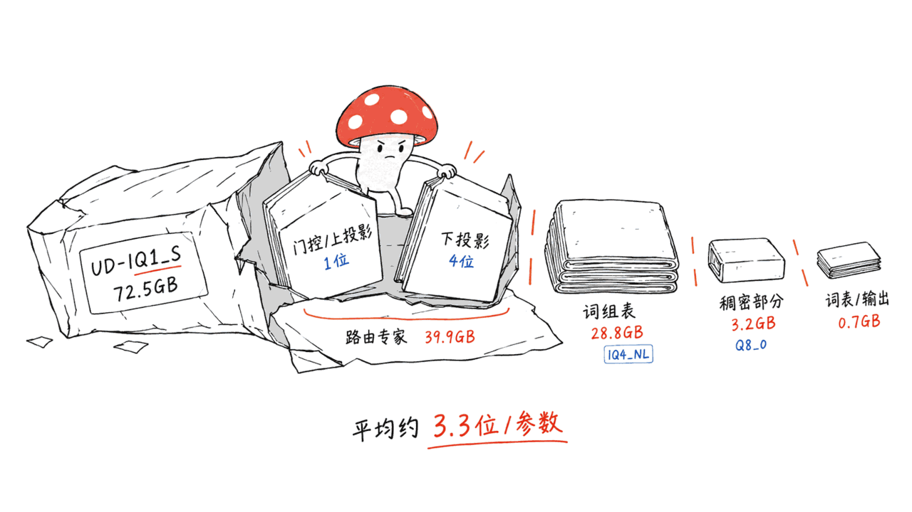
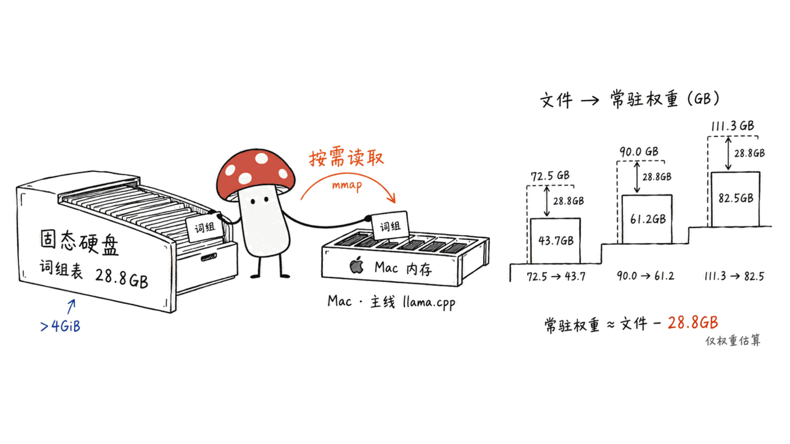
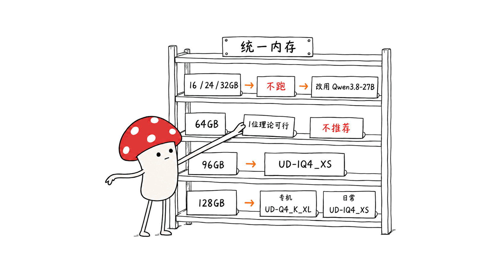
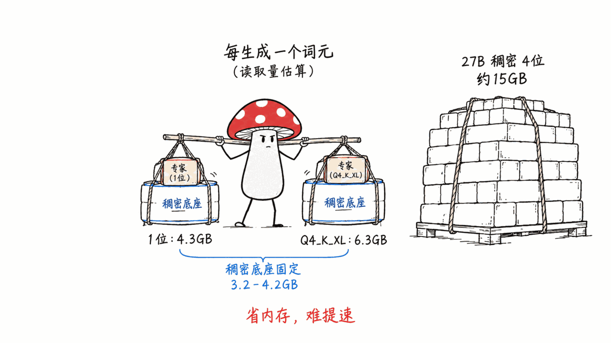

**BLUF**：Qwen3.8-Flash-Next 是阿里 Qwen 团队放出的 Qwen4 架构预览版：**125B 总参数、每 token 激活 6B**，另外还挂着一张 **51B 参数的 n-gram 嵌入表**，原生上下文 262,144。unsloth/Qwen3.8-Flash-Next-GGUF 是它下载量最高的 GGUF 量化（HF API 显示 1,106,182 次下载），一共 10 个量化档，从 72.5GB 到 188.2GB。我们没有下载权重，而是用 HTTP Range 请求读了每个量化档的 GGUF 张量头，发现三件文件名上看不出来的事：

1. **「1-bit」只是专家 gate/up 投影的精度。** 专家的 down 投影是 4-bit，注意力和线性注意力层是 8-bit，n-gram 表最低也是 4-bit（这张表的行宽只有 160，放不下更低位的块格式）。所以最小的 UD-IQ1_S 仍有 72.5GB，全模型平均约 3.3 bit/参数。
2. **文件大小不等于常驻内存。** 主线 llama.cpp 默认把大于 4GiB 的 n-gram 表留在磁盘上按需读取，在 Mac 上常驻内存约等于文件大小减去 28.8GB（Q5 及以上档减 54.4GB）。
3. **压到更低的档位省内存，但几乎不提速。** 每生成一个 token，要读的数据大头是那 3–4GB 的稠密部分，专家压到 1-bit 也省不了多少读取量。

按 Mac 统一内存给结论：**16/24/32GB 跑不了，老老实实用 Qwen3.8-27B；64GB 只在理论上能跑 1-bit 档，我们不推荐；96GB 用 UD-Q3_K_XL 或 UD-IQ4_XS；128GB 用 UD-Q4_K_XL。** 还有一点要先想清楚：它的许可证不是 Apache-2.0，而是 Qwen Community License 1.0。

> 📌 一手资料
> Unsloth GGUF：https://huggingface.co/unsloth/Qwen3.8-Flash-Next-GGUF
> Qwen 官方模型卡：https://huggingface.co/Qwen/Qwen3.8-Flash-Next
> Unsloth 运行指南：https://unsloth.ai/docs/models/qwen3.8-next
> llama.cpp 架构支持 PR：https://github.com/ggml-org/llama.cpp/pull/27742

---

## 为什么这篇和本站之前的 Qwen3.8 文章不重复？

本站写过好几篇 Qwen3.8-27B：Mac M1 Max 64GB 安装指南、两条消融路线、HauhauCS 的 FastMTP GGUF、IST 的 GSQ-RCO 非均匀量化。那些文章讲的都是 **27B 稠密模型**，面向 16–64GB 的机器。《IU4 原生 4bit 通道》那篇的表格里也提过 `Qwen3.8-Flash-Next-MTP-Strix-Halo-GGUF`，不过那篇讲的是 AMD Strix Halo 上的量化路线。

这篇只讲一件事：**Flash-Next 这个 MoE 模型，在 Mac 上到底要多大内存、该选哪个量化档。**这两个模型不是一个量级。27B 是 Apache-2.0 协议、32GB 内存就能跑的日常模型；Flash-Next 要 96GB 起步，许可证还有条件，但在 Agent 类任务上分数明显更高。本文最后有一张两者的对照表。

方法说明：本文的数字来自 HF API、官方模型卡、Unsloth 文档、llama.cpp 源码和 PR，以及 HF 社区讨论区里的实测帖。我们本机是 16GB 的 Mac mini，**跑不了这个模型，所以没有任何本机速度实测**。标了「推算」的数字是我们根据张量头算出来的。

## Qwen3.8-Flash-Next 是什么模型？

官方模型卡和技术报告给出的事实如下：

- **定位**：模型卡原话是「This experimental preview of the architecture that will underpin Qwen4」。Qwen Cloud 上的商用版 **Qwen3.8-Flash** 就是基于它做的，默认上下文 1M，还带官方内置工具。开放权重的这一版原生上下文是 262,144，官方说用 YaRN 可以扩展到 1,000,000
- **参数**：语言模型 125B 总参、6B 激活，另有 51B n-gram 嵌入和 4B 的 MTP 层。HF safetensors 元数据统计为 179,999,981,459 个参数
- **结构**：48 层，排布是 12 组「3 层 Gated DeltaNet + 1 层 Qwen Sparse Attention（QSA）」，每层后面接 MoE。MoE 有 512 个专家，每个 token 激活 10 个路由专家和 1 个共享专家，专家中间维度 640
- **QSA**：注意力头 24 个 Q、2 个 KV，头维度 256。它先按微块（micro-block）挑选要看的上下文，预算是 512 个块或 2048 个 token
- **Gated Residual**：残差流拓宽成 4 条支路，用逐元素的门控来读写
- **N-gram 嵌入**：只放在第 2 层，用二元组和三元组做索引，共 20,000,000 条。技术报告说这张表「held off the accelerator」，平时放在主机内存里、提前预取；放在第 2 层，是为了让预取和第 1 层的计算并行
- **模态**：带视觉编码器，支持图片和视频输入；默认开启思考模式，`reasoning_effort` 可以设成 xhigh（默认）、medium 或 low
- **热度**（HF API，2026-09-11 抓取）：官方仓库 5,094 likes、586,040 次下载，创建于 8 月 24 日；Unsloth GGUF 888 likes、1,106,182 次下载，最后更新于 9 月 2 日

技术报告的摘要还说：在 14 项预训练基准上，它的 base 模型有 8 项领先上一代 397B-A17B 旗舰，另外 6 项最多落后 2.6 分，而每 token 激活参数约为前者的 1/3，训练 FLOPs 约为 1/9。

## 官方基准怎么看？

以下挑几项与本地部署有关的（全部来自官方模型卡，是 Qwen 自己测的）：

| 基准 | Flash-Next | Qwen3.8-27B | Qwen3.7-Plus | DeepSeek-V4-Flash-0731 | Claude-Opus-4.6 (Max) |
|---|---:|---:|---:|---:|---:|
| SWE-bench Pro | 62.5 | 61.7 | 55.8 | 56.0 | 53.4 |
| DeepSWE 1.1 | 58.7 | 42.2 | 16.5 | 54.4 | — |
| SWE-bench Multilingual | 81.0 | 73.8 | 75.8 | — | 77.5 |
| NL2Repo-Bench | 48.1 | 42.3 | 41.1 | 54.2 | 47.6 |
| JobBench | 55.7 | 33.4 | 27.6 | 41.3 | 36.6 |
| Toolathlon Verified | 73.5 | 67.1 | 50.6 | 70.3 | — |
| GPQA Diamond | 91.7 | 89.2 | 90.3 | 90.8 | 91.3 |
| HLE | 35.9 | 30.8 | 34.7 | 33.8 | 40.0 |
| LiveCodeBench v6 | 91.9 | 90.3 | 89.6 | 90.6 | 88.8 |

我们的读法有三点：

- **和 27B 比，差距主要在长程 Agent 任务上。** JobBench 高 22.3 分，DeepSWE 高 16.5 分；SWE-bench Pro 只高 0.8 分，GPQA 高 2.5 分，LiveCodeBench 高 1.6 分。如果你的场景是单轮问答和写代码，27B 已经很接近；如果是多步骤的 Agent 工作流，Flash-Next 的优势才明显
- **「超过 Claude Opus 4.6」要看测法。** Unsloth 文档说它「outperforms Claude-4.6-Opus (Max)」，但表里 Opus 那一列多数是空的；SWE-bench Pro 那一格，Opus 用的是官方公布的分数，其他模型则是 Qwen 用 Claude Code harness 在修正过的题集上重测的。HLE 上 Opus 还高 4.1 分
- **CoWorkBench 和 RecreationBench 是 Qwen 的内部基准**，外部没法复现

## 72.5GB 的「1-bit」档里装的是什么？



先看 HF tree API 返回的真实文件大小（逐个分片相加，单位 GB = 10⁹ 字节）。「PLE 精度」和「专家 gate/up 精度」两列，是我们用 Range 请求读 GGUF 张量头得到的：

| 量化档 | 分片数 | 文件总大小 | n-gram 表（PLE）精度 | 专家 gate/up 精度 | 专家 down 精度 |
|---|---:|---:|---|---|---|
| UD-IQ1_S | 3 | 72.55 GB | IQ4_NL | IQ1_S（34 层）+ IQ2_XXS（14 层） | IQ4_NL |
| UD-IQ1_M | 3 | 74.54 GB | IQ4_NL | IQ1_M + IQ2_XXS（各 24 层） | IQ4_NL |
| UD-Q2_K_XL | 3 | 78.87 GB | IQ4_NL | IQ2_XS（47 层）+ IQ3_XXS（1 层） | IQ4_NL |
| UD-IQ3_XXS | 3 | 81.96 GB | IQ4_NL | IQ2_S（47 层）+ IQ3_S（1 层） | IQ4_NL |
| UD-Q3_K_XL | 3 | 89.99 GB | IQ4_NL | IQ3_XXS（47 层）+ IQ4_XS（1 层） | IQ4_NL / Q8_0 |
| UD-IQ4_XS | 3 | 93.68 GB | IQ4_NL | IQ3_S（47 层）+ IQ4_XS（1 层） | IQ4_NL / Q8_0 |
| UD-Q4_K_XL | 4 | 111.33 GB | IQ4_NL | Q4_K（47 层）+ Q5_K（1 层） | Q5_1 / Q8_0 |
| UD-Q5_K_XL | 6 | 158.29 GB | Q8_0 | Q5_K（47 层）+ Q6_K（1 层） | Q8_0 |
| UD-Q6_K_XL | 6 | 169.17 GB | Q8_0 | Q6_K（47 层）+ Q8_0（1 层） | Q8_0 |
| Q8_0 | 6 | 188.23 GB | Q8_0 | Q8_0 | Q8_0 |
| BF16 | 8 | 354.03 GB | BF16 | BF16 | BF16 |

另外还有：视觉投影 `mmproj-F16.gguf` 0.90GB（BF16 版 0.91GB），MTP 草稿头 6 个文件（1.91–7.77GB），以及 0.58GB 的 imatrix 校准文件。

把张量按类别加总（推算，与实际文件大小的误差在 0.1% 以内），UD-IQ1_S 的 72.5GB 大致这样分：

- **n-gram 表 `per_layer_token_embd`**：形状 160 × 320,001,536，IQ4_NL，**28.8GB**
- **512 个路由专家**：39.9GB
- **稠密部分**（注意力、Gated DeltaNet、共享专家、残差门控等，大多是 Q8_0）：3.2GB
- **词表嵌入和输出头**：0.7GB

也就是说，文件名里的「1-bit」只是其中一类张量的精度。整个文件平均下来是 72.55GB × 8 ÷ 1769 亿参数 ≈ **3.3 bit/参数**。

为什么 n-gram 表不能压得更低？Unsloth 文档的解释是这张表「random access pattern」，压太狠会伤模型，所以最低保 4-bit。社区讨论区 #67 补了一个结构上的原因：这张表每行只有 160 个元素，而 IQ1/IQ2/K-quant 系列要求每行能被 256 整除，只有 IQ4_NL、Q8_0 这类 32 元素一块的格式能用。换句话说，就算 Unsloth 想把它压到 1-bit，GGUF 的格式也不支持。

这带来一个很实际的后果：**从 UD-IQ1_S 到 UD-IQ4_XS，文件大了 21GB，多出来的全部花在专家上**，n-gram 表和稠密部分一个字节都没变。所以对专家的精度来说，每多花 1GB 带来的收益，在低档位时比高档位大。

## Unsloth Dynamic 量化是什么？

Unsloth 把自己的方法叫 Dynamic 3.0（仓库 README 链接到 https://unsloth.ai/docs/basics/dynamic-3.0-ggufs ）。从这个仓库的文件能直接看出来的是：

- **按张量类别分配精度，不是全模型一刀切。** 专家 gate/up 最低，专家 down 高一档，注意力、GDN、残差门控保持 Q8_0，n-gram 表单独处理
- **层与层之间也不一样。** 比如 UD-IQ1_S 里，34 层的 gate/up 用 IQ1_S，另外 14 层用 IQ2_XXS；UD-Q3_K_XL 里有 5 层的专家 down 是 Q8_0
- **用了 importance matrix 校准。** GGUF 元数据里写着 `quantize.imatrix.dataset = unsloth_calibration_Qwen3.8-Flash-Next.txt`，926 个条目、45 个 chunk。校准文件本身也公开了（`imatrix_unsloth.gguf_file`）

具体哪一层用哪个精度是怎么决定的，Unsloth 没有公开算法，我们也就不猜了。

Unsloth 公布的 KLD 测试结果（与 BF16 对比，数字来自 Unsloth 文档）：

| 量化档 | 大小 | top-1 一致率 | 平均 KLD | 99.9% KLD |
|---|---:|---:|---:|---:|
| UD-IQ1_S | 72.5 GB | 77.3% | 0.396 | 7.21 |
| UD-IQ1_M | 74.5 GB | 79.7% | 0.315 | 6.20 |
| UD-Q2_K_XL | 78.9 GB | 82.7% | 0.225 | 4.91 |
| UD-IQ3_XXS | 82.0 GB | 85.4% | 0.165 | 4.04 |
| UD-Q3_K_XL | 90.0 GB | 88.3% | 0.107 | 3.05 |
| UD-IQ4_XS | 93.7 GB | 89.6% | 0.084 | 2.37 |
| UD-Q4_K_XL | 111.3 GB | 92.3% | 0.047 | 1.55 |
| UD-Q5_K_XL | 158.3 GB | 93.7% | 0.030 | 1.00 |
| UD-Q6_K_XL | 169.2 GB | 94.1% | 0.027 | 0.84 |
| Q8_0 | 188.2 GB | 94.1% | 0.027 | 0.81 |

这张表要注意两件事：

1. **不同来源的数字不能放在一起比。** 同一个 UD-IQ1_S，Unsloth 这里测出 top-1 一致率 77.3%、平均 KLD 0.396；llama.cpp PR #28068 里另一位作者测出来是 93.4% 和 0.032。两边的参考模型和测试文本显然不一样。同一张表内部的排序有参考价值，绝对数字没有。连 Q8_0 在这张表里都只有 94.1% 的一致率，说明 Unsloth 选的测试文本比较难
2. **4-bit 以下，质量损失是看得见的。** 在 Unsloth 自己的测法下，1-bit 档大约每 4–5 个 token 就有 1 个和 BF16 的首选不同。社区 #62 的测试结果有好有坏：在 7.7 万 token 的上下文里逐字复述一个文件路径，UD-Q2_K_XL 100 次里对了 95 次，bartowski 的普通 Q2_K 只对了 25 次；但换一个短提示词，UD-Q2_K_XL 在贪心解码下 5 次都在路径中间提前停止，1-bit 的两个档反而没有这个问题。低档位的毛病很难提前预料。写代码、调工具这类要求精确的 Agent 任务，我们的建议是至少用 IQ4_XS

## 为什么文件 72.5GB，常驻内存却可以只要 44GB？



这是本文最关键的一节，Unsloth 文档对此只提了一句。

Unsloth 文档写的硬件需求是「1-bit 75GB、2-bit 79GB、3-bit 90GB、4-bit 96–114GB」，这是按整个文件都放进内存来算的。文档里其实也提到「You can also offload the PLE / Ngram layer to SSD and use mmap」，但没展开。

我们去翻了 llama.cpp 主线源码，看到的情况是：

- 8 月 27 日合入的 PR #27794 给模型加载器增加了 `TENSOR_READ_LAZY`：带 PLE 或 n-gram 嵌入的模型，这张表**不必整张读进内存，通过 mmap 按行读取**
- 现在对应的参数是 `-lzm / --lazy-mode`，取值 on、auto、off。`include/llama.h` 里 AUTO 的注释是「lazy only for marked tensors larger than 4 GiB (requires mmap)」
- 9 月 8 日合入的 PR #28326 让不支持 mmap 的设备（比如部分核显）把 auto 回退成 off。我们查了 Metal 后端的源码，它声明 `mmap_support = true`，所以 **在 Mac 上默认就是懒加载**

28.8GB 的 n-gram 表远大于 4GiB，所以在 Mac 上用主线 llama.cpp 跑时，常驻内存大约是这样（推算，只算权重，不含 KV 缓存和计算缓冲区）：

| 量化档 | 文件大小 | 常驻权重（去掉懒加载的 n-gram 表） |
|---|---:|---:|
| UD-IQ1_S | 72.5 GB | 43.7 GB（40.7 GiB） |
| UD-IQ1_M | 74.5 GB | 45.7 GB（42.6 GiB） |
| UD-Q2_K_XL | 78.9 GB | 50.1 GB（46.6 GiB） |
| UD-IQ3_XXS | 82.0 GB | 52.5 GB（48.9 GiB） |
| UD-Q3_K_XL | 90.0 GB | 61.2 GB（57.0 GiB） |
| UD-IQ4_XS | 93.7 GB | 64.9 GB（60.4 GiB） |
| UD-Q4_K_XL | 111.3 GB | 82.5 GB（76.9 GiB） |
| UD-Q5_K_XL | 158.3 GB | 103.9 GB（96.7 GiB） |

这个推算有独立的旁证。社区 #67 的一位 Strix Halo 用户说，UD-Q4_K_XL 在 262K 上下文、q8_0 KV 缓存、带 MTP 头的配置下，GPU 侧要 85.4 GiB，那张 28.8GB 的表一直留在主机内存里；这和我们算的 76.9 GiB 权重加上 KV、MTP、计算缓冲区是对得上的。另一个旁证是 #50 那位 M4 Max 用户，他测到的 MLX 版本常驻内存是 46.9–49.1GB，原因也是 n-gram 表走了 mmap。

懒加载也有代价，主要是 **prefill 变慢**：

- 解码时，每个 token 查 16 次表（2 种 n-gram × 每种 8 个头），有效数据只有约 1.4KB。但磁盘是按页读的，Apple Silicon 的内存页是 16KB，每次随机查表都可能读一整页进来
- PR #28136（未合入）的作者在 DGX Spark 上发现，真实文本的 prefill 只有约 300 tok/s，而重复 token 的测试能到 700 以上。原因是真实文本要查的表项多得多，mmap 的随机读就成了瓶颈
- PR #27794 在 Gemma 4 E4B 上的测试显示，懒加载会让解码速度下降 8–11%；作者认为模型越大，这部分开销的占比越小
- n-gram 表的页读过一次之后会留在系统的页缓存里。所以 **空闲内存越多，懒加载越接近全部常驻的速度**。在 128GB 的机器上跑 Q4_K_XL，82.5GB 常驻加上 28.8GB 页缓存，一共约 111GB，基本能全装下

## 按 Mac 统一内存，该选哪个量化档？



先说一个 macOS 的限制：GPU 默认只能用一部分统一内存（社区常用的经验值是大内存机型约 75%，各机型略有差异）。超出这个上限，要用 `sudo sysctl iogpu.wired_limit_mb=<MB>` 调高，重启后会恢复默认。下表的「常驻」是上一节的推算值，另外还要给 KV 缓存留空间，32K 上下文约 0.9GB，262K 约 7.2GB（推算见 FAQ）。

| 统一内存 | 能跑的档位 | 我们的建议 |
|---|---|---|
| **16GB** | 没有。最小档常驻也要 43.7GB | 别试。本地模型用 Qwen3.8-27B 的 2–3 bit 版或者更小的模型 |
| **24GB** | 没有 | 用 GSQ-RCO 版的 Qwen3.8-27B（11.8GB，本站写过） |
| **32GB** | 没有 | 用 Qwen3.8-27B 的 4-bit，本站的 MLX / GGUF 指南都覆盖了这个配置 |
| **64GB** | 官方口径不行。理论上 UD-IQ1_S（常驻 40.7 GiB）和 UD-IQ1_M（42.6 GiB）刚好低于 64GB 机器的 GPU 默认上限，前提是 n-gram 表走 SSD 懒加载、上下文开小 | **不推荐。**我们没有找到任何人在 64GB Mac 上公开验证过；剩下留给系统和页缓存的内存只有十几 GB，prefill 会频繁读 SSD；质量是 top-1 一致率 77–80% 的档位。64GB 的机器跑 Qwen3.8-27B 的 Q8 更稳 |
| **96GB** | UD-Q3_K_XL（常驻 57.0 GiB）或 UD-IQ4_XS（60.4 GiB） | 选 UD-IQ4_XS。和 Q3_K_XL 只差 3.7GB，n-gram 表还能有一部分留在页缓存里 |
| **128GB** | UD-Q4_K_XL（常驻 76.9 GiB） | **首选 UD-Q4_K_XL**，如果这台机器专门拿来跑模型的话。如果还要同时开 IDE、浏览器、Docker，退到 UD-IQ4_XS，给系统和页缓存多留 18GB |
| 192GB 及以上 | UD-Q5_K_XL / UD-Q6_K_XL | Q5 起 n-gram 表变成 Q8_0（54.4GB），文件一下子大了 47GB，Unsloth 的 top-1 一致率却只高 1.4 个百分点。我们觉得不划算，除非你在做质量对比研究 |

这张表和 Unsloth「至少 75GB，最好 96GB」的说法并不矛盾。Unsloth 是按整个文件常驻来算的，这样最保守，速度也最稳；我们给的是主线 llama.cpp 默认懒加载时的下限。

## Mac 上实际能跑多快？

社区讨论区里能找到的 Apple Silicon 实测不多，列出来（都是个人在单台机器上测的）：

| 机器 | 量化档 | 运行时 | 解码速度 | 来源 |
|---|---|---|---:|---|
| M4 Max 128GB | UD-Q3_K_XL | llama.cpp main（8 月 30 日版本），`-c 32768` | 27.33 tok/s | HF 讨论 #50 |
| 同一台机器 | 社区 MLX 版（专家 4-bit，其余 8-bit） | MLX，关闭 MTP | 45.01 tok/s | 同上 |
| 同一台机器 | 同上 | MLX，开启 MTP 投机解码 | 90.07 tok/s | 同上 |
| M1 Ultra 128GB | UD-IQ1_S | llama.cpp 早期版本（8 月 26 日） | 约 20 tok/s（prefill 约 400） | HF 讨论 #3 |
| M1 Ultra 128GB | 非 Unsloth 的 IQ4_NL 文件（95.2 GiB） | 作者自己的 Metal 优化分支 | 39.5 tok/s（上下文 1 万–4 万时约 35） | HF 讨论 #3 |

我们的解读有三点：

1. **Metal 上 llama.cpp 的实现还没到硬件上限。** 按张量头推算，UD-Q3_K_XL 每个 token 要读约 5.8GB 权重；按 M4 Max 最高配的 546GB/s 内存带宽算，理论上限约 94 tok/s，实测 27 tok/s，只用到约 29%。9 月 3 日 Metal 才合入稀疏 Flash Attention（PR #28098），9 月 6 日又修了 GDN 归一化的一个数值问题（PR #28068，影响 qwen35/qwen3next/qwen4exp 等多个架构）。**所以一定要用 9 月 6 日以后编译的 llama.cpp**，8 月底那批测试数字只能当下限看
2. **1-bit 省内存，但不怎么省时间。** 每个 token 要读的数据里，稠密部分（3.2–4.2GB）是固定的，专家压到 1-bit 也只能省下一部分。我们推算的每 token 读取量是：UD-IQ1_S 约 4.3GB、UD-Q3_K_XL 约 5.8GB、UD-Q4_K_XL 约 6.3GB。Unsloth 自己在 B200 上的测试也差不多：UD-IQ1_S 是 90.1 tok/s，UD-Q4_K_XL 是 83.2 tok/s，只快 8%。**如果内存装得下，没必要为了速度去选低档位**
3. **MLX 路线现在在 Mac 上占优，但那组对比条件不一致。** #50 的作者自己也写了：两边量化精度不同，上下文长度不同，MLX 用的还是消融版权重，只测了一台机器、一天的数据。能确定的是 MTP 的收益：同一个 MLX 包，开 MTP 后速度翻倍

## 在 Mac 上怎么跑？llama.cpp、LM Studio 和 Ollama 各是什么情况？



**llama.cpp（主线）**：8 月 27 日合入的 PR #27742 加上了 `qwen4exp` 架构，文本和视觉都支持。在 Mac 上编译时 Metal 默认开启，不用加 CUDA 参数：

```bash
git clone https://github.com/ggml-org/llama.cpp
cmake llama.cpp -B llama.cpp/build -DBUILD_SHARED_LIBS=OFF
cmake --build llama.cpp/build --config Release -j --target llama-server llama-cli

hf download unsloth/Qwen3.8-Flash-Next-GGUF \
  --local-dir Qwen3.8-Flash-Next-GGUF \
  --include "UD-Q4_K_XL/*" "mmproj-F16.gguf"

./llama.cpp/build/bin/llama-server \
  -m Qwen3.8-Flash-Next-GGUF/UD-Q4_K_XL/Qwen3.8-Flash-Next-UD-Q4_K_XL-00001-of-00004.gguf \
  --mmproj Qwen3.8-Flash-Next-GGUF/mmproj-F16.gguf \
  -ngl 99 -c 65536 --jinja \
  --temp 1.0 --top-p 0.95 --top-k 20 --min-p 0.0
```

- 采样参数用官方推荐值。思考模式：`temperature=1.0, top_p=0.95, top_k=20, min_p=0, presence_penalty=0`；非思考模式：`temperature=0.7, top_p=0.8, top_k=20, presence_penalty=1.5`，并加上 `--reasoning off`
- 调节思考深度：`--chat-template-kwargs '{"reasoning_effort":"medium"}'`。官方提醒，在多轮 Agent 任务里调低思考深度不一定能缩短总耗时，可能反而多出重试
- `--lazy-mode` 保持默认（auto）就行。如果内存富余，想要稳定的 prefill 速度，可以用 `-lzm off` 让整张表常驻
- 分片文件只要指向 `-00001-of-` 那个文件，llama.cpp 会自动读取其余分片

**MTP 投机解码**：主线 llama.cpp 目前还用不了。GGUF 转换脚本里写死了 `supports_mtp_export = False`，所以主模型文件里没有 MTP 层（这一点可以核实：GGUF 元数据里的参数总数是 176.9B，比 safetensors 的 180.0B 少了约 4B，正好是 MTP 那部分）。Unsloth 另外发了单独的 MTP 草稿头，推荐 `mtp-Qwen3.8-Flash-Next-shared-Q8_0.gguf`（2.79GB），但要用 Unsloth 的 llama.cpp 分支，或者自己编译还没合入的 PR #28243。Unsloth 在 B200 上贪心解码测到的收益是 UD-Q4_K_XL 从 83.2 到 138.8 tok/s（1.67 倍）；它也说了，温度调高后接受率会下降，并发 8 路时反而变慢（0.81–0.87 倍），在带宽较低的老 Mac 上收益也更小。Unsloth Desktop 会自动开启 MTP。

**LM Studio**：HF 讨论 #50 最早说「LM Studio 在 Mac 上完全加载不了」，但作者后来在 LM Studio 的 bug tracker（#2345）里更正了：GGUF 运行时 2.31.2 版已经支持 `qwen4exp`，UD-Q3_K_XL 能正常加载；当初他用 `strings` 查错了二进制文件。**MLX 运行时截至 9 月 1 日还没有支持**，LM Studio 的人说「looking to get it up soon」。所以在 LM Studio 里选 GGUF 版本，并把运行时升级到 2.31.2 以上。

**Ollama**：拉不了 Unsloth 这个仓库。Ollama 拉取分片 GGUF 会报「This repository only contains sharded GGUF files」，而 Unsloth 在 #18 里明确表示不会为 Ollama 单独上传合并后的文件。Ollama 官方库里有自己的版本：`qwen3.8-flash-next:125b-a6b-nvfp4`（MLX，105GB）、`125b-a6b-q4_K_M`（120GB）、`125b-a6b-q8_0`（189GB）、`125b-a6b-bf16`（355GB）。也就是说，在 Ollama 上最小的选项是 105GB，需要 128GB 的 Mac。Ollama 的 MLX 版本会不会像 llama.cpp 那样懒加载 n-gram 表，我们**没能核实**。

**Unsloth 文档里有三处小错，照抄会出问题**（截至 2026-09-11）：

1. 下载示例的注释写「Use "*IQ2_XXS*" for 2-bit」，但仓库里没有任何 IQ2_XXS 档，这个通配符什么都匹配不到。2-bit 档是 `UD-Q2_K_XL`
2. llama-cli 示例的路径是 `UD-IQ1_S/Qwen3.8-Flash-Next-UD-Q4_K_XL-00001-of-00004.gguf`，目录名和文件名对不上，原样运行会找不到文件
3. MTP 草稿长度：仓库里的 `MTP/README.md` 推荐 `--spec-draft-n-max 2`，文档页的示例写的是 5。以 README 为准，它附带了实测数据

## 许可证：Qwen Community License 1.0 有哪些限制？

这是和本站之前写的 Qwen3.8-27B 最大的区别：**27B 是 Apache-2.0，Flash-Next 是 Qwen Community License 1.0**（Unsloth 的 GGUF 沿用同一个协议）。协议全文很短，我们按条款转述（不构成法律意见）：

- **默认给的权利很宽**：可以免费使用、复制、修改、再分发、再授权、销售、部署、托管、微调，也可以做衍生作品
- **第 1 条，署名展示**：如果用它（或衍生作品）做的商业产品月活超过 1 亿，或者月收入超过 2,000 万美元，要在产品界面上显著标出模型名
- **第 2 条，要单独申请授权的两类业务**：如果你或你的关联方做「Model as a Service」（让第三方通过 API 等方式调用推理或微调，并且能控制输入、参数或训练数据），或者做「AI Work Assistant」（主要用于 AI 辅助编程或办公的独立产品，协议举的例子是 Qoder、QwenWork），**商用前要先向 Qwen 申请单独授权**。只在内部使用、不把模型能力开放给第三方的，不受这条限制
- 翻译工具这类单一用途的工具、非编程/办公领域的助手、以及作为其他产品某个功能的 AI 助手，不算 AI Work Assistant

对个人开发者来说：自己本地用、公司内部用，都没问题。但如果你打算拿它做一个 AI 编程助手卖给别人，或者开个 API 服务转卖推理，就需要先去申请授权。这恰好是 Flash-Next 基准分数最高的用途。如果你的计划是做这类产品，27B 的 Apache-2.0 协议反而更省心。

## 和 Qwen3.8-27B 放在一起，该怎么选？

| 维度 | Qwen3.8-Flash-Next | Qwen3.8-27B |
|---|---|---|
| 参数 | 125B 总参 / 6B 激活，另有 51B n-gram 表 | 27B 稠密 |
| 许可证 | Qwen Community License 1.0（MaaS 和 AI 编程/办公助手要单独授权） | Apache-2.0 |
| Mac 最低内存 | 96GB 可以放心跑；64GB 属于理论可行 | 32GB 跑 4-bit；24GB 跑 GSQ-RCO 11.8GB 版 |
| 每 token 读取量（4-bit 左右） | 约 6.3GB（UD-Q4_K_XL，推算） | 约 15GB（27B × 4.5 bit，推算） |
| 优势 | 长程 Agent 任务（JobBench +22.3、DeepSWE +16.5） | 内存门槛低、许可证宽松、生态成熟 |
| MTP | 主线 GGUF 不支持，需要分支版本 | 社区已有 FastMTP 方案（本站写过） |

我们的判断：**Flash-Next 是给已经有 96–128GB 内存的 Mac 用户的升级选项，不值得为它专门去买一台大内存 Mac。**如果内存装得下，它每 token 读的数据比 27B 少一半多，理论上解码更快，Agent 任务的分数也更高。装不下的话，Qwen3.8-27B 仍然是 16–64GB 机器上最稳的选择。另外，它的定位是「Qwen4 架构的实验性预览」，llama.cpp 那边相关的 bug 和优化 PR 每天都有新的，现在上生产还早了点。

## 常见问题

**Q：Unsloth 说 1-bit 版 75GB 就能跑，为什么你们说 64GB 也有可能？**
A：Unsloth 是按整个文件常驻内存算的。主线 llama.cpp 在 Mac 上默认把 28.8GB 的 n-gram 表留在 SSD 上按需读取，所以 UD-IQ1_S 的常驻权重约为 43.7GB。但这只是按源码推算的下限，我们没有找到 64GB Mac 的公开实测，prefill 速度和系统稳定性都没有验证过，所以不推荐。

**Q：「UD」前缀是什么意思？和 bartowski 的普通 IQ4_XS 有什么区别？**
A：UD 是 Unsloth Dynamic，也就是按张量类别和层来分配精度，注意力、GDN、残差门控这些都保持 Q8_0。社区 #67 的一组 wikitext 困惑度对比是：bartowski 的 IQ4_XS 为 3.064，Unsloth 的 UD-IQ4_XS 为 2.998，UD-Q4_K_XL 为 2.912。那位作者的结论是，在这个架构上，稠密部分保持 Q8_0 比专家多几 bit 更重要。

**Q：262K 上下文要多少内存？**
A：比同尺寸的模型少得多。48 层里只有 12 层 QSA 需要 KV 缓存，每层 2 个 KV 头、头维度 256，再加上索引器的 key 缓存，按 f16 推算每个 token 约 27KB。所以 32K 上下文约 0.9GB，128K 约 3.6GB，262K 约 7.2GB。另外 36 层 GDN 的状态是固定大小的，约 0.1GB。9 月 10 日合入的 PR #28330 去掉了索引器缓存里用不上的 V 部分，所以旧版本的 llama.cpp 会多占一些。

**Q：要不要下载 BF16 或 Q8_0 自己量化？**
A：BF16 一共 354GB，Q8_0 是 188GB，都超出了个人 Mac 的内存。Unsloth 把 imatrix 文件也公开了，想自己试不同的量化组合（比如社区 #67 那个把专家 down 投影换成 IQ4_NL、只有 102.5GB 的方案）可以用。但下载量摆在那里，大多数人直接用现成的档位就行。

**Q：能处理图片和视频吗？**
A：官方模型卡说支持图片和视频输入。在 llama.cpp 里需要加载 `mmproj-F16.gguf`（0.90GB）。llama.cpp 有一个还没关闭的 issue #27886，报告的是视觉输出的问题，重度依赖视觉的用户最好先自己测一下。

## 一手资料

- Unsloth GGUF 仓库：https://huggingface.co/unsloth/Qwen3.8-Flash-Next-GGUF
- Unsloth GGUF 文件树 API（文件大小）：https://huggingface.co/api/models/unsloth/Qwen3.8-Flash-Next-GGUF/tree/main?recursive=true
- Unsloth MTP 说明：https://huggingface.co/unsloth/Qwen3.8-Flash-Next-GGUF/blob/main/MTP/README.md
- Unsloth 运行指南：https://unsloth.ai/docs/models/qwen3.8-next
- Qwen 官方模型卡：https://huggingface.co/Qwen/Qwen3.8-Flash-Next
- Qwen Community License 1.0：https://huggingface.co/Qwen/Qwen3.8-Flash-Next/blob/main/LICENSE
- 技术报告：https://github.com/QwenLM/Qwen3.8-Flash-Next/blob/main/tech_report.pdf
- llama.cpp 架构支持 PR #27742：https://github.com/ggml-org/llama.cpp/pull/27742
- llama.cpp 懒加载 PR #27794：https://github.com/ggml-org/llama.cpp/pull/27794
- llama.cpp 懒加载默认值调整 PR #28326：https://github.com/ggml-org/llama.cpp/pull/28326
- llama.cpp GDN 归一化修复 PR #28068：https://github.com/ggml-org/llama.cpp/pull/28068
- llama.cpp Metal 稀疏 FA PR #28098：https://github.com/ggml-org/llama.cpp/pull/28098
- llama.cpp MTP PR #28243（未合入）：https://github.com/ggml-org/llama.cpp/pull/28243
- HF 讨论 #50（M4 Max 实测）：https://huggingface.co/unsloth/Qwen3.8-Flash-Next-GGUF/discussions/50
- HF 讨论 #3（速度分享）：https://huggingface.co/unsloth/Qwen3.8-Flash-Next-GGUF/discussions/3
- HF 讨论 #67（128GB 档位与常驻内存）：https://huggingface.co/unsloth/Qwen3.8-Flash-Next-GGUF/discussions/67
- LM Studio bug tracker #2345：https://github.com/lmstudio-ai/lmstudio-bug-tracker/issues/2345
- Ollama 官方库：https://ollama.com/library/qwen3.8-flash-next

本站相关文章：
- Qwen3.8-27B 的 Mac 安装指南：https://blog.mushroom.cv/blog/qwen38-27b-quasar-nvfp4-mac-mlx-install-guide/
- GSQ-RCO 把 27B 压到 11.8GB：https://blog.mushroom.cv/blog/gsq-rco-non-uniform-gguf-quantization/
- HauhauCS 的 27B FastMTP GGUF：https://blog.mushroom.cv/blog/hauhaucs-qwen3-8-27b-gguf-fastmtp-speculative-decoding-kp-quant/
- Strix Halo 上的 IU4 量化路线：https://blog.mushroom.cv/blog/kairic-edge-iu4-strix-halo-native-4bit-lane-qwen38-27b/
- Unsloth Desktop 发布：https://blog.mushroom.cv/blog/unsloth-desktop-local-run-train-ai-claude-code-mcp-finetuning/

---

> © 2026 Author: Mycelium Protocol. 本文采用 [CC BY 4.0](https://creativecommons.org/licenses/by/4.0/deed.zh) 授权——欢迎转载和引用，须注明作者姓名及原文链接，不得去除署名后以原创发布。

<!--EN-->

**BLUF**: Qwen3.8-Flash-Next is the Qwen team's preview of the Qwen4 architecture: **125B total parameters, 6B active per token**, plus a **51B-parameter n-gram embedding table**, with a native context of 262,144 tokens. unsloth/Qwen3.8-Flash-Next-GGUF is its most-downloaded GGUF quantization (1,106,182 downloads per the HF API), with 10 quant tiers from 72.5GB to 188.2GB. We didn't download the weights. Instead we used HTTP Range requests to read the GGUF tensor headers of every tier, and found three things the filenames don't tell you:

1. **"1-bit" only describes the experts' gate/up projections.** The expert down projections are 4-bit, the attention and linear-attention layers are 8-bit, and the n-gram table never goes below 4-bit (its rows are only 160 wide, too narrow for lower-bit block formats). So the smallest build, UD-IQ1_S, is still 72.5GB, about 3.3 bits per parameter across the whole model.
2. **File size isn't resident memory.** By default, mainline llama.cpp keeps n-gram tables larger than 4GiB on disk and reads them on demand. On a Mac, resident memory is roughly the file size minus 28.8GB (minus 54.4GB for Q5 and up).
3. **Lower tiers save memory, not time.** Most of the bytes read per generated token come from the 3–4GB dense part, so squeezing the experts down to 1-bit barely reduces reads.

By Mac unified memory: **16/24/32GB can't run it, so stick with Qwen3.8-27B. 64GB can run the 1-bit tier only in theory, and we don't recommend it. Use UD-Q3_K_XL or UD-IQ4_XS on 96GB and UD-Q4_K_XL on 128GB.** One more thing to settle up front: the license isn't Apache-2.0. It's the Qwen Community License 1.0.

> 📌 Primary sources
> Unsloth GGUF: https://huggingface.co/unsloth/Qwen3.8-Flash-Next-GGUF
> Official Qwen model card: https://huggingface.co/Qwen/Qwen3.8-Flash-Next
> Unsloth run guide: https://unsloth.ai/docs/models/qwen3.8-next
> llama.cpp architecture PR: https://github.com/ggml-org/llama.cpp/pull/27742

---

## How Is This Different From Our Earlier Qwen3.8 Posts?

We've written several posts on Qwen3.8-27B: a Mac M1 Max 64GB install guide, two abliteration lineages, HauhauCS's FastMTP GGUF, and IST's GSQ-RCO non-uniform quantization. All of those cover the **27B dense model** on 16–64GB machines. Our "IU4 Native 4-Bit Lane" post also listed `Qwen3.8-Flash-Next-MTP-Strix-Halo-GGUF` in a table, but that post was about the AMD Strix Halo quantization route.

This post is about one question: **how much memory does the Flash-Next MoE model need on a Mac, and which quant tier should you pick?** The two models are in different weight classes. 27B is an Apache-2.0 everyday model that runs in 32GB. Flash-Next needs 96GB to start and comes with license conditions, but scores clearly higher on agent tasks. There's a side-by-side table at the end.

On method: our numbers come from the HF API, the official model card, Unsloth's docs, llama.cpp source and PRs, and hands-on reports in the HF community discussions. Our machine is a 16GB Mac mini, which **can't run this model, so this post has no local speed measurements**. Numbers marked "estimated" are our own calculations from the tensor headers.

## What Is Qwen3.8-Flash-Next?

Facts from the official model card and technical report:

- **Positioning**: the model card calls it "This experimental preview of the architecture that will underpin Qwen4." The commercial **Qwen3.8-Flash** on Qwen Cloud is built on it, with a 1M default context and official built-in tools. This open-weight release has a native context of 262,144 tokens, which Qwen says YaRN can extend to 1,000,000.
- **Parameters**: the language model is 125B total with 6B active, plus 51B of n-gram embeddings and a 4B MTP layer. HF safetensors metadata counts 179,999,981,459 parameters.
- **Layout**: 48 layers arranged as 12 groups of "3 Gated DeltaNet layers + 1 Qwen Sparse Attention (QSA) layer," each followed by MoE. The MoE has 512 experts, with 10 routed plus 1 shared expert active per token and an expert intermediate size of 640.
- **QSA**: 24 Q heads and 2 KV heads with head dimension 256. It first selects which context to attend to at micro-block granularity, with a budget of 512 blocks or 2048 tokens.
- **Gated Residual**: the residual stream is widened to 4 branches, read and written through element-wise gates.
- **N-gram embedding**: a single layer at layer 2, indexed by bigrams and trigrams, with 20,000,000 entries. The technical report says the table is "held off the accelerator," kept in host memory and prefetched ahead of use. Placing it at layer 2 lets the prefetch overlap with layer 1's compute.
- **Modalities**: a vision encoder supports image and video input. Thinking mode is on by default, and `reasoning_effort` can be xhigh (default), medium or low.
- **Traction** (HF API, fetched 2026-09-11): the official repo has 5,094 likes and 586,040 downloads, created August 24. The Unsloth GGUF has 888 likes and 1,106,182 downloads, last updated September 2.

The technical report's abstract adds that on 14 pretraining benchmarks, the base model leads the previous 397B-A17B flagship on 8 and trails on the other 6 by at most 2.6 points, with about 1/3 the active parameters per token and about 1/9 the training FLOPs.

## How Should You Read the Official Benchmarks?

A selection relevant to local use (all from the official model card, measured by Qwen):

| Benchmark | Flash-Next | Qwen3.8-27B | Qwen3.7-Plus | DeepSeek-V4-Flash-0731 | Claude-Opus-4.6 (Max) |
|---|---:|---:|---:|---:|---:|
| SWE-bench Pro | 62.5 | 61.7 | 55.8 | 56.0 | 53.4 |
| DeepSWE 1.1 | 58.7 | 42.2 | 16.5 | 54.4 | — |
| SWE-bench Multilingual | 81.0 | 73.8 | 75.8 | — | 77.5 |
| NL2Repo-Bench | 48.1 | 42.3 | 41.1 | 54.2 | 47.6 |
| JobBench | 55.7 | 33.4 | 27.6 | 41.3 | 36.6 |
| Toolathlon Verified | 73.5 | 67.1 | 50.6 | 70.3 | — |
| GPQA Diamond | 91.7 | 89.2 | 90.3 | 90.8 | 91.3 |
| HLE | 35.9 | 30.8 | 34.7 | 33.8 | 40.0 |
| LiveCodeBench v6 | 91.9 | 90.3 | 89.6 | 90.6 | 88.8 |

Three takeaways:

- **Against 27B, the gap is mostly on long-horizon agent tasks.** It's 22.3 points ahead on JobBench and 16.5 on DeepSWE, but only 0.8 ahead on SWE-bench Pro, 2.5 on GPQA and 1.6 on LiveCodeBench. For single-turn Q&A and coding, 27B is close. The advantage shows up in multi-step agent workflows.
- **"Beats Claude Opus 4.6" depends on how it was measured.** Unsloth's docs say it "outperforms Claude-4.6-Opus (Max)," but most of the Opus column is empty. In the SWE-bench Pro cell, Opus uses its officially published score, while the other models were re-run by Qwen with the Claude Code harness on a corrected task set. Opus is also 4.1 points ahead on HLE.
- **CoWorkBench and RecreationBench are Qwen's in-house benchmarks** and can't be reproduced externally.

## What's Inside the 72.5GB "1-Bit" Build?


First, the actual file sizes from the HF tree API (shards summed, GB = 10⁹ bytes). The "PLE precision" and "expert gate/up precision" columns come from reading the GGUF tensor headers with Range requests:

| Tier | Shards | Total size | N-gram table (PLE) | Expert gate/up | Expert down |
|---|---:|---:|---|---|---|
| UD-IQ1_S | 3 | 72.55 GB | IQ4_NL | IQ1_S (34 layers) + IQ2_XXS (14) | IQ4_NL |
| UD-IQ1_M | 3 | 74.54 GB | IQ4_NL | IQ1_M + IQ2_XXS (24 layers each) | IQ4_NL |
| UD-Q2_K_XL | 3 | 78.87 GB | IQ4_NL | IQ2_XS (47) + IQ3_XXS (1) | IQ4_NL |
| UD-IQ3_XXS | 3 | 81.96 GB | IQ4_NL | IQ2_S (47) + IQ3_S (1) | IQ4_NL |
| UD-Q3_K_XL | 3 | 89.99 GB | IQ4_NL | IQ3_XXS (47) + IQ4_XS (1) | IQ4_NL / Q8_0 |
| UD-IQ4_XS | 3 | 93.68 GB | IQ4_NL | IQ3_S (47) + IQ4_XS (1) | IQ4_NL / Q8_0 |
| UD-Q4_K_XL | 4 | 111.33 GB | IQ4_NL | Q4_K (47) + Q5_K (1) | Q5_1 / Q8_0 |
| UD-Q5_K_XL | 6 | 158.29 GB | Q8_0 | Q5_K (47) + Q6_K (1) | Q8_0 |
| UD-Q6_K_XL | 6 | 169.17 GB | Q8_0 | Q6_K (47) + Q8_0 (1) | Q8_0 |
| Q8_0 | 6 | 188.23 GB | Q8_0 | Q8_0 | Q8_0 |
| BF16 | 8 | 354.03 GB | BF16 | BF16 | BF16 |

The repo also has the vision projector `mmproj-F16.gguf` at 0.90GB (0.91GB for BF16), six MTP draft-head files (1.91–7.77GB), and a 0.58GB imatrix calibration file.

Summing tensors by category (estimated, within 0.1% of the real file sizes), UD-IQ1_S's 72.5GB breaks down roughly like this:

- **The n-gram table `per_layer_token_embd`**: shape 160 × 320,001,536, IQ4_NL, **28.8GB**
- **512 routed experts**: 39.9GB
- **The dense part** (attention, Gated DeltaNet, shared experts, residual gates and so on, mostly Q8_0): 3.2GB
- **Token embedding and output head**: 0.7GB

So the "1-bit" in the filename is the precision of just one class of tensor. Averaged over the whole file, it's 72.55GB × 8 ÷ 176.9B parameters ≈ **3.3 bits per parameter**.

Why can't the n-gram table go lower? Unsloth's docs say the table has a "random access pattern" and heavy quantization would damage the model, so it stays at 4-bit minimum. Community thread #67 adds a structural reason: each row has only 160 elements, while the IQ1/IQ2/K-quant families need rows divisible by 256, so only 32-element-block formats like IQ4_NL and Q8_0 fit. In other words, even if Unsloth wanted a 1-bit table, the GGUF formats don't allow it.

That has a practical consequence: **going from UD-IQ1_S to UD-IQ4_XS adds 21GB, and all of it goes to the experts.** The n-gram table and the dense part don't change by a single byte. Each extra GB spent on expert precision therefore buys more at the low tiers than at the high ones.

## What Is Unsloth Dynamic Quantization?

Unsloth calls its method Dynamic 3.0 (the repo README links to https://unsloth.ai/docs/basics/dynamic-3.0-ggufs ). Here's what the files in this repo show directly:

- **Precision is assigned per tensor class, not uniformly.** Expert gate/up get the lowest precision, expert down one step higher, attention, GDN and residual gates stay at Q8_0, and the n-gram table is handled separately.
- **Precision also varies by layer.** In UD-IQ1_S, for example, 34 layers use IQ1_S for gate/up while the other 14 use IQ2_XXS. In UD-Q3_K_XL, 5 layers have their expert down projections at Q8_0.
- **It's calibrated with an importance matrix.** The GGUF metadata says `quantize.imatrix.dataset = unsloth_calibration_Qwen3.8-Flash-Next.txt`, with 926 entries and 45 chunks. The calibration file itself is published (`imatrix_unsloth.gguf_file`).

Unsloth hasn't published how it decides which layer gets which precision, so we won't guess.

Unsloth's published KLD results (against BF16, from Unsloth's docs):

| Tier | Size | Top-1 agreement | Mean KLD | 99.9% KLD |
|---|---:|---:|---:|---:|
| UD-IQ1_S | 72.5 GB | 77.3% | 0.396 | 7.21 |
| UD-IQ1_M | 74.5 GB | 79.7% | 0.315 | 6.20 |
| UD-Q2_K_XL | 78.9 GB | 82.7% | 0.225 | 4.91 |
| UD-IQ3_XXS | 82.0 GB | 85.4% | 0.165 | 4.04 |
| UD-Q3_K_XL | 90.0 GB | 88.3% | 0.107 | 3.05 |
| UD-IQ4_XS | 93.7 GB | 89.6% | 0.084 | 2.37 |
| UD-Q4_K_XL | 111.3 GB | 92.3% | 0.047 | 1.55 |
| UD-Q5_K_XL | 158.3 GB | 93.7% | 0.030 | 1.00 |
| UD-Q6_K_XL | 169.2 GB | 94.1% | 0.027 | 0.84 |
| Q8_0 | 188.2 GB | 94.1% | 0.027 | 0.81 |

Two things to keep in mind with this table:

1. **Numbers from different sources can't be compared.** For the same UD-IQ1_S, Unsloth reports 77.3% top-1 agreement and a mean KLD of 0.396, while another author in llama.cpp PR #28068 measured 93.4% and 0.032. They clearly used different reference models and test text. The ranking within one table is useful; the absolute numbers aren't. Even Q8_0 only reaches 94.1% agreement in Unsloth's table, which suggests their test text is hard.
2. **Below 4-bit, the quality loss is real.** Under Unsloth's own measurement, the 1-bit tier disagrees with BF16's top choice on roughly 1 token in 4 or 5. Community thread #62 found mixed results. Asked to reproduce a file path verbatim from a 77K-token context, UD-Q2_K_XL got it right 95 times out of 100, versus 25 for bartowski's plain Q2_K. But on a different short prompt, UD-Q2_K_XL stopped partway through the path in all 5 greedy runs, while the two 1-bit tiers didn't. Low-tier failures are hard to predict. For agent work that needs precision, like coding and tool calls, we'd use IQ4_XS at minimum.

## Why Can a 72.5GB File Need Only 44GB of Resident Memory?


This is the most important section of the post, and Unsloth's docs give it only one sentence.

Unsloth lists the hardware requirements as "1-bit 75GB, 2-bit 79GB, 3-bit 90GB, 4-bit 96–114GB," which assumes the whole file sits in memory. The docs do mention that "You can also offload the PLE / Ngram layer to SSD and use mmap," but don't go further.

Here's what we found in mainline llama.cpp:

- PR #27794, merged August 27, added `TENSOR_READ_LAZY` to the model loader. For models with PLE or n-gram embeddings, the table **doesn't have to be read into memory; rows are read on demand through mmap**.
- The current flag is `-lzm / --lazy-mode`, with values on, auto and off. The comment for AUTO in `include/llama.h` reads "lazy only for marked tensors larger than 4 GiB (requires mmap)."
- PR #28326, merged September 8, makes auto fall back to off on devices without mmap support (some integrated GPUs, for example). We checked the Metal backend source: it declares `mmap_support = true`, so **lazy loading is the default on a Mac**.

The 28.8GB n-gram table is far above 4GiB, so running mainline llama.cpp on a Mac, resident memory looks roughly like this (estimated, weights only, excluding KV cache and compute buffers):

| Tier | File size | Resident weights (minus the lazy n-gram table) |
|---|---:|---:|
| UD-IQ1_S | 72.5 GB | 43.7 GB (40.7 GiB) |
| UD-IQ1_M | 74.5 GB | 45.7 GB (42.6 GiB) |
| UD-Q2_K_XL | 78.9 GB | 50.1 GB (46.6 GiB) |
| UD-IQ3_XXS | 82.0 GB | 52.5 GB (48.9 GiB) |
| UD-Q3_K_XL | 90.0 GB | 61.2 GB (57.0 GiB) |
| UD-IQ4_XS | 93.7 GB | 64.9 GB (60.4 GiB) |
| UD-Q4_K_XL | 111.3 GB | 82.5 GB (76.9 GiB) |
| UD-Q5_K_XL | 158.3 GB | 103.9 GB (96.7 GiB) |

There's independent evidence for this. A Strix Halo user in thread #67 reports that UD-Q4_K_XL at 262K context, with a q8_0 KV cache and an MTP head, needs 85.4 GiB on the GPU side while the 28.8GB table stays in host memory. That matches our 76.9 GiB of weights plus KV, MTP and compute buffers. The M4 Max user in #50 also measured 46.9–49.1GB resident for an MLX build, for the same reason: the n-gram table was mmapped.

Lazy loading has a cost, and it's mostly **slower prefill**:

- During decode, each token does 16 table lookups (2 n-gram orders × 8 heads each), only about 1.4KB of useful data. But disks read in pages, and Apple Silicon uses 16KB memory pages, so every random lookup may pull in a whole page.
- The author of PR #28136 (not merged) found that on a DGX Spark, prefill on real text was only about 300 tok/s, versus 700+ on a benchmark with repeated tokens. Real text touches far more table entries, and the random mmap reads become the bottleneck.
- PR #27794's test on Gemma 4 E4B showed lazy loading costing 8–11% of decode speed. The author expects that overhead to be a smaller share on bigger models.
- Once a page of the n-gram table has been read, it stays in the OS page cache. So **the more free memory you have, the closer lazy loading gets to fully-resident speed.** On a 128GB machine running Q4_K_XL, 82.5GB resident plus 28.8GB of page cache comes to about 111GB, which basically fits.

## Which Quant Tier Fits Your Mac's Unified Memory?


First, a macOS constraint: by default the GPU can use only part of unified memory (a common community rule of thumb is about 75% on high-memory machines, varying a bit by model). To go past that, raise it with `sudo sysctl iogpu.wired_limit_mb=<MB>`, which resets on reboot. "Resident" in the table below is the estimate from the previous section. You also need room for the KV cache: about 0.9GB at 32K context and about 7.2GB at 262K (see the FAQ for the estimate).

| Unified memory | Tiers that fit | Our advice |
|---|---|---|
| **16GB** | None. The smallest tier needs 43.7GB resident | Don't try. For local use, run a 2–3 bit Qwen3.8-27B or a smaller model |
| **24GB** | None | Use the GSQ-RCO build of Qwen3.8-27B (11.8GB; we've covered it) |
| **32GB** | None | Use Qwen3.8-27B at 4-bit; our MLX / GGUF guides cover this setup |
| **64GB** | Not by the official numbers. In theory UD-IQ1_S (40.7 GiB resident) and UD-IQ1_M (42.6 GiB) sit just under a 64GB machine's default GPU limit, as long as the n-gram table lazy-loads from SSD and context stays small | **Not recommended.** We found no public report of anyone verifying it on a 64GB Mac. Only a dozen or so GB is left for the OS and page cache, so prefill will hit the SSD constantly, and quality is in the 77–80% top-1 agreement range. Qwen3.8-27B at Q8 is the safer choice on 64GB |
| **96GB** | UD-Q3_K_XL (57.0 GiB resident) or UD-IQ4_XS (60.4 GiB) | Pick UD-IQ4_XS. It's only 3.7GB more than Q3_K_XL, and part of the n-gram table can still stay in page cache |
| **128GB** | UD-Q4_K_XL (76.9 GiB resident) | **UD-Q4_K_XL first**, if the machine is dedicated to the model. If you also run an IDE, a browser and Docker, drop to UD-IQ4_XS and leave another 18GB for the OS and page cache |
| 192GB and up | UD-Q5_K_XL / UD-Q6_K_XL | From Q5 up, the n-gram table becomes Q8_0 (54.4GB), so the file grows by 47GB while Unsloth's top-1 agreement rises only 1.4 points. We don't think it's worth it unless you're doing quality-comparison research |

This doesn't contradict Unsloth's "at least 75GB, ideally 96GB." Unsloth counts the whole file as resident, which is the most conservative and gives the most stable speed. Our numbers are the floor when mainline llama.cpp lazy-loads by default.

## How Fast Does It Actually Run on a Mac?

Apple Silicon reports in the community discussions are few. Here's what we found (all single-machine measurements by individuals):

| Machine | Tier | Runtime | Decode | Source |
|---|---|---|---:|---|
| M4 Max 128GB | UD-Q3_K_XL | llama.cpp main (August 30 build), `-c 32768` | 27.33 tok/s | HF thread #50 |
| Same machine | Community MLX build (4-bit experts, 8-bit rest) | MLX, MTP off | 45.01 tok/s | same |
| Same machine | same | MLX, MTP speculative decoding on | 90.07 tok/s | same |
| M1 Ultra 128GB | UD-IQ1_S | early llama.cpp (August 26) | ~20 tok/s (prefill ~400) | HF thread #3 |
| M1 Ultra 128GB | a non-Unsloth IQ4_NL file (95.2 GiB) | the author's own Metal-optimization branch | 39.5 tok/s (~35 at 10K–40K context) | HF thread #3 |

Our reading, in three points:

1. **llama.cpp on Metal isn't near the hardware ceiling yet.** From the tensor headers, UD-Q3_K_XL reads about 5.8GB of weights per token. At the top-spec M4 Max's 546GB/s memory bandwidth, that's a ceiling of about 94 tok/s, and 27 tok/s uses only about 29% of it. Metal only got sparse Flash Attention on September 3 (PR #28098), and a GDN normalization numerics fix landed September 6 (PR #28068, affecting qwen35/qwen3next/qwen4exp and other architectures). **Use a llama.cpp built after September 6.** Treat the late-August numbers as a floor.
2. **1-bit saves memory, not much time.** The dense part (3.2–4.2GB) is a fixed share of every token's reads, and squeezing the experts to 1-bit only trims the rest. Our per-token estimates: about 4.3GB for UD-IQ1_S, 5.8GB for UD-Q3_K_XL and 6.3GB for UD-Q4_K_XL. Unsloth's own B200 numbers agree: 90.1 tok/s for UD-IQ1_S versus 83.2 tok/s for UD-Q4_K_XL, only 8% faster. **If it fits in memory, there's no point picking a lower tier for speed.**
3. **MLX is ahead on the Mac right now, but that comparison wasn't apples to apples.** The #50 author says so: the two sides used different quantization precision and different context lengths, the MLX build used abliterated weights, and it was one machine on one day. What is clear is the MTP gain: the same MLX pack doubled its speed with MTP on.

## How Do You Run It on a Mac, and Where Do llama.cpp, LM Studio and Ollama Stand?


**llama.cpp (mainline)**: PR #27742, merged August 27, added the `qwen4exp` architecture with text and vision support. On a Mac, Metal is on by default, so no CUDA flags are needed:

```bash
git clone https://github.com/ggml-org/llama.cpp
cmake llama.cpp -B llama.cpp/build -DBUILD_SHARED_LIBS=OFF
cmake --build llama.cpp/build --config Release -j --target llama-server llama-cli

hf download unsloth/Qwen3.8-Flash-Next-GGUF \
  --local-dir Qwen3.8-Flash-Next-GGUF \
  --include "UD-Q4_K_XL/*" "mmproj-F16.gguf"

./llama.cpp/build/bin/llama-server \
  -m Qwen3.8-Flash-Next-GGUF/UD-Q4_K_XL/Qwen3.8-Flash-Next-UD-Q4_K_XL-00001-of-00004.gguf \
  --mmproj Qwen3.8-Flash-Next-GGUF/mmproj-F16.gguf \
  -ngl 99 -c 65536 --jinja \
  --temp 1.0 --top-p 0.95 --top-k 20 --min-p 0.0
```

- Use the official sampling settings. Thinking mode: `temperature=1.0, top_p=0.95, top_k=20, min_p=0, presence_penalty=0`. Non-thinking mode: `temperature=0.7, top_p=0.8, top_k=20, presence_penalty=1.5`, plus `--reasoning off`.
- To change thinking depth: `--chat-template-kwargs '{"reasoning_effort":"medium"}'`. Qwen warns that in multi-turn agent tasks, lower effort doesn't necessarily cut total time and can cause more retries.
- Leave `--lazy-mode` at its default (auto). If you have memory to spare and want steady prefill speed, `-lzm off` keeps the whole table resident.
- For split files, point at the `-00001-of-` shard and llama.cpp picks up the rest.

**MTP speculative decoding** doesn't work in mainline llama.cpp yet. The GGUF converter hard-codes `supports_mtp_export = False`, so the main model files contain no MTP layer. You can check this: the GGUF metadata counts 176.9B parameters, about 4B fewer than the 180.0B in the safetensors, which is exactly the MTP part. Unsloth published separate MTP draft heads, recommending `mtp-Qwen3.8-Flash-Next-shared-Q8_0.gguf` (2.79GB), but they need Unsloth's llama.cpp fork or a build of the unmerged PR #28243. Unsloth measured greedy decoding on a B200 going from 83.2 to 138.8 tok/s with UD-Q4_K_XL (1.67x). It also notes that acceptance drops at higher temperatures, that 8-way concurrency is actually slower (0.81–0.87x), and that gains are smaller on older, lower-bandwidth Macs. Unsloth Desktop turns MTP on automatically.

**LM Studio**: HF thread #50 first said LM Studio "can't load it at all" on a Mac, but the author later corrected that in LM Studio's bug tracker (#2345). The GGUF runtime 2.31.2 already supports `qwen4exp` and loads UD-Q3_K_XL fine; he had run `strings` against the wrong binary. **The MLX runtime still didn't support it as of September 1**, and LM Studio's staff said they're "looking to get it up soon." So in LM Studio, pick a GGUF build and upgrade the runtime to 2.31.2 or later.

**Ollama** can't pull this Unsloth repo. Pulling a sharded GGUF fails with "This repository only contains sharded GGUF files," and Unsloth said in #18 that it won't upload merged single files just for Ollama. Ollama's official library has its own builds: `qwen3.8-flash-next:125b-a6b-nvfp4` (MLX, 105GB), `125b-a6b-q4_K_M` (120GB), `125b-a6b-q8_0` (189GB) and `125b-a6b-bf16` (355GB). So the smallest option on Ollama is 105GB, which needs a 128GB Mac. We **couldn't verify** whether Ollama's MLX build lazy-loads the n-gram table the way llama.cpp does.

**Unsloth's docs have three small errors that break things if copied verbatim** (as of 2026-09-11):

1. The download example's comment says to "Use "*IQ2_XXS*" for 2-bit," but the repo has no IQ2_XXS tier, so that glob matches nothing. The 2-bit tier is `UD-Q2_K_XL`.
2. The llama-cli example uses the path `UD-IQ1_S/Qwen3.8-Flash-Next-UD-Q4_K_XL-00001-of-00004.gguf`. The folder and filename don't match, so it won't find the file as written.
3. Draft length for MTP: the repo's `MTP/README.md` recommends `--spec-draft-n-max 2`, while the docs page example uses 5. Go with the README, which comes with measurements.

## The License: What Does Qwen Community License 1.0 Restrict?

This is the biggest difference from the Qwen3.8-27B we've covered before: **27B is Apache-2.0, while Flash-Next is under the Qwen Community License 1.0** (the Unsloth GGUF carries the same license). The text is short. Here's our clause-by-clause paraphrase (not legal advice):

- **The default grant is broad**: free to use, copy, modify, redistribute, sublicense, sell, deploy, host, fine-tune and create derivative works.
- **Clause 1, attribution display**: if a commercial product built on it (or a derivative) has more than 100 million monthly active users or more than US$20 million in monthly revenue, the model name must be displayed prominently in the product's UI.
- **Clause 2, two kinds of business that need a separate license**: if you or an affiliate run a "Model as a Service" business (third parties get inference or fine-tuning access through an API or similar, with meaningful control over inputs, parameters or training data), or an "AI Work Assistant" business (a standalone product mainly for AI-assisted coding or office work; the license's examples are Qoder and QwenWork), **you must get a separate license from Qwen before commercial use**. Purely internal use that doesn't expose the model's capabilities to third parties is exempt.
- Single-purpose tools such as translation, assistants for domains other than coding or office work, and AI assistants that are a feature of a product with some other main purpose don't count as AI Work Assistants.

For a solo developer: running it locally for yourself or inside your company is fine. But if you plan to sell an AI coding assistant built on it, or resell inference through an API, you need to apply for a license first. That happens to be exactly where Flash-Next's benchmark scores are strongest. If that's your plan, 27B's Apache-2.0 license is less hassle.

## How Do You Choose Between It and Qwen3.8-27B?

| Dimension | Qwen3.8-Flash-Next | Qwen3.8-27B |
|---|---|---|
| Parameters | 125B total / 6B active, plus a 51B n-gram table | 27B dense |
| License | Qwen Community License 1.0 (MaaS and AI coding/office assistants need a separate license) | Apache-2.0 |
| Minimum Mac memory | 96GB runs it comfortably; 64GB is theoretical | 32GB for 4-bit; 24GB for the GSQ-RCO 11.8GB build |
| Bytes read per token (~4-bit) | ~6.3GB (UD-Q4_K_XL, estimated) | ~15GB (27B × 4.5 bits, estimated) |
| Strength | Long-horizon agent tasks (JobBench +22.3, DeepSWE +16.5) | Low memory floor, permissive license, mature ecosystem |
| MTP | Not in mainline GGUF; needs a fork | Community FastMTP already exists (we've covered it) |

Our take: **Flash-Next is an upgrade for Mac owners who already have 96–128GB, not a reason to buy a high-memory Mac.** If it fits, it reads less than half as many bytes per token as 27B, so decode should be faster in theory, and it scores higher on agent tasks. If it doesn't fit, Qwen3.8-27B is still the safest choice on 16–64GB machines. Also keep in mind that it's billed as an "experimental preview of the Qwen4 architecture," and new bug and optimization PRs land in llama.cpp daily. It's early to put it in production.

## FAQ

**Q: Unsloth says the 1-bit build runs in 75GB. Why do you say 64GB might work?**
A: Unsloth counts the whole file as resident. On a Mac, mainline llama.cpp keeps the 28.8GB n-gram table on SSD by default and reads it on demand, so UD-IQ1_S's resident weights are about 43.7GB. But that's a floor estimated from source code. We found no public 64GB Mac report, and neither prefill speed nor system stability has been verified, so we don't recommend it.

**Q: What does the "UD" prefix mean, and how is it different from bartowski's plain IQ4_XS?**
A: UD is Unsloth Dynamic: precision is allocated by tensor class and layer, with attention, GDN and residual gates kept at Q8_0. A wikitext perplexity comparison in community thread #67 found 3.064 for bartowski's IQ4_XS, 2.998 for Unsloth's UD-IQ4_XS and 2.912 for UD-Q4_K_XL. That author concluded that on this architecture, keeping the dense part at Q8_0 matters more than a few extra bits on the experts.

**Q: How much memory does 262K context need?**
A: Much less than a model this size would suggest. Only 12 of the 48 layers (the QSA layers) need a KV cache, each with 2 KV heads of dimension 256, plus an indexer key cache. At f16 that's about 27KB per token by our estimate, so about 0.9GB at 32K, 3.6GB at 128K and 7.2GB at 262K. The 36 GDN layers have fixed-size state, about 0.1GB. PR #28330, merged September 10, stopped allocating an unused V cache for the indexer, so older llama.cpp builds use a bit more.

**Q: Should I download BF16 or Q8_0 and quantize it myself?**
A: BF16 totals 354GB and Q8_0 is 188GB, both beyond a personal Mac's memory. Unsloth has published its imatrix file, so you can try your own mixes, like the 102.5GB build in thread #67 that swaps the expert down projections to IQ4_NL. But given the download sizes, most people should just use an existing tier.

**Q: Can it handle images and video?**
A: The official model card says it supports image and video input. In llama.cpp you need to load `mmproj-F16.gguf` (0.90GB). There's an open llama.cpp issue, #27886, reporting problems with vision output, so if you rely heavily on vision, test it yourself first.

## Primary Sources

- Unsloth GGUF repo: https://huggingface.co/unsloth/Qwen3.8-Flash-Next-GGUF
- Unsloth GGUF file tree API (file sizes): https://huggingface.co/api/models/unsloth/Qwen3.8-Flash-Next-GGUF/tree/main?recursive=true
- Unsloth MTP notes: https://huggingface.co/unsloth/Qwen3.8-Flash-Next-GGUF/blob/main/MTP/README.md
- Unsloth run guide: https://unsloth.ai/docs/models/qwen3.8-next
- Official Qwen model card: https://huggingface.co/Qwen/Qwen3.8-Flash-Next
- Qwen Community License 1.0: https://huggingface.co/Qwen/Qwen3.8-Flash-Next/blob/main/LICENSE
- Technical report: https://github.com/QwenLM/Qwen3.8-Flash-Next/blob/main/tech_report.pdf
- llama.cpp architecture PR #27742: https://github.com/ggml-org/llama.cpp/pull/27742
- llama.cpp lazy loading PR #27794: https://github.com/ggml-org/llama.cpp/pull/27794
- llama.cpp lazy-loading default change PR #28326: https://github.com/ggml-org/llama.cpp/pull/28326
- llama.cpp GDN normalization fix PR #28068: https://github.com/ggml-org/llama.cpp/pull/28068
- llama.cpp Metal sparse FA PR #28098: https://github.com/ggml-org/llama.cpp/pull/28098
- llama.cpp MTP PR #28243 (not merged): https://github.com/ggml-org/llama.cpp/pull/28243
- HF thread #50 (M4 Max measurements): https://huggingface.co/unsloth/Qwen3.8-Flash-Next-GGUF/discussions/50
- HF thread #3 (speed reports): https://huggingface.co/unsloth/Qwen3.8-Flash-Next-GGUF/discussions/3
- HF thread #67 (128GB tier and resident memory): https://huggingface.co/unsloth/Qwen3.8-Flash-Next-GGUF/discussions/67
- LM Studio bug tracker #2345: https://github.com/lmstudio-ai/lmstudio-bug-tracker/issues/2345
- Ollama official library: https://ollama.com/library/qwen3.8-flash-next

Related posts on this blog:
- Qwen3.8-27B Mac install guide: https://blog.mushroom.cv/blog/qwen38-27b-quasar-nvfp4-mac-mlx-install-guide/
- GSQ-RCO squeezes 27B to 11.8GB: https://blog.mushroom.cv/blog/gsq-rco-non-uniform-gguf-quantization/
- HauhauCS's 27B FastMTP GGUF: https://blog.mushroom.cv/blog/hauhaucs-qwen3-8-27b-gguf-fastmtp-speculative-decoding-kp-quant/
- The IU4 quantization route on Strix Halo: https://blog.mushroom.cv/blog/kairic-edge-iu4-strix-halo-native-4bit-lane-qwen38-27b/
- Unsloth Desktop launch: https://blog.mushroom.cv/blog/unsloth-desktop-local-run-train-ai-claude-code-mcp-finetuning/

---

> © 2026 Author: Mycelium Protocol. Licensed under [CC BY 4.0](https://creativecommons.org/licenses/by/4.0/) — free to share and adapt with attribution. You must credit the author and link to the original; removing attribution and republishing as original is not permitted.
