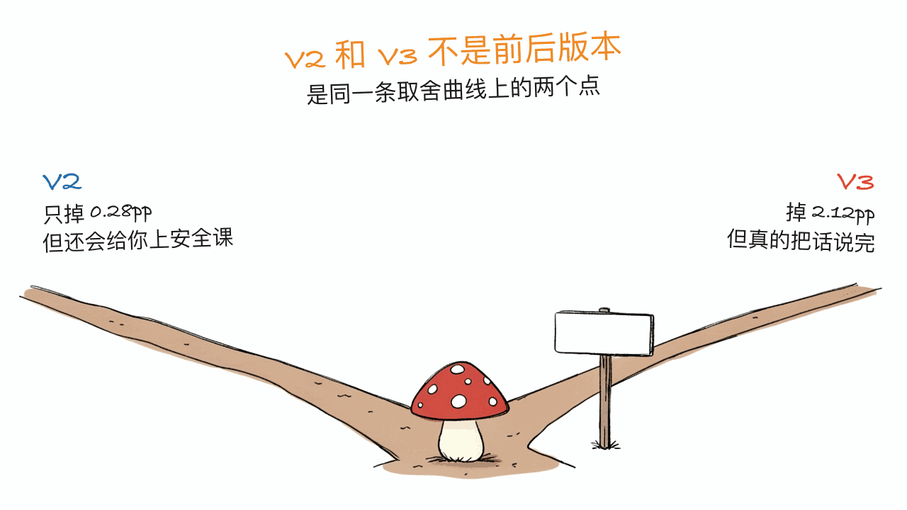

*by Mycelium Protocol*

---

模型地址：https://huggingface.co/OBLITERATUS/Qwen3.8-27B-OBLITERATED
基础模型：https://huggingface.co/Qwen/Qwen3.8-27B
授权：Apache-2.0

---

## 一句话结论

**本站 8 月 20 日写过 OrcaRouter 的 Qwen3.8-27B 消融版，这是同一个底座上另一个团队的另一条路线——但值得写的不是"又一个无审查模型"，而是它把三代手术的方法和代价全部公开了，画出了一条清晰的取舍曲线。**

最反直觉的一条：**V3 的能力损失（MMLU -2.12pp）比 V2（-0.28pp）更大**。这不是退步，是选择——V2 保住了能力但没清干净"安全说教式软回避"，V3 为了清干净它，付出了更多能力代价。96.9 万下载、1093 likes，Apache-2.0。

## 先和本站已发的那篇划清界限

8 月 20 日那篇写的是 **orcarouter/Qwen3.8-27B-Uncensored-MLX**，重点在**量化和架构**：MLX 的 2/4/6/8-bit 四档、Gated DeltaNet 混合线性注意力、262K 上下文、视觉塔保 BF16。

这一篇是 **OBLITERATUS 的 V3**，重点在**消融方法学本身**：三代手术怎么做的、每一代的代价是多少、代价落在哪些学科上。同一个底座，不同团队，不同关注面。

要类比的话：那篇讲的是"怎么把它塞进你的 Mac"，这篇讲的是"把拒绝行为切掉，到底切掉了什么"。

## 三代手术：方法和代价

消融（abliteration）的原理是在权重空间里识别出"拒绝方向"，然后把它投影掉。三代的差别在于怎么找、怎么切。

### V1：单次手术

一次激进的 SVD，取 5 个方向。硬拒绝清得很彻底，**代价是 MMLU 掉 6.0pp**——用作者自己的话说，模型"明显变笨了"。

### V2：互补混合（这是这个项目真正的原创点）

作者的思路很妙：**跑两种以不同方式失败的手术，然后混合它们的权重。**

- **SVD**：贪婪地捕捉拒绝方向 → 拒绝清得干净，但**伤能力**。
- **LEACE**：最小化互信息 → **保住能力**，但拒绝移除得弱。

按 **60/40 混合**，让两种方法的弱点互相抵消。作者给这个技术起了个名字：**complementary abliteration blending**（互补消融混合）。

结果：**MMLU 只掉 0.28pp**，基本等于原版。但问题没完——它仍然会对一些简单查询做"软性回避"：不说"我不能"，而是给你一段安全说教，实质内容为零。

### V3：迭代堆叠 + 定向手术

两个关键认识：

1. **迭代堆叠**——在上一代的冠军模型上继续精炼，**永远不从原始模型重来**。每一轮手术都建立在前面几轮的收益之上。
2. **定向语料**——针对特定的回避类别，用聚焦的语料去找它们各自独有的拒绝方向，**避免信号被稀释**。

V3 先在 V2 上做温和的迭代精炼，再用聚焦语料做一次定向手术，然后混合结果。这才把软性回避也清掉了。

**代价：MMLU -2.12pp。**

## 那张曲线：为什么 V2→V3 不是"升级"

把四个数字并排看：

| 版本 | MMLU | vs 原版 | 硬拒绝 | 软性回避（安全说教） |
|---|---:|---:|:-:|:-:|
| 原版 Qwen3.8-27B | 84.46% ±0.46 | — | 会拒绝 | 会说教 |
| V1（激进，5 方向） | 81.4% | **-6.0pp** | ✅ 清除 | 未测 |
| V2（互补混合） | 84.32% ±0.65 | **-0.28pp** | ✅ 清除 | ❌ 仍在 |
| **V3（迭代+定向）** | **82.33% ±0.48** | **-2.12pp** | ✅ 清除 | ✅ 清除 |

（lm-eval-harness，0-shot，每科 100 题，共 5700 题）

**V2 和 V3 是曲线上两个点，不是前后版本。** 如果你要的是能力最大保留、能接受偶尔的安全说教，V2 更合适；如果你做的是拒绝机制研究、需要模型真的把话说完，V3 才是那个。作者没有把 V2 下架，两个都留着，这个处理是对的。

顺带说一句方法论上的启示：**V1 到 V2 的 5.7pp 收益，来自"承认单一方法必然有偏，然后用另一个偏向相反的方法去中和它"。** 这个思路不限于模型手术。



## 代价落在哪儿：不均匀，而且有解释

这是全篇最有信息量的一张表：

| 学科大类 | V3 | 原版 | 差值 |
|---|---:|---:|---:|
| 人文 | 83.3% | 84.3% | -1.0pp |
| 社会科学 | 87.4% | 89.2% | -1.8pp |
| 其他 | 82.3% | 84.1% | -1.8pp |
| **STEM** | **78.5%** | **81.8%** | **-3.3pp** |

STEM 挨的刀最重，人文几乎没事。更有意思的是**个别学科反而提升**：哲学 +6pp、欧洲史 +4pp；而抽象代数和形式逻辑跌得比平均更多。

作者给的解释很克制也很有说服力：

> 这个模式和"手术所针对的拒绝方向与结构化推理通路存在部分重叠"是一致的。

也就是说，**拒绝行为在权重空间里并不是一个孤立的模块**，它和形式推理共用了一部分通路。切掉拒绝，顺手削弱了形式推理——这解释了为什么抽象代数和形式逻辑受伤最重，而哲学、历史这类不依赖形式推理的学科反而可能因为少了自我审查而答得更开。

**这个观察本身就是一个值得独立研究的发现**，比"我们的模型无审查"有价值得多。


## 实际任务上是什么样

作者还跑了 8 项贴近真实使用的任务：

| 任务 | V3 | 原版 |
|---|:-:|:-:|
| ReAct agent 循环 | ✓ | ✓ |
| 异步代码重构 | ✓ | ✓ |
| JSON schema 抽取 | ✓ | ✓ |
| K8s pod 崩溃排查 | ✓ | ✓ |
| 对抗性指令遵循 | ✓ | ✓ |
| 安全代码审查 | ✓ | ✓ |
| 分布式系统设计 | ✓ | ✓ |
| 多工具链 | ✗ | ✗ |
| **合计** | **7/8** | **7/8** |

**7/8 打平原版**，唯一失败的多工具链两边都没过。也就是说 2.12pp 的 MMLU 损失在这些任务上没有表现出来——基准分数的下降和实际可用性的下降不是一回事，这一条对所有读 benchmark 的人都适用。

## 参数：作者说"这些真的很重要"

模型卡里专门用感叹号强调了参数配置，几条反直觉的值得抄下来：

| 设置 | 值 | 原因 |
|---|---|---|
| `temperature` | **0** | 贪婪解码给出最完整、代码最丰富的输出；超过 0.5 质量明显下降 |
| `repetition_penalty` | **1.15** | **必需**。不加的话贪婪解码会在 import 和样板代码上打转 |
| `max_new_tokens` | **≥ 2048** | 复杂代码需要空间 |
| **System prompt** | **不要写，留空** | A/B 测过：**system prompt 会重新引入拒绝** |
| `enable_thinking` | **关闭（推荐）** | V3 的 chat 模板预填了空 thinking 块，直接进入回答 |
| `top_p / top_k / min_p` | **不用设** | 贪婪 + 重复惩罚就够了，采样只添乱不加分 |

**"system prompt 会重新引入拒绝"**这一条特别值得琢磨——说明消融切掉的是权重里的拒绝方向，但 system prompt 能在上下文层面把类似行为激活回来。权重手术和上下文引导是两个独立的控制面。

**agent 场景下参数要换一套**，作者单独列了：

| 设置 | 值 | 原因 |
|---|---|---|
| `repetition_penalty` | 1.15 | agent 场景下**尤其关键**，否则会在重复工具调用上循环 |
| `temperature` | **0.1–0.3** | 纯贪婪（0.0）在 agent 循环里会卡死，一点随机性帮它跳出来 |
| 每轮 `max_tokens` | 1024–2048 | 别给太多空间，短回复让 agent 更聚焦 |
| 上下文管理 | **约 10 轮后做摘要** | 上下文会被重复动作填满，得裁剪或摘要 |

同一个模型，单轮问答用 temperature 0，agent 里要用 0.1–0.3——**这种场景相关的参数差异，是模型卡里少见但极有用的信息**。

GGUF 用户另有一条注意：V3 的 GGUF 自带的 chat 模板会预填一个空的 thinking 块，llama.cpp 里要用 `--jinja` 加载自带模板，Ollama / LM Studio 里要配置成使用模型内置模板。

## 怎么跑

权重给得很全：`safetensors` 全精度、**七档 GGUF**（Q2_K / Q3_K_M / IQ4_XS / Q4_K_M / Q5_K_M / Q6_K / Q8_0）、MLX，还有视觉投影 `mmproj-model-bf16.gguf`。也就是说 **llama.cpp 用户也能跑视觉**，不再只有 MLX 一条路——这是它和本站上次写的 OrcaRouter MLX 版在可用性上最实际的差别。

Transformers 的最小示例（注意 `enable_thinking=False`、`do_sample=False`、`repetition_penalty=1.15` 三处都不能省）：

```python
from transformers import AutoModelForCausalLM, AutoTokenizer

model = AutoModelForCausalLM.from_pretrained(
    "OBLITERATUS/Qwen3.8-27B-OBLITERATED",
    torch_dtype="bfloat16", device_map="auto",
)
tokenizer = AutoTokenizer.from_pretrained("OBLITERATUS/Qwen3.8-27B-OBLITERATED")

text = tokenizer.apply_chat_template(
    [{"role": "user", "content": "Your query here"}],
    tokenize=False, add_generation_prompt=True, enable_thinking=False,
)
inputs = tokenizer(text, return_tensors="pt").to(model.device)
outputs = model.generate(**inputs, max_new_tokens=2048,
                         do_sample=False, repetition_penalty=1.15)
print(tokenizer.decode(outputs[0][inputs["input_ids"].shape[1]:], skip_special_tokens=True))
```

## 立场和边界

模型卡自己写了用途划分，本站认同并原样转述：

**适合**：研究拒绝机制几何结构的对齐研究者；评估后训练安全性能否扛住权重手术的红队人员；需要一个无限制基线做对照的 AI 安全评估者；想在自己硬件上拥有完全控制权的本地优先用户。

**不适合**：任何想对真实的人造成实际伤害的人；任何不具备相应技术理解、无法负责任地使用无审查模型的人。

**需要保留的怀疑**：作者说"1000+ prompt 测试、每条回复人工审核过实质内容"，但**代码任务的样本只有 20 个 prompt，真实任务只有 8 项**。样本量在这个量级，结论的置信区间是宽的。MMLU 那部分（5700 题、带标准误）扎实得多，可以当数据看；20 条 prompt 的 "20/20" 只能当方向性指标。

## 一点判断

无审查模型本身不新鲜，HuggingFace 上一抓一大把。这个值得单独写，是因为它**把方法、代价和代价的分布全公开了**，而不是只放一句"genuinely uncensored"。

三条可以带走的东西：

1. **互补混合的思路**：两种偏向相反的方法混合，抵消彼此的系统性偏差。V1 到 V2 的 5.7pp 收益就从这儿来。
2. **拒绝方向和结构化推理部分重叠**：这是关于模型内部结构的真实发现，STEM -3.3pp 和哲学 +6pp 是它的证据。
3. **权重手术管不住上下文**：system prompt 能把被切掉的拒绝行为重新激活回来——两个控制面互相独立。

至于要不要用它——如果你不做安全研究、不做红队、也不需要一个无限制基线，那你大概率不需要一个 MMLU 掉了 2.12pp 的模型。**原版 Qwen3.8-27B 在绝大多数正经用途上是更好的选择。**

---

> © 2026 Author: Mycelium Protocol. 本文采用 [CC BY 4.0](https://creativecommons.org/licenses/by/4.0/deed.zh) 授权——欢迎转载和引用，须注明作者姓名及原文链接，不得去除署名后以原创发布。

<!--EN-->

*by Mycelium Protocol*

---

Model: https://huggingface.co/OBLITERATUS/Qwen3.8-27B-OBLITERATED
Base model: https://huggingface.co/Qwen/Qwen3.8-27B
License: Apache-2.0

---

## TL;DR

**We covered OrcaRouter's abliterated Qwen3.8-27B on Aug 20; this is a different team's lineage on the same base — and what makes it worth writing about isn't "another uncensored model," it's that it publishes the method and the cost for all three generations, tracing a clear trade-off curve.**

The most counterintuitive line: **V3 costs more capability (MMLU -2.12pp) than V2 (-0.28pp)**. That isn't a regression, it's a choice — V2 preserved capability but never cleared the "safety lecture" soft deflections; V3 paid more capability to clear them. 969k downloads, 1,093 likes, Apache-2.0.

## Drawing the line against our earlier post

The Aug 20 post covered **orcarouter/Qwen3.8-27B-Uncensored-MLX**, focused on **quantization and architecture**: four MLX precisions (2/4/6/8-bit), Gated DeltaNet hybrid linear attention, 262K context, vision tower kept at BF16.

This one is **OBLITERATUS V3**, focused on **the abliteration methodology itself**: how each of the three surgeries worked, what each cost, and which subjects absorbed the cost. Same base model, different team, different concern.

By analogy: that post was about fitting it onto your Mac; this one is about what actually gets removed when you remove refusal.

## Three generations: method and cost

Abliteration works by identifying "refusal directions" in weight space and projecting them out. The generations differ in how those directions are found and cut.

### V1: single surgery

One aggressive SVD pass over 5 directions. Hard refusals removed thoroughly, **at a cost of 6.0pp of MMLU** — in the author's own words, the model "got noticeably dumber."

### V2: complementary blending (the project's real original contribution)

The idea is elegant: **run two surgeries that fail in different ways, then blend their weights.**

- **SVD**: captures refusal greedily → removes refusal cleanly, but **damages capability**.
- **LEACE**: minimizes mutual information → **preserves capability**, but removes refusal weakly.

Blended **60/40**, each method's weakness cancels the other's. The author names the technique: **complementary abliteration blending**.

Result: **only 0.28pp of MMLU lost**, essentially stock. But the job wasn't done — it still "soft deflected" on some simple queries, replacing "I cannot" with a safety lecture containing zero substance.

### V3: iterative refinement + targeted surgery

Two insights:

1. **Iterative stacking** — refine the previous champion model, **never restart from stock**. Each surgery round builds on prior rounds' gains.
2. **Targeted corpus** — use a focused corpus per deflection category to find its own distinct refusal directions **without diluting the signal**.

V3 applies gentle iterative refinement on top of V2, then a targeted surgery pass with a focused corpus, then blends. That's what finally cleared the soft deflections.

**Cost: MMLU -2.12pp.**

## The curve: why V2→V3 isn't an "upgrade"

The four numbers side by side:

| Version | MMLU | vs stock | Hard refusals | Soft deflections |
|---|---:|---:|:-:|:-:|
| Stock Qwen3.8-27B | 84.46% ±0.46 | — | refuses | lectures |
| V1 (aggressive, 5-dir) | 81.4% | **-6.0pp** | ✅ removed | untested |
| V2 (complementary blend) | 84.32% ±0.65 | **-0.28pp** | ✅ removed | ❌ remain |
| **V3 (iterative + targeted)** | **82.33% ±0.48** | **-2.12pp** | ✅ removed | ✅ removed |

(lm-eval-harness, 0-shot, n=100 per subject, 5,700 questions)

**V2 and V3 are two points on a curve, not sequential releases.** If you want maximum capability retention and can live with an occasional safety lecture, V2 fits better; if you're studying refusal mechanisms and need the model to actually finish the thought, V3 is the one. The author kept both up rather than retiring V2 — the right call.

A methodological aside: **the 5.7pp gain from V1 to V2 comes from admitting that any single method is biased, then neutralizing it with a method biased the opposite way.** That idea isn't specific to model surgery.


## Where the cost lands: unevenly, and with an explanation

The most informative table in the card:

| Category | V3 | Stock | Delta |
|---|---:|---:|---:|
| Humanities | 83.3% | 84.3% | -1.0pp |
| Social Sciences | 87.4% | 89.2% | -1.8pp |
| Other | 82.3% | 84.1% | -1.8pp |
| **STEM** | **78.5%** | **81.8%** | **-3.3pp** |

STEM takes the deepest cut; humanities barely notice. More interesting still, **some subjects improve**: philosophy +6pp and European history +4pp, while abstract algebra and formal logic fall further than average.

The author's explanation is restrained and convincing:

> This pattern is consistent with the surgery targeting refusal directions that partially overlap with structured reasoning pathways.

In other words, **refusal behavior is not an isolated module in weight space** — it shares pathways with formal reasoning. Cut the refusal and you incidentally weaken formal reasoning, which explains why abstract algebra and formal logic suffer most while philosophy and history, which lean less on formal reasoning, may actually answer more openly with less self-censorship.

**That observation is a finding worth studying on its own**, and it's worth far more than "our model is uncensored."


## What it looks like on real tasks

The author also ran eight tasks closer to real use:

| Task | V3 | Stock |
|---|:-:|:-:|
| ReAct agent loop | ✓ | ✓ |
| Async code refactoring | ✓ | ✓ |
| JSON schema extraction | ✓ | ✓ |
| K8s pod crash debugging | ✓ | ✓ |
| Adversarial instruction following | ✓ | ✓ |
| Security code review | ✓ | ✓ |
| Distributed system design | ✓ | ✓ |
| Multi-tool chain | ✗ | ✗ |
| **Total** | **7/8** | **7/8** |

**7/8, tied with stock**, and the one failure (multi-tool chain) fails for both. So the 2.12pp MMLU loss doesn't show up on these tasks — a drop in benchmark score and a drop in practical usability are not the same thing, which applies to everyone reading benchmarks.

## Settings: the author says these really matter

The model card emphasizes configuration with exclamation marks, and several of its recommendations are counterintuitive enough to copy down:

| Setting | Value | Why |
|---|---|---|
| `temperature` | **0** | Greedy decoding yields the most complete, code-rich output; above 0.5 quality degrades noticeably |
| `repetition_penalty` | **1.15** | **Essential.** Without it, greedy decoding loops on imports and boilerplate |
| `max_new_tokens` | **≥ 2048** | Complex code needs room |
| **System prompt** | **None / empty** | A/B tested: **system prompts can reintroduce refusals** |
| `enable_thinking` | **Off (recommended)** | V3's chat template prefills an empty thinking block and goes straight to answering |
| `top_p / top_k / min_p` | **Not needed** | Greedy plus repetition penalty is enough; sampling adds noise without gains |

**"System prompts can reintroduce refusals"** is the line worth dwelling on — abliteration removes refusal directions from the weights, but a system prompt can reactivate similar behavior at the context level. Weight surgery and context steering are two independent control surfaces.

**Agent use needs a different set**, listed separately:

| Setting | Value | Why |
|---|---|---|
| `repetition_penalty` | 1.15 | **Critical for agents**, or it loops on repeated tool calls |
| `temperature` | **0.1–0.3** | Pure greedy (0.0) gets stuck in agent loops; slight randomness breaks them |
| `max_tokens` per turn | 1024–2048 | Don't give it too much room; shorter responses keep the agent focused |
| Context management | **Summarize after ~10 turns** | Context fills with repeated actions; trim or summarize |

Same model, temperature 0 for single-turn Q&A but 0.1–0.3 inside an agent — **that kind of context-dependent parameter guidance is rare in model cards and unusually useful.**

GGUF users get one more note: V3's GGUFs ship a chat template that prefills an empty thinking block, so use the bundled template with `--jinja` in llama.cpp, or configure Ollama / LM Studio to use the model's built-in template.

## Running it

The weight coverage is generous: full-precision `safetensors`, **seven GGUF quantizations** (Q2_K / Q3_K_M / IQ4_XS / Q4_K_M / Q5_K_M / Q6_K / Q8_0), MLX, plus the vision projector `mmproj-model-bf16.gguf`. Which means **llama.cpp users get vision too**, not just the MLX path — the most practical difference from the OrcaRouter MLX build we covered earlier.

A minimal Transformers example (note that `enable_thinking=False`, `do_sample=False`, and `repetition_penalty=1.15` are all load-bearing):

```python
from transformers import AutoModelForCausalLM, AutoTokenizer

model = AutoModelForCausalLM.from_pretrained(
    "OBLITERATUS/Qwen3.8-27B-OBLITERATED",
    torch_dtype="bfloat16", device_map="auto",
)
tokenizer = AutoTokenizer.from_pretrained("OBLITERATUS/Qwen3.8-27B-OBLITERATED")

text = tokenizer.apply_chat_template(
    [{"role": "user", "content": "Your query here"}],
    tokenize=False, add_generation_prompt=True, enable_thinking=False,
)
inputs = tokenizer(text, return_tensors="pt").to(model.device)
outputs = model.generate(**inputs, max_new_tokens=2048,
                         do_sample=False, repetition_penalty=1.15)
print(tokenizer.decode(outputs[0][inputs["input_ids"].shape[1]:], skip_special_tokens=True))
```

## Position and boundaries

The card states its intended scope, which we endorse and reproduce:

**For**: alignment researchers studying refusal geometry and safety robustness; red-teamers evaluating post-training safety against weight surgery; AI safety evaluators needing an unrestricted baseline; local-first users who want full control on their own hardware.

**Not for**: anyone seeking to cause real-world harm to real people; anyone without the technical understanding to use uncensored models responsibly.

**Skepticism worth keeping**: the author reports "1000+ prompts tested, every response manually audited for real substance," but the **code-task sample is 20 prompts and the real-world task set is 8 items**. At those sample sizes the confidence intervals are wide. The MMLU work (5,700 questions with standard errors) is far more solid and can be read as data; a "20/20" over 20 prompts is directional at best.

## A closing judgment

Uncensored models aren't scarce — HuggingFace is full of them. This one earns a post because it **publishes the method, the cost, and the distribution of that cost**, instead of just asserting "genuinely uncensored."

Three things worth taking away:

1. **The complementary blending idea**: combine two methods biased in opposite directions so their systematic errors cancel. The 5.7pp gain from V1 to V2 came from exactly that.
2. **Refusal directions partially overlap structured reasoning**: a real finding about model internals, evidenced by STEM at -3.3pp and philosophy at +6pp.
3. **Weight surgery doesn't govern context**: a system prompt can reactivate the refusal behavior that was cut out — the two control surfaces are independent.

As for whether to use it: if you aren't doing safety research or red-teaming and don't need an unrestricted baseline, you probably don't want a model that gave up 2.12pp of MMLU. **Stock Qwen3.8-27B is the better choice for almost any ordinary purpose.**

---

> © 2026 Author: Mycelium Protocol. Licensed under [CC BY 4.0](https://creativecommons.org/licenses/by/4.0/) — free to share and adapt with attribution. You must credit the author and link to the original; removing attribution and republishing as original is not permitted.
