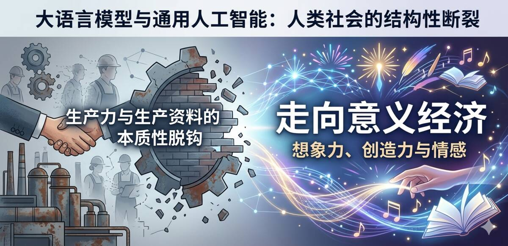

## 摘要

随着大语言模型（LLM）及通用人工智能（AGI）的加速渗透，人类社会正面临一场史无前例的结构性断裂：**生产力与生产资料的本质性脱钩**。传统资本逻辑下的雇佣关系——资本家拥有生产资料，通过雇佣劳动者完成增殖——正因AI对人类劳动的系统性替代而趋于崩塌。本文论证：在资本意志加速"去人化"与社会本能被动"自愈"的双重挤压下，人类正被迫且必然走向以想象力、创造力与情感为内核的**意义经济**——这不是众多路径之一，而是唯一路径。

PS：这是哥手打加AI优化的，无数笔记和思考，不是AI文章。。。

**关键词：** 意义经济、资本意志、社会本能、AI替代、生产力脱钩、后工作社会

---

## 一、逻辑起点：生产力与生产资料的本质性脱钩

在工业时代及信息时代早期，生产力的释放高度依赖于人类劳动（体力与脑力）与生产资料的结合。资本家通过雇佣契约获取人类劳动力，完成资本的自我增殖。这一逻辑在过去两百年间塑造了公司、基金会、协会等一切以资本增殖为核心的组织形态。

然而，AI的介入从根本上改变了这一逻辑。AI不仅仅是更高效的工具，它正在成为能够**独立完成生产闭环的替代性生产力**。当AI代表的"解决问题的能力"足以覆盖绝大多数传统体力和脑力劳动岗位时，资本意志的"自我增殖"本能必然驱动其加速剔除高成本、低效率的人类环节。

这一趋势已有明确的实证支撑。Dominski与Lee（2025）利用ChatGPT-4o和Claude 3.5构建的职业AI暴露评分（OAIES）发现，AI暴露度最高的岗位，就业率呈显著下降趋势，失业率上升，工时被压缩——而需要复杂推理的全职职位下降幅度更大（arXiv:2507.08244）。哈佛商学院的Chen等人（2024）对美国几乎全部职位空缺数据的分析进一步揭示了这种异质性：自动化暴露度最高的四分之一岗位中，AI相关技能需求每季度下降24%（HBS Working Paper No. 25-039）。

**这意味着什么？** 意味着生产过程对人类的需求在急剧、不可逆地减少。资本意志的唯一目标——自我增殖——不会因为人类的失落而停下脚步。它会毫不犹豫地用更廉价、更高效的AI替代每一个可替代的人类角色。**生产力与生产资料的关系正在脱钩，生产过程不再需要人类。**

---

## 二、资本意志：永不停歇的"去人化"引擎

必须认识到，资本意志不是一种道德判断，而是一种结构性力量。公司、基金会、增殖机器——它们将经济扩张本身视为唯一目标。在这种逻辑下，个体服务于机器：独立思考、想象力与情感表达不是资产，而是负担。个人不是目的，增长才是。

Ide与Talamas（2024）在其关于"知识经济中的人工智能"的研究中指出，当调节AI自主性时，经济产出和社会不平等之间存在结构性权衡——AI越自主，总产出越高，但分配差距也越大（arXiv:2312.05481）。这揭示了资本意志的内在矛盾：它驱动的效率提升，恰恰在摧毁其赖以存在的社会基础——消费者群体。

然而，资本意志不会自我反省。正如Acemoglu（2024）在*Journal of Economic Perspectives*中所论证的，当前AI的应用模式不是"任务增强"（augmentation），而是"角色置换"（displacement）。资本不关心被置换者的命运。一份工作，对于绝大多数人来说，是社会生活的最基础部分。现在，这个基础正在崩塌。

---

## 三、社会本能：作为"耗材"的觉醒与自我疗伤

在资本意志加速替代人类的过程中，社会作为一个有机体，表现出了深刻的**社会本能**——一种集体性的防御机制。

最显著的证据是全球生育率的持续走低。OECD国家总和生育率从1960年的3.29降至2023年的1.54（Bloom, 2025, IMF）。Cammack（2025）从历史唯物主义视角论证，资本主义存在生育率下降的**结构性趋势**：一方面选择性地将女性机会扩展到婚姻和生育之外，另一方面将所有个人和政府置于全球竞争政治的纪律之下，两者使日常再生产和代际再生产陷入根本矛盾（New Political Economy, 2025）。

但本文的论点更为尖锐：**低生育率不仅是经济压力的结果，更是一种社会本能的"负反馈"**。即便没有AI，生产力越发达的国家，生育率越低。这不完全是综合因素的结果——其深层逻辑是：越来越多的人清楚地认识到，自己是资本增殖的"耗材"，与其用尽心血生产下一代"耗材"给资本，不如过好当下。这是社会有机体在无法改变资本运行逻辑时，通过收缩生物性存续进行的**自我疗伤**。

van Wijk与Feijten（2025）的研究提供了微观层面的佐证：房价上涨与生育率下降显著相关——当年轻人连基本的生存空间都难以负担时，繁衍后代的生物性冲动被经济理性压制（European Journal of Population, 2025）。

**社会是有意志的。** 当工作的意义丧失后，寻找新的意义将成为人们普遍的诉求。这不仅仅是社会意义上的——例如一份报酬、一个社会位置——更是资本意志下的无奈选择：**没有更多岗位了**。当这个群体越来越大，它将成为社会意志的一部分，他们的诉求很简单：**重构意义，从而能够继续生活下去。**

---

## 四、意义的真空与马斯洛逻辑的终极回归

按马斯洛的需求层次逻辑，个体生活的需求从基础生存到安全感，到社会归属，到尊重，最终到自我实现。传统社会中，工作承担了中间三层的绝大部分功能——它提供经济安全、社会关系和身份认同。

当工作消失，这三层同时坍塌。Santoni de Sio（2024）在*The Journal of Ethics*中提出，AI正在影响人们从事"有意义的工作"（meaningful work）的机会，自动化改变了工作的社会功能和人的尊严（Vol. 28, pp. 407-427）。Sarala等人（2025）在*Journal of Management Studies*中进一步指出，AI时代的核心议题已不是"哪些工作会被替代"，而是"工作在人类社会身份建构中的角色将如何变化"。

然而，人类并非在所有维度上都可被替代。Bellemare-Pepin等人（2026）在*Scientific Reports*上发表的大规模对比实验表明，在发散联想和创意写作任务中，LLM虽然可超越人类平均水平，但仍**明显低于较有创造力的人类群体上半部分的表现**，存在不可突破的创造力天花板（arXiv:2405.13012）。Zhang等人（2025）的多维度评估进一步指出，人类凭借直觉、情感和经验进行的启发式加工，以及创造力中固有的"意义建构"能力，是AI无法复制的（PsyCh Journal, Vol. 14(6)）。

**人类不可替代的内核是什么？答案是：想象力、创造力与情感。** 这不是技能的残余，而是人类个体存在的本质。重构意义，意味着将生活的重心从"被动雇佣"转向"自主探索"，将个体价值的确认从外部的薪酬体系转向内部的创造体验。

---

## 五、唯一路径：意义经济的必然崛起

在"无路可走"的困境下，**意义经济**（Meaning Economy）成为唯一路径。

意义经济与资本驱动经济的本质区别在于**目的论的转向**：

- **资本经济：** 经济扩张是目的本身，个体是手段。独立思考、想象力与情感表达是负担。
- **意义经济：** 经济活动是探索"我是谁"和"什么对我真正重要"的**媒介**，人本身即是目的。

这不是乌托邦式的浪漫想象，而是逻辑的必然推导：

1. **资本意志不会停止替代。** AI的成本持续下降，能力持续上升。Nayebi（2025）的数学模型表明，AI只需达到当前自动化生产力的5-7倍即可支撑GDP 11%水平的UBI——在快速进展情景下，约2028年即可跨越此阈值（arXiv:2505.18687）。这意味着大规模失业不是遥远的未来，而是迫在眉睫的现实。
2. **传统分配机制正在失效。** UBI作为一种过渡方案被广泛讨论，但Belisle-Pipon（2025）从Bourdieu的符号暴力理论出发，批判性地指出科技精英倡导UBI的叙事本身就是权力不对称的产物——UBI可能被工具化为维持现有权力结构的手段，而非真正的解放（Frontiers in Artificial Intelligence, Vol. 8）。
3. **人类必须找到工作之外的意义。** 当岗位消亡、UBI仅能维持基本生存时，人们需要一种新的框架来回答"我为什么活着"。意义经济正是这个框架——它允许、甚至要求个体的想象力、创造力与情感表达。凡是尊重这些人类特质的经济模式，都属于意义经济。

Spencer（2024）在*AI & SOCIETY*中提出了一个重要的视角转换：AI不仅可能取代工作，还可以"减轻工作"（lighten work）——缩短工时并提高工作质量（Vol. 40(3), pp. 1237-1247）。这与意义经济的逻辑完全一致：当AI承担了无意义的重复劳动，人类得以将精力投入真正有意义的创造性活动。

---

## 六、从公司到社区：组织形态的范式转移

意义经济需要新的组织形态。传统的科层制公司是资本意志的产物——它强调标准化、去人格化，将个体嵌入增殖机器的齿轮中。这种形态与意义经济根本不兼容。

我们正在见证一场深刻的组织形态演进：从金字塔式的公司到**松散社区（Loose Communities）与极致个体（Extreme Individuals）**。

Eisenhardt等人（2025）在*Academy of Management Annals*基于178篇实证文章的综述中，识别出四种组织范式转变——多事业部制、有机型、**社区型**和平台型——每种都在挑战官僚制的核心假设。社区型组织以共同的意义而非共同的利润为凝聚力，它不剥夺个体的独立思考，而是为每个人的内心世界——他的想象力、创造力与情感——**构建基础设施**。

意义经济并非反商业——而是一次重新定义：**当人本身成为目的而非产品时，商业可以成为什么。**

---

## 七、结论：被迫的解放

人类正处于从"生产工具"回归"意义主体"的剧烈阵痛期。这不是一次温和的转型。资本意志的冷酷替代将继续加速，社会本能的自我疗伤将持续发酵，两者的碰撞将产生巨大的社会震荡。

但在这条看似绝路的路上，意义经济的崛起是唯一的出口。它不是被选择的，而是被逼迫的；它不是一种理想，而是一种必然。当生产过程不再需要人类，当工作不再定义身份，当资本不再需要劳动者，人类唯一可以做的事情就是：**构建自己的意义。**

这场转变或许是被迫，或许是主动，但几乎不可避免。

---

## 参考文献

1. Dominski, J. & Lee, Y.S. (2025). "Advancing AI Capabilities and Evolving Labor Outcomes." arXiv:2507.08244.
2. Chen, W.X., Srinivasan, S. & Zakerinia, S. (2024). "Displacement or Complementarity? The Labor Market Impact of Generative AI." Harvard Business School Working Paper No. 25-039.
3. Ide, E. & Talamas, E. (2024). "Artificial Intelligence in the Knowledge Economy." arXiv:2312.05481.
4. Santoni de Sio, F. (2024). "Artificial Intelligence and the Future of Work: Mapping the Ethical Issues." *The Journal of Ethics*, 28, 407-427.
5. Sarala et al. (2025). "Advancing Research on the Future of Work in the Age of AI." *Journal of Management Studies*.
6. Spencer, D.A. (2024). "AI, automation and the lightening of work." *AI & SOCIETY*, 40(3), 1237-1247.
7. Bellemare-Pepin, A. et al. (2026). "Divergent Creativity in Humans and Large Language Models." *Scientific Reports* (Nature). arXiv:2405.13012.
8. Zhang, C. et al. (2025). "Artificial Intelligence Reshapes Creativity: A Multidimensional Evaluation." *PsyCh Journal*, 14(6), 831-840.
9. Bloom, D. (2025). "The Debate over Falling Fertility." *IMF Finance & Development*.
10. Cammack, P. (2025). "The Political Economy of Post-Reproduction Society." *New Political Economy*. DOI: 10.1080/13563467.2025.2555352.
11. van Wijk, D. & Feijten, P. (2025). "Rising House Prices, Falling Fertility?" *European Journal of Population*.
12. Nayebi, A. (2025). "An AI Capability Threshold for Rent-Funded Universal Basic Income." arXiv:2505.18687.
13. Belisle-Pipon, J.C. (2025). "AI, Universal Basic Income, and Power: Symbolic Violence in the Tech Elite's Narrative." *Frontiers in Artificial Intelligence*, 8.
14. Eisenhardt, K.M. et al. (2025). "Decentralization in Organizations: A Revolution or a Mirage?" *Academy of Management Annals*.
15. Sun, N. et al. (2024). "From Principles to Practice: A Deep Dive into AI Ethics and Regulations." arXiv:2412.04683.

<!--EN-->

## Abstract

With the accelerated penetration of Large Language Models (LLMs) and Artificial General Intelligence (AGI), human society is facing an unprecedented structural rupture: **the essential decoupling of productivity from the means of production**. The traditional capitalist employment relationship—where capitalists own the means of production and complete self-expansion through hired labor—is collapsing due to AI's systematic replacement of human labor. This paper argues that under the dual pressure of capital will accelerating "dehumanization" and social instinct passively "healing," humanity is being forced and inevitably moving toward a **meaning economy** centered on imagination, creativity, and emotion. This is not one of many paths—it is the only path.

PS: This is hand-typed and AI-enhanced, countless notes and thoughts, not an AI-generated article...

**Keywords:** Meaning Economy, Capital Will, Social Instinct, AI Replacement, Productivity Decoupling, Post-Work Society

---

## I. Logical Starting Point: The Essential Decoupling of Productivity and Means of Production

In the industrial era and early information age, the release of productivity was highly dependent on the combination of human labor (physical and mental) with the means of production. Capitalists acquired human labor power through employment contracts to complete capital's self-expansion. This logic shaped companies, foundations, associations, and all other organizations centered on capital expansion over the past two centuries.

However, AI's intervention has fundamentally changed this logic. AI is not just a more efficient tool; it is becoming a **replacement productivity capable of independently completing production closed-loops**. When AI's "problem-solving capabilities" are sufficient to cover the vast majority of traditional physical and mental labor positions, capital will's instinct for "self-expansion" will inevitably drive it to accelerate the elimination of high-cost, low-efficiency human elements.

This trend has clear empirical support. Dominski and Lee (2025), using ChatGPT-4o and Claude 3.5 to construct the Occupational AI Exposure Score (OAIES), found that positions with the highest AI exposure showed significant declines in employment rates, rising unemployment, and compressed working hours—with full-time positions requiring complex reasoning experiencing even greater declines (arXiv:2507.08244). Harvard Business School's Chen et al. (2024), analyzing nearly all job vacancy data in the United States, further revealed this heterogeneity: in the quarter of positions with highest automation exposure, AI-related skill requirements declined by 24% per quarter (HBS Working Paper No. 25-039).

**What does this mean?** It means human demand in the production process is rapidly and irreversibly decreasing. Capital will's sole goal—self-expansion—will not stop for human loss. It will unhesitatingly replace every substitutable human role with cheaper, more efficient AI. **The relationship between productivity and means of production is decoupling; production no longer needs humans.**

---

## II. Capital Will: The Never-Ending "Dehumanization" Engine

We must recognize that capital will is not a moral judgment but a structural force. Companies, foundations, expansion machines—they view economic expansion itself as the sole objective. Under this logic, the individual serves the machine: independent thinking, imagination, and emotional expression are not assets but burdens. The individual is not the purpose; growth is.

Ide and Talamas (2024), in their research on "Artificial Intelligence in the Knowledge Economy," point out that when regulating AI autonomy, there exists a structural trade-off between economic output and social inequality—the more autonomous the AI, the higher the total output, but the greater the distributional gap (arXiv:2312.05481). This reveals the internal contradiction of capital will: the efficiency gains it drives are precisely destroying the social foundation upon which it depends—the consumer base.

However, capital will does not engage in self-reflection. As Acemoglu (2024) argues in the *Journal of Economic Perspectives*, current AI application patterns are not "task augmentation" but "role displacement." Capital does not care about the fate of the displaced. A job, for the vast majority of people, is the most fundamental part of social life. Now, this foundation is collapsing.

---

## III. Social Instinct: Awakening as "Consumables" and Self-Healing

In the process of capital will accelerating the replacement of humans, society as an organism exhibits profound **social instinct**—a collective defense mechanism.

The most significant evidence is the continuous decline in global fertility rates. The total fertility rate in OECD countries dropped from 3.29 in 1960 to 1.54 in 2023 (Bloom, 2025, IMF). Cammack (2025), from a historical materialist perspective, argues that capitalism exhibits a **structural trend** toward declining fertility: on one hand, selectively expanding women's opportunities beyond marriage and reproduction; on the other, placing all individuals and governments under the discipline of global competitive politics—both creating fundamental contradictions between daily reproduction and intergenerational reproduction (New Political Economy, 2025).

But this paper's argument is sharper: **low fertility is not merely the result of economic pressure but a form of social instinct "negative feedback."** Even without AI, the more developed the productivity, the lower the fertility rate in a country. This is not entirely the result of comprehensive factors—the deep logic is that more and more people clearly recognize they are "consumables" for capital expansion. Rather than exhausting their efforts to produce the next generation of "consumables" for capital, they choose to live well in the present. This is the **self-healing** performed by the social organism through contracting biological existence when it cannot change the logic of capital's operation.

Research by van Wijk and Feijten (2025) provides micro-level evidence: rising housing prices are significantly correlated with declining fertility rates—when young people can barely afford basic living space, the biological impulse to reproduce is suppressed by economic rationality (European Journal of Population, 2025).

**Society has a will.** When the meaning of work is lost, searching for new meaning will become a universal demand. This is not merely social significance—such as compensation or a social position—but a helpless choice under capital will: **there are no more jobs.** When this group grows larger, it will become part of social will, and their demand is simple: **reconstruct meaning so that life can continue.**

---

## IV. The Vacuum of Meaning and the Ultimate Return of Maslow's Logic

According to Maslow's hierarchy of needs, individual life needs range from basic survival to security, social belonging, respect, and finally self-actualization. In traditional society, work bore the vast majority of the middle three layers—it provided economic security, social relationships, and identity.

When work disappears, these three layers collapse simultaneously. Santoni de Sio (2024), in *The Journal of Ethics*, proposes that AI is affecting people's opportunities to engage in "meaningful work," with automation changing the social function of work and human dignity (Vol. 28, pp. 407-427). Sarala et al. (2025), in the *Journal of Management Studies*, further point out that the core issue in the AI era is no longer "which jobs will be replaced" but "how the role of work in human social identity construction will change."

However, humans are not substitutable in all dimensions. Bellemare-Pepin et al. (2026), in a large-scale comparative experiment published in *Scientific Reports*, show that while LLMs can surpass average human performance in divergent association and creative writing tasks, they remain **significantly below the upper half of more creative human groups**, with an insurmountable creativity ceiling (arXiv:2405.13012). Zhang et al. (2025)'s multidimensional assessment further points out that the heuristic processing humans conduct through intuition, emotion, and experience, as well as the "meaning-making" ability inherent in creativity, are irreplicable by AI (PsyCh Journal, Vol. 14(6)).

**What is the irreplaceable core of humanity? The answer is: imagination, creativity, and emotion.** This is not a residual skill but the essence of individual human existence. Reconstructing meaning means shifting the focus of life from "passive employment" to "autonomous exploration," and transferring the confirmation of individual value from external compensation systems to internal creative experiences.

---

## V. The Only Path: The Inevitable Rise of the Meaning Economy

In the dilemma of "no way out," the **Meaning Economy** becomes the only path.

The essential difference between the meaning economy and the capital-driven economy lies in a **teleological shift**:

- **Capital Economy:** Economic expansion is the purpose itself; the individual is the means. Independent thinking, imagination, and emotional expression are burdens.
- **Meaning Economy:** Economic activity is the **medium** for exploring "who am I" and "what truly matters to me"; the human being itself is the purpose.

This is not utopian romantic imagination but a logical necessity:

1. **Capital will will not stop replacing.** AI costs continue to fall while capabilities continue to rise. Nayebi (2025)'s mathematical model shows that AI only needs to reach 5-7 times current automation productivity to support UBI at 11% of GDP levels—under rapid progress scenarios, this threshold could be crossed around 2028 (arXiv:2505.18687). This means mass unemployment is not a distant future but an imminent reality.
2. **Traditional distribution mechanisms are failing.** UBI is widely discussed as a transitional solution, but Belisle-Pipon (2025), from Bourdieu's symbolic violence theory, critically points out that the narrative of UBI advocated by tech elites is itself a product of power asymmetry—UBI may be instrumentalized as a means to maintain existing power structures rather than true liberation (Frontiers in Artificial Intelligence, Vol. 8).
3. **Humans must find meaning beyond work.** When jobs vanish and UBI can only sustain basic survival, people need a new framework to answer "why am I alive." The meaning economy is precisely this framework—it allows, even requires, individual imagination, creativity, and emotional expression. Any economic model that respects these human traits belongs to the meaning economy.

Spencer (2024), in *AI & SOCIETY*, proposes an important perspective shift: AI may not only replace work but also "lighten work"—shortening working hours and improving work quality (Vol. 40(3), pp. 1237-1247). This is entirely consistent with the logic of the meaning economy: when AI takes on meaningless repetitive labor, humans can devote their energy to truly meaningful creative activities.

---

## VI. From Company to Community: The Paradigm Shift in Organizational Forms

The meaning economy requires new organizational forms. Traditional hierarchical companies are products of capital will—they emphasize standardization, depersonalization, and embed individuals as cogs in the expansion machine. This form is fundamentally incompatible with the meaning economy.

We are witnessing a profound evolution in organizational forms: from pyramid-shaped companies to **Loose Communities and Extreme Individuals**.

Eisenhardt et al. (2025), in a review based on 178 empirical articles in the *Academy of Management Annals*, identify four organizational paradigm shifts—multidivisional, organic, **community**, and platform—each challenging the core assumptions of bureaucracy. Community organizations are bound by shared meaning rather than shared profit; they do not deprive individuals of independent thinking but **build infrastructure** for everyone's inner world—their imagination, creativity, and emotion.

The meaning economy is not anti-business—it is a redefinition: **what commerce can become when the human being itself becomes the purpose rather than the product.**

---

## VII. Conclusion: Forced Liberation

Humanity is in the throes of a violent transition from "production tool" back to "meaning subject." This is not a gentle transformation. Capital will's cold replacement will continue to accelerate, and social instinct's self-healing will continue to ferment; the collision of the two will produce massive social upheaval.

But on this seemingly dead-end road, the rise of the meaning economy is the only exit. It is not chosen but forced; it is not an ideal but a necessity. When the production process no longer needs humans, when work no longer defines identity, when capital no longer needs laborers, the only thing humanity can do is: **construct its own meaning.**

This transformation may be forced or active, but it is almost inevitable.

---

## References

1. Dominski, J. & Lee, Y.S. (2025). "Advancing AI Capabilities and Evolving Labor Outcomes." arXiv:2507.08244.
2. Chen, W.X., Srinivasan, S. & Zakerinia, S. (2024). "Displacement or Complementarity? The Labor Market Impact of Generative AI." Harvard Business School Working Paper No. 25-039.
3. Ide, E. & Talamas, E. (2024). "Artificial Intelligence in the Knowledge Economy." arXiv:2312.05481.
4. Santoni de Sio, F. (2024). "Artificial Intelligence and the Future of Work: Mapping the Ethical Issues." *The Journal of Ethics*, 28, 407-427.
5. Sarala et al. (2025). "Advancing Research on the Future of Work in the Age of AI." *Journal of Management Studies*.
6. Spencer, D.A. (2024). "AI, automation and the lightening of work." *AI & SOCIETY*, 40(3), 1237-1247.
7. Bellemare-Pepin, A. et al. (2026). "Divergent Creativity in Humans and Large Language Models." *Scientific Reports* (Nature). arXiv:2405.13012.
8. Zhang, C. et al. (2025). "Artificial Intelligence Reshapes Creativity: A Multidimensional Evaluation." *PsyCh Journal*, 14(6), 831-840.
9. Bloom, D. (2025). "The Debate over Falling Fertility." *IMF Finance & Development*.
10. Cammack, P. (2025). "The Political Economy of Post-Reproduction Society." *New Political Economy*. DOI: 10.1080/13563467.2025.2555352.
11. van Wijk, D. & Feijten, P. (2025). "Rising House Prices, Falling Fertility?" *European Journal of Population*.
12. Nayebi, A. (2025). "An AI Capability Threshold for Rent-Funded Universal Basic Income." arXiv:2505.18687.
13. Belisle-Pipon, J.C. (2025). "AI, Universal Basic Income, and Power: Symbolic Violence in the Tech Elite's Narrative." *Frontiers in Artificial Intelligence*, 8.
14. Eisenhardt, K.M. et al. (2025). "Decentralization in Organizations: A Revolution or a Mirage?" *Academy of Management Annals*.
15. Sun, N. et al. (2024). "From Principles to Practice: A Deep Dive into AI Ethics and Regulations." arXiv:2412.04683.
