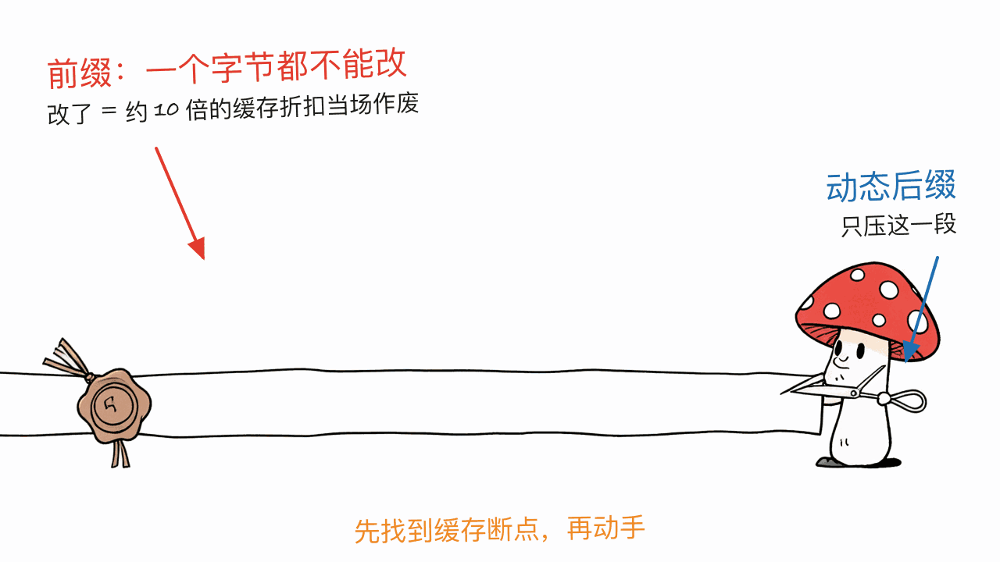
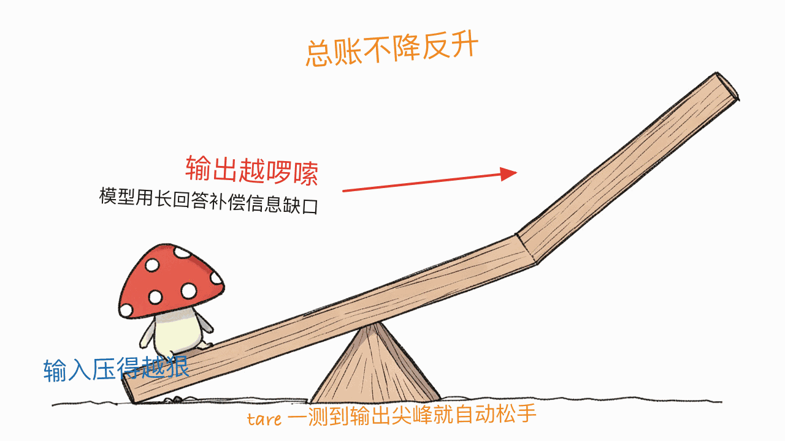

*by Mycelium Protocol*

---

项目地址：https://github.com/mstuart/tare
文档：https://github.com/mstuart/tare/blob/main/docs/getting-started.md
授权：MIT

---

## 一句话结论

**本站写过一串"怎么少花 token"的项目，tare 是其中唯一一个压缩输入本体、而且把前缀缓存边界当硬约束的。** 它坐在 agent 和模型 API 中间，把工具输出、日志、JSON 重新编码成信息等价但 token 更少的形式——**默认无损**，有损手段（行数截断、电报体、代码骨架化）必须你显式打开。Rust 写的，MIT，9 个 crates，228 个测试，`fmt` / `clippy -D warnings` / `cargo deny` 门禁每个提交。仓库 3 star，是个早期项目，但工程规格不像 3 star 的样子。

## 先划清和本站已发内容的边界

省 token 这个题目本站写了不少，容易混成一团，先按**动的是哪一段**排一下：

| 项目 | 动哪里 | 手段 |
|---|---|---|
| Caveman | 模型的**输出** | 让它用"穴居人语"回话，有损 |
| OpenSquilla | **路由** | 用本地 ML 路由器换更便宜的模型 |
| Reasonix | **缓存命中率** | 保持前缀稳定，让缓存折扣生效，不压内容 |
| **tare** | 模型的**输入** | 重编码上下文，且不破坏前缀缓存 |

前三个都不碰你送进去的那堆上下文本身。tare 碰的正是它，而且碰的时候要满足三个约束——这三条合起来才是它的真正卖点。

## 三条约束

### 1. 无损是默认值

"压缩"在 LLM 语境下经常被偷换概念成"删掉一些"。tare 的默认档不删信息：工具输出、日志、JSON 被**重新编码成等价的更密形式**，可以还原（MCP 里专门有个 `tare_expand` 工具做反向操作）。

会丢信息的三种手段——行数上限（`--max-rows`）、电报式自然语言、AST 代码骨架化——**必须你主动开**。这个默认值的方向选得对：省钱是次要目标，agent 因为看不到关键信息而做错判断的代价，远比多花的 token 贵。

### 2. cache-correct：不让一个字节作废整个缓存

这条是最容易被忽略、也最能体现作者懂行的地方。

provider 的前缀缓存会给命中的 token 打**约十分之一的折扣**，但它按**前缀**匹配——你在前缀里改写了一个字节，后面整段缓存全部作废。于是一个天真的压缩器会陷入自相矛盾：它压掉了 40% 的 token，却让本来能打一折的部分变成全价，总账反而更贵。

tare 的做法是先**检测缓存断点**，只压缩断点之后的动态后缀，前缀原样不动。本站写 Reasonix 那篇讲过前缀缓存命中率有多值钱（真实用户单日 435M 输入 token、99.82% 命中率，实际花费约 12 美元而不是 61 美元）——tare 等于是在做压缩的同时，把 Reasonix 那套收益保住了。



### 3. output-aware：压过头，模型会用啰嗦补偿

这条最反直觉，也是很多省 token 方案根本没测出来的坑：**输入压得太狠，模型会用更长的输出来补偿**，总 token 成本不降反升。

tare 每一轮读模型的输出 token 数，一旦出现啰嗦尖峰就自动降低压缩力度（对应代码里的 `x-tare-verbosity-spike` 信号）。它还提供 `TARE_OUTPUT_HOLDOUT`，留一部分会话完全不压缩当对照组，用 `tare output-savings` 做 A/B——**自己给自己留了证伪的余地**，这在这类工具里不多见。



## 实测数字，以及为什么骨架化是最大的杠杆

作者把语料和复现脚本都提交进了仓库（`crates/tare-bench/`，`python3 crates/tare-bench/run_proof.py` 可复现），用 tiktoken o200k_base 计量：

| 内容类型 | 命令 | 输入 → 输出 token | 降幅 |
|---|---|---|---|
| JSON 数组 | `tare compact-lossy` | 6,906 → 3,625 | 47.5% |
| 表格（ps aux） | `tare compact-lossy` | 1,545 → 802 | 48.1% |
| 日志 | `tare compact-lossy` | 13,217 → 6,551 | 50.4% |
| agent 上下文 | `tare compress` | 15,130 → 8,499 | 43.8% |
| 代码（server.rs） | `tare skeletonize` | 5,930 → 1,582 | **73.3%** |
| 代码（json_crush.rs） | `tare skeletonize` | 3,937 → 1,607 | 59.2% |
| 散文 | `tare compact-lossy` | 5,732 → 2,727 | 52.4% |

代码那两行降幅最大，不是巧合。README 引了 SWE-Pruner（ACL 2026，arXiv:2601.16746）的结论：**代码读取占一个编程 agent token 消耗的 67–76%**。所以"保留函数签名、按需省略函数体"这个结构化压缩，才是杠杆最长的那一根。

## 装上跑一遍

```bash
# 安装（五选一，不需要 Rust 工具链）
curl -fsSL https://raw.githubusercontent.com/mstuart/tare/main/install.sh | sh   # → ~/.local/bin
npm install -g tare-ai
docker pull ghcr.io/mstuart/tare
cargo install tare-cli

# 方式一：当代理跑，把 agent 的 base URL 指过来，零代码改动
TARE_UPSTREAM=https://api.anthropic.com tare-proxy    # 默认 8787 端口

# 方式二：一条命令包住你的 agent（支持 claude / codex / aider / goose 等 12 个）
tare wrap claude
tare wrap claude --print        # 干跑，先看看它会执行什么

# 方式三：直接当 CLI 用，处理任意 stdin
cat big.rs | tare skeletonize --path big.rs      # 去掉函数体，保留结构
ps aux     | tare compact-lossy --max-rows 30
```

**不想改 base URL 的话走 MCP**——`tare-mcp` 是个本地 stdio server，你的 agent 把它当工具调用，它自己从不调模型，所以**不需要 API key**：

```bash
claude mcp add tare -s user -- npx -y -p tare-ai tare-mcp
```

暴露 10 个工具：四个压缩（`tare_compress`、`tare_skeletonize`、`tare_compact_lossy`、`tare_deref_images`）、一个可逆的 `tare_expand`、`tare_stats`，外加跨会话记忆。同一段 JSON 粘进 Cursor、Codex、Claude Desktop 也能用。

还有个细节值得说：代理**转发客户端送来的任何凭证**——可以是计费的 `x-api-key`，也可以是你把 Claude Code 的 `ANTHROPIC_BASE_URL` 指过来时带的 **Claude Pro/Max 订阅 OAuth token**。也就是说订阅用户不用另开 API key 就能用。

每一轮的结果通过响应头汇报（`x-tare-input-tokens`、`x-tare-net-tokens`、`x-tare-dropped`、`x-tare-aggression`、`x-tare-verbosity-spike`、`x-tare-halted`），`TARE_ENABLED=0` 可以随时切回逐字节透传。

## 它跟同类怎么比

README 里那张对比表列得很克制，我核对后照搬关键列：

| | 作用范围 | 本地 | 默认无损 | output-aware |
|---|---|:-:|:-:|:-:|
| **tare** | 工具输出 · 日志 · 文件 · JSON · 历史 | ✅ | ✅ | ✅ |
| Headroom | 全部上下文 | ✅ | ❌（可经缓存还原） | ❌ |
| RTK | CLI 命令输出 | ✅ | ❌ | ❌ |
| lean-ctx | CLI 命令、MCP 工具 | ✅ | ❌ | ❌ |
| LLMLingua-2 | 散文 / RAG | ✅ | ❌ | ❌ |
| 各家原生 compaction | 对话历史 | ❌ | ❌ | ❌ |

"默认无损"和"output-aware"这两列，目前只有它全勾上。

## 现在就能不能重度依赖它？

**工程规格是够的**：对着真实 Anthropic API 跑过端到端验证（完整代理往返 + MCP server 走真实 stdio JSON-RPC），228 个单元、集成和属性测试，每个提交都过 `fmt` / `clippy -D warnings` / `cargo deny`。启动失败会给一行清楚的 `[tare-proxy] fatal: …`，而不是 panic 堆栈。

**但要按本地 sidecar 来部署**。它转发你的凭证到上游，不记录也不持久化，但作者在 SECURITY.md 里说得明白：把它当自己机器上的可信组件，**不要当多租户共享基础设施**。

作者自己列的已知边界，也照抄不美化：

- 代理和 CLI 的 token 计数是**近似值**（`tare-tokenize`，按字符数除以 4）；上面表格里的数字是用 tiktoken 实测的，两者不是一回事。
- 上下文占用信号统计的是序列化后的整个请求（含 JSON 信封），所以会**略微高估**——偏保守，倾向于提早开始压缩。
- 超过 2MB 的**流式**响应，如果最终 usage 事件正好跨过 64KB 尾缓冲区，可能漏掉一次啰嗦度采样（不致命）。

**明确不做的事**：不训练 ML 文本压缩模型（所以没有权重要下载，也没有推理延迟），不处理音频（自己转录完再把文本喂给 `tare compress`）。

**什么时候不该用它**：如果你只用单一 provider 的原生 compaction、不需要跨 provider 代理，或者你的运行环境里根本起不了本地代理进程，那就别折腾了。

## 一点判断

3 star 的项目通常不值得单独写一篇。这个值得，原因不是它的星数，而是**它把一个被反复吹嘘的指标（降了百分之多少）拆成了三个互相制衡的约束**：无损优先于压缩率，缓存正确性优先于压缩率，真实总成本优先于输入 token 数。

顺带，它也演示了怎么验证一个省钱声明是不是吹的——语料提交进仓库、复现脚本给出来、计量口径写清楚（tiktoken 而不是自己那个 chars/4 的近似值）、还主动留了 A/B 对照组。下次再看到"节省 70% token"的说法，可以拿这几条去对。

---

> © 2026 Author: Mycelium Protocol. 本文采用 [CC BY 4.0](https://creativecommons.org/licenses/by/4.0/deed.zh) 授权——欢迎转载和引用，须注明作者姓名及原文链接，不得去除署名后以原创发布。

<!--EN-->

*by Mycelium Protocol*

---

Repository: https://github.com/mstuart/tare
Docs: https://github.com/mstuart/tare/blob/main/docs/getting-started.md
License: MIT

---

## TL;DR

**This blog has covered a string of "spend fewer tokens" projects; tare is the only one that compresses the input itself while treating the prefix-cache boundary as a hard constraint.** It sits between your agent and the model API and re-encodes tool output, logs, and JSON into an information-equivalent but denser form — **lossless by default**, with lossy transforms (row caps, telegraphic prose, code skeletonization) strictly opt-in. Written in Rust, MIT, nine crates, 228 tests, with `fmt` / `clippy -D warnings` / `cargo deny` gating every commit. The repo has 3 stars; the engineering does not look like a 3-star project.

## Drawing the lines against what we've already covered

Token savings is a crowded topic here, so let's sort the prior coverage by **which segment it touches**:

| Project | Touches | Method |
|---|---|---|
| Caveman | the model's **output** | makes it answer in "caveman speak" — lossy |
| OpenSquilla | **routing** | a local ML router picks a cheaper model |
| Reasonix | **cache hit rate** | keeps the prefix stable so the discount applies; compresses nothing |
| **tare** | the model's **input** | re-encodes the context without breaking the prefix cache |

The first three never touch the context you send. tare touches exactly that — under three constraints that together are the real story.

## The three constraints

### 1. Lossless is the default

"Compression" in an LLM context is often quietly redefined as "deleting some of it." tare's default setting deletes nothing: tool output, logs, and JSON are **re-encoded into an equivalent denser form**, and it's reversible (the MCP server ships a dedicated `tare_expand` tool for the inverse).

The three transforms that do lose information — row caps (`--max-rows`), telegraphic natural language, and AST code skeletonization — **must be turned on deliberately**. That default points the right way: saving money is the secondary goal, and an agent making a wrong call because it couldn't see something costs far more than the extra tokens would have.

### 2. Cache-correct: don't let one byte void the whole cache

This is the easiest part to overlook, and the clearest sign the author has done this before.

Provider prefix caches discount cached tokens by roughly 10×, but they match on the **prefix** — rewrite a single byte inside it and everything after is forfeit. A naive compressor walks straight into a contradiction: it strips 40% of the tokens while turning a 10×-discounted segment back into full price, and the total bill goes *up*.

tare instead **detects the cache breakpoint** and compresses only the dynamic suffix, leaving the prefix byte-identical. Our Reasonix post covered how valuable that hit rate is (a real user's 435M input tokens in one day at a 99.82% hit rate, costing ~$12 instead of ~$61) — tare is effectively preserving those savings while still compressing.


### 3. Output-aware: over-compress and the model compensates with verbosity

The least intuitive constraint, and the trap most token-saving schemes never measure: **compress the input too hard and the model answers at greater length to compensate**, so total token cost rises even as input falls.

tare reads the model's output token count every turn and reduces compression aggression when verbosity spikes (the `x-tare-verbosity-spike` signal in the code). It also offers `TARE_OUTPUT_HOLDOUT` to leave a fraction of sessions entirely uncompressed as a control group, with `tare output-savings` running the A/B — **it deliberately leaves itself falsifiable**, which is rare in this category.


## The measured numbers, and why skeletonization is the biggest lever

The author committed both the corpus and the reproduction script (`crates/tare-bench/`, reproduce with `python3 crates/tare-bench/run_proof.py`), measured with tiktoken o200k_base:

| Content type | Command | Input → output tokens | Reduction |
|---|---|---|---|
| JSON array | `tare compact-lossy` | 6,906 → 3,625 | 47.5% |
| Tabular (ps aux) | `tare compact-lossy` | 1,545 → 802 | 48.1% |
| Logs | `tare compact-lossy` | 13,217 → 6,551 | 50.4% |
| Agent context | `tare compress` | 15,130 → 8,499 | 43.8% |
| Code (server.rs) | `tare skeletonize` | 5,930 → 1,582 | **73.3%** |
| Code (json_crush.rs) | `tare skeletonize` | 3,937 → 1,607 | 59.2% |
| Prose | `tare compact-lossy` | 5,732 → 2,727 | 52.4% |

The two code rows leading the table is not a coincidence. The README cites SWE-Pruner (ACL 2026, arXiv:2601.16746): **code reads account for 67–76% of a coding agent's tokens**. So structural compression — keep the signatures, elide the bodies on demand — is where the longest lever is.

## Installing and running it

```bash
# Install (pick one; no Rust toolchain required)
curl -fsSL https://raw.githubusercontent.com/mstuart/tare/main/install.sh | sh   # → ~/.local/bin
npm install -g tare-ai
docker pull ghcr.io/mstuart/tare
cargo install tare-cli

# Option 1: run it as a proxy and point your agent's base URL at it — zero code changes
TARE_UPSTREAM=https://api.anthropic.com tare-proxy    # port 8787 by default

# Option 2: wrap your agent in one command (12 supported: claude, codex, aider, goose, …)
tare wrap claude
tare wrap claude --print        # dry run: show what it would execute

# Option 3: use it as a plain CLI over any stdin
cat big.rs | tare skeletonize --path big.rs      # drop function bodies, keep structure
ps aux     | tare compact-lossy --max-rows 30
```

**If you'd rather not change a base URL, use MCP.** `tare-mcp` is a local stdio server your agent calls as tools; it never calls the model itself, so it **needs no API key**:

```bash
claude mcp add tare -s user -- npx -y -p tare-ai tare-mcp
```

It exposes 10 tools: four compressors (`tare_compress`, `tare_skeletonize`, `tare_compact_lossy`, `tare_deref_images`), a reversible `tare_expand`, `tare_stats`, and cross-session memory. The same JSON block drops into Cursor, Codex, or Claude Desktop.

One more detail worth noting: the proxy **forwards whatever credentials the client sends** — a billable `x-api-key`, or the **Claude Pro/Max subscription OAuth token** you carry when pointing Claude Code's `ANTHROPIC_BASE_URL` at it. Subscribers don't need to open a separate API key.

Each turn reports itself through response headers (`x-tare-input-tokens`, `x-tare-net-tokens`, `x-tare-dropped`, `x-tare-aggression`, `x-tare-verbosity-spike`, `x-tare-halted`), and `TARE_ENABLED=0` switches back to byte-exact passthrough at any time.

## How it compares

The README's comparison table is refreshingly restrained; here are the key columns after checking them:

| | Scope | Local | Lossless default | Output-aware |
|---|---|:-:|:-:|:-:|
| **tare** | tools · logs · files · JSON · history | ✅ | ✅ | ✅ |
| Headroom | all context | ✅ | ❌ (reversible via cache) | ❌ |
| RTK | CLI command output | ✅ | ❌ | ❌ |
| lean-ctx | CLI commands, MCP tools | ✅ | ❌ | ❌ |
| LLMLingua-2 | prose / RAG | ✅ | ❌ | ❌ |
| Provider-native compaction | conversation history | ❌ | ❌ | ❌ |

Those last two columns are the ones only tare currently ticks.

## Can you rely on it today?

**The engineering holds up**: verified end-to-end against the live Anthropic API (a full proxy round-trip plus the MCP server over real stdio JSON-RPC), on top of 228 unit, integration, and property tests, with `fmt` / `clippy -D warnings` / `cargo deny` gating every commit. Startup failures exit with a clear `[tare-proxy] fatal: …` rather than a panic backtrace.

**But deploy it as a local sidecar.** It forwards your credentials upstream without logging or persisting them, but SECURITY.md is explicit: treat it as a trusted component on your own machine, **not as shared multi-tenant infrastructure**.

The author's own known edges, copied without polishing:

- Proxy and CLI token counts are **approximate** (`tare-tokenize`, chars/4); the benchmark table above was measured with tiktoken — the two are not the same thing.
- The context-fill signal counts the serialized request including its JSON envelope, so it **slightly over-estimates** fill — conservative, erring toward compressing sooner.
- A streaming response over 2 MB whose final usage event straddles the 64 KB tail buffer may skip one verbosity sample (non-fatal).

**Explicit non-goals**: no trained ML text compressor (nothing to download, no inference latency) and no audio — transcribe externally and feed the transcript to `tare compress`.

**When to skip it**: if you use a single provider's native compaction and don't need a cross-provider proxy, or your environment can't run a local proxy process at all.

## A closing judgment

A 3-star project usually doesn't warrant its own post. This one does — not because of the star count, but because **it decomposes a metric people love to brag about (percent reduced) into three constraints that check each other**: losslessness before ratio, cache correctness before ratio, and real total cost before input-token count.

It also happens to demonstrate how to verify a savings claim: commit the corpus, ship the reproduction script, state the measurement basis (tiktoken, not the tool's own chars/4 approximation), and keep a deliberate A/B control group. Worth holding the next "70% token savings" claim against those four.

---

> © 2026 Author: Mycelium Protocol. Licensed under [CC BY 4.0](https://creativecommons.org/licenses/by/4.0/) — free to share and adapt with attribution. You must credit the author and link to the original; removing attribution and republishing as original is not permitted.
