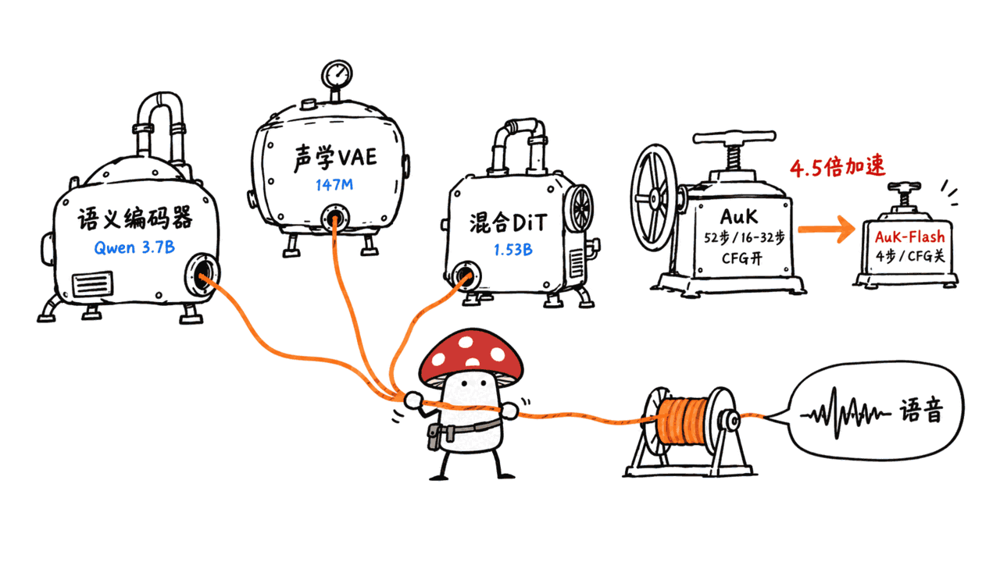
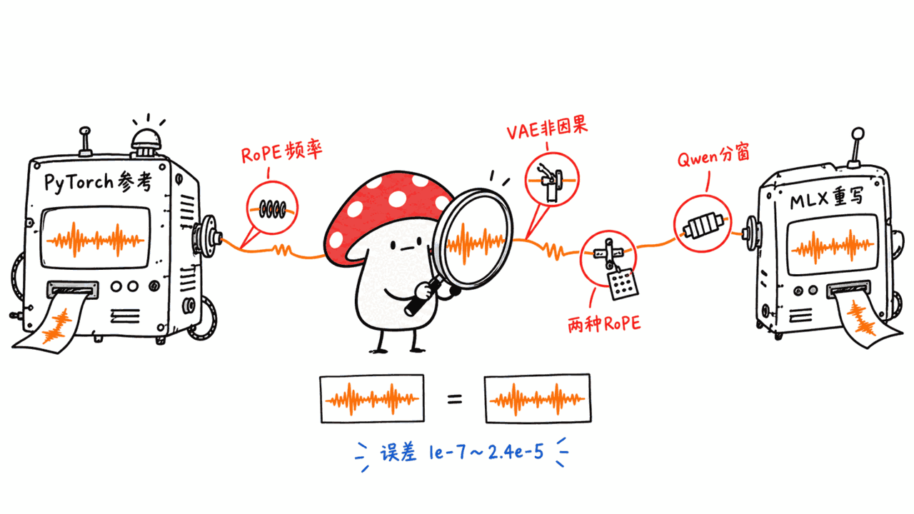
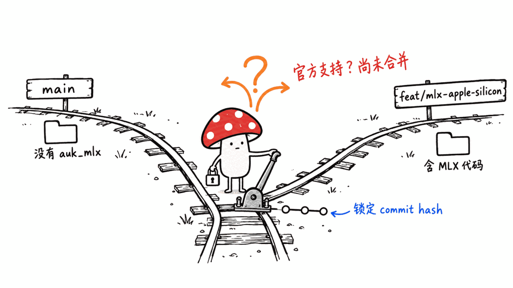

> 📌 一手资料
> 模型卡：https://huggingface.co/tencent/AuK
> GitHub 仓库：https://github.com/Tencent-Hunyuan/AuK
> 技术报告（arXiv 2609.08936）：https://arxiv.org/abs/2609.08936
> MLX 分支文档：https://github.com/Tencent-Hunyuan/AuK/blob/feat/mlx-apple-silicon/docs/MLX.md

---

**BLUF**：AuK 是腾讯混元团队开源的 **1.5B 参数**语音生成与编辑基座模型，训练数据据论文摘要约 **30.3 亿条指令-音频样本、195 万小时有效监督**，用同一套自然语言指令接口统一了零样本语音克隆、内容编辑、变调变速、情绪/音色改写、降噪和人声分离等 **16 项任务**。代码和权重都是 **MIT 协议**，GitHub 939 星（2026-08-19 建仓，今天仍在提交），HuggingFace 模型卡下载 2,390 次、234 赞。蒸馏版 AuK-Flash 官方称比全量模型快 **4.5 倍**（4 步、关闭 CFG）。**对 Mac 用户最关键的信息**：官方在 `feat/mlx-apple-silicon` 分支放出了原生 MLX 实现，在 M4 Pro 48GB 上验证，8-bit 量化配合"顺序加载"能把峰值内存压到 **6.1GB**，理论上 16GB Mac 有富余；但这条路径**还没合并进主分支**，且模型实际由三块权重拼成——1.53B 的扩散生成器之外还要搭一个 **3.7B 的 Qwen2.5-Omni 语义编码器**，"1.5B"这个名字只讲了故事的一半。

我们通读了模型卡、GitHub README 全文、论文摘要，以及专门为 Apple Silicon 写的 MLX 移植文档，试图回答三个问题：AuK 到底是什么、腾讯说的性能数字有没有一手依据、以及一台 Mac mini 或 MacBook 能不能装得下它。

## AuK 到底是什么？

据模型卡和官方 README，基本事实如下：

| 项目 | 数值 | 来源 |
|---|---|---|
| 定位 | 1.5B 参数语音生成与编辑基座模型 | 模型卡简介 |
| 训练规模 | 约 30.3 亿条指令-音频样本，195 万小时有效监督 | 论文摘要（arXiv 2609.08936） |
| 任务家族 | 5 大类、16 项子任务，统一自然语言指令接口 | README「Supported Tasks」 |
| 变体 | AuK（基座，可调步数/CFG）、AuK-Flash（4 步蒸馏，CFG=0） | README |
| 许可证 | MIT（代码与权重同一协议） | 仓库 LICENSE 文件原文 |
| HuggingFace 热度 | AuK：2,390 下载 / 234 赞；AuK-Flash：1,691 下载 / 83 赞（抓取于 2026-09-15） | HF API |
| GitHub 热度 | 939 星，创建于 2026-08-19，今天（09-15）仍有提交 | GitHub API |
| 论文 | 《AuK Technical Report》，作者含 Ziyang Ma、Xie Chen 等，arXiv 2609.08936，cs.SD | 论文页面 |

值得注意的是，"1.5B"这个数字只是扩散生成器本身。据 MLX 移植文档，实际推理管线由三块权重组成：BigVGAN-Flow 声学 VAE（约 1.47 亿参数）、Flux2Edit 扩散 Transformer（1.53B，含 10 层双流 MMDiT 加 20 层单流 DiT）、以及负责语义理解的 **Qwen2.5-Omni Thinker**（36 层语言模型 + 32 层音频塔，约 3.7B 参数）。也就是说，跑一次推理实际要装载的权重接近 5.2B，比模型名暗示的规模大三倍多。

## 三段训练配方 + 4.5 倍蒸馏，是怎么做到的？

论文摘要给出的训练路线是四段式：先做纯生成的预热训练，再进入生成-编辑联合预训练；后训练阶段对"开放式编辑"用人类反馈偏好优化，对"语音生成"用基于奖励的强化学习；最后做蒸馏——用一致性初始化加"任务路由的解耦 DMD"（Decoupled DMD），压出 AuK-Flash。论文原话是 AuK-Flash 实现 4-step 推理、不需要无分类器引导（CFG），在同等条件下比全量模型快 **4.5 倍**（wall-clock speedup）。README 给出的推荐推理参数印证了这一点：AuK-Flash 用 4 步固定推理，AuK 基座则是可调步数（MLX 分支的测试用了 16 步和 32 步做对比）。

需要说明的是，论文摘要只给了这一个量化的加速比，没有给具体的 WER/MOS 等质量指标数字；模型卡里的"Performance"一节是一张图，我们没有把图里的数字抄下来冒充一手数据——如果你要精确的 benchmark 对比，去看 arXiv 全文或模型卡的图表。

## 16 项任务，一个自然语言接口

据 README，AuK 把下面 16 个任务全部包进同一套"给一句指令 + 可选参考音频"的调用方式：

| 类别 | 子任务 |
|---|---|
| 语音生成 | 零样本 TTS（用参考音频的声音说目标文本）、指令 TTS（只给声音描述，不需要参考音频） |
| 内容编辑 | 语音内容编辑（替换/插入/删除说的内容）、歌词编辑（改歌词同时保留旋律和音色） |
| 声学编辑 | 变调（按半音）、变速（输出时长跟着倍率变）、变音量（按分贝） |
| 副语言编辑 | 情绪改写、音色改写、去口音、非语言编辑（加/去呼吸笑声咳嗽等）、耳语/正常语音互转 |
| 增强与分离 | 语音增强（降噪/去混响）、语音分离（按说话顺序保留目标说话人）、音乐分离（提取人声或保留所有人声）、目标说话人抽取（按说话内容定位说话人） |

这套"统一自然语言指令"的设计和市面上大多数按任务拆分模型/接口的 TTS 项目不同——本站之前写过的 fireredtts3、higgs-tts3、moss-tts 等都是把克隆、编辑、增强分成不同的调用方式或不同的 checkpoint。AuK 把它们收进一套接口的代价，是模型内部要同时装下语义编码、声学编码和扩散生成三套子系统，这也是它比同参数量纯 TTS 模型更重的原因。

## 官方 GPU 显存实测：开不开 CPU offload 差多少？

README 给出了在单张 NVIDIA A800-SXM4-80GB 上 bf16 推理的实测峰值显存（`torch.cuda.max_memory_allocated`）：

| 模型 | 输入 | 不开 CPU offload | 开 CPU offload | 省了多少 |
|---|---|---:|---:|---:|
| AuK | 纯文本，1.5 秒输出 | 24.78 GiB | 16.75 GiB | 8.03 GiB（32.4%） |
| AuK | 5 秒参考音频 | 25.00 GiB | 16.98 GiB | 8.02 GiB（32.1%） |
| AuK-Flash | 纯文本，1.5 秒输出 | 24.77 GiB | 16.75 GiB | 8.02 GiB（32.4%） |
| AuK-Flash | 5 秒参考音频 | 24.97 GiB | 16.98 GiB | 7.99 GiB（32.0%） |

也就是说，就算用了官方的 CUDA CPU offload，单卡也至少要接近 17GB 显存，24GB 消费级显卡（如 RTX 4090）勉强够用，更小的卡装不下。这组数字直接决定了：想在没有大显存 GPU 的机器上跑 AuK，就得看下面这条 Apple Silicon 路径。

## 关键问题：Mac 能跑吗？MLX 分支给出的答案

2026-09-13，官方在 `feat/mlx-apple-silicon` 分支放出了一套**从零重写的原生 MLX 实现**（不是套 PyTorch MPS 后端），把 VAE、DiT、Qwen2.5-Omni Thinker 三套子系统全部用 MLX 算子重新实现，并逐层和 PyTorch 参考实现做了数值对比。以下数字全部来自这份分支文档，**测试机是 M4 Pro（48GB），macOS 26.4，Python 3.10，mlx 0.32.2**——我们自己没有下载模型复现（原始权重加上 Qwen2.5-Omni-3B 编码器超过 15GB，转换后 fp32 MLX 权重还要再占约 28GB，超出了我们给本机任务设的下载上限）。

**量化能省多少内存？**（零样本 TTS 测试，AuK 基座 32 步）：

| 精度 | 峰值内存 | DiT 磁盘体积 | Thinker 磁盘体积 | RTF |
|---|---:|---:|---:|---:|
| fp32 | 24.3 GB | 6.12 GB | 14.9 GB | 6.05 |
| 8-bit | 9.1 GB | 1.75 GB | 4.21 GB | 6.02 |
| 4-bit | 6.5 GB | — | — | 6.06 |

文档明确写了**量化省的是内存，不是速度**：三档 RTF 几乎一样，因为这个工作负载是"计算受限"（ODE 求解本身耗时），不是"带宽受限"。同时给出了量化精度损失的实测：8-bit 相对 fp32 波形相关系数 0.989、频谱余弦相似度 1.0000、ASR 转写结果完全一致；4-bit 英文转写仍然正确，但**中文发音明显劣化**——文档举的例子是"論文…導師"被 4-bit 版本读成了"任務…倒死"。结论是**建议用 8-bit，不要用 4-bit**。

**顺序加载（sequential 模式）能再省多少？** 因为 VAE、DiT、Thinker 三套权重在一次推理里是依次使用、从不同时用到的，`--sequential` 参数让程序用一个卸一个，MLX 的统一内存架构下这只是"释放再从磁盘读"，没有 CUDA offload 那种搬运开销：

| 精度 | 常驻模式峰值内存 | 顺序模式峰值内存 |
|---|---:|---:|
| fp32 | 24.3 GB | 15.4 GB |
| 8-bit | 9.1 GB | **6.1 GB** |

文档特别强调两种模式输出**逐位相同**（最大绝对误差 0），代价是顺序模式每次调用都要重新从磁盘读权重，适合单次调用，不适合批量任务。**8-bit + 顺序加载，峰值内存 6.1GB——理论上 16GB 的 Mac 能轻松装下，还有余量。**

**速度呢？** M4 Pro 上跑 4 秒音频（8 次重复取最小-最大区间，文档提醒机器"不安静"，同配置重复跑波动超过 2 倍，建议信下限）：

| 配置 | 墙钟时间 | RTF |
|---|---|---|
| AuK-Flash，4 步 | 约 2-7 秒 | 0.6-1.8 |
| AuK 基座，16 步 | 约 8-16 秒 | 2.0-4.0 |
| AuK 基座，32 步 | 约 17-29 秒 | 4.2-7.3 |

RTF（实时倍率）大于 1 意味着比实时慢——生成 4 秒音频，AuK-Flash 最快也要 2 秒，基座 32 步慢的时候接近 30 秒。这不是一个能拿来做实时语音对话的模型，更适合离线批处理式的配音、编辑、克隆任务。

文档还跑了全部 17 个官方 Cookbook 示例做端到端验证：AuK-Flash（4 步）总耗时 237 秒，17 项校验通过 15 项；基座（32 步）总耗时 776 秒，通过 16 项。两个变体唯一都没做对的一项是"歌词编辑"（把"rear view"改成"like you"），文档专门核实了同样设置下 **PyTorch 原版参考实现也做不对这一条**，说明这是模型本身的能力边界，不是 MLX 移植的 bug。

## 移植过程暴露的四个坑，说明这不是套壳

判断一个"支持 Apple Silicon"的声明是不是真做了工作，比较靠谱的办法是看它有没有踩过硬骨头。这份文档记了四个真实踩坑，其中最大的一个：**RoPE 的 `inv_freq` 必须从权重文件里读，不能按公式现算**——AuK 存的是 bf16 舍入过的版本（10000 底数的旋转位置编码，正确值应是 0.74989，权重里存的是舍入到 0.75），按公式重新计算看起来"更精确"，实际会让 DiT 输出偏移 5e-3，在 30 层网络里累积放大，是**单一最大误差来源**。另外三个坑分别是：VAE 解码器里的 `conv_pre` 层是非因果的（周围全是因果卷积，错了会让音频整体偏移 6 个采样点，听感上不会报警但测量得出来）；AuK 的 DiT 用交错型 RoPE 卷积、HuggingFace 的 Qwen2 用另一种"半分割"卷积，同一个管线里混用两种约定会静默降低质量；Qwen 音频塔是分窗处理的（按 2×窗口数分块、块间做块对角注意力、之后再做步长 2 的平均池化），直接套标准 Whisper 编码器会得到错误的 token 数和错误的向量。

移植团队用 `test_parity.py` 做了逐阶段的数值对比：卷积/激活/重采样等基础算子误差约 1e-7，VAE 编解码误差 7e-7/8e-5，DiT 前向（含/不含 CFG）约 5e-6，16 步 CFG 欧拉轨迹累积误差 2.4e-5。这组数字说明这确实是一次认真的逐层复现，不是简单调 PyTorch MPS 跑一遍就叫"支持"。

## 这是"官方支持"还是"实验分支"？

这里有个需要 Mac 用户格外注意的细节：主分支 README 的"News"栏写的是"AuK now officially supports MLX inference on Apple Silicon"，但紧跟着的括号说明是"available on the `feat/mlx-apple-silicon` branch"——**这套代码目前不在 `main` 分支里，普通 `git clone` 默认拿到的仓库里没有 `src/auk_mlx/` 这个目录**，要专门切换分支才能用。同时，MLX 分支的 README 明确写了"不改动 `src/auk/` 下的任何东西，CUDA 路径完全不受影响"，说明这确实是团队自己维护的独立实现，而不是社区野生 PR，但也确实还没经过合并进主线的常规评审流程，接口和文件路径都有可能在合并前发生变化。如果你要长期依赖这条路径，建议锁定具体的 commit hash，而不是假设分支名会一直存在。

## 许可证、生态和该留意的风险

代码和权重都是 **MIT**，这意味着**没有任何使用范围、收入门槛或内容过滤的强制要求**——相比我们之前写过的 Krea 2 Turbo（年收入低于 100 万美元才能免费商用、必须做内容过滤、许可证可被 30 天通知终止），AuK 在授权层面几乎没有摩擦，你甚至可以直接拿它做商业产品或二次分发,不需要在模型名前加前缀,也不需要向任何人报备。

生态方面，README 致谢栏里列出了几条已经落地的集成：SGLang-Omni 做了"Day 0"支持（推理服务）；社区维护的 ComfyUI-AuK 节点；社区量化转换仓库 drbaph/AuK-comfyui；AuK 被选为 **ICASSP 2027 Audio Editing Challenge** 单模型赛道的官方基线（这个挑战赛的仓库地址在 README 里给出，可以自行核实）。

但正是因为门槛低、能力全，我们认为有一点必须写清楚：**AuK 的核心能力之一是零样本声音克隆——给一段参考音频就能用同一个声音说任意新文本**，MIT 协议下没有任何强制的水印、溯源或滥用防护义务。README 和模型卡都没有提到内置的输出水印机制（对比之下，很多商业 TTS 服务会强制加不可闻水印）。如果你要把它接进产品，声音克隆这一类功能建议自己加使用授权确认和可审计日志，不要假设"MIT 协议"等于"怎么用都没有责任"。

## 适合谁，不适合谁？

**适合**：需要一个功能全面、协议宽松的语音处理基座来做研究或产品原型的团队；已经有 Apple Silicon 设备、想低成本试跑本地语音编辑管线的个人开发者；需要"生成+编辑+增强+分离"一站式接口、不想维护四五个不同模型的场景。

**不适合**：需要实时对话式语音交互的场景（RTF 普遍大于 1，跟不上实时）；显存/内存紧张到 8GB 以下的机器（就算 8-bit + 顺序加载也要 6.1GB，加上系统和应用本身的占用，8GB 机器风险很大）；依赖稳定、经过合并评审的官方发布流程的团队（Mac 路径目前挂在实验分支上）；对声音克隆滥用风险敏感、又没有额外审计能力的产品。

## 常见问题

**Q：AuK 是多少参数的模型？**
A：模型卡说是 1.5B 基座模型，但这只是扩散生成器（Flux2Edit DiT，1.53B）本身。实际推理还要加载约 1.47 亿参数的 VAE 和约 3.7B 参数的 Qwen2.5-Omni 语义编码器，三者合计接近 5.2B。

**Q：16GB 的 Mac 能跑吗？**
A：据官方 `feat/mlx-apple-silicon` 分支文档，在 M4 Pro 上用 8-bit 量化配合顺序加载模式，峰值内存约 6.1GB，理论上 16GB Mac 能轻松容纳。但这条路径不在主分支、需要自己转换量化权重，我们没有下载复现，建议按文档自己验证一遍再依赖它。

**Q：AuK 和 AuK-Flash 该用哪个？**
A：追求质量、能接受更长等待时间用 AuK 基座（可调步数，MLX 测试用了 16/32 步）；追求速度用 AuK-Flash（固定 4 步、关闭 CFG，论文称比基座快 4.5 倍）。MLX 实测里基座在还原编辑幅度上更准（比如目标 +10dB 音量调整，基座做到 +9.7dB，Flash 只做到 +7.4dB）。

**Q：能不能实时用它做语音对话？**
A：不建议。MLX 分支在 M4 Pro 上测得 RTF（实时倍率）普遍在 0.6 到 7.3 之间，多数配置比实时慢，更适合离线批处理式的配音、克隆、编辑任务。

**Q：有没有防止声音克隆滥用的机制？**
A：README 和模型卡都没有提到强制水印或溯源机制，协议是没有使用限制的 MIT。如果你要做面向公众的产品，建议自己加身份核验和审计日志。

## 一手源

- 模型卡：https://huggingface.co/tencent/AuK
- HuggingFace API（下载/许可证/文件列表）：https://huggingface.co/api/models/tencent/AuK
- AuK-Flash 模型卡：https://huggingface.co/tencent/AuK-Flash
- GitHub 仓库：https://github.com/Tencent-Hunyuan/AuK
- MLX 移植文档（feat/mlx-apple-silicon 分支）：https://github.com/Tencent-Hunyuan/AuK/blob/feat/mlx-apple-silicon/docs/MLX.md
- 技术报告：https://arxiv.org/abs/2609.08936
- 项目主页：https://auk-project.github.io/
- ICASSP 2027 Audio Editing Challenge 基线仓库：https://github.com/Audio-Editing-Challenge/Audio-Editing-Challenge-Baseline

---

> © 2026 Author: Mycelium Protocol. 本文采用 [CC BY 4.0](https://creativecommons.org/licenses/by/4.0/deed.zh) 授权——欢迎转载和引用，须注明作者姓名及原文链接，不得去除署名后以原创发布。

<!--EN-->

> 📌 Primary sources
> Model card: https://huggingface.co/tencent/AuK
> GitHub repository: https://github.com/Tencent-Hunyuan/AuK
> Technical report (arXiv 2609.08936): https://arxiv.org/abs/2609.08936
> MLX branch documentation: https://github.com/Tencent-Hunyuan/AuK/blob/feat/mlx-apple-silicon/docs/MLX.md

---

**BLUF**: AuK is Tencent Hunyuan's open-source **1.5B-parameter** foundation model for speech generation and editing, trained on roughly **3.03 billion instruction-audio instances and 1.95 million hours of effective supervision** according to the paper's abstract. It unifies **16 tasks** — zero-shot voice cloning, content editing, pitch/speed edits, emotion/timbre rewriting, denoising and speaker separation — behind one natural-language instruction interface. Both code and weights are **MIT-licensed**. The GitHub repo has 939 stars (created 2026-08-19, still receiving commits today), and the HuggingFace model card shows 2,390 downloads and 234 likes. The distilled AuK-Flash variant claims a **4.5x** wall-clock speedup (4 steps, no CFG). **The key fact for Mac users**: an official native MLX implementation lives on the `feat/mlx-apple-silicon` branch, validated on an M4 Pro (48GB); with 8-bit quantization plus "sequential" loading, peak memory drops to **6.1GB**, which should comfortably fit a 16GB Mac. But this path **has not been merged into the main branch**, and the model is actually assembled from three separate weight sets — a 1.53B diffusion generator plus a **3.7B Qwen2.5-Omni semantic encoder** — so the "1.5B" name only tells half the story.

We read the full model card, the entire GitHub README, the paper's abstract, and the MLX porting documentation written specifically for Apple Silicon, to answer three questions: what AuK actually is, whether Tencent's performance claims have a primary-source basis, and whether a Mac mini or MacBook can run it.

## What Exactly Is AuK?

Basic facts from the model card and official README:

| Item | Value | Source |
|---|---|---|
| Positioning | 1.5B-parameter foundation model for speech generation and editing | Model card intro |
| Training scale | ~3.03 billion instruction-audio instances, 1.95 million hours of effective supervision | Paper abstract (arXiv 2609.08936) |
| Task families | 5 categories, 16 subtasks, unified natural-language instruction interface | README "Supported Tasks" |
| Variants | AuK (base, adjustable steps/CFG), AuK-Flash (4-step distilled, CFG=0) | README |
| License | MIT (same license for code and weights) | Repository LICENSE file |
| HuggingFace traction | AuK: 2,390 downloads / 234 likes; AuK-Flash: 1,691 downloads / 83 likes (fetched 2026-09-15) | HF API |
| GitHub traction | 939 stars, created 2026-08-19, still receiving commits today (09-15) | GitHub API |
| Paper | "AuK Technical Report," authors including Ziyang Ma, Xie Chen and others, arXiv 2609.08936, cs.SD | Paper page |

Notably, the "1.5B" figure describes only the diffusion generator. According to the MLX porting doc, the actual inference pipeline is assembled from three weight sets: a BigVGAN-Flow acoustic VAE (about 147 million parameters), the Flux2Edit diffusion transformer (1.53B, with 10 dual-stream MMDiT blocks followed by 20 single-stream DiT blocks), and a **Qwen2.5-Omni Thinker** handling semantic understanding (a 36-layer LLM plus a 32-layer audio tower, roughly 3.7B parameters). A single inference run actually loads close to 5.2B parameters — more than three times what the model's name suggests.

## A Four-Stage Recipe and a 4.5x Distillation — How?

The paper's abstract describes a four-stage training pipeline: generation-only warm-up, then joint generation-editing pretraining; in post-training, human-feedback preference optimization for open-ended editing and reward-based reinforcement learning for speech generation; and finally distillation using consistency initialization plus task-routed Decoupled DMD, which produces AuK-Flash. The paper states that AuK-Flash performs 4-step inference with no classifier-free guidance (CFG) and achieves a **4.5x wall-clock speedup** over the full model under matched conditions. The README's recommended inference settings back this up: AuK-Flash runs a fixed 4 steps, while the base model uses adjustable steps (the MLX branch tested 16 and 32 steps for comparison).

Worth flagging: the paper's abstract gives only this one quantified speedup and no specific quality metrics like WER or MOS scores. The model card's "Performance" section is an image, and we have not transcribed numbers from that chart as if they were primary-source data — for precise benchmark comparisons, consult the full arXiv paper or the model card's chart directly.

## 16 Tasks, One Natural-Language Interface

Per the README, AuK wraps the following 16 tasks into the same "one instruction plus optional reference audio" calling convention:

| Category | Subtasks |
|---|---|
| Speech Generation | Zero-shot TTS (speak target text in a reference voice), Instruct TTS (voice description only, no reference audio) |
| Content Editing | Speech content editing (replace/insert/remove what's said), Lyric editing (rewrite lyrics while preserving melody and voice) |
| Acoustic Editing | Pitch editing (by semitones), Speed editing (output length scales with rate), Volume editing (by decibels) |
| Paralinguistic Editing | Emotion, Timbre, De-accent, Nonverbal editing (add/remove breaths, laughs, coughs), Whisper conversion |
| Enhancement & Separation | Speech enhancement (denoise/dereverberate), Speech separation (keep a target speaker by talk order), Music separation (extract or keep vocals), Target speaker extraction (locate by what's said) |

This "one unified instruction interface" design differs from most task-split TTS projects we've covered on this blog — fireredtts3, higgs-tts3 and moss-tts, for instance, each split cloning, editing and enhancement into separate call patterns or separate checkpoints. The cost of collapsing them into one interface is that AuK's internals must carry semantic encoding, acoustic encoding and diffusion generation all at once, which is why it's heavier than a comparably-sized pure TTS model.

## Official GPU Numbers: How Much Does CPU Offload Save?

The README reports measured peak VRAM (`torch.cuda.max_memory_allocated`) for bf16 inference on a single NVIDIA A800-SXM4-80GB:

| Model | Input | CPU offload disabled | CPU offload enabled | Saved |
|---|---|---:|---:|---:|
| AuK | Text only, 1.5s output | 24.78 GiB | 16.75 GiB | 8.03 GiB (32.4%) |
| AuK | 5s reference audio | 25.00 GiB | 16.98 GiB | 8.02 GiB (32.1%) |
| AuK-Flash | Text only, 1.5s output | 24.77 GiB | 16.75 GiB | 8.02 GiB (32.4%) |
| AuK-Flash | 5s reference audio | 24.97 GiB | 16.98 GiB | 7.99 GiB (32.0%) |

Even with official CUDA CPU offload, a single GPU still needs close to 17GB of VRAM — a 24GB consumer card (like an RTX 4090) barely clears it, and anything smaller won't fit. These numbers are exactly why the Apple Silicon path below matters for anyone without a large-VRAM GPU.

## The Key Question: Does It Run on a Mac? What the MLX Branch Says

On 2026-09-13, the official team published a **from-scratch native MLX implementation** on the `feat/mlx-apple-silicon` branch — not a PyTorch-MPS wrapper — reimplementing the VAE, DiT, and Qwen2.5-Omni Thinker entirely with MLX ops, with layer-by-layer numerical validation against the PyTorch reference. All the numbers below come from that branch's documentation, **tested on an M4 Pro (48GB), macOS 26.4, Python 3.10, mlx 0.32.2**. We did not download the model to reproduce these ourselves — the original weights plus the Qwen2.5-Omni-3B encoder exceed 15GB, and the converted fp32 MLX weights add roughly another 28GB, past the download budget we set for this machine.

**How much memory does quantization save?** (Zero-shot TTS test, AuK base, 32 steps):

| Precision | Peak memory | DiT on disk | Thinker on disk | RTF |
|---|---:|---:|---:|---:|
| fp32 | 24.3 GB | 6.12 GB | 14.9 GB | 6.05 |
| 8-bit | 9.1 GB | 1.75 GB | 4.21 GB | 6.02 |
| 4-bit | 6.5 GB | — | — | 6.06 |

The documentation is explicit that **quantization buys memory, not speed** — RTF is nearly flat across all three because this workload is compute-bound (the ODE solve itself), not bandwidth-bound. It also measures the accuracy cost: 8-bit against fp32 gives a mean waveform correlation of 0.989, spectral cosine similarity of 1.0000, and identical ASR transcripts; 4-bit still transcribes English correctly, but **Chinese pronunciation degrades noticeably** — the documented example has 4-bit turning "論文…導師" (thesis... advisor) into "任務…倒死" (nonsense). The conclusion: **use 8-bit, avoid 4-bit.**

**How much more does sequential loading save?** Because the VAE, DiT and Thinker are used one after another and never simultaneously, the `--sequential` flag builds one and drops it before loading the next. MLX's unified memory means this is just deallocation and a fresh disk read, with none of the transfer overhead CUDA offload pays:

| Precision | Resident-mode peak | Sequential-mode peak |
|---|---:|---:|
| fp32 | 24.3 GB | 15.4 GB |
| 8-bit | 9.1 GB | **6.1 GB** |

The documentation stresses that both modes produce **bit-identical output** (zero max absolute difference), at the cost of re-reading weights from disk on every call — better suited to one-shot use than batch work. **8-bit plus sequential loading brings peak memory to 6.1GB, which should comfortably fit a 16GB Mac with room to spare.**

**And speed?** On an M4 Pro generating 4 seconds of audio (min-to-max across 8 repeated runs; the doc notes the machine "is not quiet," with more than 2x variance across identical runs, so trust the low end):

| Configuration | Wall clock | RTF |
|---|---|---|
| AuK-Flash, 4 steps | ~2-7s | 0.6-1.8 |
| AuK base, 16 steps | ~8-16s | 2.0-4.0 |
| AuK base, 32 steps | ~17-29s | 4.2-7.3 |

An RTF (real-time factor) above 1 means slower than real time — generating 4 seconds of audio takes at least 2 seconds even with AuK-Flash, and up to nearly 30 seconds with the slow end of base at 32 steps. This is not a model for real-time voice conversation; it's better suited to offline batch work like dubbing, editing and cloning.

The documentation also ran all 17 official Cookbook examples end-to-end: AuK-Flash (4 steps) took 237 seconds total wall clock with 15/17 verifier checks passing; base (32 steps) took 776 seconds with 16/17 passing. The one task both variants fail is a lyric edit ("rear view" → "like you"), and the documentation specifically verified that **the PyTorch reference implementation fails the same edit under the same settings** — a model capability limit, not a porting defect.

## Four Bugs the Port Exposed — Evidence This Isn't a Wrapper

A reliable way to judge whether an "Apple Silicon support" claim reflects real work is to check whether it hit real friction. This documentation records four genuine bugs, the largest being: **the RoPE `inv_freq` must be read from the checkpoint, not computed analytically** — AuK stores a bf16-rounded version of the 10000-base rotary schedule (0.75 where the exact formula gives 0.74989), and recomputing it analytically, which looks more precise, shifts the DiT output by 5e-3, compounding across 30 blocks into the **single largest error source**. The other three: the VAE decoder's `conv_pre` layer is non-causal amid an otherwise causal stack (getting it wrong shifts the output by 6 samples, which "will not announce itself" by ear but shows up in measurement); the AuK DiT uses an interleaved RoPE convention while HuggingFace's Qwen2 uses a different "half-split" convention, and mixing the two anywhere in the pipeline "silently degrades output"; and the Qwen audio tower is windowed rather than a plain Whisper stack (mel frames are chunked into 2×n_window blocks with block-diagonal attention across chunks, followed by stride-2 average pooling) — a straight Whisper encoder produces the wrong token count and wrong embeddings entirely.

The porting team ran stage-by-stage numerical comparisons with `test_parity.py`: basic conv/activation/resample primitives at about 1e-7 relative error, VAE encode/decode at 7e-7/8e-5, DiT forward (with and without CFG) at about 5e-6, and a 16-step CFG Euler trajectory accumulating to 2.4e-5. These numbers indicate a genuinely careful layer-by-layer reimplementation, not a quick pass through PyTorch's MPS backend labeled as "support."

## Is This "Officially Supported" or "Experimental Branch"?

Here's a detail Mac users should note carefully: the main branch README's "News" entry reads "AuK now officially supports MLX inference on Apple Silicon," but the parenthetical right after it says "available on the `feat/mlx-apple-silicon` branch" — **this code is not currently in the `main` branch, and a plain `git clone` today does not include the `src/auk_mlx/` directory**; you have to explicitly check out the branch. At the same time, the MLX branch's own documentation states clearly that it "does not change anything under `src/auk/`" and "the CUDA path is untouched," which suggests this is a genuine team-maintained implementation rather than a stray community PR — but it also has not gone through the normal review process required to merge into main, and its interface and file paths could change before that happens. If you plan to depend on this path long-term, pin a specific commit hash rather than assuming the branch name will persist.

## License, Ecosystem, and a Risk Worth Flagging

Both code and weights are **MIT-licensed**, meaning **there is no mandatory usage scope, revenue threshold, or content-filtering requirement**. Compare this to Krea 2 Turbo, which we covered previously (free commercial use only under $1M annual revenue, mandatory content filtering, license terminable on 30 days' notice) — AuK has essentially zero licensing friction. You can build a commercial product or redistribute it directly, with no required name prefix and no obligation to notify anyone.

On the ecosystem side, the README's acknowledgements list several integrations already in place: SGLang-Omni provided "Day 0" support (inference serving); a community-maintained ComfyUI-AuK node set exists; a community quantized-conversion repo (drbaph/AuK-comfyui) is available; and AuK was selected as the official baseline for the Single Model Track of the **ICASSP 2027 Audio Editing Challenge** (the challenge's repository is linked in the README and can be independently verified).

But precisely because the barrier to use is low and the capability set is broad, we think one point needs to be stated plainly: **one of AuK's core capabilities is zero-shot voice cloning** — feed it a reference clip and it will speak arbitrary new text in that voice — and under MIT there is no mandatory watermarking, provenance, or misuse-prevention obligation. Neither the README nor the model card mentions a built-in output watermark (by contrast, many commercial TTS services enforce an inaudible watermark). If you're integrating this into a product, we'd recommend adding your own consent verification and audit logging around the cloning features rather than assuming "MIT license" means "no responsibility for how it's used."

## Who Is It For, and Who Should Skip It?

**Good fit**: teams that need a broadly capable, license-unencumbered speech foundation model for research or product prototyping; individual developers with Apple Silicon hardware who want to try a local speech-editing pipeline cheaply; use cases that want one interface for "generate + edit + enhance + separate" rather than maintaining four or five separate models.

**Poor fit**: real-time conversational voice interaction (RTF is generally above 1, too slow for real time); machines with less than 8GB of memory (even 8-bit plus sequential loading needs 6.1GB, leaving thin margin once the OS and other apps are counted); teams that depend on a stable, formally-reviewed release process (the Mac path currently lives on an experimental branch); products sensitive to voice-cloning misuse risk without the capacity for extra auditing.

## FAQ

**Q: How many parameters does AuK have?**
A: The model card describes it as a 1.5B foundation model, but that's just the diffusion generator (the Flux2Edit DiT, 1.53B) itself. Actual inference also loads a roughly 147-million-parameter VAE and a roughly 3.7B-parameter Qwen2.5-Omni semantic encoder — together close to 5.2B.

**Q: Will it run on a 16GB Mac?**
A: According to the official `feat/mlx-apple-silicon` branch documentation, 8-bit quantization plus sequential loading on an M4 Pro peaks at about 6.1GB of memory, which should comfortably fit a 16GB Mac. But this path isn't in the main branch and requires converting your own quantized weights — we did not download and reproduce it ourselves, so verify against the documentation before relying on it.

**Q: AuK or AuK-Flash — which should I use?**
A: Use AuK base for quality and if you can tolerate longer waits (adjustable steps; the MLX tests used 16/32 steps). Use AuK-Flash for speed (fixed 4 steps, CFG off; the paper claims 4.5x faster than base). The MLX tests found base tracks edit magnitude more precisely — for example, hitting +9.7dB against a +10dB volume target, versus Flash's +7.4dB.

**Q: Can it power real-time voice conversation?**
A: Not recommended. The MLX branch measured RTF (real-time factor) generally between 0.6 and 7.3 on an M4 Pro — most configurations run slower than real time, making it better suited to offline batch work like dubbing, cloning and editing.

**Q: Is there any protection against voice-cloning misuse?**
A: Neither the README nor the model card mentions mandatory watermarking or provenance tracking, and the license is an unrestricted MIT. If you're building a public-facing product, we'd recommend adding your own identity verification and audit logging.

## Primary Sources

- Model card: https://huggingface.co/tencent/AuK
- HuggingFace API (downloads, license, file list): https://huggingface.co/api/models/tencent/AuK
- AuK-Flash model card: https://huggingface.co/tencent/AuK-Flash
- GitHub repository: https://github.com/Tencent-Hunyuan/AuK
- MLX porting documentation (feat/mlx-apple-silicon branch): https://github.com/Tencent-Hunyuan/AuK/blob/feat/mlx-apple-silicon/docs/MLX.md
- Technical report: https://arxiv.org/abs/2609.08936
- Project homepage: https://auk-project.github.io/
- ICASSP 2027 Audio Editing Challenge baseline repository: https://github.com/Audio-Editing-Challenge/Audio-Editing-Challenge-Baseline

---

> © 2026 Author: Mycelium Protocol. Licensed under [CC BY 4.0](https://creativecommons.org/licenses/by/4.0/) — free to share and adapt with attribution. You must credit the author and link to the original; removing attribution and republishing as original is not permitted.
