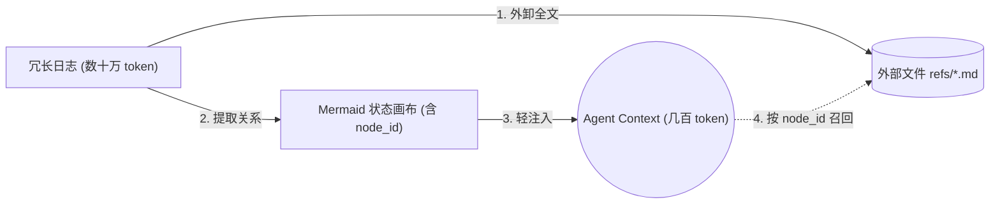

*by Mycelium Protocol*

---

AI Agent 记忆系统的主流做法是把所有历史塞进向量库，检索时做相似度搜索。这个方案的问题是：检索是无方向的碎片堆砌，没有宏观结构，越用越慢，越用越贵。

TencentDB Agent Memory 的团队选择了两个不同的方向：**符号化短期记忆** 和 **分层长期记忆**。

GitHub: https://github.com/TencentCloud/TencentDB-Agent-Memory | ⭐ 17,960 | TypeScript

---

## 核心指标

集成 OpenClaw 后，在连续长会话测试中的结果（非孤立对话轮次）：

| 能力 | 基准 | 接入前 | 接入后 | 提升 |
|------|------|--------|--------|------|
| **短期记忆** - WideSearch 成功率 | - | 33% | **50%** | +51.52% |
| **短期记忆** - WideSearch token | - | 221.31M | **85.64M** | −61.38% |
| **短期记忆** - SWE-bench 成功率 | 50 连续任务/session | 58.4% | **64.2%** | +9.93% |
| **长期记忆** - PersonaMem 准确率 | - | 48% | **76%** | +59% |

---

## 符号短期记忆：用 Mermaid 图替代 verbose 日志

长任务中 token 消耗最大的来源是中间过程的冗长日志（搜索结果、代码、错误堆栈）。传统方案要么堆满 context，要么做不可逆的截断摘要。

TencentDB Agent Memory 的做法：



- **上下文外卸**：完整工具日志存到外部文件 `refs/*.md`
- **Mermaid 状态图**：任务状态用高密度 Mermaid 语法编码，LLM 能解析，人也能读
- **node_id 溯源**：Agent 在符号图上推理，需要细节时用 `node_id` 直接拉取原始文本
- **无损可回溯**：压缩不是丢弃，每一层都保留完整的下钻路径

---

## 分层长期记忆：L0 → L3 语义金字塔

传统平铺向量库在语义金字塔的问题：碎片没有方向，每次检索都是全局盲搜。

TencentDB Agent Memory 的四层结构：

| 层级 | 名称 | 内容 | 存储形式 |
|------|------|------|----------|
| **L0** | Conversation | 原始对话记录 | 数据库（全文检索）|
| **L1** | Atom | 原子事实提取 | 数据库（精确检索）|
| **L2** | Scenario | 场景块（工作流 SOP）| 数据库 + Markdown |
| **L3** | Persona | 用户画像和偏好 | Markdown（高密度）|

日常对话只读取 L3 Persona（几百 token），需要细节时逐层向下钻取，完全不必要的信息不进 context。技能生成同样走这条路：从 L0 执行轨迹 → 提炼 L2 通用解法模式 → 生成 L3 可复用技能或 SOP。

---

## 快速接入

**OpenClaw：**

```bash
openclaw plugins install @tencentdb-agent-memory/memory-tencentdb
openclaw gateway restart
```

升级：

```bash
openclaw plugins update @tencentdb-agent-memory/memory-tencentdb
```

**Hermes Gateway**：参考仓库文档中的 Hermes 集成说明，同样是插件式接入。

接入后零配置启用，系统自动开始积累记忆；可以在 `~/.tencentdb-agent-memory/` 查看和管理记忆文件。

---

## 设计理念

> **Memory is not about hoarding everything in the AI — it is about sparing humans from having to repeat themselves.**

现实中，我们一遍遍向 Agent 重新解释同样的 SOP、项目背景、工具惯例和输出格式。TencentDB Agent Memory 的目标是让 Agent 学会工作流，保留任务上下文，复用历史经验——既不强行堆满 context，也不做不可逆的有损压缩。

---

*Mycelium Protocol — 追踪 AI 系统的底层演化*

---

> **关于 Mycelium**
>
> 菌丝协议。持续追踪 AI 工具、系统和实验的内容节点。

---

<!--EN-->

## TencentDB Agent Memory: TencentCloud's Team-Level Agent Memory System

*by Mycelium Protocol*

---

The mainstream approach to AI agent memory is to push all history into a vector store and run similarity search at retrieval time. The problem: retrieval is a directionless fragment pile — no macro structure, getting slower and more expensive with use.

TencentDB Agent Memory's team chose two different directions: **symbolic short-term memory** and **layered long-term memory**.

GitHub: https://github.com/TencentCloud/TencentDB-Agent-Memory | ⭐ 17,960 | TypeScript

---

### Core Metrics

Results measured over continuous long-horizon sessions (not isolated turns) after OpenClaw integration:

| Capability | Before | After | Δ |
|-----------|--------|-------|---|
| WideSearch task success rate | 33% | **50%** | +51.52% |
| WideSearch token usage | 221.31M | **85.64M** | −61.38% |
| SWE-bench success (50 tasks/session) | 58.4% | **64.2%** | +9.93% |
| PersonaMem accuracy | 48% | **76%** | +59% |

---

### Symbolic Short-Term Memory: Mermaid Canvas over Verbose Logs

The largest token consumer in long tasks is verbose intermediate logs (search results, code, error traces). Traditional approaches either overflow context or make irreversible lossy summaries.

TencentDB Agent Memory's approach:

1. **History offloading**: full tool logs written to external files (`refs/*.md`)
2. **Mermaid state canvas**: task state encoded in compact Mermaid syntax — LLM-parseable and human-readable
3. **`node_id` tracing**: agent reasons over the symbol graph; to verify a detail, greps for the `node_id` and retrieves the full raw text
4. **Lossless recoverability**: compression is not deletion — every layer preserves a complete drill-down path

---

### Layered Long-Term Memory: L0–L3 Semantic Pyramid

| Layer | Name | Content | Storage |
|-------|------|---------|---------|
| **L0** | Conversation | Raw dialogue | Database (full-text search) |
| **L1** | Atom | Atomic facts | Database (exact search) |
| **L2** | Scenario | Scene blocks / SOPs | Database + Markdown |
| **L3** | Persona | User profile and preferences | Markdown (high density) |

Normal conversations only read L3 Persona (hundreds of tokens); details are retrieved by drilling down layer by layer. Only necessary information enters context. Skill generation follows the same path: L0 execution traces → L2 common solution patterns → L3 reusable skills or SOPs.

---

### Quick Start

**OpenClaw:**

```bash
openclaw plugins install @tencentdb-agent-memory/memory-tencentdb
openclaw gateway restart
```

**Hermes Gateway:** See the Hermes integration docs in the repository — same plugin-based approach.

Zero-config after install — the system starts accumulating memory automatically.

---

### Design Philosophy

> Memory is not about hoarding everything in the AI — it is about sparing humans from having to repeat themselves.

In practice, we constantly re-explain the same SOPs, project background, tool conventions, and output formats to agents. TencentDB Agent Memory's goal is to let agents learn workflows, retain task context, and reuse past experience — without brute-force context stuffing or irreversible lossy compression.

---

*Mycelium Protocol — tracking the deep evolution of AI systems*

© 2026 Mycelium Protocol. All rights reserved.
