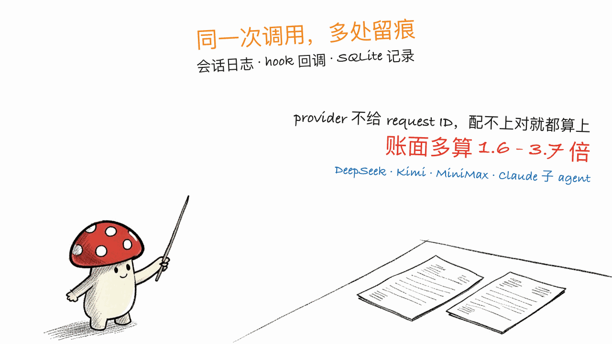
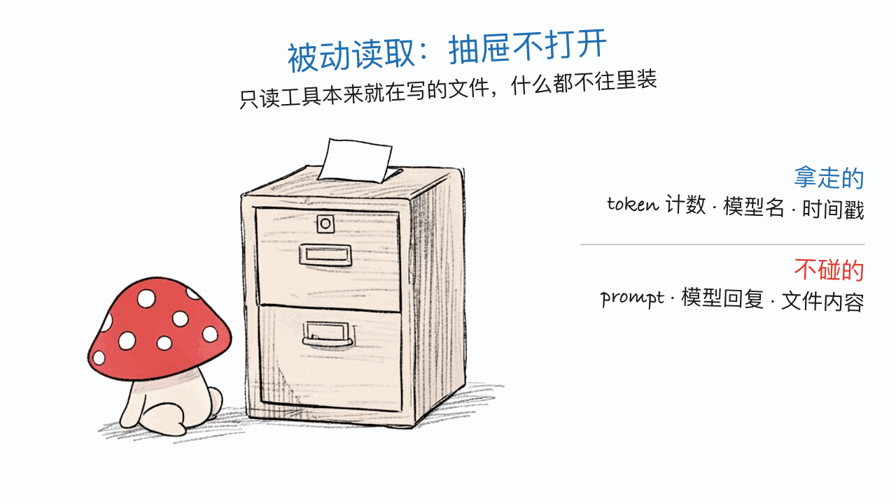

*by Mycelium Protocol*

---

项目地址：https://github.com/xiufengsun/TokenTracker
npm：https://www.npmjs.com/package/tokentracker-cli
隐私政策：https://github.com/xiufengsun/TokenTracker/blob/main/docs/PRIVACY.md
授权：MIT

---

## 一句话结论

**本站写过一串"怎么少花 token"的项目，但一直没写过"到底花了多少"这一侧——TokenTracker 补的是计量。** 而且它补得有价值：它指出基于 `reqId` 的去重（`ccusage` 那一类工具的做法）对**不返回 request ID 的 provider** 会超算 **1.6 到 3.7 倍**。也就是说不少人可能正拿着一个虚高的数字，在做本不必要的省钱决策。1522 stars、163 forks，MIT，v0.96.0（9 月 5 日），被阮一峰周刊 #393 收录。覆盖 36 个 AI 编程工具，数据落本地 SQLite。

## 先说那个数字

这是全篇最值得记住的一条：

> 基于 `reqId` 的去重，对省略了 request ID 的 provider（**DeepSeek / Kimi / MiniMax / Claude 子 agent**）会**超算 1.6–3.7 倍**。

原理不难：同一次调用可能在多个日志位置留下痕迹（会话 JSONL、hook 回调、SQLite 记录），要算准就必须识别出"这几条其实是同一次请求"。`reqId` 是最自然的键——但前提是 provider 得给你这个 ID。不给的时候，基于 reqId 的去重就退化成"没法配对，那就都算上"，于是同一次调用被计了两三遍。

Claude 子 agent 那一条尤其扎心：用 subagent 本来就是为了把活拆开并行，结果它可能让你的账面数字翻倍。



TokenTracker 改用**复合键**去重，声称总数能和各家 provider 自己的账单对得上。这个声称是可验证的——你自己的账单就在那儿，装上跑几天对一下就知道。

## 和本站省 token 系列的关系

本站这条线上已经有四篇，各自动的是不同的段：

| 项目 | 干什么 |
|---|---|
| **TokenTracker** | **计量**——先把花了多少算准 |
| tare | 压缩输入，无损为默认，不破前缀缓存 |
| OpenSquilla | 换路由，用更便宜的模型 |
| Reasonix | 保前缀缓存命中率 |
| Caveman | 压模型输出 |

顺序上，计量应该排在最前面。**降幅百分比是相对量，分母错了整个结论就错了**——如果你的基线本身多算了 2 倍，那么"省了 50%"很可能只是把虚高部分挤掉，真实开销一分没变。

## 三十秒装上

```bash
npx tokentracker-cli
```

就这一条。首次运行会自动装 hook、同步数据，然后在 `http://localhost:7680` 打开面板。要短命令的话装全局：

```bash
npm i -g tokentracker-cli

tokentracker                 # 打开面板
tokentracker sync            # 手动同步
tokentracker status          # 查各个集成的接入状态
tokentracker status --json   # 机器可读，可以喂给 jq 或让 agent 自己读
tokentracker doctor          # 健康检查
```

macOS 也能走 Homebrew（菜单栏 App 或纯 CLI 二选一）：

```bash
brew install --cask xiufengsun/tokentracker/tokentracker   # 菜单栏 App
brew install xiufengsun/tokentracker/tokentracker          # 只要 CLI
```

Linux 三种包都有（AppImage / `.deb` / `.rpm`）。**注意 Debian 12 上 `.deb` 装不了**——它依赖 `libappindicator3-1`，而 bookworm 已经改用 `libayatana-appindicator3-1`，`apt` 会拒绝，那儿得用 AppImage。GNOME 桌面的托盘图标还需要装 AppIndicator 扩展。要求 Node.js 20+。

## 36 个集成，绝大多数不往你工具里装东西

这是它工程上最讲究的地方。README 把每个工具**怎么接的**都列了出来，分成三类：

- **Hook 型**（Claude Code、Codex、Gemini CLI、Every Code、CodeBuddy、WorkBuddy、Grok Build）——往工具自己的配置里写一个 SessionEnd hook 或 TOML notify 项。
- **插件型**（OpenCode、OpenClaw）——插件随 npm 包发出来，用工具自己的 CLI 挂上去。
- **被动读取型**（其余绝大多数：Cursor、Kiro、Hermes、Kimi Code、Copilot、pi、Reasonix、Kilo、Roo Code、Zed Agent、Goose、Droid、ZCode、Qoder、LM Studio、Unsloth Studio、AnythingLLM Desktop、Claude Science、DeepSeek Harness……）——**什么都不往那些工具里装**，只读它们本来就在写的文件：SQLite 库、JSONL、OpenTelemetry 导出、会话日志。

被动读取那一类的描述写得非常细，细到能看出作者的克制。举几个原文里的例子：

- **Qoder**：读 assistant 的 `token_info`，区分缓存输入，**从不读取 prompt 或响应文本**。
- **LM Studio**：只读最终响应的 ID、模型、时间戳和标量 `usage` 计数器；镜像的响应 ID 会去重，**prompt 和响应正文一律不保留**。
- **Unsloth Studio**：只读 `contextUsage` 元数据和不含内容的 `api_usage_events`；prompt、回复、附件、API 主体、凭证、训练指标全部排除。
- **Prime Agent**：只读 usage / 模型 / provider / 时间戳，**never prompts or responses**。



还有几处是主动做减法而不是加法：**Mimo Code 只统计 mimo 原生的轮次**，镜像过来的 Claude 历史被排除；**ZCode 只算 Z.ai/BigModel 的 GLM 轮次**，捆绑的 Claude/Codex/Gemini 子 agent 被排除。这些都是为了不重复计数——和前面那个去重问题是同一个工程关切。

## 但它不是纯本地，这点必须说清楚

如果只讲上面那些，就成了一篇失实的隐私安利。README 的隐私章节自己写了两件会联网的事，我照抄：

1. **每天最多一次匿名心跳**——机器 id 的单向哈希，加上 App 版本、操作系统平台、App 外壳类型（cli / macos / windows / linux）作为独立的明文字段。
2. **匿名的面板浏览与功能事件**（PostHog，自动采集和会话录制已关闭，尊重浏览器 Do-Not-Track）。

明确不上报的：token 计数、模型名、prompt、路径。

**一个开关关掉两者**：

```bash
export TOKENTRACKER_NO_TELEMETRY=1    # 或者 DO_NOT_TRACK=1
```

作者还把可审计的文件路径直接写在 README 里（`src/lib/telemetry.js`、`dashboard/src/lib/analytics.js`、`src/lib/rollout.js`），意思是别信我说的，自己去看。这个态度比笼统写一句"隐私优先"强得多。

另外，**云端排行榜和跨设备同步都是 opt-in**，默认不开，默认体验完全离线。

## 一个反面对照：TRAE Work CN

这个集成值得单独拎出来，因为它展示了作者怎么处理"做不到纯本地"的情况：

> **需要显式 opt-in：设置 `TOKENTRACKER_TRAE_CN_USAGE=1`。** 读取用量会把本地存储的登录授权传给 TRAE 的内部 API，所以在你打开它之前什么都不会发送。

没有偷偷做，没有藏在"改善体验"的措辞里，而是默认关闭 + 讲清楚代价 + 提醒对方内部 API 可能变。**判断一个工具的隐私姿态，看它怎么处理做不干净的那部分，比看它宣传做得干净的部分更准。**

## 成本是怎么算出来的

2200+ 模型的定价来自 LiteLLM 的价格表（每天自动刷新），加上针对小众工具的人工覆盖（Kiro、Cursor Composer、Kimi、CodeBuddy hy3）。24 小时磁盘缓存加内置的离线快照，意味着**断网也能算出准确的美元数**。

诚实标注也在：厂商没有公布价格的模型（比如腾讯 hy3-preview），token 照常统计，但成本显示 0，等厂商公布费率。

还有 13 个 provider 的实时额度窗口（Claude / Codex / Cursor / Gemini / Kimi / Kiro / Grok / Copilot / Antigravity / ZCode / OpenCode Go / Qoder / Qoder CN），本地 provider 应用临时关闭时会用最后一次成功的缓存值兜底。

## 它是怎么跑的

```
AI 编程工具（36 个）
   ↓ hook 触发 / 被动扫描
TokenTracker
   ↓ 本地解析，按 30 分钟 UTC 分桶
本地 SQLite
   ↓
面板 · 菜单栏 App · 桌面小组件
   ⋯ 可选（默认关闭）：云端排行榜
```

**第 3 步是关键**：token 数在本地解析，**从来不涉及任何 prompt 或响应内容**。

## 现在能不能用？

能，装起来的成本几乎为零（一条 `npx`），风险也低——它是只读的统计工具，不介入你的调用链，坏了最多是数字不准，不会让 agent 跑不起来。这跟代理型工具（比如 tare）不是一个风险等级。

几个要留意的：

- **Node.js 20+**；Cursor 的 token 读取优先用系统的 `sqlite3` CLI，没有时回退到 `node:sqlite`。
- **Debian 12 用 AppImage**，`.deb` 装不上（上面说过的 appindicator 依赖问题）。
- **Grok Build 的成本是估算的**——当前本地遥测只暴露累计的 `totalTokens`，没有稳定的输入/输出/缓存拆分，作者写明了这是估算，等厂商给出每次调用的明细。
- README 里 desktop pet、15 条成就线、4 个桌面小组件这些游戏化功能占了不小篇幅。喜欢就用，但**别让它们干扰你对这个工具的判断**——它真正的价值在去重算准和隐私工程这两件事上。

## 一点判断

这类"统计仪表盘"通常没什么可写的，本站一般也不写。这个值得写，因为它把一个大家默认没问题的环节——**你以为你知道自己花了多少**——指出来是错的，而且给了具体的倍数和具体的成因（哪些 provider、为什么、怎么解）。

顺带它也提供了一个判断同类工具的方法：看它**怎么去重**。凡是宣传"支持 N 个工具"却不提去重口径的，多半没处理这个问题；而只要涉及子 agent、多 provider 或同时读多个日志源，不处理去重的数字就没法看。

---

> © 2026 Author: Mycelium Protocol. 本文采用 [CC BY 4.0](https://creativecommons.org/licenses/by/4.0/deed.zh) 授权——欢迎转载和引用，须注明作者姓名及原文链接，不得去除署名后以原创发布。

<!--EN-->

*by Mycelium Protocol*

---

Repository: https://github.com/xiufengsun/TokenTracker
npm: https://www.npmjs.com/package/tokentracker-cli
Privacy policy: https://github.com/xiufengsun/TokenTracker/blob/main/docs/PRIVACY.md
License: MIT

---

## TL;DR

**This blog has covered a string of "spend fewer tokens" projects but never the other side — how much you actually spent. TokenTracker fills that in**, and it fills it in usefully: it points out that `reqId`-based deduplication (what `ccusage` and similar tools do) **over-counts providers that omit a request ID by 1.6–3.7×**. Which means a fair number of people may be looking at an inflated number while making cost decisions they didn't need to make. 1,522 stars, 163 forks, MIT, v0.96.0 (Sep 5), featured in Ruan Yifeng's weekly #393. Covers 36 AI coding tools; data lands in a local SQLite file.

## Start with that number

The one thing worth remembering from this post:

> `reqId`-based dedup over-counts providers that omit a request ID (**DeepSeek / Kimi / MiniMax / Claude sub-agents**) by **1.6–3.7×**.

The mechanism isn't complicated: one call can leave traces in several places (session JSONL, hook callback, SQLite record), so getting the number right means recognizing that those entries are the *same* request. `reqId` is the natural key — as long as the provider gives you one. When it doesn't, reqId-based dedup degrades into "can't pair these, count them all," and one call gets tallied two or three times.

The Claude sub-agent case stings the most: you reach for subagents precisely to parallelize work, and it may double your apparent spend.


TokenTracker dedups on a **composite key** instead, and claims totals then match each provider's own billing dashboard. That claim is checkable — your bill is right there; install it, run a few days, and compare.

## Where it sits in our token-savings series

Four prior posts, each touching a different segment:

| Project | What it does |
|---|---|
| **TokenTracker** | **Accounting** — get the spend right first |
| tare | Compresses input, lossless by default, keeps the prefix cache intact |
| OpenSquilla | Reroutes to a cheaper model |
| Reasonix | Protects the prefix-cache hit rate |
| Caveman | Compresses the model's output |

Accounting belongs first in that order. **A percentage reduction is a relative quantity — get the denominator wrong and the whole conclusion is wrong.** If your baseline is inflated 2×, then "saved 50%" may just be squeezing out the phantom half while real spend hasn't moved at all.

## Thirty seconds to install

```bash
npx tokentracker-cli
```

That's the whole thing. First run installs hooks, syncs your data, and opens the dashboard at `http://localhost:7680`. Install globally for shorter commands:

```bash
npm i -g tokentracker-cli

tokentracker                 # open the dashboard
tokentracker sync            # manual sync
tokentracker status          # integration status
tokentracker status --json   # machine-readable; pipe to jq or let an agent read it
tokentracker doctor          # health check
```

macOS can go through Homebrew (menu-bar app or CLI only):

```bash
brew install --cask xiufengsun/tokentracker/tokentracker   # menu bar app
brew install xiufengsun/tokentracker/tokentracker          # CLI only
```

Linux ships all three package formats (AppImage / `.deb` / `.rpm`). **Note the `.deb` won't install on Debian 12** — it depends on `libappindicator3-1`, which bookworm replaced with `libayatana-appindicator3-1`, so `apt` refuses it; use the AppImage there. On GNOME the tray icon also needs the AppIndicator extension. Requires Node.js 20+.

## 36 integrations, most of which install nothing into your tools

This is the most considered part of the engineering. The README lists **how each tool is wired**, in three categories:

- **Hook-based** (Claude Code, Codex, Gemini CLI, Every Code, CodeBuddy, WorkBuddy, Grok Build) — writes a SessionEnd hook or TOML notify entry into the tool's own config.
- **Plugin-based** (OpenCode, OpenClaw) — plugins ship inside the npm package and are enabled through the tool's own CLI.
- **Passive readers** (most of the rest: Cursor, Kiro, Hermes, Kimi Code, Copilot, pi, Reasonix, Kilo, Roo Code, Zed Agent, Goose, Droid, ZCode, Qoder, LM Studio, Unsloth Studio, AnythingLLM Desktop, Claude Science, DeepSeek Harness…) — **installs nothing into those tools**, only reads files they already write: SQLite DBs, JSONL, OpenTelemetry exports, session logs.

The passive-reader descriptions are written with unusual restraint. Straight from the README:

- **Qoder**: reads the assistant's `token_info`, separates cached input, and **never reads prompt or response text**.
- **LM Studio**: reads only final-response IDs, models, timestamps, and scalar `usage` counters; mirrored response IDs are deduplicated and **prompt/response bodies are never retained**.
- **Unsloth Studio**: reads `contextUsage` metadata and content-free `api_usage_events` only; prompts, replies, attachments, API subjects, credentials, and training metrics are all excluded.
- **Prime Agent**: reads usage / model / provider / timestamp, **never prompts or responses**.


Several integrations also subtract rather than add: **Mimo Code counts only mimo-native turns**, excluding mirrored Claude history; **ZCode counts only Z.ai/BigModel GLM turns**, excluding bundled Claude/Codex/Gemini sub-agents. All of that serves the same concern as the dedup problem above — don't count anything twice.

## But it is not purely local, and that has to be said

Stopping at the section above would make this a factually wrong privacy endorsement. The README's own privacy section names two things that phone home; copied here:

1. **At most one anonymous daily heartbeat** — a one-way hash of the machine id, plus app version, OS platform, and app shell (cli / macos / windows / linux) as separate plain fields.
2. **Anonymous dashboard pageview and feature events** (PostHog, with autocapture and session recording disabled, honoring browser Do-Not-Track).

Explicitly never sent: token counts, model names, prompts, paths.

**One switch disables both**:

```bash
export TOKENTRACKER_NO_TELEMETRY=1    # or DO_NOT_TRACK=1
```

The author also puts the auditable file paths right in the README (`src/lib/telemetry.js`, `dashboard/src/lib/analytics.js`, `src/lib/rollout.js`) — meaning: don't take my word for it, go read them. That posture beats a blanket "privacy-first" claim by a wide margin.

The **cloud leaderboard and cross-device sync are both opt-in** as well; the default experience is fully offline.

## A useful counter-example: TRAE Work CN

This integration deserves its own mention, because it shows how the author handles a case that *can't* be kept purely local:

> **Requires an explicit opt-in: set `TOKENTRACKER_TRAE_CN_USAGE=1`.** Reading usage transmits the locally stored sign-in authorization to TRAE's internal API, so nothing is sent until you turn it on.

Not done quietly, not buried under "to improve your experience" — off by default, with the cost stated plainly and a warning that the internal API may change. **How a tool handles the part it can't keep clean tells you more about its privacy posture than the parts it advertises as clean.**

## How the cost figure is computed

Pricing for 2,200+ models comes from LiteLLM's price table (auto-refreshed daily), plus curated overrides for niche tools (Kiro, Cursor Composer, Kimi, CodeBuddy hy3). A 24-hour disk cache and a bundled offline snapshot mean **accurate USD figures even with no internet connection**.

The honest caveat is there too: models with no published vendor pricing (e.g. Tencent's hy3-preview) are tracked by tokens but show $0 cost until the vendor publishes a rate.

There are also live quota windows for 13 providers (Claude / Codex / Cursor / Gemini / Kimi / Kiro / Grok / Copilot / Antigravity / ZCode / OpenCode Go / Qoder / Qoder CN), falling back to the last good cached value when a local provider app is temporarily closed.

## How it runs

```
36 AI coding tools
   ↓ hooks fire / passive scan
TokenTracker
   ↓ parsed locally, bucketed into 30-minute UTC windows
local SQLite
   ↓
dashboard · menu bar app · desktop widgets
   ⋯ optional (off by default): cloud leaderboard
```

**Step three is the point**: token counts are parsed locally and **no prompt or response content is ever involved**.

## Can you use it today?

Yes, and the cost of trying is near zero (one `npx`). The risk is low too — it's a read-only accounting tool that doesn't sit in your call path, so the worst failure is wrong numbers, not a broken agent. That's a different risk class from proxy-shaped tools like tare.

Things to watch:

- **Node.js 20+**; Cursor token reading prefers the system `sqlite3` CLI and falls back to `node:sqlite`.
- **Use the AppImage on Debian 12** — the `.deb` won't install (the appindicator dependency above).
- **Grok Build cost is an estimate** — current local telemetry exposes only a cumulative `totalTokens` with no stable prompt/output/cache split; the author says so plainly and is waiting on per-call detail.
- The desktop pet, 15 achievement tracks, and 4 widgets take up a lot of README real estate. Enjoy them if you like, but **don't let them shape your judgment of the tool** — its real value is the dedup accuracy and the privacy engineering.

## A closing judgment

Dashboards like this usually aren't worth a post, and normally we'd skip one. This one earns it because it identifies an error in a step everyone assumes is fine — **you think you know what you spent** — and backs it with a specific multiple and a specific cause (which providers, why, and how it's fixed).

It also hands you a way to evaluate anything in this category: **look at how it deduplicates.** A tool advertising "supports N tools" without stating its dedup basis probably hasn't confronted the problem, and once sub-agents, multiple providers, or several log sources are involved, undeduplicated numbers aren't worth reading.

---

> © 2026 Author: Mycelium Protocol. Licensed under [CC BY 4.0](https://creativecommons.org/licenses/by/4.0/) — free to share and adapt with attribution. You must credit the author and link to the original; removing attribution and republishing as original is not permitted.
