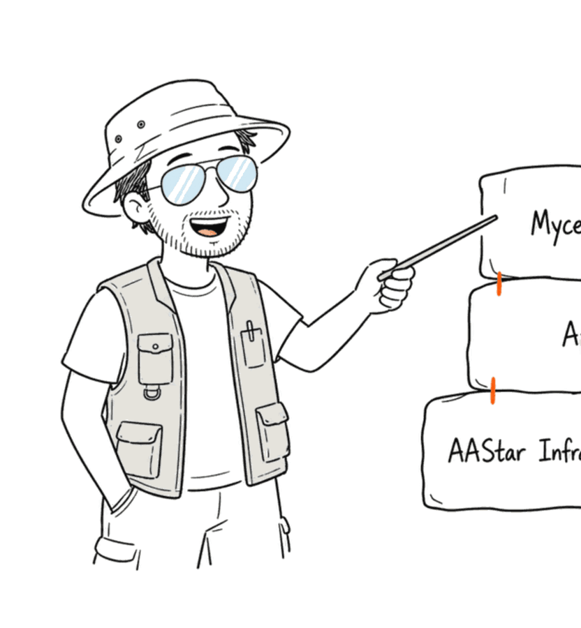
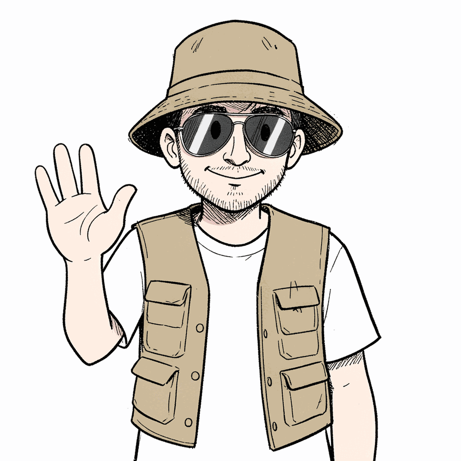
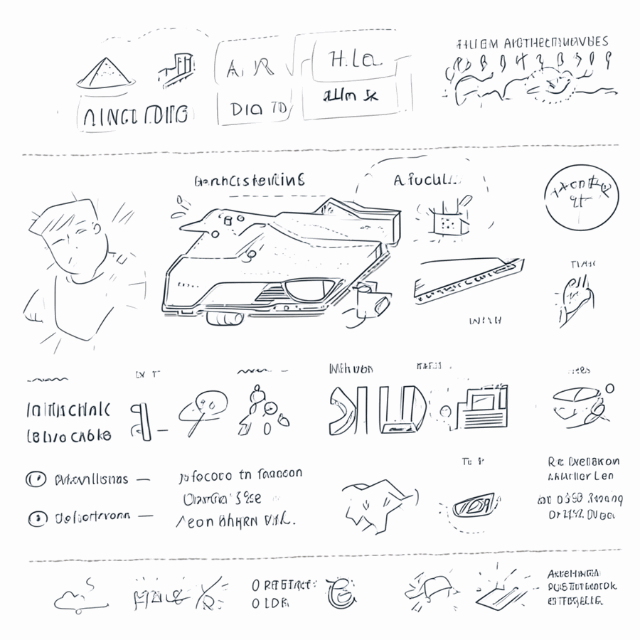
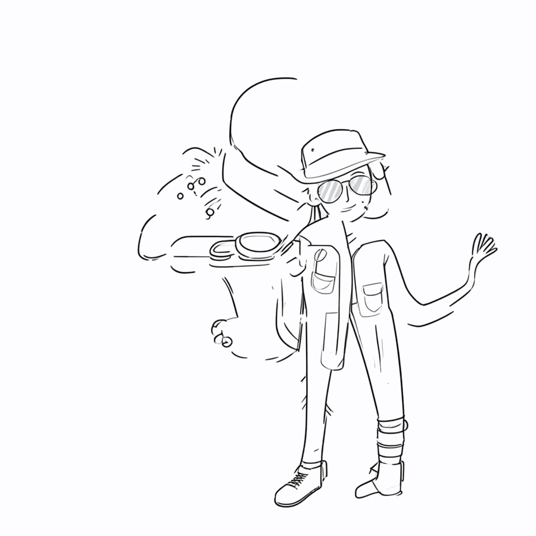
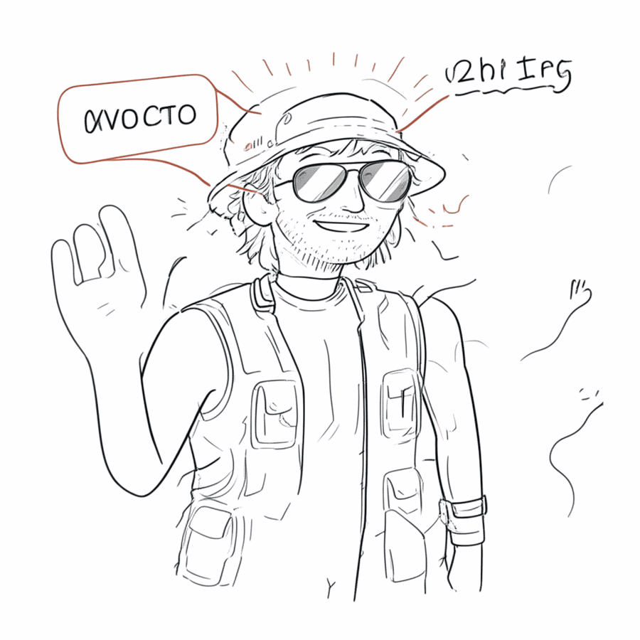
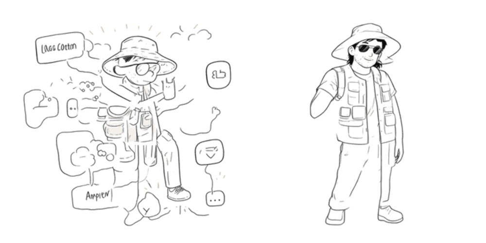
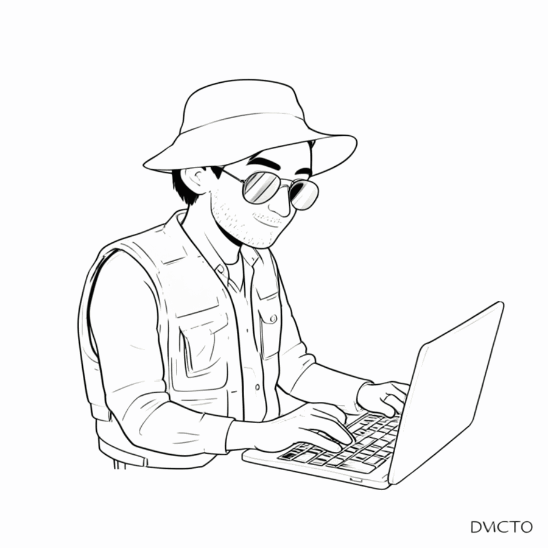
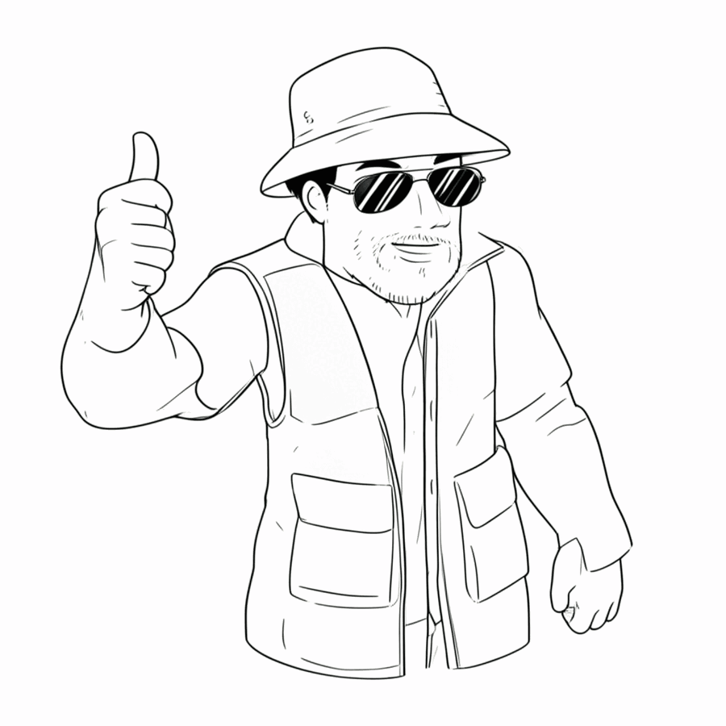
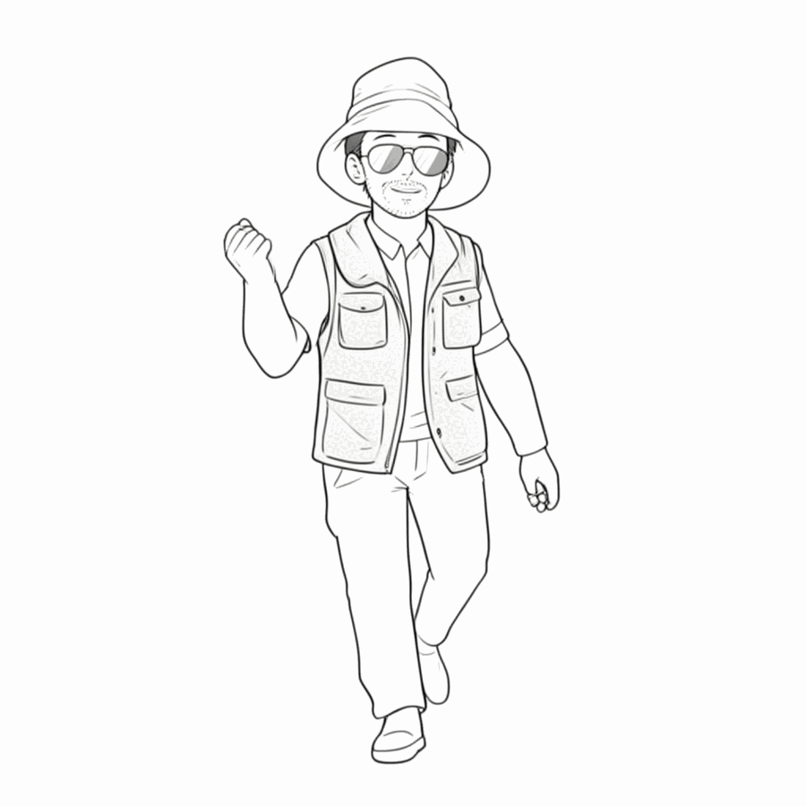

> **BLUF**：我们给一个卡通 IP 角色「David」训练了一个本地 **LoRA**，让 AI 出图时每次都画出同一个人。这篇用人话讲清楚训练到底在干嘛：**它不是在帮你"找到一句完美的咒语（prompt）"，而是在反复看你给的样本、一点点修改模型自己的"脑子"（权重），直到它把"David 长什么样"记进肌肉记忆。** 全程跑在一台 Mac 上（Apple Silicon + 本地 FLUX.2），不花一分钱云端费用。下面有真实的训练演变图——你能亲眼看到模型从"乱画"到"学会"的过程。

---

## 一、先说痛点：AI 画画「记不住脸」

我们在做一个漫画风的产品讲解站，需要同一个卡通角色（戴渔夫帽、墨镜、多口袋马甲、留点胡茬的「David」）出现在十几张图里。

问题来了：**用 prompt（文字描述）让 AI 画，它每次画的脸都不一样。** 你写得再细——"渔夫帽、墨镜、马甲、胡茬"——它也只是按描述"现编"一个人，这张图和那张图根本不是同一张脸。因为通用大模型**没有"角色记忆"**，它不知道"David"是谁。

这就是 **LoRA** 要解决的事。

---

## 二、LoRA 是什么？用大白话讲

把通用大模型想象成一个**画功极好、但谁都不认识的画师**。你说"画个戴帽子的人"，他画得很好，但画的是随便一个人。

**LoRA 训练 = 给这个画师看几张「David」的画，让他把「David 长什么样」记下来。** 记完之后，你只要说出暗号词（我们用 `dvdcto`），他就能在任何新姿势、新场景里，画出**同一个 David**。

技术上，LoRA 不会去改动那个庞大的画师本体（那要几十 GB、改起来又慢又危险），而是**外挂一小片可训练的"便签"权重**（这次只有几 MB）。出图时把这片便签贴上去，画师就"认得 David"了；不贴，他还是那个谁都不认识的通用画师。这就是 LoRA 名字的来历——**L**ow-**R**ank **A**daptation，低秩适配，"低秩"约等于"那片便签很小"。

---

## 三、训练过程到底在干嘛？（重点：纠正一个常见误解）

很多人——包括一开始的我——会这样理解训练：

> "训练就是让模型反复生成我指定 prompt 的图片，当它生成的跟样本不一致时就纠正它，一直训练到它能画对为止。"

**这个理解抓住了「反复 + 纠正」的精神，方向是对的，但有三个关键点需要修正：**

### 修正 1：它不是「生成整张图再和样本比对」

真实的训练循环更聪明，是这样一个"填空游戏"：

1. 拿出一张你的 David 样本图；
2. **故意往这张图上泼随机噪点**，把它弄花（弄到不同程度）；
3. 让模型猜："我刚才泼上去的噪点长什么样？"——也就是让它**把图还原回去**；
4. 拿它的猜测和"真实噪点"对比，算出**差多少**（这个差距叫 **loss / 损失**）；
5. 按这个差距，**反向把模型的权重微调一点点**，让它下次猜得更准。

把这个"泼噪点→猜还原→对比→微调"重复成千上万次，模型就在"如何把 David 从一团噪点里还原出来"这件事上越来越熟——**等于它把 David 的样子学进去了**。这套机制叫**扩散模型（diffusion）**，它本质上是个"去噪高手"，而不是"对着样本临摹"。

### 修正 2：我们改的不是「prompt」，是「模型的脑子」

你的理解里有句"一直训练到找到这个 prompt 为止"。这里是最大的一个误区：

**prompt 是我们自己写死的、固定不变的**（就是那句 `dvdcto, 漫画风, 渔夫帽, 墨镜, 马甲...`）。训练**从头到尾不改 prompt**。

真正在变的，是**模型的权重**（那片 LoRA 便签）。训练的目标是让模型建立一条关联：**「看到暗号词 `dvdcto` ＋ 这种画风」➜「就该画出 David 这张脸」**。所以训练不是"找咒语"，而是"**把咒语和那张脸焊死在模型脑子里**"。

### 修正 3：「纠正」是自动的数学，不是我们手动挑错

我们并不需要盯着每张图说"这张不对、那张不对"。第 4、5 步的"算差距、微调权重"是**全自动的**（梯度下降）。我们人类要做的只有两件事：**(1) 准备好干净、统一画风的样本；(2) 偶尔瞄一眼中途的预览图，看它学歪没有。**

---

## 四、看图说话：模型从「乱画」到「学会」

训练时每隔 20 轮（epoch），系统会用我们的验证 prompt 出一张预览图，让我们偷看进度。把这几张排起来，就是一部"AI 学画 David"的延时摄影：

**训练样本（我们喂给它的）：** 从产品站已有的漫画面板里裁出来的 David，统一线稿风。



**第 0 轮（还没开始学）：** 这是基础模型的"出厂水平"。它能按 prompt 画出一个戴帽子墨镜马甲的人，但这是它"现编"的脸，**不是我们的 David**。



**第 40 轮（学得正乱）：** 中途会经历"阵痛期"——画面一度乱成涂鸦。这是正常的，模型正在剧烈调整，还没找到稳定的表达。**这时候千万别以为训练失败了。**



**第 80 轮（轮廓出来了）：** 线稿风的人物站出来了，渔夫帽、墨镜、马甲的"配方"开始稳定，只是姿势比例还歪。



**第 140 轮（认得 David 了）：** 漫画线稿风、渔夫帽、墨镜、马甲、淡胡茬、挥手——**这就是我们的 David**，而且是个全新的姿势（训练样本里没有这张）。模型学会了"举一反三"地画同一个人。



> 图里那些歪歪扭扭的"文字"是扩散模型的老毛病（它不会写字）。这不影响——我们最终出图的流水线里，**文字是另外用代码精确叠上去的**，不靠模型画。

---

## 五、怎么做的（给想复现的人）

工具链全部本地、开源：

| 环节 | 用什么 |
|------|--------|
| 训练框架 | [`mflux`](https://github.com/filipstrand/mflux)（MLX，专为 Apple Silicon） |
| 基础模型 | FLUX.2-klein-4B（本地 4-bit 权重，**不用再下 15GB**） |
| 数据集 | 6 张统一漫画风的 David + 每张一句描述 + 一个验证 prompt |
| 配置 | rank-16 LoRA，60 epoch × 6 图 = 360 次迭代 |
| 机器 | 一台 Apple Silicon Mac；约 35–50 秒/迭代，总计数小时 |

核心就三步：

1. **备数据**：`data/` 里每张图配一个同名 `.txt` 描述。**画风必须统一**——我们第一次误用了"精致写实"的图，LoRA 就学成了写实风；换成漫画线稿才对。描述里用一个独特暗号词（`dvdcto`）绑定角色。
2. **写配置 + 跑**：`mflux-train --config config.json`。
3. **用**：出图时挂上训出来的 LoRA + 暗号词，就能复现角色。

> 踩坑提醒：`mflux-train` **只读配置文件、忽略命令行的模型参数**。配置里 `model` 要写模型名（`flux2-klein-4b`，它据此判断架构），本地权重单独用 `model_path` 字段给——否则会误判成老架构直接报错，或者去重新下载 15GB。

---

## 六、为什么值得这么折腾？

因为它**反超了"花钱调云端大模型"的方案**，恰恰在最难的地方：

- **角色一致性**：通用大模型（包括付费的 gpt-image）根本没有角色记忆，你只能靠 prompt 碰运气；LoRA 是把角色焊进权重，**稳**。
- **成本**：训练和出图全在本地，**零云端费用**，数据也不出本机。
- **可控**：暗号词 + LoRA 强度可调，想要几分像就几分像。

代价是要一次性准备数据 + 训练几小时。但训完之后，这个 David 就是你的了——**想让他摆什么姿势、进什么场景，都还是同一个他。**

再配上"AI 出无字画 + 代码精确叠字"的流水线，就得到一条**角色一致、文字精准、零成本**的本地漫画生产线。这正是数字公共物品该有的样子：**普通人用一台自己的电脑，就能稳定产出自己的角色内容，不依赖、不付费、不交数据给任何平台。**

---

## 七、附录：逐条命令复现（工程版）

> 本次实测环境：**Apple M1 Max / 64GB RAM / macOS / Python 3.12.13**；mflux 0.17.5、ImageMagick 7.1.2、基模 FLUX.2-klein-4B（4-bit MLX，约 4.3GB）。换一台干净 Mac 照着跑即可。

**步骤 0 · 系统依赖**

```bash
brew install imagemagick librsvg          # 裁图/压缩；rsvg 给后续叠字用
python3 -m venv ~/venvs/ml && source ~/venvs/ml/bin/activate
pip install --upgrade pip && pip install mflux   # 实测 0.17.5，含 mflux-train
```

**步骤 1 · 下基础模型（约 4.3GB，一次性）**

```bash
# 二选一：项目自带 mdt，或 huggingface 直拉
mdt download Runpod/FLUX.2-klein-4B-mflux-4bit
# 或
hf download Runpod/FLUX.2-klein-4B-mflux-4bit \
  --local-dir ~/.omlx/models/FLUX.2-klein-4B-mflux-4bit
```

**步骤 2 · 备数据集**（每张图配同名 `.txt`，触发词 `dvdcto` + 画风 + 姿势）

```bash
mkdir -p ~/lora-david/data && cd ~/lora-david
P=/path/to/comic/panels
# gravity West 裁掉右侧图解，只留角色，统一高 1024
magick "$P/arch-stack.png" -gravity West -crop "52%x100%+0+0" +repage -resize x1024 data/david-01.png
# …其余图同理（本次共 6 张）
base="dvdcto, a loose hand-drawn COMIC CARTOON man, simple ink line-art (not realistic), wide-brim bucket hat, mirrored aviator sunglasses, khaki utility vest, light stubble, white background"
printf '%s, pointing\n' "$base" > data/david-01.txt
printf '%s, waving hello\n' "$base" > data/preview.txt   # preview.txt 必需
```

**步骤 3 · 写 `config.json`（最易错两行）**

```jsonc
"model": "flux2-klein-4b",          // 写"名字"，据此判定 flux2 架构（不能写本地路径！）
"model_path": "/Users/<you>/.omlx/models/FLUX.2-klein-4B-mflux-4bit",  // 本地权重走这里
```
`lora_layers.targets` 抄 flux2 官方模板（rank 16）：
`cat "$(python3 -c 'import mflux,os;print(os.path.dirname(mflux.__file__))')/models/flux2/README.md"`

**步骤 4 · 训练**

```bash
cd ~/lora-david && source ~/venvs/ml/bin/activate
mflux-train --config config.json --dry-run        # 期望：✅ Training config validated.
mflux-train --config config.json | tee train.log  # 正式开训
```
迭代数 = `num_epochs(60) × 图数(6) = 360`；M1 Max 实测 ~35–65s/迭代、总计约 3–4 小时。产物：`train/preview/*.png`（每 20 epoch 预览）、`train/checkpoints/*.zip`（含 LoRA）。

**步骤 5 · 用 LoRA 出图**

```bash
mflux-generate-flux2 \
  --model ~/.omlx/models/FLUX.2-klein-4B-mflux-4bit --base-model flux2-klein-4b \
  --lora-paths ~/lora-david/train/<lora>.safetensors --lora-scales 1.0 \
  --steps 8 --guidance 1.0 --width 1280 --height 720 \
  --prompt "dvdcto, comic cartoon man, bucket hat, sunglasses, khaki vest, thumbs up, white background, no text" \
  --output /tmp/david.png
```

> **两个必踩的坑**：① `mflux-train` 只读 config、忽略命令行模型参数——`model` 必须写名字 `flux2-klein-4b`（写本地路径会报 `Flux1 not supported`），本地权重单独用 `model_path`；② `preview*.txt` 必需，否则报错。

---

## 八、训练结果——以及那次「翻车」教会我们的事

这事我们其实**练了两轮**，而第一轮的失败比成功更值得讲。

### 第一轮：翻车成了「怪物」

第一次训完（6 张图、60 轮），出图是个**怪物**：脸崩了，周围飘着一堆框框和乱码气泡。


*左：第一轮（第 360 轮）——过拟合 + 脏数据；右：第二轮（第 200 轮）——干净。*

两个病根，两个解法——**这就是小角色 LoRA 真正该上的全部优化**：

| 问题（一轮） | 为什么崩 | 解法（二轮） |
|---|---|---|
| **数据脏**：训练裁图里 David 旁边还带着图解框、箭头、文字、对话气泡 | 模型把这些**杂物**当成「David 的一部分」学了进去 → 出图满屏飘框 | **干净独立数据**：8 张 David 独处纯白底、无框无字。（用一轮的 LoRA 在低 `--lora-scales 0.7` + "isolated, no boxes" 提示下生成，再挑最干净的——自蒸馏清洗） |
| **过拟合**：6 张图训了 60 轮，最后一轮把噪声都背下来了 | 轮数越多≠越好；loss 在 0.20 停住，质量反而**变差** | **减到 25 轮、每 10 轮存档**，再**肉眼挑最佳 checkpoint**——不盲目用最后一轮 |

外加：caption 强调 `isolated on plain white background, no text`；出图用 `--lora-scales 0.8`（不是 1.0）避免带进残留杂物。

### 第二轮：同一个 David，全新姿势

第二轮（8 张干净图、25 轮、挑第 200 轮 checkpoint）的成果——用触发词 `dvdcto` 生成**训练集里没有的全新姿势**，稳定复现出**同一个干净一致的 David**：

| 「坐在笔记本前」 | 「竖大拇指」 | 「挥手走路」 |
|---|---|---|
|  |  |  |

干净、独立、每次都是同一个 David（渔夫帽+反光墨镜+多袋马甲+淡胡茬）。**角色一致性达成。**

**几条普适经验**：① 数据干净度压倒一切——裁图里残留一个框就能毁掉结果；② 几张图的小 LoRA 别过度训练；③ 存中间 checkpoint 并挑最佳，最后一轮往往过拟合；④ 它仍不会写字——这是设计如此，交给 **hybrid-panel** 用 SVG 精确叠字。

**全部开源**：两轮的训练脚本、配置、干净数据集、逐轮演变图、最终 LoRA 权重、新姿势成果、一轮 vs 二轮对比、完整文档，以及配套的 **hybrid-panel** 流水线，都已整理上传 GitHub：

> 🔗 **https://github.com/jhfnetboy/flux-character-lora-david**

照着仓库里的 `README.md` + `config.json` + `data/`，换一台干净的 Mac 也能复现整个过程。

---

> 📌 工具链（复制访问）：
> mflux — https://github.com/filipstrand/mflux
> FLUX.2 — https://github.com/black-forest-labs/flux
> 许可证：均为开源（mflux MIT / FLUX 见各自仓库）

---

> © 2026 作者：Mycelium Protocol。本文采用 [CC BY 4.0](https://creativecommons.org/licenses/by/4.0/) 许可——可自由分享与演绎，但须署名并链接原文；不得移除署名后作为原创再发布。

<!--EN-->

> **BLUF**: We trained a local **LoRA** for a cartoon IP character, "David," so the AI draws the same person every time. This post explains, in plain language, what training actually does: **it isn't "finding the perfect magic prompt" — it's repeatedly looking at your samples and nudging the model's own "brain" (its weights) bit by bit, until it commits "what David looks like" to muscle memory.** Everything runs on a single Mac (Apple Silicon + local FLUX.2) at zero cloud cost. Real training-progression images below — you can watch the model go from "scribbling" to "got it."

---

## 1. The pain: AI can't remember a face

We're building a comic-style explainer site that needs the same cartoon character — "David" (bucket hat, mirrored sunglasses, multi-pocket utility vest, light stubble) — across a dozen panels.

The problem: **describe him in a prompt and the AI draws a different face every single time.** No matter how precise the description, it just improvises *a* person matching the words; panel-to-panel it's not the same face. A general model has **no character memory** — it doesn't know who "David" is.

That's what a **LoRA** fixes.

---

## 2. What a LoRA is, in plain words

Picture the big general model as a **brilliant painter who happens to know no one**. Say "draw a person in a hat" and he nails it — but it's just some random person.

**Training a LoRA = showing that painter a few pictures of "David" so he memorizes what David looks like.** After that, say the codeword (we use `dvdcto`) and he'll draw the *same* David in any new pose or scene.

Technically, a LoRA doesn't touch the giant painter himself (tens of GB, slow and risky to edit) — it bolts on **a tiny trainable "sticky note" of weights** (just a few MB here). Apply the note at generation time and he recognizes David; remove it and he's the anonymous generalist again. Hence the name — **L**ow-**R**ank **A**daptation; "low rank" ≈ "the sticky note is small."

---

## 3. What is training actually doing? (Correcting a common misconception)

Many people — me included at first — picture training like this:

> "Training means making the model repeatedly generate my prompt's image, and whenever its output doesn't match the sample, we correct it, until it can draw it right."

**That captures the spirit (repeat + correct) and the direction is right, but three key points need fixing:**

### Fix 1: It's not "generate a whole image, then compare to the sample"

The real loop is a smarter "fill-in-the-blank" game:

1. Take one of your David sample images;
2. **Deliberately splash random noise onto it**, messing it up (to varying degrees);
3. Ask the model to guess: "what noise did I just add?" — i.e. **restore the image**;
4. Compare its guess to the true noise, measure **how far off** it is (this gap is the **loss**);
5. Based on that gap, **nudge the model's weights a little** so it guesses better next time.

Repeat "add noise → guess → compare → nudge" thousands of times, and the model gets very good at restoring David from a cloud of noise — **which means it has learned what David looks like**. This mechanism is the **diffusion model**: fundamentally a "denoising expert," not a "copy-the-sample" tracer.

### Fix 2: We don't change the "prompt" — we change the model's "brain"

Your mental model said "train until it finds this prompt." That's the biggest misconception:

**The prompt is fixed — we wrote it ourselves** (`dvdcto, comic style, bucket hat, sunglasses, vest...`). Training **never changes the prompt**.

What actually changes is the **model's weights** (the LoRA sticky note). The goal is to build one association: **"see the codeword `dvdcto` + this art style" ➜ "draw David's face."** So training isn't "finding an incantation" — it's **welding the incantation to that face inside the model's brain**.

### Fix 3: "Correcting" is automatic math, not us hand-picking mistakes

We don't sit there flagging "this one's wrong, that one's wrong." Steps 4–5 — measure the gap, nudge the weights — are **fully automatic** (gradient descent). The only human jobs are: **(1) prepare clean, style-consistent samples; (2) occasionally glance at a preview to check it isn't going off the rails.**

---

## 4. Show, don't tell: from "scribbling" to "got it"

Every 20 epochs, the system generates a preview from our validation prompt so we can peek. Lined up, they're a time-lapse of "AI learning to draw David":

**Training sample (what we feed it):** Davids cropped from our existing comic panels, consistent line-art style.


**Epoch 0 (hasn't learned yet):** The base model's out-of-the-box level. It can draw *a* person in hat/sunglasses/vest per the prompt, but it's an improvised face — **not our David**.


**Epoch 40 (mid-learning chaos):** There's a "rough patch" — the image briefly collapses into scribbles. This is normal; the model is adjusting violently and hasn't settled. **Don't assume it failed here.**


**Epoch 80 (the outline emerges):** A line-art figure stands up; the hat/sunglasses/vest "recipe" stabilizes, though pose and proportion are still off.


**Epoch 140 (recognizes David):** Comic line-art, bucket hat, sunglasses, vest, light stubble, waving — **that's our David**, in a brand-new pose (not in the training set). The model learned to draw the same person *generatively*.


> The wobbly "text" in the images is diffusion's chronic weakness (it can't spell). It doesn't matter — in our final pipeline, **text is overlaid precisely by code**, not drawn by the model.

---

## 5. How we did it (for those who want to reproduce)

The toolchain is entirely local and open-source:

| Step | Tool |
|------|------|
| Training framework | [`mflux`](https://github.com/filipstrand/mflux) (MLX, built for Apple Silicon) |
| Base model | FLUX.2-klein-4B (local 4-bit weights — **no 15GB re-download**) |
| Dataset | 6 style-consistent comic Davids + a caption each + one validation prompt |
| Config | rank-16 LoRA, 60 epochs × 6 images = 360 iterations |
| Machine | One Apple Silicon Mac; ~35–50s/iteration, a few hours total |

Three core steps:

1. **Prep data**: in `data/`, each image gets a same-named `.txt` caption. **Style must be consistent** — our first attempt used "polished realistic" images and the LoRA learned a realistic style; switching to comic line-art fixed it. Bind the character with a unique codeword (`dvdcto`).
2. **Write config + run**: `mflux-train --config config.json`.
3. **Use**: at generation time, attach the trained LoRA + codeword to reproduce the character.

> Gotcha: `mflux-train` **reads only the config file and ignores command-line model args.** In the config, `model` must be the model *name* (`flux2-klein-4b`, which it uses to detect the architecture); give the local weights separately via `model_path` — otherwise it misdetects the old architecture and errors out, or tries to re-download 15GB.

---

## 6. Why bother?

Because it **beats "paying to call a cloud model"** exactly where it's hardest:

- **Character consistency**: general models (including paid gpt-image) have no character memory — you're rolling dice with prompts. A LoRA welds the character into the weights. **Stable.**
- **Cost**: training and generation are fully local — **zero cloud fees**, and your data never leaves the machine.
- **Control**: codeword + adjustable LoRA strength — dial the resemblance up or down.

The cost is a one-time data prep + a few hours of training. But once done, this David is *yours* — **whatever pose or scene you want, it's still the same him.**

Pair it with the "AI draws textless art + code overlays exact text" pipeline and you get a **character-consistent, text-accurate, zero-cost** local comic line. This is what digital public goods should look like: **an ordinary person, on their own computer, reliably producing their own character content — beholden to no platform, paying nothing, handing over no data.**

---

## 7. Appendix: step-by-step reproducible commands (engineering)

> Tested on: **Apple M1 Max / 64GB RAM / macOS / Python 3.12.13**; mflux 0.17.5, ImageMagick 7.1.2, base model FLUX.2-klein-4B (4-bit MLX, ~4.3GB). Should run as-is on a clean Mac.

**Step 0 · System deps**

```bash
brew install imagemagick librsvg          # cropping/compositing; rsvg for later text overlay
python3 -m venv ~/venvs/ml && source ~/venvs/ml/bin/activate
pip install --upgrade pip && pip install mflux   # tested 0.17.5, includes mflux-train
```

**Step 1 · Download the base model (~4.3GB, one-time)**

```bash
# either the project's mdt, or huggingface directly
mdt download Runpod/FLUX.2-klein-4B-mflux-4bit
# or
hf download Runpod/FLUX.2-klein-4B-mflux-4bit \
  --local-dir ~/.omlx/models/FLUX.2-klein-4B-mflux-4bit
```

**Step 2 · Prepare the dataset** (each image gets a same-named `.txt`: trigger word `dvdcto` + style + pose)

```bash
mkdir -p ~/lora-david/data && cd ~/lora-david
P=/path/to/comic/panels
# gravity West crops off the right-side diagram, keeping only the character; uniform height 1024
magick "$P/arch-stack.png" -gravity West -crop "52%x100%+0+0" +repage -resize x1024 data/david-01.png
# …same for the rest (6 images total here)
base="dvdcto, a loose hand-drawn COMIC CARTOON man, simple ink line-art (not realistic), wide-brim bucket hat, mirrored aviator sunglasses, khaki utility vest, light stubble, white background"
printf '%s, pointing\n' "$base" > data/david-01.txt
printf '%s, waving hello\n' "$base" > data/preview.txt   # preview.txt is required
```

**Step 3 · Write `config.json` (the two error-prone lines)**

```jsonc
"model": "flux2-klein-4b",          // a NAME — used to detect the flux2 architecture (NOT a local path!)
"model_path": "/Users/<you>/.omlx/models/FLUX.2-klein-4B-mflux-4bit",  // local weights go here
```
Copy `lora_layers.targets` from the official flux2 template (rank 16):
`cat "$(python3 -c 'import mflux,os;print(os.path.dirname(mflux.__file__))')/models/flux2/README.md"`

**Step 4 · Train**

```bash
cd ~/lora-david && source ~/venvs/ml/bin/activate
mflux-train --config config.json --dry-run        # expect: ✅ Training config validated.
mflux-train --config config.json | tee train.log  # train for real
```
Iterations = `num_epochs(60) × images(6) = 360`; on M1 Max ~35–65s/iter, ~3–4 hours total. Artifacts: `train/preview/*.png` (a preview every 20 epochs), `train/checkpoints/*.zip` (contains the LoRA).

**Step 5 · Generate with the LoRA**

```bash
mflux-generate-flux2 \
  --model ~/.omlx/models/FLUX.2-klein-4B-mflux-4bit --base-model flux2-klein-4b \
  --lora-paths ~/lora-david/train/<lora>.safetensors --lora-scales 1.0 \
  --steps 8 --guidance 1.0 --width 1280 --height 720 \
  --prompt "dvdcto, comic cartoon man, bucket hat, sunglasses, khaki vest, thumbs up, white background, no text" \
  --output /tmp/david.png
```

> **Two must-hit gotchas**: ① `mflux-train` reads only the config and ignores command-line model args — `model` must be the name `flux2-klein-4b` (a local path errors with `Flux1 not supported`); give local weights via `model_path`. ② `preview*.txt` is required or it errors.

---

## 8. The result — and the lesson the failure taught us

We actually did this **twice**, and round 1's failure is more instructive than the success.

### Round 1: it produced a "monster"

The first run (6 images, 60 epochs) produced a **monster**: a distorted face surrounded by floating boxes and gibberish speech bubbles.


*Left: round 1 (epoch 360) — overfit + dirty data. Right: round 2 (epoch 200) — clean.*

Two root causes, two fixes — **all the optimizations that actually matter for a small character LoRA**:

| Problem (round 1) | Why it broke | Fix (round 2) |
|---|---|---|
| **Dirty data**: training crops still had diagram boxes, arrows, text, speech bubbles next to David | The LoRA learned the *clutter* as part of "David" → scattered boxes everywhere | **Clean, isolated data**: 8 Davids alone on plain white, no boxes/text. (Generated from the round-1 LoRA at low `--lora-scales 0.7` with an "isolated, no boxes" prompt, then hand-picked the cleanest — self-distillation cleanup.) |
| **Overfitting**: 6 images × 60 epochs; the last checkpoint memorized noise | More epochs ≠ better; loss plateaued at ~0.20 and quality *degraded* | **Fewer epochs (25), checkpoint every 10**, then **pick the best checkpoint by eye** — not blindly the last |

Plus: captions emphasize `isolated on plain white background, no text`; generate at `--lora-scales 0.8` (not 1.0) to avoid dragging in residual clutter.

### Round 2: same David, brand-new poses

Round 2 (8 clean images, 25 epochs, epoch-200 checkpoint) — with trigger word `dvdcto`, generating **poses that were not in the training set**, reliably reproduces the **same clean, consistent David**:

| "sitting at a laptop" | "thumbs up" | "waving, walking" |
|---|---|---|
|  |  |  |

Clean, isolated, the same David every time (bucket hat, mirrored sunglasses, multi-pocket vest, light stubble). **Character consistency achieved.**

**Takeaways for any small character LoRA**: (1) data cleanliness beats everything — one stray box in the crops poisons the result; (2) don't over-train a few-image LoRA; (3) save intermediate checkpoints and pick the best, the last is often overfit; (4) it still can't render text — by design, handled by **hybrid-panel** via SVG overlay.

**Fully open-source**: both rounds' training scripts, config, clean dataset, epoch-by-epoch progression, final LoRA weights, new-pose results, the round-1-vs-round-2 comparison, full docs, and the companion **hybrid-panel** pipeline are all on GitHub:

> 🔗 **https://github.com/jhfnetboy/flux-character-lora-david**

With the repo's `README.md` + `config.json` + `data/`, you can reproduce the whole process on a clean Mac.

---

> 📌 Toolchain (copy to visit):
> mflux — https://github.com/filipstrand/mflux
> FLUX.2 — https://github.com/black-forest-labs/flux
> License: open-source (mflux MIT / FLUX per its repo)

---

> © 2026 Author: Mycelium Protocol. Licensed under [CC BY 4.0](https://creativecommons.org/licenses/by/4.0/) — free to share and adapt with attribution. You must credit the author and link to the original; removing attribution and republishing as original is not permitted.
