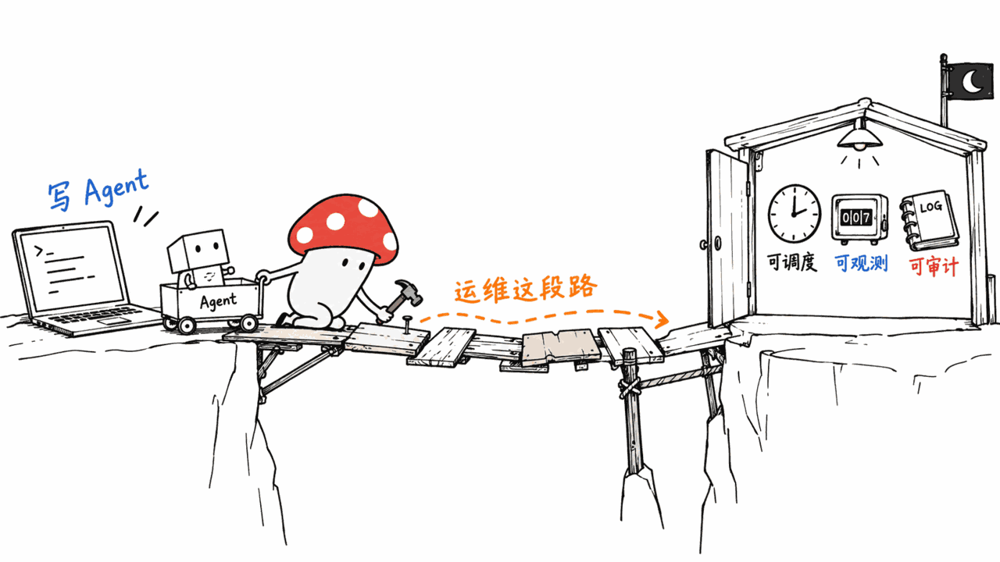
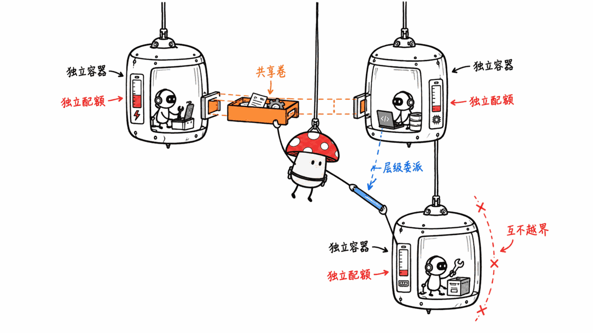
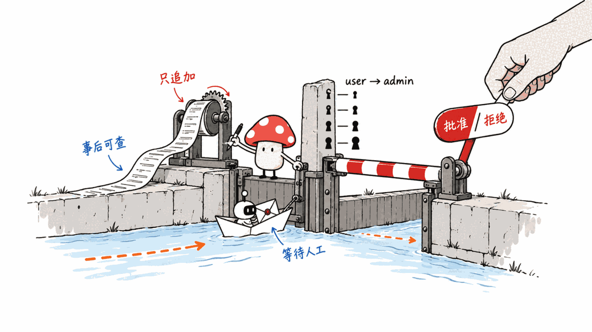
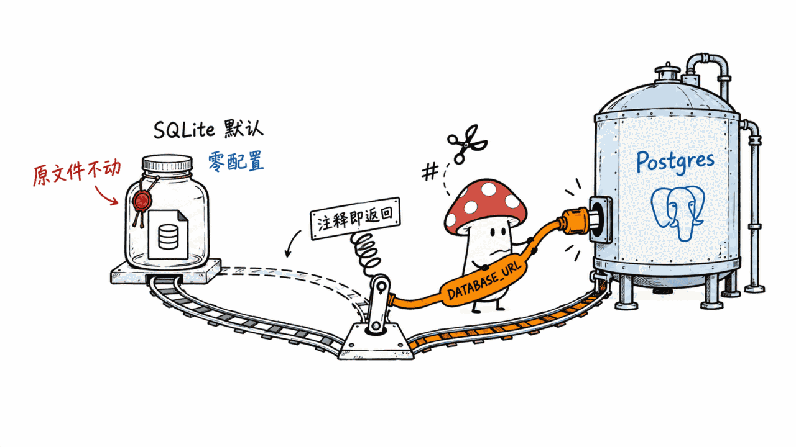

一句话就能说清 Trinity 想占的位置：**Claude Code 写 Agent，Trinity 跑它。**

你在笔记本上把 Agent 调通了，接下来的问题全是运维问题——谁能调它、它花了多少钱、它半夜自己干了什么、出事之后能不能查、它会不会把别的 Agent 的文件删了。这些问题跟"Agent 聪不聪明"完全无关，但它们才是从 demo 到生产之间的那段路。

Abilityai/trinity 把这段路做成了产品。

GitHub：https://github.com/Abilityai/trinity
协议：Apache-2.0｜语言：Python + Vue｜Stars：523｜Forks：89｜创建：2025-12-10｜最近提交：2026-09-09



## 它和「另一个 Agent 框架」的区别在哪？

本站已经写过一串自托管 Agent 运行时——Nerve（ClickHouse 官方，单进程零运维）、Wemux（控制面不碰你的代码）、OpenClaw Gateway（无人值守多 Agent 编排）、Maka、Argus。为什么还要看 Trinity？

因为它们各自解决的是不同的那一层。用 Trinity 自己 README 里的对照表最省事：

| 你在用… | 它擅长 | 什么时候该看 Trinity |
|---|---|---|
| **Claude Code** | 在笔记本上写 Agent、迭代 Agent | 你需要它跑在生产环境：多用户、有调度、被观测、被审计 |
| **OpenClaw / Hermes** | 一个你自己掌控的开放 Agent harness | 你想给它一个生产的家：每 Agent 隔离、调度、审计，而不用自己造平台 |
| **托管的 Agent 团队服务** | 开箱即用 | 你需要自托管、公司自治——你的基础设施、你的边界，不是 SaaS |

**Trinity 不跟 Agent 框架抢位置，它抢的是"框架下面那一层"。** 用本站的老比喻：Nerve 像树莓派上的单进程管家，Wemux 把执行放回你的 worker 机器，而 Trinity 更像一个**小型的 Kubernetes + 审计系统，只不过调度单位是 Agent 而不是 Pod**。

这个定位也决定了它的重量：Trinity 需要 Docker + Docker Compose v2，跑起来是 Vue 前端（80）+ FastAPI 后端（8000）+ MCP Server（8080）+ Scheduler（8001）+ Redis + 数据库 + 日志收集（8686）一整套。这不是"一个二进制跑起来"的路线。



## 隔离粒度：一个 Agent 一个容器

这是 Trinity 最硬的一条设计：**每个 Agent 跑在自己的 Docker 容器里，有独立的资源配额。**

配套的运行时控制项也是围着这个粒度设计的：

- **多 runtime 可选**：每个 Agent 单独选 Claude Code（Anthropic）、OpenAI Codex 或 Gemini CLI
- **模型可选**：每个任务或每条调度可以指定 Claude 的 Opus / Sonnet / Haiku
- **只读模式**：保护源码不被改，只允许往指定目录写输出
- **完整能力模式**：需要 `apt-get`、`sudo` 的 Agent 可以单独开权限
- **失控预防**：`max_turns` 参数限制执行深度
- **护栏（Guardrails）**：确定性的安全强制，可按 Agent 覆盖
- **持久异步积压队列**：超出并行容量的任务进 SQLite 支撑的 FIFO 队列，重启不丢

注意最后两条的性格——**它假设 Agent 会失控，然后从架构上防住**。`max_turns` 和护栏不是"提示词里写一句请不要"，是运行时的硬限制。

容器之间要协作时走三条通路：Agent 间的层级委派（带细粒度权限控制）、通过 Docker volume 共享的文件夹、以及无状态并行任务（orchestrator-worker 模式）。



## 治理和审计是怎么做的？

这是 Trinity 跟大多数开源 Agent 平台真正拉开距离的地方。

**四层 RBAC**：`user` < `operator` < `creator` < `admin`，首次登录时按白名单确定角色。

**只追加的平台审计日志**：跨切面记录生命周期、认证和 MCP 事件，仅管理员可读 API。"只追加"三个字是关键——它意味着这份日志的设计意图是**事后可查、不可篡改**，而不是方便调试的 log。

**Operator Queue（人在环）**：Agent 可以把审批和提问升级到 Operations 页面的操作员队列，人在 UI 里或通过 MCP 回答、批准或拒绝。这条把"自主"和"失控"之间划出了一条可操作的线。

**统一访问控制**：验证过的邮箱白名单管着 Web、Slack、Telegram 三个入口，每个 Agent 还能单独设 `require_email` / `open_access` 策略。

**OpenTelemetry 指标与追踪**：成本、token 用量、生产力数据可导出到 Grafana / Datadog，多 Agent 调用之间有分布式追踪。

再加一条外部验证：README 声明项目通过了 **UnderDefense 的独立渗透测试，评级 Grade A**。开源 Agent 平台里主动做第三方渗透测试的，不多。

## 一个人能装起来吗？

能，但要接受它的重量。

**先决条件**：Docker 和 Docker Compose v2+，加上一个 Anthropic API key（Claude 系 Agent）或 Google API key（Gemini 系 Agent）。

自己装的路径：

```bash
git clone https://github.com/abilityai/trinity.git
cd trinity

cp .env.example .env
# 只需要改一个：ADMIN_PASSWORD（12 位以上）
# SECRET_KEY、加密密钥、Redis 密码都由 start.sh 首次运行时生成

./scripts/deploy/build-base-image.sh
./scripts/deploy/start.sh
```

想完全无人值守，用 `./scripts/deploy/start.sh --unattended`（或设 `TRINITY_UNATTENDED=1`），连 `.env` 都不用编辑——管理员密码会自动生成并打印在最后的摘要里。

还有一条更省事的路子，很符合这个项目的调性：**让你的 Agent 装它**。README 提供了一份给 Agent 读的 runbook（`docs/AGENT_INSTALL_GUIDE.md`），是一个"验证 → 安装 → 确认 → 报告下一步"的确定性循环，你直接跟 Claude 说：

> Install Trinity on my computer. Follow the runbook at
> https://raw.githubusercontent.com/abilityai/trinity/main/docs/AGENT_INSTALL_GUIDE.md

装完的入口：Web UI 在 http://localhost，API 文档在 http://localhost:8000/docs，MCP Server 在 http://localhost:8080/mcp。



**数据库的选择很克制**：默认 SQLite，零配置，适合本地开发和评估（默认文件在 `/data/trinity.db`）。生产推荐 PostgreSQL——只需设一个 `DATABASE_URL`，后端和调度器一起切过去。

这里有个细节值得夸：**这个选择是非黏性、非破坏性的**。把 `DATABASE_URL` 注释掉，下次重启就回到 SQLite。已有实例迁移则由 Trinity Ops Agent 的 `/migrate-to-postgres` skill 处理——起一个平行的 Postgres 容器，复制并校验数据，短暂停机切换，**你的 SQLite 文件全程不被写**，所以回滚永远是一行的事。

按本站"个人可及"的判据（一个人能不能装能不能用，而不是有没有依赖）：需要 PostgreSQL 不算违背，需要运维团队才算。Trinity 的默认路径是 SQLite 零配置，**这条它是过的**。

## 多 Agent 系统怎么声明？

一份 YAML 部署一整套协同系统：

```yaml
name: content-production
description: Autonomous content pipeline

agents:
  orchestrator:
    template: github:abilityai/agent-corbin
    resources: {cpu: "2", memory: "4g"}
    folders: {expose: true, consume: true}
    schedules:
      - name: daily-review
        cron: "0 9 * * *"
        message: "Review today's content pipeline"

  writer:
    template: github:abilityai/agent-ruby
    folders: {expose: true, consume: true}

permissions:
  preset: full-mesh  # 所有 Agent 之间可通信
```

然后通过 MCP 工具 `deploy_system` 或 REST API `POST /api/systems/deploy` 部署。

调度侧走 cron + 专门的 scheduler 服务 + Redis 分布式锁（避免多实例重复触发），另有带 HMAC-SHA256 签名认证和限流的公开 webhook 触发 URL。

## 有意思的一条：x402 付费 Agent 访问

在一堆运维功能里，有一条容易被忽略但对本站生态特别相关：**Paid Agent Access (x402)** —— 通过 Nevermined 的 x402 支付协议，给单个 Agent 做变现。

x402 是把「按次付费」直接编码进 HTTP 402 状态码的支付协议。Trinity 把它做进了平台的"公开 Agent 链接"能力里：一个 Agent 可以对外开放，但访问要先付费。

这跟 Mycelium 生态里 Cos72 的 MyShop 用 x402 API 做社区积分兑换是同一条技术路线。**一个自托管的 Agent，能被外部按次调用并自动结算——这正是"意义经济"里"建设者获得回报"最直接的技术形态。** 值得单独跟进。

## 边界和代价

- **它很重。** Vue + FastAPI + MCP Server + Scheduler + Redis + DB + Vector 日志，七个服务起步。跟 Nerve"能跑在树莓派上"完全不是一个量级。
- **它高度绑定 Claude Code 工作流。** 大部分使用流程定义在单独的 `abilityai/abilities` 插件市场里（5 个插件：create-agent、agent-dev、trinity、dev-methodology、utilities），你得先装 Claude Code 插件才能用上完整的 scaffold → develop → deploy → iterate 生命周期。不用 Claude Code 也能用，但体验会缺一大块。
- **仓库里有私有子模块。** README 说明这些子模块是私有且可选的，克隆时会自动跳过、不需要凭据——但这也意味着**存在一个你看不到的企业版**。Apache-2.0 覆盖的是你能克隆到的那部分。
- **它有商业实体在后面。** ability.ai 提供托管实例和"跟工程师聊聊"的入口。开源部分是完整可自托管的，但要清楚这是"开源 + 商业"双生模型，不是纯社区项目。
- **v0.9.0 才发布于 2026-08-17。** 版本号还在 0.x，功能列表很长但成熟度需要自己验证。

## 我会怎么用它

我不打算拿它替换现在的本地 Agent 工作流——太重了。但有一个场景我确实缺：**跑长期的、定时的、需要留痕的 Agent 任务**。

比如本站的 forage 雷达每晚 21:10 由 cron 触发采集，之后的判断和调研靠会话里的我来做。如果要把这套东西做成"无人值守也能跑"，需要的恰恰是 Trinity 提供的那几样：定时触发、执行留痕、成本可见、失控可拦、结果要人批。

所以我的验证路径是：**先用 `--unattended` 起一个本地实例，把 forage 的采集脚本包成一个 Agent，看那份只追加审计日志到底记了什么。** 审计日志的信息量，是判断一个"可治理"平台是真的还是嘴上说说的最快办法。

---

> © 2026 Author: Mycelium Protocol. 本文采用 [CC BY 4.0](https://creativecommons.org/licenses/by/4.0/deed.zh) 授权——欢迎转载和引用，须注明作者姓名及原文链接，不得去除署名后以原创发布。

<!--EN-->

One sentence captures the position Trinity wants: **Claude Code writes the agent, Trinity runs it.**

You got an agent working on your laptop. Every question after that is an operations question — who may invoke it, how much it spent, what it did at 3 a.m. on its own, whether you can investigate afterward, whether it will delete another agent's files. None of that has anything to do with how smart the agent is, but it is exactly the stretch of road between a demo and production.

Abilityai/trinity turns that stretch into a product.

GitHub: https://github.com/Abilityai/trinity
License: Apache-2.0 | Language: Python + Vue | Stars: 523 | Forks: 89 | Created: 2025-12-10 | Last push: 2026-09-09


## How is this different from "yet another agent framework"?

This site has already covered a string of self-hosted agent runtimes — Nerve (ClickHouse official, single-process, zero-ops), Wemux (control plane never touches your code), OpenClaw Gateway (unattended multi-agent orchestration), Maka, Argus. So why look at Trinity?

Because each of them solves a different layer. Trinity's own README table is the shortest way to say it:

| You're using… | Great for | Reach for Trinity when… |
|---|---|---|
| **Claude Code** | Writing and iterating on an agent on your laptop | …you need it in production: multi-user, scheduled, observed, audited |
| **OpenClaw / Hermes** | An open agent harness you control | …you want a production home for it — per-agent isolation, scheduling and audit without building the platform yourself |
| **A managed hosted agent team** | Working out of the box | …you need it self-hosted and company-governed: your infra, your perimeter, not SaaS |

**Trinity is not competing with agent frameworks; it is competing for the layer beneath them.** In this site's usual metaphor: Nerve is a single-process butler on a Raspberry Pi, Wemux puts execution back on your own worker machines, and Trinity is closer to **a small Kubernetes plus an audit system, where the scheduling unit is an agent rather than a pod**.

That positioning also sets its weight. Trinity needs Docker and Docker Compose v2, and brings up a Vue frontend (80) + FastAPI backend (8000) + MCP server (8080) + scheduler (8001) + Redis + a database + log collection (8686). This is not the "one binary and go" route.


## Isolation granularity: one container per agent

This is Trinity's hardest design commitment: **each agent runs in its own Docker container with dedicated resources.**

The runtime controls are all designed around that granularity:

- **Multi-runtime, per agent**: choose Claude Code (Anthropic), OpenAI Codex, or Gemini CLI individually
- **Model selection**: pick Claude Opus / Sonnet / Haiku per task or per schedule
- **Read-only mode**: protect source from modification while allowing output to designated directories
- **Full capabilities mode**: optional elevated permissions for agents that need `apt-get` or `sudo`
- **Runaway prevention**: a `max_turns` parameter caps execution depth
- **Guardrails**: deterministic safety enforcement with per-agent overrides
- **Persistent async backlog**: a SQLite-backed FIFO queue for tasks beyond parallel capacity, surviving restarts

Note the personality of those last items — **it assumes agents will go off the rails, then stops them architecturally**. `max_turns` and guardrails are runtime limits, not a line in a prompt asking politely.

When containers need to cooperate, there are three paths: hierarchical agent-to-agent delegation with fine-grained permissions, shared folders over Docker volumes, and stateless parallel tasks for orchestrator-worker patterns.


## How is governance and audit handled?

This is where Trinity genuinely separates from most open-source agent platforms.

**Four-tier RBAC**: `user` < `operator` < `creator` < `admin`, with the role set from a whitelist on first login.

**An append-only platform audit log**: a cross-cutting trail of lifecycle, auth and MCP events, exposed through an admin-only API. "Append-only" is the operative phrase — it says the log is designed to be **investigable after the fact and resistant to tampering**, not to be convenient for debugging.

**Operator queue (human-in-the-loop)**: agents escalate approvals and questions to an operator queue on the Operations page; a human answers, approves or denies from the UI or over MCP. This draws an operable line between "autonomous" and "out of control."

**Unified access control**: a verified-email allow-list governs the web, Slack and Telegram entrances alike, with per-agent `require_email` / `open_access` policies.

**OpenTelemetry metrics and tracing**: cost, token usage and productivity data export to Grafana / Datadog, with distributed traces across multi-agent calls.

Plus one external validation: the README states the project passed an **independent penetration test by UnderDefense at Grade A**. Open-source agent platforms that voluntarily commission third-party pentests are rare.

## Can one person stand it up?

Yes — if you accept its weight.

**Prerequisites**: Docker and Docker Compose v2+, plus an Anthropic API key (Claude-powered agents) or a Google API key (Gemini-powered agents).

The manual path:

```bash
git clone https://github.com/abilityai/trinity.git
cd trinity

cp .env.example .env
# The only required edit: ADMIN_PASSWORD (12+ characters)
# start.sh generates SECRET_KEY, encryption keys and Redis passwords on first run

./scripts/deploy/build-base-image.sh
./scripts/deploy/start.sh
```

For a fully non-interactive bring-up, run `./scripts/deploy/start.sh --unattended` (or set `TRINITY_UNATTENDED=1`) and skip the `.env` edit entirely — an admin password is generated and printed in the final summary.

There is also a route very much in keeping with this project's character: **let your agent install it.** The README ships a runbook written for agents (`docs/AGENT_INSTALL_GUIDE.md`), a deterministic verify → install → confirm → report-next-steps loop. You just tell Claude:

> Install Trinity on my computer. Follow the runbook at
> https://raw.githubusercontent.com/abilityai/trinity/main/docs/AGENT_INSTALL_GUIDE.md

Once up: Web UI at http://localhost, API docs at http://localhost:8000/docs, MCP server at http://localhost:8080/mcp.


**The database choice is admirably restrained**: SQLite by default, zero-config, right for local development and evaluation (file at `/data/trinity.db`). PostgreSQL is recommended for production — set a single `DATABASE_URL` and both backend and scheduler switch over.

One detail deserves credit here: **the choice is non-sticky and non-destructive.** Comment `DATABASE_URL` out and the next restart is back on SQLite. Migrating an existing instance is handled by the Trinity Ops Agent's `/migrate-to-postgres` skill — it stands up a parallel Postgres container, copies and validates the data, then cuts over in a short downtime window, and **your SQLite file is never written**, so rollback is always one line.

By this site's "reachable by one person" criterion (can one person install and use it, not whether it has dependencies): requiring PostgreSQL is not a violation; requiring an ops team is. Trinity's default path is zero-config SQLite, so **it passes this one**.

## How do you declare a multi-agent system?

One YAML deploys a coordinated system:

```yaml
name: content-production
description: Autonomous content pipeline

agents:
  orchestrator:
    template: github:abilityai/agent-corbin
    resources: {cpu: "2", memory: "4g"}
    folders: {expose: true, consume: true}
    schedules:
      - name: daily-review
        cron: "0 9 * * *"
        message: "Review today's content pipeline"

  writer:
    template: github:abilityai/agent-ruby
    folders: {expose: true, consume: true}

permissions:
  preset: full-mesh  # All agents can communicate
```

Deploy it via the `deploy_system` MCP tool or the REST API at `POST /api/systems/deploy`.

Scheduling runs on cron with a dedicated scheduler service and Redis distributed locks (so multiple instances don't double-fire), plus public webhook trigger URLs with optional HMAC-SHA256 signature authentication and rate limiting.

## One interesting item: x402 paid agent access

Buried among the operations features is one that is easy to miss but especially relevant to this site's ecosystem: **Paid Agent Access (x402)** — per-agent monetization via the Nevermined x402 payment protocol.

x402 encodes pay-per-use directly into the HTTP 402 status code. Trinity wires it into its "public agent links" capability: an agent can be exposed publicly, but access requires payment first.

That is the same technical route Cos72's MyShop takes in the Mycelium ecosystem, using an x402 API for community-points redemption. **A self-hosted agent that outsiders can call per-use with automatic settlement is the most direct technical shape of "builders getting paid" in the meaning economy.** Worth following separately.

## Boundaries and costs

- **It is heavy.** Vue + FastAPI + MCP server + scheduler + Redis + DB + Vector logging — seven services to start. Not remotely the same league as Nerve's "runs on a Raspberry Pi."
- **It binds tightly to the Claude Code workflow.** Most usage flows live in a separate `abilityai/abilities` plugin marketplace (five plugins: create-agent, agent-dev, trinity, dev-methodology, utilities); you install Claude Code plugins to get the full scaffold → develop → deploy → iterate lifecycle. It works without Claude Code, but a large piece of the experience is missing.
- **The repo has private submodules.** The README says they are private and optional and get skipped without credentials — which also means **there is an enterprise edition you cannot see**. Apache-2.0 covers the part you can clone.
- **There is a commercial entity behind it.** ability.ai offers managed instances and a "talk to an engineer" path. The open-source part is fully self-hostable, but be clear this is an open-source-plus-commercial twin model, not a pure community project.
- **v0.9.0 only shipped on 2026-08-17.** Still 0.x. The feature list is long; maturity is yours to verify.

## How I would use it

I am not going to replace my current local agent workflow with it — too heavy. But there is one scenario I genuinely lack: **long-running, scheduled agent tasks that need a paper trail.**

For example, this site's forage radar fires at 21:10 nightly via cron to collect leads, after which the judgment and research happen in a session with me. To make that unattended, what you need is precisely what Trinity provides: scheduled triggers, execution traces, visible cost, runaway containment, and results a human signs off on.

So my verification path is: **bring up a local instance with `--unattended`, wrap the forage collection script as an agent, and read what that append-only audit log actually records.** The information content of the audit log is the fastest way to tell whether a "governable" platform means it or is just saying it.

---

> © 2026 Author: Mycelium Protocol. Licensed under [CC BY 4.0](https://creativecommons.org/licenses/by/4.0/) — free to share and adapt with attribution. You must credit the author and link to the original; removing attribution and republishing as original is not permitted.
