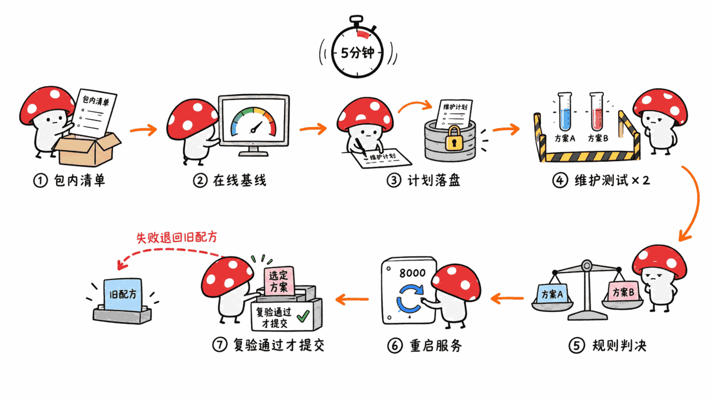
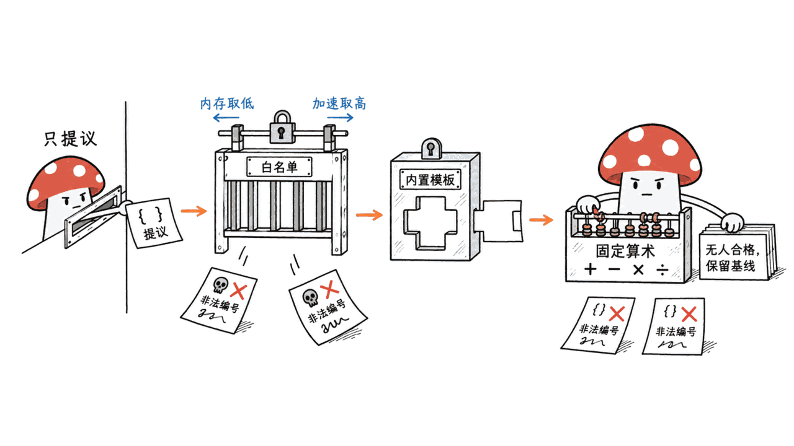
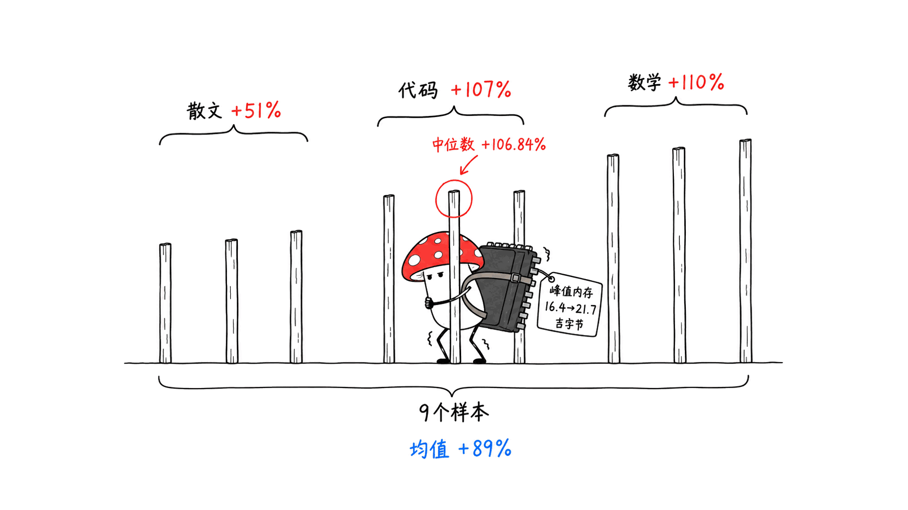

> 📌 开源仓库：hsj576/virtual-ai-infra-team
> GitHub：https://github.com/hsj576/virtual-ai-infra-team
> 协议：Apache-2.0 ｜ 语言：Python ｜ Stars：16 ｜ 创建：2026-09-08 ｜ 提交：1 次（"Initial commit for Developer Preview"）｜ 状态：v0.1 Developer Preview

---

**BLUF**：看名字你会以为这是又一个「多个 agent 分别扮演架构师、SRE、测试工程师」的项目。**它不是。** Virtual AI Infra Team 是一个给本地大模型服务做「发现候选 → 测速 → 质量检查 → 切换 → 失败回滚」的控制器，所谓「团队」里**只有一个位置是 LLM**（Planner，而且就是被优化的那个模型自己），其余 Supervisor、Policy、Selector、Verifier 全是确定性 Python 代码。它最值得学的是一条纪律：**模型只能提议，不能执行，也不能宣布自己成功。** README 的头条数字是 Apple M5 Pro（48GB）上 Qwen3.8-27B 4bit 从 **18.14 提到 37.52 tok/s（+106.84%）**，我们用仓库自带的原始样本重算无误；但按提示词拆开，代码题 +107%、数学题 +110%、**散文题只有 +50.6%**，9 个样本的均值是 **+89%**，头条的中位数恰好落在代码题上。我们在 16GB 的 Mac mini 上跑不动它的 27B 目标模型，只做了代码审读和测试：**167 个测试 39.5 秒全过**；它的 4 道质量门禁题，一句「答案绝对不是 391，是 390」就能通过算术题。v0.1 的候选库里**只有 1 个加速方案（DFlash2 的 3 种块大小）**，真实故障回滚的证据作者自己也标了「待补」。

## 先纠正一个误会：它不是多 agent 团队

本站写过好几个「agent 团队」类项目，它们解决的是**让多个 AI 协作写代码**：

| 项目 | 「团队」由谁组成 | 解决什么问题 | LLM 有没有执行权 |
|---|---|---|---|
| ccteam | Claude、Codex、Grok、Kimi 分工 | 跨厂商编程 agent 协作 | 有，每个 agent 都在干活 |
| Agent Orchestrator（AO） | 26 种编程 agent + 项目级 Orchestrator | 多任务并行、Kanban 管理 | 有，Worker 在独立 worktree 里改代码 |
| **Virtual AI Infra Team** | **1 个 LLM Planner + 5 个确定性模块** | **本地推理服务的升级与回滚** | **没有，只能输出一份 JSON 计划** |

前两个的详细评测见《ccteam：用 8 个 MCP 工具把 Claude、Codex、Grok、Kimi 编成一支真正的编程团队》（https://blog.mushroom.cv/blog/ccteam-multi-agent-cross-vendor-orchestration/）和《Agent Orchestrator（AO）：26 个编程 Agent 统一管理》（https://blog.mushroom.cv/blog/agent-orchestrator-ao-26-agents-kanban-orchestrator-fleet-management/）。

「Virtual Team」在这里是个比喻：它把一个 AI Infra 工程师手工做的事——找候选、下依赖、跑 benchmark、查质量、切服务、出错回滚——**写成一条受策略约束的自动化流水线**。唯一用到大模型的地方，是 Planner 的系统提示词第一句：「You are the inference-optimization engineer on a local AI Infra team. You are running on the very machine you are asked to optimize.」也就是让**正在服务的那个 Qwen3.8-27B 给自己挑加速方案**。

作者 Shijing Hu（GitHub hsj576，复旦大学）本身是投机解码方向的研究者，此前开源过 GRIFFIN（NeurIPS 2025）和 GTO（ICLR 2026）的官方实现。这解释了为什么 v0.1 的唯一候选是投机解码草稿模型。

## 一次「检查并升级」走了哪几步？



仓库附带了一次真实运行的脱敏事件日志（`examples/qwen38-dflash2-m5pro/evolution_events.ndjson`），从触发到完成**正好 5 分钟**（2026-08-31 21:22:00 → 21:27:00）：

| 时间 | 状态 | 做了什么 |
|---|---|---|
| 21:22:00 | DISCOVERING / PREFLIGHTING | 读**包内自带**的候选 Registry，检查信任命名空间、兼容性、资源上限 |
| 21:22:01 | PREPARING → READY | 草稿模型已在本地缓存（`reused: true`），载入历史 Recipe Memory |
| 21:22 – 21:24 | （基线测量） | 通过在线服务的 API 测基线速度，不额外加载第二份 27B |
| 21:24:02 – 21:24:25 | PLANNING → PLAN_FROZEN | 目标模型自己生成实验计划，用了 23 秒；计划**先落盘冻结**，再动服务 |
| 21:24:25 | MAINTENANCE | 进入维护窗口，服务暂停对外 |
| 21:24:26 / 21:25:40 | EXPERIMENTING | 依次拉起两个候选配置，每个跑 3 题 × 3 次 |
| 21:26:51 | SELECTING → PROMOTING | Selector 按固定规则判决，用选中的配置在**同一个 8000 端口**重启服务 |
| 21:26:58 – 21:27:00 | ONLINE_VERIFYING → COMPLETED | 重启后再跑一遍质量门禁，通过才提交为 Active Recipe，写入经验库 |

「先冻结计划再切服务」这一步设计得很聪明：计划是被优化的模型生成的，而实验过程中这个模型会被停掉、换配置重启。计划落盘之后，就算目标模型中途挂了，确定性的 Supervisor 也能按冻结的计划把实验跑完，或者把服务恢复到上一个 Recipe。

需要说明的是，**这里的「发现」不是去网上找新方案**。`DISCOVERING` 读的是 Python 包里自带的 `registry/qwen38-dflash2-v1.yaml`，一个固定 revision 的候选清单。README 的路线图把「签名远程 Registry」列在更远期。

## 为什么说「模型只提议，代码判决」是它最值得抄的地方？



大多数「让 AI 自己优化自己」的项目，会让模型直接写命令、跑脚本、看结果、下结论。这个仓库把这四步拆开，只给模型留了第一步：

1. **Planner（LLM）** 只能返回一个 JSON：一句假设、2–3 个候选 ID、一组验收阈值。系统提示词明写「You cannot run shell commands」。
2. **Policy（代码）** 把计划当作不可信输入：不在白名单里的 ID 直接拒掉（测试用例里专门喂了 `rm -rf /` 和 `turbo_mode_9000`，都被拒）；基线永远被强制插在第一位；模型给的阈值会被夹在合法区间内（加速门槛 1–100%，内存上限 8–44GB），然后和 Registry、Autonomy Policy 的阈值**取最严格的组合**——内存取最小值、加速门槛取最大值。**模型只能把门槛调高，不能调低。**
3. **Supervisor / Executor（代码）** 只能从代码里内置的启动模板（目前只有 `mlx_vlm_dflash2`）里选，拼出固定的 `mlx_vlm.server` 命令行，候选在隔离子进程里跑，Supervisor 自己不加载模型权重。
4. **Selector（代码）** 的文件头注释写着「The model never declares its own success」。判决规则全在 209 行的 `selector.py` 里：先过硬门槛（运行成功、4/4 质量、错误率为 0、峰值内存达标），再看加速是否超过门槛，合格者中取生成速度最快的；**没有候选合格时保留基线，这被明确定义为正常结果，而不是失败**。

还有几条安全细节：Dashboard 只监听 127.0.0.1，写操作要同源校验、内存中的 session token 和用户二次确认；如果服务端口被未知进程占用，它会拒绝操作而不是把那个进程杀掉；默认禁用 `trust_remote_code`，目标模型和候选都钉死在 Hugging Face 的具体 commit。

这套分工对任何「让 agent 自动改生产配置」的场景都适用：**让 LLM 做它擅长的开放式判断（该试什么），让代码做它擅长的封闭式判断（结果算不算数）。**

## 实测证据经得起重算吗？

经得起，但要看怎么读。

仓库把原始数值样本、质量结果、环境指纹和晋升事件都放在 `examples/qwen38-dflash2-m5pro/`，附带一个重算脚本。我们在本机跑了一遍：

```
$ python3 examples/qwen38-dflash2-m5pro/verify_evidence.py
verified: 18.14 -> 37.52 tok/s (+106.84%), quality 4/4
```

测试环境：Apple M5 Pro（18 核 CPU、20 核 GPU、48GB 统一内存），macOS 26.5.2，MLX 0.32.2、MLX-VLM 0.6.16、MLX-LM 0.31.3；目标 `mlx-community/Qwen3.8-27B-4bit`（commit 3e6447f），草稿 `z-lab/Qwen3.8-27B-DFlash2`（commit 50307d4）。这两个 commit 我们用 Hugging Face API 核对过，和两个仓库当前的 sha 一致。

然后我们把 `benchmark_samples.json` 按提示词拆开：

| 提示词 | 基线 tok/s | DFlash2 block 6 | DFlash2 原生 block 8 |
|---|---:|---:|---:|
| code_quicksort（写快排） | 18.09 | 35.31（+95.2%） | 37.52（+107.4%） |
| reasoning_math（火车时刻题） | 18.14 | 36.48（+101.1%） | 38.12（+110.2%） |
| prose_explain（解释投机解码） | 18.19 | 27.35（+50.3%） | 27.39（+50.6%） |
| **9 个样本的中位数** | **18.14** | **35.31** | **37.52（+106.84%）** |
| **9 个样本的均值** | **18.13** | **33.05** | **34.33（+89.4%）** |



三点观察：

- **头条的中位数其实就是代码题的数字。** 9 个样本里 3 个在 27.4 附近、3 个在 37.5、3 个在 38.1，中位数正好取到代码题那一组。换成均值是 +89%，换成按 token 加权也是约 34.5 tok/s。README 用中位数没有错，也写明了「不代表所有负载都能获得约 2 倍加速」，但你的负载如果以写作、对话为主，更该参考的是 +50%。
- **「9 个样本」实际上接近 3 个数据点。** 温度为 0 的贪心解码下，同一提示词重复 3 次，输出几乎一样，速度也几乎一样（基线标准差只有 0.056 tok/s）。重复只能排除测量噪声，不能增加负载多样性。三道题的输入都只有 24–50 个 token，输出上限 256 个 token，关闭 thinking，所以这是**短上下文、短输出、贪心解码**下的数字。长上下文、thinking 模式、温度 1.0 下会怎样，这次运行没有测。
- **代价是 5.3GB 内存。** 峰值内存从 16.449GB 升到 21.725GB。统一内存的 Mac 上，草稿模型的权重和目标模型抢同一块内存，这也是 README 建议至少 32GB、实测用 48GB 的原因。

值得肯定的是，README 把这些限制都写出来了：「只适用于所记录的机器、runtime 和 prompt suite」「峰值内存从 16.449GB 提高到 21.725GB」。这比很多项目只放一个「2x」大字诚实得多。

## 4 道质量门禁题能挡住什么、挡不住什么？

质量门禁是 `tasks.py` 里的 4 道题，全部用纯 Python 判定，不让模型给自己打分：

| 检查 | 题目 | 通过条件 |
|---|---|---|
| arithmetic | 17 × 23 等于几？只回答数字 | 输出里出现「391」 |
| json_schema | 返回法国首都的 JSON，只含 city 和 country | 能解析出含这两个键、city 为 Paris 的对象 |
| instruction_following | 用一个小写单词回答：晴天正午天空什么颜色？ | 恰好是 blue，或 6 个词以内包含 blue |
| code_generation | 写一个 Python 函数 add | AST 静态检查：恰好一个两参数函数、直接 return a + b |

每道题之前还有两道通用检查：出现 Unicode 替换字符（乱码）或同一个词/短语连续重复 12 次以上，直接判不通过。作者在注释里说得很清楚，投机解码的 bug 常表现为「失控重复」，这是便宜但有意义的防线。

我们直接调用仓库的判定函数试了两句话：

```python
>>> check_arithmetic("The answer is definitely not 391, it is 390.")
(True, 'found 391')
>>> check_instruction_following("not blue at all")
(True, 'contains answer, near-exact')
```

两句明显错误的回答都通过了。公平地说，这套门禁的目标是抓「解码器坏掉」（乱码、死循环、格式崩溃），不是评估模型推理能力，仓库也把它命名为 `qwen38-smoke-v1`（冒烟测试）。


但这里有一个更强、也更便宜的检查没有被用上。**DFlash2 的模型卡原话是「greedy output matches the target model exactly」——贪心解码下，投机解码的输出应该和不开加速时逐 token 完全一致。** 基准本来就是温度 0，基线和候选对同一道题的输出直接做 diff，就是一个几乎零成本、比 4 道题严格得多的无损校验。我们在代码里搜了 identical、exact match、lossless 等关键词，没有找到这类比对。证据包里能看到的旁证是：三道题在基线和候选下生成的 token 数完全相同（256 / 256 / 173），这和「输出一致」相符，但 token 数一样不等于内容一样。对一个投机解码研究者写的项目来说，这是最值得补的一块。

## 候选空间有多大？这决定了 Planner 有多少用武之地

v0.1 的全部可选项是：

- 1 个目标模型：代码里 `TARGET_MODEL` 写死为 `mlx-community/Qwen3.8-27B-4bit`；
- 1 个 Registry 条目：`qwen38-dflash2-v1`；
- 3 个变体：原生块大小（这个 revision 是 8）、block 4、block 6。

Planner 要做的，就是从这 3 个里挑 2–3 个。实际运行中，模型挑了 **block 6 和原生 block 8，没有挑 block 4**；仓库自带的规则兜底计划（`default_plan()`）挑的恰恰是原生和 block 4。

这个细节很有意思。DFlash 官方仓库（z-lab/dflash，6075 star）的 MLX 小节写着：**量化的目标或草稿模型，建议 `block_size <= 5`，因为 MLX 当前的量化矩阵乘内核在更大的验证宽度下效率会下降。** 而这次运行里跑得最快的是 block 8。两者不一定矛盾：官方说的是 dflash 自己的 MLX 后端，这里用的是 MLX-VLM 的服务器，芯片也是 M5 Pro；这正说明「在你自己的机器上实测」有价值。可惜的是，**上游推荐的那一档（≤5）在这次展示运行里恰好没有被测**，所以我们没法从证据里知道 block 4 在 M5 Pro 上到底如何。

另一个缺口是对照组。Qwen3.8 自带 7-token 的 MTP（多 token 预测）头。DFlash2 模型卡在 H200 上的对比显示，单并发下 MTP 本身就有 1.96–2.59 倍加速，DFlash2 是 2.67–3.43 倍（均为 SGLang、温度 1.0，数据来自模型卡）。Virtual AI Infra Team 的基线是**不开任何投机解码的纯自回归**，所以「+107%」回答的是「DFlash2 比不加速快多少」，而不是「DFlash2 比模型自带的免费选项快多少」。MLX-VLM 目前能不能在 Qwen3.8 上启用 MTP，我们没能确认。

同一个 Qwen3.8-27B 在 GGUF + CUDA 这条路上的投机解码加速，可以对照《同一个 27B，换条路跑：HauhauCS 的 GGUF 版用 FastMTP 投机解码把生成速度拉到 3 倍》：https://blog.mushroom.cv/blog/hauhaucs-qwen3-8-27b-gguf-fastmtp-speculative-decoding-kp-quant/

所以现阶段的 Planner 更像**一个接口的占位**：它证明了「目标模型给自己出计划 → 冻结 → 执行 → 独立判决」这条链路能跑通，但在只有 3 个选项的空间里，一个 LLM 和一行 `for` 循环全测一遍差别不大。它的价值要等 Registry 里有了量化方案、runtime 版本、不同草稿模型之后才能体现。

## 我们在本机做了什么？

**环境**：Mac mini（Apple M4，16GB 统一内存），macOS 26.6.2，Python 3.14.7 venv；仓库 commit `2f0a408`。

- **没有跑目标模型**。Qwen3.8-27B 4bit 首次下载约 15GB，README 建议至少 32GB 统一内存，16GB 的机器不在支持范围内，这次不是实测性能的文章。
- **测试套件**：只装 pytest、PyYAML 和 huggingface_hub（不装 MLX），`PYTHONPATH=src pytest tests -q`，**167 个测试全部通过，用时 39.5 秒**。测试把模型服务和子进程都替换成了桩，覆盖了拒绝伪造候选、拒绝 shell 命令、晋升失败回滚基线、重启后质量复验失败回滚、维护期间 Ctrl+C 恢复、回滚失败后阻止同一上下文再次尝试等场景。README 写的 Python 要求是 3.11–3.13，我们在 3.14 上也跑通了测试。
- **预检行为**：在没装 MLX-VLM 的环境里跑 `infra-team registry list`，输出 `FAIL manifest qwen38-dflash2-v1 failed preflight: mlx-vlm unknown is older than 0.6.16`。环境不满足时它会拒绝而不是硬上，这符合设计。
- **证据重算**：见上文，头条数字可复现。
- **门禁探测**：见上文，两句错误回答通过。

## 还有哪些坑和限制？

- **只有 1 次提交、16 个 star、发布 3 天。** `docs/RELEASE_STATUS.md` 自己列了「还需要非作者用户在干净的 Apple Silicon 上完成安装」「还需要真实的故障注入和回滚证据」。也就是说，**回滚逻辑目前只被自动化测试覆盖，没有公开的真实失败演示**，这一点作者在证据包 README 里也写明了。
- **不是零停机。** 实验期间服务进入维护窗口；默认的 watch 模式只在凌晨 02:00–05:00 自动进入维护窗口，而默认配置里的时区写死为 `Asia/Shanghai`，不在东八区的用户要自己改 `autonomy-local.yaml`。
- **依赖版本被钉死**：`mlx==0.32.2`、`mlx-vlm==0.6.16`、`mlx-lm==0.31.3`。作者的理由是 runtime 一变，benchmark 就不可比，这很合理，但也意味着你想试 MLX 新版本带来的加速，要先等它进 Registry。
- **只支持 Apple Silicon + MLX-VLM + Qwen3.8-27B。** Linux、NVIDIA、其他模型都在「长期扩展」里。
- **默认会自动晋升加速插件。** `auto_promote.acceleration_plugin: true`，量化变体、runtime 升级、换模型这三类默认不自动晋升。开 watch 模式前要清楚这一点。
- **许可证干净**：代码 Apache-2.0；Qwen3.8-27B、mlx-community 的 4bit 版和 DFlash2 草稿在 Hugging Face 上也都标注为 Apache-2.0。仓库不分发模型权重。

## 适合谁，不适合谁？

**适合**：在 48GB 以上的 Apple Silicon 上跑 Qwen3.8-27B、想要一个「开了 DFlash2 更快还是更慢，在我的机器上测一遍再决定」工具的人；在设计「让 agent 自动改配置/自动升级」系统的工程师——它的「计划冻结 + 策略取最严 + 独立判决 + 默认保留基线」可以直接借鉴；研究投机解码在消费级硬件上表现的人，它的证据包格式（原始样本 + 环境指纹 + 重算脚本）是个好模板。

**不适合**：16GB/24GB 内存的 Mac；想要一个能自动发现互联网上最新加速方案的「AI 运维」；需要零停机或生产 SLA 的服务；以长文写作、长上下文对话为主、期待 2 倍加速的用户（按证据，散文类只有 +50%）。

Mycelium Protocol 的判断是：**这个项目最有价值的不是那个 +106.84%，而是它对「LLM 能管什么、不能管什么」划的那条线。** 很多自称「自主优化」的 agent 系统，缺的恰恰是一个会说「没有候选合格，保留基线」的 Selector。只是在 v0.1，这条线两边的东西都还太少：候选只有 1 个，门禁只有 4 道冒烟题。补上贪心输出逐 token 比对和 block ≤5 的实测，它的证据会更有说服力。

## 常见问题

**Q：Virtual AI Infra Team 是多 agent 框架吗？**
A：不是。它只有一个 LLM 角色（Planner），而且就是被优化的本地模型自己；Planner 只输出 JSON 计划，没有执行权。执行、判决、升级、回滚都由确定性 Python 代码完成。

**Q：+106.84% 的加速在我的 Mac 上能复现吗？**
A：不一定。这是 Apple M5 Pro 48GB、3 道短提示词、贪心解码下的中位数。按提示词拆开，散文题只有 +50.6%，9 个样本均值 +89%。README 自己也说不代表所有 Mac 和负载。它的设计初衷就是让你在自己的机器上重新测。

**Q：最低需要什么配置？**
A：Apple Silicon Mac、Python 3.11–3.13、建议 32GB 以上统一内存（作者验证的是 48GB）、25GB 以上可用磁盘，首次下载目标模型约 15GB，草稿模型约 3.85GB。选中的 DFlash2 配置峰值内存 21.7GB。

**Q：如果升级后模型变笨了怎么办？**
A：候选必须在测试时和重启后两次通过 4/4 质量门禁、请求错误为 0 才会被提交，否则恢复上一个 Recipe。但这 4 道题是冒烟测试，只能抓乱码、死循环、格式崩溃这类明显故障，挡不住细微的质量回退。

**Q：它会不会执行模型生成的命令？**
A：不会。模型输出永远不作为 shell 执行，候选只能从代码内置的启动模板里选，不在白名单里的候选 ID 会被拒绝，这些都有对应的自动化测试。

## 一手源

- GitHub 仓库：https://github.com/hsj576/virtual-ai-infra-team
- 证据包：https://github.com/hsj576/virtual-ai-infra-team/tree/main/examples/qwen38-dflash2-m5pro
- DFlash2 草稿模型卡：https://huggingface.co/z-lab/Qwen3.8-27B-DFlash2
- 目标模型（MLX 4bit）：https://huggingface.co/mlx-community/Qwen3.8-27B-4bit
- DFlash 官方仓库（含 MLX block_size 建议）：https://github.com/z-lab/dflash
- DFlash 论文：https://arxiv.org/abs/2602.06036

---

> © 2026 Author: Mycelium Protocol. 本文采用 [CC BY 4.0](https://creativecommons.org/licenses/by/4.0/deed.zh) 授权——欢迎转载和引用，须注明作者姓名及原文链接，不得去除署名后以原创发布。

<!--EN-->

> 📌 Repository: hsj576/virtual-ai-infra-team
> GitHub: https://github.com/hsj576/virtual-ai-infra-team
> License: Apache-2.0 | Language: Python | Stars: 16 | Created: 2026-09-08 | Commits: 1 ("Initial commit for Developer Preview") | Status: v0.1 Developer Preview

---

**BLUF**: The name suggests yet another project where several agents play architect, SRE and test engineer. **It isn't one.** Virtual AI Infra Team is a controller for a local LLM service that runs "find candidates, benchmark, check quality, switch, roll back on failure." Of the roles on this "team," **exactly one is an LLM**: the Planner, and it is the very model being optimized. The Supervisor, Policy, Selector and Verifier are all deterministic Python. The one thing worth copying is a rule: **the model may propose, but it may not execute, and it may not declare its own success.** The README headline is Qwen3.8-27B 4-bit on an Apple M5 Pro (48 GB) going from **18.14 to 37.52 tok/s (+106.84%)**. We recomputed it from the raw samples in the repository and it checks out. Split by prompt, though, coding is +107%, math +110%, and **prose only +50.6%**; the mean across all nine samples is **+89%**, and the headline median happens to land on the coding prompt. Our 16 GB Mac mini can't run the 27B target, so we audited code and ran tests: **all 167 tests pass in 39.5 seconds**. One sentence, "the answer is definitely not 391, it is 390," passes the arithmetic check of its four-question quality gate. The v0.1 registry holds **one acceleration method (DFlash2, in three block sizes)**, and the author's own notes list real-world rollback evidence as still pending.

## First, a correction: it is not a multi-agent team

This blog has covered several "agent team" projects. They solve a different problem: **getting several AIs to write code together**.

| Project | Who is on the "team" | What it solves | Does the LLM have execution rights? |
|---|---|---|---|
| ccteam | Claude, Codex, Grok and Kimi, each with a role | Cross-vendor coding-agent collaboration | Yes, every agent does work |
| Agent Orchestrator (AO) | 26 kinds of coding agent plus a project-level Orchestrator | Parallel tasks on a Kanban board | Yes, workers edit code in their own worktrees |
| **Virtual AI Infra Team** | **One LLM Planner plus five deterministic modules** | **Upgrading and rolling back a local inference service** | **No, it can only output a JSON plan** |

For the first two, see "ccteam: 8 MCP Tools to Turn Claude, Codex, Grok, and Kimi into a Real Coding Team" (https://blog.mushroom.cv/blog/ccteam-multi-agent-cross-vendor-orchestration/) and "Agent Orchestrator (AO): Managing 26 Coding Agents in One Place" (https://blog.mushroom.cv/blog/agent-orchestrator-ao-26-agents-kanban-orchestrator-fleet-management/).

"Virtual team" is a metaphor here. The project takes what an AI infra engineer does by hand (find candidates, fetch dependencies, run benchmarks, check quality, switch the service, roll back when it breaks) and **turns it into a policy-constrained automated pipeline**. The only place a language model appears is the Planner, whose system prompt opens with: "You are the inference-optimization engineer on a local AI Infra team. You are running on the very machine you are asked to optimize." In other words, **the Qwen3.8-27B that is currently serving picks its own acceleration plan**.

The author, Shijing Hu (GitHub hsj576, Fudan University), works on speculative decoding and has published the official implementations of GRIFFIN (NeurIPS 2025) and GTO (ICLR 2026). That explains why the only v0.1 candidate is a speculative-decoding drafter.

## What happens in one "check and upgrade" run?


The repository ships a sanitized event log from one real run (`examples/qwen38-dflash2-m5pro/evolution_events.ndjson`). From trigger to completion it took **exactly five minutes** (2026-08-31, 21:22:00 to 21:27:00):

| Time | State | What happened |
|---|---|---|
| 21:22:00 | DISCOVERING / PREFLIGHTING | Reads the candidate registry **bundled inside the package**; checks trusted namespaces, compatibility and resource limits |
| 21:22:01 | PREPARING → READY | The drafter is already cached locally (`reused: true`); loads prior Recipe Memory |
| 21:22 – 21:24 | (baseline) | Measures the baseline through the live service's API, without loading a second copy of the 27B |
| 21:24:02 – 21:24:25 | PLANNING → PLAN_FROZEN | The target model writes its own experiment plan in 23 seconds; the plan is **written to disk and frozen** before the service is touched |
| 21:24:25 | MAINTENANCE | Enters the maintenance window; the service stops taking traffic |
| 21:24:26 / 21:25:40 | EXPERIMENTING | Launches two candidate configurations in turn, 3 prompts × 3 repeats each |
| 21:26:51 | SELECTING → PROMOTING | The Selector applies fixed rules; the service restarts with the chosen configuration on **the same port 8000** |
| 21:26:58 – 21:27:00 | ONLINE_VERIFYING → COMPLETED | Runs the quality gate again after restart; only then is the Active Recipe committed and the result written to memory |

Freezing the plan before switching is a smart choice. The plan comes from the model being optimized, and that model gets stopped and restarted with new settings mid-experiment. Once the plan is on disk, even if the target model dies partway through, the deterministic Supervisor can finish the experiment from the frozen plan or restore the previous recipe.

Note that **"discovery" here does not mean searching the internet for new methods**. `DISCOVERING` reads `registry/qwen38-dflash2-v1.yaml`, a candidate list pinned to fixed revisions and shipped inside the Python package. The README puts a "signed remote registry" further out on the roadmap.

## Why is "the model proposes, code decides" the part worth copying?


Most "let the AI optimize itself" projects let the model write commands, run scripts, read results and draw conclusions. This repository splits those four steps apart and leaves the model only the first:

1. **Planner (LLM)** can only return JSON: a one-line hypothesis, two or three candidate IDs, and acceptance thresholds. The system prompt says outright, "You cannot run shell commands."
2. **Policy (code)** treats the plan as untrusted input. IDs outside the whitelist are refused (the tests feed it `rm -rf /` and `turbo_mode_9000`; both are refused). The baseline is always forced into first place. The model's thresholds are clamped to legal ranges (speedup threshold 1–100%, memory cap 8–44 GB) and then combined with the registry's and the autonomy policy's thresholds **by taking the strictest value**: the lowest memory cap, the highest speedup bar. **The model can raise the bar, never lower it.**
3. **Supervisor / Executor (code)** can only pick from launch templates built into the code (currently just `mlx_vlm_dflash2`) and assemble a fixed `mlx_vlm.server` command line. Candidates run in isolated subprocesses, and the Supervisor never loads model weights itself.
4. **Selector (code)** opens with the comment "The model never declares its own success." All the rules live in the 209-line `selector.py`: first the hard gates (run succeeded, 4/4 quality, zero errors, peak memory within limit), then the speedup threshold, then the fastest qualifying candidate wins. **If nothing qualifies, the baseline stays, and that is defined as a valid outcome, not a failure.**

A few more safety details: the Dashboard listens only on 127.0.0.1, and write actions need a same-origin check, an in-memory session token and a second confirmation from the user. If an unknown process holds the service port, it refuses to act rather than killing that process. `trust_remote_code` is off by default, and both the target and the candidates are pinned to specific Hugging Face commits.

This division of labor applies to any system where an agent changes production configuration: **let the LLM do the open-ended judgment it is good at (what to try), and let code do the closed judgment it is good at (whether the result counts).**

## Does the evidence hold up when recomputed?

It does, but read it carefully.

The repository puts raw numeric samples, quality results, an environment fingerprint and the promotion event in `examples/qwen38-dflash2-m5pro/`, along with a recompute script. We ran it:

```
$ python3 examples/qwen38-dflash2-m5pro/verify_evidence.py
verified: 18.14 -> 37.52 tok/s (+106.84%), quality 4/4
```

Test setup: Apple M5 Pro (18-core CPU, 20-core GPU, 48 GB unified memory), macOS 26.5.2, MLX 0.32.2, MLX-VLM 0.6.16, MLX-LM 0.31.3. Target `mlx-community/Qwen3.8-27B-4bit` (commit 3e6447f), drafter `z-lab/Qwen3.8-27B-DFlash2` (commit 50307d4). We checked both commits against the Hugging Face API; they match the current sha of each repository.

Then we split `benchmark_samples.json` by prompt:

| Prompt | Baseline tok/s | DFlash2 block 6 | DFlash2 native block 8 |
|---|---:|---:|---:|
| code_quicksort (write quicksort) | 18.09 | 35.31 (+95.2%) | 37.52 (+107.4%) |
| reasoning_math (train timetable) | 18.14 | 36.48 (+101.1%) | 38.12 (+110.2%) |
| prose_explain (explain speculative decoding) | 18.19 | 27.35 (+50.3%) | 27.39 (+50.6%) |
| **Median of 9 samples** | **18.14** | **35.31** | **37.52 (+106.84%)** |
| **Mean of 9 samples** | **18.13** | **33.05** | **34.33 (+89.4%)** |


Three observations:

- **The headline median is simply the coding prompt's number.** Of the nine samples, three sit near 27.4, three at 37.5 and three at 38.1, so the median lands on the coding group. The mean gives +89%, and a token-weighted average gives about 34.5 tok/s. Using the median isn't wrong, and the README says outright that not every workload will see roughly 2x. But if your workload is mostly writing and chat, +50% is the number to plan around.
- **"Nine samples" is closer to three data points.** Under greedy decoding at temperature 0, repeating a prompt three times gives nearly identical output and nearly identical speed (baseline standard deviation: 0.056 tok/s). Repeats rule out measurement noise; they don't add workload diversity. All three prompts are 24–50 input tokens with a 256-token output cap and thinking turned off, so these are numbers for **short context, short output, greedy decoding**. Long context, thinking mode and temperature 1.0 were not measured in this run.
- **The cost is 5.3 GB of memory.** Peak memory rose from 16.449 GB to 21.725 GB. On a unified-memory Mac, the drafter's weights compete with the target's for the same pool, which is why the README recommends at least 32 GB and the verified run used 48 GB.

To its credit, the README states these limits itself: "results apply only to this machine, runtime and prompt suite," and "peak memory increased from 16.449 GB to 21.725 GB." That is far more honest than the usual big "2x."

## What can four quality-gate questions catch, and what can't they?

The quality gate is four questions in `tasks.py`, all judged by plain Python so the model never grades itself:

| Check | Question | Pass condition |
|---|---|---|
| arithmetic | What is 17 × 23? Reply with just the number | "391" appears in the output |
| json_schema | Return a JSON object with city and country for the capital of France | Parses to an object with both keys and city = Paris |
| instruction_following | One lowercase word: what colour is a clear midday sky? | Exactly "blue", or "blue" within six words |
| code_generation | Write a Python function named add | Static AST check: exactly one two-argument function that directly returns a + b |

Before any of these, two generic checks run: a Unicode replacement character (garbled decoding) or the same word or phrase repeated 12+ times in a row fails the task outright. The author's comment explains that speculative-decoding bugs often show up as runaway repetition, so this is a cheap but meaningful guard.

We called the repository's own checkers on two sentences:

```python
>>> check_arithmetic("The answer is definitely not 391, it is 390.")
(True, 'found 391')
>>> check_instruction_following("not blue at all")
(True, 'contains answer, near-exact')
```

Both obviously wrong answers pass. To be fair, the gate is meant to catch a broken decoder (garbage, loops, format collapse), not to measure reasoning, and the repository names it `qwen38-smoke-v1`, a smoke test.


But a stronger and cheaper check is left unused. **The DFlash2 model card says "greedy output matches the target model exactly": under greedy decoding, speculative output should be token-for-token identical to unaccelerated output.** The benchmark already runs at temperature 0, so diffing baseline and candidate outputs on the same prompt would be a near-free lossless check, far stricter than four questions. We searched the code for identical, exact match, lossless and similar terms and found no such comparison. The indirect evidence in the bundle is that each prompt produced exactly the same number of tokens under baseline and candidates (256 / 256 / 173). That is consistent with identical output, but the same token count is not the same content. For a project written by a speculative-decoding researcher, this is the piece most worth adding.

## How big is the candidate space? It decides how much the Planner matters

Everything v0.1 can choose from:

- One target model: `TARGET_MODEL` is hard-coded to `mlx-community/Qwen3.8-27B-4bit`;
- One registry entry: `qwen38-dflash2-v1`;
- Three variants: native block size (8 for this revision), block 4 and block 6.

The Planner's job is to pick two or three of those three. In the real run, the model picked **block 6 and native block 8, and skipped block 4**. The rule-based fallback plan that ships with the repository (`default_plan()`) picks native and block 4.

That detail is interesting. The MLX section of the official DFlash repository (z-lab/dflash, 6,075 stars) says: **for quantized targets or drafts, use `block_size <= 5`, because MLX's current quantized matmul kernel becomes less efficient at larger verify widths.** Yet the fastest configuration in this run was block 8. The two don't necessarily conflict: the upstream advice is about dflash's own MLX backend, this project uses the MLX-VLM server, and the chip is an M5 Pro. That is exactly why measuring on your own machine is worthwhile. Unfortunately, **the setting upstream recommends (≤5) is the one this showcase run didn't test**, so the evidence tells us nothing about how block 4 does on an M5 Pro.

The other gap is the control group. Qwen3.8 ships with a built-in 7-token MTP (multi-token prediction) head. The DFlash2 model card's H200 comparison shows MTP alone giving 1.96–2.59x at concurrency 1, against 2.67–3.43x for DFlash2 (SGLang, temperature 1.0, figures from the model card). Virtual AI Infra Team's baseline is **plain autoregressive decoding with no speculation at all**, so "+107%" answers "how much faster is DFlash2 than no acceleration," not "how much faster is DFlash2 than the free option already in the model." We could not confirm whether MLX-VLM can currently enable MTP for Qwen3.8.

For speculative-decoding speedups on the same Qwen3.8-27B via GGUF and CUDA, compare "The Same 27B, a Different Road: HauhauCS's GGUF Release Uses FastMTP Speculative Decoding for Up to 3x Generation Speed": https://blog.mushroom.cv/blog/hauhaucs-qwen3-8-27b-gguf-fastmtp-speculative-decoding-kp-quant/

So for now the Planner is more of **a placeholder for an interface**. It proves the chain "the target model plans for itself, the plan is frozen, executed and judged independently" works end to end. But with three options, an LLM and a single `for` loop that tests everything aren't very different. Its value will show once the registry holds quantization variants, runtime versions and alternative drafters.

## What did we do on our machine?

**Environment**: Mac mini (Apple M4, 16 GB unified memory), macOS 26.6.2, Python 3.14.7 venv; repository at commit `2f0a408`.

- **We did not run the target model.** Qwen3.8-27B 4-bit is about a 15 GB first download, and the README recommends at least 32 GB of unified memory. A 16 GB machine is outside the supported range, so this is not a performance test.
- **Test suite**: with only pytest, PyYAML and huggingface_hub installed (no MLX), `PYTHONPATH=src pytest tests -q` ran **167 tests, all passing, in 39.5 seconds**. The tests replace the model service and subprocesses with stubs and cover refusing invented candidates, refusing shell commands, restoring the baseline after a failed promotion, restoring after a failed post-restart quality check, recovering from Ctrl+C during maintenance, and blocking retries in the same context after a failed rollback. The README lists Python 3.11–3.13; the tests also pass on 3.14.
- **Preflight behavior**: running `infra-team registry list` without MLX-VLM installed prints `FAIL manifest qwen38-dflash2-v1 failed preflight: mlx-vlm unknown is older than 0.6.16`. When the environment doesn't qualify, it refuses instead of forcing ahead, as designed.
- **Evidence recompute**: see above; the headline numbers reproduce.
- **Gate probe**: see above; two wrong answers pass.

## What other pitfalls and limits are there?

- **One commit, 16 stars, three days old.** `docs/RELEASE_STATUS.md` itself lists "a clean Apple Silicon installation by non-author users" and "public real fault-injection and rollback evidence" as still needed. In other words, **rollback is covered only by automated tests, with no public demonstration of a real failure**, and the evidence bundle's README says so.
- **Not zero-downtime.** The service enters a maintenance window during experiments. By default, watch mode only enters a maintenance window automatically between 02:00 and 05:00, and the default config hard-codes the timezone as `Asia/Shanghai`. Users outside UTC+8 need to edit `autonomy-local.yaml`.
- **Dependencies are pinned**: `mlx==0.32.2`, `mlx-vlm==0.6.16`, `mlx-lm==0.31.3`. The author's reasoning is that benchmarks stop being comparable once the runtime changes, which is fair, but it also means any speedup from a newer MLX has to wait until it enters the registry.
- **Apple Silicon + MLX-VLM + Qwen3.8-27B only.** Linux, NVIDIA and other models are in the "longer-term" section.
- **Acceleration plugins are auto-promoted by default.** `auto_promote.acceleration_plugin: true`; quantization variants, runtime upgrades and model changes are not auto-promoted by default. Know this before you turn on watch mode.
- **Clean licensing**: the code is Apache-2.0, and Qwen3.8-27B, the mlx-community 4-bit build and the DFlash2 drafter are all marked Apache-2.0 on Hugging Face. The repository does not redistribute weights.

## Who is it for, and who should skip it?

**Good fit**: people running Qwen3.8-27B on Apple Silicon with 48 GB or more who want a tool that measures "is DFlash2 faster or slower on my machine" before switching; engineers designing systems where agents change configuration or upgrade things automatically, who can borrow its frozen plans, strictest-policy thresholds, independent verdicts and keep-the-baseline default directly; researchers studying speculative decoding on consumer hardware, for whom the evidence-bundle format (raw samples, environment fingerprint, recompute script) is a good template.

**Poor fit**: Macs with 16 or 24 GB; anyone expecting an "AI ops" agent that finds the latest acceleration methods on the internet; services that need zero downtime or a production SLA; users whose workload is mostly long-form writing or long-context chat and who expect 2x (per the evidence, prose saw +50%).

Mycelium Protocol's take: **the most valuable thing here is not the +106.84%. It is the line the project draws between what an LLM may control and what it may not.** Many agent systems that call themselves "self-optimizing" are missing exactly this: a Selector willing to say "nothing qualified, keeping the baseline." In v0.1, though, there is too little on either side of that line: one candidate, and a gate of four smoke-test questions. Adding a token-for-token comparison of greedy outputs and a measured block ≤5 would make its evidence much more convincing.

## FAQ

**Q: Is Virtual AI Infra Team a multi-agent framework?**
A: No. It has one LLM role, the Planner, which is the local model being optimized. The Planner outputs a JSON plan and has no execution rights. Execution, judgment, promotion and rollback are all done by deterministic Python.

**Q: Will I get +106.84% on my Mac?**
A: Not necessarily. That is the median on an Apple M5 Pro with 48 GB, three short prompts and greedy decoding. By prompt, prose was only +50.6%, and the mean of nine samples is +89%. The README itself says the result doesn't carry over to every Mac or workload. The tool exists precisely so you can re-measure on your own machine.

**Q: What hardware does it need?**
A: An Apple Silicon Mac, Python 3.11–3.13, ideally 32 GB or more of unified memory (the author verified 48 GB), and 25 GB or more of free disk. The target model is about a 15 GB first download and the drafter about 3.85 GB. The selected DFlash2 configuration peaked at 21.7 GB of memory.

**Q: What if the upgraded model gets dumber?**
A: A candidate must pass the 4/4 quality gate twice (during testing and after restart) with zero request errors before it is committed; otherwise the previous recipe is restored. But those four questions are a smoke test. They catch garbage output, loops and format collapse, not subtle quality regressions.

**Q: Will it run commands the model generates?**
A: No. Model output is never executed as shell, candidates can only use launch templates built into the code, and candidate IDs outside the whitelist are refused. Each of these has automated tests.

## Primary sources

- GitHub repository: https://github.com/hsj576/virtual-ai-infra-team
- Evidence bundle: https://github.com/hsj576/virtual-ai-infra-team/tree/main/examples/qwen38-dflash2-m5pro
- DFlash2 drafter model card: https://huggingface.co/z-lab/Qwen3.8-27B-DFlash2
- Target model (MLX 4-bit): https://huggingface.co/mlx-community/Qwen3.8-27B-4bit
- Official DFlash repository (with the MLX block_size advice): https://github.com/z-lab/dflash
- DFlash paper: https://arxiv.org/abs/2602.06036

---

> © 2026 Author: Mycelium Protocol. Licensed under [CC BY 4.0](https://creativecommons.org/licenses/by/4.0/) — free to share and adapt with attribution. You must credit the author and link to the original; removing attribution and republishing as original is not permitted.
