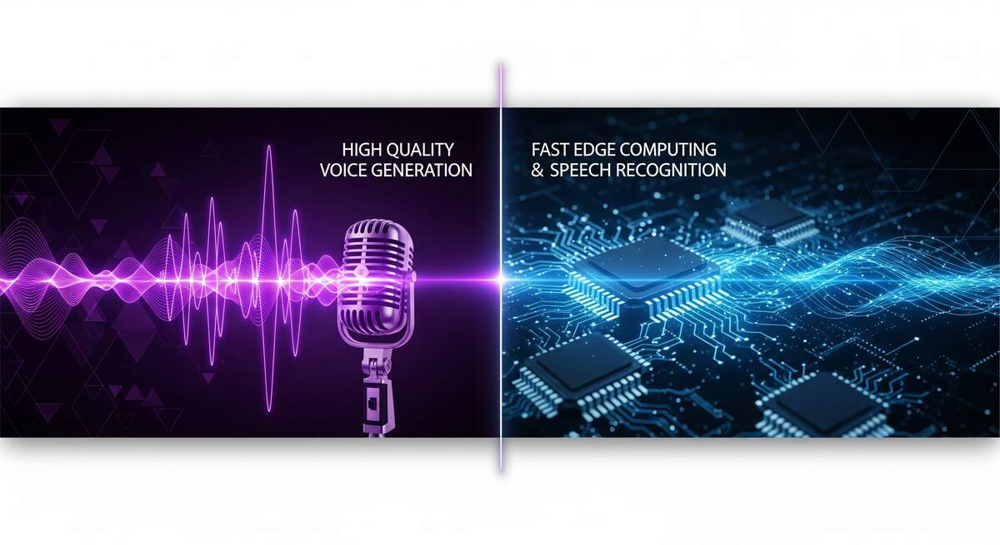

近期，语音AI开源社区接连迎来了两款极具影响力的重磅项目：一款是刚刚登顶海外Trending、主打高保真语音生成的模型 VoxCPM 2；另一款则是以极致推理速度和全平台部署著称的语音识别与推理框架 Sherpa-ONNX。两者虽然都在语音生态中大放异彩，但在核心定位、技术路线和应用场景上却有着截然不同的侧重点。

以下是对这两个开源项目的深度分析与对比：

## 一、原始GitHub仓库及项目解析

### 1. VoxCPM 2

**GitHub地址**：https://github.com/OpenBMB/VoxCPM

**项目解析**：VoxCPM 2 是由 OpenBMB 推出的一款无分词器（Tokenizer-Free）的端到端文本转语音（TTS）大模型。它基于扩散自回归架构，拥有20亿（2B）参数。其核心突破在于极高的话音自然度、情感表达能力以及"零样本"音色克隆技术。它原生支持 30 种语言及多种方言，能够实现从 16kHz 参考音频到 48kHz 高保真音频的超清输出。结合 Nano-vLLM 等推理引擎，它能在单张 RTX 4090 上实现极低的实时因子（RTF），是一款面向高质量语音生成的生成式大模型。

### 2. Sherpa-ONNX

**GitHub地址**：https://github.com/k2-fsa/sherpa-onnx

**项目解析**：Sherpa-ONNX 是由新一代 Kaldi（k2-fsa）团队打造的高性能跨平台语音推理框架。不同于单纯的算法模型，它是一个基于 ONNX Runtime 的底层工程解决方案。它不仅支持 Whisper、Zipformer、Paraformer 等主流语音识别（ASR）模型，同样也支持 TTS 和声纹识别（VAD）。它最大的亮点是彻底脱离网络连接、适配一切端侧硬件。无论是 iOS、Android，还是树莓派、RISC-V 乃至各类国产 NPU（如瑞芯微、昇腾），它都能提供多达 12 种编程语言的 API，实现极致轻量的实时推理。

## 二、核心差异与优劣势对比

这两个项目代表了目前语音AI发展的两大重要方向：**算力换质量（VoxCPM 2） vs 工程换效率（Sherpa-ONNX）**。

### VoxCPM 2：主攻"上限"与"生成质量"

**优势 (Pros)**：

- **极致的拟真度与情感表现**：能够精准复刻呼吸、语调、情绪等细节，音色创造与克隆能力处于目前开源界的第一梯队。
- **跨语种无缝切换**：无需手动打语言标签，模型自动理解并输出跨语种内容，表现自然。
- **高保真音质**：原生的 48kHz 录音室级别音频输出，无需级联外部复杂的声码器或超分模型。

**劣势 (Cons)**：

- **硬件算力门槛高**：作为一个 2B 级别的大模型，需要强劲的 GPU（如 NVIDIA 系列显卡）才能实现流畅的流式生成，无法在普通的轻量级移动端或物联网（IoT）设备上本地运行。

### Sherpa-ONNX：主攻"下限"与"部署效率"

**优势 (Pros)**：

- **极致的轻量与跨平台**：内存占用和算力需求极低，即使在旧手机、低功耗单片机或树莓派上也能流畅进行离线语音识别。
- **生态与语言支持极广**：提供 C++, Python, Go, Swift, Kotlin 等多语言接口，完美契合工程化应用落地。
- **超低延迟**：针对端侧专门优化了流式推理，端到端响应低至百毫秒级，做到了真正的"即说即出"。

**劣势 (Cons)**：

- **表现力受限于加载的小模型**：Sherpa-ONNX 本身是推理引擎，其最终的语音生成效果取决于它所加载的轻量化 ONNX 模型，在"细腻的情感表现力"和"复杂的零样本音色克隆"上，无法与 VoxCPM 这样的大型生成模型相媲美。

## 三、适用场景与用户建议

针对不同的开发需求和使用环境，我们给出如下选型建议：

### 👉 强烈建议选择 VoxCPM 2 的场景：

- **数字人与虚拟陪伴**：需要极具感染力、高度拟人的语音交互，如高阶客服、AI虚拟伴侣等。
- **内容创作者与自媒体**：需要低成本制作高质量配音、有声书录制、短视频自动口播，或者需要根据特定角色进行"音色定制"的场景。
- **云端大型AI服务商**：拥有充足的 GPU 算力集群，希望在云侧为企业或个人用户提供顶级的生成式 TTS API 服务。

### 👉 强烈建议选择 Sherpa-ONNX 的场景：

- **智能家居与IoT硬件开发者**：需要在智能音箱、车载车机、扫地机器人等算力受限、甚至是断网环境下的设备中实现语音控制与识别。
- **移动端与桌面端App开发**：希望在 iOS、Android 或 PC 应用中直接内置离线语音转文字、实时字幕或轻量级语音播报，并且不能显著增加软件体积或过度消耗设备电量。
- **隐私高度敏感的场景**：例如医院电子病历录入、政府及金融机构保密会议纪要等，要求所有的语音识别处理必须在本地物理机或局域网内完成，数据绝不可上传云端。

## 四、补充：闭源商业模型 Seeduplex

除了上述两款开源项目，字节跳动的 **Seeduplex**（原生全双工语音大模型）也是近期语音AI领域值得关注的模型，但它是**闭源商业方案**。

根据最新的发布信息，Seeduplex 是由字节跳动 Seed 团队研发的闭源商业模型。它目前作为核心技术，已经**全量落地并应用在自家的"豆包 App"**中，主要用于升级豆包的语音通话功能（实现了"边听边说"、精准抗干扰和动态判停等自然交互体验）。

字节跳动官方虽然上线了该项目的介绍页面（seed.bytedance.com/seeduplex），但并未在 GitHub 或 Hugging Face 等平台上开放其模型权重或源代码。如果你想体验它的能力，目前唯一的途径是下载或更新到最新版的豆包 App，在里面使用语音通话功能进行体验。

## 五、总结

VoxCPM 2 和 Sherpa-ONNX 在生态中是绝佳的互补者。VoxCPM 2 就像是在"云端"为你绘制听觉艺术的顶级画笔，而 Sherpa-ONNX 则是将语音交互的神经元高效铺设到全球每一台"边缘"设备上的高铁网络。开发者应当根据自己的核心诉求——是追求"音色与情感的极致表现"，还是追求"无处不在的极速离线部署"——来灵活选择最适合您的开源方案。
