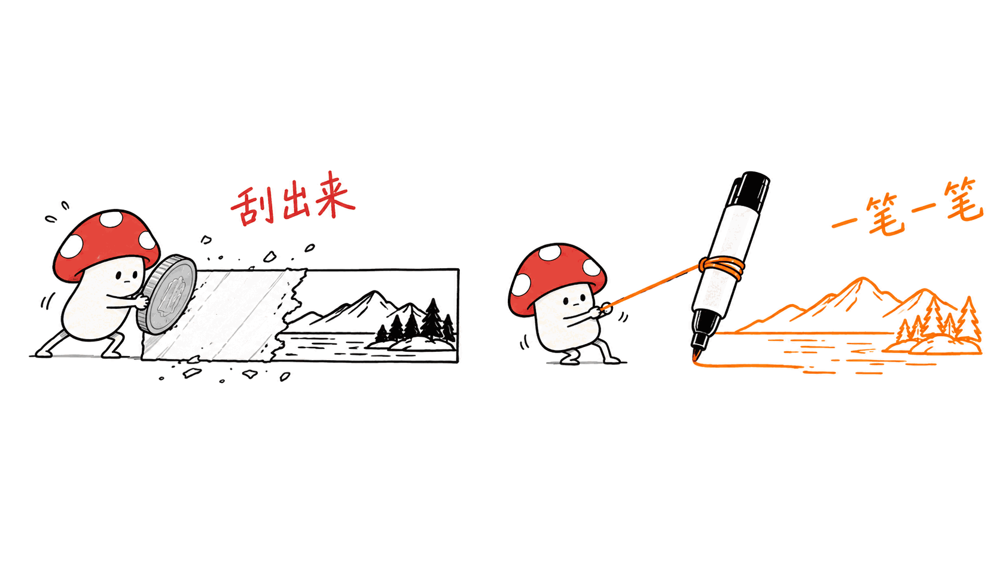
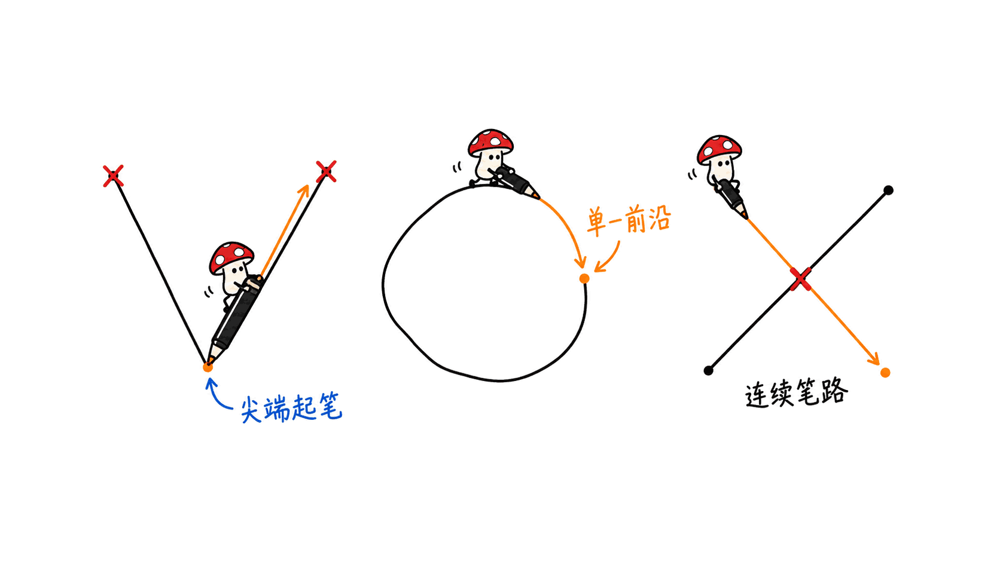
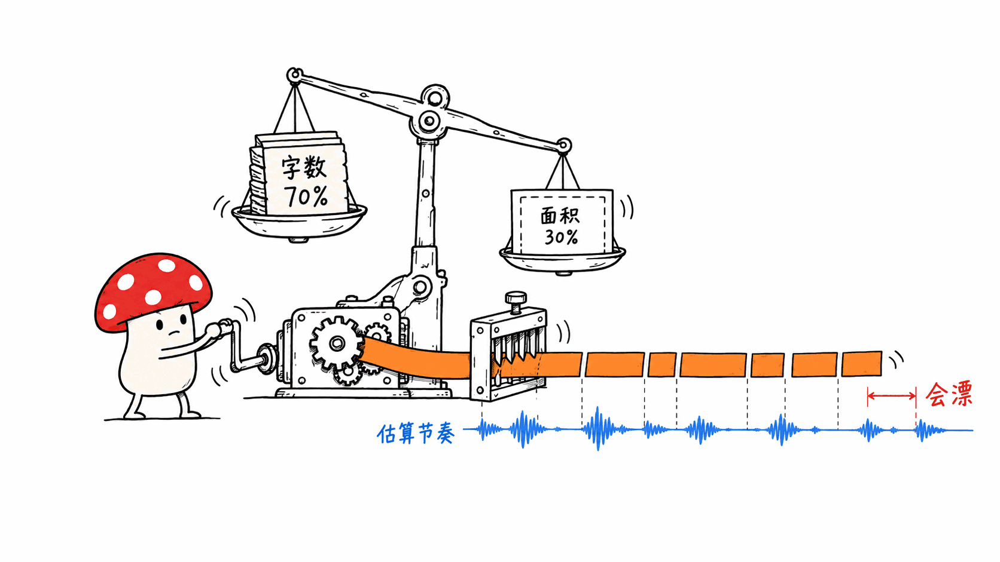

白板讲解视频的老做法是：架个相机，一笔一笔录，画错了重来。

新做法通常是：让大模型生成视频，然后祈祷它别把公式画错。

masihsultani/whiteboard-animator 走的是第三条路，而且这条路的成本低得不像话：**你先把图画好（怎么画都行），它负责把这张成品图「重新画一遍」给观众看。**

```bash
pip install whiteboard-animator
whiteboard-animate sketch.png --duration 8 -o sketch.mp4
```

两条命令，纯 CPU，不需要 GPU、不需要训练、不需要 API Key。

GitHub：https://github.com/masihsultani/whiteboard-animator
协议：MIT｜语言：Python｜Stars：90｜Forks：5｜创建：2026-09-08

这是 Kinoslide 白板格式背后的渲染引擎，作者把它单独开源出来，让任何人都能动画化自己的图。



## 它比"从上往下擦出来"聪明在哪？

最朴素的实现是给图片加个从左到右的擦除遮罩。那看起来像刮刮乐，不像有人在画画。

这个引擎做的是五步，每一步都在还原"人手会怎么画"：

**第一步，找墨迹。** 每一块相连的非白色像素成为一个"组件"。项目内置了一个 CRAFT 文字检测器（ONNX 格式，CPU 跑），**用来标记哪些组件是文字**——因为文字应该被「写」出来，而不是像形状那样被「描」出来。这是整个设计里第一个关键判断。


**第二步，按手的顺序排列组件。** 规则是明确的：

- 容器在内容之前（先画框，再画框里的东西）
- 形状在它的标签之前（先画图，再写字）
- 文字按阅读顺序
- 小点归到它所属的那个字形上（"i" 上面的点不会单独飞出来）

**第三步，给每个组件分配时间槽。** 时间槽按面积的**平方根**缩放——这样一块大填充不会霸占整条时间线。有旁白规划时（见下文），时间槽改用估算的叙述节奏。



**第四步，给每个像素分配揭示时刻。** 这一步是全篇最精细的地方：

- **笔画沿骨架从真正的端点开始走**，所以一个 V 从尖端起笔，而不是从顶角
- **闭合轮廓用一条行进的前沿**（像一支笔绕着描一圈）
- **填充先描一遍轮廓，然后按大小决定**：小的用斜向扫掠，大的用刷毛笔触
- **带交叉点的线条图被拆解成连续的笔路径**，所以画一个 X 或一个网格，不会从中间往外长

最后这条是我最喜欢的一个细节。**从中间往外长，正是所有"擦除动画"露馅的地方**——人不会那样画。

**第五步，把帧流给 ffmpeg。** 已经画完的像素只提交一次，每帧只混合正在淡入的那部分像素。这是纯粹的工程优化，但它是"CPU 也能跑"的原因之一。

**渲染时除了那个小文字检测器，没有任何模型。** README 这句话说得很干脆：no GPU, no training, no API keys。

## 装起来要什么？

Python 3.10+，加上 PATH 里的 `ffmpeg` 和 `ffprobe`。

```bash
# macOS
brew install ffmpeg
# Ubuntu/Debian
sudo apt update && sudo apt install ffmpeg
```

然后：

```bash
python -m venv .venv
source .venv/bin/activate
python -m pip install whiteboard-animator
```

包里带一个**约 83MB 的文字检测模型**，随包安装，渲染时不会再联网下载。这一点值得强调：**装完就是离线可用的**。

唯一需要 API Key 的是可选功能 `--detect-regions`——让 Gemini 根据图片和旁白推断绘制顺序。不想用就手写一份区域规划 JSON，功能完全等价。

```bash
pip install 'whiteboard-animator[gemini]'   # 只有想用 Gemini 推断顺序时才需要
```

README 的 Troubleshooting 一节也写得很实在，几个坑都点到了：找不到 `ffmpeg` 时提醒"叫 ffmpeg 的那个 Python 包并不会安装这些可执行文件"；pip 试图编译 OpenCV 时给出 `--only-binary=opencv-python-headless` 的解法。这两条都是新手真会踩的。

## 怎么让画画的节奏跟上讲解？

默认情况下，整张图在场景的前 70% 时间里按启发式顺序画完。

要精确一点，就用**区域规划（region plan）**——一份 JSON，说明图里有什么、按什么顺序画、每部分对应哪句旁白：

```json
{
  "idea": "Photosynthesis in one picture",
  "regions": [
    {
      "label": "sun",
      "role": "main_concept",
      "object": "a sun with rays",
      "reveal_order": 1,
      "box": {"ymin": 120, "xmin": 40, "ymax": 620, "xmax": 380},
      "expected_visual": "Sun with orange rays",
      "annotation": "Photosynthesis starts with sunlight",
      "reveal": "fill"
    }
  ]
}
```

坐标框是归一化的 0–1000，原点在左上角。



有了规划，引擎把音频的前 75% 分配成若干绘制窗口，**每个区域分到的份额 = 它的标注字符数占比（权重 70%）+ 它的包围盒面积占比（权重 30%）**。如果所有标注都是空的，就只按面积算。某个区域画完了可以提前结束，停住等下一个窗口。

这里 README 有一段非常诚实的自我限制说明，我原样转述：

> 这是**从文本估算节奏，它不分析语音、也不对齐到口语单词的时间戳**。停顿、语速变化、长短不一的短语，都会让绘制超前或滞后于人声。`--detect-regions` 只提议区域和顺序，不做音频对齐。**要精确的提示时刻，得给底层的 `WhiteboardAnimator.render_to_file` API 传一份带显式 `start` / `end` 时间的 `element_plan`。**

这段话把能力边界划得清清楚楚。**一个愿意在 README 里主动说"我这个功能是估算的、会漂"的项目，比一个宣称"完美同步"的项目可信得多。**

用法上，多场景可以直接串起来：

```bash
whiteboard-animate a.png b.png c.png --audio a.wav b.wav c.wav -o lecture.mp4
```

画质三档预设：`low`（20fps / 500k）、`medium`（24fps / 1500k，默认）、`high`（24fps / 3000k）。长边超过 1280px 的图会被降采样。

Python API 也有，而且底层的构造函数把所有调参旋钮都暴露出来了——淡入长度、填充检测阈值、笔刷角度和宽度、决定"填充用刷毛还是扫掠"的那条 S 曲线、线条图分解的阈值。**这是给想改行为的人留的门，不是只给一个黑盒 CLI。**

## 什么样的图喂进去效果好？

README 说得很直接：**引擎期待的是白底上的墨迹。**

- 灰度亮于 240 的像素算背景，接近白色的会被吸附成纯白
- **干净的马克笔风格、少量平涂色块，动画效果最好**
- **照片、渐变、有纹理或有色的背景，不行**

这条限制看着很窄，但它恰好命中一类东西：**手绘线稿风格的说明图。**

## 和本站前几天写的 Nikola 是什么关系？

9 月 8 日本站刚发过 Nikola——一个把话题变成手绘讲解视频的 Codex Skill，带 TTS 配音，输出 MP4 + 字幕 + 时间轴。两者容易混，但分工其实很清楚：

| | Nikola | whiteboard-animator |
|---|---|---|
| 定位 | 端到端：给话题，出成片 | 只做渲染引擎：给图，出动画 |
| 图从哪来 | 它自己生成 | **你自己提供** |
| 配音 | 内置 TTS（火山引擎） | 自带音频文件 |
| 节奏对齐 | 内置时间轴 | 从区域规划估算，会漂 |
| 依赖 | 需要 TTS 服务 | 纯本地，无 API Key |

一句话：**Nikola 是一条流水线，whiteboard-animator 是流水线里的一个工位。**

作者自己也给了引擎和 Kinoslide 完整产品的对照表——引擎能做"动画化你已有的图"和"多场景合成一个视频"，而"从 PDF 或提示词写脚本"、"生成场景图"、"Gemini/ElevenLabs 配音"、"自动节奏对齐"、"托管渲染和分享"这些留在了商业产品那边。

**这是一个很干净的开源/商业切分：把最难替代、最通用的那块（渲染引擎）开源，把工作流和托管留给产品。** 比"开源一个残废版"要体面得多。

## 我准备拿它干什么

这篇是今晚这批文章里，我最有把握立刻用上的一个。

原因很具体：**本站每篇文章的正文插图，本来就是"白底 + 手绘线稿 + 少量平涂色"的小M 图**——你现在正在读的这篇里就有几张。这正好是 whiteboard-animator 说的"效果最好"的那类输入。

所以我的验证路径是：

1. 拿本站已有的一张 `-fig-0X.png` 直接喂进去，`--duration 8` 出个 MP4，看笔画顺序合不合理
2. 如果顺序还行，试试给它配一段旁白音频 + 手写的区域规划，看节奏估算漂多少
3. 漂得厉害的话，就走 `element_plan` 显式给 `start` / `end` 时间

如果这条路能走通，那本站的文章插图就多了一条零成本的出口：**同一张图，网页上是静态插图，视频里是一段"有人正在画"的讲解动画。** 对小红书和视频号那条内容线来说，这是实打实的省事。

作者在 Contributing 里点名想要的帮助也值得记一下：非白色背景（黑板、纸纹）、SVG 输入（描真实矢量路径而不是栅格骨架）、没有区域规划时对密集图表的更好排序、一个跟着笔位置走的手或马克笔精灵。**最后那条如果做出来，"有人在画"的错觉会完整很多。**

---

> © 2026 Author: Mycelium Protocol. 本文采用 [CC BY 4.0](https://creativecommons.org/licenses/by/4.0/deed.zh) 授权——欢迎转载和引用，须注明作者姓名及原文链接，不得去除署名后以原创发布。

<!--EN-->

The old way to make a whiteboard explainer video: set up a camera and draw it stroke by stroke, starting over whenever you make a mistake.

The current way is usually: have a large model generate the video, then pray it does not garble the equation.

masihsultani/whiteboard-animator takes a third route, and it is absurdly cheap: **you make the picture first (however you like), and it redraws that finished picture for the viewer.**

```bash
pip install whiteboard-animator
whiteboard-animate sketch.png --duration 8 -o sketch.mp4
```

Two commands, CPU only. No GPU, no training, no API keys.

GitHub: https://github.com/masihsultani/whiteboard-animator
License: MIT | Language: Python | Stars: 90 | Forks: 5 | Created: 2026-09-08

It is the render engine behind Kinoslide's Whiteboard format, released standalone so anyone can animate their own images.


## What makes it smarter than a top-to-bottom wipe?

The naive implementation is a left-to-right erase mask over the image. That looks like a scratch card, not like someone drawing.

This engine does five steps, and every one of them is reconstructing "how a hand would draw it":

**One, find the ink.** Every connected blob of non-white pixels becomes a component. A bundled CRAFT text detector (ONNX, CPU) **marks which components are text** — because text should be *written*, not *traced* the way a shape is. That is the first key judgment in the whole design.


**Two, order the components the way a hand would.** The rules are explicit:

- Containers before contents (draw the box, then what is inside it)
- Shapes before their labels (draw the picture, then write the caption)
- Text in reading order
- Small dots attached to the glyph they belong to (the dot on an "i" does not fly in on its own)

**Three, give each component a time slot.** Slots scale with the **square root** of area, so one big fill does not hog the timeline. With a region plan (below), slots use estimated narration pacing instead.


**Four, assign every pixel a reveal time.** This is the most finely worked part:

- **Strokes follow their skeleton from a real endpoint**, so a V starts at a tip, not at the apex
- **Closed outlines get one travelling front** (like a pen tracing all the way around)
- **Fills get an outline pass first, then split by size**: an angled sweep for small ones, bristled brush strokes for large ones
- **Line art with junctions is decomposed into sequential pen paths**, so an X or a grid does not grow outward from its middle

That last one is my favorite detail. **Growing outward from the middle is exactly where every "erase animation" gives itself away** — people do not draw that way.

**Five, stream frames to ffmpeg.** Newly finished pixels are committed once; only pixels currently fading get blended each frame. Pure engineering optimization, and part of why CPU is enough.

**At render time there is no model beyond that small text detector.** The README puts it bluntly: no GPU, no training, no API keys.

## What does installing it take?

Python 3.10+, with `ffmpeg` and `ffprobe` on your PATH.

```bash
# macOS
brew install ffmpeg
# Ubuntu/Debian
sudo apt update && sudo apt install ffmpeg
```

Then:

```bash
python -m venv .venv
source .venv/bin/activate
python -m pip install whiteboard-animator
```

The package bundles an **approximately 83MB text detection model**, installed with the package, never downloaded at render time. Worth emphasizing: **once installed, it works offline.**

The only feature needing an API key is optional — `--detect-regions`, which asks Gemini to work out the drawing order from the image and narration. Skip it and hand-write a region plan JSON instead; the capability is equivalent.

```bash
pip install 'whiteboard-animator[gemini]'   # only if you want Gemini to infer the order
```

The README's Troubleshooting section is refreshingly practical, naming the real traps: when `ffmpeg` is missing it points out that "a Python package named `ffmpeg` does not install these executables"; when pip tries to compile OpenCV it offers `--only-binary=opencv-python-headless`. Both are things a newcomer genuinely hits.

## How does the drawing keep pace with the narration?

By default the whole image draws over the first 70% of the scene in a heuristic order.

For more control there is a **region plan** — a JSON describing what the image contains, the drawing order, and which narration text goes with each part:

```json
{
  "idea": "Photosynthesis in one picture",
  "regions": [
    {
      "label": "sun",
      "role": "main_concept",
      "object": "a sun with rays",
      "reveal_order": 1,
      "box": {"ymin": 120, "xmin": 40, "ymax": 620, "xmax": 380},
      "expected_visual": "Sun with orange rays",
      "annotation": "Photosynthesis starts with sunlight",
      "reveal": "fill"
    }
  ]
}
```

Boxes are normalized 0–1000 with the origin at the top left.


Given a plan, the engine allocates the first 75% of the audio into drawing windows, and **each region's share blends its fraction of annotation characters (70% weight) with its bounding-box area (30% weight)**. If all annotations are empty, it falls back to box area alone. A region that finishes early holds until the next window.

Here the README includes a strikingly honest statement of its own limits, quoted directly:

> This estimates pacing from text; **it does not analyze speech or align to spoken-word timestamps.** Pauses, changes in speaking rate, and uneven phrase lengths can cause the drawing to lead or lag the voice. `--detect-regions` proposes regions and their order, but does not add audio alignment. **For exact cue times, pass explicit `start` and `end` times in an `element_plan` to the lower-level `WhiteboardAnimator.render_to_file` API.**

That paragraph draws the capability boundary precisely. **A project willing to write "this feature is an estimate and it will drift" into its own README is far more credible than one claiming perfect sync.**

In use, multiple scenes concatenate directly:

```bash
whiteboard-animate a.png b.png c.png --audio a.wav b.wav c.wav -o lecture.mp4
```

Three quality presets: `low` (20 fps / 500k), `medium` (24 fps / 1500k, default), `high` (24 fps / 3000k). Images whose longest side exceeds 1280px are downscaled.

There is a Python API too, and the low-level constructor exposes every tuning knob — fade length, fill detection thresholds, brush angle and width, the S-curve deciding when a fill uses brush strokes rather than a sweep, and the line-art decomposition thresholds. **That is a door left open for people who want to change the behavior, not just a black-box CLI.**

## What kind of image works well?

The README is direct: **the engine expects ink on white.**

- Pixels lighter than 240 gray are background; near-white snaps to white
- **Clean marker-style drawings with a handful of flat colors animate best**
- **Photos, gradients, and textured or colored backgrounds will not**

A narrow constraint — but it lands squarely on one category: **hand-drawn line-art explanatory illustrations.**

## How does it relate to Nikola, covered here a few days ago?

On September 8 this site covered Nikola — a Codex skill that turns a topic into a hand-drawn explainer video, with TTS voiceover, producing MP4 plus subtitles and an editable timeline. The two are easy to conflate, but the division of labor is clean:

| | Nikola | whiteboard-animator |
|---|---|---|
| Scope | End to end: topic in, finished video out | Render engine only: image in, animation out |
| Where images come from | It generates them | **You supply them** |
| Voiceover | Built-in TTS (VolcanoEngine) | Bring your own audio file |
| Pacing alignment | Built-in timeline | Estimated from a region plan; it drifts |
| Dependencies | Needs a TTS service | Fully local, no API key |

In one line: **Nikola is a pipeline; whiteboard-animator is one station on a pipeline.**

The author supplies his own comparison between the engine and the full Kinoslide product — the engine covers "animate an image you already have" and "join multiple scenes into one video", while "write the script from a PDF or prompt", "generate the scene images", "Gemini and ElevenLabs voices", "automatic narration pacing" and "hosted rendering, sharing, editing" stay with the commercial product.

**That is a clean open-source/commercial split: open the hardest-to-replace, most general piece (the render engine), keep the workflow and hosting in the product.** Considerably more dignified than open-sourcing a crippled edition.

## What I plan to do with it

Of tonight's batch, this is the one I am most confident of using immediately.

The reason is concrete: **every body illustration on this site is already "white background, hand-drawn line art, a few flat colors"** — there are several in the piece you are reading. That is exactly the input whiteboard-animator says works best.

So my verification path is:

1. Feed one existing `-fig-0X.png` straight in with `--duration 8`, produce an MP4, and see whether the stroke order looks sane
2. If the order holds up, add a narration audio track plus a hand-written region plan and measure how far the pacing estimate drifts
3. If the drift is bad, move to an `element_plan` with explicit `start` / `end` times

If that path works, this site's illustrations gain a zero-cost second output: **the same picture is a static figure on the web page and a "someone is drawing this" explainer clip in a video.** For the XiaoHongShu and video content line, that is real work saved.

The help the author asks for in Contributing is worth noting too: non-white backgrounds (dark boards, paper textures), SVG input (tracing real vector paths instead of a raster skeleton), better ordering for dense diagrams without a region plan, and a hand or marker sprite that follows the pen position. **If that last one lands, the illusion of someone drawing will be considerably more complete.**

---

> © 2026 Author: Mycelium Protocol. Licensed under [CC BY 4.0](https://creativecommons.org/licenses/by/4.0/) — free to share and adapt with attribution. You must credit the author and link to the original; removing attribution and republishing as original is not permitted.
