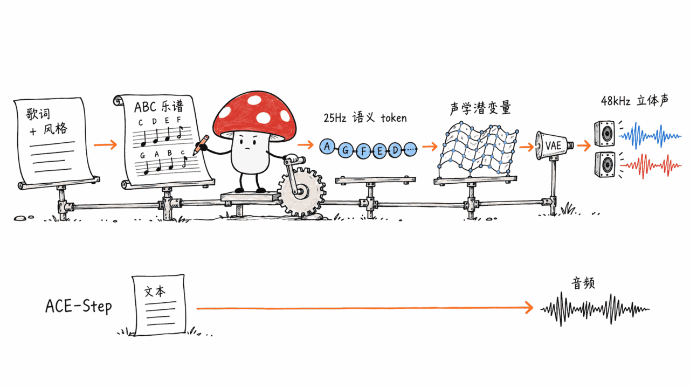
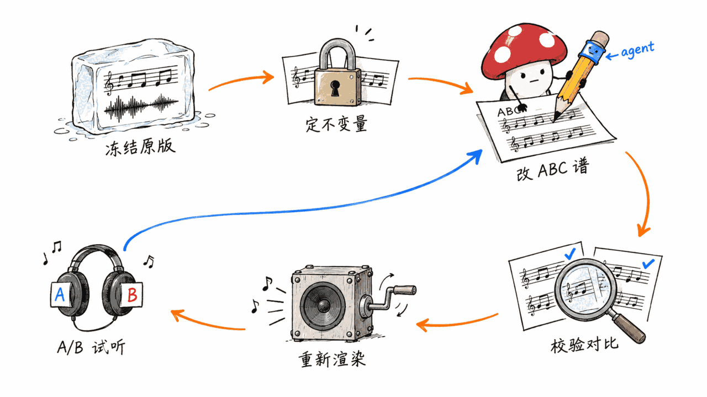
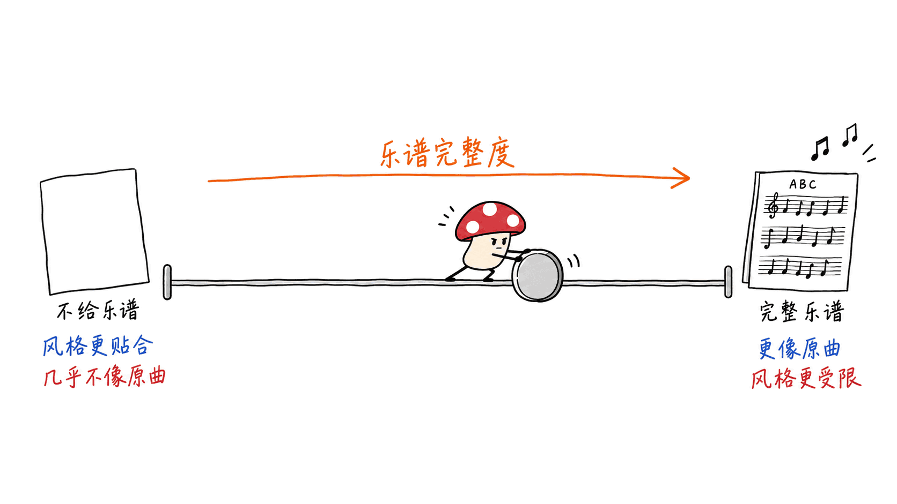
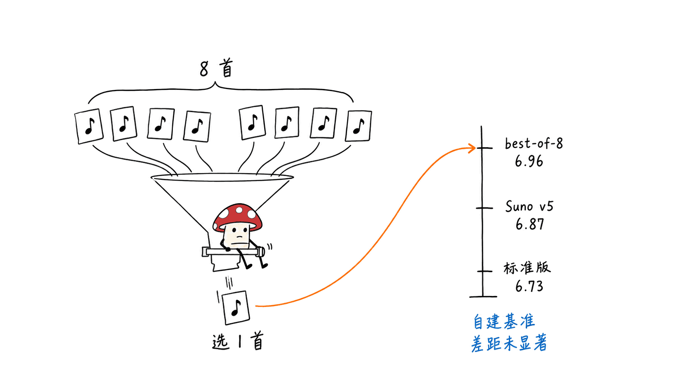
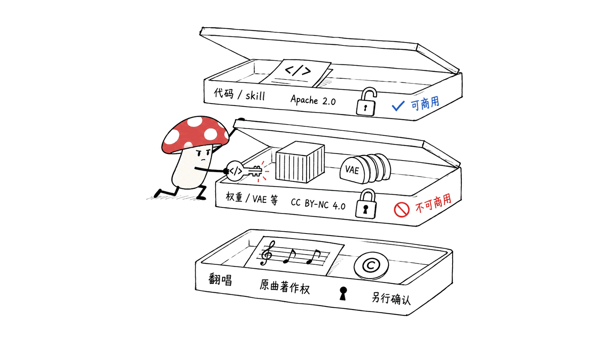

> 📌 模型：m-a-p/YuE2-3B（权重 CC BY-NC 4.0，禁止商用）
> Hugging Face：https://huggingface.co/m-a-p/YuE2-3B
> GitHub：https://github.com/multimodal-art-projection/YuE
> Demo：https://map-yue2.github.io/

---

**结论先行（BLUF）**：YuE2-3B 是 2026 年 9 月 9 日开源的 36 亿参数歌曲生成模型，和 ACE-Step 1.5 这类「直接出音频」的模型最大的不同是：**它先写一份可编辑的乐谱（ABC 记谱，含旋律与和弦），再把谱唱出来**。于是改和弦、换编曲、改词这类修改，可以交给 Agent 在乐谱上做，然后重新渲染。代价是门槛高：官方要求 Linux + 24GB NVIDIA BF16 显卡，Mac 不在支持列表；权重是 CC BY-NC 4.0，**不能商用**。「超过 Suno v5」的说法成立的前提是：团队自建的 WildSongBench 基准 + 从 8 首里挑最好的一首（best-of-8）。

---

## 一句话看懂：它和 ACE-Step 1.5 的根本差别

本站 5 月写过《本地跑、带人声、免费开源：ACE-Step 1.5 是目前最像产品的本地音乐 AI》（https://blog.mushroom.cv/blog/ace-step-15-local-music-generation-suno-alternative/），当时的判断是：本地音乐生成开始长出产品体验。YuE2 是同一条线上的下一步，但走的是另一个方向。

| 维度 | ACE-Step 1.5 | YuE2-3B |
|---|---|---|
| 生成方式 | 文本/歌词 → 音频 | 文本/歌词 → **ABC 乐谱** → 语义 token → 声学潜变量 → 音频 |
| 中间产物能不能改 | 基本不能在「音符」层面改 | 旋律、和弦、速度、段落都能在乐谱里改 |
| 最低显存 | 官方称 <4GB 可跑 | 官方基线 24GB（实测峰值约 11GB） |
| Mac | GitHub 仓库描述写明支持 Mac | 官方只写 Linux + NVIDIA |
| 协议 | MIT（可商用） | 权重 CC BY-NC 4.0（非商用），代码 Apache 2.0 |

> ACE-Step 1.5 的数据来自其 Hugging Face 模型卡（ACE-Step/Ace-Step1.5）：license 字段为 MIT，写有「Runs locally with less than 4GB of VRAM」，项目由 ACE Studio 与 StepFun 联合主导。YuE2 的数据来自其模型卡与 GitHub 文档。

有意思的一个细节：YuE2 Demo 页底部的合作机构标识里，除了 M-A-P、MBZUAI、Tokenwave.AI，还出现了 ACE Studio——正是 ACE-Step 的联合主导方之一。两条路线与其说是对手，不如说是同一个开源音乐圈子在试两种架构。

---

## YuE2 到底怎么「先写谱再唱」？

模型卡给出的架构描述是：**一个 AR–NAR 混合 Transformer 主干**，先自回归地写出乐谱和语义 token，再用 flow matching 生成声学潜变量，最后由 VAE 解码为立体声音频。

拆开看是四步，官方 Python API 也正好对应四个函数：

1. `pipe.plan()`：歌词 + 风格 → ABC 乐谱（旋律 + 和弦，也可只要旋律）
2. `pipe.generate_semantic(plan)`：乐谱 → 25Hz 语义 token
3. `pipe.synthesize(semantic)`：语义 token → 声学潜变量
4. `pipe.decode(latents)`：潜变量 → 48kHz 立体声

几个硬数字：

- **参数量**：Hugging Face 的 safetensors 统计为 3,630,684,224（约 3.63B，BF16）；Demo 页写「约 3.59B、28 层」。两个口径略有差异，本文统一写「约 36 亿」。
- **权重体积**：`model.safetensors` 约 7.26GB。
- **训练数据**：Demo 页称 YuE2 用了 34.6 万小时音乐，「主要是 CC0 音乐和合成数据」，合成数据大部分由 Tokenwave.AI 授权提供。
- **配套模型**：YuE2-Vae（听感更好，默认）、YuE2-Vae-legacy（跑基准用）、SheetSage2（音频转乐谱）、MERT-v2（音乐表征编码器，632M 参数）、WildSongBench（192 条提示的评测集）。这些权重同样是 CC BY-NC 4.0。

生成时有三种模式：`cot="full"`（旋律+和弦规划，默认）、`cot="melody"`（只规划旋律，官方推荐用于翻唱）、`cot="off"`（不写谱直接生成，也就没有可编辑的乐谱）。

---

## 为什么「可编辑乐谱」是这次最值得看的东西？

直接出音频的模型，改一个和弦只能重新抽卡：换个种子、改改提示词，赌下一首更接近想要的。YuE2 把「作曲意图」显式地落在一份文本格式的 ABC 乐谱里，这就让大语言模型 Agent 有了可以下手的对象。

官方文档把这叫做 **white-box music generation（白盒音乐生成）**，流程是：

1. 先生成原版并**冻结**原版的乐谱和音频
2. 明确「不变量」：比如旋律音高和节奏一个都不许动，只改和弦
3. 把 ABC、歌词、风格和修改要求交给一个 Agent，产出新 ABC + 修改说明
4. 用官方的 `abc_tools.py compare` 校验不变量（比对的是音符事件，不是字符串）
5. 用改过的乐谱重新渲染整首歌，和原版并排试听

仓库里还直接附带了一个 `skills/yue2-music/SKILL.md` 技能包（Apache 2.0），带 `agents/openai.yaml`，意思是 Codex、Claude Code 这类支持 SKILL.md 的 Agent 可以直接加载它来做生成、翻唱、改谱。文档明确说「不需要单独的 agentic 生成模型」——Agent 只是在已有 API 之间调度。

效果有没有数据？官方给了一个小规模配对实验：10 首原创作品、2 个种子、380 段完整录音。改动音符的旋律达成率从 0.0083 提到 0.9375，改动和弦的和声达成率从 0 提到 0.8313。官方自己也写明：样本只有 10 首，而且是在这批作品上开发的；这证明的是「能通过乐谱做选择性控制」，**不代表未改动部分的波形会一模一样**——重新渲染后，歌声和音色仍会变。

Demo 页的「The Last Train」案例把这套流程走了 9 步、14 个版本：从中文流行改成英文爵士，加现代和声，再加一段围绕《小星星》旋律展开的萨克斯独奏。每一步的对话、乐谱、提示词都可以在 Demo 页查看。

我们的判断：**这是开源音乐模型第一次把「可控性」做成了主卖点，而不是只比音质**。对做配乐、做改编、做音乐教学的人，能说「第 12 小节换成 Dm7」远比「再抽 20 次」有用。

---

## 翻唱：乐谱条件带来的差距

翻唱流程是：SheetSage2 把原曲转成乐谱 → 去掉和弦只留旋律 → 配上歌词（可用 Qwen3-ASR 转写）→ 用 `cot="melody"` 按新风格生成。

官方在 SHS100K 上测了 948 首作品 × 2 种风格 × 2 个种子，每个方法 3,792 首，不做挑选：

| 方法 | CLEWS mAP（歌曲身份保留）↑ | Hit@1 ↑ | MuLan（目标风格）↑ |
|---|---:|---:|---:|
| ACE-Step 1.5 | 0.024 | 2.4% | 0.166 |
| YuE2（完整乐谱） | 0.647 | 71.3% | 0.382 |
| YuE2（去和弦） | 0.598 | 67.3% | 0.417 |
| YuE2（不给乐谱） | 0.006 | 0.3% | 0.474 |

这张表最有信息量的不是 YuE2 赢了 ACE-Step，而是**同一个 YuE2 不给乐谱时身份保留几乎归零**（0.006）。也就是说，「翻唱像原曲」这件事几乎完全来自乐谱条件，而不是模型「记得」原曲。反过来，乐谱给得越死，目标风格贴合度越低——这是个真实的取舍。

需要提醒：这是 YuE2 团队用自己的配置跑的 ACE-Step 1.5，ACE-Step 并没有同样的「乐谱输入」通道，这个对比更像是在说明两种架构的能力边界，而不是同条件竞赛。

---

## 「超过 Suno v5」要怎么读？

模型卡的原话是：YuE2（best-of-8）在 WildSongBench 上 SongBench 均分 **6.9632**，Suno v5 为 **6.8721**。这句话是真的，但有四个前提必须一起读：

1. **基准是自建的**。WildSongBench（192 条提示，94 条中文、98 条英文）由 YuE2 团队发布，技术报告尚未公开（模型卡写「Technical report coming soon」，目前引用的仍是一代论文 arXiv:2503.08638）。
2. **best-of-8 是挑出来的**。每条提示生成 8 首，按 SongBench 的 Musicality 维度 → 提示词遵循 → 音素错误率的顺序挑最好的一首。官方文档自己承认：用评测指标的一个维度来挑选，**不等于单次调用的水平**。
3. **不挑的标准版 YuE2 是 6.7316**，低于 Suno v5（6.8721）和 Mureka 9（6.9377），略高于 Suno v5.5（6.7150）和 Suno v4.5（6.6995）。
4. **官方也说差距「不构成统计显著性声明」**，「不代表所有指标都领先或人类更偏好」。在同一张表里，文本-音频对齐（MuLan 0.5428、AllMusicCaps 0.4353）是 Suno v5 更高；歌词发音准确度（PER 越低越好）Suno v4.5 的 5.80% 最好，YuE2 标准版为 8.44%。

还有一个值得玩味的点：同一张表里 Suno v5.5 得分低于 Suno v5。这提醒我们，这类自动评测衡量的是一组特定维度，和厂商自己宣称的版本进步未必同向。

对照 ACE-Step 1.5：它在同一基准上 SongBench 均分 6.0118，但 PER 7.46% 比 YuE2 标准版更低（歌词更清楚）。YuE 一代只有 4.9165——一年半里，同一团队把分数从 4.92 拉到 6.73，这个纵向进步比「是否超过 Suno」更实在。

我们的结论：**更准确的说法是「开源权重模型第一次进入了闭源头部产品的分数区间」**，而不是「全面超过 Suno」。

---

## 要什么硬件？云上租 4090 一首歌多少钱？

官方要求：Linux、Python 3.10+、**24GB NVIDIA 显卡（需支持 BF16）**、**24GB 可用主机内存**，一次处理一首。

官方在 RTX 4090 上的实测（32 次热启动取平均，不量化）：

| 模式 | 生成耗时 / 音频时长 | 峰值显存 |
|---|---:|---:|
| full（旋律+和弦） | 71.04 秒 / 214.85 秒 | 11.18 GiB |
| melody | 68.68 秒 / 214.67 秒 | 11.02 GiB |
| off（不写谱） | 57.91 秒 / 196.88 秒 | 11.09 GiB |

峰值只有约 11GB，为什么还要 24GB？官方说最长上下文测试峰值到 14.08 GiB，并把 24GB 定为「支持基线」，文档还特别叮嘱不要为了躲 OOM 偷偷缩短歌曲或降低推理设置。另外可选的 FP8 量化只支持计算能力 ≥8.9 的 CUDA 卡（4090 属于），且官方明确说开启它不附带任何质量或速度承诺。

服务端用 vLLM 在 H800 上并发 32 路时，吞吐为每小时 373.53 首，峰值显存 76.61 GiB——这是给做服务的人看的数字。

**每首歌的边际成本（估算，非实测）**：

- 价格来源：RunPod 官网 RTX 4090 页面标注 Community Cloud「from $0.34/hr」（2026 年 9 月检索），按秒计费；本站 4 月文章《继续等Mac Studio还是投入AMD怀抱Or云GPU？》（https://blog.mushroom.cv/blog/mac-studio-vs-amd-vs-cloud-gpu-local-ai/）记录的 AutoDL RTX 4090 为 ¥2.68/小时。实时价格以平台为准。
- 计算：71 秒 × $0.34/3600 秒 ≈ **$0.0067/首**（约 ¥0.05）；AutoDL 口径约 **¥0.053/首**。
- 如果像基准那样 best-of-8 挑一首：8 × 71 秒 ≈ **$0.054/首**。
- 没算进去的：首次下载约 7.3GB 权重 + VAE、装环境、模型加载、试听挑选的人工时间。实际一次短会话里，这些固定成本通常比生成本身贵得多。
- 理论上限：一张 4090 连续跑，一小时约 50 首 3.6 分钟的歌（3600 ÷ 71）。

换句话说，**算力不是瓶颈，协议和门槛才是**。

---

## Mac 用户能跑吗？

官方文档和技能包都只写 Linux + NVIDIA，没有 Mac 的支持声明，也没有 Mac 上的速度或质量数据。

我们翻了推理包源码（yue2_infer 0.1.5）：设备选择是「有 CUDA 用 CUDA，否则有 MPS 用 MPS，否则 CPU」，注意力模块里也有针对 MPS 的兼容分支。但它自带的环境检查命令会在报告里明确标注 `validated: False` 和「环境就绪不等于质量或 24GB 验收」。所以准确的说法是：**代码没有把 Mac 拒之门外，但官方没有验证过，也不承诺能用**。

本站写作用的是一台 16GB 内存的 Mac mini，低于官方 24GB 主机内存的建议，本文**没有做任何实测**，也不提供 Mac 上的数字。想在 Mac 上本地做音乐，目前 ACE-Step 1.5 或本站写过的《Stable Audio 3.0：6分20秒完整歌曲，四模型开源，本地 MacBook 就能跑》（https://blog.mushroom.cv/blog/stable-audio-3-ai-music-generation-local/）是更现实的选择；想玩 YuE2，按秒租一张云端 4090 更省事。

---

## 非商用协议对创作者意味着什么？

YuE2 的授权分三层：

- **代码与技能包**：Apache 2.0，可自由使用
- **模型权重**（YuE2-3B、两个 VAE）：CC BY-NC 4.0，禁止商业用途
- **配套模型**（SheetSage2、MERT-v2）：同样是 CC BY-NC 4.0

对创作者的实际影响：

- 个人练习、做 demo、学习编曲、非营利的研究和教学：可以用，记得署名。
- 发行到流媒体赚分成、给客户做配乐收钱、做商业广告/短视频带货：属于高风险用途。官方 LICENSE 只界定了权重的授权范围，没有单独写明生成音频的归属和商用条款；在没有作者书面授权之前，默认不要商用。（本文不构成法律意见。）
- 做 SaaS 产品、把模型包装成付费服务：明确不行。

横向看：ACE-Step 1.5 是 MIT；Stable Audio 3.0 的社区许可允许年收入 100 万美元以下的个人和组织商用。**如果你的目标是商用，YuE2 目前只能当「参考答案」，不能当生产工具**；它的价值在于把「可编辑乐谱」这个范式开源出来，别的可商用模型迟早会跟进。

翻唱功能还有一层额外风险：即使模型可商用，翻唱他人作品本身就涉及原曲的著作权，和模型协议是两件事。

---

## 常见问题

**Q: YuE2-3B 是什么？**
A: YuE2-3B 是 M-A-P 等团队 2026 年 9 月 9 日开源的约 36 亿参数歌曲生成模型，输入歌词和风格描述，先生成可编辑的 ABC 乐谱，再输出带人声和伴奏的 48kHz 立体声完整歌曲，支持翻唱和 Agent 改谱后重新生成。

**Q: YuE2 真的超过 Suno v5 了吗？**
A: 只在一个条件下成立：团队自建的 WildSongBench 基准上，从 8 首里挑最好一首时均分 6.9632 高于 Suno v5 的 6.8721。不挑选的标准版为 6.7316，低于 Suno v5，官方也说明差距不具统计显著性。

**Q: YuE2 和 ACE-Step 1.5 该选哪个？**
A: 要商用、要在 Mac 或小显存卡上跑，选 ACE-Step 1.5（MIT、官方称 <4GB 显存可跑）。要精细控制旋律与和弦、做翻唱或 Agent 改编，且只做非商业用途，选 YuE2。

**Q: 跑 YuE2 需要什么硬件？**
A: 官方要求 Linux、24GB 显存的 NVIDIA BF16 显卡、24GB 可用主机内存。RTX 4090 上生成一首 3.6 分钟的歌约 71 秒，峰值显存约 11GB。

**Q: 在云上生成一首歌要多少钱？**
A: 按 RunPod 社区云 RTX 4090 标价 $0.34/小时估算，单首约 $0.0067；如果每首生成 8 个候选再挑，约 $0.054。这是估算，不含下载权重、装环境和挑选的时间。

**Q: YuE2 生成的歌能商用吗？**
A: 模型权重是 CC BY-NC 4.0，禁止商业用途，官方也没有单独给出生成音频的商用许可。商用前应联系作者取得书面授权。

---

## 一手来源

- YuE2-3B 模型卡：https://huggingface.co/m-a-p/YuE2-3B
- GitHub 仓库（代码 Apache 2.0）：https://github.com/multimodal-art-projection/YuE
- 官方基准说明：https://github.com/multimodal-art-projection/YuE/blob/main/docs/benchmarks.md
- 编辑流程文档：https://github.com/multimodal-art-projection/YuE/blob/main/docs/editing.md
- Demo 与 Agent 编辑案例：https://map-yue2.github.io/
- WildSongBench：https://huggingface.co/datasets/m-a-p/WildSongBench
- SheetSage2：https://huggingface.co/m-a-p/SheetSage2
- YuE2-Vae：https://huggingface.co/m-a-p/YuE2-Vae
- MERT-v2-FullSong：https://huggingface.co/m-a-p/MERT-v2-FullSong
- YuE 一代论文：https://arxiv.org/abs/2503.08638
- ACE-Step 1.5 模型卡：https://huggingface.co/ACE-Step/Ace-Step1.5
- RunPod RTX 4090 价格页：https://www.runpod.io/gpu-models/rtx-4090

---

> © 2026 Author: Mycelium Protocol. 本文采用 [CC BY 4.0](https://creativecommons.org/licenses/by/4.0/deed.zh) 授权——欢迎转载和引用，须注明作者姓名及原文链接，不得去除署名后以原创发布。

<!--EN-->

> 📌 Model: m-a-p/YuE2-3B (weights CC BY-NC 4.0, non-commercial)
> Hugging Face: https://huggingface.co/m-a-p/YuE2-3B
> GitHub: https://github.com/multimodal-art-projection/YuE
> Demo: https://map-yue2.github.io/

---

**BLUF**: YuE2-3B, open-sourced on September 9, 2026, is a ~3.6B-parameter song generation model. Its key difference from "straight-to-audio" models like ACE-Step 1.5 is that **it writes an editable score first (ABC notation with melody and chords) and then performs it**. That makes reharmonization, re-arrangement and lyric changes something an AI agent can do on the score before re-rendering. The costs: official support is Linux plus a 24GB BF16-capable NVIDIA GPU, Mac is not on the list, and the weights are CC BY-NC 4.0, so **no commercial use**. The "beats Suno v5" claim holds only on the team's own WildSongBench and only with best-of-8 selection.

---

## The Core Difference from ACE-Step 1.5

In May we covered "Local, Free, with Vocals: ACE-Step 1.5 Is the Most Product-Ready Local Music AI Yet" (https://blog.mushroom.cv/blog/ace-step-15-local-music-generation-suno-alternative/), where we argued that local music generation was starting to feel like a product. YuE2 is the next step on the same road, but it goes a different direction.

| | ACE-Step 1.5 | YuE2-3B |
|---|---|---|
| Pipeline | text/lyrics → audio | text/lyrics → **ABC score** → semantic tokens → acoustic latents → audio |
| Editable intermediate | Not at the note level | Melody, chords, tempo and form are editable in the score |
| Minimum VRAM | "less than 4GB" per its model card | 24GB official baseline (~11GB measured peak) |
| Mac | GitHub description lists Mac support | Officially Linux + NVIDIA only |
| License | MIT (commercial OK) | Weights CC BY-NC 4.0, code Apache 2.0 |

> ACE-Step 1.5 facts come from its Hugging Face model card (ACE-Step/Ace-Step1.5): license MIT, "Runs locally with less than 4GB of VRAM", co-led by ACE Studio and StepFun. YuE2 facts come from its model card and GitHub docs.

One detail worth noting: the institution marks on the YuE2 demo page include M-A-P, MBZUAI, Tokenwave.AI, and ACE Studio, which is one of ACE-Step's two co-leads. So these are less rival camps than one open music community trying two architectures.

---

## How Does "Score First, Then Sing" Work?

According to the model card, **a single AR–NAR Mixture-of-Transformers backbone** autoregressively writes the score and semantic tokens, then generates acoustic latents through flow matching, and a VAE decodes them into stereo audio.

The public Python API maps onto four stages:

1. `pipe.plan()`: lyrics + style → ABC score (melody + chords, or melody only)
2. `pipe.generate_semantic(plan)`: score → 25 Hz semantic tokens
3. `pipe.synthesize(semantic)`: semantic tokens → acoustic latents
4. `pipe.decode(latents)`: latents → 48 kHz stereo

Hard numbers:

- **Parameters**: the Hugging Face safetensors count is 3,630,684,224 (~3.63B, BF16). The demo page says "approximately 3.59B, 28 layers." We use "~3.6B" throughout.
- **Weights**: `model.safetensors` is about 7.26GB.
- **Training data**: the demo page says YuE2 used 346K hours, "trained primarily on CC0 music and synthetic data", with most synthetic data licensed from Tokenwave.AI.
- **Companion models**: YuE2-Vae (better perceptual quality, default), YuE2-Vae-legacy (for benchmark reproduction), SheetSage2 (audio to score), MERT-v2 (632M-parameter music encoders), and WildSongBench (192 prompts). These weights are also CC BY-NC 4.0.

There are three modes: `cot="full"` (melody + chord planning, default), `cot="melody"` (melody only, recommended for covers), and `cot="off"` (no score, so nothing to edit).

---

## Why Is the Editable Score the Headline Feature?

With a straight-to-audio model, changing one chord means another roll of the dice: new seed, tweaked prompt, hope for the best. YuE2 puts the compositional intent into a text-based ABC score, which gives an LLM agent something concrete to work on.

The official docs call it **white-box music generation**. The workflow:

1. Generate a baseline and **freeze** its score and audio
2. Define invariants, e.g. "every melody pitch and rhythm stays; only chords change"
3. Hand the ABC, lyrics, style and requested change to an agent, which returns a new ABC plus an edit manifest
4. Verify invariants with the official `abc_tools.py compare`, which compares musical events rather than strings
5. Re-render the full song from the edited score and A/B it against the baseline

The repo also ships a `skills/yue2-music/SKILL.md` package (Apache 2.0) with an `agents/openai.yaml`, so agents that load SKILL.md packages, such as Codex or Claude Code, can drive generation, covers and score edits. The docs say "no separate agentic-generation checkpoint is required." The agent just orchestrates existing APIs.

Is there evidence it works? The team reports a small paired study: 10 original works, 2 seeds, 380 full-song recordings. Changed-note melody attainment goes from 0.0083 to 0.9375. Changed-duration harmony attainment goes from 0 to 0.8313. The docs are upfront that the cohort is small and was used during development, and that this shows **selective control through the score, not identical waveform preservation**. Singing and timbre outside the edit still change on re-render.

The demo's "The Last Train" case walks this loop through 9 steps and 14 versions, from Mandarin pop to English jazz with modern harmony and a sax solo built on "Twinkle, Twinkle, Little Star." The conversation, scores and prompts for every step are on the demo page.

Our read: **this is the first open music model to make controllability, rather than raw audio quality, the main selling point.** For scoring, arranging or teaching, being able to say "make bar 12 a Dm7" is worth a lot more than rolling twenty more times.

---

## Covers: What the Score Buys You

The cover workflow is SheetSage2 transcribes the source → strip chords to keep the melody → add lyrics (Qwen3-ASR can transcribe them) → generate with `cot="melody"` in the target style.

On SHS100K the team ran 948 works × 2 styles × 2 seeds, 3,792 outputs per method, with no cherry-picking:

| Method | CLEWS mAP (identity) ↑ | Hit@1 ↑ | MuLan (target style) ↑ |
|---|---:|---:|---:|
| ACE-Step 1.5 | 0.024 | 2.4% | 0.166 |
| YuE2 (full score) | 0.647 | 71.3% | 0.382 |
| YuE2 (no chords) | 0.598 | 67.3% | 0.417 |
| YuE2 (no score) | 0.006 | 0.3% | 0.474 |

The most informative row isn't YuE2 beating ACE-Step. It's that **the same YuE2 with no score drops to near-zero identity (0.006)**. Sounding like the original comes almost entirely from the score condition, not from the model "remembering" songs. The flip side: the tighter the score, the weaker the target-style match. That's a real trade-off.

Caveat: the YuE2 team ran ACE-Step 1.5 in their own setup, and ACE-Step has no equivalent score-input channel. So read this as showing where each architecture's capabilities end, not as a like-for-like race.

---

## How Should You Read "Beats Suno v5"?

The model card says YuE2 (best-of-8) scores **6.9632** SongBench average on WildSongBench versus **6.8721** for Suno v5. That's true, with four conditions attached:

1. **The benchmark is in-house.** WildSongBench (192 prompts: 94 Chinese, 98 English) is published by the YuE2 team. The technical report isn't out yet ("coming soon"), and the citation is still the YuE v1 paper, arXiv:2503.08638.
2. **Best-of-8 is selected.** Eight candidates per prompt, picked by SongBench Musicality, then prompt control, then phoneme error rate. The docs themselves say that selecting on a dimension of the evaluation metric **is not equivalent to one unselected pipeline call**.
3. **Standard YuE2 scores 6.7316.** That's below Suno v5 (6.8721) and Mureka 9 (6.9377), and slightly above Suno v5.5 (6.7150) and Suno v4.5 (6.6995).
4. **The team says the gaps are "not claims of statistical significance"** and do "not establish universal metric superiority or human preference." In the same table Suno v5 leads text-audio alignment (MuLan 0.5428, AllMusicCaps 0.4353), and Suno v4.5 has the best lyric intelligibility (PER 5.80% vs 8.44% for standard YuE2).

Also telling: Suno v5.5 scores below Suno v5 in this table. That's a reminder that automatic benchmarks measure a specific set of dimensions, which won't always agree with a vendor's own version-over-version claims.

For ACE-Step 1.5, the same benchmark gives 6.0118 SongBench, but its 7.46% PER beats standard YuE2, so its lyrics come through more clearly. YuE v1 scored 4.9165. Going from 4.92 to 6.73 in about eighteen months is more meaningful than whether it edges out Suno.

Our conclusion: **the accurate claim is that an open-weight model has entered the score range of the top closed products**, not that it beats Suno across the board.

---

## Hardware, and What Does One Song Cost on a Rented 4090?

Official requirements: Linux, Python 3.10+, **a 24GB NVIDIA GPU with BF16**, **24GB available host RAM**, one song at a time.

Official RTX 4090 measurements (average of 32 warm runs, no quantization):

| Mode | Generation / audio length | Peak VRAM |
|---|---:|---:|
| full | 71.04 s / 214.85 s | 11.18 GiB |
| melody | 68.68 s / 214.67 s | 11.02 GiB |
| off | 57.91 s / 196.88 s | 11.09 GiB |

Why 24GB when the peak is ~11GB? Maximum-context testing peaked at 14.08 GiB, and the team treats 24GB as the supported baseline. The docs even warn against quietly shortening songs or lowering settings to dodge OOM. Optional FP8 quantization needs CUDA compute capability ≥8.9 (the 4090 qualifies), and the docs say enabling it comes with no quality or speed claim.

For serving, vLLM on an H800 at 32-way concurrency reaches 373.53 songs/hour at 76.61 GiB peak.

**Marginal cost per song (estimate, not measured):**

- Price sources: RunPod's RTX 4090 page lists Community Cloud "from $0.34/hr" (checked September 2026), billed per second. Our April post "Keep Waiting for the Mac Studio, Switch to AMD, or Just Rent Cloud GPUs?" (https://blog.mushroom.cv/blog/mac-studio-vs-amd-vs-cloud-gpu-local-ai/) recorded AutoDL's RTX 4090 at ¥2.68/hr. Check live prices before you rent.
- Math: 71 s × $0.34/3600 s ≈ **$0.0067 per song**. At the AutoDL rate it's about **¥0.053 per song**.
- With best-of-8 selection like the benchmark: 8 × 71 s ≈ **$0.054 per song**.
- Not included: downloading ~7.3GB of weights plus the VAE, environment setup, model load, and your own listening time. In a short session those fixed costs usually outweigh the generation itself.
- Ceiling: one 4090 running flat out produces about 50 songs of 3.6 minutes per hour (3600 ÷ 71).

In short: **compute isn't the bottleneck. The license and the setup barrier are.**

---

## Can Mac Users Run It?

The docs and skill package list only Linux + NVIDIA. There's no Mac support statement and no Mac speed or quality numbers.

We read the inference package source (yue2_infer 0.1.5). Device selection is "CUDA if available, else MPS, else CPU", and the attention module has an MPS compatibility branch. But its own environment check reports `validated: False` with the note "Environment readiness is not quality or real-24GB acceptance." So the accurate statement is: **the code doesn't lock Macs out, but it isn't validated or promised to work on them**.

This post was written on a 16GB Mac mini, which is below the official 24GB host-RAM recommendation. We **ran no tests** and report no Mac numbers. For local music on a Mac today, ACE-Step 1.5 or "Stable Audio 3.0: 6-Minute Songs, Four Open-Weight Models, Runs Locally on MacBook" (https://blog.mushroom.cv/blog/stable-audio-3-ai-music-generation-local/) are the realistic options. For YuE2, renting a cloud 4090 by the second is easier.

---

## What Does the Non-Commercial License Mean for Creators?

YuE2's licensing has three layers:

- **Code and skill package**: Apache 2.0
- **Model weights** (YuE2-3B and both VAEs): CC BY-NC 4.0, no commercial use
- **Companion models** (SheetSage2, MERT-v2): also CC BY-NC 4.0

In practice:

- Personal practice, demos, learning to arrange, non-profit research and teaching: fine, with attribution.
- Releasing to streaming for royalties, paid scoring work, commercial ads or sponsored short videos: high risk. The LICENSE defines the scope for the weights only and says nothing specific about ownership or commercial use of generated audio. Without written permission from the authors, assume no commercial use. (This isn't legal advice.)
- Wrapping the model as a paid SaaS: clearly not allowed.

For comparison, ACE-Step 1.5 is MIT, and Stable Audio 3.0's community license allows commercial use for individuals and organizations under $1M annual revenue. **If you need commercial output, treat YuE2 as a reference design, not a production tool.** Its real contribution is open-sourcing the editable-score paradigm, which commercially licensed models are likely to follow.

Covers carry one more layer of risk: even with a commercial-friendly model, covering someone else's song raises copyright in the original composition. That's a separate question from the model license.

---

## FAQ

**Q: What is YuE2-3B?**
A: YuE2-3B is a ~3.6B-parameter open song generation model released on September 9, 2026 by M-A-P and partners. From lyrics and a style prompt, it writes an editable ABC score, then renders a full 48 kHz stereo song with vocals and accompaniment. It supports covers and agent-driven score edits followed by regeneration.

**Q: Does YuE2 really beat Suno v5?**
A: Only under specific conditions. On the team's own WildSongBench with best-of-8 selection, it averages 6.9632 versus 6.8721 for Suno v5. Unselected standard YuE2 scores 6.7316, below Suno v5, and the team says the gaps aren't statistically significant.

**Q: Should I use YuE2 or ACE-Step 1.5?**
A: For commercial use, Macs or low-VRAM GPUs, pick ACE-Step 1.5 (MIT, under 4GB VRAM per its model card). For fine control over melody and chords, covers or agent-driven arranging in non-commercial work, pick YuE2.

**Q: What hardware does YuE2 need?**
A: Linux, a 24GB NVIDIA GPU with BF16, and 24GB of free host RAM. On an RTX 4090, a 3.6-minute song takes about 71 seconds at roughly 11GB peak VRAM.

**Q: How much does one song cost in the cloud?**
A: At RunPod's $0.34/hr Community Cloud RTX 4090 rate, about $0.0067 per song, or about $0.054 if you generate eight candidates and keep one. These are estimates and exclude weight download, setup and listening time.

**Q: Can I use YuE2 songs commercially?**
A: The weights are CC BY-NC 4.0, which forbids commercial use, and there's no separate commercial grant for generated audio. Get written permission from the authors before any commercial use.

---

## Primary Sources

- YuE2-3B model card: https://huggingface.co/m-a-p/YuE2-3B
- GitHub (code Apache 2.0): https://github.com/multimodal-art-projection/YuE
- Benchmark notes: https://github.com/multimodal-art-projection/YuE/blob/main/docs/benchmarks.md
- Editing workflow: https://github.com/multimodal-art-projection/YuE/blob/main/docs/editing.md
- Demo and agentic editing case: https://map-yue2.github.io/
- WildSongBench: https://huggingface.co/datasets/m-a-p/WildSongBench
- SheetSage2: https://huggingface.co/m-a-p/SheetSage2
- YuE2-Vae: https://huggingface.co/m-a-p/YuE2-Vae
- MERT-v2-FullSong: https://huggingface.co/m-a-p/MERT-v2-FullSong
- YuE v1 paper: https://arxiv.org/abs/2503.08638
- ACE-Step 1.5 model card: https://huggingface.co/ACE-Step/Ace-Step1.5
- RunPod RTX 4090 pricing: https://www.runpod.io/gpu-models/rtx-4090

---

> © 2026 Author: Mycelium Protocol. Licensed under [CC BY 4.0](https://creativecommons.org/licenses/by/4.0/) — free to share and adapt with attribution. You must credit the author and link to the original; removing attribution and republishing as original is not permitted.
