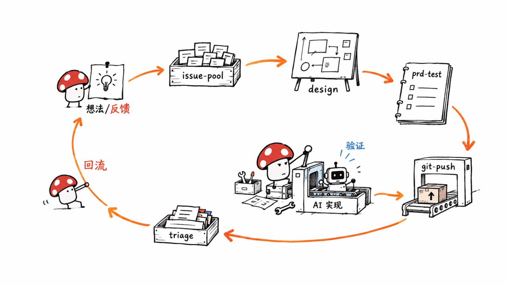
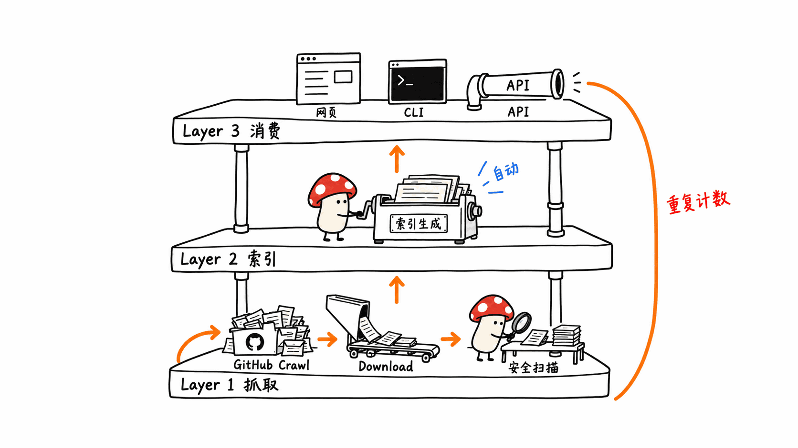

> 📌 对比对象一：yunshu0909/yunshu_skillshub
> GitHub：https://github.com/yunshu0909/yunshu_skillshub
> 协议：MIT ｜ Stars：760 ｜ Forks：107 ｜ 创建：2026-01-19 ｜ 最近提交：2026-09-19
>
> 📌 对比对象二：majiayu000/claude-skill-registry
> GitHub：https://github.com/majiayu000/claude-skill-registry
> 协议：MIT（仅限仓库代码，第三方 Skill 各自保留原许可）｜ Stars：642 ｜ Forks：100 ｜ 创建：2025-12-24 ｜ 最近提交：2026-09-22（每日自动发布）

---

**BLUF**：这两个仓库经常被放在一起讨论，因为都叫"Claude Code Skill 目录"，但拆开看是两种完全不同的东西。**yunshu_skillshub** 是云舒一个人（另有一位协作者）手写的 38 个 Skill，每个都对应真实的产品/研发工作阶段，有一条从 issue 到发版的完整交付链路，还有公开的真实产物仓库可查。**claude-skill-registry** 是一套每日跑的爬虫+索引流水线，号称"最全面的 Claude Code Skill 注册表"，`stats.json` 显示已抓到 20.3 万个 SKILL.md、去重后 16.2 万条、来自近 1 万个仓库——但我们抽查发现：公开搜索页展示的只是精选的 5000 条"S 级"结果，来自 pytorch、FastGPT 这类高星仓库内部的项目专属脚本；而全量归档里随手抽到的一条是空描述、0 星、许可证标为"restricted"、明确提示"不要当作 MIT、复用前先找上游要授权"。这不是"哪个更好"的问题，而是"你要方法论还是要搜索引擎"的问题——文末给出场景化的选型建议。

## 这两个项目真的是同类吗？

先说结论：**不是**。它们只是都落在"Claude Code Skill 目录/市场"这个大筐里，定位、产出、维护方式全部不同：

| | yunshu_skillshub | claude-skill-registry |
|---|---|---|
| 本质 | 一个人（团队）手写并自用的 Skill 合集 | 抓取全网公开仓库 `.claude/skills/` 目录后生成的索引 + 搜索引擎 |
| 内容来源 | 100% 自己设计、自己写、自己在真实项目里跑 | 100% 第三方内容，registry 本身不产出 Skill 正文 |
| 收录数量 | 38 个（37 推荐 + 1 历史兼容） | 号称 162,006～162,332 条（`registry.json` / `stats.json`，每日变化） |
| 更新方式 | 人工新增，一次一个 PR/commit，README 同步改数字 | GitHub Actions 每天自动跑一遍完整流水线 |
| 你拿到的是什么 | 一套连贯的方法论，Skill 之间边界写死、互相引用 | 一条能搜索/能下载的第三方内容索引，质量参差 |

把它们放在一起评测，本身就是在回答"你到底想要什么"这个问题。下面先分别拆开看。


## 云舒 SkillsHub：38 个手作 Skill 是什么水平？

`gh repo view` 拉到的元数据：760 星、107 fork、MIT、创建于 2026-01-19、最近一次提交是 2026-09-19（新增 `page-solution-design` 和 `logo-design`，README 里的计数同步从 36 改成 38）。仓库根目录直接铺开 38 个 Skill 目录，没有嵌套结构，`skills` CLI 可以直接扫描发现全部。贡献者只有两个：`yunshu0909`（25 次提交）和 `xqkp007`（22 次提交），没有机器人自动提交——这是一个被真实使用、真实维护的仓库，不是脚手架生成后就搁置。

README 把 38 个 Skill 按解决的问题分成五类：

| 分类 | 数量 | 典型 Skill |
|---|---|---|
| 产品与需求 | 10 | `issue-pool`、`prd-doc-writer`、`design-exploration` |
| 工程与交付 | 6 | `git-push`、`issue-triage`、`project-map-builder` |
| 调研与决策 | 8 | `github-repo-search`、`system-study`、`thinking-partner` |
| 内容与表达 | 8 | `writing-assistant`、`weekly-report`、`image-assistant` |
| Agent 与个人效率 | 5 | `goal-setter`、`memory-init`、`dual-agent-collaboration` |
| 历史兼容 | 1 | `plan-report`（已并入 `issue-pool`，仅保留跳转） |

### 这些 Skill 是随便写写还是真在用？

我们通读了 `issue-pool` 的完整 `SKILL.md`（这是链路的起点），发现它不是一段提示词，而是一套写清楚了"记 / 并 / 拆 / 转 / pending"五个动作、每个动作的判断标准和边界的操作规程——比如"入池必做关联检查，哑追加是不合格的记录""plan 的尾巴必须是糊的，禁止一次排完"。这种细节程度，只有真的在自己项目里反复用过、被坑过才会写出来。

README 描述了一条完整链路：

```
想法/痛点/外部反馈 → issue-pool → design-exploration → prd-test-writer → AI 实现与验证 → git-push → issue-triage（新反馈回流）
```

这条链路不是纸面流程图——云舒公开了一个真实运行过的样板仓库 `yunshu0909/codepal-managed-project-example`，里面能看到 Issue、设计稿、PRD、测试用例、代码和 PR 是怎么围绕同一个 task 组织起来的。这是我们判断"这套东西真的有人在用，不是为了塞满仓库而堆 Skill 数量"的关键证据。



### 怎么用？

README 给的安装方式是 `npx skills add yunshu0909/yunshu_skillshub --all`（装全部）或 `--skill issue-pool`（只装一个），先加 `--list` 可以不装先看列表。安装后不需要记名字，直接用自然语言描述需求，比如"记个 issue：用户晚上使用时觉得页面太亮"，对应的 Skill 会按触发条件自动接管；也可以用 `/issue-pool` 这类斜杠命令直接点名。

局限也很明确：这套东西是**云舒自己的产品/研发方法论**，不是通用工具箱。如果你的团队不认同"issue 池驱动、先摸现实再给方案、小步确认"这套工作哲学，装了也用不顺；`dual-agent-collaboration`、`logo-design` 等几个 Skill 明确要求 Codex 或图像生成能力，Claude Code 单独用不了全部功能。

## claude-skill-registry：16 万条 SKILL.md 是怎么来的，靠不靠谱？

### 642 星的仓库，为什么核心逻辑不在这里？

这是理解这个项目要先弄清楚的一点：`majiayu000/claude-skill-registry`（642 星）只是一个**每日自动生成的发布镜像**。它的 README 第一句话就写明了三仓分工：`claude-skill-registry-core`（23 星）才是流水线源代码——发现、下载、安全扫描、生成索引全在这里；`claude-skill-registry-data`（22 星）存放抓下来的原始 Skill 归档；`main`（也就是这个 642 星仓库）只负责把 core + data 的产出合并发布，README 明确写"不要在这里提正常的源码 PR"。也就是说，**大部分 star 落在了一个几乎不含自有工程逻辑的镜像仓库上**，真正干活的 core 仓库反而星数最低——这是判断一个"生态型"项目热度时容易被带偏的地方。

`gh api` 拉取的提交历史印证了"每日自动发布"：最近 8 条提交清一色是 `chore: publish merged artifact core@... data@...`，贡献者里 `github-actions[bot]` 306 次、真人 `majiayu000` 119 次。

### `stats.json` 里的数字，哪些是真的？

我们直接抓了公开的 `stats.json`（GitHub Pages 上托管）：

- `archive_skill_md_count_raw`：203,481（抓到的原始 SKILL.md 文件数）
- `registry_skill_count_dedup`：约 161,899～162,332（去重后，几次抓取间有波动）
- `unique_repo_count`：9,864（来源仓库数）
- `security_scan`：total 203,479，passed 203,479，**failed 0**

这些数字是真实存在的抓取结果，不是编造——我们能通过公开 API 复现。但"failed 0"值得停一下：我们读了 `security_scanner.py` 的源码，它做的是基于正则的静态检测（危险模式、凭据泄露模式、注入模式、混淆执行模式），属于合理但很基础的第一道防线，**代表"没匹配到已知坏模式"，不代表"内容安全可信"**。20 万份文件、0 个失败，更可能说明规则集偏宽松，而不是说明这 20 万份 Skill 都经过了实质审查。

### 抽查发现了什么？

公开搜索页只展示 `search-index-lite.json` 里精选的 5000 条（`included_count: 5000` / `total_count: 162332`），全部标着 `quality_grade: S`、`quality_score: 100`。我们抓下来看了几条：

- `pytorch/pytorch`（95,362 星）的 `add-uint-support`——给 PyTorch 算子加 uint16/32/64 类型分发的内部工程脚本；
- `mlflow/mlflow`（23,068 星）的 `fetch-unresolved-comments`——拉取 MLflow 自己 PR 未解决评论的脚本；
- `yamadashy/repomix`（20,912 星）的 `browser-extension-developer`——只在该仓库 `browser/` 目录下才有意义的开发指引。

这些确实来自知名仓库，但**它们是那个仓库自己的内部工程脚手架，被顺手放进了 `.claude/skills/` 目录，跟一个外部用户能直接安装复用的"通用 Skill"是两回事**。把它们和"通用 Skill"混在同一个 16 万条的计数里，会让"收录量"这个指标严重失真。

反过来，我们从完整归档（而不是精选 5000 条）里随机抽了一条真实样本——`panaversity/agentfactory` 仓库下的 `00-build-your-apps-sdk-skill`：

```json
{
  "description": "",
  "stars": 0,
  "source": "Unknown",
  "license": "NOASSERTION",
  "permission_note": "Restricted or unknown license. Do not treat as MIT; verify upstream permission before reuse.",
  "distribution": "restricted"
}
```

描述是空的、来源标为 Unknown、许可证不明确、系统自己都提示"别当 MIT 用、复用前先找上游要授权"。这才是 16 万条里更常见的样子——公开搜索页看到的"S 级、100 分"只是金字塔尖，不是整体质量水平。



### 还有一个自我指涉的计数问题

`stats.json` 的 `top_repositories` 榜单里，第三名赫然是 **`majiayu000/claude-skill-registry` 自己**，贡献了 1,595 条"Skill"。也就是说，这个爬虫在抓全网仓库时，把自己生成的镜像仓库也当成了一个"第三方 Skill 来源"重新抓了一遍，1,595 条本质是自己产出的索引文件，被计入了"来自 9,864 个仓库的 16 万条 Skill"这个总量里——这是一个具体可复核的自我重复计数案例，会小幅虚高最终数字。

### CLI 和生态叙事

配套的 `sk` CLI（`caude-skill-manager` 仓库，注意仓库名拼错了 `claude`）只有 20 星，和 registry 本体同一时间窗口（2025-12-24）创建，目前更像是配套脚手架而非被广泛采用的工具。

另外值得一提：作者 majiayu000 在 2026 年 9 月这一个月里密集推送了 30 多个公开仓库，其中好几个（`spellbook`、`argus`、`vibeguard`、`remem`、`harness`、`litellm-rs`、`keepline`）被这份 README 组织成一张"Agent Infra Stack"分层图，claude-skill-registry 被摆在"Extend 层"的入口位置，互相引用、互相导流。这些仓库本身是真实存在的代码（我们抽查的安全扫描脚本逻辑是真的），但"一整套基础设施"的叙事和短时间内密集产出的模式，值得在采信"最全面""生态"这类自我定位时多一层核实，而不是照单全收。

## 横向对比

| 维度 | yunshu_skillshub | claude-skill-registry |
|---|---|---|
| 定位 | 个人/团队手作方法论合集 | 全网第三方 Skill 的抓取索引 + 搜索引擎 |
| 收录标准 | 作者自己设计、自己验收 | 自动抓取 `.claude/skills/` 目录，规则宽松 |
| 内容一致性 | 高——同一套设计原则贯穿 38 个 Skill | 低——质量从 pytorch 内部脚本到空描述条目都有 |
| 更新频率 | 按需人工新增（近一次 2026-09-19） | 每日自动全量重跑 |
| CLI/本地可用性 | `npx skills add` 一条命令装好即用 | `sk` CLI 20 星，尚未广泛验证；也可直接查 API/网页搜索 |
| 跟官方生态关系 | 独立创作，不依赖官方仓库 | 索引里混有 `anthropics/skills` 官方内容，但未做区分标注（需要用户自己看 `repo` 字段） |
| 许可证 | 整仓 MIT，装了直接能用 | 仅索引代码 MIT，第三方 Skill 内容各自保留原许可，`restricted` 条目复用前要单独找授权 |
| 适合验证方式 | 通读几个 `SKILL.md` 就能判断适不适合你 | 必须逐条核查 `distribution`/`license`/来源仓库星数，不能只看 `quality_grade` |

## 到底该用哪个？

**想要一套能直接开始用的产品/研发方法论、团队认同"issue 驱动、小步确认"这套工作哲学**——用 yunshu_skillshub。`npx skills add yunshu0909/yunshu_skillshub --skill issue-pool` 先装一个试试链路顺不顺，顺的话再 `--all`。它的边界很清楚：这是云舒的方法论，不是万能框架，装之前先读一两个 `SKILL.md` 判断风格合不合。

**想知道"有没有人已经写过某个具体场景的 Skill"，做技术选型调研**——把 claude-skill-registry 的网页搜索或 API 当成一个**搜索引擎**用，而不是"应用商店"。搜到候选后，务必做三件事：看 `repo` 字段判断这是不是别人仓库内部专用的脚手架而非通用工具；看 `license`/`distribution` 字段，`restricted` 的条目未经上游许可不能直接复用；去源仓库本身确认最近提交时间和真实使用场景，不要只信 `quality_score: 100` 这个标签——我们的抽样显示它更像是"来源仓库星数"的代理指标，不是对这个 Skill 本身可移植性的评价。

**两个都不必用的场景**：如果你要的是官方能力，`anthropics/skills` 本身就在两个索引之外单独存在，直接去官方仓库拿，不需要经过任何第三方索引层；如果你只是想学习"怎么写好一个 SKILL.md"，读云舒 `issue-pool` 这类高质量样本本身就是最好的参考，不必再装一整个 Skill 商店。


## 常见问题

**Q：yunshu_skillshub 的 38 个 Skill 数字可信吗？**
A：可信。我们直接列了仓库根目录，38 个含 `SKILL.md` 的目录（37 个推荐 + 1 个历史兼容的 `plan-report`）与 README 徽章上的"38 installable skills"一致，最近一次提交（2026-09-19）新增两个 Skill 时 README 计数同步从 36 改到了 38。

**Q：claude-skill-registry 的"16 万条"是编的吗？**
A：不是编的，`stats.json` 和 `registry_summary.json` 是可以直接抓取复现的真实抓取结果。但这个数字混合了不同质量层级的内容：知名仓库的内部专属脚本、真正通用的 Skill、空描述的占位条目，甚至把自己生成的镜像仓库也当第三方来源重复计入了 1,595 条。数字真实，但"收录量=可用 Skill 数量"这个推论不成立。

**Q：两个仓库有重叠内容吗？**
A：结构上不重叠——yunshu_skillshub 是自己写的原创内容，不在任何抓取来源列表里；claude-skill-registry 理论上可能抓到 yunshu_skillshub 里的 Skill（它是公开仓库），但我们没有在抽样中看到它被收录，registry 的抓取来源以英文技术社区仓库为主。

**Q：claude-skill-registry 里的内容能直接商用吗？**
A：不能一概而论。仓库 README 明确写"MIT License applies to the registry code/pipeline only"，第三方 Skill 保留原许可，每条归档理论上应带 `license`/`distribution`/`permission_note` 字段。我们抽到的样本里，`distribution: "restricted"` 的条目会明确提示"不要当作 MIT、复用前先找上游要授权"——用前必须逐条核查，不能默认整个仓库是 MIT。

**Q：这类 Skill 目录/注册表项目，选型时该看什么？**
A：三件事：内容是不是作者自己验收过（而不是纯抓取堆量）、许可证边界写没写清楚、"质量分/精选标签"背后是不是有可解释的评分逻辑，而不是跟着来源仓库星数走。

## 一手源

- yunshu_skillshub 仓库：https://github.com/yunshu0909/yunshu_skillshub
- yunshu_skillshub 真实交付样板：https://github.com/yunshu0909/codepal-managed-project-example
- claude-skill-registry（发布镜像）：https://github.com/majiayu000/claude-skill-registry
- claude-skill-registry-core（流水线源码）：https://github.com/majiayu000/claude-skill-registry-core
- claude-skill-registry-data（原始归档）：https://github.com/majiayu000/claude-skill-registry-data
- claude-skill-registry 网页搜索：https://majiayu000.github.io/claude-skill-registry-core/
- Anthropic 官方 Skill 仓库：https://github.com/anthropics/skills

---

> © 2026 Author: Mycelium Protocol. 本文采用 [CC BY 4.0](https://creativecommons.org/licenses/by/4.0/deed.zh) 授权——欢迎转载和引用，须注明作者姓名及原文链接，不得去除署名后以原创发布。

<!--EN-->

> 📌 Comparison subject one: yunshu0909/yunshu_skillshub
> GitHub: https://github.com/yunshu0909/yunshu_skillshub
> License: MIT | Stars: 760 | Forks: 107 | Created: 2026-01-19 | Last commit: 2026-09-19
>
> 📌 Comparison subject two: majiayu000/claude-skill-registry
> GitHub: https://github.com/majiayu000/claude-skill-registry
> License: MIT (repo code only; third-party skills keep their own license) | Stars: 642 | Forks: 100 | Created: 2025-12-24 | Last commit: 2026-09-22 (daily automated publish)

---

**BLUF**: These two repositories get lumped together because both call themselves "Claude Code skill directories," but they turn out to be very different things. **yunshu_skillshub** is 38 hand-written skills from one author (with one collaborator), each mapped to a real product/engineering workflow stage, backed by a full delivery chain and a public example repository showing it actually being used. **claude-skill-registry** is a daily crawl-and-index pipeline that bills itself as "the most comprehensive Claude Code skills registry" — `stats.json` shows 203K raw SKILL.md files scraped and ~162K after dedup from nearly 10,000 source repos. But sampling the archive found that the public search UI only surfaces a curated 5,000-entry "S grade" slice pulled from repo-internal scripts inside projects like pytorch and FastGPT, while a random sample from the full archive turned up an entry with an empty description, zero stars, and a license explicitly marked "restricted — do not treat as MIT, verify upstream permission before reuse." This isn't a "which is better" question — it's a "do you want a methodology or a search engine" question, and the scenario-based recommendation is at the end.

## Are these actually the same kind of project?

Short answer: **no**. They only share the same broad bucket — "Claude Code skill directory/marketplace" — while everything about their positioning, output, and maintenance differs:

| | yunshu_skillshub | claude-skill-registry |
|---|---|---|
| What it is | A hand-written skill collection built and used by one author (team) | An index + search engine generated by crawling `.claude/skills/` directories across public GitHub |
| Content origin | 100% original — designed, written, and dogfooded by the author | 100% third-party — the registry itself produces no skill content |
| Count | 38 (37 recommended + 1 legacy compat) | Claims 162,006-162,332 (`registry.json` / `stats.json`, fluctuates daily) |
| Update cadence | Manual, one PR/commit at a time; README count updated in sync | Full pipeline re-run automatically every day via GitHub Actions |
| What you get | A coherent methodology, with hard boundaries and cross-references between skills | A searchable/downloadable index of third-party content of uneven quality |

Reviewing them side by side is really a way of answering "what do you actually want." Below, each is examined separately first.


## Yunshu SkillsHub: what level are the 38 hand-built skills at?

Metadata pulled via `gh repo view`: 760 stars, 107 forks, MIT, created 2026-01-19, last commit 2026-09-19 (adding `page-solution-design` and `logo-design`, with the README's count synced from 36 to 38). The repo root has all 38 skill directories laid out flat, no nesting, and the `skills` CLI can discover all of them directly. There are only two contributors — `yunshu0909` (25 commits) and `xqkp007` (22 commits) — and no bot auto-commits. This is a repository that is actually used and actively maintained, not scaffolding generated once and abandoned.

The README groups the 38 skills by the problem they solve:

| Category | Count | Example skills |
|---|---|---|
| Product & requirements | 10 | `issue-pool`, `prd-doc-writer`, `design-exploration` |
| Engineering & delivery | 6 | `git-push`, `issue-triage`, `project-map-builder` |
| Research & decisions | 8 | `github-repo-search`, `system-study`, `thinking-partner` |
| Content & expression | 8 | `writing-assistant`, `weekly-report`, `image-assistant` |
| Agent & personal productivity | 5 | `goal-setter`, `memory-init`, `dual-agent-collaboration` |
| Legacy compat | 1 | `plan-report` (merged into `issue-pool`, kept only as a redirect) |

### Are these skills carefully designed, or thrown together?

We read the full `SKILL.md` for `issue-pool` (the starting point of the chain) end to end. It isn't a prompt snippet — it's an operating procedure that spells out five actions ("record / merge / decompose / convert / pending"), the judgment criteria for each, and explicit boundaries: "every new entry must be checked against existing ones — silently appending without checking is not acceptable"; "a rolling plan's tail must stay open-ended; batching everything out at once is forbidden." That level of specificity only comes from actually using something repeatedly on real projects and getting burned by the edge cases.

The README describes a complete chain:

```
Idea/pain point/external feedback → issue-pool → design-exploration → prd-test-writer → AI implementation & verification → git-push → issue-triage (feedback loops back in)
```

This isn't a diagram on paper — Yunshu publishes a live example repository, `yunshu0909/codepal-managed-project-example`, where you can see issues, design drafts, PRDs, test cases, code, and PRs actually organized around the same task. That's the key evidence for concluding this is genuinely in use, not a skill count padded to look impressive.


### How do you use it?

The README's install command is `npx skills add yunshu0909/yunshu_skillshub --all` (install everything) or `--skill issue-pool` (install one), with `--list` to preview without installing. Once installed, you don't need to remember names — describe your need in natural language, like "log an issue: users say the page is too bright at night," and the matching skill takes over based on its trigger conditions; you can also address one directly with a slash command like `/issue-pool`.

The limits are equally clear: this is **Yunshu's own product/engineering methodology**, not a generic toolbox. If your team doesn't buy into "issue-pool-driven, verify reality before proposing a solution, converge in small steps," installing it won't feel natural. A few skills — `dual-agent-collaboration`, `logo-design` — explicitly require Codex or image-generation capability, so Claude Code alone can't exercise every feature.

## claude-skill-registry: where do the 160K SKILL.md files come from, and are they any good?

### It's a 642-star repository — so why isn't the core logic here?

This is the first thing to understand about the project: `majiayu000/claude-skill-registry` (642 stars) is a **daily-generated publish mirror**. Its README states the three-repo split right up front: `claude-skill-registry-core` (23 stars) is where the actual pipeline lives — discovery, download, security scanning, index generation; `claude-skill-registry-data` (22 stars) holds the raw archived skill tree; `main` (this 642-star repo) only merges and publishes core + data's output, and the README explicitly says "do not submit normal source PRs here." In other words, **most of the stars have landed on a mirror repo that contains almost none of the project's own engineering logic**, while the repo actually doing the work has the fewest stars of the three. That's an easy way to get misled when judging the traction of an "ecosystem" project.

The commit history pulled via `gh api` confirms the "daily auto-publish" pattern: the last eight commits are all `chore: publish merged artifact core@... data@...`. Among contributors, `github-actions[bot]` has 306 commits and the human author `majiayu000` has 119.

### Which numbers in `stats.json` are real?

We pulled the public `stats.json` (hosted on GitHub Pages) directly:

- `archive_skill_md_count_raw`: 203,481 (raw SKILL.md files scraped)
- `registry_skill_count_dedup`: roughly 161,899-162,332 after dedup (it fluctuates between scrapes)
- `unique_repo_count`: 9,864 (source repositories)
- `security_scan`: total 203,479, passed 203,479, **failed 0**

These numbers are real and reproducible through the public API — not fabricated. But "0 failed" deserves a pause. We read the `security_scanner.py` source: it does regex-based static detection (dangerous patterns, credential-leak patterns, injection patterns, obfuscated-execution patterns) — a reasonable but basic first line of defense. **"0 failed" out of 200K+ files means "matched no known bad pattern," not "reviewed and confirmed safe."** A 0% failure rate at this scale more likely reflects a lenient ruleset than genuine substantive review of every entry.

### What did sampling the archive find?

The public search page only shows the curated 5,000-entry slice in `search-index-lite.json` (`included_count: 5000` out of `total_count: 162332`), all labeled `quality_grade: S` and `quality_score: 100`. We pulled several of these:

- `pytorch/pytorch` (95,362 stars): `add-uint-support` — an internal engineering script for adding uint16/32/64 dispatch to PyTorch operators
- `mlflow/mlflow` (23,068 stars): `fetch-unresolved-comments` — a script for pulling MLflow's own unresolved PR comments
- `yamadashy/repomix` (20,912 stars): `browser-extension-developer` — guidance that only makes sense inside that repo's `browser/` directory

These do come from well-known repositories, but **they are that repository's own internal engineering scaffolding, which happened to be placed under `.claude/skills/`, not a "general-purpose skill" an outside user could install and reuse**. Counting them alongside genuinely general-purpose skills in the same 160K-entry total significantly distorts what "coverage" means here.

Conversely, sampling from the *full* archive (not the curated 5,000) turned up a real example — `00-build-your-apps-sdk-skill` from `panaversity/agentfactory`:

```json
{
  "description": "",
  "stars": 0,
  "source": "Unknown",
  "license": "NOASSERTION",
  "permission_note": "Restricted or unknown license. Do not treat as MIT; verify upstream permission before reuse.",
  "distribution": "restricted"
}
```

Empty description, source marked Unknown, unclear license, and the system's own note saying "don't treat this as MIT, get upstream permission before reuse." This is closer to what most of the 160K entries actually look like — the "S grade, 100 score" entries on the public search page are the tip of a pyramid, not representative of the whole.


### There's also a self-referential counting problem

The `top_repositories` list in `stats.json` shows `majiayu000/claude-skill-registry` itself in third place, contributing 1,595 "skills." That means the crawler, while scraping GitHub broadly, also re-scraped its own generated mirror repository and counted it as a third-party skill source — 1,595 entries that are really its own generated index files, folded into the "162K skills from 9,864 repos" total. This is a concrete, verifiable case of self-referential double-counting that inflates the final number somewhat.

### The CLI and the ecosystem narrative

The companion `sk` CLI (repository `caude-skill-manager` — note the misspelled "claude" in the repo name) has only 20 stars, created in the same window as the registry (2025-12-24), and looks more like accompanying scaffolding than a widely-adopted tool at this point.

Worth noting separately: author majiayu000 pushed more than 30 public repositories in September 2026 alone, several of which (`spellbook`, `argus`, `vibeguard`, `remem`, `harness`, `litellm-rs`, `keepline`) are organized by this same README into a layered "Agent Infra Stack" diagram, with claude-skill-registry positioned as the entry point at the "Extend" layer, all cross-linking and driving traffic to each other. These are real repositories with real code (the security-scanner logic we inspected is genuine), but the "comprehensive ecosystem" framing, paired with this pace of output in such a short window, is worth an extra layer of verification before taking "most comprehensive" at face value rather than accepting it wholesale.

## Side-by-side comparison

| Dimension | yunshu_skillshub | claude-skill-registry |
|---|---|---|
| Positioning | A personal/team hand-built methodology collection | A crawled index + search engine over third-party skills |
| Inclusion criteria | Author-designed and author-verified | Automated crawl of `.claude/skills/` directories, loose rules |
| Content consistency | High — one design philosophy runs through all 38 skills | Low — quality ranges from pytorch internal scripts to empty-description entries |
| Update cadence | Manual, on demand (last: 2026-09-19) | Full automated re-run daily |
| CLI/local usability | `npx skills add` installs and works in one command | `sk` CLI has 20 stars, not yet widely validated; API/web search also available |
| Relationship to official ecosystem | Independent, original work, no dependency on official repos | Indexes official `anthropics/skills` content alongside everything else, with no distinguishing label (check the `repo` field yourself) |
| License | Whole repo MIT — usable as-is once installed | Only the indexing code is MIT; third-party skill content keeps its original license, and `restricted` entries need separate permission before reuse |
| How to verify before trusting | Read a couple of `SKILL.md` files and judge fit | Must check `distribution`/`license`/source-repo star count per entry — `quality_grade` alone isn't enough |

## So which should you actually use?

**If you want a usable product/engineering methodology and your team buys into "issue-driven, converge in small steps"** — use yunshu_skillshub. Try `npx skills add yunshu0909/yunshu_skillshub --skill issue-pool` first to see if the chain fits your workflow, then `--all` if it does. Its boundary is clear: this is Yunshu's own methodology, not a universal framework, so read a couple of `SKILL.md` files first to judge whether the style fits before installing.

**If you want to know "has anyone already written a skill for X specific scenario" as part of tooling research** — treat claude-skill-registry's web search or API as a **search engine**, not an "app store." Once you find a candidate, do three things: check the `repo` field to see whether it's actually generic or just another project's internal scaffolding; check the `license`/`distribution` fields, since `restricted` entries can't be reused without upstream permission; and go to the source repository itself to confirm recent activity and real-world usage rather than trusting a `quality_score: 100` label alone — our sampling suggests that label tracks the *source repo's* star count more than the individual skill's own portability.

**Scenarios where you don't need either**: if you want official capability, `anthropics/skills` exists independently outside both indexes — go straight to the official repository rather than routing through any third-party index; if you just want to learn how to write a good `SKILL.md`, reading a high-quality sample like Yunshu's `issue-pool` is already the best reference, no need to install an entire skill store for that.


## FAQ

**Q: Is the "38 skills" number for yunshu_skillshub accurate?**
A: Yes. We listed the repository root directly and found 38 directories containing `SKILL.md` (37 recommended + 1 legacy-compat `plan-report`), matching the README badge's "38 installable skills." The most recent commit (2026-09-19), which added two skills, updated the README's count from 36 to 38 in the same commit.

**Q: Is claude-skill-registry's "160K entries" made up?**
A: No, it isn't fabricated — `stats.json` and `registry_summary.json` are real, reproducible scrape results you can pull directly. But the number mixes very different quality tiers: internal scaffolding scripts from well-known repos, genuinely general-purpose skills, empty-description placeholder entries, and even 1,595 entries counted from re-scraping the registry's own generated mirror. The number is real; the inference "count = number of usable skills" is not valid.

**Q: Do the two repositories overlap in content?**
A: Structurally, no. yunshu_skillshub is original content and doesn't appear in any source list the registry crawls from. claude-skill-registry could in theory pick up skills from yunshu_skillshub since it's a public repo, but we didn't find it in our sampling — the registry's crawl sources skew toward English-language technical-community repositories.

**Q: Can content from claude-skill-registry be used commercially?**
A: Not uniformly. The README states plainly that "MIT License applies to the registry code/pipeline only" and third-party skills keep their original license; every archived entry is supposed to carry `license`/`distribution`/`permission_note` fields. The sample we pulled with `distribution: "restricted"` explicitly warns not to treat it as MIT and to get upstream permission before reuse — you have to check every entry individually, never assume the whole repo is MIT.

**Q: What should you actually evaluate when choosing between skill directories/registries like these?**
A: Three things: whether the content was verified by the author (versus purely scraped for volume), whether license boundaries are stated clearly, and whether a "quality score/featured" label has an explainable basis rather than just tracking the source repo's star count.

## Primary sources

- yunshu_skillshub repository: https://github.com/yunshu0909/yunshu_skillshub
- yunshu_skillshub real delivery example: https://github.com/yunshu0909/codepal-managed-project-example
- claude-skill-registry (publish mirror): https://github.com/majiayu000/claude-skill-registry
- claude-skill-registry-core (pipeline source): https://github.com/majiayu000/claude-skill-registry-core
- claude-skill-registry-data (raw archive): https://github.com/majiayu000/claude-skill-registry-data
- claude-skill-registry web search: https://majiayu000.github.io/claude-skill-registry-core/
- Anthropic's official skills repository: https://github.com/anthropics/skills

---

> © 2026 Author: Mycelium Protocol. Licensed under [CC BY 4.0](https://creativecommons.org/licenses/by/4.0/) — free to share and adapt with attribution. You must credit the author and link to the original; removing attribution and republishing as original is not permitted.
