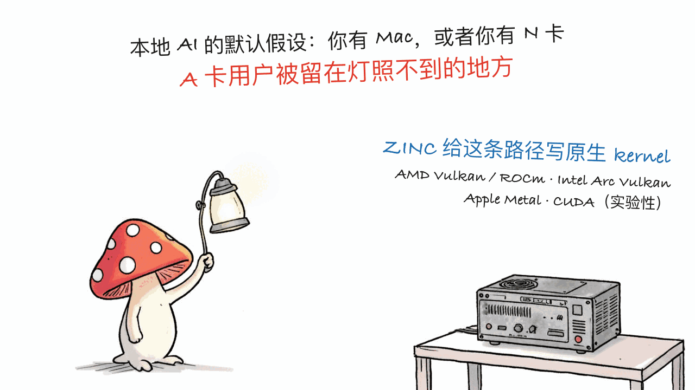

*by Mycelium Protocol*

---

项目地址：https://github.com/zolotukhin/zinc
官网与文档：https://zolotukhin.ai/zinc/docs/
完整 benchmark：https://zolotukhin.ai/zinc/benchmarks/#rdna-rocm
授权：MIT

---

## 一句话结论

**本站写过十几篇本地推理，几乎全压在 Apple Silicon 和 N 卡上——手里是 A 卡的人基本被当成二等公民。ZINC 正面处理这件事。** 它用 Zig 写成，编译出**一个二进制**，里面装着命令行、浏览器聊天界面、模型管理器和一套 OpenAI 兼容 API。512 stars、21 forks，MIT。官方给出的战果很克制：在 Radeon AI PRO R9700 + ROCm 上，六个模型的 prefill、decode 和合计耗时**全面快过**对照的 llama.cpp 构建。

代价也直白：**没有发布二进制，你得自己装 Zig 编译。**

## 先说它填的是哪块空白

翻一下本站已经发过的本地推理文章，会看到一个很明显的偏斜：

- rapid-mlx、apfel、turbo-fieldfare、swift-qwen3-tts —— **Apple Silicon / MLX**
- freetoken-flashml、各种 DeepSeek 本地部署 —— **消费级 N 卡或 Mac**

这不是本站的偏见，是整个本地 AI 生态的现状：MLX 有苹果撑着，CUDA 有英伟达撑着，**AMD 用户长期在 llama.cpp 的 Vulkan 后端和折腾 ROCm 之间二选一**。ZINC 的定位就是"给你手上已经有的那块显卡"——README 第一句话写的是 "for the GPUs people already own"。

支持的后端，按它自己的说法都是**原生 kernel，各自单独测**：

| GPU | 路径 |
|---|---|
| AMD Radeon | Vulkan 和 ROCm/HIP |
| Intel Arc | Vulkan |
| Apple Silicon | Metal |
| NVIDIA RTX | 实验性 CUDA |



## 那个 benchmark，以及它为什么值得信

先看结论：在 Radeon AI PRO R9700 用 ROCm 跑的核心测试集里，**六个模型的 prefill、decode 和合计时间，ZINC 全部快于对照的 llama.cpp 构建**。两边用同一块 GPU、同一批 GGUF 文件、同样的 prompt、复用的 server、同样的预热和实测运行次数。

比结论更值得说的是它**怎么表述**这个结论。README 原文：

> That is a scoped, reproducible result—not a claim about every model or GPU.
> （这是一个有限定范围的、可复现的结果，不是对所有模型和所有 GPU 的断言。）

然后把该给的都给了：完整的四种负载、原始样本、精确的 prompt、构建版本号，以及提交进仓库的 JSON（`site/src/data/zinc-performance.json`，跑分脚本是 `tools/performance_suite.mjs`）。连测量用的 Muse 检查点都指名到具体文件——Meta 发布的 `Muse-Glimmer-30B-KQuant-17GB-Q4_K_M.gguf`，而不是含糊地说"一个 30B 模型"。

最后那句尤其少见：

> ZINC is active engineering work. If a model or GPU path is incomplete, the benchmark page leaves that result visible instead of quietly dropping it.
> （ZINC 还在积极开发中。如果某个模型或 GPU 路径还不完整，benchmark 页面会把那个结果**留在那里**，而不是悄悄拿掉。）

**不删难看的数据**，这一条比"快了百分之多少"更能说明作者的可信度。本站前不久写 tare 时也提过同一个判断标准：一个性能声明值不值得信，看的是计量口径写没写清、语料给没给、失败案例留没留。ZINC 三条都过关。


## 装起来（这是它的门槛所在）

```bash
# 前提：Zig 0.15.2 或更新
#   Linux Vulkan 构建还需要 glslc 和 Vulkan loader
#   ROCm 构建需要装好 ROCm

git clone https://github.com/zolotukhin/zinc.git
cd zinc
zig build -Doptimize=ReleaseFast

./zig-out/bin/zinc --check                          # 检查环境
./zig-out/bin/zinc model pull qwen35-9b-q4k-m       # 从内置目录拉模型
./zig-out/bin/zinc --model-id qwen35-9b-q4k-m --prompt "Hello" --chat
```

要 AMD 原生 ROCm 后端的话，换个构建参数：

```bash
ROCM_PATH=/opt/rocm zig build -Dbackend=rocm -Doptimize=ReleaseFast
ROCR_VISIBLE_DEVICES=0 ./zig-out/bin/zinc --check
```

也可以直接指本地文件或 Hugging Face 仓库，不走它的模型目录：

```bash
./zig-out/bin/zinc -m /path/to/model.gguf --prompt "The capital of France is"
./zig-out/bin/zinc -hf Qwen/Qwen3-0.6B-GGUF:Q8_0 --prompt "Hello" --chat
```

**起服务**——这条命令同时拉起浏览器聊天界面和 OpenAI 兼容 API：

```bash
./zig-out/bin/zinc chat --model-id qwen35-9b-q4k-m
```

健康检查在 `/health`，模型列表和 chat completions 在 `/v1` 下。也就是说，**任何已经对着 OpenAI 接口写好的客户端都能直接指过来**——这是评估迁移成本时最实际的一条：你不用改应用代码，只改 base URL。

当前调优覆盖的模型：Qwen 3.5、Qwen 3.6、Qwen 3.8、Gemma 4、Muse Glimmer。

## 用 Zig 写这件事本身

选 Zig 不是炫技。对一个推理引擎来说，它带来两个实际后果：

- **单二进制分发，没有运行时依赖**。llama.cpp 生态里"编译一堆 flag、链一串库"的体验是有名的劝退，Zig 的交叉编译和构建系统在这件事上确实省心——尽管 ZINC 目前把这份省心留给了自己，还没转化成给用户的预编译包。
- **没有 cgo / C++ 那套构建链**，但仍然能直接调 C ABI（ROCm/HIP、Vulkan、Metal 都是 C 接口）。这正是推理引擎需要的位置：贴着硬件，但不用背 C++ 的构建复杂度。

## 现在能不能用？

**先看你是谁：**

- **手里是 AMD 显卡（尤其 RDNA 世代 + ROCm）**：值得试，这是目前少见的、专门为你这条路径做原生 kernel 并且拿出可复现数据的项目。
- **Intel Arc 用户**：有 Vulkan 路径，同样属于被主流忽略的群体，值得看看。
- **Mac 用户**：有 Metal 后端，但**本站已经写过的 MLX 系方案在苹果这条线上更成熟**，ZINC 对你的增量有限——除非你想要那套跨后端的一致体验。
- **N 卡用户**：CUDA 还是**实验性**的，现在没有理由换掉你已有的方案。

**几个必须说清的门槛：**

1. **没有发布二进制**。仓库的 releases 是空的，只能 `git clone` + `zig build`。要先装 Zig 0.15.2+，Linux 上走 Vulkan 还得有 `glslc` 和 Vulkan loader，走 ROCm 得有一套能用的 ROCm 安装。按本站"个人可及"这条标准，**它目前是不及格的**——不是因为设计，是因为分发还没做。
2. **benchmark 是单卡结论**。R9700 上的结果不自动推广到你手上那块 RX 卡，作者自己也这么说。验证成本对你是实打实的。
3. **还在积极开发中**。硬件指南里单独列了已验证的卡、驱动、显存要求和当前限制——动手前先去对一遍那张表。

## 一点判断

这篇的价值不在"比 llama.cpp 快多少"——单卡单套件的结论，换台机器就得重测。真正值得记的是两件事：

**一是这条路径终于有人认真做了。** 本地优先的前提是"用你已经有的硬件"，但过去两年的本地 AI 讨论基本默认你有 Mac 或者 N 卡。买了 A 卡的人不是少数，他们不该被默认排除在外。

**二是它示范了一个负责任的性能声明长什么样**：限定范围写在最前面、原始样本和脚本提交进仓库、指名到具体的模型文件、不完整的路径把结果留在页面上而不是删掉。这套做法本身比那六个模型的跑分更值得抄。

至于分发——等它出了预编译二进制再回来看一次。那时候它对普通用户的可及性会完全不同。

---

> © 2026 Author: Mycelium Protocol. 本文采用 [CC BY 4.0](https://creativecommons.org/licenses/by/4.0/deed.zh) 授权——欢迎转载和引用，须注明作者姓名及原文链接，不得去除署名后以原创发布。

<!--EN-->

*by Mycelium Protocol*

---

Repository: https://github.com/zolotukhin/zinc
Site and docs: https://zolotukhin.ai/zinc/docs/
Full benchmarks: https://zolotukhin.ai/zinc/benchmarks/#rdna-rocm
License: MIT

---

## TL;DR

**This blog has run a dozen-plus local-inference posts, nearly all of them on Apple Silicon or NVIDIA — leaving anyone holding an AMD card as a second-class citizen. ZINC addresses that head-on.** Written in Zig, it compiles to **one binary** containing a CLI, a browser chat UI, a model manager, and an OpenAI-compatible API. 512 stars, 21 forks, MIT. Its headline result is stated with restraint: on a Radeon AI PRO R9700 with ROCm, it **beats** the comparison llama.cpp build on prefill, decode, and combined time across all six models in the suite.

The cost is equally plain: **there are no release binaries — you install Zig and compile it yourself.**

## The gap it fills

Scan the local-inference posts already on this blog and the skew is obvious:

- rapid-mlx, apfel, turbo-fieldfare, swift-qwen3-tts — **Apple Silicon / MLX**
- freetoken-flashml, the various DeepSeek local deployments — **consumer NVIDIA or Mac**

That's not our bias; it's the state of the local-AI ecosystem. MLX has Apple behind it, CUDA has NVIDIA, and **AMD owners have long been choosing between llama.cpp's Vulkan backend and wrestling with ROCm**. ZINC's whole positioning is the card you already own — the README's first line is literally "for the GPUs people already own."

Its backends, each with native kernels and each measured separately:

| GPU | Path |
|---|---|
| AMD Radeon | Vulkan and ROCm/HIP |
| Intel Arc | Vulkan |
| Apple Silicon | Metal |
| NVIDIA RTX | experimental CUDA |


## The benchmark, and why it's credible

The result first: in the Radeon AI PRO R9700 ROCm core suite, **ZINC beats the comparison llama.cpp build on prefill, decode, and combined time for all six models**. Both engines use the same GPU, the same GGUF files, the same prompts, reusable servers, the same warmups, and the same measured run counts.

What's more notable than the result is **how it's stated**. From the README:

> That is a scoped, reproducible result—not a claim about every model or GPU.

And then it delivers what that promise requires: all four workloads, raw samples, exact prompts, build revisions, and checked-in JSON (`site/src/data/zinc-performance.json`, produced by `tools/performance_suite.mjs`). Even the Muse checkpoint used for measurement is named down to the file — Meta's `Muse-Glimmer-30B-KQuant-17GB-Q4_K_M.gguf`, not a vague "a 30B model."

The closing line is the rare part:

> ZINC is active engineering work. If a model or GPU path is incomplete, the benchmark page leaves that result visible instead of quietly dropping it.

**Not deleting the ugly data** says more about the author's credibility than any percentage. We applied the same standard to tare recently: whether a performance claim is worth believing comes down to whether the measurement basis is stated, the corpus is shipped, and the failures are left in. ZINC passes all three.


## Installing it (this is where the friction is)

```bash
# Prerequisites: Zig 0.15.2 or newer
#   Linux Vulkan builds also need glslc and a Vulkan loader
#   ROCm builds need a working ROCm installation

git clone https://github.com/zolotukhin/zinc.git
cd zinc
zig build -Doptimize=ReleaseFast

./zig-out/bin/zinc --check                          # check the environment
./zig-out/bin/zinc model pull qwen35-9b-q4k-m       # pull from the managed catalog
./zig-out/bin/zinc --model-id qwen35-9b-q4k-m --prompt "Hello" --chat
```

For the native AMD ROCm backend, change the build flag:

```bash
ROCM_PATH=/opt/rocm zig build -Dbackend=rocm -Doptimize=ReleaseFast
ROCR_VISIBLE_DEVICES=0 ./zig-out/bin/zinc --check
```

You can also point it straight at a local file or a Hugging Face repo, bypassing the catalog:

```bash
./zig-out/bin/zinc -m /path/to/model.gguf --prompt "The capital of France is"
./zig-out/bin/zinc -hf Qwen/Qwen3-0.6B-GGUF:Q8_0 --prompt "Hello" --chat
```

**Serving** — one command brings up both the browser chat and the OpenAI-compatible API:

```bash
./zig-out/bin/zinc chat --model-id qwen35-9b-q4k-m
```

Health checks live at `/health`; model listing and chat completions sit under `/v1`. Which means **any client already written against the OpenAI interface can point at it directly** — the most practical fact when weighing migration cost: you change a base URL, not your application code.

Currently tuned model coverage: Qwen 3.5, Qwen 3.6, Qwen 3.8, Gemma 4, and Muse Glimmer.

## On writing it in Zig

Choosing Zig isn't showing off. For an inference engine it has two concrete consequences:

- **Single-binary distribution with no runtime dependencies.** The llama.cpp ecosystem's "compile with a pile of flags and link a chain of libraries" experience is famously off-putting; Zig's cross-compilation and build system genuinely help here — though ZINC currently keeps that benefit for itself and hasn't yet turned it into prebuilt packages for users.
- **No cgo or C++ toolchain**, while still calling C ABIs directly (ROCm/HIP, Vulkan, and Metal are all C interfaces). That's exactly the position an inference engine wants: close to the hardware without carrying C++ build complexity.

## Can you use it today?

**Depends who you are:**

- **AMD GPU owners (especially RDNA-generation with ROCm)**: worth trying. This is a rare project writing native kernels for your path *and* publishing reproducible numbers for it.
- **Intel Arc owners**: there's a Vulkan path, and you're in the same overlooked group — worth a look.
- **Mac users**: there's a Metal backend, but **the MLX-based options we've already covered are more mature on Apple's side**. ZINC's marginal value for you is limited unless you specifically want one consistent engine across backends.
- **NVIDIA users**: CUDA is still **experimental**. No reason to switch from what you have.

**The friction you must account for:**

1. **No release binaries.** The releases page is empty; it's `git clone` plus `zig build`. You need Zig 0.15.2+, and on Linux either `glslc` plus a Vulkan loader, or a working ROCm install. Against this blog's "reachable by one person" standard, **it currently fails** — not by design, but because distribution hasn't been done yet.
2. **The benchmark is a single-card result.** R9700 numbers don't automatically transfer to whatever RX card you have, and the author says as much. The verification cost falls on you.
3. **It's active engineering work.** The hardware guide keeps validated cards, drivers, memory requirements, and current limitations in one place — check your setup against that table before starting.

## A closing judgment

The value here isn't "X% faster than llama.cpp" — a single-card, single-suite result has to be re-measured on different hardware anyway. Two other things are worth keeping:

**First, someone is finally doing this path seriously.** Local-first presupposes using the hardware you already have, yet two years of local-AI discourse has largely assumed you own a Mac or an NVIDIA card. People who bought AMD are not a rounding error, and they shouldn't be excluded by default.

**Second, it demonstrates what a responsible performance claim looks like**: scope stated up front, raw samples and scripts committed to the repo, the exact model file named, and incomplete paths left visible on the benchmark page rather than deleted. That practice is more worth copying than the six benchmark numbers.

As for distribution — check back once prebuilt binaries exist. Its accessibility to ordinary users will be a different story then.

---

> © 2026 Author: Mycelium Protocol. Licensed under [CC BY 4.0](https://creativecommons.org/licenses/by/4.0/) — free to share and adapt with attribution. You must credit the author and link to the original; removing attribution and republishing as original is not permitted.
